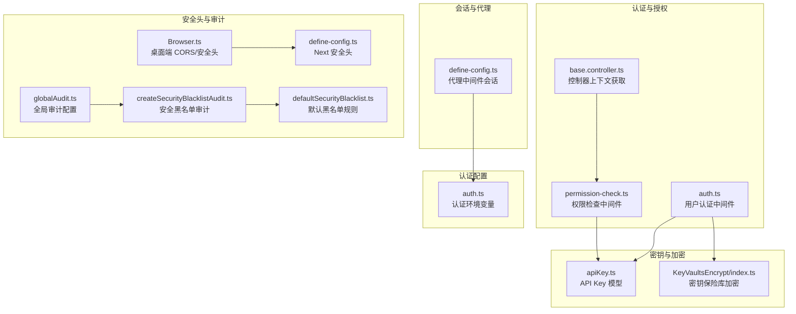
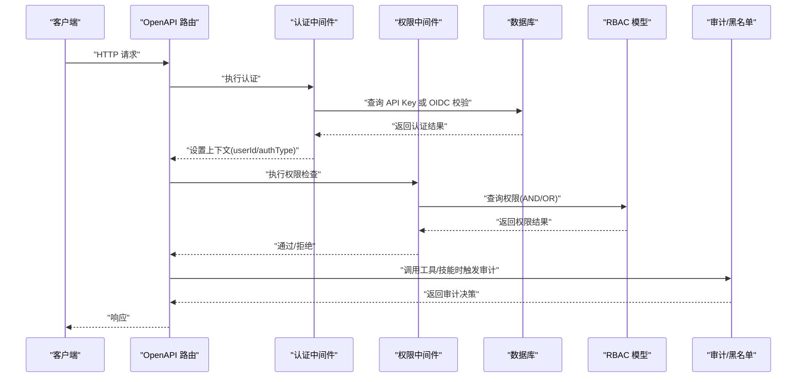
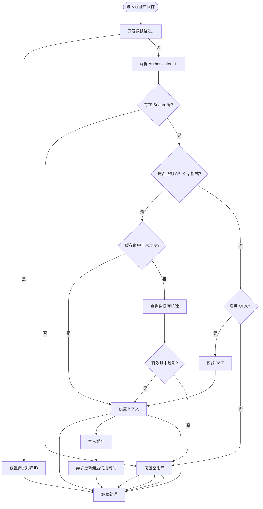
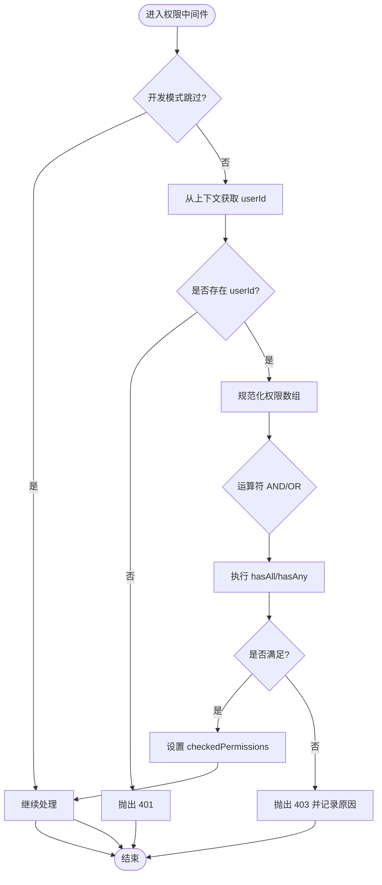
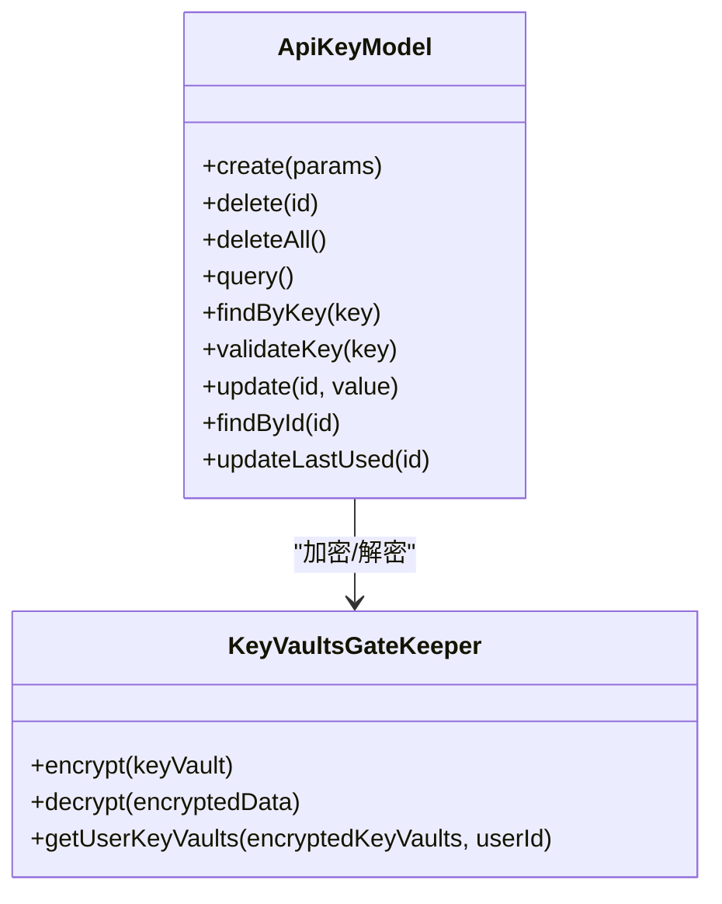
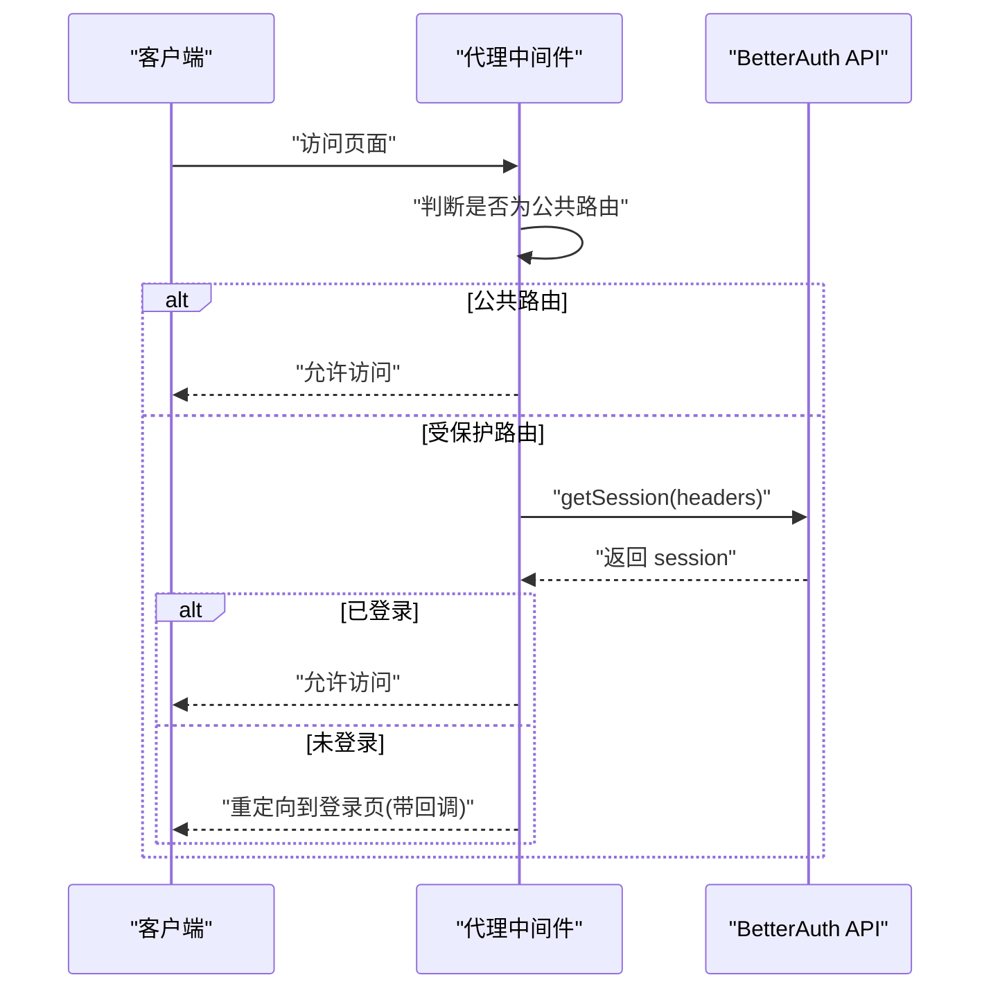
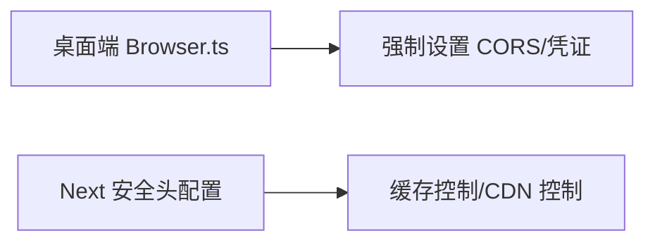
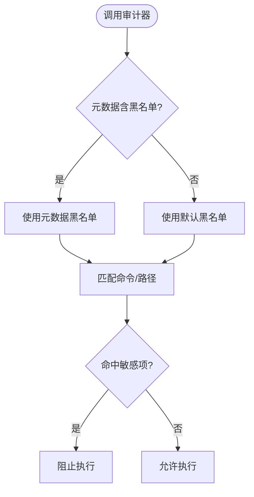
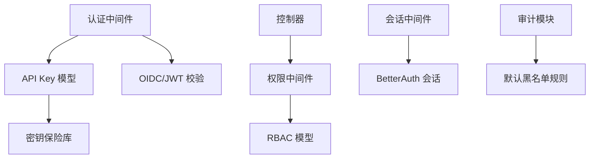

# API 安全与防护

<cite>
**本文引用的文件**
- [packages/openapi/src/middleware/auth.ts](file://packages/openapi/src/middleware/auth.ts)
- [packages/openapi/src/middleware/permission-check.ts](file://packages/openapi/src/middleware/permission-check.ts)
- [packages/openapi/src/common/base.controller.ts](file://packages/openapi/src/common/base.controller.ts)
- [packages/database/src/models/apiKey.ts](file://packages/database/src/models/apiKey.ts)
- [src/server/modules/KeyVaultsEncrypt/index.ts](file://src/server/modules/KeyVaultsEncrypt/index.ts)
- [src/envs/auth.ts](file://src/envs/auth.ts)
- [src/libs/next/proxy/define-config.ts](file://src/libs/next/proxy/define-config.ts)
- [docs/development/basic/architecture.zh-CN.mdx](file://docs/development/basic/architecture.zh-CN.mdx)
- [packages/agent-runtime/src/audit/globalAudit.ts](file://packages/agent-runtime/src/audit/globalAudit.ts)
- [packages/agent-runtime/src/audit/createSecurityBlacklistAudit.ts](file://packages/agent-runtime/src/audit/createSecurityBlacklistAudit.ts)
- [packages/agent-runtime/src/audit/defaultSecurityBlacklist.ts](file://packages/agent-runtime/src/audit/defaultSecurityBlacklist.ts)
- [packages/utils/src/client/apiKeyManager.ts](file://packages/utils/src/client/apiKeyManager.ts)
- [scripts/_shared/checkDeprecatedAuth.js](file://scripts/_shared/checkDeprecatedAuth.js)
- [apps/desktop/src/main/core/browser/Browser.ts](file://apps/desktop/src/main/core/browser/Browser.ts)
- [src/libs/next/config/define-config.ts](file://src/libs/next/config/define-config.ts)
</cite>

## 目录

1. [引言](#引言)
2. [项目结构](#项目结构)
3. [核心组件](#核心组件)
4. [架构总览](#架构总览)
5. [详细组件分析](#详细组件分析)
6. [依赖关系分析](#依赖关系分析)
7. [性能考量](#性能考量)
8. [故障排查指南](#故障排查指南)
9. [结论](#结论)
10. [附录](#附录)

## 引言

本文件面向 LobeHub 的 API 安全与防护，系统性梳理并总结项目中已实现的安全策略与实践，包括认证授权、输入校验、SQL 注入防护、XSS 防护、CSRF 保护、速率限制、IP 白名单、异常行为检测、数据加密传输、敏感信息脱敏、日志审计与安全监控、API 密钥管理、权限验证、会话安全与数据完整性保护等。同时提供安全配置示例、威胁模型分析、漏洞防护建议、应急响应流程、安全测试与渗透测试指南以及合规要求。

## 项目结构

围绕 API 安全的关键模块分布于 OpenAPI 中间件、数据库模型、密钥与加密、认证配置、代理与安全头、审计与黑名单等子系统。下图展示与安全相关的核心文件与交互关系。

**图表来源**

- [packages/openapi/src/middleware/auth.ts](file://packages/openapi/src/middleware/auth.ts#L1-L222)
- [packages/openapi/src/middleware/permission-check.ts](file://packages/openapi/src/middleware/permission-check.ts#L1-L171)
- [packages/openapi/src/common/base.controller.ts](file://packages/openapi/src/common/base.controller.ts#L148-L198)
- [packages/database/src/models/apiKey.ts](file://packages/database/src/models/apiKey.ts#L1-L118)
- [src/server/modules/KeyVaultsEncrypt/index.ts](file://src/server/modules/KeyVaultsEncrypt/index.ts#L1-L126)
- [src/envs/auth.ts](file://src/envs/auth.ts#L1-L303)
- [src/libs/next/proxy/define-config.ts](file://src/libs/next/proxy/define-config.ts#L203-L254)
- [apps/desktop/src/main/core/browser/Browser.ts](file://apps/desktop/src/main/core/browser/Browser.ts#L502-L539)
- [src/libs/next/config/define-config.ts](file://src/libs/next/config/define-config.ts#L107-L245)
- [packages/agent-runtime/src/audit/globalAudit.ts](file://packages/agent-runtime/src/audit/globalAudit.ts#L1-L7)
- [packages/agent-runtime/src/audit/createSecurityBlacklistAudit.ts](file://packages/agent-runtime/src/audit/createSecurityBlacklistAudit.ts)
- [packages/agent-runtime/src/audit/defaultSecurityBlacklist.ts](file://packages/agent-runtime/src/audit/defaultSecurityBlacklist.ts#L163-L222)

**章节来源**

- [packages/openapi/src/middleware/auth.ts](file://packages/openapi/src/middleware/auth.ts#L1-L222)
- [packages/openapi/src/middleware/permission-check.ts](file://packages/openapi/src/middleware/permission-check.ts#L1-L171)
- [packages/database/src/models/apiKey.ts](file://packages/database/src/models/apiKey.ts#L1-L118)
- [src/server/modules/KeyVaultsEncrypt/index.ts](file://src/server/modules/KeyVaultsEncrypt/index.ts#L1-L126)
- [src/envs/auth.ts](file://src/envs/auth.ts#L1-L303)
- [src/libs/next/proxy/define-config.ts](file://src/libs/next/proxy/define-config.ts#L203-L254)
- [apps/desktop/src/main/core/browser/Browser.ts](file://apps/desktop/src/main/core/browser/Browser.ts#L502-L539)
- [src/libs/next/config/define-config.ts](file://src/libs/next/config/define-config.ts#L107-L245)
- [packages/agent-runtime/src/audit/globalAudit.ts](file://packages/agent-runtime/src/audit/globalAudit.ts#L1-L7)
- [packages/agent-runtime/src/audit/createSecurityBlacklistAudit.ts](file://packages/agent-runtime/src/audit/createSecurityBlacklistAudit.ts)
- [packages/agent-runtime/src/audit/defaultSecurityBlacklist.ts](file://packages/agent-runtime/src/audit/defaultSecurityBlacklist.ts#L163-L222)

## 核心组件

- 认证中间件：支持 API Key 与 OIDC/JWT 双通道认证，具备缓存与最后使用时间更新能力。
- 权限中间件：基于 RBAC 的权限检查，支持 AND/OR 逻辑组合。
- API Key 模型：负责生成、存储、校验与解密 API Key，并进行过期与启用状态检查。
- 密钥保险库：基于 WebCrypto 的 AES-GCM 加密，密钥由环境变量加载与校验。
- 会话与代理：基于 BetterAuth 的会话保护与路由保护，支持公共 / 受保护路由区分。
- 安全头与审计：Next.js 侧安全头配置与桌面端 CORS / 安全头设置；运行时审计与默认安全黑名单。
- 审计与黑名单：全局审计配置与默认安全黑名单规则，覆盖敏感路径与命令。

**章节来源**

- [packages/openapi/src/middleware/auth.ts](file://packages/openapi/src/middleware/auth.ts#L49-L206)
- [packages/openapi/src/middleware/permission-check.ts](file://packages/openapi/src/middleware/permission-check.ts#L43-L129)
- [packages/database/src/models/apiKey.ts](file://packages/database/src/models/apiKey.ts#L29-L96)
- [src/server/modules/KeyVaultsEncrypt/index.ts](file://src/server/modules/KeyVaultsEncrypt/index.ts#L16-L102)
- [src/libs/next/proxy/define-config.ts](file://src/libs/next/proxy/define-config.ts#L203-L249)
- [src/libs/next/config/define-config.ts](file://src/libs/next/config/define-config.ts#L107-L245)
- [packages/agent-runtime/src/audit/globalAudit.ts](file://packages/agent-runtime/src/audit/globalAudit.ts#L5-L7)
- [packages/agent-runtime/src/audit/defaultSecurityBlacklist.ts](file://packages/agent-runtime/src/audit/defaultSecurityBlacklist.ts#L163-L222)

## 架构总览

下图展示从请求进入 API 层到权限与审计的完整链路，体现认证、授权、加密与审计的关键节点。

**图表来源**

- [packages/openapi/src/middleware/auth.ts](file://packages/openapi/src/middleware/auth.ts#L49-L206)
- [packages/openapi/src/middleware/permission-check.ts](file://packages/openapi/src/middleware/permission-check.ts#L43-L129)
- [packages/database/src/models/apiKey.ts](file://packages/database/src/models/apiKey.ts#L77-L96)
- [packages/agent-runtime/src/audit/globalAudit.ts](file://packages/agent-runtime/src/audit/globalAudit.ts#L5-L7)
- [packages/agent-runtime/src/audit/createSecurityBlacklistAudit.ts](file://packages/agent-runtime/src/audit/createSecurityBlacklistAudit.ts)

## 详细组件分析

### 认证中间件（API Key 与 OIDC）

- 支持两种认证方式：API Key（lb- 前缀）与 OIDC/JWT（当启用 ENABLE_OIDC 时）。
- 具备 5 分钟 TTL 的内存缓存，命中后直接放行并异步更新 “最后使用时间”。
- 认证失败不强制抛错，交由后续路由决定是否需要鉴权。
- 提供 requireAuth 辅助中间件用于强制鉴权。

**图表来源**

- [packages/openapi/src/middleware/auth.ts](file://packages/openapi/src/middleware/auth.ts#L49-L206)

**章节来源**

- [packages/openapi/src/middleware/auth.ts](file://packages/openapi/src/middleware/auth.ts#L49-L206)

### 权限中间件（RBAC）

- 从上下文读取 userId，构造 RBAC 模型进行权限校验。
- 支持单权限、任意满足（OR）、全部满足（AND）三种模式。
- 未认证时统一返回 401，权限不足返回 403，并记录操作符与所需权限。

**图表来源**

- [packages/openapi/src/middleware/permission-check.ts](file://packages/openapi/src/middleware/permission-check.ts#L43-L129)

**章节来源**

- [packages/openapi/src/middleware/permission-check.ts](file://packages/openapi/src/middleware/permission-check.ts#L43-L129)

### API Key 模型与密钥保险库

- 生成 API Key 后仅保存哈希与加密后的明文，查询时解密并校验启用状态与有效期。
- 密钥保险库采用 AES-GCM，IV 与认证标签与密文拼接存储，解密失败时返回不可信标记。
- 环境变量 KEY_VAULTS_SECRET 必须设置且长度合法（16/24/32 字节），否则初始化失败。

**图表来源**

- [packages/database/src/models/apiKey.ts](file://packages/database/src/models/apiKey.ts#L11-L118)
- [src/server/modules/KeyVaultsEncrypt/index.ts](file://src/server/modules/KeyVaultsEncrypt/index.ts#L9-L126)

**章节来源**

- [packages/database/src/models/apiKey.ts](file://packages/database/src/models/apiKey.ts#L29-L96)
- [src/server/modules/KeyVaultsEncrypt/index.ts](file://src/server/modules/KeyVaultsEncrypt/index.ts#L16-L102)

### 会话与代理（BetterAuth）

- 代理中间件根据路由是否为公共路由决定是否进行会话校验。
- 对受保护路由未登录时重定向至登录页，保留回调地址与语言参数。
- 支持 NOAUTH_MODE 下跳过认证（自托管调试场景）。

**图表来源**

- [src/libs/next/proxy/define-config.ts](file://src/libs/next/proxy/define-config.ts#L203-L249)

**章节来源**

- [src/libs/next/proxy/define-config.ts](file://src/libs/next/proxy/define-config.ts#L203-L249)

### 安全头与跨域（桌面端与 Next.js）

- 桌面端浏览器内核在发送请求前移除 Origin 并注入必要 Cookie，响应阶段强制设置 CORS 与凭证。
- Next.js 侧配置安全头（如缓存控制、CDN 缓存控制等），提升静态资源安全性与一致性。

**图表来源**

- [apps/desktop/src/main/core/browser/Browser.ts](file://apps/desktop/src/main/core/browser/Browser.ts#L502-L539)
- [src/libs/next/config/define-config.ts](file://src/libs/next/config/define-config.ts#L107-L245)

**章节来源**

- [apps/desktop/src/main/core/browser/Browser.ts](file://apps/desktop/src/main/core/browser/Browser.ts#L502-L539)
- [src/libs/next/config/define-config.ts](file://src/libs/next/config/define-config.ts#L107-L245)

### 审计与安全黑名单

- 全局审计配置聚合默认安全黑名单审计器。
- 默认黑名单覆盖敏感文件路径（.env、.ssh 私钥、AWS 凭证等）与常见危险命令模式。
- 审计器可从工具元数据读取黑名单，若缺失则回退到默认列表。

**图表来源**

- [packages/agent-runtime/src/audit/globalAudit.ts](file://packages/agent-runtime/src/audit/globalAudit.ts#L5-L7)
- [packages/agent-runtime/src/audit/createSecurityBlacklistAudit.ts](file://packages/agent-runtime/src/audit/createSecurityBlacklistAudit.ts)
- [packages/agent-runtime/src/audit/defaultSecurityBlacklist.ts](file://packages/agent-runtime/src/audit/defaultSecurityBlacklist.ts#L163-L222)

**章节来源**

- [packages/agent-runtime/src/audit/globalAudit.ts](file://packages/agent-runtime/src/audit/globalAudit.ts#L5-L7)
- [packages/agent-runtime/src/audit/defaultSecurityBlacklist.ts](file://packages/agent-runtime/src/audit/defaultSecurityBlacklist.ts#L163-L222)

## 依赖关系分析

- 认证中间件依赖 API Key 模型与 OIDC JWT 校验；API Key 模型依赖密钥保险库进行加解密。
- 权限中间件依赖 RBAC 模型与数据库连接；控制器通过上下文获取用户信息。
- 会话中间件依赖 BetterAuth 会话 API；安全头配置分别作用于桌面端与 Next.js。
- 审计模块独立于业务逻辑，通过工具元数据与默认规则共同构成安全防线。

**图表来源**

- [packages/openapi/src/middleware/auth.ts](file://packages/openapi/src/middleware/auth.ts#L49-L206)
- [packages/database/src/models/apiKey.ts](file://packages/database/src/models/apiKey.ts#L29-L96)
- [src/server/modules/KeyVaultsEncrypt/index.ts](file://src/server/modules/KeyVaultsEncrypt/index.ts#L16-L102)
- [packages/openapi/src/middleware/permission-check.ts](file://packages/openapi/src/middleware/permission-check.ts#L43-L129)
- [packages/openapi/src/common/base.controller.ts](file://packages/openapi/src/common/base.controller.ts#L148-L198)
- [src/libs/next/proxy/define-config.ts](file://src/libs/next/proxy/define-config.ts#L203-L249)
- [packages/agent-runtime/src/audit/defaultSecurityBlacklist.ts](file://packages/agent-runtime/src/audit/defaultSecurityBlacklist.ts#L163-L222)

**章节来源**

- [packages/openapi/src/middleware/auth.ts](file://packages/openapi/src/middleware/auth.ts#L49-L206)
- [packages/openapi/src/middleware/permission-check.ts](file://packages/openapi/src/middleware/permission-check.ts#L43-L129)
- [packages/database/src/models/apiKey.ts](file://packages/database/src/models/apiKey.ts#L29-L96)
- [src/server/modules/KeyVaultsEncrypt/index.ts](file://src/server/modules/KeyVaultsEncrypt/index.ts#L16-L102)
- [packages/openapi/src/common/base.controller.ts](file://packages/openapi/src/common/base.controller.ts#L148-L198)
- [src/libs/next/proxy/define-config.ts](file://src/libs/next/proxy/define-config.ts#L203-L249)
- [packages/agent-runtime/src/audit/defaultSecurityBlacklist.ts](file://packages/agent-runtime/src/audit/defaultSecurityBlacklist.ts#L163-L222)

## 性能考量

- 认证中间件对 API Key 进行 5 分钟缓存，显著降低数据库压力与延迟。
- 权限检查在受保护路由上按需执行，避免不必要的数据库查询。
- 密钥保险库使用硬件加速的 WebCrypto，加密 / 解密性能良好。
- 审计模块在工具调用时触发，建议在高频场景下减少复杂规则匹配。

\[本节为通用指导，无需列出具体文件来源]

## 故障排查指南

- 认证失败
  - 检查 Authorization 头格式与 OIDC 是否启用。
  - 查看认证中间件日志定位 API Key 缓存命中 / 数据库查询路径。
- 权限不足
  - 确认用户权限集合与运算符（AND/OR）配置。
  - 检查 RBAC 模型是否正确返回 hasAll/hasAny 结果。
- API Key 解密失败
  - 确认 KEY_VAULTS_SECRET 是否设置、长度是否合法。
  - 检查密钥保险库解密返回的可信标记。
- 会话未登录重定向
  - 确认 BetterAuth 会话接口返回是否包含用户信息。
  - 检查 NOAUTH_MODE 与公共路由判定逻辑。
- 安全头 / CORS 问题
  - 桌面端是否正确移除 Origin 并设置 CORS。
  - Next.js 安全头是否覆盖到目标路径。

**章节来源**

- [packages/openapi/src/middleware/auth.ts](file://packages/openapi/src/middleware/auth.ts#L169-L206)
- [packages/openapi/src/middleware/permission-check.ts](file://packages/openapi/src/middleware/permission-check.ts#L54-L103)
- [src/server/modules/KeyVaultsEncrypt/index.ts](file://src/server/modules/KeyVaultsEncrypt/index.ts#L16-L102)
- [src/libs/next/proxy/define-config.ts](file://src/libs/next/proxy/define-config.ts#L203-L249)
- [apps/desktop/src/main/core/browser/Browser.ts](file://apps/desktop/src/main/core/browser/Browser.ts#L502-L539)

## 结论

LobeHub 在 API 安全方面形成了 “认证（API Key/OIDC）+ 授权（RBAC）+ 加密（密钥保险库）+ 会话（BetterAuth）+ 审计（黑名单）+ 安全头” 的多层防护体系。通过缓存与最小权限原则降低风险，结合严格的密钥管理与审计机制，保障了 API 的安全性与可靠性。建议在生产环境中持续完善速率限制、IP 白名单与异常行为检测，并定期进行安全测试与渗透评估。

\[本节为总结性内容，无需列出具体文件来源]

## 附录

### 安全策略与防护清单

- SQL 注入防护：Drizzle ORM 参数化查询，避免原生 SQL 拼接。
- XSS 防护：内容安全策略（CSP）与输出净化。
- CSRF 防护：SameSite Cookie 与 Token 验证。
- SSRF 防护：插件与 MCP 调用出站请求白名单。
- 密钥管理：API Key 与凭据以环境变量存储，密钥保险库加密。
- 速率限制：边缘层限流（参考架构文档）。
- 日志审计与监控：中间件日志、审计模块与安全头配置。

**章节来源**

- [docs/development/basic/architecture.zh-CN.mdx](file://docs/development/basic/architecture.zh-CN.mdx#L131-L139)

### 安全配置示例（摘自环境变量）

- 认证与 OIDC
  - AUTH_SECRET、JWKS_KEY、ENABLE_OIDC、AUTH\_\* 各提供商 ID/Secret。
- 数据库与密钥
  - DATABASE_URL、KEY_VAULTS_SECRET。
- 平台与对象存储
  - S3_ACCESS_KEY_ID、S3_SECRET_ACCESS_KEY、S3_BUCKET、S3_ENDPOINT、S3_REGION。

**章节来源**

- [src/envs/auth.ts](file://src/envs/auth.ts#L107-L294)
- [docs/self-hosting/platform/vercel.mdx](file://docs/self-hosting/platform/vercel.mdx#L316-L338)

### 威胁模型与漏洞防护

- 威胁模型
  - 未授权访问：通过 requireAuth 与权限中间件阻断。
  - 权限提升：RBAC 严格控制资源访问范围。
  - 数据泄露：API Key 仅保存哈希与密文，密钥保险库 AES-GCM 加密。
  - 会话劫持：BetterAuth 会话保护与公共 / 受保护路由分离。
  - 供应链攻击：审计模块对敏感命令与路径进行拦截。
- 漏洞防护建议
  - 强制启用 OIDC 并缩短 INTERNAL_JWT_EXPIRATION。
  - 实施边缘层速率限制与 IP 白名单。
  - 引入异常行为检测（如异常时间 / 频次 / 地理）。
  - 定期轮换 KEY_VAULTS_SECRET 与各提供商密钥。

**章节来源**

- [packages/openapi/src/middleware/auth.ts](file://packages/openapi/src/middleware/auth.ts#L49-L206)
- [packages/openapi/src/middleware/permission-check.ts](file://packages/openapi/src/middleware/permission-check.ts#L43-L129)
- [packages/database/src/models/apiKey.ts](file://packages/database/src/models/apiKey.ts#L29-L96)
- [src/server/modules/KeyVaultsEncrypt/index.ts](file://src/server/modules/KeyVaultsEncrypt/index.ts#L16-L102)
- [src/libs/next/proxy/define-config.ts](file://src/libs/next/proxy/define-config.ts#L203-L249)
- [packages/agent-runtime/src/audit/defaultSecurityBlacklist.ts](file://packages/agent-runtime/src/audit/defaultSecurityBlacklist.ts#L163-L222)

### 应急响应流程

- 发现异常
  - 检查认证 / 权限中间件日志与审计模块输出。
  - 核对 API Key 状态与密钥保险库解密结果。
- 快速处置
  - 冻结受影响 API Key，轮换 KEY_VAULTS_SECRET。
  - 临时关闭 OIDC 或收紧权限范围。
- 复盘与加固
  - 补充边缘层限流与 IP 白名单。
  - 引入异常行为检测与告警。

**章节来源**

- [packages/openapi/src/middleware/auth.ts](file://packages/openapi/src/middleware/auth.ts#L169-L206)
- [packages/database/src/models/apiKey.ts](file://packages/database/src/models/apiKey.ts#L51-L96)
- [src/server/modules/KeyVaultsEncrypt/index.ts](file://src/server/modules/KeyVaultsEncrypt/index.ts#L68-L102)

### 安全测试与渗透测试指南

- 单元测试
  - API Key 模型解密错误、格式校验、过期与启用状态。
- 集成测试
  - 认证中间件缓存命中 / 过期、权限中间件 AND/OR 场景。
- 渗透测试
  - 尝试越权访问、暴力破解 API Key、绕过 OIDC、CORS/CSRF 攻击、敏感路径读取。

**章节来源**

- [packages/database/src/models/**tests**/apiKey.test.ts](file://packages/database/src/models/__tests__/apiKey.test.ts#L174-L183)
- [packages/openapi/src/middleware/permission-check.ts](file://packages/openapi/src/middleware/permission-check.ts#L82-L103)

### 安全合规要求

- 环境变量检查
  - 使用脚本检查弃用 / 缺失配置，确保关键变量齐全。
- 文档与审计
  - 保持安全头与审计策略文档化，定期复核。

**章节来源**

- [scripts/\_shared/checkDeprecatedAuth.js](file://scripts/_shared/checkDeprecatedAuth.js#L235-L299)
