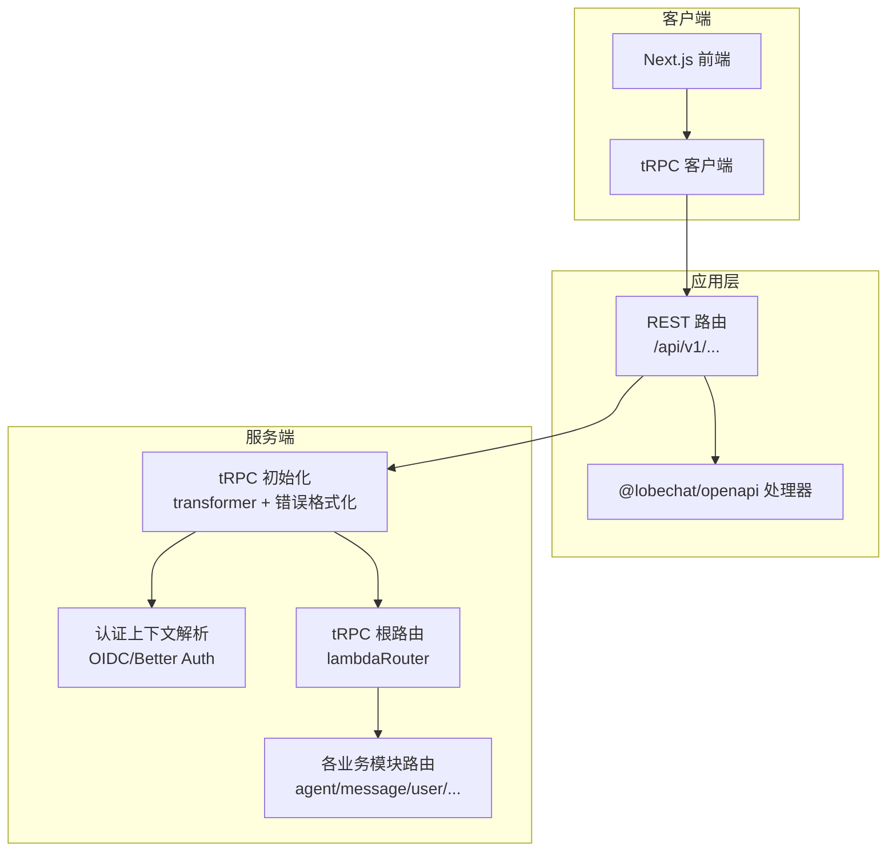
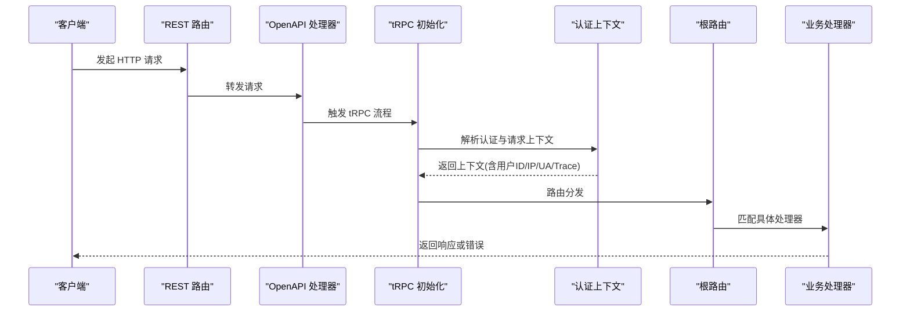
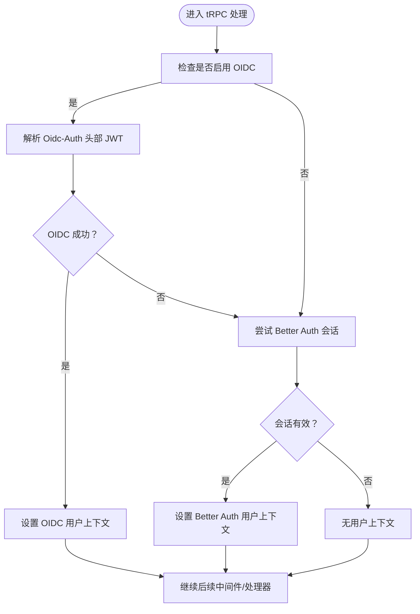
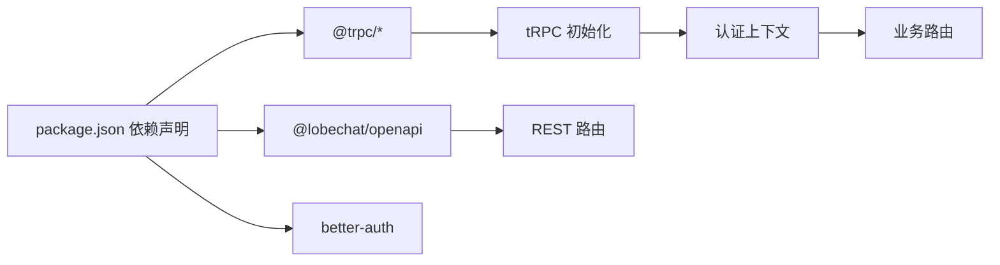

# API 接口文档

<cite>
**本文引用的文件**
- [package.json](file://package.json)
- [src/libs/trpc/lambda/init.ts](file://src/libs/trpc/lambda/init.ts)
- [src/libs/trpc/lambda/context.ts](file://src/libs/trpc/lambda/context.ts)
- [src/libs/trpc/lambda/middleware/oidcAuth.ts](file://src/libs/trpc/lambda/middleware/oidcAuth.ts)
- [src/libs/trpc/utils/responseMeta.ts](file://src/libs/trpc/utils/responseMeta.ts)
- [src/libs/trpc/lambda/index.ts](file://src/libs/trpc/lambda/index.ts)
- [src/server/routers/lambda/index.ts](file://src/server/routers/lambda/index.ts)
- [src/server/routers/lambda/apiKey.ts](file://src/server/routers/lambda/apiKey.ts)
- [src/server/routers/lambda/agent.ts](file://src/server/routers/lambda/agent.ts)
- [src/server/routers/lambda/message.ts](file://src/server/routers/lambda/message.ts)
- [src/server/routers/lambda/user.ts](file://src/server/routers/lambda/user.ts)
- [src/app/(backend)/api/v1/[[...route]]/route.ts](file://src/app/(backend)/api/v1/[[...route]]/route.ts)
</cite>

## 目录

1. [简介](#简介)
2. [项目结构](#项目结构)
3. [核心组件](#核心组件)
4. [架构总览](#架构总览)
5. [详细组件分析](#详细组件分析)
6. [依赖关系分析](#依赖关系分析)
7. [性能与可扩展性](#性能与可扩展性)
8. [故障排查指南](#故障排查指南)
9. [结论](#结论)
10. [附录](#附录)

## 简介

本文件为 LobeHub 项目的完整 API 接口文档，覆盖 tRPC 后端接口规范、REST API 设计、认证与授权机制、错误码定义、版本管理与兼容性策略、安全与性能优化、客户端集成指南以及实时通信相关能力。文档面向不同技术背景的读者，既提供高层概览，也包含代码级细节与可视化图示。

## 项目结构

LobeHub 的 API 分层清晰：前端 Next.js 应用通过 tRPC 客户端调用后端 tRPC 路由；同时在应用层提供基于 OpenAPI 的 REST 入口，统一转发到 OpenAPI 处理器。认证上下文在 tRPC 上下文中解析，支持 OIDC 与 Better Auth 双重认证路径，并提供响应元数据用于桌面端代理协议识别。

图表来源

- [src/app/(backend)/api/v1/\[\[...route\]\]/route.ts](<file://src/app/(backend)/api/v1/[[...route]]/route.ts#L1-L13>)
- [src/libs/trpc/lambda/init.ts](file://src/libs/trpc/lambda/init.ts#L1-L34)
- [src/libs/trpc/lambda/context.ts](file://src/libs/trpc/lambda/context.ts#L1-L200)
- [src/libs/trpc/lambda/index.ts](file://src/libs/trpc/lambda/index.ts#L1-L37)
- [src/server/routers/lambda/index.ts](file://src/server/routers/lambda/index.ts#L1-L110)

章节来源

- [package.json](file://package.json#L158-L404)
- [src/app/(backend)/api/v1/\[\[...route\]\]/route.ts](<file://src/app/(backend)/api/v1/[[...route]]/route.ts#L1-L13>)
- [src/libs/trpc/lambda/init.ts](file://src/libs/trpc/lambda/init.ts#L1-L34)
- [src/libs/trpc/lambda/context.ts](file://src/libs/trpc/lambda/context.ts#L1-L200)
- [src/libs/trpc/lambda/index.ts](file://src/libs/trpc/lambda/index.ts#L1-L37)
- [src/server/routers/lambda/index.ts](file://src/server/routers/lambda/index.ts#L1-L110)

## 核心组件

- tRPC 初始化与数据转换
  - 使用 superjson 作为 transformer，提升复杂类型序列化一致性。
  - 自定义错误格式化，透传底层错误数据字段。
- 认证上下文
  - 支持 NOAUTH 模式、开发调试模式、OIDC JWT 验证、Better Auth 会话解析。
  - 提取客户端 IP、User-Agent、Trace 上下文，注入到请求上下文。
- 中间件与响应元数据
  - OIDC 认证中间件与用户认证中间件串联。
  - 响应头中注入 “需要认证” 标记，便于桌面端代理协议区分真实鉴权失败与其他 401 场景。
- REST 入口
  - 统一将所有 HTTP 方法转发至 @lobechat/openapi 处理器，实现 OpenAPI 驱动的 REST API。

章节来源

- [src/libs/trpc/lambda/init.ts](file://src/libs/trpc/lambda/init.ts#L1-L34)
- [src/libs/trpc/lambda/context.ts](file://src/libs/trpc/lambda/context.ts#L1-L200)
- [src/libs/trpc/lambda/middleware/oidcAuth.ts](file://src/libs/trpc/lambda/middleware/oidcAuth.ts#L1-L14)
- [src/libs/trpc/utils/responseMeta.ts](file://src/libs/trpc/utils/responseMeta.ts#L1-L40)
- [src/app/(backend)/api/v1/\[\[...route\]\]/route.ts](<file://src/app/(backend)/api/v1/[[...route]]/route.ts#L1-L13>)

## 架构总览

下图展示从客户端到 tRPC 路由的关键调用链路，包括认证、上下文构建、OpenAPI REST 转发与 tRPC 调用。

图表来源

- [src/app/(backend)/api/v1/\[\[...route\]\]/route.ts](<file://src/app/(backend)/api/v1/[[...route]]/route.ts#L1-L13>)
- [src/libs/trpc/lambda/init.ts](file://src/libs/trpc/lambda/init.ts#L1-L34)
- [src/libs/trpc/lambda/context.ts](file://src/libs/trpc/lambda/context.ts#L1-L200)
- [src/libs/trpc/lambda/index.ts](file://src/libs/trpc/lambda/index.ts#L1-L37)
- [src/server/routers/lambda/index.ts](file://src/server/routers/lambda/index.ts#L1-L110)

## 详细组件分析

### tRPC 根路由与模块化组织

- 根路由聚合多个业务模块（agent、message、user、apiKey、aiAgent、knowledgeBase 等），形成统一入口。
- 每个模块通过 authedProcedure 或 publicProcedure 定义受保护或公开的端点。
- 提供健康检查端点，便于运维监控。

章节来源

- [src/server/routers/lambda/index.ts](file://src/server/routers/lambda/index.ts#L1-L110)
- [src/libs/trpc/lambda/index.ts](file://src/libs/trpc/lambda/index.ts#L1-L37)

### 认证与授权机制

- OIDC 认证优先：当启用 OIDC 时，优先校验自定义 Oidc-Auth 头部的 JWT，成功则直接注入用户信息。
- Better Auth 降级：若 OIDC 失败或未启用，则尝试 Better Auth 会话解析。
- 用户认证中间件：确保上下文包含 userId，否则返回 UNAUTHORIZED。
- 响应元数据：对 UNAUTHORIZED 错误附加 “需要认证” 头部，便于桌面端代理协议识别。

图表来源

- [src/libs/trpc/lambda/context.ts](file://src/libs/trpc/lambda/context.ts#L132-L199)
- [src/libs/trpc/lambda/middleware/oidcAuth.ts](file://src/libs/trpc/lambda/middleware/oidcAuth.ts#L1-L14)
- [src/libs/trpc/utils/responseMeta.ts](file://src/libs/trpc/utils/responseMeta.ts#L1-L40)

章节来源

- [src/libs/trpc/lambda/context.ts](file://src/libs/trpc/lambda/context.ts#L1-L200)
- [src/libs/trpc/lambda/middleware/oidcAuth.ts](file://src/libs/trpc/lambda/middleware/oidcAuth.ts#L1-L14)
- [src/libs/trpc/utils/responseMeta.ts](file://src/libs/trpc/utils/responseMeta.ts#L1-L40)

### REST API 设计与 OpenAPI 集成

- 所有 HTTP 方法（GET/POST/PUT/DELETE/PATCH/OPTIONS/HEAD）均转发至 @lobechat/openapi 处理器。
- 该设计使 REST API 与 OpenAPI 规范保持一致，便于生成客户端 SDK 与文档。

章节来源

- [src/app/(backend)/api/v1/\[\[...route\]\]/route.ts](<file://src/app/(backend)/api/v1/[[...route]]/route.ts#L1-L13>)

### API 端点清单与规范

#### 健康检查

- 方法与路径
  - GET /api/v1/health
- 权限
  - 公开访问
- 响应
  - 文本字符串，表示服务存活状态
- 示例
  - curl -i <https://your-domain/api/v1/health>

章节来源

- [src/server/routers/lambda/index.ts](file://src/server/routers/lambda/index.ts#L78-L78)

#### 用户相关

- 获取用户初始化状态
  - 方法与路径
    - GET /api/v1/user/state
  - 权限
    - 需要登录
  - 输入
    - 无
  - 输出
    - 用户初始化状态对象（包含偏好、设置、订阅计划等）
  - 错误
    - UNAUTHORIZED：未登录
- 更新用户偏好
  - 方法与路径
    - POST /api/v1/user/preference
  - 权限
    - 需要登录
  - 输入
    - 用户偏好对象（Zod 校验）
  - 输出
    - 更新后的用户偏好
  - 错误
    - UNAUTHORIZED：未登录
- 更新用户设置
  - 方法与路径
    - POST /api/v1/user/settings
  - 权限
    - 需要登录
  - 输入
    - 用户设置对象（Zod 校验）
  - 输出
    - 更新后的用户设置
  - 错误
    - UNAUTHORIZED：未登录
- 更新用户名 / 全名 / 兴趣 / 引导状态等
  - 方法与路径
    - POST /api/v1/user/fullName
    - POST /api/v1/user/username
    - POST /api/v1/user/interests
    - POST /api/v1/user/guide
    - POST /api/v1/user/onboarding
  - 权限
    - 需要登录
  - 输入
    - 对应字段的值（Zod 校验）
  - 输出
    - 更新结果
  - 错误
    - UNAUTHORIZED：未登录

章节来源

- [src/server/routers/lambda/user.ts](file://src/server/routers/lambda/user.ts#L47-L200)

#### 消息与话题

- 创建消息
  - 方法与路径
    - POST /api/v1/message
  - 权限
    - 需要登录
  - 输入
    - 消息创建参数（Zod 校验）
  - 输出
    - 新建消息对象
  - 错误
    - UNAUTHORIZED：未登录
- 获取消息列表（公开分享）
  - 方法与路径
    - GET /api/v1/message
  - 权限
    - 公开访问（支持通过分享 ID 访问）
  - 输入
    - 查询参数（agentId/sessionId/threadId/topicId/topicShareId 等）
  - 输出
    - 消息列表
  - 错误
    - FORBIDDEN/NOT_FOUND：权限不足或资源不存在
- 压缩 / 解压消息组
  - 方法与路径
    - POST /api/v1/message/compression/create
    - POST /api/v1/message/compression/finalize
    - POST /api/v1/message/compression/cancel
  - 权限
    - 需要登录
  - 输入
    - 压缩组参数（Zod 校验）
  - 输出
    - 压缩结果或摘要
  - 错误
    - UNAUTHORIZED：未登录

章节来源

- [src/server/routers/lambda/message.ts](file://src/server/routers/lambda/message.ts#L135-L200)

#### 代理与会话

- 创建代理并关联会话
  - 方法与路径
    - POST /api/v1/agent
  - 权限
    - 需要登录
  - 输入
    - 代理配置与分组 ID（Zod 校验）
  - 输出
    - { agentId, sessionId }
  - 错误
    - UNAUTHORIZED：未登录
- 复制代理
  - 方法与路径
    - POST /api/v1/agent/duplicate
  - 权限
    - 需要登录
  - 输入
    - 代理 ID 与新标题（Zod 校验）
  - 输出
    - { agentId, sessionId }
  - 错误
    - UNAUTHORIZED：未登录
- 关联 / 移除代理文件 / 知识库
  - 方法与路径
    - POST /api/v1/agent/{agentId}/files
    - POST /api/v1/agent/{agentId}/knowledge-base
    - DELETE /api/v1/agent/{agentId}/files/{fileId}
    - DELETE /api/v1/agent/{agentId}/knowledge-base/{kbId}
  - 权限
    - 需要登录
  - 输入
    - 对应资源 ID 与启用状态（Zod 校验）
  - 输出
    - 关联 / 移除结果
  - 错误
    - UNAUTHORIZED：未登录

章节来源

- [src/server/routers/lambda/agent.ts](file://src/server/routers/lambda/agent.ts#L50-L170)

#### API Key 管理

- 创建 API Key
  - 方法与路径
    - POST /api/v1/api-key
  - 权限
    - 需要登录
  - 输入
    - { name, expiresAt? }
  - 输出
    - 新建 API Key 信息
  - 错误
    - UNAUTHORIZED：未登录
- 查询 API Keys
  - 方法与路径
    - GET /api/v1/api-key
  - 权限
    - 需要登录
  - 输入
    - 无
  - 输出
    - API Key 列表
  - 错误
    - UNAUTHORIZED：未登录
- 删除 API Key
  - 方法与路径
    - DELETE /api/v1/api-key/{id}
  - 权限
    - 需要登录
  - 输入
    - id
  - 输出
    - 删除结果
  - 错误
    - UNAUTHORIZED：未登录
- 校验 API Key
  - 方法与路径
    - GET /api/v1/api-key/validate
  - 权限
    - 需要登录
  - 输入
    - key
  - 输出
    - 校验结果
  - 错误
    - UNAUTHORIZED：未登录

章节来源

- [src/server/routers/lambda/apiKey.ts](file://src/server/routers/lambda/apiKey.ts#L17-L77)

### 错误码与响应规范

- tRPC 错误格式化
  - 当底层错误包含 cause.data 时，将其合并到响应的 data 字段，便于前端获取更细粒度的错误信息。
- UNAUTHORIZED 标记
  - 当出现 UNAUTHORIZED 错误时，在响应头中设置 “需要认证” 标记，帮助桌面端代理协议区分真实鉴权失败与其他 401 场景。
- 常见错误
  - UNAUTHORIZED：未登录或会话无效
  - FORBIDDEN：权限不足
  - NOT_FOUND：资源不存在
  - BAD_REQUEST：请求参数不合法

章节来源

- [src/libs/trpc/lambda/init.ts](file://src/libs/trpc/lambda/init.ts#L19-L28)
- [src/libs/trpc/utils/responseMeta.ts](file://src/libs/trpc/utils/responseMeta.ts#L20-L40)

### 版本管理与兼容性

- 版本号
  - 项目版本号在根包配置中维护，当前版本为 2.x。
- 兼容性策略
  - 采用语义化版本控制，重大变更通过主版本号升级体现。
  - tRPC 接口以模块化路由组织，新增端点尽量复用现有中间件与上下文，降低破坏性变更风险。
- 废弃与迁移
  - 通过变更日志与文档记录废弃端点与迁移步骤，建议客户端在升级前进行兼容性测试。

章节来源

- [package.json](file://package.json#L3-L4)

### 安全考虑

- 认证与授权
  - 优先使用 OIDC JWT，失败时回退到 Better Auth 会话。
  - 在 NOAUTH 模式下仅用于自托管部署，生产环境不建议开启。
- 请求头与上下文
  - 提取并记录客户端 IP、User-Agent、Trace 上下文，便于审计与追踪。
- 响应头
  - 对 UNAUTHORIZED 错误添加 “需要认证” 标记，避免与无效密钥等场景混淆。

章节来源

- [src/libs/trpc/lambda/context.ts](file://src/libs/trpc/lambda/context.ts#L84-L199)
- [src/libs/trpc/utils/responseMeta.ts](file://src/libs/trpc/utils/responseMeta.ts#L20-L40)

### 实时通信与 WebSocket

- 当前仓库未发现显式的 WebSocket 服务端实现或 tRPC 实时订阅端点。
- 若需实时通信，建议在业务模块中引入 SSE 或 WebSocket 适配层，并通过 tRPC 事件通道进行桥接。

\[本节为概念性说明，不直接分析具体源文件]

## 依赖关系分析

- 外部依赖
  - @trpc/server、@trpc/client、@trpc/next、@trpc/react-query：提供 tRPC 客户端与服务端能力。
  - @lobechat/openapi：提供 OpenAPI 驱动的 REST 处理器。
  - better-auth：提供会话与认证能力。
- 内部依赖
  - 数据模型与服务层通过 tRPC 中间件注入到上下文，实现清晰的职责分离。

图表来源

- [package.json](file://package.json#L158-L404)
- [src/libs/trpc/lambda/init.ts](file://src/libs/trpc/lambda/init.ts#L1-L34)
- [src/app/(backend)/api/v1/\[\[...route\]\]/route.ts](<file://src/app/(backend)/api/v1/[[...route]]/route.ts#L1-L13>)

章节来源

- [package.json](file://package.json#L158-L404)

## 性能与可扩展性

- 数据传输
  - 使用 superjson 作为 transformer，减少复杂类型序列化开销。
- 并行查询
  - 在用户状态获取等场景，使用 Promise.all 并行执行多个查询，缩短响应时间。
- 缓存与追踪
  - 通过 Trace 上下文与可观测性模块，实现端到端链路追踪，便于定位性能瓶颈。
- 可扩展性
  - 模块化路由设计，新增业务模块无需改动核心流程；中间件可按需组合。

章节来源

- [src/libs/trpc/lambda/init.ts](file://src/libs/trpc/lambda/init.ts#L32-L32)
- [src/server/routers/lambda/user.ts](file://src/server/routers/lambda/user.ts#L75-L82)

## 故障排查指南

- 未登录或会话失效
  - 现象：返回 UNAUTHORIZED。
  - 处理：检查 OIDC/JWT 与 Better Auth 会话有效性；确认响应头中的 “需要认证” 标记。
- 参数校验失败
  - 现象：返回 BAD_REQUEST。
  - 处理：根据 Zod 校验错误提示修正请求体字段。
- 资源不存在
  - 现象：返回 NOT_FOUND。
  - 处理：确认资源 ID 是否正确，或分享链接是否过期。
- 桌面端代理协议异常
  - 现象：桌面端无法正确弹出登录窗口。
  - 处理：确认响应头中 “需要认证” 标记是否正确设置；检查 OIDC/JWT 与会话解析逻辑。

章节来源

- [src/libs/trpc/utils/responseMeta.ts](file://src/libs/trpc/utils/responseMeta.ts#L20-L40)
- [src/libs/trpc/lambda/context.ts](file://src/libs/trpc/lambda/context.ts#L132-L199)

## 结论

本 API 文档系统性梳理了 LobeHub 的 tRPC 与 REST 接口、认证与授权、错误处理、版本与兼容性、安全与性能优化策略，并提供了客户端集成与故障排查建议。建议在实际集成中结合变更日志与 OpenAPI 规范，持续关注版本升级带来的破坏性变更与迁移指引。

## 附录

- 客户端集成建议
  - 使用 tRPC 客户端发起请求，自动处理上下文与错误格式化。
  - 对于桌面端，注意响应头中的 “需要认证” 标记，以便触发正确的登录流程。
- 最佳实践
  - 尽量使用模块化路由，避免在根路由集中处理复杂逻辑。
  - 对外部依赖（如 S3、第三方模型提供商）增加超时与重试策略。
  - 在生产环境禁用 NOAUTH 模式，确保认证链路安全。
