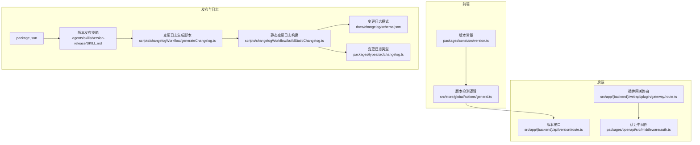
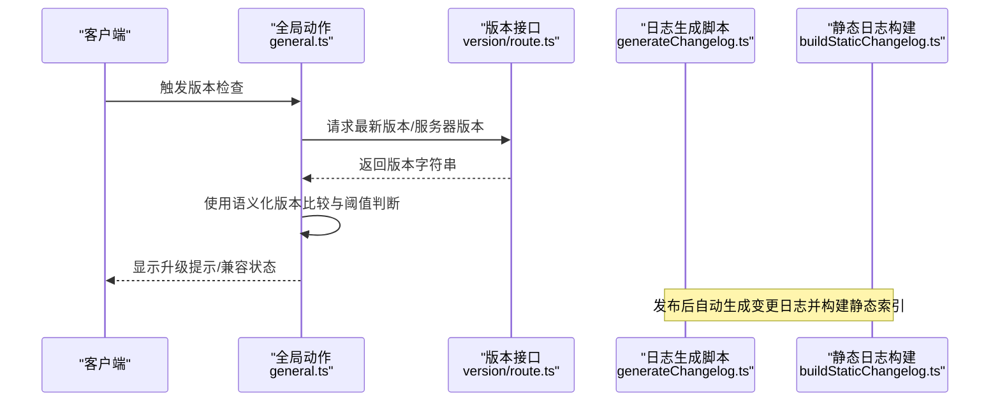
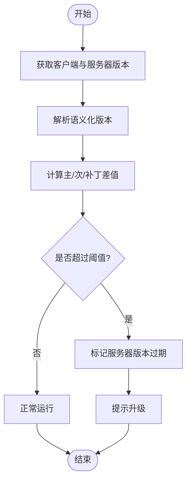
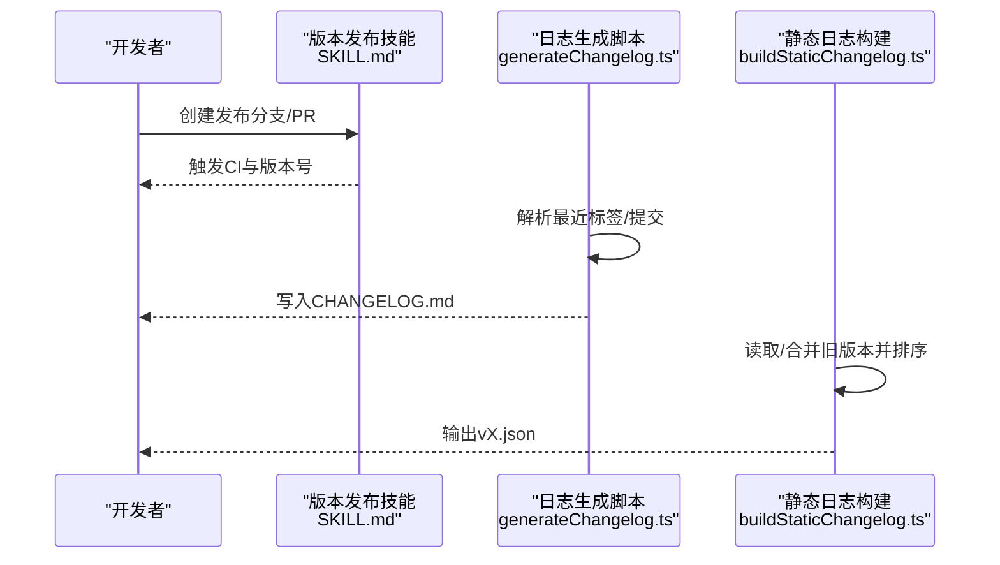
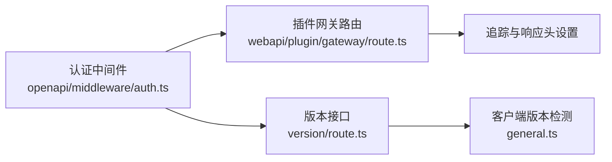
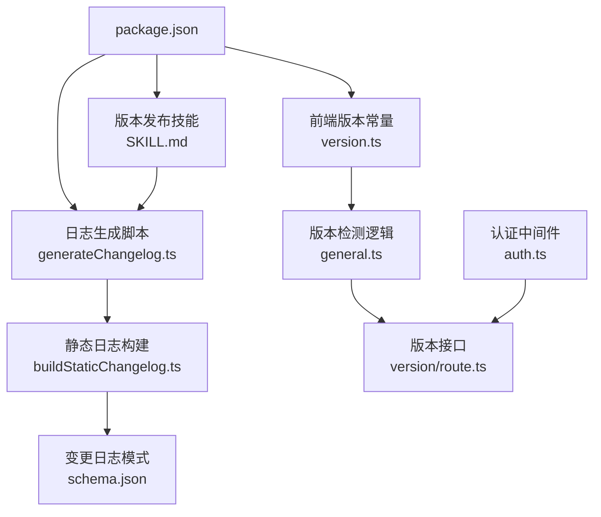

# API 版本管理

<cite>
**本文引用的文件**
- [CHANGELOG.md](file://CHANGELOG.md)
- [package.json](file://package.json)
- [version.ts](file://packages/const/src/version.ts)
- [general.ts](file://src/store/global/actions/general.ts)
- [SKILL.md（版本发布）](file://.agents/skills/version-release/SKILL.md)
- [generateChangelog.ts](file://scripts/changelogWorkflow/generateChangelog.ts)
- [buildStaticChangelog.ts](file://scripts/changelogWorkflow/buildStaticChangelog.ts)
- [schema.json（变更日志模式）](file://docs/changelog/schema.json)
- [route.ts（版本接口）](file://src/app/(backend)/api/version/route.ts)
- [route.ts（插件网关）](file://src/app/(backend)/webapi/plugin/gateway/route.ts)
- [auth.ts（认证中间件）](file://packages/openapi/src/middleware/auth.ts)
- [utils.ts（桌面端更新判断）](file://apps/desktop/src/main/modules/updater/utils.ts)
- [changelog.ts（类型定义）](file://packages/types/src/changelog.ts)
</cite>

## 目录
1. [简介](#简介)
2. [项目结构](#项目结构)
3. [核心组件](#核心组件)
4. [架构总览](#架构总览)
5. [详细组件分析](#详细组件分析)
6. [依赖关系分析](#依赖关系分析)
7. [性能考量](#性能考量)
8. [故障排查指南](#故障排查指南)
9. [结论](#结论)
10. [附录](#附录)

## 简介
本文件系统化梳理 LobeHub 项目的 API 版本管理策略与实践，覆盖语义化版本控制、版本检测与自动降级、向后兼容性保障、破坏性变更通知、版本发布流程、多版本并存期间的路由与配置管理、客户端适配与迁移工具、版本历史与变更日志、弃用时间表与替代方案、测试与回滚机制等，确保在 API 版本演进过程中保持有序性与用户体验连续性。

## 项目结构
围绕 API 版本管理的关键目录与文件包括：
- 版本与发布：package.json、.agents/skills/version-release/SKILL.md、scripts/changelogWorkflow/*
- 版本检测与兼容：src/store/global/actions/general.ts、packages/const/src/version.ts
- 变更日志与模式：CHANGELOG.md、docs/changelog/schema.json、packages/types/src/changelog.ts
- 后端 API：src/app/(backend)/api/version/route.ts、src/app/(backend)/webapi/plugin/gateway/route.ts
- 认证与安全：packages/openapi/src/middleware/auth.ts
- 桌面端更新策略：apps/desktop/src/main/modules/updater/utils.ts

**图表来源**
- [version.ts](file://packages/const/src/version.ts#L1-L13)
- [general.ts](file://src/store/global/actions/general.ts#L144-L217)
- [route.ts（版本接口）](file://src/app/(backend)/api/version/route.ts)
- [route.ts（插件网关）](file://src/app/(backend)/webapi/plugin/gateway/route.ts#L33-L52)
- [auth.ts（认证中间件）](file://packages/openapi/src/middleware/auth.ts#L1-L43)
- [SKILL.md（版本发布）](file://.agents/skills/version-release/SKILL.md#L1-L160)
- [generateChangelog.ts](file://scripts/changelogWorkflow/generateChangelog.ts#L156-L207)
- [buildStaticChangelog.ts](file://scripts/changelogWorkflow/buildStaticChangelog.ts#L117-L134)
- [schema.json（变更日志模式）](file://docs/changelog/schema.json#L1-L70)
- [changelog.ts（类型定义）](file://packages/types/src/changelog.ts#L1-L6)

**章节来源**
- [package.json](file://package.json#L1-L517)
- [.agents/skills/version-release/SKILL.md](file://.agents/skills/version-release/SKILL.md#L1-L160)
- [scripts/changelogWorkflow/generateChangelog.ts](file://scripts/changelogWorkflow/generateChangelog.ts#L156-L207)
- [scripts/changelogWorkflow/buildStaticChangelog.ts](file://scripts/changelogWorkflow/buildStaticChangelog.ts#L117-L134)
- [docs/changelog/schema.json](file://docs/changelog/schema.json#L1-L70)
- [packages/types/src/changelog.ts](file://packages/types/src/changelog.ts#L1-L6)

## 核心组件
- 语义化版本与版本常量
  - 前端通过版本常量获取当前应用版本，用于客户端版本检测与提示。
  - 发布脚本从 package.json 读取版本号，驱动变更日志生成与发布流程。
- 版本检测与兼容性
  - 客户端定期拉取最新版本与服务器版本，基于语义化版本比较与差值阈值判断是否过期或需要升级。
- 变更日志与发布
  - 自动化生成变更日志，按提交类型分类汇总；支持生成静态 JSON 以供前端展示。
- 路由与网关
  - 提供版本查询接口与插件网关路由，便于客户端识别服务端能力与版本范围。
- 认证与安全
  - 认证中间件对 API Key 进行缓存校验，降低鉴权开销，保障版本演进过程中的访问安全。
- 桌面端更新策略
  - 根据主次版本变化决定是否触发应用层更新，避免不必要的全量更新。

**章节来源**
- [version.ts](file://packages/const/src/version.ts#L1-L13)
- [general.ts](file://src/store/global/actions/general.ts#L144-L217)
- [package.json](file://package.json#L1-L517)
- [generateChangelog.ts](file://scripts/changelogWorkflow/generateChangelog.ts#L156-L207)
- [buildStaticChangelog.ts](file://scripts/changelogWorkflow/buildStaticChangelog.ts#L117-L134)
- [route.ts（版本接口）](file://src/app/(backend)/api/version/route.ts)
- [route.ts（插件网关）](file://src/app/(backend)/webapi/plugin/gateway/route.ts#L33-L52)
- [auth.ts（认证中间件）](file://packages/openapi/src/middleware/auth.ts#L1-L43)
- [utils.ts（桌面端更新判断）](file://apps/desktop/src/main/modules/updater/utils.ts#L9-L33)

## 架构总览
下图展示了版本管理在系统中的交互路径：客户端通过版本接口与版本检测逻辑获取服务端版本信息，结合语义化版本比较进行兼容性判断；发布流程由版本发布技能驱动，自动化生成变更日志并构建静态索引；认证中间件保障访问安全。

**图表来源**
- [general.ts](file://src/store/global/actions/general.ts#L144-L217)
- [route.ts（版本接口）](file://src/app/(backend)/api/version/route.ts)
- [generateChangelog.ts](file://scripts/changelogWorkflow/generateChangelog.ts#L156-L207)
- [buildStaticChangelog.ts](file://scripts/changelogWorkflow/buildStaticChangelog.ts#L117-L134)

## 详细组件分析

### 组件一：版本检测与兼容性矩阵
- 功能要点
  - 客户端使用语义化版本解析与比较，计算主/次/补丁差异，设定阈值判断是否过期。
  - 仅对自托管场景下的服务器版本进行对比，云端模式跳过检测。
- 兼容性矩阵（示意）
  - 主版本不一致：强不兼容，需强制升级
  - 次版本不一致：中度不兼容，建议升级
  - 补丁版本不一致：向后兼容，可自动降级或继续使用
- 自动降级策略
  - 当客户端版本落后于服务器版本超过阈值时，标记“服务器版本过期”，引导用户升级
  - 对于插件网关等外部能力，可通过版本范围字段限定兼容区间

**图表来源**
- [general.ts](file://src/store/global/actions/general.ts#L169-L217)

**章节来源**
- [general.ts](file://src/store/global/actions/general.ts#L144-L217)
- [version.ts](file://packages/const/src/version.ts#L1-L13)

### 组件二：发布流程与变更日志
- 发布类型
  - 小版本（Minor）：功能迭代，约每四周一次，标题格式严格要求
  - 补丁（Patch）：周更/热修复/模型上线/数据库迁移，自动补丁递增
- 变更日志生成
  - 自动扫描提交，按类型分组，生成摘要与详情，写入 CHANGELOG.md
  - 构建静态 JSON，合并旧版本条目，按语义化版本排序
- 模式与类型
  - 变更日志模式定义了社区/云版本范围字段，类型定义包含日期、ID、版本范围等

**图表来源**
- [SKILL.md（版本发布）](file://.agents/skills/version-release/SKILL.md#L19-L100)
- [generateChangelog.ts](file://scripts/changelogWorkflow/generateChangelog.ts#L156-L207)
- [buildStaticChangelog.ts](file://scripts/changelogWorkflow/buildStaticChangelog.ts#L117-L134)
- [schema.json（变更日志模式）](file://docs/changelog/schema.json#L1-L70)
- [changelog.ts（类型定义）](file://packages/types/src/changelog.ts#L1-L6)

**章节来源**
- [.agents/skills/version-release/SKILL.md](file://.agents/skills/version-release/SKILL.md#L1-L160)
- [scripts/changelogWorkflow/generateChangelog.ts](file://scripts/changelogWorkflow/generateChangelog.ts#L156-L207)
- [scripts/changelogWorkflow/buildStaticChangelog.ts](file://scripts/changelogWorkflow/buildStaticChangelog.ts#L117-L134)
- [docs/changelog/schema.json](file://docs/changelog/schema.json#L1-L70)
- [packages/types/src/changelog.ts](file://packages/types/src/changelog.ts#L1-L6)

### 组件三：路由分发与配置管理
- 版本接口
  - 提供公开的版本查询端点，便于客户端快速识别服务端版本
- 插件网关
  - 在请求处理链路中注入追踪与响应头，便于跨组件观测与版本关联
- 配置与安全
  - 认证中间件对 API Key 进行缓存校验，减少重复鉴权开销，保障版本演进期间的访问安全

**图表来源**
- [route.ts（版本接口）](file://src/app/(backend)/api/version/route.ts)
- [route.ts（插件网关）](file://src/app/(backend)/webapi/plugin/gateway/route.ts#L33-L52)
- [auth.ts（认证中间件）](file://packages/openapi/src/middleware/auth.ts#L1-L43)

**章节来源**
- [route.ts（版本接口）](file://src/app/(backend)/api/version/route.ts)
- [route.ts（插件网关）](file://src/app/(backend)/webapi/plugin/gateway/route.ts#L33-L52)
- [auth.ts（认证中间件）](file://packages/openapi/src/middleware/auth.ts#L1-L43)

### 组件四：客户端适配与迁移工具
- 桌面端更新策略
  - 当主/次版本变化时触发应用层更新，补丁变化优先渲染热更新
- 版本范围与兼容
  - 变更日志模式支持为社区/云版本范围字段，便于客户端按版本区间适配
- 迁移工具
  - 数据库迁移脚本在构建阶段执行，确保版本升级时的数据一致性

**章节来源**
- [utils.ts（桌面端更新判断）](file://apps/desktop/src/main/modules/updater/utils.ts#L9-L33)
- [schema.json（变更日志模式）](file://docs/changelog/schema.json#L24-L32)
- [package.json](file://package.json#L48-L49)

## 依赖关系分析
- 版本来源依赖
  - package.json 的版本号驱动发布与日志生成
  - 前端版本常量来源于 package.json，用于客户端检测
- 发布流程依赖
  - 版本发布技能依赖 Git 分支与 PR 标题格式
  - 日志生成脚本依赖 Conventional Commits 与标签
- 运行时依赖
  - 客户端版本检测依赖语义化版本库
  - 认证中间件依赖 API Key 缓存与数据库模型

**图表来源**
- [package.json](file://package.json#L1-L517)
- [SKILL.md（版本发布）](file://.agents/skills/version-release/SKILL.md#L1-L160)
- [generateChangelog.ts](file://scripts/changelogWorkflow/generateChangelog.ts#L156-L207)
- [buildStaticChangelog.ts](file://scripts/changelogWorkflow/buildStaticChangelog.ts#L117-L134)
- [schema.json（变更日志模式）](file://docs/changelog/schema.json#L1-L70)
- [version.ts](file://packages/const/src/version.ts#L1-L13)
- [general.ts](file://src/store/global/actions/general.ts#L144-L217)
- [route.ts（版本接口）](file://src/app/(backend)/api/version/route.ts)
- [auth.ts（认证中间件）](file://packages/openapi/src/middleware/auth.ts#L1-L43)

**章节来源**
- [package.json](file://package.json#L1-L517)
- [.agents/skills/version-release/SKILL.md](file://.agents/skills/version-release/SKILL.md#L1-L160)
- [scripts/changelogWorkflow/generateChangelog.ts](file://scripts/changelogWorkflow/generateChangelog.ts#L156-L207)
- [scripts/changelogWorkflow/buildStaticChangelog.ts](file://scripts/changelogWorkflow/buildStaticChangelog.ts#L117-L134)
- [docs/changelog/schema.json](file://docs/changelog/schema.json#L1-L70)
- [packages/const/src/version.ts](file://packages/const/src/version.ts#L1-L13)
- [src/store/global/actions/general.ts](file://src/store/global/actions/general.ts#L144-L217)
- [src/app/(backend)/api/version/route.ts](file://src/app/(backend)/api/version/route.ts)
- [packages/openapi/src/middleware/auth.ts](file://packages/openapi/src/middleware/auth.ts#L1-L43)

## 性能考量
- 版本检测频率
  - 使用节流策略限制轮询频率，避免频繁请求
- 认证缓存
  - API Key 校验结果缓存与周期清理，降低数据库压力
- 日志生成
  - 仅在有提交时生成日志，避免空操作
- 桌面端更新
  - 主/次版本变更触发应用更新，补丁变更走热更新，平衡体验与性能

[本节为通用指导，无需特定文件分析]

## 故障排查指南
- 版本检测异常
  - 检查客户端与服务器版本字符串是否符合语义化版本规范
  - 确认版本差异阈值设置是否合理
- 发布失败
  - 检查 PR 标题格式与分支来源是否满足版本发布技能要求
  - 确认日志生成脚本是否正确解析提交与标签
- 认证问题
  - 检查 API Key 缓存是否过期，确认数据库模型可用
- 桌面端更新
  - 确认主/次版本变更判断逻辑与应用打包策略一致

**章节来源**
- [src/store/global/actions/general.ts](file://src/store/global/actions/general.ts#L144-L217)
- [.agents/skills/version-release/SKILL.md](file://.agents/skills/version-release/SKILL.md#L119-L142)
- [scripts/changelogWorkflow/generateChangelog.ts](file://scripts/changelogWorkflow/generateChangelog.ts#L169-L172)
- [packages/openapi/src/middleware/auth.ts](file://packages/openapi/src/middleware/auth.ts#L32-L40)
- [apps/desktop/src/main/modules/updater/utils.ts](file://apps/desktop/src/main/modules/updater/utils.ts#L9-L33)

## 结论
LobeHub 的 API 版本管理以语义化版本为核心，结合自动化发布与变更日志生成、版本检测与兼容性判断、认证安全与桌面端更新策略，形成闭环的版本演进体系。通过严格的发布流程与模式约束，确保在多版本并存期间的稳定性与用户体验连续性。

[本节为总结，无需特定文件分析]

## 附录

### 版本发布流程清单
- Minor 发布
  - 从 canary 创建 release 分支，PR 标题格式严格为“🚀 release: v{x.y.0}”
  - CI 自动打标签、创建发布并同步回 canary
- Patch 发布
  - 热修复/周更/模型上线/数据库迁移，自动补丁递增
  - PR 标题前缀匹配触发，或分支名匹配直接触发
- 变更日志
  - 所有发布 PR 必须包含用户可见的变更摘要
  - 自动生成摘要与详情，构建静态 JSON 供前端展示

**章节来源**
- [.agents/skills/version-release/SKILL.md](file://.agents/skills/version-release/SKILL.md#L19-L100)
- [scripts/changelogWorkflow/generateChangelog.ts](file://scripts/changelogWorkflow/generateChangelog.ts#L156-L207)
- [scripts/changelogWorkflow/buildStaticChangelog.ts](file://scripts/changelogWorkflow/buildStaticChangelog.ts#L117-L134)

### 版本检测与阈值说明
- 差异阈值规则
  - 通过主/次/补丁差值组合计算，超过阈值即视为过期
  - 仅在自托管场景下对服务器版本进行检测
- 自动降级
  - 建议在客户端侧对过期状态进行提示，并提供降级到兼容版本的指引

**章节来源**
- [src/store/global/actions/general.ts](file://src/store/global/actions/general.ts#L193-L217)

### 变更日志模式与类型
- 模式字段
  - 支持社区/云版本范围字段，便于客户端按版本区间适配
- 类型定义
  - 包含日期、ID、版本范围等字段，用于静态索引构建

**章节来源**
- [docs/changelog/schema.json](file://docs/changelog/schema.json#L24-L32)
- [packages/types/src/changelog.ts](file://packages/types/src/changelog.ts#L1-L6)