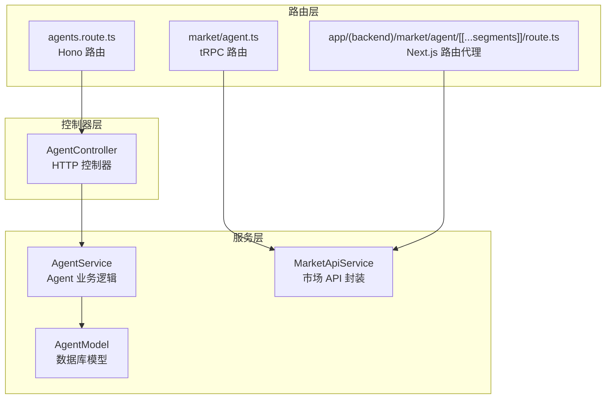
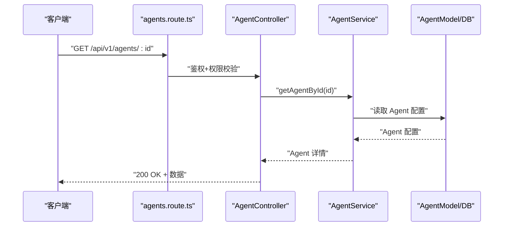
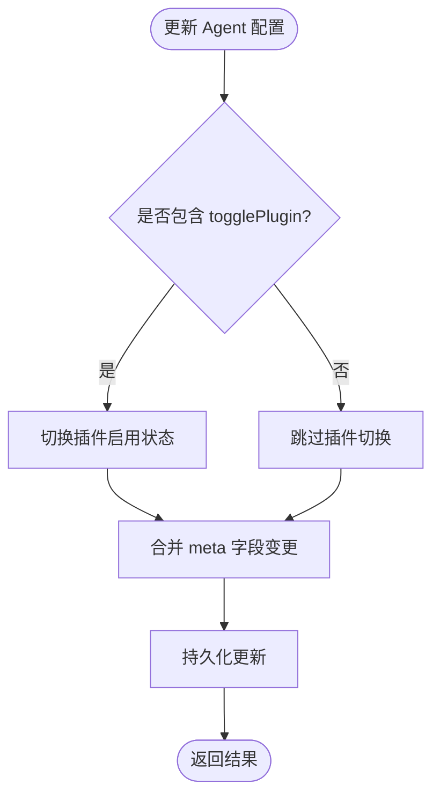
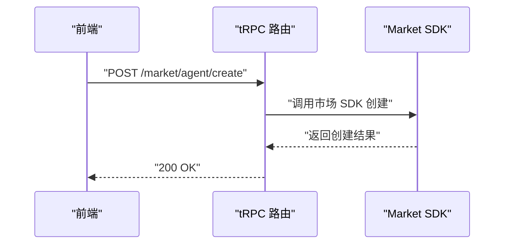
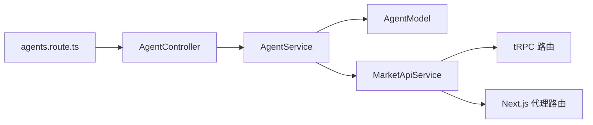

# Agent API

<cite>
**本文引用的文件**
- [packages/openapi/src/controllers/agent.controller.ts](file://packages/openapi/src/controllers/agent.controller.ts)
- [packages/openapi/src/routes/agents.route.ts](file://packages/openapi/src/routes/agents.route.ts)
- [packages/openapi/src/types/agent.type.ts](file://packages/openapi/src/types/agent.type.ts)
- [packages/openapi/src/services/agent.service.ts](file://packages/openapi/src/services/agent.service.ts)
- [packages/database/src/models/agent.ts](file://packages/database/src/models/agent.ts)
- [src/server/routers/lambda/market/agent.ts](file://src/server/routers/lambda/market/agent.ts)
- [src/app/(backend)/market/agent/[[...segments]]/route.ts](file://src/app/(backend)/market/agent/[[...segments]]/route.ts)
- [src/services/agent.ts](file://src/services/agent.ts)
- [packages/agent-manager-runtime/src/AgentManagerRuntime.ts](file://packages/agent-manager-runtime/src/AgentManagerRuntime.ts)
- [packages/agent-manager-runtime/src/types.ts](file://packages/agent-manager-runtime/src/types.ts)
- [packages/context-engine/src/providers/AgentManagementContextInjector.ts](file://packages/context-engine/src/providers/AgentManagementContextInjector.ts)
- [packages/context-engine/src/engine/skills/SkillEngine.ts](file://packages/context-engine/src/engine/skills/SkillEngine.ts)
- [packages/database/src/models/agentSkill.ts](file://packages/database/src/models/agentSkill.ts)
- [packages/types/src/discover/groupAgents.ts](file://packages/types/src/discover/groupAgents.ts)
- [src/server/routers/lambda/market/agentGroup.ts](file://src/server/routers/lambda/market/agentGroup.ts)
- [src/services/marketApi.ts](file://src/services/marketApi.ts)
- [src/hooks/useAgentOwnershipCheck.ts](file://src/hooks/useAgentOwnershipCheck.ts)
- [src/routes/(main)/community/(detail)/user/features/useUserDetail.ts](file://src/routes/(main)/community/(detail)/user/features/useUserDetail.ts)
- [packages/const/src/rbac.ts](file://packages/const/src/rbac.ts)
- [packages/openapi/src/common/base.controller.ts](file://packages/openapi/src/common/base.controller.ts)
- [packages/openapi/src/middleware/auth.ts](file://packages/openapi/src/middleware/auth.ts)
- [packages/openapi/src/middleware/permission-check.ts](file://packages/openapi/src/middleware/permission-check.ts)
</cite>

## 目录

1. [简介](#简介)
2. [项目结构](#项目结构)
3. [核心组件](#核心组件)
4. [架构总览](#架构总览)
5. [详细组件分析](#详细组件分析)
6. [依赖分析](#依赖分析)
7. [性能考量](#性能考量)
8. [故障排查指南](#故障排查指南)
9. [结论](#结论)
10. [附录](#附录)

## 简介

本文件为 LobeHub Agent API 的权威文档，覆盖 Agent 生命周期管理（创建、查询、更新、删除）、配置参数、插件与技能集成、分组与市场发布、状态查询、批量操作、权限控制与版本管理等能力。同时提供模板管理、导入导出、共享发布的接口规范与使用示例，帮助开发者快速集成与扩展。

## 项目结构

Agent API 由三层组成：

- 路由层：定义 REST API 路由与鉴权 / 权限中间件
- 控制器层：处理请求参数、调用服务层并返回标准化响应
- 服务层：封装业务逻辑、数据库事务与权限校验

图表来源

- [packages/openapi/src/routes/agents.route.ts](file://packages/openapi/src/routes/agents.route.ts#L1-L116)
- [packages/openapi/src/controllers/agent.controller.ts](file://packages/openapi/src/controllers/agent.controller.ts#L1-L127)
- [packages/openapi/src/services/agent.service.ts](file://packages/openapi/src/services/agent.service.ts#L1-L358)
- [packages/database/src/models/agent.ts](file://packages/database/src/models/agent.ts#L247-L280)
- [src/server/routers/lambda/market/agent.ts](file://src/server/routers/lambda/market/agent.ts#L92-L556)
- [src/app/(backend)/market/agent/\[\[...segments\]\]/route.ts](<file://src/app/(backend)/market/agent/[[...segments]]/route.ts#L1-L179>)
- [src/services/marketApi.ts](file://src/services/marketApi.ts#L1-L47)

章节来源

- [packages/openapi/src/routes/agents.route.ts](file://packages/openapi/src/routes/agents.route.ts#L1-L116)
- [packages/openapi/src/controllers/agent.controller.ts](file://packages/openapi/src/controllers/agent.controller.ts#L1-L127)
- [packages/openapi/src/services/agent.service.ts](file://packages/openapi/src/services/agent.service.ts#L1-L358)

## 核心组件

- 路由与中间件
  - 认证中间件：requireAuth
  - 权限检查中间件：requireAnyPermission
  - 分页查询 Schema：PaginationQuerySchema
  - 参数 Schema：AgentIdParamSchema、CreateAgentRequestSchema、UpdateAgentRequestSchema
- 控制器
  - AgentController：提供列表查询、创建、更新、删除、详情查询等端点
- 服务
  - AgentService：封装权限校验、事务、会话迁移、详情聚合等
  - AgentModel：提供删除、复制、批量删除等底层操作
- 市场与分组
  - tRPC 路由：提供 createAgent、getOwnAgents、publish/unpublish/deprecate 等
  - Next.js 代理路由：统一市场 Agent API 入口
  - MarketApiService：前端封装市场 API 调用

章节来源

- [packages/openapi/src/routes/agents.route.ts](file://packages/openapi/src/routes/agents.route.ts#L1-L116)
- [packages/openapi/src/controllers/agent.controller.ts](file://packages/openapi/src/controllers/agent.controller.ts#L1-L127)
- [packages/openapi/src/services/agent.service.ts](file://packages/openapi/src/services/agent.service.ts#L1-L358)
- [packages/database/src/models/agent.ts](file://packages/database/src/models/agent.ts#L247-L280)
- [src/server/routers/lambda/market/agent.ts](file://src/server/routers/lambda/market/agent.ts#L92-L556)
- [src/app/(backend)/market/agent/\[\[...segments\]\]/route.ts](<file://src/app/(backend)/market/agent/[[...segments]]/route.ts#L1-L179>)
- [src/services/marketApi.ts](file://src/services/marketApi.ts#L1-L47)

## 架构总览

Agent API 的关键流程包括：

- HTTP 路由接收请求，经认证与权限校验后交由控制器处理
- 控制器调用服务层执行业务逻辑（含数据库事务与权限解析）
- 服务层可联动数据库模型与外部市场服务
- 市场相关能力通过 tRPC 或 Next.js 代理路由对接市场 SDK

图表来源

- [packages/openapi/src/routes/agents.route.ts](file://packages/openapi/src/routes/agents.route.ts#L57-L74)
- [packages/openapi/src/controllers/agent.controller.ts](file://packages/openapi/src/controllers/agent.controller.ts#L104-L125)
- [packages/openapi/src/services/agent.service.ts](file://packages/openapi/src/services/agent.service.ts#L251-L286)
- [packages/database/src/models/agent.ts](file://packages/database/src/models/agent.ts#L469-L516)

## 详细组件分析

### 1) Agent 生命周期管理端点

- 查询 Agent 列表
  - 方法与路径：GET /api/v1/agents
  - 权限：AGENT_READ（支持 ALL/OWNER 作用域）
  - 输入：分页查询参数（PaginationQuerySchema）
  - 输出：分页列表（AgentListResponse）
- 创建 Agent
  - 方法与路径：POST /api/v1/agents
  - 权限：AGENT_CREATE
  - 输入：CreateAgentRequest（含 title、model、provider、chatConfig、params 等）
  - 输出：AgentItem
- 获取 Agent 详情
  - 方法与路径：GET /api/v1/agents/:id
  - 权限：AGENT_READ
  - 输入：AgentIdParamSchema
  - 输出：AgentDetailResponse（含关联会话、知识库、文件等）
- 更新 Agent
  - 方法与路径：PATCH /api/v1/agents/:id
  - 权限：AGENT_UPDATE
  - 输入：UpdateAgentRequest（部分字段可更新）
  - 输出：更新后的 AgentItem
- 删除 Agent
  - 方法与路径：DELETE /api/v1/agents/:id
  - 权限：AGENT_DELETE（管理员）
  - 输入：AgentIdParamSchema
  - 行为：支持迁移会话或级联删除

章节来源

- [packages/openapi/src/routes/agents.route.ts](file://packages/openapi/src/routes/agents.route.ts#L19-L113)
- [packages/openapi/src/controllers/agent.controller.ts](file://packages/openapi/src/controllers/agent.controller.ts#L18-L102)
- [packages/openapi/src/types/agent.type.ts](file://packages/openapi/src/types/agent.type.ts#L10-L200)
- [packages/openapi/src/services/agent.service.ts](file://packages/openapi/src/services/agent.service.ts#L29-L286)
- [packages/database/src/models/agent.ts](file://packages/database/src/models/agent.ts#L247-L280)

### 2) Agent 模型参数与配置

- 支持字段
  - 基本信息：title、description、avatar、backgroundColor、tags
  - 模型与提供商：model、provider
  - 对话配置：chatConfig（自动创建主题、压缩历史、最大 Token、推理预算、搜索模式等）
  - 自定义参数：params（以键值对形式存储，支持合并更新）
  - 系统角色：systemRole
- 更新策略
  - 部分字段可更新；params 采用 “合并更新” 而非全量覆盖
  - 严格权限校验，确保仅授权用户可修改

章节来源

- [packages/openapi/src/types/agent.type.ts](file://packages/openapi/src/types/agent.type.ts#L10-L62)
- [packages/openapi/src/services/agent.service.ts](file://packages/openapi/src/services/agent.service.ts#L116-L186)

### 3) 插件与技能集成

- 插件启用 / 禁用
  - 通过 AgentManagerRuntime 的 updateAgentConfig 支持 togglePlugin
  - 运行时将乐观更新 meta 字段并记录变更字段
- 技能过滤引擎
  - SkillEngine 根据 Agent 启用的插件 ID 过滤可用技能
  - AgentManagementContextInjector 注入可用模型与插件上下文
- AgentSkillModel 提供技能的增删改查与去重查找

图表来源

- [packages/agent-manager-runtime/src/AgentManagerRuntime.ts](file://packages/agent-manager-runtime/src/AgentManagerRuntime.ts#L185-L223)
- [packages/context-engine/src/engine/skills/SkillEngine.ts](file://packages/context-engine/src/engine/skills/SkillEngine.ts#L25-L30)
- [packages/context-engine/src/providers/AgentManagementContextInjector.ts](file://packages/context-engine/src/providers/AgentManagementContextInjector.ts#L142-L167)
- [packages/database/src/models/agentSkill.ts](file://packages/database/src/models/agentSkill.ts#L47-L82)

章节来源

- [packages/agent-manager-runtime/src/AgentManagerRuntime.ts](file://packages/agent-manager-runtime/src/AgentManagerRuntime.ts#L185-L223)
- [packages/context-engine/src/engine/skills/SkillEngine.ts](file://packages/context-engine/src/engine/skills/SkillEngine.ts#L1-L38)
- [packages/context-engine/src/providers/AgentManagementContextInjector.ts](file://packages/context-engine/src/providers/AgentManagementContextInjector.ts#L142-L167)
- [packages/database/src/models/agentSkill.ts](file://packages/database/src/models/agentSkill.ts#L1-L82)

### 4) 分组管理与市场发布

- 分组 Agent 列表查询
  - tRPC 输入参数：category、locale、order、ownerId、page、pageSize、q、sort、status、visibility
  - 返回分页列表
- 市场 Agent 管理
  - createAgent：创建市场 Agent
  - getOwnAgents：获取自己的 Agent 列表
  - publish/unpublish/deprecate：状态变更
  - Next.js 代理路由统一入口，支持 GET/POST
- 个人中心状态变更
  - 前端通过 MarketApiService 调用对应 tRPC 接口

图表来源

- [src/server/routers/lambda/market/agent.ts](file://src/server/routers/lambda/market/agent.ts#L252-L556)
- [src/app/(backend)/market/agent/\[\[...segments\]\]/route.ts](<file://src/app/(backend)/market/agent/[[...segments]]/route.ts#L45-L179>)
- [src/services/marketApi.ts](file://src/services/marketApi.ts#L36-L47)

章节来源

- [src/server/routers/lambda/market/agent.ts](file://src/server/routers/lambda/market/agent.ts#L477-L556)
- [src/app/(backend)/market/agent/\[\[...segments\]\]/route.ts](<file://src/app/(backend)/market/agent/[[...segments]]/route.ts#L1-L179>)
- [src/services/marketApi.ts](file://src/services/marketApi.ts#L1-L47)
- [packages/types/src/discover/groupAgents.ts](file://packages/types/src/discover/groupAgents.ts#L183-L213)

### 5) 状态查询、批量操作与会话关联

- 状态查询
  - 详情接口返回 Agent 完整配置及关联资源（会话、知识库、文件）
- 批量操作
  - 批量删除：BatchDeleteAgentsRequest（支持迁移会话）
  - 批量更新：BatchUpdateAgentsRequest（批量更新基础字段）
- 会话关联
  - 支持为 Agent 创建会话
  - 支持 Agent 与会话的批量关联与解除关联
  - 删除 Agent 时可选择迁移会话至其他 Agent

章节来源

- [packages/openapi/src/types/agent.type.ts](file://packages/openapi/src/types/agent.type.ts#L77-L154)
- [packages/openapi/src/services/agent.service.ts](file://packages/openapi/src/services/agent.service.ts#L288-L356)
- [packages/database/src/models/agent.ts](file://packages/database/src/models/agent.ts#L247-L280)

### 6) 权限控制与版本管理

- 权限模型
  - RBAC 权限键：AGENT_CREATE、AGENT_READ、AGENT_UPDATE、AGENT_DELETE
  - 支持作用域：ALL、OWNER
  - 中间件 requireAnyPermission 统一校验
- 版本管理
  - 市场侧支持版本参数（如 GroupAgentDetailParams.version）
  - 前端通过 MarketApiService 设置 accessToken 或可信客户端令牌

章节来源

- [packages/const/src/rbac.ts](file://packages/const/src/rbac.ts#L201-L238)
- [packages/openapi/src/middleware/permission-check.ts](file://packages/openapi/src/middleware/permission-check.ts)
- [packages/openapi/src/middleware/auth.ts](file://packages/openapi/src/middleware/auth.ts)
- [packages/types/src/discover/groupAgents.ts](file://packages/types/src/discover/groupAgents.ts#L197-L204)
- [src/hooks/useAgentOwnershipCheck.ts](file://src/hooks/useAgentOwnershipCheck.ts#L63-L106)

### 7) 模板管理、导入导出与共享发布

- 导出格式
  - 文本、PDF、JSON（兼容 OpenAI）等
  - 可选包含系统角色、消息角色、用户信息、技能 / 插件调用详情
- 共享发布
  - 通过市场 API 发布 / 取消发布 / 弃用 Agent
  - 前端根据拥有者身份显示相应操作按钮
- 复制 Agent
  - 服务层提供 duplicateAgent，支持新标题

章节来源

- [src/services/agent.ts](file://src/services/agent.ts#L212-L231)
- [packages/database/src/models/agent.ts](file://packages/database/src/models/agent.ts#L472-L516)
- [src/routes/(main)/community/(detail)/user/features/useUserDetail.ts](<file://src/routes/(main)/community/(detail)/user/features/useUserDetail.ts#L38-L77>)

## 依赖分析

- 组件耦合
  - 路由层仅负责参数校验与鉴权，控制器与服务层职责清晰
  - 服务层通过 AgentModel 与数据库交互，必要时进行事务与会话迁移
  - 市场能力通过 tRPC 与 Next.js 代理路由解耦
- 外部依赖
  - 市场 SDK（Market SDK）
  - Drizzle ORM（数据库访问）

图表来源

- [packages/openapi/src/routes/agents.route.ts](file://packages/openapi/src/routes/agents.route.ts#L1-L116)
- [packages/openapi/src/controllers/agent.controller.ts](file://packages/openapi/src/controllers/agent.controller.ts#L1-L127)
- [packages/openapi/src/services/agent.service.ts](file://packages/openapi/src/services/agent.service.ts#L1-L358)
- [src/services/marketApi.ts](file://src/services/marketApi.ts#L1-L47)
- [src/server/routers/lambda/market/agent.ts](file://src/server/routers/lambda/market/agent.ts#L92-L556)
- [src/app/(backend)/market/agent/\[\[...segments\]\]/route.ts](<file://src/app/(backend)/market/agent/[[...segments]]/route.ts#L1-L179>)

章节来源

- [packages/openapi/src/routes/agents.route.ts](file://packages/openapi/src/routes/agents.route.ts#L1-L116)
- [packages/openapi/src/controllers/agent.controller.ts](file://packages/openapi/src/controllers/agent.controller.ts#L1-L127)
- [packages/openapi/src/services/agent.service.ts](file://packages/openapi/src/services/agent.service.ts#L1-L358)
- [src/services/marketApi.ts](file://src/services/marketApi.ts#L1-L47)

## 性能考量

- 分页查询
  - 使用分页 Schema 限制每页大小，避免一次性加载过多数据
- 事务与并发
  - 删除与会话迁移使用事务保证一致性
  - 批量删除与更新采用数据库层面的 inArray 与合并更新策略
- 缓存与鉴权
  - 市场拥有者校验具备缓存机制，减少重复请求

章节来源

- [packages/openapi/src/services/agent.service.ts](file://packages/openapi/src/services/agent.service.ts#L35-L70)
- [packages/openapi/src/services/agent.service.ts](file://packages/openapi/src/services/agent.service.ts#L192-L249)
- [src/hooks/useAgentOwnershipCheck.ts](file://src/hooks/useAgentOwnershipCheck.ts#L63-L106)

## 故障排查指南

- 常见错误与处理
  - 未登录或权限不足：返回 401/403，并提示具体权限缺失
  - Agent 不存在：返回 404
  - 业务异常（如迁移目标不存在）：返回 400 并给出明确错误信息
- 日志与追踪
  - 控制器与服务层均记录关键操作日志，便于定位问题
- 响应结构
  - 统一通过 BaseController.success/error 返回标准响应

章节来源

- [packages/openapi/src/controllers/agent.controller.ts](file://packages/openapi/src/controllers/agent.controller.ts#L104-L125)
- [packages/openapi/src/services/agent.service.ts](file://packages/openapi/src/services/agent.service.ts#L251-L286)
- [packages/openapi/src/common/base.controller.ts](file://packages/openapi/src/common/base.controller.ts)

## 结论

本 API 以清晰的路由 - 控制器 - 服务分层设计，结合严格的权限控制与数据库事务，提供了完整的 Agent 生命周期管理能力。配合市场发布、分组管理、插件与技能引擎、批量操作与会话迁移，满足从开发到生产的多场景需求。建议在生产环境中：

- 明确权限边界与作用域
- 合理使用分页与缓存
- 在批量操作前做好幂等与回滚预案
- 通过市场 SDK 与代理路由保持前后端一致的调用体验

## 附录

### A. API 规范速查

- 查询列表：GET /api/v1/agents（分页）
- 创建：POST /api/v1/agents
- 详情：GET /api/v1/agents/:id
- 更新：PATCH /api/v1/agents/:id
- 删除：DELETE /api/v1/agents/:id
- 市场创建：POST /market/agent/create
- 我的 Agent：GET /market/agent/own
- 发布 / 取消发布 / 弃用：POST /market/agent/:identifier/{publish|unpublish|deprecate}

章节来源

- [packages/openapi/src/routes/agents.route.ts](file://packages/openapi/src/routes/agents.route.ts#L19-L113)
- [src/server/routers/lambda/market/agent.ts](file://src/server/routers/lambda/market/agent.ts#L252-L556)
- [src/app/(backend)/market/agent/\[\[...segments\]\]/route.ts](<file://src/app/(backend)/market/agent/[[...segments]]/route.ts#L45-L179>)
