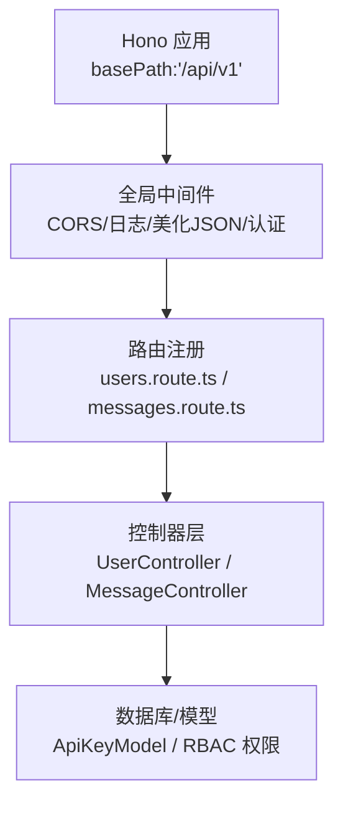
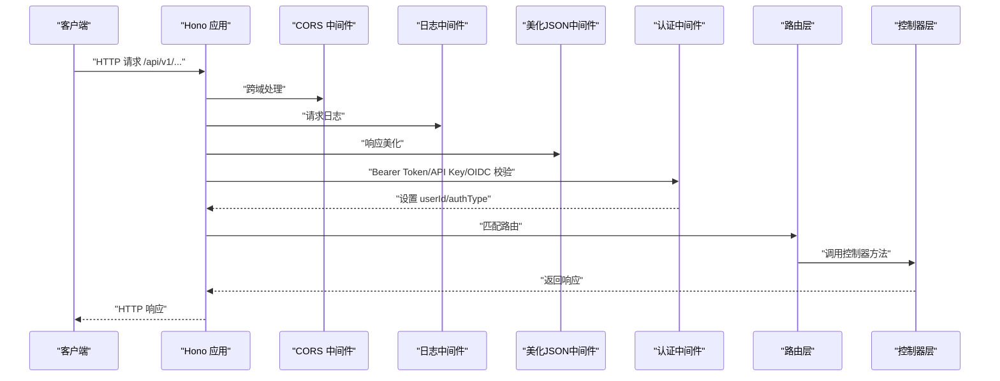
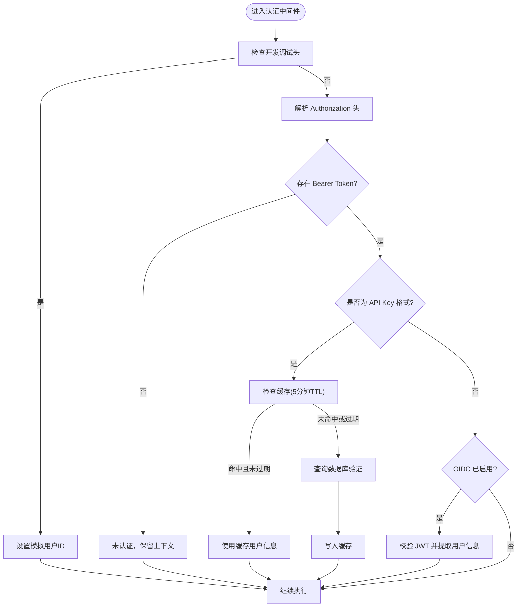
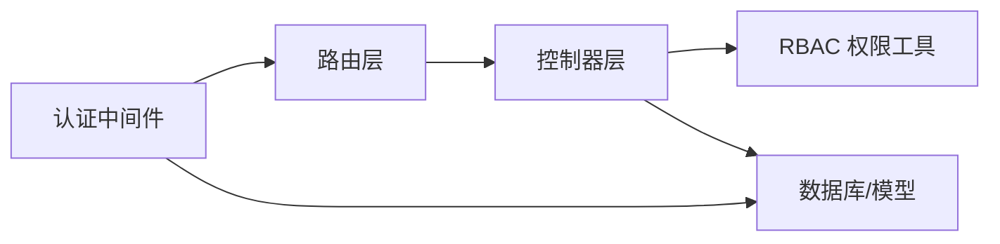

# REST API 设计

<cite>
**本文引用的文件**
- [packages/openapi/src/app.ts](file://packages/openapi/src/app.ts)
- [packages/openapi/src/middleware/auth.ts](file://packages/openapi/src/middleware/auth.ts)
- [packages/openapi/src/routes/users.route.ts](file://packages/openapi/src/routes/users.route.ts)
- [packages/openapi/src/routes/messages.route.ts](file://packages/openapi/src/routes/messages.route.ts)
- [packages/openapi/src/types/user.type.ts](file://packages/openapi/src/types/user.type.ts)
- [packages/openapi/src/types/message.type.ts](file://packages/openapi/src/types/message.type.ts)
- [apps/cli/src/api/http.ts](file://apps/cli/src/api/http.ts)
- [src/envs/auth.ts](file://src/envs/auth.ts)
</cite>

## 目录

1. [简介](#简介)
2. [项目结构](#项目结构)
3. [核心组件](#核心组件)
4. [架构总览](#架构总览)
5. [详细组件分析](#详细组件分析)
6. [依赖关系分析](#依赖关系分析)
7. [性能考虑](#性能考虑)
8. [故障排查指南](#故障排查指南)
9. [结论](#结论)
10. [附录](#附录)

## 简介

本设计文档面向 LobeHub 的后端 REST API，基于 Hono 应用实现，提供统一的版本前缀、认证与授权、CORS、日志与美化输出、健康检查以及路由注册机制。本文档覆盖以下要点：

- API 版本控制策略与 URL 命名空间
- 认证与授权（Bearer Token、API Key、OIDC）
- 内容协商与分页 / 过滤参数
- 请求与响应格式、状态码约定
- CORS 与安全头配置
- 特殊场景（文件上传下载、流式响应、长轮询）的设计建议
- 性能优化、缓存策略、限流与监控指标
- 最佳实践与常见问题排查

## 项目结构

本项目采用模块化组织，REST API 主要由 OpenAPI 包提供，核心入口在 Hono 应用中集中配置，路由按资源划分，类型校验通过 Zod Schema 实现。

图表来源

- [packages/openapi/src/app.ts](file://packages/openapi/src/app.ts#L12-L36)
- [packages/openapi/src/middleware/auth.ts](file://packages/openapi/src/middleware/auth.ts#L49-L206)
- [packages/openapi/src/routes/users.route.ts](file://packages/openapi/src/routes/users.route.ts#L17-L162)
- [packages/openapi/src/routes/messages.route.ts](file://packages/openapi/src/routes/messages.route.ts#L18-L127)

章节来源

- [packages/openapi/src/app.ts](file://packages/openapi/src/app.ts#L1-L39)

## 核心组件

- Hono 应用与基础路径
  - 应用以 basePath 设置为 /api/v1，所有路由自动带有该前缀。
  - 全局中间件包括 CORS、日志、美化 JSON 输出、用户认证中间件。
  - 健康检查端点 /api/v1/health 返回服务状态。
- 认证中间件
  - 支持 Bearer Token 的两种模式：API Key（lb- 开头的短密钥）与 OIDC JWT。
  - API Key 采用内存缓存（TTL 5 分钟），减少数据库查询压力。
  - OIDC 启用与否由环境变量控制。
- 授权中间件
  - 基于 RBAC 权限范围，使用 requireAnyPermission 对具体操作进行细粒度授权。
- 类型与校验
  - 所有路由均配合 zValidator 对路径参数、查询参数、请求体进行严格校验。
- CLI 客户端
  - 提供认证信息组装与 XOR 加扰头，用于特定后端接口。

章节来源

- [packages/openapi/src/app.ts](file://packages/openapi/src/app.ts#L12-L36)
- [packages/openapi/src/middleware/auth.ts](file://packages/openapi/src/middleware/auth.ts#L49-L206)
- [apps/cli/src/api/http.ts](file://apps/cli/src/api/http.ts#L13-L52)
- [src/envs/auth.ts](file://src/envs/auth.ts#L194-L288)

## 架构总览

下图展示从客户端到控制器的整体调用链路与中间件职责：

图表来源

- [packages/openapi/src/app.ts](file://packages/openapi/src/app.ts#L14-L18)
- [packages/openapi/src/middleware/auth.ts](file://packages/openapi/src/middleware/auth.ts#L49-L206)
- [packages/openapi/src/routes/users.route.ts](file://packages/openapi/src/routes/users.route.ts#L24-L58)
- [packages/openapi/src/routes/messages.route.ts](file://packages/openapi/src/routes/messages.route.ts#L36-L94)

## 详细组件分析

### 认证与授权中间件

- 认证流程
  - 优先判断是否为 API Key 格式（lb- 开头），命中则查询缓存；未命中或过期则查询数据库并写入缓存。
  - 若非 API Key 格式且启用 OIDC，则对 JWT 进行校验并提取用户信息。
  - 将 userId、authType、authData 等上下文注入 Hono，后续路由可选择性要求认证。
- 授权策略
  - 使用 requireAnyPermission 对每个路由进行细粒度权限校验，结合 RBAC 权限范围（如 USER_READ/USER_CREATE 等）。
- 安全头与调试
  - CLI 客户端在特定场景下会附加自定义头部（X-lobe-chat-auth、Oidc-Auth）。
  - 开发环境下可通过特殊请求头绕过认证（仅用于调试）。

图表来源

- [packages/openapi/src/middleware/auth.ts](file://packages/openapi/src/middleware/auth.ts#L49-L206)

章节来源

- [packages/openapi/src/middleware/auth.ts](file://packages/openapi/src/middleware/auth.ts#L49-L206)
- [apps/cli/src/api/http.ts](file://apps/cli/src/api/http.ts#L33-L52)
- [src/envs/auth.ts](file://src/envs/auth.ts#L194-L288)

### 用户管理 API

- 版本与命名空间
  - 基础路径：/api/v1/users

- 端点概览
  - GET /api/v1/users/me：获取当前登录用户信息（需认证）
  - GET /api/v1/users：获取用户列表（支持分页与搜索）
  - POST /api/v1/users：创建用户（需用户创建权限）
  - GET /api/v1/users/:id：按 ID 获取用户详情（需用户读取权限）
  - PATCH /api/v1/users/:id：部分更新用户信息（需用户更新权限）
  - DELETE /api/v1/users/:id：删除用户（需用户删除权限）
  - GET /api/v1/users/:id/roles：获取用户角色（需 RBAC 用户角色读取权限）
  - PATCH /api/v1/users/:id/roles：更新用户角色（需 RBAC 用户角色更新权限）
  - DELETE /api/v1/users/:id/roles：清空用户角色（需 RBAC 用户角色更新权限）

- 请求 / 响应与参数
  - 查询参数与分页：通过 UserSearchRequestSchema 控制分页与关键字过滤。
  - 路径参数：UserIdParamSchema 校验用户 ID。
  - 请求体：CreateUserRequestSchema、UpdateUserRequestSchema 等进行字段校验。
  - 响应：用户列表返回分页包装对象，角色操作返回操作结果与明细。

- 状态码
  - 200：成功
  - 400：请求参数或请求体校验失败
  - 401：未认证或认证失败
  - 403：无权限
  - 404：资源不存在
  - 500：服务器内部错误

- 示例
  - 获取当前用户信息
    - 方法：GET
    - URL：/api/v1/users/me
    - 认证：Bearer Token（API Key 或 OIDC）
    - 成功响应：包含当前用户基本信息
  - 创建用户
    - 方法：POST
    - URL：/api/v1/users
    - 认证：Bearer Token（API Key 或 OIDC）
    - 权限：USER_CREATE
    - 请求体：符合 CreateUserRequestSchema 的 JSON
    - 成功响应：新建用户对象

章节来源

- [packages/openapi/src/routes/users.route.ts](file://packages/openapi/src/routes/users.route.ts#L19-L162)
- [packages/openapi/src/types/user.type.ts](file://packages/openapi/src/types/user.type.ts#L42-L84)
- [packages/openapi/src/types/user.type.ts](file://packages/openapi/src/types/user.type.ts#L180-L183)

### 消息管理 API

- 版本与命名空间
  - 基础路径：/api/v1/messages

- 端点概览
  - GET /api/v1/messages/count：统计消息数量（支持按话题 / 用户过滤）
  - GET /api/v1/messages：获取消息列表（支持分页、角色、话题、用户过滤）
  - GET /api/v1/messages/:id：按 ID 获取消息详情（需消息读取权限）
  - POST /api/v1/messages：创建消息（需消息写入权限）
  - POST /api/v1/messages/replies：创建用户消息并生成 AI 回复（需消息写入权限）
  - DELETE /api/v1/messages/:id：删除单条消息（需消息删除权限）
  - DELETE /api/v1/messages：批量删除消息（需消息删除权限）

- 请求 / 响应与参数
  - 查询参数：
    - MessagesCountQuerySchema：topicIds（逗号分隔）、userId（管理员可用）
    - MessagesListQuerySchema：topicId、userId、role（枚举）、分页参数
  - 路径参数：MessageIdParamSchema 校验消息 ID
  - 请求体：
    - MessagesCreateRequestSchema：content、role、topicId、threadId、parentId、files、metadata、reasoning、tools、traceId、observationId、quotaId、agentId、clientId、favorite 等
    - MessagesCreateWithReplyRequestSchema：role 固定为 user
    - MessagesDeleteBatchRequestSchema：messageIds 数组
  - 响应：消息列表返回分页包装对象，单条消息返回包含关联 topic/session/files 的详情对象

- 状态码
  - 200：成功
  - 400：请求参数或请求体校验失败
  - 401：未认证或认证失败
  - 403：无权限
  - 404：资源不存在
  - 500：服务器内部错误

- 示例
  - 获取消息列表
    - 方法：GET
    - URL：/api/v1/messages?page=1\&pageSize=20\&role=user\&topicId=xxx
    - 认证：Bearer Token（API Key 或 OIDC）
    - 权限：MESSAGE_READ
    - 成功响应：分页的消息列表
  - 创建消息并生成回复
    - 方法：POST
    - URL：/api/v1/messages/replies
    - 认证：Bearer Token（API Key 或 OIDC）
    - 权限：MESSAGE_CREATE
    - 请求体：符合 MessagesCreateWithReplyRequestSchema 的 JSON
    - 成功响应：返回创建后的消息对象

章节来源

- [packages/openapi/src/routes/messages.route.ts](file://packages/openapi/src/routes/messages.route.ts#L21-L125)
- [packages/openapi/src/types/message.type.ts](file://packages/openapi/src/types/message.type.ts#L55-L71)
- [packages/openapi/src/types/message.type.ts](file://packages/openapi/src/types/message.type.ts#L124-L158)
- [packages/openapi/src/types/message.type.ts](file://packages/openapi/src/types/message.type.ts#L192-L194)
- [packages/openapi/src/types/message.type.ts](file://packages/openapi/src/types/message.type.ts#L220-L222)

### CORS 与安全头

- CORS
  - 全局启用 CORS 中间件，允许跨域访问。
- 安全头与自定义头
  - CLI 客户端在特定后端接口上要求携带自定义头部：
    - X-lobe-chat-auth：对空载荷进行 XOR 加扰并 Base64 编码
    - Oidc-Auth：OIDC 访问令牌
  - OIDC 启用与否由环境变量控制，JWKS Key 存在即启用 OIDC。

章节来源

- [packages/openapi/src/app.ts](file://packages/openapi/src/app.ts#L15-L15)
- [apps/cli/src/api/http.ts](file://apps/cli/src/api/http.ts#L13-L52)
- [src/envs/auth.ts](file://src/envs/auth.ts#L194-L288)

### 错误处理与健康检查

- 错误处理
  - 全局 onError 中间件捕获异常并返回统一的 JSON 错误响应（HTTP 500）。
- 健康检查
  - GET /api/v1/health 返回服务状态、时间戳等信息。

章节来源

- [packages/openapi/src/app.ts](file://packages/openapi/src/app.ts#L20-L33)

## 依赖关系分析

- 组件耦合
  - 路由层依赖控制器层；控制器层依赖数据库 / 模型与权限工具。
  - 认证中间件贯穿全局，路由层仅在需要时调用 requireAuth。
- 外部依赖
  - Hono 作为运行时框架；Zod 用于请求体与参数校验；OIDC JWT 校验用于身份验证。
- 可能的循环依赖
  - 当前结构清晰，路由与控制器解耦良好，未见明显循环依赖迹象。

图表来源

- [packages/openapi/src/routes/users.route.ts](file://packages/openapi/src/routes/users.route.ts#L1-L163)
- [packages/openapi/src/routes/messages.route.ts](file://packages/openapi/src/routes/messages.route.ts#L1-L128)
- [packages/openapi/src/middleware/auth.ts](file://packages/openapi/src/middleware/auth.ts#L1-L222)

章节来源

- [packages/openapi/src/routes/users.route.ts](file://packages/openapi/src/routes/users.route.ts#L1-L163)
- [packages/openapi/src/routes/messages.route.ts](file://packages/openapi/src/routes/messages.route.ts#L1-L128)
- [packages/openapi/src/middleware/auth.ts](file://packages/openapi/src/middleware/auth.ts#L1-L222)

## 性能考虑

- 认证缓存
  - API Key 校验采用 5 分钟 TTL 的内存缓存，显著降低数据库压力。
- 日志与响应美化
  - 日志中间件便于追踪，美化 JSON 便于调试；生产环境可根据需要关闭美化。
- 分页与过滤
  - 列表查询统一使用分页 Schema，避免一次性返回大量数据。
- 并发与连接
  - 数据库连接池与查询索引需在控制器层与数据库层配合优化。
- 流式响应与长轮询
  - 当前路由未直接暴露 SSE / 长轮询端点；如需支持，可在控制器层引入流式响应或长轮询逻辑，并在路由层新增对应端点。

\[本节为通用性能建议，无需列出章节来源]

## 故障排查指南

- 401 未认证
  - 检查 Authorization 头是否为 Bearer Token，确认是否为 API Key 或 OIDC JWT 格式。
  - 开发调试时确认是否设置了绕过认证的请求头。
- 403 无权限
  - 确认用户是否具备所需 RBAC 权限范围（如 USER_CREATE、MESSAGE_READ 等）。
- 400 参数 / 请求体校验失败
  - 对照各路由的 Zod Schema，检查必填字段与类型。
- 500 服务器错误
  - 查看日志中间件输出，定位具体控制器与数据库调用环节。

章节来源

- [packages/openapi/src/middleware/auth.ts](file://packages/openapi/src/middleware/auth.ts#L212-L221)
- [packages/openapi/src/routes/users.route.ts](file://packages/openapi/src/routes/users.route.ts#L34-L42)
- [packages/openapi/src/routes/messages.route.ts](file://packages/openapi/src/routes/messages.route.ts#L22-L34)

## 结论

本设计以 Hono 为基础，结合 Zod 校验、RBAC 授权与 API Key/OIDC 双重认证，提供了清晰、可扩展的 REST API 架构。通过统一的版本前缀、CORS、日志与错误处理机制，保证了 API 的易用性与可维护性。建议在后续迭代中补充文件上传下载、流式响应与长轮询等端点，并完善限流与监控指标体系。

\[本节为总结性内容，无需列出章节来源]

## 附录

### API 端点一览（摘要）

- 用户管理
  - GET /api/v1/users/me
  - GET /api/v1/users
  - POST /api/v1/users
  - GET /api/v1/users/:id
  - PATCH /api/v1/users/:id
  - DELETE /api/v1/users/:id
  - GET /api/v1/users/:id/roles
  - PATCH /api/v1/users/:id/roles
  - DELETE /api/v1/users/:id/roles
- 消息管理
  - GET /api/v1/messages/count
  - GET /api/v1/messages
  - GET /api/v1/messages/:id
  - POST /api/v1/messages
  - POST /api/v1/messages/replies
  - DELETE /api/v1/messages/:id
  - DELETE /api/v1/messages

章节来源

- [packages/openapi/src/routes/users.route.ts](file://packages/openapi/src/routes/users.route.ts#L19-L162)
- [packages/openapi/src/routes/messages.route.ts](file://packages/openapi/src/routes/messages.route.ts#L21-L125)

### 认证与授权最佳实践

- 使用 Bearer Token 传递凭据，优先使用短期有效的 OIDC JWT。
- 对外部集成使用 API Key，并定期轮换与审计。
- 在路由层显式标注 requireAuth 与 requireAnyPermission，避免默认放行。
- 对敏感操作（删除、批量操作）增加二次确认或额外校验。

章节来源

- [packages/openapi/src/middleware/auth.ts](file://packages/openapi/src/middleware/auth.ts#L49-L206)
- [packages/openapi/src/routes/users.route.ts](file://packages/openapi/src/routes/users.route.ts#L34-L42)
- [packages/openapi/src/routes/messages.route.ts](file://packages/openapi/src/routes/messages.route.ts#L22-L34)
