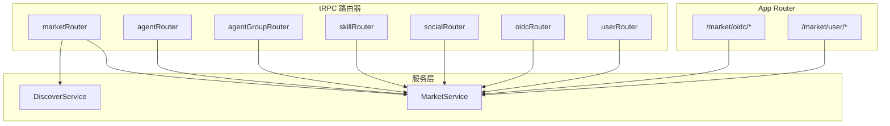
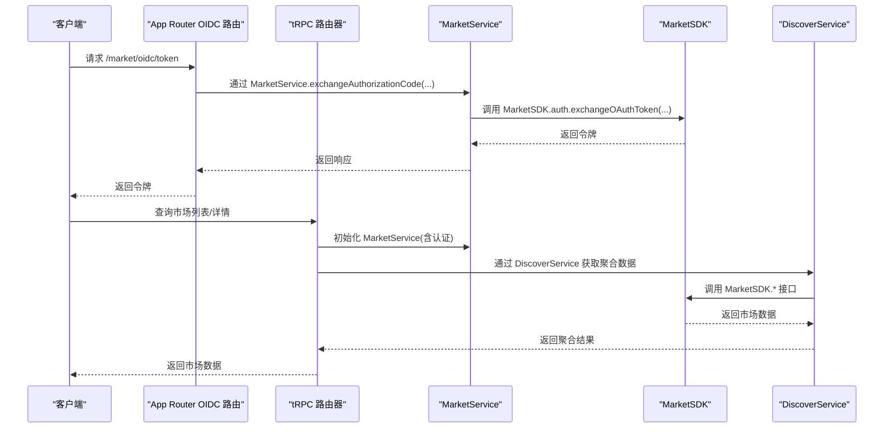
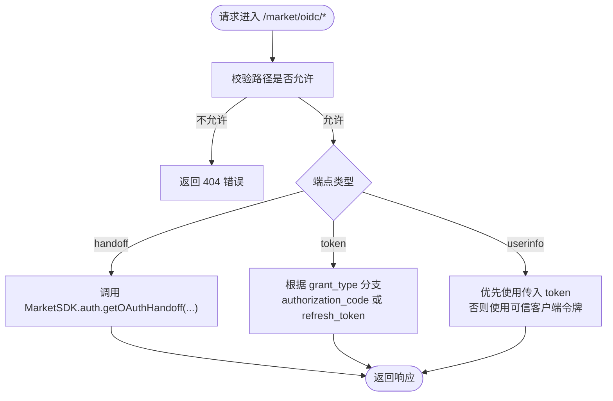
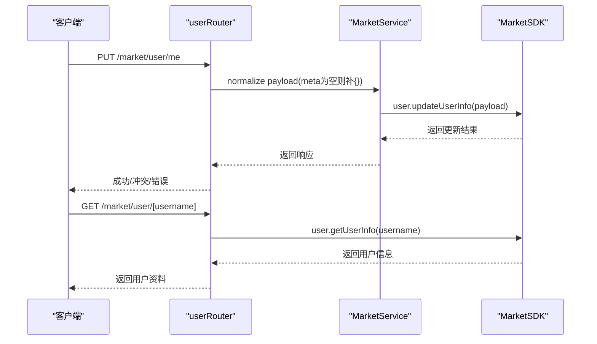
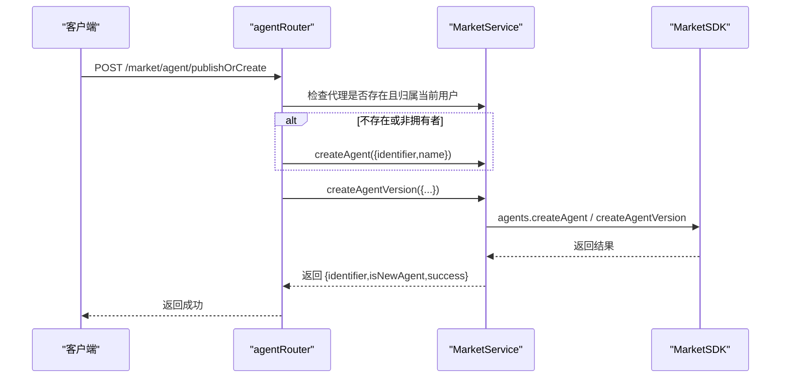
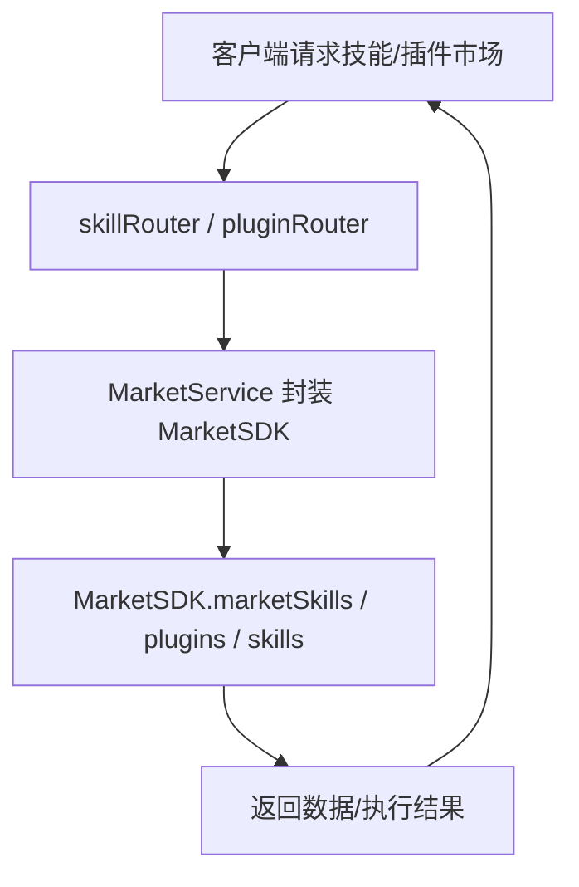
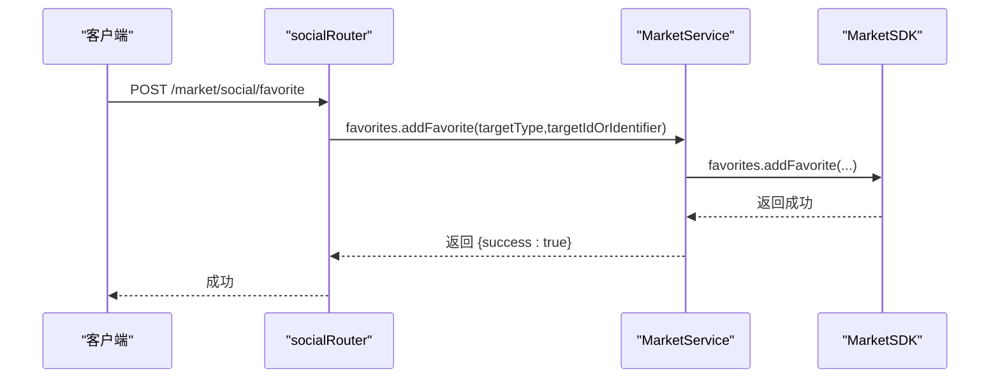
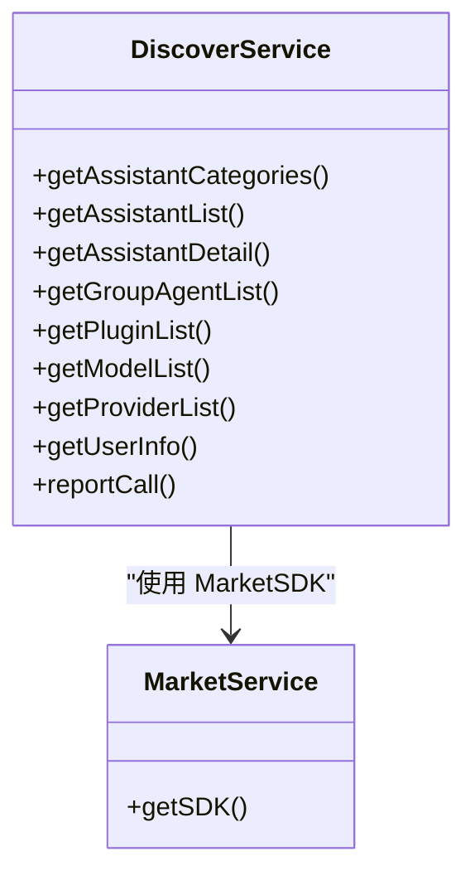
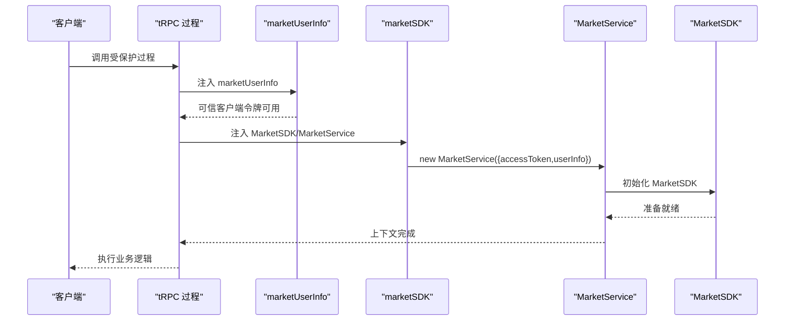
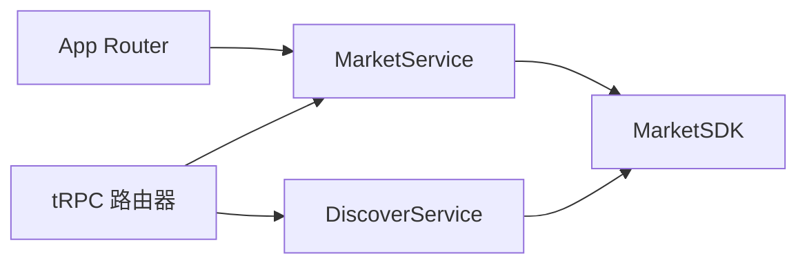

# 市场 API

<cite>
**本文引用的文件**
- [src/app/(backend)/market/oidc/[[...segments]]/route.ts](file://src/app/(backend)/market/oidc/[[...segments]]/route.ts)
- [src/app/(backend)/market/user/[username]/route.ts](file://src/app/(backend)/market/user/[username]/route.ts)
- [src/app/(backend)/market/user/me/route.ts](file://src/app/(backend)/market/user/me/route.ts)
- [src/server/services/market/index.ts](file://src/server/services/market/index.ts)
- [src/server/routers/lambda/market/index.ts](file://src/server/routers/lambda/market/index.ts)
- [src/server/routers/lambda/market/agent.ts](file://src/server/routers/lambda/market/agent.ts)
- [src/server/routers/lambda/market/agentGroup.ts](file://src/server/routers/lambda/market/agentGroup.ts)
- [src/server/routers/lambda/market/skill.ts](file://src/server/routers/lambda/market/skill.ts)
- [src/server/routers/lambda/market/social.ts](file://src/server/routers/lambda/market/social.ts)
- [src/server/routers/lambda/market/oidc.ts](file://src/server/routers/lambda/market/oidc.ts)
- [src/server/routers/lambda/market/user.ts](file://src/server/routers/lambda/market/user.ts)
- [src/layout/AuthProvider/MarketAuth/types.ts](file://src/layout/AuthProvider/MarketAuth/types.ts)
- [src/layout/AuthProvider/MarketAuth/index.ts](file://src/layout/AuthProvider/MarketAuth/index.ts)
- [src/libs/trpc/lambda/middleware/marketSDK.ts](file://src/libs/trpc/lambda/middleware/marketSDK.ts)
- [src/services/discover.ts](file://src/services/discover.ts)
</cite>

## 目录
1. [简介](#简介)
2. [项目结构](#项目结构)
3. [核心组件](#核心组件)
4. [架构总览](#架构总览)
5. [详细组件分析](#详细组件分析)
6. [依赖关系分析](#依赖关系分析)
7. [性能考虑](#性能考虑)
8. [故障排查指南](#故障排查指南)
9. [结论](#结论)
10. [附录](#附录)

## 简介
本文件为 LobeHub 市场 API 的权威文档，覆盖商品浏览、搜索、购买、评价、用户画像、社交互动、认证授权、M2M 认证、插件与技能市场、代理与代理组发布与管理、以及分析埋点等能力。文档以“可执行”的角度描述接口规范、数据模型、鉴权方式、错误处理与集成建议，并提供可视化图示帮助理解。

## 项目结构
市场 API 在后端采用 Next.js App Router（路由组）与 tRPC Lambda 路由器结合的方式组织：
- App Router 层：负责 OIDC 代理、用户信息查询等入口级路由
- tRPC 路由层：封装市场能力（代理、代理组、技能、插件、社交、OIDC、发现服务等）
- 服务层：MarketService 封装 MarketSDK，统一接入市场能力并处理认证与中间件
- 认证与会话：MarketAuth 提供用户态与可信客户端令牌（trusted client token）支持

图表来源
- [src/app/(backend)/market/oidc/[[...segments]]/route.ts](file://src/app/(backend)/market/oidc/[[...segments]]/route.ts#L1-L233)
- [src/app/(backend)/market/user/[username]/route.ts](file://src/app/(backend)/market/user/[username]/route.ts#L1-L68)
- [src/server/routers/lambda/market/index.ts](file://src/server/routers/lambda/market/index.ts#L1-L928)
- [src/server/services/market/index.ts](file://src/server/services/market/index.ts#L1-L570)

章节来源
- [src/app/(backend)/market/oidc/[[...segments]]/route.ts](file://src/app/(backend)/market/oidc/[[...segments]]/route.ts#L1-L233)
- [src/app/(backend)/market/user/[username]/route.ts](file://src/app/(backend)/market/user/[username]/route.ts#L1-L68)
- [src/server/routers/lambda/market/index.ts](file://src/server/routers/lambda/market/index.ts#L1-L928)
- [src/server/services/market/index.ts](file://src/server/services/market/index.ts#L1-L570)

## 核心组件
- MarketService：封装 MarketSDK，统一处理访问令牌、可信客户端令牌、M2M 客户端注册与令牌获取、用户资料、技能、插件、代理与代理组、社交等能力
- tRPC 路由器：按功能域拆分（agent、agentGroup、skill、social、oidc、user），统一注入认证上下文与 MarketService 实例
- App Router OIDC 代理：对 /market/oidc/* 进行路径校验与转发，支持 handoff、token、userinfo 三类端点
- 认证与会话：MarketAuth 类型定义与导出，支持用户态与可信客户端令牌两种认证路径

章节来源
- [src/server/services/market/index.ts](file://src/server/services/market/index.ts#L1-L570)
- [src/server/routers/lambda/market/index.ts](file://src/server/routers/lambda/market/index.ts#L1-L928)
- [src/app/(backend)/market/oidc/[[...segments]]/route.ts](file://src/app/(backend)/market/oidc/[[...segments]]/route.ts#L1-L233)
- [src/layout/AuthProvider/MarketAuth/types.ts](file://src/layout/AuthProvider/MarketAuth/types.ts#L1-L56)

## 架构总览
下图展示从客户端到市场 API 的关键调用链路与认证方式：

图表来源
- [src/app/(backend)/market/oidc/[[...segments]]/route.ts](file://src/app/(backend)/market/oidc/[[...segments]]/route.ts#L96-L158)
- [src/server/routers/lambda/market/index.ts](file://src/server/routers/lambda/market/index.ts#L654-L726)
- [src/server/services/market/index.ts](file://src/server/services/market/index.ts#L158-L214)

## 详细组件分析

### 认证与授权（OIDC 代理与会话）
- OIDC 代理端点
  - GET/POST /market/oidc/handoff：参数 id 必填；返回手把手跳转信息
  - POST /market/oidc/token：支持 authorization_code 与 refresh_token 两种 grant_type
  - POST /market/oidc/userinfo：支持传入 token 或使用可信客户端令牌直接访问
- 会话与令牌
  - 支持 Bearer 令牌与可信客户端令牌（trusted client token）两种认证方式
  - 用户态通过 MarketAuth 提供的类型与 Hook 管理会话状态

图表来源
- [src/app/(backend)/market/oidc/[[...segments]]/route.ts](file://src/app/(backend)/market/oidc/[[...segments]]/route.ts#L16-L227)
- [src/server/services/market/index.ts](file://src/server/services/market/index.ts#L158-L203)
- [src/layout/AuthProvider/MarketAuth/types.ts](file://src/layout/AuthProvider/MarketAuth/types.ts#L1-L56)

章节来源
- [src/app/(backend)/market/oidc/[[...segments]]/route.ts](file://src/app/(backend)/market/oidc/[[...segments]]/route.ts#L1-L233)
- [src/server/services/market/index.ts](file://src/server/services/market/index.ts#L1-L570)
- [src/layout/AuthProvider/MarketAuth/types.ts](file://src/layout/AuthProvider/MarketAuth/types.ts#L1-L56)

### 用户资料与社交（用户、关注、收藏、点赞）
- 用户资料
  - GET /market/user/[username]：返回用户基础资料（不含代理列表）
  - PUT /market/user/me：更新当前用户资料（用户名冲突返回 409）
- 社交能力
  - 关注/取消关注、粉丝数/关注数查询
  - 收藏/取消收藏、点赞/取消点赞、切换点赞
  - 查询某用户的收藏/点赞代理与插件列表

图表来源
- [src/server/routers/lambda/market/user.ts](file://src/server/routers/lambda/market/user.ts#L86-L120)
- [src/app/(backend)/market/user/[username]/route.ts](file://src/app/(backend)/market/user/[username]/route.ts#L18-L65)
- [src/app/(backend)/market/user/me/route.ts](file://src/app/(backend)/market/user/me/route.ts#L18-L62)

章节来源
- [src/server/routers/lambda/market/user.ts](file://src/server/routers/lambda/market/user.ts#L1-L124)
- [src/app/(backend)/market/user/[username]/route.ts](file://src/app/(backend)/market/user/[username]/route.ts#L1-L68)
- [src/app/(backend)/market/user/me/route.ts](file://src/app/(backend)/market/user/me/route.ts#L1-L65)

### 代理与代理组（发布、版本、收藏、fork、归属校验）
- 代理
  - checkOwnership：校验当前用户是否拥有指定代理
  - createAgent / createAgentVersion：创建代理与版本
  - publishAgent / unpublishAgent / deprecateAgent：发布/下架/弃用
  - forkAgent / getAgentForkSource / getAgentForks：派生、查看派生源与派生列表
  - getAgentDetail / getOwnAgents：详情与我的代理列表
  - publishOrCreate：统一发布或创建流程（内部生成唯一标识符）
- 代理组
  - checkOwnership：校验当前用户是否拥有指定代理组
  - createAgentGroup / createAgentGroupVersion：创建代理组与版本
  - publishAgentGroup / unpublishAgentGroup / deprecateAgentGroup：发布/下架/弃用
  - forkAgentGroup / getAgentGroupForkSource / getAgentGroupForks：派生、查看派生源与派生列表
  - getAgentGroupDetail / getAgentGroupList：详情与列表
  - publishOrCreate：统一发布或创建流程

图表来源
- [src/server/routers/lambda/market/agent.ts](file://src/server/routers/lambda/market/agent.ts#L580-L660)
- [src/server/routers/lambda/market/agentGroup.ts](file://src/server/routers/lambda/market/agentGroup.ts#L653-L739)

章节来源
- [src/server/routers/lambda/market/agent.ts](file://src/server/routers/lambda/market/agent.ts#L1-L686)
- [src/server/routers/lambda/market/agentGroup.ts](file://src/server/routers/lambda/market/agentGroup.ts#L1-L801)

### 技能与插件市场（分类、列表、详情、下载、安装上报）
- 技能
  - getSkillCategories / getSkillList / getSkillDetail：分类、列表、详情
  - listSkillTools / callSkillTool / listSkillConnections：列出工具、调用工具、列出已连接
- 插件
  - getPluginManifest / reportPluginInstallation / reportPluginCall / createPluginEvent：清单、安装上报、调用上报、事件上报
  - callCloudMcpEndpoint / exportFile：云 MCP 调用、文件导出

图表来源
- [src/server/routers/lambda/market/skill.ts](file://src/server/routers/lambda/market/skill.ts#L27-L103)
- [src/server/services/market/index.ts](file://src/server/services/market/index.ts#L244-L317)

章节来源
- [src/server/routers/lambda/market/skill.ts](file://src/server/routers/lambda/market/skill.ts#L1-L104)
- [src/server/services/market/index.ts](file://src/server/services/market/index.ts#L244-L317)

### 社交与收藏（关注、收藏、点赞、统计）
- 关注/取消关注、关注/粉丝数统计、关注/粉丝列表
- 收藏/取消收藏、收藏统计、收藏列表
- 点赞/取消点赞、切换点赞、点赞统计、点赞列表
- 支持按目标类型（agent/plugin/agent-group）进行操作

图表来源
- [src/server/routers/lambda/market/social.ts](file://src/server/routers/lambda/market/social.ts#L33-L59)

章节来源
- [src/server/routers/lambda/market/social.ts](file://src/server/routers/lambda/market/social.ts#L1-L533)

### 发现与聚合（类别、列表、详情、标识符、事件上报）
- 发现服务封装了多种市场实体的聚合查询（助手、代理、代理组、插件、模型、提供商等）
- 提供类别、列表、详情、标识符、事件上报等能力
- 支持带语言与来源标记的查询

图表来源
- [src/server/routers/lambda/market/index.ts](file://src/server/routers/lambda/market/index.ts#L84-L800)
- [src/services/discover.ts](file://src/services/discover.ts#L604-L634)

章节来源
- [src/server/routers/lambda/market/index.ts](file://src/server/routers/lambda/market/index.ts#L1-L928)
- [src/services/discover.ts](file://src/services/discover.ts#L604-L634)

### 认证中间件与上下文注入
- marketSDK 中间件：在 tRPC 上下文中注入 MarketSDK 与 MarketService
- requireMarketAuth 中间件：要求具备访问令牌或可信客户端令牌
- marketUserInfo 中间件：从请求中提取用户态信息，用于可信客户端令牌生成

图表来源
- [src/libs/trpc/lambda/middleware/marketSDK.ts](file://src/libs/trpc/lambda/middleware/marketSDK.ts#L19-L44)

章节来源
- [src/libs/trpc/lambda/middleware/marketSDK.ts](file://src/libs/trpc/lambda/middleware/marketSDK.ts#L1-L44)

## 依赖关系分析
- 组件耦合
  - App Router 仅做路径校验与简单转发，核心逻辑集中在 tRPC 路由器与服务层
  - MarketService 对外暴露统一方法，屏蔽 MarketSDK 差异
  - DiscoverService 作为聚合层，减少前端对多套接口的依赖
- 外部依赖
  - MarketSDK：市场核心能力来源
  - 可信客户端令牌：服务端直连市场 API 的替代认证方式
- 鉴权链路
  - 用户态：Bearer 令牌（来自 OIDC 流程）
  - 服务端态：trustedClientToken（基于用户态信息生成）

图表来源
- [src/server/services/market/index.ts](file://src/server/services/market/index.ts#L80-L102)
- [src/server/routers/lambda/market/index.ts](file://src/server/routers/lambda/market/index.ts#L32-L48)

章节来源
- [src/server/services/market/index.ts](file://src/server/services/market/index.ts#L1-L570)
- [src/server/routers/lambda/market/index.ts](file://src/server/routers/lambda/market/index.ts#L1-L928)

## 性能考虑
- 缓存策略
  - 列表与详情接口建议在 tRPC 层引入缓存中间件，降低 MarketSDK 调用频次
- 并发控制
  - 批量操作（如批量安装上报、事件上报）应合并请求，避免抖动
- 超时与重试
  - MarketSDK 调用需设置合理超时与指数退避重试，避免雪崩
- 传输优化
  - 使用 gzip 压缩与合理的分页参数（page/pageSize）控制响应大小

## 故障排查指南
- OIDC 代理
  - 端点缺失/不支持：检查 ALLOWED_ENDPOINTS 与路径长度限制
  - 令牌交换失败：确认 grant_type、client_id、code、redirect_uri 参数
  - userinfo 失败：确认 token 或可信客户端令牌是否有效
- 用户资料
  - 更新失败（用户名冲突）：返回 409，提示用户名已被占用
  - 用户不存在：返回 404，message 包含用户名
- 代理/代理组
  - 权限不足：归属校验失败，需确保当前用户为拥有者
  - 派生失败：检查源标识符与目标标识符是否正确
- 社交
  - 未登录：部分操作返回默认状态（如未收藏/未关注），需引导登录
- 通用
  - 内部错误：捕获 TRPCError 并记录日志，返回统一错误结构

章节来源
- [src/app/(backend)/market/oidc/[[...segments]]/route.ts](file://src/app/(backend)/market/oidc/[[...segments]]/route.ts#L16-L227)
- [src/app/(backend)/market/user/[username]/route.ts](file://src/app/(backend)/market/user/[username]/route.ts#L28-L37)
- [src/app/(backend)/market/user/me/route.ts](file://src/app/(backend)/market/user/me/route.ts#L50-L61)
- [src/server/routers/lambda/market/agent.ts](file://src/server/routers/lambda/market/agent.ts#L216-L249)
- [src/server/routers/lambda/market/social.ts](file://src/server/routers/lambda/market/social.ts#L102-L113)

## 结论
本市场 API 通过清晰的分层设计与统一的服务封装，实现了从认证、用户、社交到代理/代理组、技能/插件、发现与分析的全链路能力。建议在生产环境中配合缓存、限流与可观测性方案，确保高并发下的稳定性与可维护性。

## 附录

### 常见问题与最佳实践
- 认证选择
  - 前端交互：优先使用 Bearer 令牌（OIDC）
  - 服务端直连：使用可信客户端令牌（trustedClientToken）
- 数据一致性
  - 发布/派生/版本管理：先归属校验，再创建/更新
- 错误处理
  - 明确区分业务错误（如用户名冲突）与系统错误（如网络异常）
- 版本与来源
  - 列表查询支持 locale 与 source 标记，便于灰度与兼容