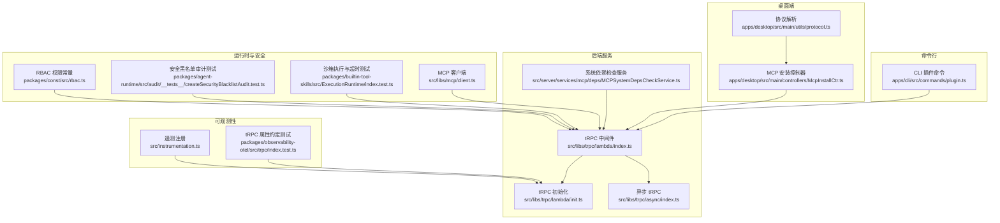
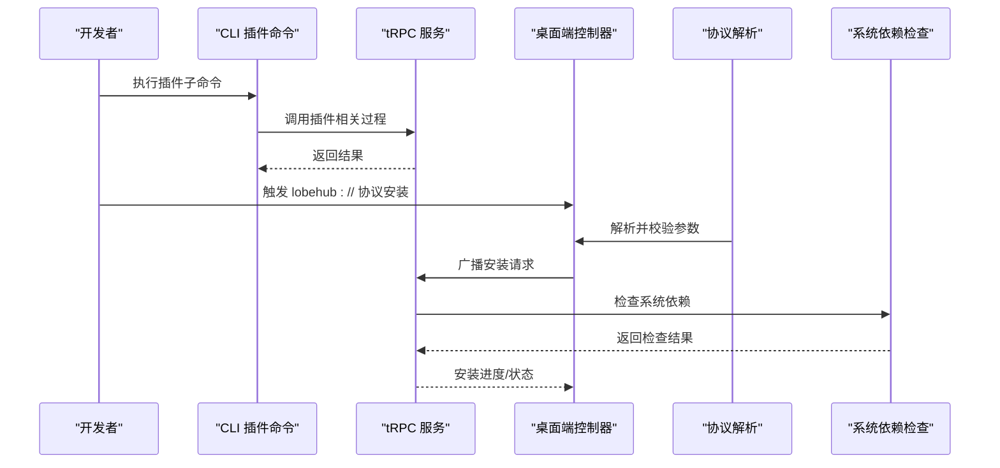
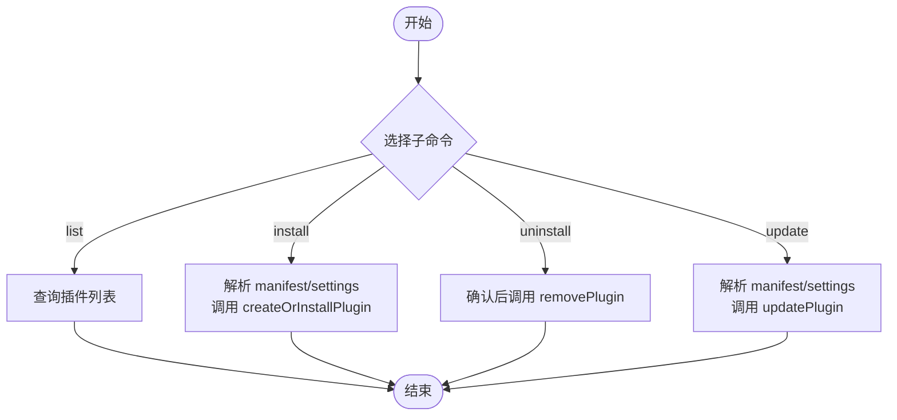
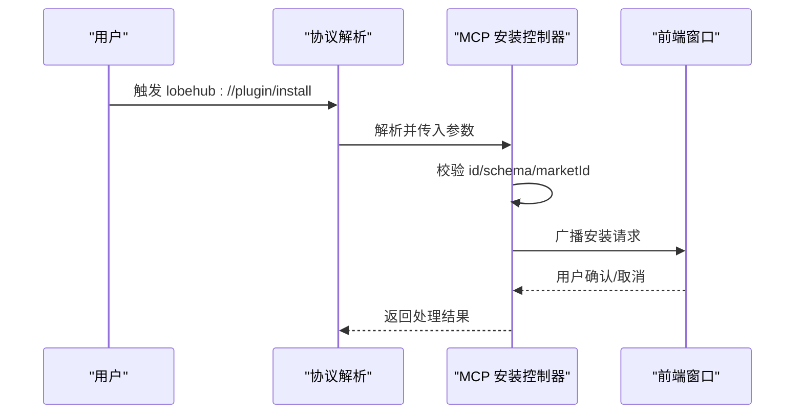
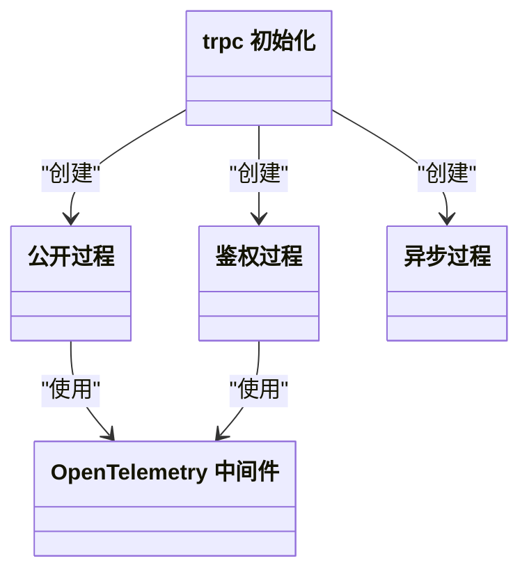
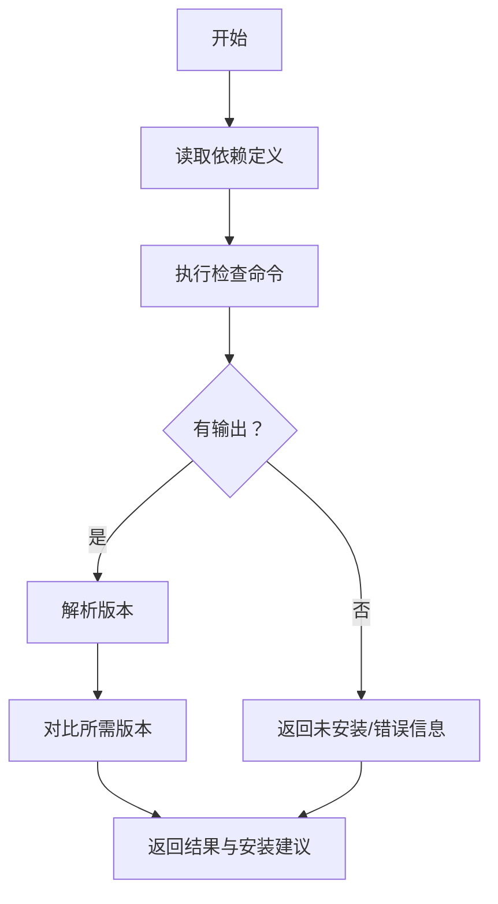
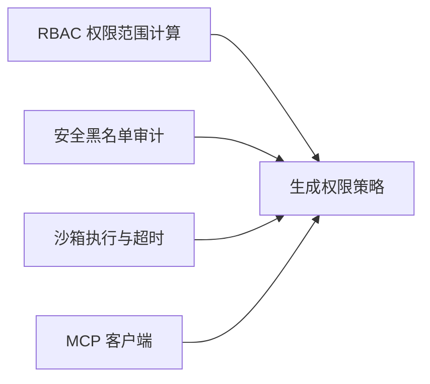
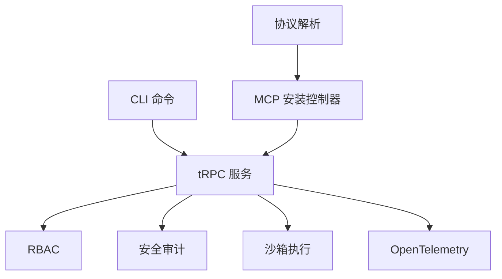

# 插件 API

<cite>
**本文引用的文件**
- [apps/cli/src/commands/plugin.ts](file://apps/cli/src/commands/plugin.ts)
- [apps/cli/src/commands/plugin.test.ts](file://apps/cli/src/commands/plugin.test.ts)
- [apps/desktop/src/main/controllers/McpInstallCtr.ts](file://apps/desktop/src/main/controllers/McpInstallCtr.ts)
- [apps/desktop/src/main/utils/protocol.ts](file://apps/desktop/src/main/utils/protocol.ts)
- [src/server/services/mcp/deps/MCPSystemDepsCheckService.ts](file://src/server/services/mcp/deps/MCPSystemDepsCheckService.ts)
- [packages/types/src/plugins/index.ts](file://packages/types/src/plugins/index.ts)
- [packages/const/src/rbac.ts](file://packages/const/src/rbac.ts)
- [packages/agent-runtime/src/audit/__tests__/createSecurityBlacklistAudit.test.ts](file://packages/agent-runtime/src/audit/__tests__/createSecurityBlacklistAudit.test.ts)
- [packages/builtin-tool-skills/src/ExecutionRuntime/index.test.ts](file://packages/builtin-tool-skills/src/ExecutionRuntime/index.test.ts)
- [src/libs/mcp/client.ts](file://src/libs/mcp/client.ts)
- [src/libs/trpc/lambda/index.ts](file://src/libs/trpc/lambda/index.ts)
- [src/libs/trpc/lambda/init.ts](file://src/libs/trpc/lambda/init.ts)
- [src/libs/trpc/async/index.ts](file://src/libs/trpc/async/index.ts)
- [src/instrumentation.ts](file://src/instrumentation.ts)
- [packages/observability-otel/src/trpc/index.test.ts](file://packages/observability-otel/src/trpc/index.test.ts)
</cite>

## 目录
1. [简介](#简介)
2. [项目结构](#项目结构)
3. [核心组件](#核心组件)
4. [架构总览](#架构总览)
5. [详细组件分析](#详细组件分析)
6. [依赖关系分析](#依赖关系分析)
7. [性能考虑](#性能考虑)
8. [故障排查指南](#故障排查指南)
9. [结论](#结论)
10. [附录](#附录)

## 简介
本文件为 LobeHub 插件系统的 API 文档，覆盖插件生命周期（安装、卸载、更新、查询）、插件市场接入、版本与依赖检查、冲突处理、权限控制、沙箱隔离与资源限制、安全审计、MCP 协议支持、开发工具链与调试接口、以及性能监控与可观测性设计。文档以“可操作”为目标，既面向开发者也面向运维与平台集成人员。

## 项目结构
围绕插件 API 的关键模块分布如下：
- 命令行工具：提供本地插件生命周期管理命令，调用后端 tRPC 服务。
- 桌面端协议与控制器：负责 MCP 插件安装请求解析、校验与广播。
- 后端 tRPC 路由与中间件：统一暴露插件相关服务端过程，内置认证与遥测。
- 依赖与系统检查：对 MCP 部署选项进行系统依赖检测与建议。
- 安全与权限：基于 RBAC 的权限范围计算与黑名单安全审计。
- 可观测性：OpenTelemetry 集成与 tRPC 属性约定，便于性能追踪。

图表来源
- [apps/cli/src/commands/plugin.ts](file://apps/cli/src/commands/plugin.ts#L1-L147)
- [apps/desktop/src/main/utils/protocol.ts](file://apps/desktop/src/main/utils/protocol.ts#L83-L98)
- [apps/desktop/src/main/controllers/McpInstallCtr.ts](file://apps/desktop/src/main/controllers/McpInstallCtr.ts#L60-L154)
- [src/libs/trpc/lambda/init.ts](file://src/libs/trpc/lambda/init.ts#L1-L33)
- [src/libs/trpc/lambda/index.ts](file://src/libs/trpc/lambda/index.ts#L1-L37)
- [src/libs/trpc/async/index.ts](file://src/libs/trpc/async/index.ts#L1-L33)
- [src/server/services/mcp/deps/MCPSystemDepsCheckService.ts](file://src/server/services/mcp/deps/MCPSystemDepsCheckService.ts#L1-L173)
- [packages/const/src/rbac.ts](file://packages/const/src/rbac.ts#L163-L199)
- [packages/agent-runtime/src/audit/__tests__/createSecurityBlacklistAudit.test.ts](file://packages/agent-runtime/src/audit/__tests__/createSecurityBlacklistAudit.test.ts#L38-L69)
- [packages/builtin-tool-skills/src/ExecutionRuntime/index.test.ts](file://packages/builtin-tool-skills/src/ExecutionRuntime/index.test.ts#L93-L131)
- [src/libs/mcp/client.ts](file://src/libs/mcp/client.ts#L299-L342)
- [src/instrumentation.ts](file://src/instrumentation.ts#L1-L12)
- [packages/observability-otel/src/trpc/index.test.ts](file://packages/observability-otel/src/trpc/index.test.ts#L1-L38)

章节来源
- [apps/cli/src/commands/plugin.ts](file://apps/cli/src/commands/plugin.ts#L1-L147)
- [apps/desktop/src/main/utils/protocol.ts](file://apps/desktop/src/main/utils/protocol.ts#L83-L98)
- [apps/desktop/src/main/controllers/McpInstallCtr.ts](file://apps/desktop/src/main/controllers/McpInstallCtr.ts#L60-L154)
- [src/libs/trpc/lambda/init.ts](file://src/libs/trpc/lambda/init.ts#L1-L33)
- [src/libs/trpc/lambda/index.ts](file://src/libs/trpc/lambda/index.ts#L1-L37)
- [src/libs/trpc/async/index.ts](file://src/libs/trpc/async/index.ts#L1-L33)
- [src/server/services/mcp/deps/MCPSystemDepsCheckService.ts](file://src/server/services/mcp/deps/MCPSystemDepsCheckService.ts#L1-L173)
- [packages/const/src/rbac.ts](file://packages/const/src/rbac.ts#L163-L199)
- [packages/agent-runtime/src/audit/__tests__/createSecurityBlacklistAudit.test.ts](file://packages/agent-runtime/src/audit/__tests__/createSecurityBlacklistAudit.test.ts#L38-L69)
- [packages/builtin-tool-skills/src/ExecutionRuntime/index.test.ts](file://packages/builtin-tool-skills/src/ExecutionRuntime/index.test.ts#L93-L131)
- [src/libs/mcp/client.ts](file://src/libs/mcp/client.ts#L299-L342)
- [src/instrumentation.ts](file://src/instrumentation.ts#L1-L12)
- [packages/observability-otel/src/trpc/index.test.ts](file://packages/observability-otel/src/trpc/index.test.ts#L1-L38)

## 核心组件
- CLI 插件命令：提供 list/install/uninstall/update 子命令，通过 tRPC 客户端调用后端服务，完成插件生命周期管理。
- 桌面端 MCP 安装控制器：解析 lobehub:// 协议 URL，校验 MCP Schema 结构，按市场来源决定是否需要 schema，并广播安装请求到前端。
- tRPC 服务层：提供公开与鉴权过程，结合 OpenTelemetry 中间件实现可观测性；异步过程注入数据库上下文。
- 系统依赖检查服务：针对 MCP 部署选项进行系统依赖检测，返回版本、安装建议与平台化指引。
- 权限与安全：RBAC 权限范围计算；安全黑名单审计；沙箱执行与超时控制；MCP 客户端会话与连接管理。
- 可观测性：遥测开关与注册；tRPC 属性命名约定，便于统一追踪。

章节来源
- [apps/cli/src/commands/plugin.ts](file://apps/cli/src/commands/plugin.ts#L8-L147)
- [apps/desktop/src/main/controllers/McpInstallCtr.ts](file://apps/desktop/src/main/controllers/McpInstallCtr.ts#L60-L154)
- [src/libs/trpc/lambda/index.ts](file://src/libs/trpc/lambda/index.ts#L1-L37)
- [src/libs/trpc/async/index.ts](file://src/libs/trpc/async/index.ts#L1-L33)
- [src/server/services/mcp/deps/MCPSystemDepsCheckService.ts](file://src/server/services/mcp/deps/MCPSystemDepsCheckService.ts#L47-L173)
- [packages/const/src/rbac.ts](file://packages/const/src/rbac.ts#L163-L199)
- [packages/agent-runtime/src/audit/__tests__/createSecurityBlacklistAudit.test.ts](file://packages/agent-runtime/src/audit/__tests__/createSecurityBlacklistAudit.test.ts#L38-L69)
- [packages/builtin-tool-skills/src/ExecutionRuntime/index.test.ts](file://packages/builtin-tool-skills/src/ExecutionRuntime/index.test.ts#L93-L131)
- [src/libs/mcp/client.ts](file://src/libs/mcp/client.ts#L299-L342)
- [src/instrumentation.ts](file://src/instrumentation.ts#L1-L12)
- [packages/observability-otel/src/trpc/index.test.ts](file://packages/observability-otel/src/trpc/index.test.ts#L1-L38)

## 架构总览
下图展示从 CLI 到桌面端协议解析，再到后端 tRPC 服务与依赖检查的整体流程。

图表来源
- [apps/cli/src/commands/plugin.ts](file://apps/cli/src/commands/plugin.ts#L17-L87)
- [apps/desktop/src/main/utils/protocol.ts](file://apps/desktop/src/main/utils/protocol.ts#L83-L98)
- [apps/desktop/src/main/controllers/McpInstallCtr.ts](file://apps/desktop/src/main/controllers/McpInstallCtr.ts#L66-L152)
- [src/server/services/mcp/deps/MCPSystemDepsCheckService.ts](file://src/server/services/mcp/deps/MCPSystemDepsCheckService.ts#L61-L173)
- [src/libs/trpc/lambda/index.ts](file://src/libs/trpc/lambda/index.ts#L26-L31)

## 详细组件分析

### CLI 插件命令（生命周期管理）
- 支持命令：
  - list：列出已安装插件，支持 JSON 输出字段过滤。
  - install：安装插件，需提供标识符、清单（manifest）与可选类型与设置。
  - uninstall：卸载插件，支持跳过确认。
  - update：更新插件的清单或设置，需至少提供其一。
- 数据校验：JSON 字段解析失败时直接报错并退出。
- 调用链：命令内部通过 tRPC 客户端调用后端过程，完成创建/安装、删除、更新。

图表来源
- [apps/cli/src/commands/plugin.ts](file://apps/cli/src/commands/plugin.ts#L13-L145)

章节来源
- [apps/cli/src/commands/plugin.ts](file://apps/cli/src/commands/plugin.ts#L8-L147)
- [apps/cli/src/commands/plugin.test.ts](file://apps/cli/src/commands/plugin.test.ts#L1-L46)

### 桌面端 MCP 安装控制器与协议解析
- 协议解析：
  - 支持多版本协议前缀（如 lobehub://、lobehub-bet:// 等）。
  - 支持路径与查询参数，提取插件标识、schema 与市场标识。
- 控制器职责：
  - 校验参数完整性与 schema 结构（identifier/name/author/description/version 等）。
  - 对于官方市场可选 schema，第三方市场必须提供 schema。
  - 将安装请求广播至前端窗口，便于 UI 交互与确认。
- 错误处理：缺失参数、schema 不匹配、URL 格式错误、广播失败均记录日志并返回失败。

图表来源
- [apps/desktop/src/main/utils/protocol.ts](file://apps/desktop/src/main/utils/protocol.ts#L83-L98)
- [apps/desktop/src/main/controllers/McpInstallCtr.ts](file://apps/desktop/src/main/controllers/McpInstallCtr.ts#L66-L152)

章节来源
- [apps/desktop/src/main/utils/protocol.ts](file://apps/desktop/src/main/utils/protocol.ts#L83-L98)
- [apps/desktop/src/main/controllers/McpInstallCtr.ts](file://apps/desktop/src/main/controllers/McpInstallCtr.ts#L10-L154)

### tRPC 服务与中间件（认证、可观测性）
- 公开过程与鉴权过程：提供公开与受 OIDC/用户认证保护的过程基类。
- 异步过程：注入数据库上下文，确保数据一致性与可测试性。
- OpenTelemetry：在路由层启用遥测，统一错误格式化与数据转换。

图表来源
- [src/libs/trpc/lambda/init.ts](file://src/libs/trpc/lambda/init.ts#L15-L33)
- [src/libs/trpc/lambda/index.ts](file://src/libs/trpc/lambda/index.ts#L26-L31)
- [src/libs/trpc/async/index.ts](file://src/libs/trpc/async/index.ts#L14-L31)

章节来源
- [src/libs/trpc/lambda/index.ts](file://src/libs/trpc/lambda/index.ts#L1-L37)
- [src/libs/trpc/lambda/init.ts](file://src/libs/trpc/lambda/init.ts#L1-L33)
- [src/libs/trpc/async/index.ts](file://src/libs/trpc/async/index.ts#L1-L33)

### 系统依赖检查（MCP 部署）
- 功能：对系统依赖执行版本检查，解析输出并比对所需版本，返回安装建议与平台化指引。
- 平台映射：根据当前平台选择对应安装说明，支持 macOS、Linux（含 Debian 变体）、Windows。
- 部署选项：支持检查部署选项中的系统依赖集合，汇总检查结果。

图表来源
- [src/server/services/mcp/deps/MCPSystemDepsCheckService.ts](file://src/server/services/mcp/deps/MCPSystemDepsCheckService.ts#L61-L173)

章节来源
- [src/server/services/mcp/deps/MCPSystemDepsCheckService.ts](file://src/server/services/mcp/deps/MCPSystemDepsCheckService.ts#L1-L173)

### 权限控制与安全
- 权限范围：基于资源与动作计算允许范围，默认 OWNER|ALL，部分资源（如 rbac、user）有例外策略。
- 安全审计：提供黑名单审计器测试，覆盖默认黑名单、空参数、敏感路径检测等场景。
- 沙箱与资源限制：执行运行时具备超时与回退机制，失败时返回明确错误信息。
- MCP 连接管理：客户端提供断开连接与列出工具/资源能力，异常时抛出特定错误类型。

图表来源
- [packages/const/src/rbac.ts](file://packages/const/src/rbac.ts#L169-L199)
- [packages/agent-runtime/src/audit/__tests__/createSecurityBlacklistAudit.test.ts](file://packages/agent-runtime/src/audit/__tests__/createSecurityBlacklistAudit.test.ts#L38-L69)
- [packages/builtin-tool-skills/src/ExecutionRuntime/index.test.ts](file://packages/builtin-tool-skills/src/ExecutionRuntime/index.test.ts#L93-L131)
- [src/libs/mcp/client.ts](file://src/libs/mcp/client.ts#L299-L342)

章节来源
- [packages/const/src/rbac.ts](file://packages/const/src/rbac.ts#L163-L199)
- [packages/agent-runtime/src/audit/__tests__/createSecurityBlacklistAudit.test.ts](file://packages/agent-runtime/src/audit/__tests__/createSecurityBlacklistAudit.test.ts#L38-L69)
- [packages/builtin-tool-skills/src/ExecutionRuntime/index.test.ts](file://packages/builtin-tool-skills/src/ExecutionRuntime/index.test.ts#L93-L131)
- [src/libs/mcp/client.ts](file://src/libs/mcp/client.ts#L299-L342)

### MCP 协议支持与开发工具链
- 协议支持：桌面端控制器与协议解析共同实现 MCP 插件安装协议，支持 stdio/http 两种配置类型。
- 类型导出：插件类型入口导出 MCP 相关类型，便于上层消费。
- 调试接口：CLI 提供详细日志输出与 JSON 表格打印，便于定位问题。
- 性能监控：OpenTelemetry 注册与 tRPC 属性约定，便于统一追踪与性能分析。

章节来源
- [apps/desktop/src/main/controllers/McpInstallCtr.ts](file://apps/desktop/src/main/controllers/McpInstallCtr.ts#L13-L48)
- [apps/desktop/src/main/utils/protocol.ts](file://apps/desktop/src/main/utils/protocol.ts#L83-L98)
- [packages/types/src/plugins/index.ts](file://packages/types/src/plugins/index.ts#L1-L2)
- [apps/cli/src/commands/plugin.ts](file://apps/cli/src/commands/plugin.ts#L17-L41)
- [src/instrumentation.ts](file://src/instrumentation.ts#L1-L12)
- [packages/observability-otel/src/trpc/index.test.ts](file://packages/observability-otel/src/trpc/index.test.ts#L1-L38)

## 依赖关系分析
- 组件耦合：
  - CLI 仅依赖 tRPC 客户端，低耦合，便于替换后端。
  - 桌面端控制器依赖协议解析与应用实例广播，职责清晰。
  - tRPC 服务层通过中间件统一注入认证与可观测性。
- 外部依赖：
  - MCP 协议与 Schema 结构定义。
  - 系统依赖检查依赖系统命令与平台环境。
  - OpenTelemetry 用于遥测采集与属性标注。

图表来源
- [apps/cli/src/commands/plugin.ts](file://apps/cli/src/commands/plugin.ts#L17-L87)
- [apps/desktop/src/main/utils/protocol.ts](file://apps/desktop/src/main/utils/protocol.ts#L83-L98)
- [apps/desktop/src/main/controllers/McpInstallCtr.ts](file://apps/desktop/src/main/controllers/McpInstallCtr.ts#L66-L152)
- [src/libs/trpc/lambda/index.ts](file://src/libs/trpc/lambda/index.ts#L26-L31)
- [packages/const/src/rbac.ts](file://packages/const/src/rbac.ts#L169-L199)
- [packages/agent-runtime/src/audit/__tests__/createSecurityBlacklistAudit.test.ts](file://packages/agent-runtime/src/audit/__tests__/createSecurityBlacklistAudit.test.ts#L38-L69)
- [packages/builtin-tool-skills/src/ExecutionRuntime/index.test.ts](file://packages/builtin-tool-skills/src/ExecutionRuntime/index.test.ts#L93-L131)
- [src/instrumentation.ts](file://src/instrumentation.ts#L1-L12)

章节来源
- [apps/cli/src/commands/plugin.ts](file://apps/cli/src/commands/plugin.ts#L1-L147)
- [apps/desktop/src/main/controllers/McpInstallCtr.ts](file://apps/desktop/src/main/controllers/McpInstallCtr.ts#L1-L154)
- [src/libs/trpc/lambda/index.ts](file://src/libs/trpc/lambda/index.ts#L1-L37)
- [src/instrumentation.ts](file://src/instrumentation.ts#L1-L12)

## 性能考虑
- tRPC 流程：
  - 使用 OpenTelemetry 中间件统一追踪，便于识别慢过程与错误热点。
  - 数据传输采用序列化转换，减少传输体积与提升稳定性。
- 执行与沙箱：
  - 沙箱执行具备超时控制，避免长时间阻塞。
  - 依赖检查使用异步命令执行，避免阻塞主线程。
- 建议：
  - 在高并发场景下，优先使用批量查询与分页输出。
  - 对频繁调用的端点开启缓存与指标上报。

[本节为通用指导，不直接分析具体文件]

## 故障排查指南
- CLI 安装失败：
  - 检查 manifest/settings JSON 是否合法。
  - 查看命令行输出与日志，确认 tRPC 调用是否成功。
- 桌面端 MCP 安装失败：
  - 确认协议 URL 参数完整且 schema 结构正确。
  - 对第三方市场，必须提供 schema；官方市场可选。
  - 检查前端是否收到广播请求并完成确认。
- 系统依赖检查失败：
  - 根据返回的安装建议执行系统命令，确认版本满足要求。
  - 检查平台映射是否正确（macOS/Linux/Windows）。
- 安全与权限问题：
  - 核对 RBAC 权限范围与资源动作组合。
  - 检查黑名单审计是否命中敏感路径或参数为空。
- MCP 连接问题：
  - 使用客户端断开连接方法清理会话。
  - 捕获特定错误类型（如无有效会话 ID）并重试或提示重新登录。

章节来源
- [apps/cli/src/commands/plugin.ts](file://apps/cli/src/commands/plugin.ts#L61-L87)
- [apps/desktop/src/main/controllers/McpInstallCtr.ts](file://apps/desktop/src/main/controllers/McpInstallCtr.ts#L66-L152)
- [src/server/services/mcp/deps/MCPSystemDepsCheckService.ts](file://src/server/services/mcp/deps/MCPSystemDepsCheckService.ts#L146-L158)
- [packages/const/src/rbac.ts](file://packages/const/src/rbac.ts#L169-L199)
- [packages/agent-runtime/src/audit/__tests__/createSecurityBlacklistAudit.test.ts](file://packages/agent-runtime/src/audit/__tests__/createSecurityBlacklistAudit.test.ts#L50-L64)
- [src/libs/mcp/client.ts](file://src/libs/mcp/client.ts#L299-L313)

## 结论
LobeHub 插件 API 通过 CLI、桌面端协议与 tRPC 服务形成闭环，配合系统依赖检查、RBAC 权限与安全审计、沙箱执行与 MCP 客户端管理，构建了从安装到运行的全链路能力。结合 OpenTelemetry 与统一的 tRPC 属性约定，实现了可观测性与性能监控的标准化。建议在生产环境中启用遥测、严格校验 schema 与依赖、并完善权限与安全策略。

[本节为总结性内容，不直接分析具体文件]

## 附录
- API 端点与行为概览（基于现有实现）
  - 插件列表：CLI list 子命令调用后端查询过程。
  - 插件安装：CLI install 子命令调用 createOrInstallPlugin；桌面端协议触发安装流程。
  - 插件卸载：CLI uninstall 子命令调用 removePlugin。
  - 插件更新：CLI update 子命令调用 updatePlugin。
  - 依赖检查：后端服务对系统依赖执行版本检查并返回建议。
  - 权限范围：RBAC 计算资源与动作的允许范围。
  - 安全审计：黑名单审计覆盖默认黑名单与敏感路径检测。
  - 沙箱执行：具备超时控制与回退机制。
  - MCP 客户端：支持断开连接、列出工具与资源。

章节来源
- [apps/cli/src/commands/plugin.ts](file://apps/cli/src/commands/plugin.ts#L13-L145)
- [apps/desktop/src/main/controllers/McpInstallCtr.ts](file://apps/desktop/src/main/controllers/McpInstallCtr.ts#L66-L152)
- [src/server/services/mcp/deps/MCPSystemDepsCheckService.ts](file://src/server/services/mcp/deps/MCPSystemDepsCheckService.ts#L61-L173)
- [packages/const/src/rbac.ts](file://packages/const/src/rbac.ts#L169-L199)
- [packages/agent-runtime/src/audit/__tests__/createSecurityBlacklistAudit.test.ts](file://packages/agent-runtime/src/audit/__tests__/createSecurityBlacklistAudit.test.ts#L38-L69)
- [packages/builtin-tool-skills/src/ExecutionRuntime/index.test.ts](file://packages/builtin-tool-skills/src/ExecutionRuntime/index.test.ts#L93-L131)
- [src/libs/mcp/client.ts](file://src/libs/mcp/client.ts#L299-L342)