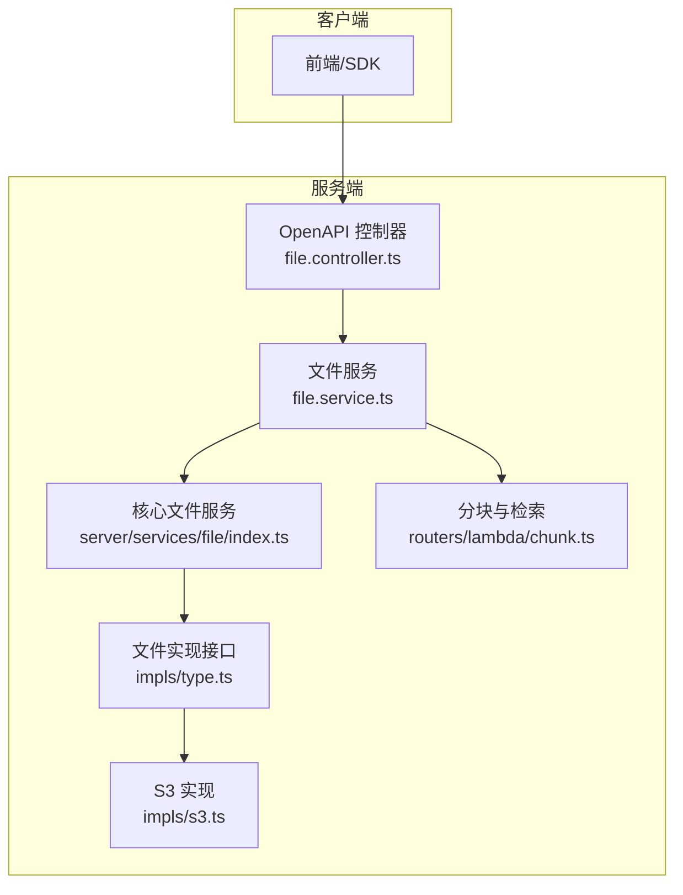
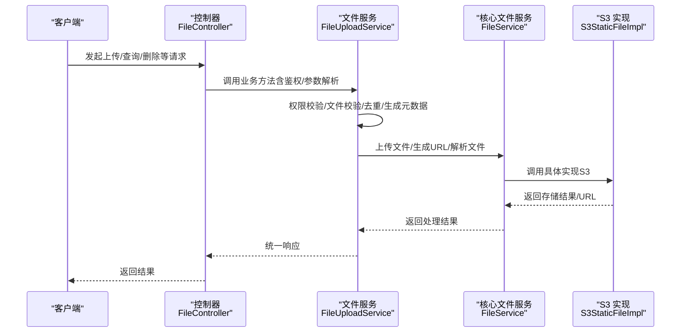
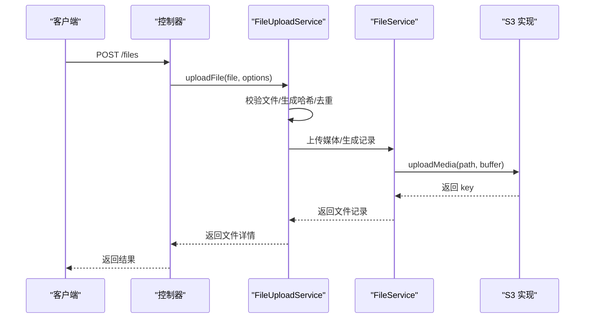
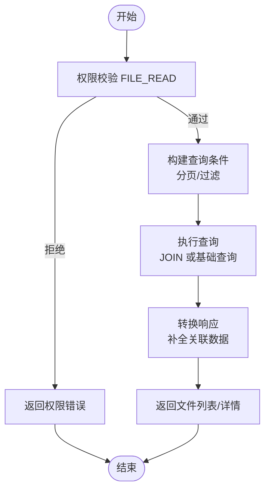
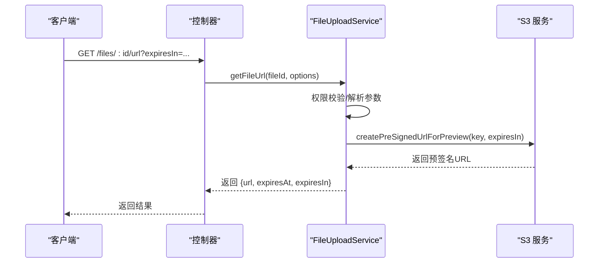
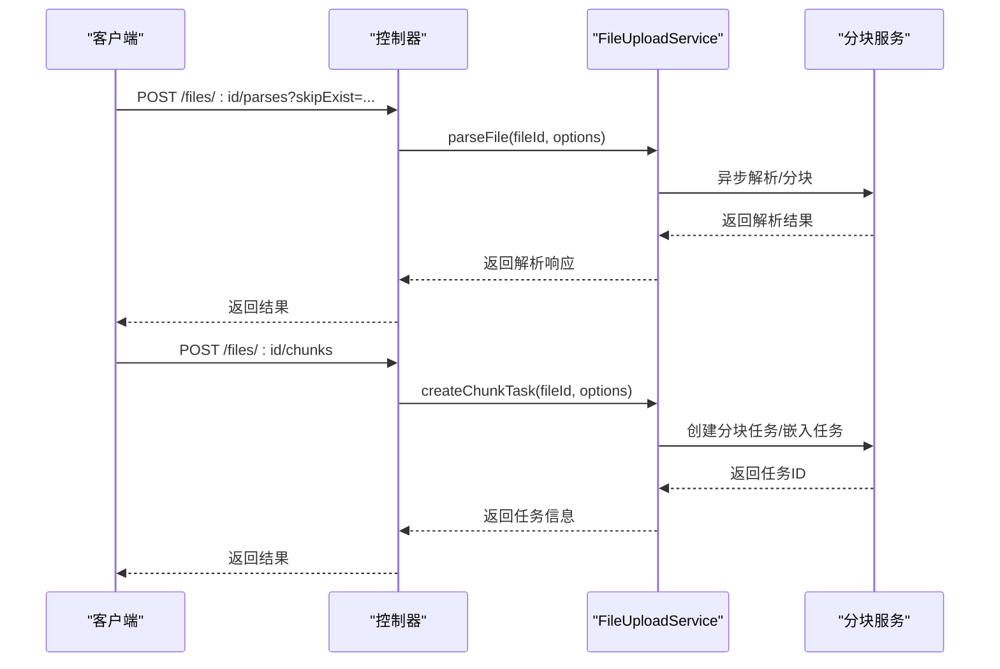
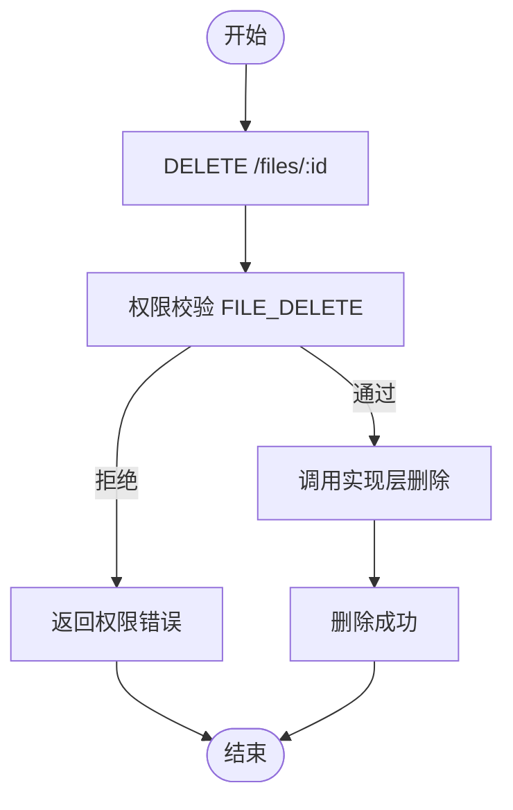
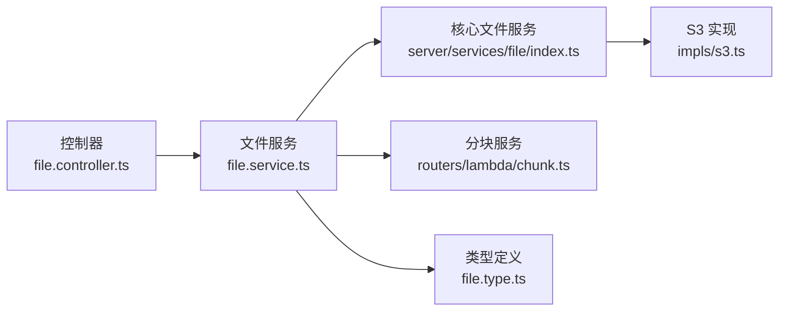

# 文件 API

<cite>
**本文引用的文件**
- [packages/openapi/src/controllers/file.controller.ts](file://packages/openapi/src/controllers/file.controller.ts)
- [packages/openapi/src/services/file.service.ts](file://packages/openapi/src/services/file.service.ts)
- [src/server/services/file/index.ts](file://src/server/services/file/index.ts)
- [src/server/services/file/impls/type.ts](file://src/server/services/file/impls/type.ts)
- [src/server/services/file/impls/s3.ts](file://src/server/services/file/impls/s3.ts)
- [src/server/routers/lambda/chunk.ts](file://src/server/routers/lambda/chunk.ts)
- [packages/openapi/src/types/file.type.ts](file://packages/openapi/src/types/file.type.ts)
- [docs/self-hosting/advanced/s3/cloudflare-r2.mdx](file://docs/self-hosting/advanced/s3/cloudflare-r2.mdx)
- [docs/self-hosting/platform/vercel.mdx](file://docs/self-hosting/platform/vercel.mdx)
</cite>

## 目录

1. [简介](#简介)
2. [项目结构](#项目结构)
3. [核心组件](#核心组件)
4. [架构总览](#架构总览)
5. [详细组件分析](#详细组件分析)
6. [依赖分析](#依赖分析)
7. [性能考虑](#性能考虑)
8. [故障排查指南](#故障排查指南)
9. [结论](#结论)
10. [附录](#附录)

## 简介

本文件 API 文档面向 LobeHub 的文件管理能力，覆盖上传、下载、删除、批量操作、分块解析、断点续传、文件预览、缩略图生成、存储策略、访问权限控制、文件类型与大小限制、云存储集成（S3/Cloudflare R2）、CDN 配置、安全扫描与清理策略等。文档基于仓库现有实现进行梳理与说明，并提供可视化架构图与流程图帮智能体解。

## 项目结构

围绕文件 API 的关键模块分布如下：

- OpenAPI 控制器层：负责路由与请求参数解析，调用服务层完成业务处理
- 服务层：封装文件上传、列表查询、URL 生成、解析与分块等核心逻辑
- 文件服务实现层：抽象出统一接口，当前实现为 S3 静态文件实现
- 分块与语义检索：提供文件解析、分块、嵌入与语义搜索能力
- 类型定义：统一前后端交互的数据模型与校验规则
- 文档与部署：提供云存储（S3/R2）与 CDN 配置说明

图表来源

- [packages/openapi/src/controllers/file.controller.ts](file://packages/openapi/src/controllers/file.controller.ts#L1-L322)
- [packages/openapi/src/services/file.service.ts](file://packages/openapi/src/services/file.service.ts#L1-L800)
- [src/server/services/file/index.ts](file://src/server/services/file/index.ts#L1-L361)
- [src/server/services/file/impls/type.ts](file://src/server/services/file/impls/type.ts#L1-L65)
- [src/server/services/file/impls/s3.ts](file://src/server/services/file/impls/s3.ts#L1-L122)
- [src/server/routers/lambda/chunk.ts](file://src/server/routers/lambda/chunk.ts#L1-L314)

章节来源

- [packages/openapi/src/controllers/file.controller.ts](file://packages/openapi/src/controllers/file.controller.ts#L1-L322)
- [packages/openapi/src/services/file.service.ts](file://packages/openapi/src/services/file.service.ts#L1-L800)
- [src/server/services/file/index.ts](file://src/server/services/file/index.ts#L1-L361)
- [src/server/services/file/impls/type.ts](file://src/server/services/file/impls/type.ts#L1-L65)
- [src/server/services/file/impls/s3.ts](file://src/server/services/file/impls/s3.ts#L1-L122)
- [src/server/routers/lambda/chunk.ts](file://src/server/routers/lambda/chunk.ts#L1-L314)

## 核心组件

- OpenAPI 控制器：提供文件上传、批量上传、列表查询、详情获取、URL 生成、解析、分块、删除、更新等 HTTP 接口
- 文件服务（服务端）：封装权限校验、文件校验、去重、上传、URL 生成、解析与分块任务创建
- 核心文件服务：提供通用文件操作（上传缓冲区、媒体上传、预签名 URL、元数据获取、全文 URL 生成、键提取）
- 文件实现接口与 S3 实现：抽象统一接口，当前实现为 S3 静态文件实现，支持删除、批量删除、内容读取、元数据获取、预签名 URL、完整 URL 生成与键提取
- 分块与检索：提供解析文件为分块、创建嵌入分块任务、按文件获取分块、语义检索、文件内容聚合等能力

章节来源

- [packages/openapi/src/controllers/file.controller.ts](file://packages/openapi/src/controllers/file.controller.ts#L20-L321)
- [packages/openapi/src/services/file.service.ts](file://packages/openapi/src/services/file.service.ts#L62-L785)
- [src/server/services/file/index.ts](file://src/server/services/file/index.ts#L19-L361)
- [src/server/services/file/impls/type.ts](file://src/server/services/file/impls/type.ts#L4-L64)
- [src/server/services/file/impls/s3.ts](file://src/server/services/file/impls/s3.ts#L13-L121)
- [src/server/routers/lambda/chunk.ts](file://src/server/routers/lambda/chunk.ts#L88-L314)

## 架构总览

文件 API 的调用链路如下：

- 客户端通过 OpenAPI 控制器发起请求
- 控制器解析参数并调用文件服务（服务端）
- 文件服务执行权限校验、文件校验、去重、上传、记录入库、生成 URL
- 核心文件服务委托具体实现（S3 实现）完成底层存储操作
- 对于非图片文件，服务端尝试解析内容；对于图片文件，直接返回文件详情
- 分块与检索服务提供解析、分块、嵌入与语义搜索能力

图表来源

- [packages/openapi/src/controllers/file.controller.ts](file://packages/openapi/src/controllers/file.controller.ts#L25-L321)
- [packages/openapi/src/services/file.service.ts](file://packages/openapi/src/services/file.service.ts#L144-L785)
- [src/server/services/file/index.ts](file://src/server/services/file/index.ts#L19-L361)
- [src/server/services/file/impls/s3.ts](file://src/server/services/file/impls/s3.ts#L13-L121)

## 详细组件分析

### 文件上传与批量上传

- 单文件上传
  - 路由：POST /files
  - 参数：multipart/form-data，包含 file 字段，以及可选的 knowledgeBaseId、directory、agentId、sessionId、skipCheckFileType、skipDeduplication
  - 流程：鉴权 → 文件校验 → 哈希计算 → 去重检查 → 上传至 S3 → 写入数据库 → 关联会话（可选） → 返回文件详情
- 批量上传
  - 路由：POST /files/batches
  - 参数：multipart/form-data，files 支持 files 与 files \[] 两种字段名（兼容 Stainless SDK）
  - 流程：鉴权 → 逐个文件执行单文件上传逻辑 → 汇总结果（成功 / 失败统计）

图表来源

- [packages/openapi/src/controllers/file.controller.ts](file://packages/openapi/src/controllers/file.controller.ts#L149-L186)
- [packages/openapi/src/services/file.service.ts](file://packages/openapi/src/services/file.service.ts#L649-L785)
- [src/server/services/file/index.ts](file://src/server/services/file/index.ts#L107-L120)
- [src/server/services/file/impls/s3.ts](file://src/server/services/file/impls/s3.ts#L112-L120)

章节来源

- [packages/openapi/src/controllers/file.controller.ts](file://packages/openapi/src/controllers/file.controller.ts#L25-L77)
- [packages/openapi/src/services/file.service.ts](file://packages/openapi/src/services/file.service.ts#L144-L190)
- [packages/openapi/src/types/file.type.ts](file://packages/openapi/src/types/file.type.ts#L13-L30)
- [packages/openapi/src/types/file.type.ts](file://packages/openapi/src/types/file.type.ts#L140-L153)

### 文件列表与详情

- 列表查询
  - 路由：GET /files
  - 参数：分页、fileType、knowledgeBaseId、queryAll、userId、updatedAtStart/End 等
  - 权限：根据 queryAll、userId、knowledgeBaseId 与全局权限决定资源范围
  - 结果：文件列表、总数、总大小
- 详情获取
  - 路由：GET /files/:id
  - 权限：FILE_READ
  - 图片文件：直接返回文件详情；非图片文件：尝试解析内容并返回解析结果

图表来源

- [packages/openapi/src/controllers/file.controller.ts](file://packages/openapi/src/controllers/file.controller.ts#L83-L117)
- [packages/openapi/src/services/file.service.ts](file://packages/openapi/src/services/file.service.ts#L198-L334)
- [packages/openapi/src/services/file.service.ts](file://packages/openapi/src/services/file.service.ts#L548-L601)

章节来源

- [packages/openapi/src/controllers/file.controller.ts](file://packages/openapi/src/controllers/file.controller.ts#L83-L117)
- [packages/openapi/src/services/file.service.ts](file://packages/openapi/src/services/file.service.ts#L198-L334)
- [packages/openapi/src/types/file.type.ts](file://packages/openapi/src/types/file.type.ts#L63-L89)

### 文件 URL 生成与预览

- 获取文件访问 URL
  - 路由：GET /files/:id/url
  - 参数：expiresIn（秒，默认 3600）
  - 权限：FILE_READ
  - 实现：生成预签名 URL（S3），并计算过期时间戳
- 完整 URL 生成与键提取
  - 核心文件服务提供 getFullFileUrl 与 getKeyFromFullUrl，支持代理 URL、历史数据兼容与路径风格 / 虚拟主机风格解析

图表来源

- [packages/openapi/src/controllers/file.controller.ts](file://packages/openapi/src/controllers/file.controller.ts#L123-L143)
- [packages/openapi/src/services/file.service.ts](file://packages/openapi/src/services/file.service.ts#L606-L644)
- [src/server/services/file/impls/s3.ts](file://src/server/services/file/impls/s3.ts#L46-L48)

章节来源

- [packages/openapi/src/controllers/file.controller.ts](file://packages/openapi/src/controllers/file.controller.ts#L123-L143)
- [packages/openapi/src/services/file.service.ts](file://packages/openapi/src/services/file.service.ts#L606-L644)
- [src/server/services/file/index.ts](file://src/server/services/file/index.ts#L93-L102)
- [src/server/services/file/impls/s3.ts](file://src/server/services/file/impls/s3.ts#L54-L110)

### 文件解析与分块

- 解析文件内容
  - 路由：POST /files/:id/parses
  - 参数：skipExist（跳过已存在解析结果）
  - 实现：非图片文件尝试解析，返回解析结果（内容、元数据、状态）
- 创建分块任务
  - 路由：POST /files/:id/chunks
  - 参数：autoEmbedding（是否自动触发嵌入）、skipExist（跳过已存在任务）
  - 实现：创建分块异步任务，可选触发嵌入任务
- 查询分块状态
  - 路由：GET /files/:id/chunks
  - 实现：返回分块任务状态、嵌入任务状态与错误信息

图表来源

- [packages/openapi/src/controllers/file.controller.ts](file://packages/openapi/src/controllers/file.controller.ts#L192-L256)
- [packages/openapi/src/services/file.service.ts](file://packages/openapi/src/services/file.service.ts#L789-L800)
- [src/server/routers/lambda/chunk.ts](file://src/server/routers/lambda/chunk.ts#L88-L112)

章节来源

- [packages/openapi/src/controllers/file.controller.ts](file://packages/openapi/src/controllers/file.controller.ts#L192-L256)
- [packages/openapi/src/services/file.service.ts](file://packages/openapi/src/services/file.service.ts#L789-L800)
- [src/server/routers/lambda/chunk.ts](file://src/server/routers/lambda/chunk.ts#L88-L112)
- [packages/openapi/src/types/file.type.ts](file://packages/openapi/src/types/file.type.ts#L208-L252)
- [packages/openapi/src/types/file.type.ts](file://packages/openapi/src/types/file.type.ts#L259-L283)
- [packages/openapi/src/types/file.type.ts](file://packages/openapi/src/types/file.type.ts#L341-L354)

### 文件删除与批量操作

- 删除单个文件
  - 路由：DELETE /files/:id
  - 权限：FILE_DELETE
  - 实现：调用实现层删除文件
- 批量获取文件详情与内容
  - 路由：POST /files/queries
  - 参数：fileIds 数组
  - 实现：校验参数 → 查询文件 → 返回文件详情与内容（含失败项）

图表来源

- [packages/openapi/src/controllers/file.controller.ts](file://packages/openapi/src/controllers/file.controller.ts#L262-L275)
- [src/server/services/file/impls/s3.ts](file://src/server/services/file/impls/s3.ts#L22-L28)

章节来源

- [packages/openapi/src/controllers/file.controller.ts](file://packages/openapi/src/controllers/file.controller.ts#L262-L299)
- [packages/openapi/src/services/file.service.ts](file://packages/openapi/src/services/file.service.ts#L281-L299)
- [src/server/services/file/impls/s3.ts](file://src/server/services/file/impls/s3.ts#L22-L28)

### 文件更新与知识库关联

- 更新文件
  - 路由：PATCH /files/:id
  - 参数：knowledgeBaseId（可空）
  - 权限：FILE_UPDATE
- 知识库文件管理
  - 将文件加入 / 移除知识库、批量移动文件、查询知识库文件列表等

章节来源

- [packages/openapi/src/controllers/file.controller.ts](file://packages/openapi/src/controllers/file.controller.ts#L305-L320)
- [packages/openapi/src/services/file.service.ts](file://packages/openapi/src/services/file.service.ts#L340-L543)
- [packages/openapi/src/types/file.type.ts](file://packages/openapi/src/types/file.type.ts#L367-L370)

### 文件类型验证与大小限制

- 服务端上传流程中包含文件校验（可跳过），并计算哈希进行去重
- 前端示例包含图片文件大小验证工具（用于 UI 层约束），服务端仍以实际上传内容为准

章节来源

- [packages/openapi/src/services/file.service.ts](file://packages/openapi/src/services/file.service.ts#L664-L666)
- [src/routes/(main)/image/\_layout/ConfigPanel/utils/imageValidation.ts](<file://src/routes/(main)/image/_layout/ConfigPanel/utils/imageValidation.ts#L166-L206>)

### 云存储集成与 CDN 配置

- S3/Cloudflare R2 集成
  - 通过环境变量配置 S3_ENDPOINT、S3_BUCKET、S3_ACCESS_KEY_ID、S3_SECRET_ACCESS_KEY 等
  - 支持路径风格与虚拟主机风格访问
  - 需配置 CORS，允许 Web 与桌面端访问
- CDN 与公开访问
  - 若未设置公共读 ACL，需通过预签名 URL 访问
  - 可通过 S3_PUBLIC_DOMAIN 与 S3_ENABLE_PATH_STYLE 配置公开访问 URL

章节来源

- [docs/self-hosting/advanced/s3/cloudflare-r2.mdx](file://docs/self-hosting/advanced/s3/cloudflare-r2.mdx#L1-L89)
- [docs/self-hosting/platform/vercel.mdx](file://docs/self-hosting/platform/vercel.mdx#L136-L225)
- [src/server/services/file/impls/s3.ts](file://src/server/services/file/impls/s3.ts#L54-L78)

### 文件安全扫描与清理策略

- 安全扫描
  - 服务端在上传时进行文件校验（可跳过），并基于哈希进行去重，避免重复存储
  - 预签名 URL 提供临时访问能力，降低长期公开风险
- 清理策略
  - 删除文件时调用实现层删除，同时数据库记录可按配置清理
  - 对于缺失的远程文件，下载时检测并清理数据库记录

章节来源

- [packages/openapi/src/services/file.service.ts](file://packages/openapi/src/services/file.service.ts#L664-L746)
- [src/server/services/file/index.ts](file://src/server/services/file/index.ts#L332-L359)

## 依赖分析

- 控制器依赖服务层，服务层依赖核心文件服务与 S3 实现
- 分块与检索服务依赖文件模型、异步任务模型与嵌入模型
- 类型定义贯穿控制器、服务与分块模块，保证数据一致性

图表来源

- [packages/openapi/src/controllers/file.controller.ts](file://packages/openapi/src/controllers/file.controller.ts#L1-L322)
- [packages/openapi/src/services/file.service.ts](file://packages/openapi/src/services/file.service.ts#L1-L800)
- [src/server/services/file/index.ts](file://src/server/services/file/index.ts#L1-L361)
- [src/server/services/file/impls/s3.ts](file://src/server/services/file/impls/s3.ts#L1-L122)
- [src/server/routers/lambda/chunk.ts](file://src/server/routers/lambda/chunk.ts#L1-L314)
- [packages/openapi/src/types/file.type.ts](file://packages/openapi/src/types/file.type.ts#L1-L375)

章节来源

- [packages/openapi/src/controllers/file.controller.ts](file://packages/openapi/src/controllers/file.controller.ts#L1-L322)
- [packages/openapi/src/services/file.service.ts](file://packages/openapi/src/services/file.service.ts#L1-L800)
- [src/server/services/file/index.ts](file://src/server/services/file/index.ts#L1-L361)
- [src/server/services/file/impls/s3.ts](file://src/server/services/file/impls/s3.ts#L1-L122)
- [src/server/routers/lambda/chunk.ts](file://src/server/routers/lambda/chunk.ts#L1-L314)
- [packages/openapi/src/types/file.type.ts](file://packages/openapi/src/types/file.type.ts#L1-L375)

## 性能考虑

- 并发与批处理：批量上传与批量查询采用并发处理，提升吞吐
- 去重与缓存：基于哈希去重，减少重复上传与存储
- 预签名 URL：按需生成，避免长期公开暴露
- 分块与嵌入：异步任务化，避免阻塞主流程
- 数据库查询：分页与条件组合查询，结合索引与连接优化

## 故障排查指南

- 上传失败
  - 检查权限与文件校验（skipCheckFileType 仅用于特殊场景）
  - 确认 S3 环境变量配置正确，CORS 已允许来源域名
  - 查看去重逻辑：若文件已存在，可能直接返回已有记录
- URL 无法访问
  - 若未设置公共读 ACL，需使用预签名 URL
  - 检查 S3_PUBLIC_DOMAIN 与路径风格配置
- 解析失败
  - 非图片文件解析异常会被捕获并返回错误信息
  - 可重新触发解析任务或检查文件类型与内容
- 删除后仍可见
  - 下载时若发现远程文件缺失，会清理数据库记录；请确认删除是否成功

章节来源

- [packages/openapi/src/services/file.service.ts](file://packages/openapi/src/services/file.service.ts#L649-L785)
- [src/server/services/file/index.ts](file://src/server/services/file/index.ts#L332-L359)
- [src/server/services/file/impls/s3.ts](file://src/server/services/file/impls/s3.ts#L54-L78)

## 结论

本文档基于仓库现有实现，系统梳理了 LobeHub 文件 API 的端点规范、权限控制、存储策略与云服务集成方式。通过控制器、服务层与实现层的清晰分层，配合分块与检索能力，满足上传、下载、解析、分块、权限与安全等多方面需求。建议在生产环境中完善文件类型与大小限制、安全扫描与清理策略，并结合 CDN 与预签名 URL 提升访问效率与安全性。

## 附录

- 环境变量参考
  - S3_BUCKET、S3_ENDPOINT、S3_ACCESS_KEY_ID、S3_SECRET_ACCESS_KEY、S3_REGION
  - S3_PUBLIC_DOMAIN、S3_SET_ACL、S3_ENABLE_PATH_STYLE
- CORS 配置要点
  - 允许 Web 与桌面端来源域名
  - 方法与头部需包含 GET/PUT/HEAD/POST/DELETE 与 \*
- CDN 与公开访问
  - 未设置公共读 ACL 时，使用预签名 URL
  - 路径风格与虚拟主机风格需与 S3 兼容

章节来源

- [docs/self-hosting/advanced/s3/cloudflare-r2.mdx](file://docs/self-hosting/advanced/s3/cloudflare-r2.mdx#L1-L89)
- [docs/self-hosting/platform/vercel.mdx](file://docs/self-hosting/platform/vercel.mdx#L136-L225)
- [src/server/services/file/impls/s3.ts](file://src/server/services/file/impls/s3.ts#L54-L78)
