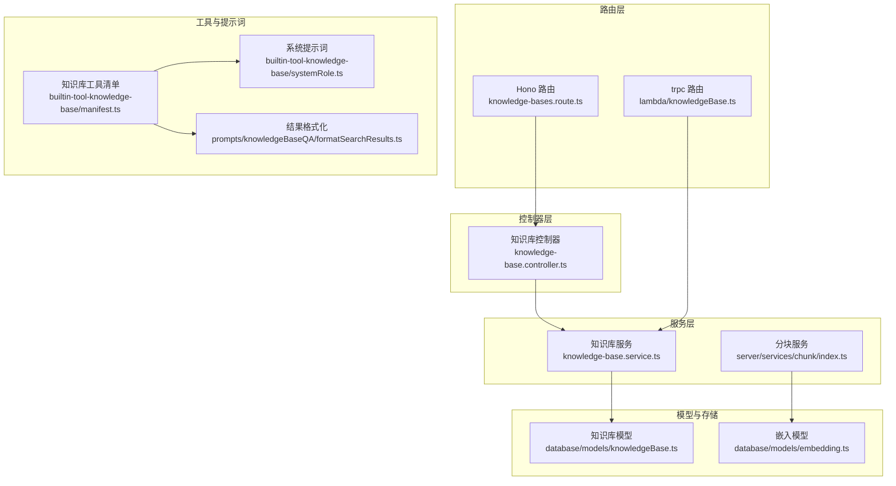
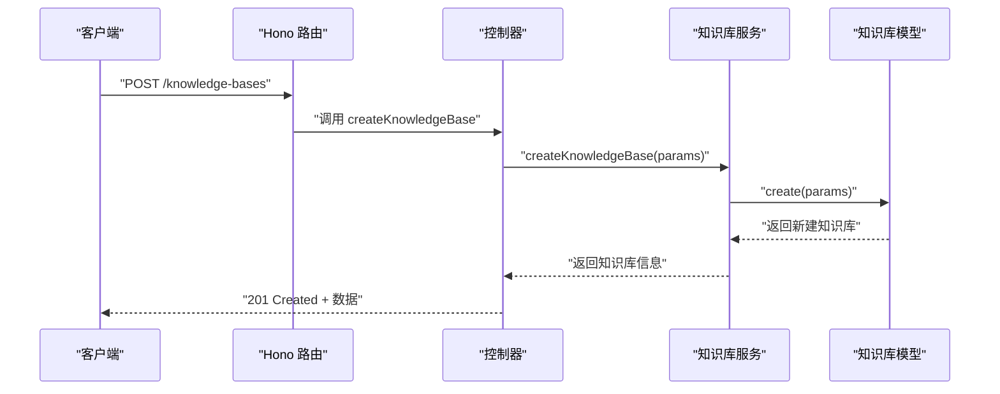
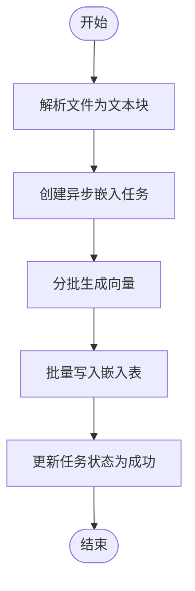
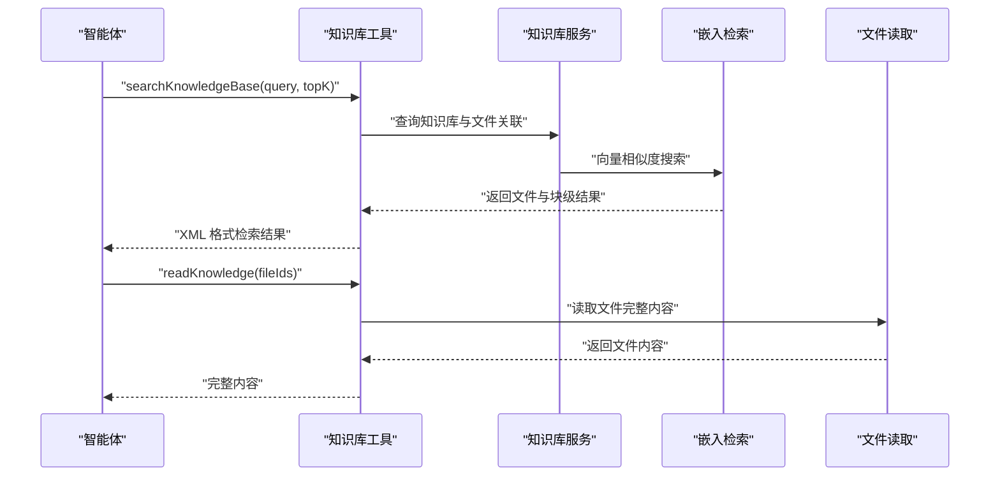
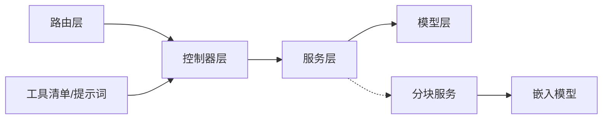

# 知识库 API

<cite>
**本文引用的文件**
- [packages/openapi/src/controllers/knowledge-base.controller.ts](file://packages/openapi/src/controllers/knowledge-base.controller.ts)
- [packages/openapi/src/routes/knowledge-bases.route.ts](file://packages/openapi/src/routes/knowledge-bases.route.ts)
- [packages/openapi/src/services/knowledge-base.service.ts](file://packages/openapi/src/services/knowledge-base.service.ts)
- [packages/openapi/src/types/knowledge-base.type.ts](file://packages/openapi/src/types/knowledge-base.type.ts)
- [src/server/routers/lambda/knowledgeBase.ts](file://src/server/routers/lambda/knowledgeBase.ts)
- [packages/database/src/models/knowledgeBase.ts](file://packages/database/src/models/knowledgeBase.ts)
- [packages/database/src/models/embedding.ts](file://packages/database/src/models/embedding.ts)
- [packages/model-runtime/src/types/embeddings.ts](file://packages/model-runtime/src/types/embeddings.ts)
- [src/server/routers/lambda/chunk.ts](file://src/server/routers/lambda/chunk.ts)
- [src/server/services/chunk/index.ts](file://src/server/services/chunk/index.ts)
- [packages/prompts/src/prompts/knowledgeBaseQA/formatSearchResults.ts](file://packages/prompts/src/prompts/knowledgeBaseQA/formatSearchResults.ts)
- [packages/builtin-tool-knowledge-base/src/manifest.ts](file://packages/builtin-tool-knowledge-base/src/manifest.ts)
- [packages/builtin-tool-knowledge-base/src/systemRole.ts](file://packages/builtin-tool-knowledge-base/src/systemRole.ts)
- [packages/types/src/knowledgeBase/index.ts](file://packages/types/src/knowledgeBase/index.ts)
</cite>

## 目录

1. [简介](#简介)
2. [项目结构](#项目结构)
3. [核心组件](#核心组件)
4. [架构总览](#架构总览)
5. [详细组件分析](#详细组件分析)
6. [依赖关系分析](#依赖关系分析)
7. [性能考量](#性能考量)
8. [故障排查指南](#故障排查指南)
9. [结论](#结论)
10. [附录](#附录)

## 简介

本文件为 LobeHub 知识库 API 的权威文档，覆盖知识库生命周期管理、文档索引与分块、向量嵌入生成、相似度检索、RAG 集成与问答流程等能力。内容面向后端开发者与产品 / 运营人员，既提供接口规范，也给出实现要点、性能优化建议与常见问题排查方法。

## 项目结构

知识库 API 由三层组成：

- 路由层：定义 REST API 路由与参数校验
- 控制器层：接收请求、鉴权、调用服务层
- 服务层：封装业务逻辑、数据库交互与权限控制

此外，向量化与检索涉及独立的分块与嵌入服务，以及内置工具的 RAG 工作流。

图表来源

- [packages/openapi/src/routes/knowledge-bases.route.ts](file://packages/openapi/src/routes/knowledge-bases.route.ts#L1-L207)
- [src/server/routers/lambda/knowledgeBase.ts](file://src/server/routers/lambda/knowledgeBase.ts#L1-L97)
- [packages/openapi/src/controllers/knowledge-base.controller.ts](file://packages/openapi/src/controllers/knowledge-base.controller.ts#L1-L205)
- [packages/openapi/src/services/knowledge-base.service.ts](file://packages/openapi/src/services/knowledge-base.service.ts#L1-L254)
- [packages/database/src/models/knowledgeBase.ts](file://packages/database/src/models/knowledgeBase.ts#L1-L162)
- [packages/database/src/models/embedding.ts](file://packages/database/src/models/embedding.ts#L1-L63)
- [src/server/services/chunk/index.ts](file://src/server/services/chunk/index.ts#L1-L44)
- [packages/builtin-tool-knowledge-base/src/manifest.ts](file://packages/builtin-tool-knowledge-base/src/manifest.ts#L1-L61)
- [packages/builtin-tool-knowledge-base/src/systemRole.ts](file://packages/builtin-tool-knowledge-base/src/systemRole.ts#L1-L16)
- [packages/prompts/src/prompts/knowledgeBaseQA/formatSearchResults.ts](file://packages/prompts/src/prompts/knowledgeBaseQA/formatSearchResults.ts#L1-L50)

章节来源

- [packages/openapi/src/routes/knowledge-bases.route.ts](file://packages/openapi/src/routes/knowledge-bases.route.ts#L1-L207)
- [packages/openapi/src/controllers/knowledge-base.controller.ts](file://packages/openapi/src/controllers/knowledge-base.controller.ts#L1-L205)
- [packages/openapi/src/services/knowledge-base.service.ts](file://packages/openapi/src/services/knowledge-base.service.ts#L1-L254)
- [packages/database/src/models/knowledgeBase.ts](file://packages/database/src/models/knowledgeBase.ts#L1-L162)
- [packages/database/src/models/embedding.ts](file://packages/database/src/models/embedding.ts#L1-L63)
- [src/server/services/chunk/index.ts](file://src/server/services/chunk/index.ts#L1-L44)
- [packages/builtin-tool-knowledge-base/src/manifest.ts](file://packages/builtin-tool-knowledge-base/src/manifest.ts#L1-L61)
- [packages/builtin-tool-knowledge-base/src/systemRole.ts](file://packages/builtin-tool-knowledge-base/src/systemRole.ts#L1-L16)
- [packages/prompts/src/prompts/knowledgeBaseQA/formatSearchResults.ts](file://packages/prompts/src/prompts/knowledgeBaseQA/formatSearchResults.ts#L1-L50)

## 核心组件

- 知识库管理 API：支持创建、查询、更新、删除知识库，以及查询知识库下文件列表与批量文件关联 / 移动 / 移除
- 分块与嵌入服务：异步解析文件为文本块并生成向量，写入嵌入表
- 检索与 RAG：基于向量相似度检索，结合工具清单与系统提示词完成问答
- 类型与配置：统一的知识库与嵌入类型定义，便于前后端协作

章节来源

- [packages/openapi/src/types/knowledge-base.type.ts](file://packages/openapi/src/types/knowledge-base.type.ts#L1-L166)
- [packages/types/src/knowledgeBase/index.ts](file://packages/types/src/knowledgeBase/index.ts#L1-L54)
- [packages/model-runtime/src/types/embeddings.ts](file://packages/model-runtime/src/types/embeddings.ts#L1-L34)

## 架构总览

下面以序列图展示 “创建知识库并上传文件” 的典型流程，包括路由、控制器、服务与模型的调用链路。

图表来源

- [packages/openapi/src/routes/knowledge-bases.route.ts](file://packages/openapi/src/routes/knowledge-bases.route.ts#L53-L62)
- [packages/openapi/src/controllers/knowledge-base.controller.ts](file://packages/openapi/src/controllers/knowledge-base.controller.ts#L148-L162)
- [packages/openapi/src/services/knowledge-base.service.ts](file://packages/openapi/src/services/knowledge-base.service.ts#L134-L171)
- [packages/database/src/models/knowledgeBase.ts](file://packages/database/src/models/knowledgeBase.ts#L19-L26)

## 详细组件分析

### 知识库管理 API 规范

- 路由与权限
  - 使用鉴权中间件与 RBAC 权限校验，分别支持 “创建 / 读取 / 更新 / 删除” 等范围权限
  - 参数校验采用 zod schema，确保请求体与路径 / 查询参数合法
- 主要端点
  - GET /knowledge-bases：分页查询知识库列表，支持 keyword 关键词过滤
  - POST /knowledge-bases：创建知识库（name/description/avatar）
  - GET /knowledge-bases/:id：获取知识库详情
  - PATCH /knowledge-bases/:id：更新知识库
  - DELETE /knowledge-bases/:id：删除知识库
  - GET /knowledge-bases/:id/files：查询知识库下文件列表（分页、按文件类型过滤、关键词）
  - POST /knowledge-bases/:id/files/batch：批量添加文件到知识库
  - DELETE /knowledge-bases/:id/files/batch：批量移除知识库中的文件
  - POST /knowledge-bases/:id/files/move：批量移动文件到目标知识库

章节来源

- [packages/openapi/src/routes/knowledge-bases.route.ts](file://packages/openapi/src/routes/knowledge-bases.route.ts#L21-L204)
- [packages/openapi/src/controllers/knowledge-base.controller.ts](file://packages/openapi/src/controllers/knowledge-base.controller.ts#L24-L203)
- [packages/openapi/src/types/knowledge-base.type.ts](file://packages/openapi/src/types/knowledge-base.type.ts#L10-L166)

### 知识库服务层逻辑

- 权限控制：每个操作均通过 resolveOperationPermission 进行权限判定
- 分页与过滤：统一使用 processPaginationConditions 处理分页，支持 keyword 模糊匹配
- 数据一致性：在更新 / 删除时严格限定 userId，避免越权访问
- 返回结构：统一返回分页响应结构，包含总数与列表项

章节来源

- [packages/openapi/src/services/knowledge-base.service.ts](file://packages/openapi/src/services/knowledge-base.service.ts#L34-L99)
- [packages/openapi/src/services/knowledge-base.service.ts](file://packages/openapi/src/services/knowledge-base.service.ts#L101-L130)
- [packages/openapi/src/services/knowledge-base.service.ts](file://packages/openapi/src/services/knowledge-base.service.ts#L132-L171)
- [packages/openapi/src/services/knowledge-base.service.ts](file://packages/openapi/src/services/knowledge-base.service.ts#L173-L215)
- [packages/openapi/src/services/knowledge-base.service.ts](file://packages/openapi/src/services/knowledge-base.service.ts#L217-L252)

### 知识库模型与文件关联

- 新增知识库：插入 knowledgeBases 表，自动绑定 userId
- 文件关联 / 解绑：支持直接文件 ID 与 “文档镜像” ID（以 docs\_ 开头）混合处理，内部解析为真实文件 ID 再入库
- 查询：按 userId 过滤，支持分页与排序

章节来源

- [packages/database/src/models/knowledgeBase.ts](file://packages/database/src/models/knowledgeBase.ts#L19-L26)
- [packages/database/src/models/knowledgeBase.ts](file://packages/database/src/models/knowledgeBase.ts#L28-L64)
- [packages/database/src/models/knowledgeBase.ts](file://packages/database/src/models/knowledgeBase.ts#L77-L122)
- [packages/database/src/models/knowledgeBase.ts](file://packages/database/src/models/knowledgeBase.ts#L124-L148)

### 分块与嵌入流水线

- 分块服务
  - 提供同步分块与异步解析任务创建
  - 支持不同文件类型的分块策略规则解析
- 异步嵌入
  - 为文件创建异步任务，批量生成向量并写入嵌入表
  - 支持并发与超时控制，失败时记录错误类型

图表来源

- [src/server/services/chunk/index.ts](file://src/server/services/chunk/index.ts#L29-L44)
- [src/server/routers/lambda/chunk.ts](file://src/server/routers/lambda/chunk.ts#L88-L112)
- [packages/database/src/models/embedding.ts](file://packages/database/src/models/embedding.ts#L25-L32)

章节来源

- [src/server/services/chunk/index.ts](file://src/server/services/chunk/index.ts#L1-L44)
- [src/server/routers/lambda/chunk.ts](file://src/server/routers/lambda/chunk.ts#L88-L112)
- [packages/database/src/models/embedding.ts](file://packages/database/src/models/embedding.ts#L1-L63)
- [packages/model-runtime/src/types/embeddings.ts](file://packages/model-runtime/src/types/embeddings.ts#L1-L34)

### 检索与 RAG 集成

- 工具清单
  - 提供 searchKnowledgeBase 与 readKnowledge 两个工具，用于语义检索与全文读取
  - 参数约束明确，如 topK 默认值、fileIds 必填等
- 系统提示词
  - 明确检索 - 阅读 - 合成 - 引用的流程，提升问答质量
- 结果格式化
  - 将检索结果格式化为带相似度与文件元信息的 XML，便于下游工具消费

图表来源

- [packages/builtin-tool-knowledge-base/src/manifest.ts](file://packages/builtin-tool-knowledge-base/src/manifest.ts#L7-L51)
- [packages/builtin-tool-knowledge-base/src/systemRole.ts](file://packages/builtin-tool-knowledge-base/src/systemRole.ts#L1-L16)
- [packages/prompts/src/prompts/knowledgeBaseQA/formatSearchResults.ts](file://packages/prompts/src/prompts/knowledgeBaseQA/formatSearchResults.ts#L37-L50)

章节来源

- [packages/builtin-tool-knowledge-base/src/manifest.ts](file://packages/builtin-tool-knowledge-base/src/manifest.ts#L1-L61)
- [packages/builtin-tool-knowledge-base/src/systemRole.ts](file://packages/builtin-tool-knowledge-base/src/systemRole.ts#L1-L16)
- [packages/prompts/src/prompts/knowledgeBaseQA/formatSearchResults.ts](file://packages/prompts/src/prompts/knowledgeBaseQA/formatSearchResults.ts#L1-L50)

## 依赖关系分析

- 路由层依赖控制器层，控制器层依赖服务层，服务层依赖模型层
- 分块服务与嵌入服务独立于知识库路由，通过异步任务与嵌入模型协作
- 工具清单与系统提示词为检索 - 阅读 - 问答工作流提供规范

图表来源

- [packages/openapi/src/routes/knowledge-bases.route.ts](file://packages/openapi/src/routes/knowledge-bases.route.ts#L1-L207)
- [packages/openapi/src/controllers/knowledge-base.controller.ts](file://packages/openapi/src/controllers/knowledge-base.controller.ts#L1-L205)
- [packages/openapi/src/services/knowledge-base.service.ts](file://packages/openapi/src/services/knowledge-base.service.ts#L1-L254)
- [packages/database/src/models/knowledgeBase.ts](file://packages/database/src/models/knowledgeBase.ts#L1-L162)
- [src/server/services/chunk/index.ts](file://src/server/services/chunk/index.ts#L1-L44)
- [packages/database/src/models/embedding.ts](file://packages/database/src/models/embedding.ts#L1-L63)
- [packages/builtin-tool-knowledge-base/src/manifest.ts](file://packages/builtin-tool-knowledge-base/src/manifest.ts#L1-L61)

章节来源

- [packages/openapi/src/routes/knowledge-bases.route.ts](file://packages/openapi/src/routes/knowledge-bases.route.ts#L1-L207)
- [packages/openapi/src/controllers/knowledge-base.controller.ts](file://packages/openapi/src/controllers/knowledge-base.controller.ts#L1-L205)
- [packages/openapi/src/services/knowledge-base.service.ts](file://packages/openapi/src/services/knowledge-base.service.ts#L1-L254)
- [packages/database/src/models/knowledgeBase.ts](file://packages/database/src/models/knowledgeBase.ts#L1-L162)
- [src/server/services/chunk/index.ts](file://src/server/services/chunk/index.ts#L1-L44)
- [packages/database/src/models/embedding.ts](file://packages/database/src/models/embedding.ts#L1-L63)
- [packages/builtin-tool-knowledge-base/src/manifest.ts](file://packages/builtin-tool-knowledge-base/src/manifest.ts#L1-L61)

## 性能考量

- 分页与过滤
  - 列表查询默认分页，支持 keyword 模糊匹配；合理设置 pageSize 与分页策略，避免一次性加载过多数据
- 并发与批处理
  - 嵌入生成支持并发，建议根据资源情况调整并发度，避免数据库压力过大
- 向量维度与模型
  - 嵌入维度可配置，高维向量会增加存储与计算成本；根据场景选择合适维度
- 缓存与索引
  - 对热点知识库与高频查询结果可考虑缓存；对嵌入表建立合适索引以加速相似度检索

## 故障排查指南

- 权限不足
  - 确认已登录并通过 RBAC 权限校验；检查对应范围权限是否授予
- 参数校验失败
  - 检查请求体字段类型与长度限制；关注必填字段与默认值
- 唯一约束冲突
  - 文件重复加入同一知识库会触发唯一约束；请先移除再添加或使用移动接口
- 异步任务异常
  - 嵌入任务失败时会记录错误类型；检查日志定位具体错误并重试

章节来源

- [src/server/routers/lambda/knowledgeBase.ts](file://src/server/routers/lambda/knowledgeBase.ts#L20-L40)
- [packages/openapi/src/routes/knowledge-bases.route.ts](file://packages/openapi/src/routes/knowledge-bases.route.ts#L1-L207)
- [packages/openapi/src/controllers/knowledge-base.controller.ts](file://packages/openapi/src/controllers/knowledge-base.controller.ts#L1-L205)
- [src/server/routers/lambda/chunk.ts](file://src/server/routers/lambda/chunk.ts#L101-L139)

## 结论

本知识库 API 体系提供了从知识库管理、文件分块、向量嵌入到检索与 RAG 的完整闭环。通过清晰的路由与权限控制、健壮的服务层与模型层、以及标准化的工具与提示词，能够支撑企业级知识管理与智能问答场景。建议在生产环境中结合性能指标持续优化分页、并发与索引策略，并完善监控与告警机制。

## 附录

### API 端点一览（摘要）

- GET /knowledge-bases：分页查询知识库列表
- POST /knowledge-bases：创建知识库
- GET /knowledge-bases/:id：获取知识库详情
- PATCH /knowledge-bases/:id：更新知识库
- DELETE /knowledge-bases/:id：删除知识库
- GET /knowledge-bases/:id/files：查询知识库下文件列表
- POST /knowledge-bases/:id/files/batch：批量添加文件
- DELETE /knowledge-bases/:id/files/batch：批量移除文件
- POST /knowledge-bases/:id/files/move：批量移动文件

章节来源

- [packages/openapi/src/routes/knowledge-bases.route.ts](file://packages/openapi/src/routes/knowledge-bases.route.ts#L21-L204)

### 工具与提示词

- 工具清单：searchKnowledgeBase、readKnowledge
- 系统提示词：明确检索 - 阅读 - 合成 - 引用流程
- 结果格式化：XML 结构输出，便于下游工具解析

章节来源

- [packages/builtin-tool-knowledge-base/src/manifest.ts](file://packages/builtin-tool-knowledge-base/src/manifest.ts#L1-L61)
- [packages/builtin-tool-knowledge-base/src/systemRole.ts](file://packages/builtin-tool-knowledge-base/src/systemRole.ts#L1-L16)
- [packages/prompts/src/prompts/knowledgeBaseQA/formatSearchResults.ts](file://packages/prompts/src/prompts/knowledgeBaseQA/formatSearchResults.ts#L1-L50)
