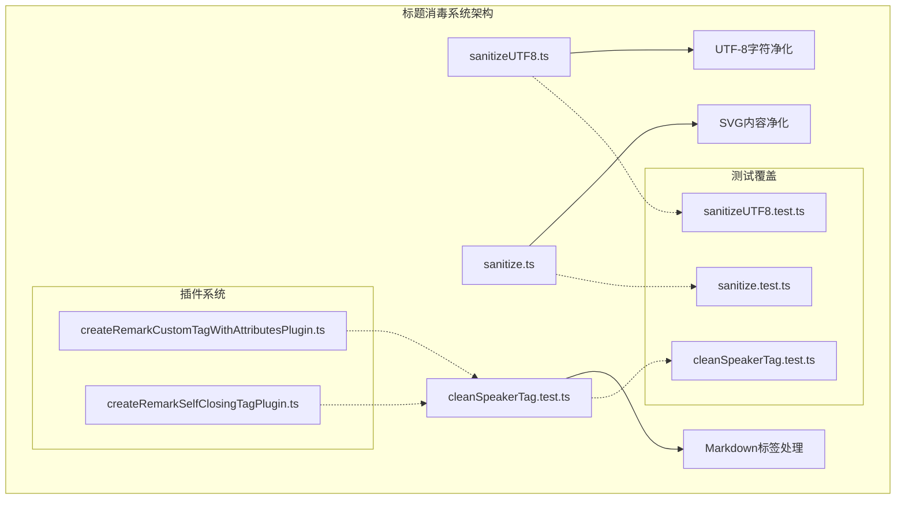
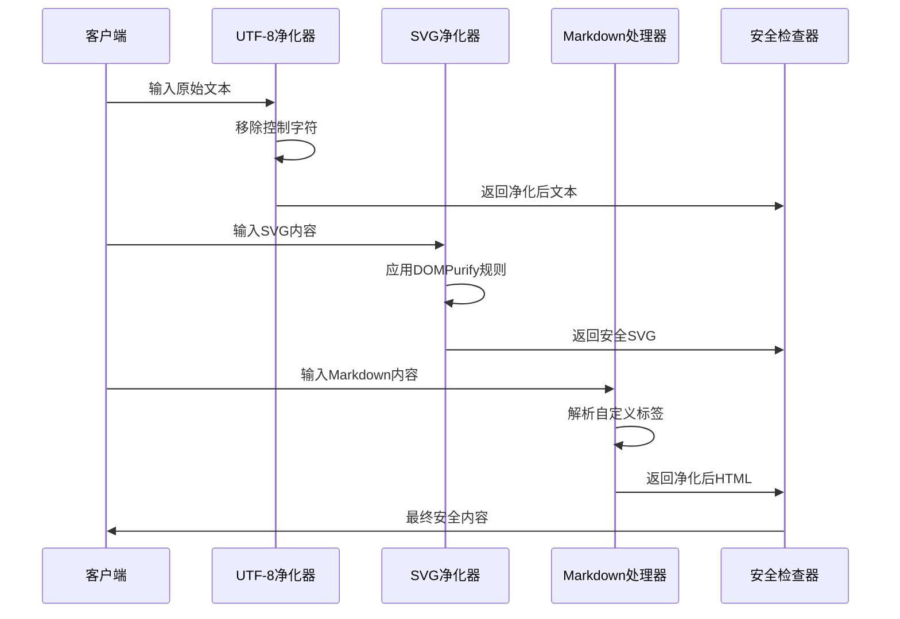
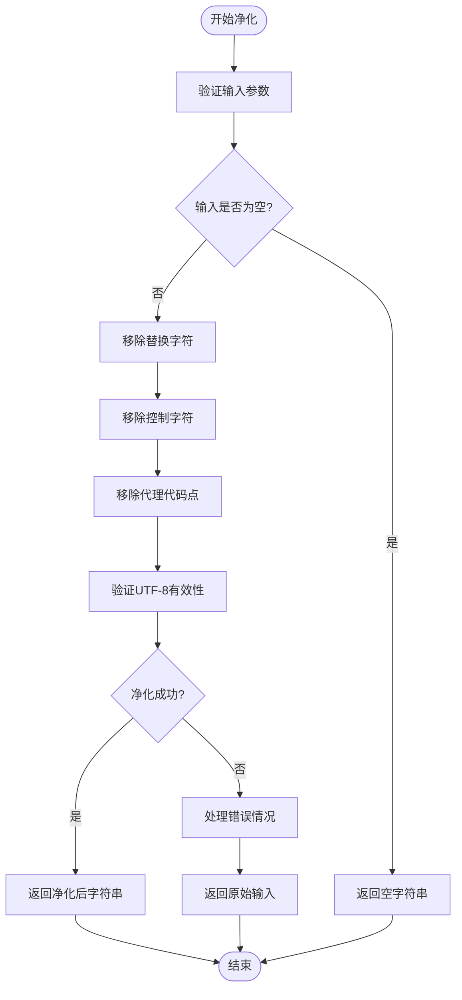
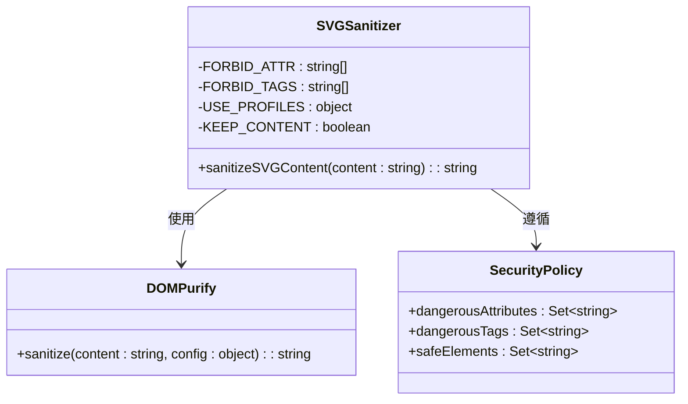
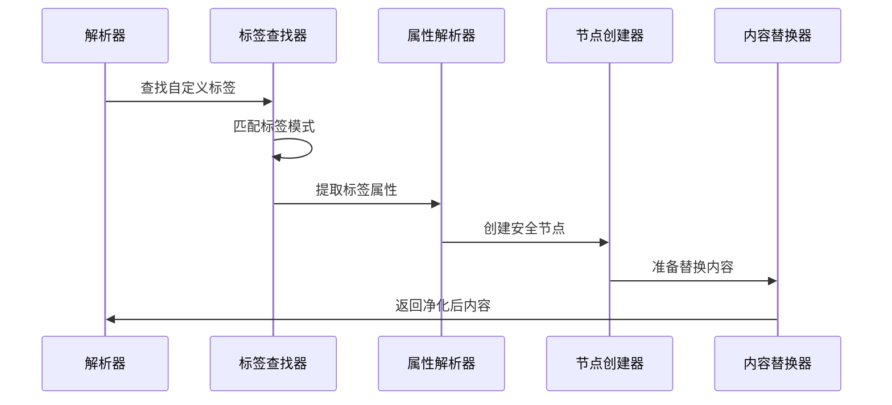
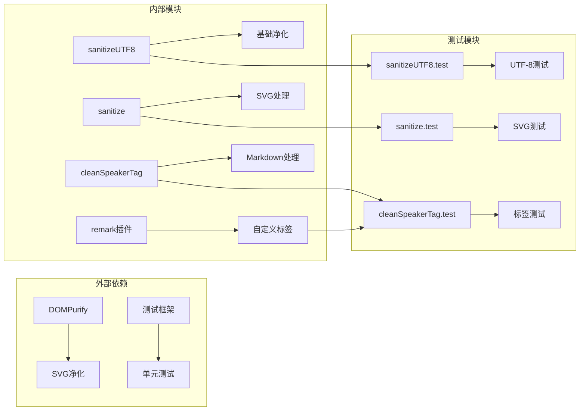

# 标题消毒系统

<cite>
**本文档引用的文件**
- [sanitizeUTF8.ts](file://packages/utils/src/sanitizeUTF8.ts)
- [sanitizeUTF8.test.ts](file://packages/utils/src/sanitizeUTF8.test.ts)
- [sanitize.ts](file://packages/utils/src/client/sanitize.ts)
- [sanitize.test.ts](file://packages/utils/src/client/sanitize.test.ts)
- [cleanSpeakerTag.test.ts](file://src/store/chat/utils/cleanSpeakerTag.test.ts)
- [createRemarkCustomTagWithAttributesPlugin.ts](file://src/features/Conversation/Markdown/plugins/remarkPlugins/createRemarkCustomTagWithAttributesPlugin.ts)
- [createRemarkSelfClosingTagPlugin.ts](file://src/features/Conversation/Markdown/plugins/remarkPlugins/createRemarkSelfClosingTagPlugin.ts)
</cite>

## 目录
1. [简介](#简介)
2. [项目结构](#项目结构)
3. [核心组件](#核心组件)
4. [架构概览](#架构概览)
5. [详细组件分析](#详细组件分析)
6. [依赖关系分析](#依赖关系分析)
7. [性能考虑](#性能考虑)
8. [故障排除指南](#故障排除指南)
9. [结论](#结论)

## 简介

标题消毒系统是一个综合性的内容安全处理框架，专门设计用于清理和净化各种格式的内容，防止跨站脚本攻击（XSS）和其他安全威胁。该系统通过多层防护机制，确保用户生成的内容在显示前经过严格的安全检查和净化处理。

系统主要包含三个核心功能模块：
- **UTF-8字符净化**：移除非法控制字符和无效编码点
- **SVG内容安全过滤**：使用DOMPurify进行SVG内容净化
- **Markdown标签处理**：自定义Markdown解析器和标签净化

## 项目结构

**图表来源**
- [sanitizeUTF8.ts:1-14](file://packages/utils/src/sanitizeUTF8.ts#L1-L14)
- [sanitize.ts:1-33](file://packages/utils/src/client/sanitize.ts#L1-L33)
- [cleanSpeakerTag.test.ts:1-104](file://src/store/chat/utils/cleanSpeakerTag.test.ts#L1-L104)

**章节来源**
- [sanitizeUTF8.ts:1-14](file://packages/utils/src/sanitizeUTF8.ts#L1-L14)
- [sanitize.ts:1-33](file://packages/utils/src/client/sanitize.ts#L1-L33)
- [cleanSpeakerTag.test.ts:1-104](file://src/store/chat/utils/cleanSpeakerTag.test.ts#L1-L104)

## 核心组件

### UTF-8字符净化器

UTF-8字符净化器是系统的基础安全组件，负责处理所有输入文本中的非法字符和控制字符。

**主要功能**：
- 移除Unicode替换字符（）
- 过滤控制字符范围（0x00-0x1F, 0x7F-0x9F）
- 处理未配对的代理代码点（0xD800-0xDFFF）

**算法复杂度**：
- 时间复杂度：O(n)，其中n为字符串长度
- 空间复杂度：O(n)，用于存储净化后的字符串

### SVG内容安全过滤器

基于DOMPurify的SVG专用净化器，提供全面的SVG内容安全保护。

**安全策略**：
- 禁用危险事件处理器属性
- 移除恶意标签（script, embed, object, style）
- 保留安全的SVG元素和属性
- 使用SVG配置文件进行精确控制

**净化流程**：
1. 预处理输入内容
2. 应用DOMPurify净化规则
3. 后处理输出结果
4. 返回安全的SVG内容

### Markdown标签处理引擎

专为聊天应用设计的Markdown解析器，支持自定义标签和属性处理。

**核心特性**：
- 自定义标签解析（如`<speaker>`标签）
- 属性提取和验证
- 内容节点转换
- 错误处理和边界情况

**处理流程**：
1. 遍历Markdown树节点
2. 识别自定义标签模式
3. 解析标签属性
4. 创建安全的HTML节点
5. 替换原始内容

**章节来源**
- [sanitizeUTF8.ts:5-14](file://packages/utils/src/sanitizeUTF8.ts#L5-L14)
- [sanitize.ts:8-33](file://packages/utils/src/client/sanitize.ts#L8-L33)
- [createRemarkCustomTagWithAttributesPlugin.ts:34-80](file://src/features/Conversation/Markdown/plugins/remarkPlugins/createRemarkCustomTagWithAttributesPlugin.ts#L34-L80)

## 架构概览

**图表来源**
- [sanitizeUTF8.ts:5-14](file://packages/utils/src/sanitizeUTF8.ts#L5-L14)
- [sanitize.ts:8-33](file://packages/utils/src/client/sanitize.ts#L8-L33)
- [createRemarkCustomTagWithAttributesPlugin.ts:34-80](file://src/features/Conversation/Markdown/plugins/remarkPlugins/createRemarkCustomTagWithAttributesPlugin.ts#L34-L80)

系统采用分层安全架构，每个组件都有明确的职责分工：

1. **输入层**：接收原始用户输入
2. **净化层**：执行具体的安全净化操作
3. **验证层**：确保输出内容的安全性
4. **输出层**：提供最终的安全内容

## 详细组件分析

### UTF-8字符净化器实现

**图表来源**
- [sanitizeUTF8.ts:5-14](file://packages/utils/src/sanitizeUTF8.ts#L5-L14)

**净化规则详解**：
- **替换字符处理**：移除Unicode替换字符（），这是数据库或网络传输中常见的占位符
- **控制字符过滤**：移除ASCII控制字符（0x00-0x1F, 0x7F-0x9F），防止命令注入
- **代理代码点处理**：移除未配对的代理代码点，防止UTF-8解码错误

**测试覆盖**：
- 空字节处理
- 无效UTF-8序列
- 特殊字符保留
- 边界情况测试

### SVG内容安全过滤器

**图表来源**
- [sanitize.ts:8-33](file://packages/utils/src/client/sanitize.ts#L8-L33)

**安全策略配置**：
- **禁用属性列表**：包含所有可能的事件处理器属性
- **禁用标签列表**：移除所有可能的恶意标签
- **SVG配置文件**：使用DOMPurify的SVG专用配置

**净化效果**：
- 移除所有JavaScript代码
- 清理恶意属性
- 保留安全的SVG元素
- 维持SVG结构完整性

### Markdown标签处理系统

**图表来源**
- [createRemarkCustomTagWithAttributesPlugin.ts:34-80](file://src/features/Conversation/Markdown/plugins/remarkPlugins/createRemarkCustomTagWithAttributesPlugin.ts#L34-L80)
- [createRemarkSelfClosingTagPlugin.ts:131-172](file://src/features/Conversation/Markdown/plugins/remarkPlugins/createRemarkSelfClosingTagPlugin.ts#L131-L172)

**处理流程**：
1. **标签识别**：扫描Markdown树节点识别自定义标签
2. **属性解析**：提取并验证标签属性
3. **节点创建**：构建安全的HTML节点对象
4. **内容替换**：用净化后的内容替换原始标记

**安全保证**：
- 防止XSS攻击
- 验证标签完整性
- 清理恶意属性
- 维持内容结构

**章节来源**
- [sanitize.ts:8-33](file://packages/utils/src/client/sanitize.ts#L8-L33)
- [createRemarkCustomTagWithAttributesPlugin.ts:34-80](file://src/features/Conversation/Markdown/plugins/remarkPlugins/createRemarkCustomTagWithAttributesPlugin.ts#L34-L80)
- [createRemarkSelfClosingTagPlugin.ts:131-172](file://src/features/Conversation/Markdown/plugins/remarkPlugins/createRemarkSelfClosingTagPlugin.ts#L131-L172)

## 依赖关系分析

**图表来源**
- [sanitize.ts:1-1](file://packages/utils/src/client/sanitize.ts#L1-L1)
- [sanitizeUTF8.test.ts:1-25](file://packages/utils/src/sanitizeUTF8.test.ts#L1-L25)
- [sanitize.test.ts:1-108](file://packages/utils/src/client/sanitize.test.ts#L1-L108)

**依赖关系特点**：
- **单向依赖**：各模块之间保持清晰的依赖层次
- **最小化依赖**：只引入必要的外部库
- **测试隔离**：每个模块都有独立的测试套件
- **插件化设计**：Markdown处理采用插件架构

**潜在风险**：
- DOMPurify版本升级可能影响行为
- 测试覆盖率需要持续维护
- 插件兼容性问题

**章节来源**
- [sanitize.ts:1-1](file://packages/utils/src/client/sanitize.ts#L1-L1)
- [sanitizeUTF8.test.ts:1-25](file://packages/utils/src/sanitizeUTF8.test.ts#L1-L25)
- [sanitize.test.ts:1-108](file://packages/utils/src/client/sanitize.test.ts#L1-L108)

## 性能考虑

### 时间复杂度分析

| 模块 | 操作类型 | 时间复杂度 | 空间复杂度 |
|------|----------|------------|------------|
| UTF-8净化器 | 字符串处理 | O(n) | O(n) |
| SVG净化器 | DOM操作 | O(n+m) | O(n+m) |
| Markdown处理器 | 树遍历 | O(n) | O(n) |
| 标签解析器 | 正则匹配 | O(n) | O(n) |

### 优化策略

1. **缓存机制**：对常用净化规则进行缓存
2. **流式处理**：对于大文件采用流式处理方式
3. **并行处理**：多线程处理多个独立内容
4. **内存管理**：及时释放中间结果占用的内存

### 性能监控

- **执行时间统计**：记录各模块处理耗时
- **内存使用监控**：跟踪内存分配和释放
- **错误率统计**：监控净化失败率
- **吞吐量测量**：评估系统处理能力

## 故障排除指南

### 常见问题及解决方案

**问题1：SVG内容被过度净化**
- **症状**：SVG元素被移除或属性丢失
- **原因**：DOMPurify配置过于严格
- **解决方案**：调整白名单配置，添加必要的SVG属性

**问题2：UTF-8字符显示异常**
- **症状**：中文等字符显示为问号
- **原因**：净化过程中字符编码错误
- **解决方案**：检查字符编码设置，确保UTF-8支持

**问题3：Markdown标签解析失败**
- **症状**：自定义标签无法正确识别
- **原因**：正则表达式匹配不准确
- **解决方案**：更新标签匹配规则，增加边界检查

**问题4：性能问题**
- **症状**：大量内容处理缓慢
- **原因**：算法效率低下
- **解决方案**：优化算法，考虑并行处理

### 调试工具

1. **日志记录**：详细记录处理过程和结果
2. **断点调试**：在关键节点设置断点
3. **性能分析**：使用性能分析工具定位瓶颈
4. **单元测试**：编写针对性的测试用例

**章节来源**
- [sanitize.test.ts:35-108](file://packages/utils/src/client/sanitize.test.ts#L35-L108)
- [sanitizeUTF8.test.ts:1-25](file://packages/utils/src/sanitizeUTF8.test.ts#L1-L25)
- [cleanSpeakerTag.test.ts:1-104](file://src/store/chat/utils/cleanSpeakerTag.test.ts#L1-L104)

## 结论

标题消毒系统通过多层次的安全防护机制，为用户提供了一个全面的内容安全解决方案。系统的设计充分考虑了安全性、性能和可维护性，在保证内容安全的同时，尽量减少对用户体验的影响。

**主要优势**：
- **全面防护**：涵盖多种内容格式的安全威胁
- **灵活配置**：支持自定义安全策略
- **高性能**：优化的算法和数据结构
- **易于维护**：清晰的代码结构和完善的测试

**未来改进方向**：
- 增强机器学习检测能力
- 支持更多内容格式
- 优化移动端性能
- 提供更细粒度的权限控制

该系统为现代Web应用提供了坚实的安全基础，能够有效防范各种类型的攻击，保护用户数据和隐私安全。