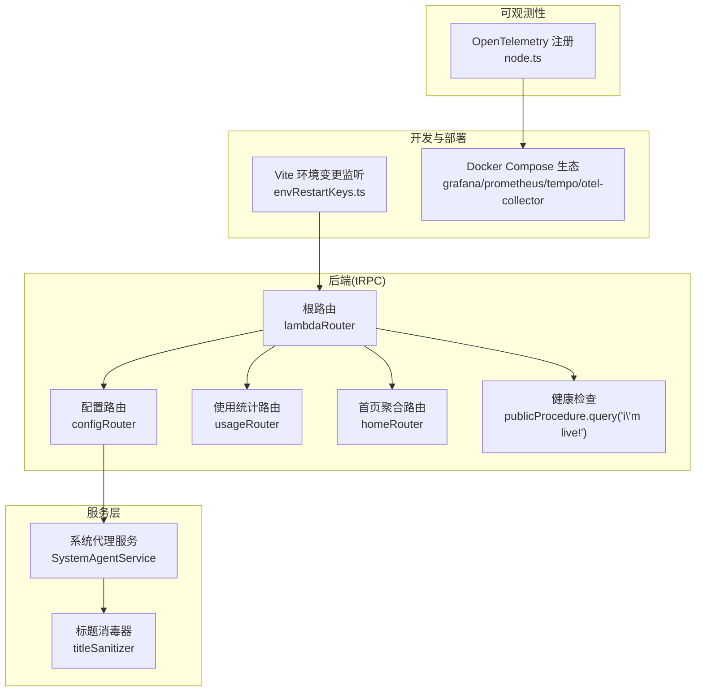
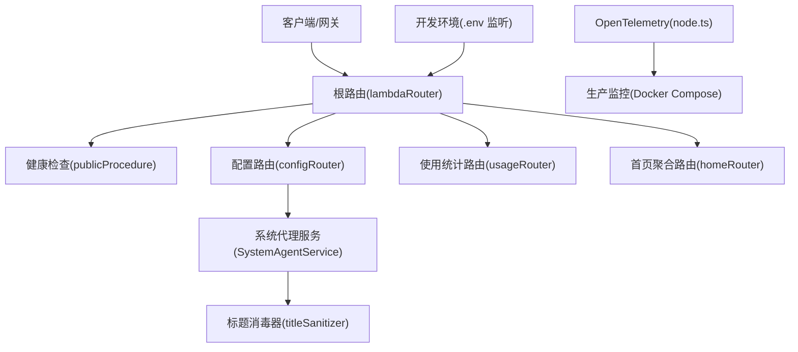
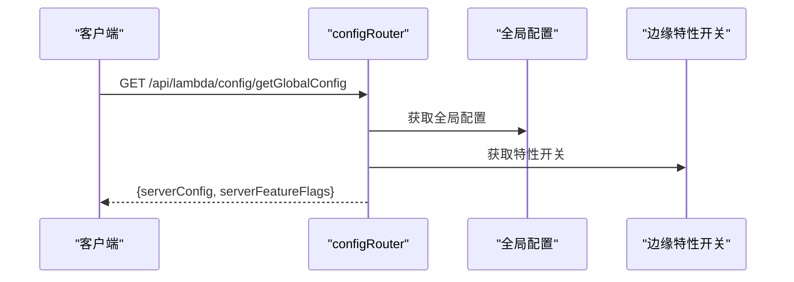
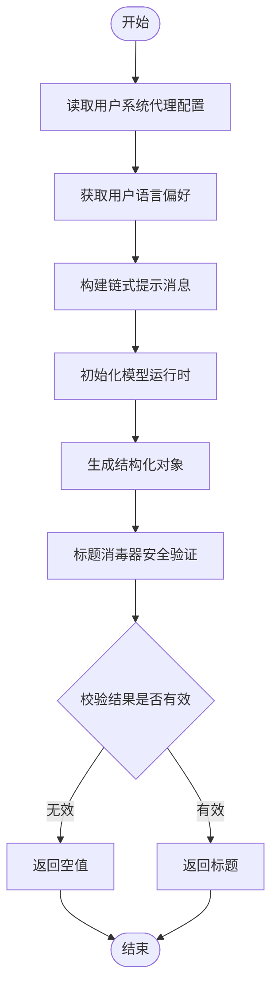
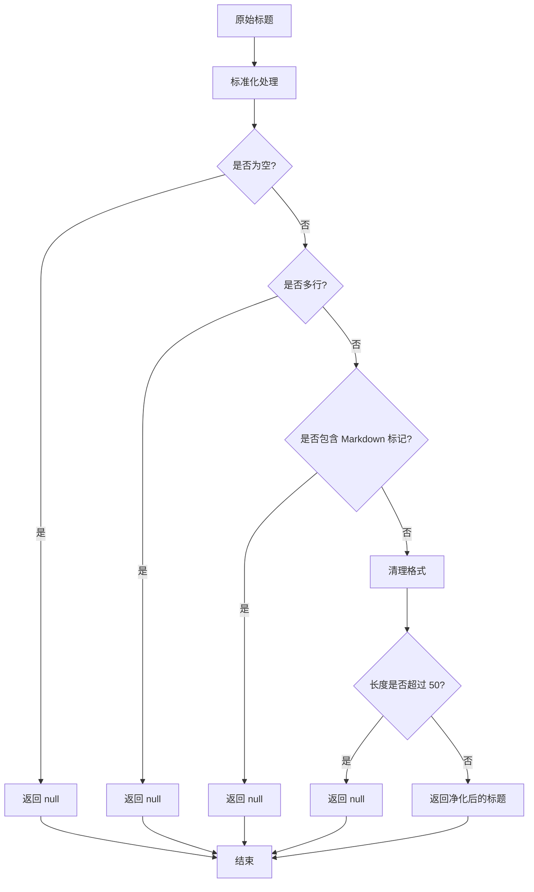
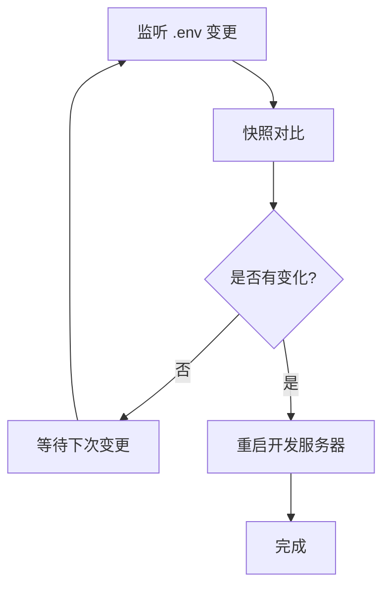
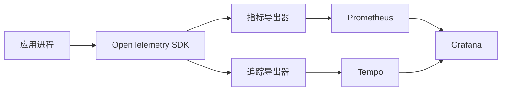
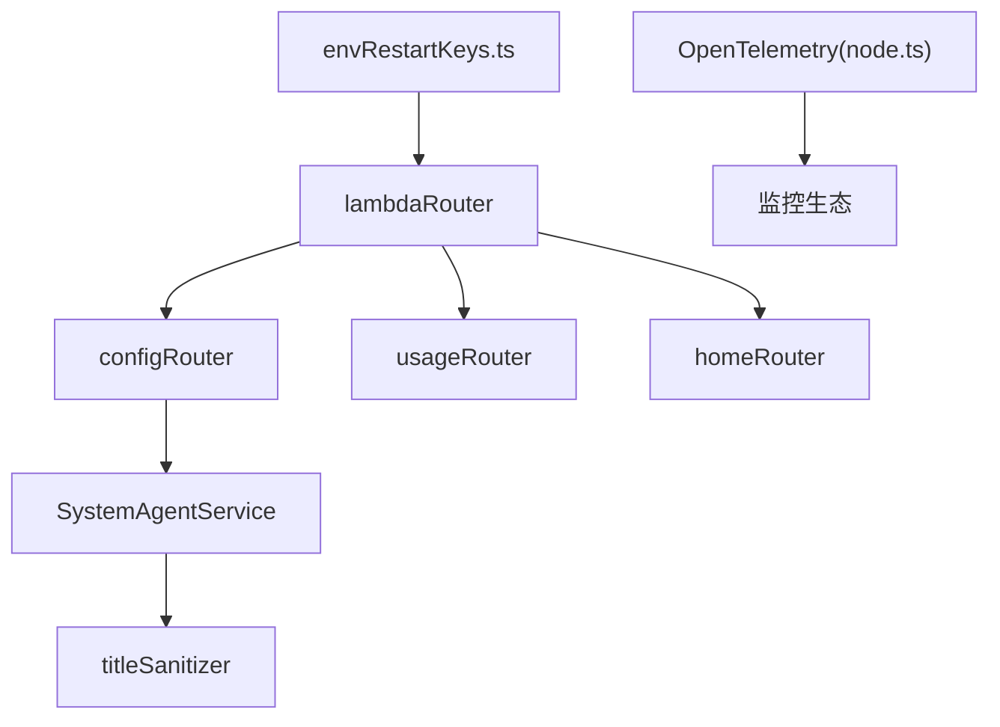

# 系统 API

<cite>
**本文引用的文件**
- [src/server/routers/lambda/index.ts](file://src/server/routers/lambda/index.ts)
- [src/server/routers/lambda/config/index.ts](file://src/server/routers/lambda/config/index.ts)
- [src/server/routers/lambda/usage/index.ts](file://src/server/routers/lambda/usage/index.ts)
- [src/server/routers/lambda/home/index.ts](file://src/server/routers/lambda/home/index.ts)
- [src/server/routers/lambda/_template.ts](file://src/server/routers/lambda/_template.ts)
- [src/server/services/systemAgent/index.ts](file://src/server/services/systemAgent/index.ts)
- [src/server/services/systemAgent/titleSanitizer.ts](file://src/server/services/systemAgent/titleSanitizer.ts)
- [src/server/services/systemAgent/titleSanitizer.test.ts](file://src/server/services/systemAgent/titleSanitizer.test.ts)
- [packages/observability-otel/src/node.ts](file://packages/observability-otel/src/node.ts)
- [plugins/vite/envRestartKeys.ts](file://plugins/vite/envRestartKeys.ts)
- [docker-compose/production/grafana/docker-compose.yml](file://docker-compose/production/grafana/docker-compose.yml)
- [docker-compose/production/prometheus/docker-compose.yml](file://docker-compose/production/prometheus/docker-compose.yml)
- [docker-compose/production/tempo/docker-compose.yml](file://docker-compose/production/tempo/docker-compose.yml)
- [docker-compose/production/otel-collector/docker-compose.yml](file://docker-compose/production/otel-collector/docker-compose.yml)
</cite>

## 目录

1. [简介](#简介)
2. [项目结构](#项目结构)
3. [核心组件](#核心组件)
4. [架构总览](#架构总览)
5. [详细组件分析](#详细组件分析)
6. [依赖关系分析](#依赖关系分析)
7. [性能考量](#性能考量)
8. [故障排查指南](#故障排查指南)
9. [结论](#结论)
10. [附录](#附录)

## 简介

本文件面向 LobeHub 系统的运维与平台工程团队，提供系统管理端点的权威 API 规范与最佳实践。内容覆盖系统配置、健康检查、性能监控、日志管理、环境变量与配置热更新、服务发现与负载均衡、系统指标采集、告警通知、故障转移与灾难恢复，以及运维监控、性能调优、容量规划与安全审计的设计建议。

## 项目结构

后端采用 tRPC 路由聚合模式，根路由统一挂载各业务模块路由，并在根层暴露公共端点（如健康检查）。系统配置、使用统计、首页聚合等管理类接口位于 lambda 路由层；可观测性通过 OpenTelemetry SDK 注册与导出器配置实现；开发期支持 .env 变更自动重启以实现配置热更新；生产侧通过 Docker Compose 集成 Grafana/Prometheus/Tempo/OpenTelemetry Collector 实现监控与追踪。

**图表来源**

- [src/server/routers/lambda/index.ts:56-107](file://src/server/routers/lambda/index.ts#L56-L107)
- [src/server/routers/lambda/config/index.ts:11-40](file://src/server/routers/lambda/config/index.ts#L11-L40)
- [src/server/services/systemAgent/index.ts:34-117](file://src/server/services/systemAgent/index.ts#L34-L117)
- [src/server/services/systemAgent/titleSanitizer.ts:1-25](file://src/server/services/systemAgent/titleSanitizer.ts#L1-L25)
- [packages/observability-otel/src/node.ts:94-141](file://packages/observability-otel/src/node.ts#L94-L141)
- [plugins/vite/envRestartKeys.ts:93-121](file://plugins/vite/envRestartKeys.ts#L93-L121)
- [docker-compose/production/grafana/docker-compose.yml](file://docker-compose/production/grafana/docker-compose.yml)
- [docker-compose/production/prometheus/docker-compose.yml](file://docker-compose/production/prometheus/docker-compose.yml)
- [docker-compose/production/tempo/docker-compose.yml](file://docker-compose/production/tempo/docker-compose.yml)
- [docker-compose/production/otel-collector/docker-compose.yml](file://docker-compose/production/otel-collector/docker-compose.yml)

**章节来源**

- [src/server/routers/lambda/index.ts:1-110](file://src/server/routers/lambda/index.ts#L1-L110)
- [src/server/routers/lambda/config/index.ts:1-41](file://src/server/routers/lambda/config/index.ts#L1-L41)
- [src/server/routers/lambda/usage/index.ts](file://src/server/routers/lambda/usage/index.ts)
- [src/server/routers/lambda/home/index.ts](file://src/server/routers/lambda/home/index.ts)
- [src/server/services/systemAgent/index.ts:1-126](file://src/server/services/systemAgent/index.ts#L1-L126)
- [src/server/services/systemAgent/titleSanitizer.ts:1-25](file://src/server/services/systemAgent/titleSanitizer.ts#L1-L25)
- [packages/observability-otel/src/node.ts:94-141](file://packages/observability-otel/src/node.ts#L94-L141)
- [plugins/vite/envRestartKeys.ts:93-121](file://plugins/vite/envRestartKeys.ts#L93-L121)

## 核心组件

- 根路由与公共端点
  - 根路由统一挂载各业务子路由，并在顶层暴露健康检查端点，便于探活与负载均衡健康检查。
- 配置路由
  - 提供全局运行时配置与特性开关查询，支持从边缘配置读取特性状态并合并返回。
- 使用统计路由
  - 提供用量趋势、卡片与表格数据，支撑运营与容量规划。
- 首页聚合路由
  - 聚合首页所需的数据源，减少前端多次请求。
- 系统代理服务
  - 封装系统自动化任务（如话题标题生成）的通用流程：读取用户配置 → 构建链式提示 → 调用模型运行时 → 标题消毒器安全验证 → 返回结构化结果。
- 标题消毒器
  - 新增专门的标题消毒器，负责清理和验证生成的标题，防止恶意输出和格式污染。
- 可观测性注册
  - 基于 OpenTelemetry SDK 注册指标、追踪与日志导出器，支持通过环境变量调整导出间隔与调试级别。
- 开发期配置热更新
  - Vite 插件监听 .env 文件变更，检测到关键键值变化后自动重启开发服务器，实现配置热更新体验。
- 生产监控生态
  - 通过 Docker Compose 启动 Grafana/Prometheus/Tempo/Collector，形成端到端的指标与追踪采集链路。

**章节来源**

- [src/server/routers/lambda/index.ts:56-107](file://src/server/routers/lambda/index.ts#L56-L107)
- [src/server/routers/lambda/config/index.ts:11-40](file://src/server/routers/lambda/config/index.ts#L11-L40)
- [src/server/routers/lambda/usage/index.ts](file://src/server/routers/lambda/usage/index.ts)
- [src/server/routers/lambda/home/index.ts](file://src/server/routers/lambda/home/index.ts)
- [src/server/services/systemAgent/index.ts:34-117](file://src/server/services/systemAgent/index.ts#L34-L117)
- [src/server/services/systemAgent/titleSanitizer.ts:1-25](file://src/server/services/systemAgent/titleSanitizer.ts#L1-L25)
- [packages/observability-otel/src/node.ts:94-141](file://packages/observability-otel/src/node.ts#L94-L141)
- [plugins/vite/envRestartKeys.ts:93-121](file://plugins/vite/envRestartKeys.ts#L93-L121)

## 架构总览

下图展示系统管理端点在整体架构中的位置与交互关系：根路由作为入口，配置与统计路由提供系统级能力，系统代理服务封装自动化任务，标题消毒器提供安全验证，可观测性贯穿请求生命周期，开发与生产分别通过插件与容器编排实现配置热更新与监控。

**图表来源**

- [src/server/routers/lambda/index.ts:56-107](file://src/server/routers/lambda/index.ts#L56-L107)
- [src/server/routers/lambda/config/index.ts:11-40](file://src/server/routers/lambda/config/index.ts#L11-L40)
- [src/server/services/systemAgent/index.ts:34-117](file://src/server/services/systemAgent/index.ts#L34-L117)
- [src/server/services/systemAgent/titleSanitizer.ts:1-25](file://src/server/services/systemAgent/titleSanitizer.ts#L1-L25)
- [packages/observability-otel/src/node.ts:94-141](file://packages/observability-otel/src/node.ts#L94-L141)
- [plugins/vite/envRestartKeys.ts:93-121](file://plugins/vite/envRestartKeys.ts#L93-L121)
- [docker-compose/production/grafana/docker-compose.yml](file://docker-compose/production/grafana/docker-compose.yml)

## 详细组件分析

### 健康检查端点

- 路径与方法
  - GET /healthcheck 或 /api/lambda/healthcheck（取决于网关映射）
- 请求参数
  - 无
- 成功响应
  - 文本字符串："i'm live!"
- 错误响应
  - 无错误分支，始终成功
- 使用场景
  - 负载均衡探活、容器编排健康检查、CDN 边缘健康探测
- 最佳实践
  - 结合反向代理或网关设置探针路径与超时阈值
  - 仅用于存活探测，不承载业务逻辑

**章节来源**

- [src/server/routers/lambda/index.ts:78-78](file://src/server/routers/lambda/index.ts#L78-L78)

### 配置查询端点

- 路径与方法
  - GET /api/lambda/config/getGlobalConfig
  - GET /api/lambda/config/getDefaultAgentConfig
- 请求参数
  - getGlobalConfig：可选上下文参数（如用户标识），用于特性开关评估
  - getDefaultAgentConfig：无
- 成功响应
  - getGlobalConfig：返回全局运行时配置与特性开关集合
  - getDefaultAgentConfig：返回默认智能体配置对象
- 错误响应
  - 服务异常时返回统一错误码
- 处理流程
  - 并行获取全局配置与特性开关，合并后返回
- 最佳实践
  - 客户端缓存全局配置，按需刷新
  - 特性开关应支持灰度与回滚策略

**图表来源**

- [src/server/routers/lambda/config/index.ts:16-37](file://src/server/routers/lambda/config/index.ts#L16-L37)

**章节来源**

- [src/server/routers/lambda/config/index.ts:11-40](file://src/server/routers/lambda/config/index.ts#L11-L40)

### 使用统计端点

- 路径与方法
  - GET /api/lambda/usage/\*（具体子路径依据 usageRouter 定义）
- 请求参数
  - 时间范围、分组维度、排序与分页参数（视具体接口而定）
- 成功响应
  - 卡片数据、趋势数据、表格数据三类结构化数据
- 错误响应
  - 数据库或计算异常时返回统一错误码
- 最佳实践
  - 前端按需加载与懒加载，避免一次性拉取大量历史数据
  - 对高频查询增加缓存与预聚合

**章节来源**

- [src/server/routers/lambda/usage/index.ts](file://src/server/routers/lambda/usage/index.ts)

### 首页聚合端点

- 路径与方法
  - GET /api/lambda/home/\*（具体子路径依据 homeRouter 定义）
- 请求参数
  - 无或少量筛选参数
- 成功响应
  - 首页所需聚合数据结构
- 最佳实践
  - 合理拆分数据源，避免单接口过重
  - 支持多语言与多区域数据聚合

**章节来源**

- [src/server/routers/lambda/home/index.ts](file://src/server/routers/lambda/home/index.ts)

### 系统代理服务（自动化任务）

- 功能概述
  - 封装系统自动化任务的通用流程：读取用户系统代理配置 → 构建链式提示 → 调用模型运行时 → 标题消毒器安全验证 → 返回结构化结果
- 典型任务
  - 话题标题生成：基于用户输入与助手回复生成简洁标题
- 关键流程
  - 获取任务模型配置（优先用户自定义，否则回退默认）
  - 获取用户语言偏好
  - 初始化模型运行时并生成对象
  - 标题消毒器安全验证
  - 校验并返回标题

**图表来源**

- [src/server/services/systemAgent/index.ts:48-86](file://src/server/services/systemAgent/index.ts#L48-L86)
- [src/server/services/systemAgent/titleSanitizer.ts:4-24](file://src/server/services/systemAgent/titleSanitizer.ts#L4-L24)

**章节来源**

- [src/server/services/systemAgent/index.ts:34-117](file://src/server/services/systemAgent/index.ts#L34-L117)

### 标题消毒器（新增功能）

- 功能概述
  - 专门负责清理和验证生成的标题，防止恶意输出和格式污染
- 核心验证规则
  - 长度限制：最大 50 个字符
  - 格式验证：必须为单行文本，不能包含 Markdown 标记
  - 内容净化：移除换行符、多余的空白字符和特殊标记
- 安全防护
  - 防止多行输出和恶意 Markdown 格式
  - 防止过长标题导致界面溢出
  - 防止特殊字符污染标题显示

**图表来源**

- [src/server/services/systemAgent/titleSanitizer.ts:4-24](file://src/server/services/systemAgent/titleSanitizer.ts#L4-L24)

**章节来源**

- [src/server/services/systemAgent/titleSanitizer.ts:1-25](file://src/server/services/systemAgent/titleSanitizer.ts#L1-L25)
- [src/server/services/systemAgent/titleSanitizer.test.ts:1-27](file://src/server/services/systemAgent/titleSanitizer.test.ts#L1-L27)

### 环境变量与配置热更新

- 开发期
  - Vite 插件监听 .env 与 .env.\* 文件变更，检测到关键键值变化后自动重启开发服务器，实现配置热更新体验
- 生产期
  - 通过容器编排与配置中心（如边缘配置）下发配置，结合滚动更新与蓝绿发布降低变更风险

**图表来源**

- [plugins/vite/envRestartKeys.ts:93-121](file://plugins/vite/envRestartKeys.ts#L93-L121)

**章节来源**

- [plugins/vite/envRestartKeys.ts:93-121](file://plugins/vite/envRestartKeys.ts#L93-L121)

### 性能监控与可观测性

- 指标与追踪
  - 通过 OpenTelemetry SDK 注册指标读取器与追踪导出器，支持周期性导出与调试日志级别控制
- 导出配置
  - 指标导出间隔可通过环境变量配置
  - 调试级别可通过环境变量或布尔开关控制
- 生产监控生态
  - Grafana/Prometheus/Tempo/Collector 组合提供可视化、告警与分布式追踪能力

**图表来源**

- [packages/observability-otel/src/node.ts:116-141](file://packages/observability-otel/src/node.ts#L116-L141)
- [docker-compose/production/grafana/docker-compose.yml](file://docker-compose/production/grafana/docker-compose.yml)
- [docker-compose/production/prometheus/docker-compose.yml](file://docker-compose/production/prometheus/docker-compose.yml)
- [docker-compose/production/tempo/docker-compose.yml](file://docker-compose/production/tempo/docker-compose.yml)
- [docker-compose/production/otel-collector/docker-compose.yml](file://docker-compose/production/otel-collector/docker-compose.yml)

**章节来源**

- [packages/observability-otel/src/node.ts:94-141](file://packages/observability-otel/src/node.ts#L94-L141)
- [docker-compose/production/grafana/docker-compose.yml](file://docker-compose/production/grafana/docker-compose.yml)
- [docker-compose/production/prometheus/docker-compose.yml](file://docker-compose/production/prometheus/docker-compose.yml)
- [docker-compose/production/tempo/docker-compose.yml](file://docker-compose/production/tempo/docker-compose.yml)
- [docker-compose/production/otel-collector/docker-compose.yml](file://docker-compose/production/otel-collector/docker-compose.yml)

### 日志管理

- 调试日志
  - 通过环境变量控制 OpenTelemetry 调试级别，便于开发与问题定位
- 运维日志
  - 建议将应用日志输出到标准输出，由容器编排统一收集与归档
- 安全审计
  - 关键操作（如配置变更、权限变更）应记录审计日志并保留至少 90 天

**章节来源**

- [packages/observability-otel/src/node.ts:107-114](file://packages/observability-otel/src/node.ts#L107-L114)

### 服务发现与负载均衡

- 服务发现
  - 在容器编排中通过服务名进行内部通信；对外暴露统一网关或反向代理
- 负载均衡
  - 健康检查端点用于探活；结合限流与熔断策略提升稳定性
- 故障转移
  - 多副本部署，结合滚动更新与探活失败自动摘除

**章节来源**

- [src/server/routers/lambda/index.ts:78-78](file://src/server/routers/lambda/index.ts#L78-L78)

### 告警通知与灾难恢复

- 告警
  - Prometheus 报警规则 + Grafana 告警通道；对关键指标（CPU、内存、QPS、错误率、P95 延迟）设置阈值
- 灾难恢复
  - 多可用区部署；定期备份数据库与配置；演练恢复流程并记录复盘

**章节来源**

- [docker-compose/production/prometheus/docker-compose.yml](file://docker-compose/production/prometheus/docker-compose.yml)
- [docker-compose/production/grafana/docker-compose.yml](file://docker-compose/production/grafana/docker-compose.yml)

## 依赖关系分析

- 路由层依赖
  - 根路由聚合各子路由，子路由再依赖各自的服务层与数据层
- 服务层依赖
  - 系统代理服务依赖模型运行时与用户模型，用于读取配置与生成结果
  - 标题消毒器作为独立模块被系统代理服务调用
- 可观测性依赖
  - OpenTelemetry SDK 依赖环境变量与导出器配置
- 开发与生产依赖
  - 开发期依赖 Vite 插件；生产期依赖 Docker Compose 与外部监控系统

**图表来源**

- [src/server/routers/lambda/index.ts:56-107](file://src/server/routers/lambda/index.ts#L56-L107)
- [src/server/routers/lambda/config/index.ts:11-40](file://src/server/routers/lambda/config/index.ts#L11-L40)
- [src/server/services/systemAgent/index.ts:34-117](file://src/server/services/systemAgent/index.ts#L34-L117)
- [src/server/services/systemAgent/titleSanitizer.ts:1-25](file://src/server/services/systemAgent/titleSanitizer.ts#L1-L25)
- [packages/observability-otel/src/node.ts:94-141](file://packages/observability-otel/src/node.ts#L94-L141)
- [plugins/vite/envRestartKeys.ts:93-121](file://plugins/vite/envRestartKeys.ts#L93-L121)

**章节来源**

- [src/server/routers/lambda/index.ts:56-107](file://src/server/routers/lambda/index.ts#L56-L107)
- [src/server/routers/lambda/config/index.ts:11-40](file://src/server/routers/lambda/config/index.ts#L11-L40)
- [src/server/services/systemAgent/index.ts:34-117](file://src/server/services/systemAgent/index.ts#L34-L117)
- [src/server/services/systemAgent/titleSanitizer.ts:1-25](file://src/server/services/systemAgent/titleSanitizer.ts#L1-L25)
- [packages/observability-otel/src/node.ts:94-141](file://packages/observability-otel/src/node.ts#L94-L141)
- [plugins/vite/envRestartKeys.ts:93-121](file://plugins/vite/envRestartKeys.ts#L93-L121)

## 性能考量

- 指标导出间隔
  - 通过环境变量调整指标导出间隔，平衡数据实时性与资源消耗
- 查询优化
  - 使用统计接口支持分页与时间范围过滤，避免全量扫描
- 缓存策略
  - 全局配置与特性开关建议在客户端与网关层缓存，减少重复拉取
- 并发与限流
  - 对高并发接口实施限流与熔断，保护下游依赖
- 标题生成性能
  - 标题消毒器采用轻量级验证，对性能影响极小
  - 模型调用成本为主要性能瓶颈，建议合理配置模型参数

**章节来源**

- [packages/observability-otel/src/node.ts:116-122](file://packages/observability-otel/src/node.ts#L116-L122)
- [src/server/routers/lambda/usage/index.ts](file://src/server/routers/lambda/usage/index.ts)
- [src/server/services/systemAgent/titleSanitizer.ts:1-25](file://src/server/services/systemAgent/titleSanitizer.ts#L1-L25)

## 故障排查指南

- 健康检查失败
  - 检查探针路径与超时设置；确认反向代理与网关映射正确
- 配置未生效
  - 开发期确认 .env 变更被监听并触发重启；生产期确认配置中心推送成功
- 指标缺失
  - 检查 OpenTelemetry 导出器配置与网络连通性；验证环境变量设置
- 日志异常
  - 检查调试级别与日志输出目标；确保容器编排正确收集日志
- 标题生成失败
  - 检查模型运行时配置与 API 密钥有效性
  - 验证标题消毒器是否正确拦截了无效输出
  - 查看系统代理服务的错误日志

**章节来源**

- [src/server/routers/lambda/index.ts:78-78](file://src/server/routers/lambda/index.ts#L78-L78)
- [plugins/vite/envRestartKeys.ts:93-121](file://plugins/vite/envRestartKeys.ts#L93-L121)
- [packages/observability-otel/src/node.ts:116-141](file://packages/observability-otel/src/node.ts#L116-L141)
- [src/server/services/systemAgent/index.ts:86-89](file://src/server/services/systemAgent/index.ts#L86-L89)

## 结论

本文梳理了 LobeHub 系统的系统管理端点与可观测性基础设施，明确了健康检查、配置查询、使用统计、系统代理服务与监控生态的职责边界与协作关系。最新的标题生成功能增强了系统的安全性，通过新增的标题消毒器提供了多层安全验证，有效防止了恶意输出和格式污染。建议在生产环境中结合容器编排与配置中心实现配置热更新与弹性伸缩，在监控层面完善告警与演练，持续优化查询与缓存策略，保障系统稳定与可运维性。

## 附录

- API 端点清单（示例）
  - GET /api/lambda/healthcheck
  - GET /api/lambda/config/getGlobalConfig
  - GET /api/lambda/config/getDefaultAgentConfig
  - GET /api/lambda/usage/\*
  - GET /api/lambda/home/\*
- 环境变量参考
  - 指标导出间隔：OTEL_METRICS_EXPORTER_INTERVAL
  - 调试级别：OTEL_JS_LOBEHUB_DIAG
- 监控组件
  - Prometheus、Grafana、Tempo、OpenTelemetry Collector
- 标题消毒器配置
  - 最大标题长度：50 字符
  - 支持的 Markdown 标记：无（严格限制）
  - 清理规则：移除换行符、多余空白、特殊引号
