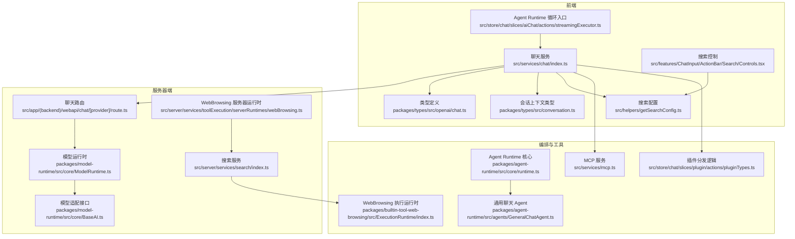
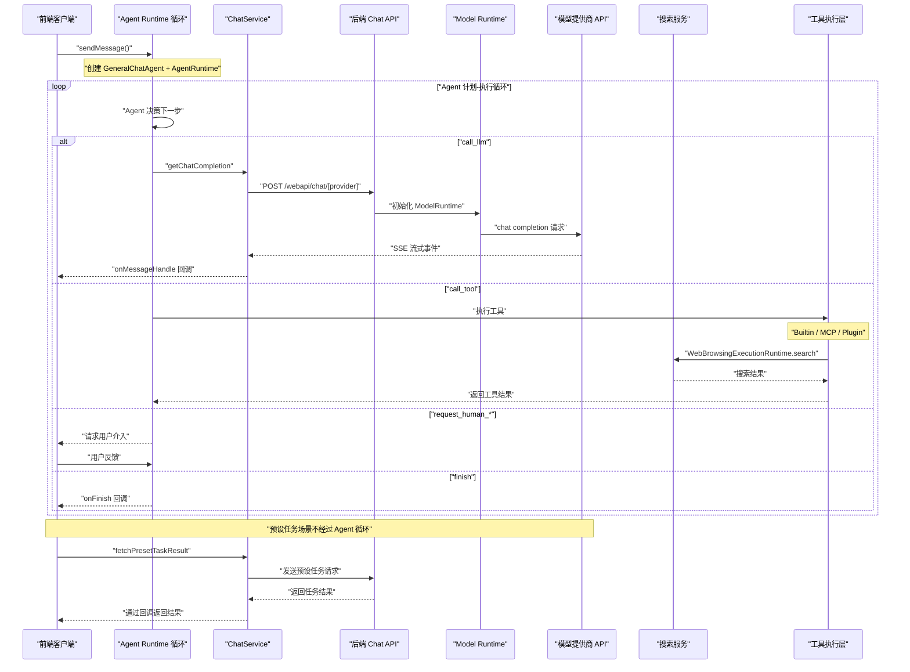
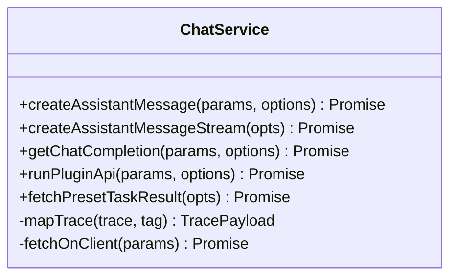
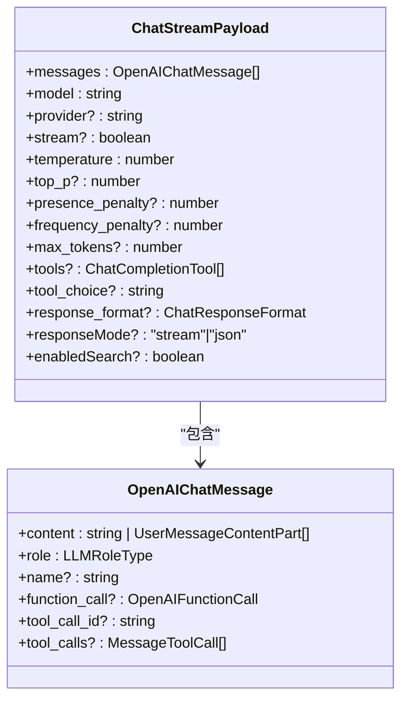
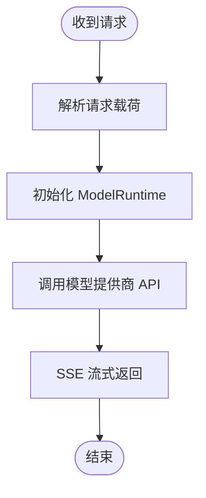
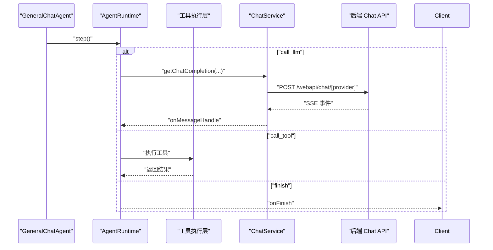
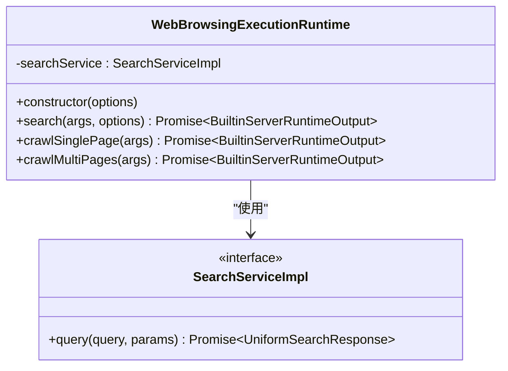
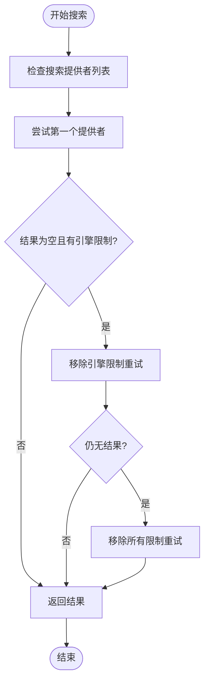
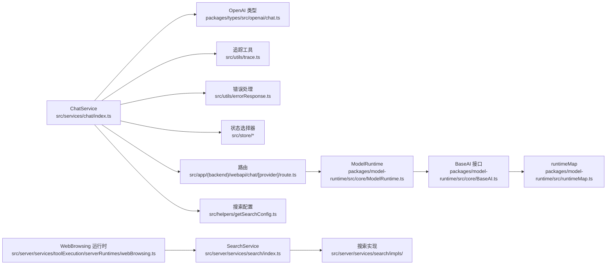

# 聊天 API

<cite>
**本文引用的文件**
- [src/services/chat/index.ts](file://src/services/chat/index.ts)
- [packages/types/src/conversation.ts](file://packages/types/src/conversation.ts)
- [packages/types/src/openai/chat.ts](file://packages/types/src/openai/chat.ts)
- [docs/development/basic/chat-api.zh-CN.mdx](file://docs/development/basic/chat-api.zh-CN.mdx)
- [src/store/chat/slices/aiChat/actions/conversationLifecycle.ts](file://src/store/chat/slices/aiChat/actions/conversationLifecycle.ts)
- [src/store/chat/slices/aiChat/actions/streamingExecutor.ts](file://src/store/chat/slices/aiChat/actions/streamingExecutor.ts)
- [src/server/services/agentRuntime/AgentRuntimeService.ts](file://src/server/services/agentRuntime/AgentRuntimeService.ts)
- [src/server/routers/lambda/aiChat.ts](file://src/server/routers/lambda/aiChat.ts)
- [packages/model-runtime/src/core/ModelRuntime.ts](file://packages/model-runtime/src/core/ModelRuntime.ts)
- [packages/model-runtime/src/core/BaseAI.ts](file://packages/model-runtime/src/core/BaseAI.ts)
- [packages/model-runtime/src/runtimeMap.ts](file://packages/model-runtime/src/runtimeMap.ts)
- [packages/agent-runtime/src/core/runtime.ts](file://packages/agent-runtime/src/core/runtime.ts)
- [packages/agent-runtime/src/agents/GeneralChatAgent.ts](file://packages/agent-runtime/src/agents/GeneralChatAgent.ts)
- [packages/agent-runtime/src/groupOrchestration/](file://packages/agent-runtime/src/groupOrchestration/)
- [src/store/chat/slices/plugin/actions/pluginTypes.ts](file://src/store/chat/slices/plugin/actions/pluginTypes.ts)
- [src/services/mcp.ts](file://src/services/mcp.ts)
- [src/services/chat/mecha/](file://src/services/chat/mecha/)
- [src/utils/trace.ts](file://src/utils/trace.ts)
- [src/utils/errorResponse.ts](file://src/utils/errorResponse.ts)
- [src/app/(backend)/webapi/chat/[provider]/route.ts](file://src/app/(backend)/webapi/chat/[provider]/route.ts)
- [src/server/services/search/index.ts](file://src/server/services/search/index.ts)
- [src/server/services/search/impls/type.ts](file://src/server/services/search/impls/type.ts)
- [src/server/services/search/impls/index.ts](file://src/server/services/search/impls/index.ts)
- [src/server/services/toolExecution/serverRuntimes/webBrowsing.ts](file://src/server/services/toolExecution/serverRuntimes/webBrowsing.ts)
- [packages/builtin-tool-web-browsing/src/ExecutionRuntime/index.ts](file://packages/builtin-tool-web-browsing/src/ExecutionRuntime/index.ts)
- [src/hooks/useAgentEnableSearch.ts](file://src/hooks/useAgentEnableSearch.ts)
- [src/features/ChatInput/ActionBar/Search/Controls.tsx](file://src/features/ChatInput/ActionBar/Search/Controls.tsx)
- [src/helpers/getSearchConfig.ts](file://src/helpers/getSearchConfig.ts)
</cite>

## 更新摘要

**所做更改**

- 新增搜索功能架构章节，详细介绍从复杂预检机制到直接 Web 搜索集成的重构
- 更新搜索服务实现，包括 WebBrowsingExecutionRuntime 和 SearchService 类
- 新增搜索配置管理与工具集成章节
- 更新 Agent Runtime 中的搜索处理逻辑
- 新增搜索功能的错误处理与重试机制

## 目录

1. [简介](#简介)
2. [项目结构](#项目结构)
3. [核心组件](#核心组件)
4. [架构总览](#架构总览)
5. [详细组件分析](#详细组件分析)
6. [搜索功能架构](#搜索功能架构)
7. [依赖关系分析](#依赖关系分析)
8. [性能考量](#性能考量)
9. [故障排查指南](#故障排查指南)
10. [结论](#结论)
11. [附录](#附录)

## 简介

本文件为 LobeHub 聊天 API 的权威技术文档，覆盖对话创建、消息发送、流式响应、消息历史与上下文管理、多模态消息（文本、图像）处理、流式传输协议与事件推送机制、消息状态跟踪与错误恢复策略，并提供 WebSocket 连接管理与实时通信最佳实践。文档以代码为依据，结合架构图与时序图，帮助开发者快速理解并正确集成聊天能力。

**更新** 本次更新重点重构了搜索功能实现，从复杂的预检机制迁移到直接的 Web 搜索集成，使用 WebBrowsingExecutionRuntime 和 SearchService 类，提供更可靠和性能更好的搜索体验。

## 项目结构

围绕聊天 API 的关键代码分布在以下模块：

- 前端服务层：聊天服务封装、上下文工程、工具调用、预设任务执行
- 类型定义：OpenAI 兼容的消息与载荷、会话上下文与作用域
- 服务器端路由：接收聊天请求、初始化模型运行时、返回流式响应
- Agent Runtime 与 Model Runtime：编排与执行、统一模型适配层
- 插件与 MCP：工具调用扩展（内置、MCP、插件）
- 搜索服务：WebBrowsingExecutionRuntime 和 SearchService 类



**图表来源**

- [src/services/chat/index.ts:102-564](file://src/services/chat/index.ts#L102-L564)
- [packages/types/src/openai/chat.ts:63-117](file://packages/types/src/openai/chat.ts#L63-L117)
- [packages/types/src/conversation.ts:119-192](file://packages/types/src/conversation.ts#L119-L192)
- [src/app/(backend)/webapi/chat/\[provider\]/route.ts](<file://src/app/(backend)/webapi/chat/[provider]/route.ts>)
- [packages/model-runtime/src/core/ModelRuntime.ts](file://packages/model-runtime/src/core/ModelRuntime.ts)
- [packages/model-runtime/src/core/BaseAI.ts:328-351](file://packages/model-runtime/src/core/BaseAI.ts#L328-L351)
- [packages/agent-runtime/src/core/runtime.ts](file://packages/agent-runtime/src/core/runtime.ts)
- [packages/agent-runtime/src/agents/GeneralChatAgent.ts](file://packages/agent-runtime/src/agents/GeneralChatAgent.ts)
- [src/services/mcp.ts](file://src/services/mcp.ts)
- [src/store/chat/slices/plugin/actions/pluginTypes.ts](file://src/store/chat/slices/plugin/actions/pluginTypes.ts)
- [src/server/services/toolExecution/serverRuntimes/webBrowsing.ts](file://src/server/services/toolExecution/serverRuntimes/webBrowsing.ts)
- [src/server/services/search/index.ts](file://src/server/services/search/index.ts)
- [packages/builtin-tool-web-browsing/src/ExecutionRuntime/index.ts](file://packages/builtin-tool-web-browsing/src/ExecutionRuntime/index.ts)
- [src/helpers/getSearchConfig.ts](file://src/helpers/getSearchConfig.ts)
- [src/features/ChatInput/ActionBar/Search/Controls.tsx](file://src/features/ChatInput/ActionBar/Search/Controls.tsx)

**章节来源**

- [src/services/chat/index.ts:102-564](file://src/services/chat/index.ts#L102-L564)
- [packages/types/src/openai/chat.ts:63-117](file://packages/types/src/openai/chat.ts#L63-L117)
- [packages/types/src/conversation.ts:119-192](file://packages/types/src/conversation.ts#L119-L192)
- [docs/development/basic/chat-api.zh-CN.mdx:17-63](file://docs/development/basic/chat-api.zh-CN.mdx#L17-L63)

## 核心组件

- 聊天服务（ChatService）
  - 负责构建请求载荷、上下文工程、选择流式 / 非流式、调用后端 API、处理 SSE 流式事件、客户端直连模型运行时等。
  - 关键方法：createAssistantMessage、createAssistantMessageStream、getChatCompletion、runPluginApi、fetchPresetTaskResult。
- 类型与上下文
  - OpenAI 兼容的 ChatStreamPayload、消息体结构（含多模态字段）。
  - ConversationContext 与 MessageMapScope：用于标识会话、主题、线程、群组等上下文作用域。
- 服务器端路由
  - 接收聊天请求，初始化模型运行时，返回流式响应。
- Agent Runtime 与 Model Runtime
  - Agent Runtime 驱动 "计划 - 执行" 循环；Model Runtime 统一适配多家模型提供商。
- 工具与 MCP
  - 支持内置工具、MCP 工具与传统插件工具调用。
- 搜索服务
  - WebBrowsingExecutionRuntime：直接集成 Web 搜索功能的执行运行时。
  - SearchService：提供多种搜索实现的统一服务接口，支持重试和错误处理。

**章节来源**

- [src/services/chat/index.ts:102-564](file://src/services/chat/index.ts#L102-L564)
- [packages/types/src/openai/chat.ts:63-117](file://packages/types/src/openai/chat.ts#L63-L117)
- [packages/types/src/conversation.ts:119-192](file://packages/types/src/conversation.ts#L119-L192)
- [packages/model-runtime/src/core/ModelRuntime.ts](file://packages/model-runtime/src/core/ModelRuntime.ts)
- [packages/agent-runtime/src/core/runtime.ts](file://packages/agent-runtime/src/core/runtime.ts)
- [src/server/services/search/index.ts](file://src/server/services/search/index.ts)
- [packages/builtin-tool-web-browsing/src/ExecutionRuntime/index.ts](file://packages/builtin-tool-web-browsing/src/ExecutionRuntime/index.ts)

## 架构总览

下图展示从前端到后端、再到模型提供商的完整交互时序，涵盖流式事件、工具调用与预设任务路径，以及重构后的搜索功能集成。



**图表来源**

- [docs/development/basic/chat-api.zh-CN.mdx:19-63](file://docs/development/basic/chat-api.zh-CN.mdx#L19-L63)
- [src/services/chat/index.ts:102-564](file://src/services/chat/index.ts#L102-L564)
- [src/store/chat/slices/aiChat/actions/streamingExecutor.ts](file://src/store/chat/slices/aiChat/actions/streamingExecutor.ts)
- [src/app/(backend)/webapi/chat/\[provider\]/route.ts](<file://src/app/(backend)/webapi/chat/[provider]/route.ts>)
- [packages/model-runtime/src/core/ModelRuntime.ts](file://packages/model-runtime/src/core/ModelRuntime.ts)
- [src/server/services/toolExecution/serverRuntimes/webBrowsing.ts](file://src/server/services/toolExecution/serverRuntimes/webBrowsing.ts)
- [src/server/services/search/index.ts](file://src/server/services/search/index.ts)

## 详细组件分析

### 聊天服务（ChatService）

- 职责
  - 将 UI 消息转换为模型可消费的 OpenAI 兼容消息数组，注入系统角色、工具、搜索开关、记忆等上下文。
  - 选择流式 / 非流式响应，构造请求头（含追踪、代理、工具鉴权等），调用后端 API。
  - 支持客户端直连模型运行时（在满足条件时），绕过后端，提升延迟与隐私性。
  - 提供预设任务执行（无需 Agent 循环）。
- 关键流程
  - createAssistantMessage：预处理参数、上下文工程、构建消息、调用 getChatCompletion。
  - getChatCompletion：根据 provider 选择 Responses 或 ChatCompletion 模式，合并动画参数，发起 SSE 请求。
  - createAssistantMessageStream：包装流式回调与追踪。
  - runPluginApi：调用插件网关，返回文本与追踪 ID。
  - fetchPresetTaskResult：预设任务的上下文工程与流式回调处理。
- 错误处理
  - 客户端直连失败时降级为服务端请求，并返回标准化错误响应。
  - SSE 错误通过 onErrorHandle 回调上报，支持 AbortController 中断。



**图表来源**

- [src/services/chat/index.ts:102-564](file://src/services/chat/index.ts#L102-L564)

**章节来源**

- [src/services/chat/index.ts:102-564](file://src/services/chat/index.ts#L102-L564)

### OpenAI 兼容消息与载荷

- ChatStreamPayload
  - 字段：messages、model、provider、stream、temperature、top_p、presence_penalty、frequency_penalty、max_tokens、tools、tool_choice、response_format、responseMode、enabledSearch 等。
  - 支持 responseMode 为 stream 或 json；stream 默认开启。
- OpenAIChatMessage
  - content 可为字符串或多模态数组（文本、图像 URL），包含 role、tool_calls 等。
- 多模态支持
  - 用户消息 content 支持 text 与 image_url 两类部件，便于图片输入。



**图表来源**

- [packages/types/src/openai/chat.ts:63-117](file://packages/types/src/openai/chat.ts#L63-L117)
- [packages/types/src/openai/chat.ts:39-58](file://packages/types/src/openai/chat.ts#L39-L58)
- [packages/types/src/openai/chat.ts:25-37](file://packages/types/src/openai/chat.ts#L25-L37)

**章节来源**

- [packages/types/src/openai/chat.ts:63-117](file://packages/types/src/openai/chat.ts#L63-L117)
- [packages/types/src/openai/chat.ts:39-58](file://packages/types/src/openai/chat.ts#L39-L58)
- [packages/types/src/openai/chat.ts:25-37](file://packages/types/src/openai/chat.ts#L25-L37)

### 会话上下文与作用域

- ConversationContext
  - 用于标识一次会话的上下文：agentId、groupId、topicId、threadId、scope、isNew、isSupervisor、subAgentId、topicShareId 等。
- MessageMapScope
  - 支持 main、thread、group、group_agent、group_agent_builder、page、agent_builder、sub_agent 等作用域类型。
- 作用
  - 保证消息映射、主题切换、线程分支、群组编排等场景的一致性与可追踪性。

```mermaid
classDiagram
class ConversationContext {
+agentId : string
+groupId? : string
+topicId? : string
+threadId? : string|null
+scope? : MessageMapScope
+isNew? : boolean
+isSupervisor? : boolean
+subAgentId? : string
+topicShareId? : string
}
class MessageMapScope {
<<enumeration>>
"main"
"thread"
"group"
"group_agent"
"group_agent_builder"
"page"
"agent_builder"
"sub_agent"
}
ConversationContext --> MessageMapScope : "使用"
```

**图表来源**

- [packages/types/src/conversation.ts:119-192](file://packages/types/src/conversation.ts#L119-L192)
- [packages/types/src/conversation.ts:11-19](file://packages/types/src/conversation.ts#L11-L19)

**章节来源**

- [packages/types/src/conversation.ts:119-192](file://packages/types/src/conversation.ts#L119-L192)
- [packages/types/src/conversation.ts:11-19](file://packages/types/src/conversation.ts#L11-L19)

### 服务器端路由与模型运行时

- 路由
  - 接收 POST /webapi/chat/\[provider]，解析请求，初始化模型运行时，转发至 ModelRuntime。
- Model Runtime
  - 统一适配多家模型提供商，屏蔽差异；提供 chat、models、embeddings、createImage、textToSpeech、generateObject 等能力。
- 运行时映射
  - 通过 runtimeMap 将 provider 映射到具体运行时实现。



**图表来源**

- [src/app/(backend)/webapi/chat/\[provider\]/route.ts](<file://src/app/(backend)/webapi/chat/[provider]/route.ts>)
- [packages/model-runtime/src/core/ModelRuntime.ts](file://packages/model-runtime/src/core/ModelRuntime.ts)
- [packages/model-runtime/src/core/BaseAI.ts:328-351](file://packages/model-runtime/src/core/BaseAI.ts#L328-L351)
- [packages/model-runtime/src/runtimeMap.ts](file://packages/model-runtime/src/runtimeMap.ts)

**章节来源**

- [src/app/(backend)/webapi/chat/\[provider\]/route.ts](<file://src/app/(backend)/webapi/chat/[provider]/route.ts>)
- [packages/model-runtime/src/core/ModelRuntime.ts](file://packages/model-runtime/src/core/ModelRuntime.ts)
- [packages/model-runtime/src/core/BaseAI.ts:328-351](file://packages/model-runtime/src/core/BaseAI.ts#L328-L351)
- [packages/model-runtime/src/runtimeMap.ts](file://packages/model-runtime/src/runtimeMap.ts)

### Agent Runtime 与工具调用

- Agent Runtime
  - "引擎"，执行 call_llm、call_tool、finish、compress_context、request_human\_\* 等指令。
- GeneralChatAgent
  - "大脑"，基于当前状态决定下一步指令。
- 工具调用
  - 内置工具：前端本地执行。
  - MCP 工具：通过 MCPService 调用，支持 stdio、HTTP（SSE）、云端（Klavis）。
  - 传统插件：通过网关调用，逐步被 MCP 替代。
- 预设任务
  - 不经 Agent 循环，直接调用 LLM，适用于角色生成、翻译、网页搜索等场景。



**图表来源**

- [packages/agent-runtime/src/core/runtime.ts](file://packages/agent-runtime/src/core/runtime.ts)
- [packages/agent-runtime/src/agents/GeneralChatAgent.ts](file://packages/agent-runtime/src/agents/GeneralChatAgent.ts)
- [src/services/chat/index.ts:102-564](file://src/services/chat/index.ts#L102-L564)
- [src/services/mcp.ts](file://src/services/mcp.ts)
- [src/store/chat/slices/plugin/actions/pluginTypes.ts](file://src/store/chat/slices/plugin/actions/pluginTypes.ts)

**章节来源**

- [packages/agent-runtime/src/core/runtime.ts](file://packages/agent-runtime/src/core/runtime.ts)
- [packages/agent-runtime/src/agents/GeneralChatAgent.ts](file://packages/agent-runtime/src/agents/GeneralChatAgent.ts)
- [src/services/mcp.ts](file://src/services/mcp.ts)
- [src/store/chat/slices/plugin/actions/pluginTypes.ts](file://src/store/chat/slices/plugin/actions/pluginTypes.ts)

### 流式传输协议与事件推送

- 协议
  - 使用 SSE（Server-Sent Events）进行流式传输，前端通过 fetchSSE 与 fetchEventSource 处理事件。
- 事件类型
  - 文本增量、工具调用、推理阶段、完成等事件，前端通过 onMessageHandle 与 onFinish 分别处理。
- 连接管理
  - 支持 AbortController 中断；在客户端直连模型运行时时，避免额外网络往返。
- 最佳实践
  - 保持长连接稳定，合理设置超时与重试；对中断与异常进行幂等处理；在 UI 层及时更新加载状态与消息片段。

**章节来源**

- [docs/development/basic/chat-api.zh-CN.mdx:119-138](file://docs/development/basic/chat-api.zh-CN.mdx#L119-L138)
- [src/services/chat/index.ts:425-436](file://src/services/chat/index.ts#L425-L436)

### 消息状态跟踪与错误恢复

- 追踪
  - 通过 TracePayload 与 createTraceHeader 传递 traceId、标签、用户 ID 等，支持跨服务链路追踪。
- 错误恢复
  - 客户端直连失败自动降级为服务端请求；SSE 错误通过 onErrorHandle 回调；AbortController 支持主动取消。
- 标准化错误
  - 使用 createErrorResponse 输出统一错误格式，便于前端处理与日志记录。

**章节来源**

- [src/utils/trace.ts](file://src/utils/trace.ts)
- [src/utils/errorResponse.ts](file://src/utils/errorResponse.ts)
- [src/services/chat/index.ts:519-532](file://src/services/chat/index.ts#L519-L532)
- [src/services/chat/index.ts:381-397](file://src/services/chat/index.ts#L381-L397)
- [src/services/chat/index.ts:431-432](file://src/services/chat/index.ts#L431-L432)

## 搜索功能架构

### 搜索服务重构概述

**更新** LobeHub 聊天 API 的搜索功能已完全重写，从复杂的预检机制迁移到直接的 Web 搜索集成。新架构使用 WebBrowsingExecutionRuntime 和 SearchService 类，提供更可靠和性能更好的搜索体验。

### WebBrowsingExecutionRuntime

WebBrowsingExecutionRuntime 是新的搜索执行运行时，负责直接集成 Web 搜索功能：

- **职责**
  - 接收搜索查询参数
  - 调用 SearchService 执行搜索
  - 处理搜索结果并转换为 XML 格式内容
  - 提供错误处理和状态管理

- **核心方法**
  - `search(args, options)`：执行搜索查询，返回标准化结果
  - `crawlSinglePage(args)`：抓取单个页面内容
  - `crawlMultiPages(args)`：批量抓取多个页面内容



**图表来源**

- [packages/builtin-tool-web-browsing/src/ExecutionRuntime/index.ts:13-88](file://packages/builtin-tool-web-browsing/src/ExecutionRuntime/index.ts#L13-L88)
- [src/server/services/search/impls/type.ts:1-11](file://src/server/services/search/impls/type.ts#L1-L11)

**章节来源**

- [packages/builtin-tool-web-browsing/src/ExecutionRuntime/index.ts:1-88](file://packages/builtin-tool-web-browsing/src/ExecutionRuntime/index.ts#L1-L88)

### SearchService 搜索服务

SearchService 提供统一的搜索服务接口，支持多种搜索实现：

- **特性**
  - 支持多种搜索实现（Google、Jina、Kagi、SearXNG、Tavily 等）
  - 自动重试机制：移除引擎限制、移除所有限制的两轮重试
  - 错误处理：捕获异常并返回标准化错误信息
  - 并发控制：支持爬虫并发和重试机制

- **核心方法**
  - `webSearch(query)`：执行 Web 搜索，包含重试逻辑
  - `crawlPages(input)`：批量抓取页面内容
  - `query(query, params)`：查询指定实现的搜索结果



**图表来源**

- [src/server/services/search/index.ts:135-165](file://src/server/services/search/index.ts#L135-L165)

**章节来源**

- [src/server/services/search/index.ts:1-170](file://src/server/services/search/index.ts#L1-L170)

### 搜索配置管理

搜索功能的配置管理通过 getSearchConfig 函数集中处理：

- **配置项**
  - `enabledSearch`：聊天配置中是否启用搜索
  - `isModelHasBuiltinSearch`：模型是否具有内置搜索能力
  - `isProviderHasBuiltinSearch`：提供商是否具有内置搜索能力
  - `useApplicationBuiltinSearchTool`：是否使用应用内置搜索工具
  - `useModelSearch`：是否使用模型内置搜索

- **决策逻辑**
  - 内置搜索实现总是支持 Web 搜索
  - 如果禁用，则不允许 Web 搜索
  - 否则根据模型和提供商的内置搜索配置决定

**章节来源**

- [src/helpers/getSearchConfig.ts:1-37](file://src/helpers/getSearchConfig.ts#L1-L37)
- [src/hooks/useAgentEnableSearch.ts:1-19](file://src/hooks/useAgentEnableSearch.ts#L1-L19)

### 搜索工具集成

搜索功能通过 WebBrowsing 服务器运行时集成到 Agent Runtime：

- **服务器运行时注册**
  - 预实例化 WebBrowsingExecutionRuntime
  - 使用 SearchService 作为搜索服务实现
  - 注册到服务器运行时系统

- **前端搜索控制**
  - 支持搜索模式：关闭、自动
  - 根据模型和提供商配置显示相应的搜索选项
  - 集成到聊天输入栏的操作按钮中

**章节来源**

- [src/server/services/toolExecution/serverRuntimes/webBrowsing.ts:1-20](file://src/server/services/toolExecution/serverRuntimes/webBrowsing.ts#L1-L20)
- [src/features/ChatInput/ActionBar/Search/Controls.tsx:126-173](file://src/features/ChatInput/ActionBar/Search/Controls.tsx#L126-L173)

## 依赖关系分析

- 前端依赖
  - ChatService 依赖类型定义、追踪工具、错误处理、模型银行、工具选择器、用户与代理配置存储。
  - 搜索功能依赖 getSearchConfig 和搜索控制组件。
- 服务器端依赖
  - 路由依赖模型运行时初始化、provider 配置读取、SSE 返回。
  - 搜索功能依赖 WebBrowsing 服务器运行时和 SearchService。
- 运行时依赖
  - Model Runtime 依赖 BaseAI 抽象与 runtimeMap 映射；Agent Runtime 依赖工具引擎与执行器。
  - 搜索运行时依赖 SearchService 实现接口。



**图表来源**

- [src/services/chat/index.ts:1-50](file://src/services/chat/index.ts#L1-L50)
- [packages/types/src/openai/chat.ts:1-150](file://packages/types/src/openai/chat.ts#L1-L150)
- [src/utils/trace.ts](file://src/utils/trace.ts)
- [src/utils/errorResponse.ts](file://src/utils/errorResponse.ts)
- [src/app/(backend)/webapi/chat/\[provider\]/route.ts](<file://src/app/(backend)/webapi/chat/[provider]/route.ts>)
- [src/server/services/toolExecution/serverRuntimes/webBrowsing.ts:1-20](file://src/server/services/toolExecution/serverRuntimes/webBrowsing.ts#L1-L20)
- [src/server/services/search/index.ts:1-170](file://src/server/services/search/index.ts#L1-L170)
- [src/server/services/search/impls/index.ts:58-84](file://src/server/services/search/impls/index.ts#L58-L84)

**章节来源**

- [src/services/chat/index.ts:1-50](file://src/services/chat/index.ts#L1-L50)
- [src/app/(backend)/webapi/chat/\[provider\]/route.ts](<file://src/app/(backend)/webapi/chat/[provider]/route.ts>)
- [src/server/services/toolExecution/serverRuntimes/webBrowsing.ts:1-20](file://src/server/services/toolExecution/serverRuntimes/webBrowsing.ts#L1-L20)
- [src/server/services/search/index.ts:1-170](file://src/server/services/search/index.ts#L1-L170)
- [packages/model-runtime/src/core/BaseAI.ts:328-351](file://packages/model-runtime/src/core/BaseAI.ts#L328-L351)

## 性能考量

- 流式优先：默认开启 stream，降低首包延迟，提升用户体验。
- 客户端直连：在满足条件时直连模型运行时，减少网络往返与代理开销。
- 参数优化：合理设置 temperature、top_p、max_tokens，平衡质量与速度。
- 上下文控制：通过上下文工程限制历史长度与记忆强度，避免上下文过长导致的性能下降。
- 并发与重试：对工具调用与 SSE 连接设置合理的并发上限与指数退避重试策略。
- 搜索优化：WebBrowsingExecutionRuntime 限制搜索结果数量，使用 XML 格式节省 token。

## 故障排查指南

- 常见问题
  - SSE 连接中断：检查网络稳定性与服务端心跳；前端使用 AbortController 主动中断并重建连接。
  - 工具调用失败：确认插件 / 工具清单、权限与网关可达性；查看 traceId 定位问题。
  - 客户端直连失败：检查登录状态与模型运行时初始化；自动降级为服务端请求。
  - 搜索功能失败：检查 SearchService 配置、搜索引擎可用性和网络连接。
- 日志与追踪
  - 启用追踪标签与用户 ID，结合 traceId 快速定位问题。
- 回退策略
  - 优先尝试直连失败后的服务端请求；对不可恢复错误返回标准化错误响应。
  - 搜索功能自动重试：先移除引擎限制，再移除所有限制，最后返回空结果。

**章节来源**

- [src/services/chat/index.ts:381-397](file://src/services/chat/index.ts#L381-L397)
- [src/services/chat/index.ts:431-432](file://src/services/chat/index.ts#L431-L432)
- [src/utils/trace.ts](file://src/utils/trace.ts)
- [src/utils/errorResponse.ts](file://src/utils/errorResponse.ts)
- [src/server/services/search/index.ts:135-165](file://src/server/services/search/index.ts#L135-L165)

## 结论

LobeHub 聊天 API 通过 ChatService 将前端请求与后端模型运行时解耦，结合 Agent Runtime 的 "计划 - 执行" 循环与 Model Runtime 的统一适配，实现了高扩展性的多模态、多工具、流式聊天体验。配合完善的上下文管理、追踪与错误恢复机制，开发者可以快速集成并优化聊天能力，满足从个人对话到群组编排的多样化场景。

**更新** 本次搜索功能重构显著提升了搜索的可靠性与性能，通过直接的 Web 搜索集成和智能重试机制，为用户提供更流畅的搜索体验。

## 附录

### API 端点与请求规范

- 端点
  - POST /webapi/chat/\[provider]
- 请求头
  - Content-Type: application/json
  - x-agent-id（可选）
  - x-topic-id（可选）
  - 追踪头（可选）
- 请求体（ChatStreamPayload）
  - 字段：messages、model、provider、stream、temperature、top_p、presence_penalty、frequency_penalty、max_tokens、tools、tool_choice、response_format、responseMode、enabledSearch 等。
- 响应
  - SSE 流式事件，事件类型包括文本增量、工具调用、推理阶段、完成等。
- WebSocket 连接管理
  - 当前实现基于 SSE；若需 WebSocket，请在客户端侧自行封装适配层，保持事件语义一致。

**章节来源**

- [packages/types/src/openai/chat.ts:63-117](file://packages/types/src/openai/chat.ts#L63-L117)
- [src/services/chat/index.ts:425-436](file://src/services/chat/index.ts#L425-L436)
- [src/app/(backend)/webapi/chat/\[provider\]/route.ts](<file://src/app/(backend)/webapi/chat/[provider]/route.ts>)

### 多模态消息处理

- 文本与图像
  - 用户消息 content 支持 text 与 image_url 两种部件，便于上传图片并参与对话。
- 工具调用
  - 支持工具返回的多模态结果（如图像生成、文件链接等）。

**章节来源**

- [packages/types/src/openai/chat.ts:25-37](file://packages/types/src/openai/chat.ts#L25-L37)
- [packages/types/src/openai/chat.ts:39-58](file://packages/types/src/openai/chat.ts#L39-L58)

### 消息历史与上下文管理

- 作用域与键生成
  - 基于 MessageMapScope 与 ConversationContext 生成消息映射键，支持主会话、线程、群组等场景。
- 历史长度与记忆
  - 通过上下文工程控制历史条数与记忆强度，避免上下文膨胀。

**章节来源**

- [packages/types/src/conversation.ts:11-19](file://packages/types/src/conversation.ts#L11-L19)
- [packages/types/src/conversation.ts:119-192](file://packages/types/src/conversation.ts#L119-L192)

### 实时通信最佳实践

- 连接稳定性
  - 设置合理的超时与重试；在弱网环境下采用断线重连与消息去重。
- 事件处理
  - 对文本增量与工具调用事件分别处理，确保 UI 与数据层一致性。
- 安全与鉴权
  - 通过认证头与网关权限控制工具访问；避免敏感信息泄露。

**章节来源**

- [docs/development/basic/chat-api.zh-CN.mdx:119-138](file://docs/development/basic/chat-api.zh-CN.mdx#L119-L138)
- [src/services/chat/index.ts:425-436](file://src/services/chat/index.ts#L425-L436)

### 搜索功能集成规范

- 搜索配置
  - 通过 getSearchConfig 获取搜索配置，支持模型和提供商级别的搜索能力检测。
- 搜索执行
  - 使用 WebBrowsingExecutionRuntime 执行搜索，支持自动重试和错误处理。
- 搜索结果
  - 搜索结果限制在指定数量内，转换为 XML 格式以节省 token。
- 错误处理
  - SearchService 提供完整的错误处理和重试机制，确保搜索的可靠性。

**章节来源**

- [src/helpers/getSearchConfig.ts:1-37](file://src/helpers/getSearchConfig.ts#L1-L37)
- [packages/builtin-tool-web-browsing/src/ExecutionRuntime/index.ts:20-56](file://packages/builtin-tool-web-browsing/src/ExecutionRuntime/index.ts#L20-L56)
- [src/server/services/search/index.ts:135-165](file://src/server/services/search/index.ts#L135-L165)
