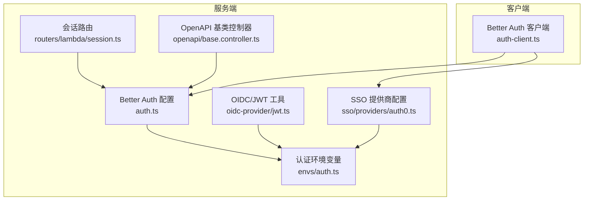
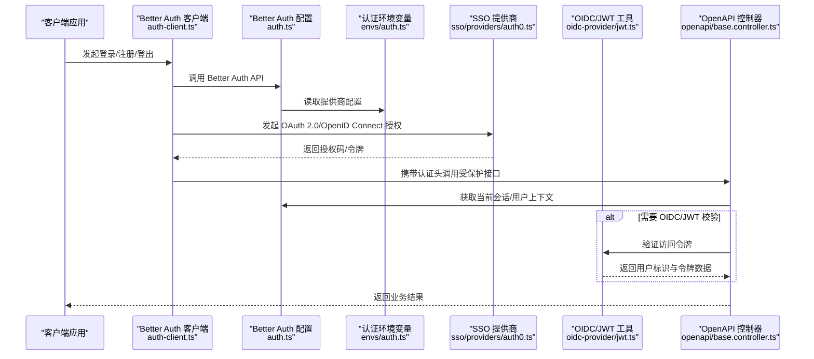
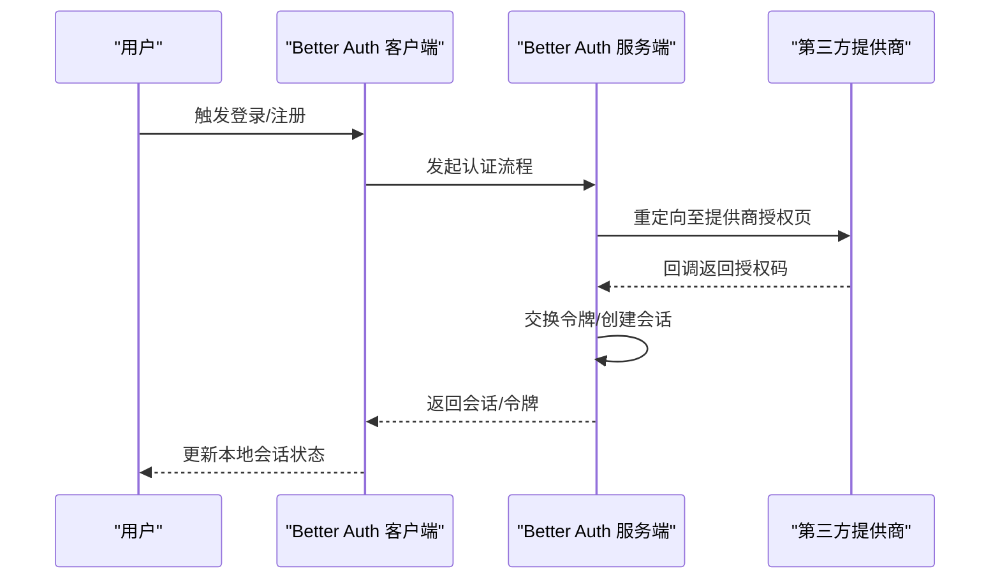
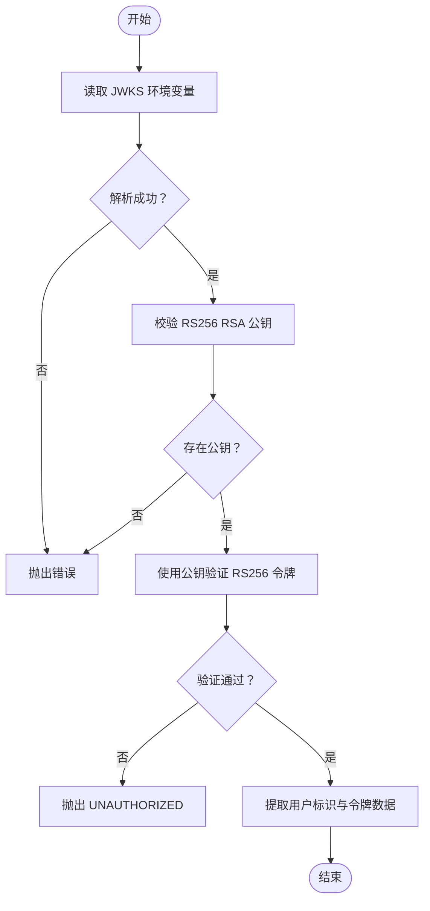
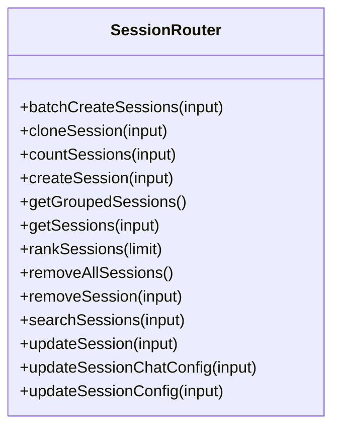
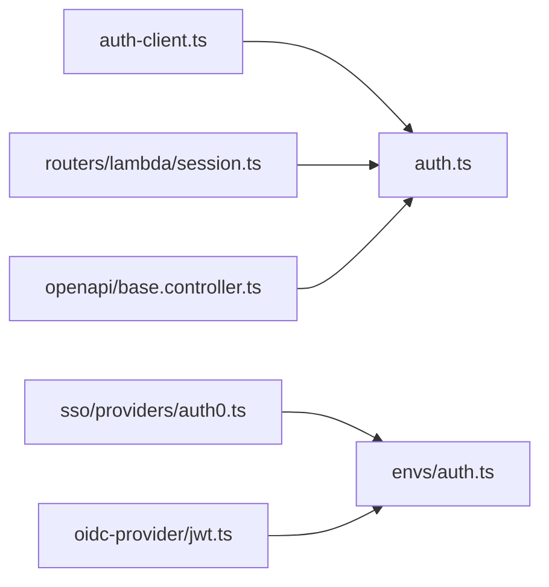

# 认证 API

<cite>
**本文引用的文件**
- [src/auth.ts](file://src/auth.ts)
- [src/business/server/better-auth.ts](file://src/business/server/better-auth.ts)
- [packages/utils/src/server/auth.ts](file://packages/utils/src/server/auth.ts)
- [src/envs/auth.ts](file://src/envs/auth.ts)
- [src/libs/oidc-provider/jwt.ts](file://src/libs/oidc-provider/jwt.ts)
- [src/libs/better-auth/auth-client.ts](file://src/libs/better-auth/auth-client.ts)
- [src/libs/better-auth/sso/providers/auth0.ts](file://src/libs/better-auth/sso/providers/auth0.ts)
- [src/server/routers/lambda/session.ts](file://src/server/routers/lambda/session.ts)
- [packages/openapi/src/common/base.controller.ts](file://packages/openapi/src/common/base.controller.ts)
</cite>

## 目录

1. [简介](#简介)
2. [项目结构](#项目结构)
3. [核心组件](#核心组件)
4. [架构总览](#架构总览)
5. [详细组件分析](#详细组件分析)
6. [依赖关系分析](#依赖关系分析)
7. [性能考量](#性能考量)
8. [故障排查指南](#故障排查指南)
9. [结论](#结论)
10. [附录](#附录)

## 简介

本文件为 LobeHub 认证 API 的权威文档，覆盖用户登录、登出、注册、密码重置、会话管理、JWT 令牌生成与验证、刷新令牌策略、安全头设置、OAuth 2.0/OpenID Connect 第三方认证集成，以及多因素认证、账户锁定策略与安全审计日志的 API 规范与实现要点。文档面向后端工程师与 API 使用者，提供端点定义、请求 / 响应模型、错误码与最佳实践。

## 项目结构

LobeHub 的认证体系由以下关键模块构成：

- 基于 Better Auth 的本地认证与社交登录（OAuth 2.0/OpenID Connect）
- OIDC/JWT 验证与 JWKS 管理
- 服务端路由（Lambda）中的会话与用户相关接口
- OpenAPI 基类控制器中的通用鉴权上下文提取
- 客户端 Better Auth React 客户端封装

图表来源

- [src/libs/better-auth/auth-client.ts](file://src/libs/better-auth/auth-client.ts#L1-L34)
- [src/auth.ts](file://src/auth.ts#L1-L6)
- [src/envs/auth.ts](file://src/envs/auth.ts#L1-L303)
- [src/libs/oidc-provider/jwt.ts](file://src/libs/oidc-provider/jwt.ts#L1-L156)
- [src/libs/better-auth/sso/providers/auth0.ts](file://src/libs/better-auth/sso/providers/auth0.ts#L1-L34)
- [src/server/routers/lambda/session.ts](file://src/server/routers/lambda/session.ts#L1-L197)
- [packages/openapi/src/common/base.controller.ts](file://packages/openapi/src/common/base.controller.ts#L148-L198)

章节来源

- [src/auth.ts](file://src/auth.ts#L1-L6)
- [src/envs/auth.ts](file://src/envs/auth.ts#L1-L303)
- [src/libs/better-auth/auth-client.ts](file://src/libs/better-auth/auth-client.ts#L1-L34)
- [src/libs/better-auth/sso/providers/auth0.ts](file://src/libs/better-auth/sso/providers/auth0.ts#L1-L34)
- [src/libs/oidc-provider/jwt.ts](file://src/libs/oidc-provider/jwt.ts#L1-L156)
- [src/server/routers/lambda/session.ts](file://src/server/routers/lambda/session.ts#L1-L197)
- [packages/openapi/src/common/base.controller.ts](file://packages/openapi/src/common/base.controller.ts#L148-L198)

## 核心组件

- Better Auth 配置与插件：定义认证流程、社交登录、魔法链接等能力。
- 认证环境变量：集中管理各提供商 ID/Secret/Iusser、信任域名、邮件验证开关、内部 JWT 过期时间等。
- OIDC/JWT 工具：从 JWKS 加载公钥并验证 RS256 签名的访问令牌。
- SSO 提供商：以 Auth0 为例，构建 OIDC 配置并进行环境校验。
- 会话路由：提供会话查询、创建、更新、删除等操作（与认证上下文绑定）。
- OpenAPI 基类控制器：在中间件注入 userId/authType/authData，并提供权限检查辅助方法。

章节来源

- [src/auth.ts](file://src/auth.ts#L1-L6)
- [src/envs/auth.ts](file://src/envs/auth.ts#L1-L303)
- [src/libs/oidc-provider/jwt.ts](file://src/libs/oidc-provider/jwt.ts#L1-L156)
- [src/libs/better-auth/sso/providers/auth0.ts](file://src/libs/better-auth/sso/providers/auth0.ts#L1-L34)
- [src/server/routers/lambda/session.ts](file://src/server/routers/lambda/session.ts#L1-L197)
- [packages/openapi/src/common/base.controller.ts](file://packages/openapi/src/common/base.controller.ts#L148-L198)

## 架构总览

下图展示认证端到端流程：客户端通过 Better Auth 客户端发起登录 / 注册 / 登出，服务端基于 Better Auth 配置处理；对需要 OIDC/JWT 的场景，使用 OIDC/JWT 工具进行令牌验证；OpenAPI 控制器从上下文中读取用户信息并执行权限控制。

图表来源

- [src/libs/better-auth/auth-client.ts](file://src/libs/better-auth/auth-client.ts#L1-L34)
- [src/auth.ts](file://src/auth.ts#L1-L6)
- [src/envs/auth.ts](file://src/envs/auth.ts#L1-L303)
- [src/libs/better-auth/sso/providers/auth0.ts](file://src/libs/better-auth/sso/providers/auth0.ts#L1-L34)
- [src/libs/oidc-provider/jwt.ts](file://src/libs/oidc-provider/jwt.ts#L1-L156)
- [packages/openapi/src/common/base.controller.ts](file://packages/openapi/src/common/base.controller.ts#L148-L198)

## 详细组件分析

### Better Auth 客户端与认证流程

- 客户端导出常用认证动作：登录、注册、登出、修改邮箱、发送验证码 / 魔法链接、密码重置、社交账号绑定 / 解绑、会话状态管理等。
- 插件包括：管理员客户端、通用字段推断、通用 OAuth 客户端、魔法链接客户端。
- 该客户端负责与 Better Auth 服务端交互，处理授权码交换、令牌存储与刷新。

图表来源

- [src/libs/better-auth/auth-client.ts](file://src/libs/better-auth/auth-client.ts#L1-L34)
- [src/auth.ts](file://src/auth.ts#L1-L6)

章节来源

- [src/libs/better-auth/auth-client.ts](file://src/libs/better-auth/auth-client.ts#L1-L34)
- [src/auth.ts](file://src/auth.ts#L1-L6)

### OIDC/JWT 令牌验证与 JWKS 管理

- 从环境变量加载 JWKS 字符串，解析为 JSON 并校验格式与 RS256 RSA 公钥存在性。
- 使用 jose 库对 RS256 签名的访问令牌进行验证，提取用户标识与客户端标识等声明。
- 若令牌缺失必要字段或签名验证失败，抛出 UNAUTHORIZED 错误。

图表来源

- [src/libs/oidc-provider/jwt.ts](file://src/libs/oidc-provider/jwt.ts#L1-L156)
- [src/envs/auth.ts](file://src/envs/auth.ts#L193-L198)

章节来源

- [src/libs/oidc-provider/jwt.ts](file://src/libs/oidc-provider/jwt.ts#L1-L156)
- [src/envs/auth.ts](file://src/envs/auth.ts#L193-L198)

### 认证环境变量与安全头

- 支持多种提供商 ID/Secret/Iusser（Google、Apple、GitHub、Auth0、Okta、Keycloak、Logto、Cognito、WeChat、Zitadel、Cloudflare Zero Trust、Casdoor、Feishu 等）。
- 关键安全开关：邮件验证、魔法链接开关、禁用邮箱密码登录、允许邮箱白名单、信任域名、内部 JWT 过期时间、JWKS Key。
- 定义了自定义认证头常量：X-lobe-chat-auth、Oidc-Auth、X-oauth-authorized，用于服务间或客户端与服务端之间的身份传递与校验。

章节来源

- [src/envs/auth.ts](file://src/envs/auth.ts#L1-L303)

### SSO 提供商配置（以 Auth0 为例）

- 通过环境变量构建 OIDC 配置，包含客户端 ID、密钥与发行者。
- 提供环境变量完整性检查，仅当满足条件时启用该提供商。

章节来源

- [src/libs/better-auth/sso/providers/auth0.ts](file://src/libs/better-auth/sso/providers/auth0.ts#L1-L34)
- [src/envs/auth.ts](file://src/envs/auth.ts#L142-L144)

### 会话管理 API（Lambda 路由）

- 路由围绕会话与会话分组提供批量创建、克隆、计数、查询、排序、删除、搜索、更新等操作。
- 所有会话相关接口均通过认证过程注入的用户上下文进行数据隔离与权限控制。

图表来源

- [src/server/routers/lambda/session.ts](file://src/server/routers/lambda/session.ts#L1-L197)

章节来源

- [src/server/routers/lambda/session.ts](file://src/server/routers/lambda/session.ts#L1-L197)

### OpenAPI 基类控制器中的认证上下文

- 在中间件中注入 userId、authType、authData 到请求上下文。
- 提供权限检查辅助方法，结合 RBAC 权限键进行细粒度控制。

章节来源

- [packages/openapi/src/common/base.controller.ts](file://packages/openapi/src/common/base.controller.ts#L148-L198)

## 依赖关系分析

- Better Auth 客户端依赖 Better Auth 配置与提供商插件。
- SSO 提供商配置依赖认证环境变量。
- OIDC/JWT 工具依赖 JWKS 环境变量与 jose 库。
- 会话路由依赖 Better Auth 认证上下文与数据库模型。
- OpenAPI 控制器依赖 Better Auth 会话与 RBAC 模型。

图表来源

- [src/libs/better-auth/auth-client.ts](file://src/libs/better-auth/auth-client.ts#L1-L34)
- [src/auth.ts](file://src/auth.ts#L1-L6)
- [src/libs/better-auth/sso/providers/auth0.ts](file://src/libs/better-auth/sso/providers/auth0.ts#L1-L34)
- [src/envs/auth.ts](file://src/envs/auth.ts#L1-L303)
- [src/libs/oidc-provider/jwt.ts](file://src/libs/oidc-provider/jwt.ts#L1-L156)
- [src/server/routers/lambda/session.ts](file://src/server/routers/lambda/session.ts#L1-L197)
- [packages/openapi/src/common/base.controller.ts](file://packages/openapi/src/common/base.controller.ts#L148-L198)

章节来源

- [src/libs/better-auth/auth-client.ts](file://src/libs/better-auth/auth-client.ts#L1-L34)
- [src/auth.ts](file://src/auth.ts#L1-L6)
- [src/libs/better-auth/sso/providers/auth0.ts](file://src/libs/better-auth/sso/providers/auth0.ts#L1-L34)
- [src/envs/auth.ts](file://src/envs/auth.ts#L1-L303)
- [src/libs/oidc-provider/jwt.ts](file://src/libs/oidc-provider/jwt.ts#L1-L156)
- [src/server/routers/lambda/session.ts](file://src/server/routers/lambda/session.ts#L1-L197)
- [packages/openapi/src/common/base.controller.ts](file://packages/openapi/src/common/base.controller.ts#L148-L198)

## 性能考量

- 内部 JWT 过期时间建议尽可能短以降低风险，同时考虑网络延迟与服务端处理时间。
- OIDC/JWT 验证应避免频繁解析 JWKS，可在进程内缓存已导入的公钥对象。
- 社交登录授权回调链路较长，需关注超时与重试策略。
- 会话查询与更新应配合数据库索引与分页参数，避免一次性加载过多数据。

章节来源

- [src/envs/auth.ts](file://src/envs/auth.ts#L197-L198)
- [src/libs/oidc-provider/jwt.ts](file://src/libs/oidc-provider/jwt.ts#L1-L156)

## 故障排查指南

- OIDC/JWT 验证失败
  - 检查 JWKS_KEY 是否正确设置且包含有效的 RS256 RSA 公钥。
  - 确认令牌算法与签名一致，确保发行者与受众匹配。
- 认证头无效
  - 确保客户端按规范携带 X-lobe-chat-auth 或 Oidc-Auth 头。
  - 对于 Bearer 令牌，确认前缀与空格处理符合标准。
- SSO 提供商不可用
  - 校验对应环境变量是否齐全，检查提供商颁发的 ID/Secret/Iusser。
- 会话接口返回未认证
  - 确认 Better Auth 会话有效且未过期，检查中间件是否正确注入 userId。

章节来源

- [src/libs/oidc-provider/jwt.ts](file://src/libs/oidc-provider/jwt.ts#L1-L156)
- [src/envs/auth.ts](file://src/envs/auth.ts#L299-L302)
- [packages/utils/src/server/auth.ts](file://packages/utils/src/server/auth.ts#L1-L61)
- [src/libs/better-auth/sso/providers/auth0.ts](file://src/libs/better-auth/sso/providers/auth0.ts#L1-L34)

## 结论

LobeHub 的认证体系以 Better Auth 为核心，结合 OIDC/JWT 与丰富的 SSO 提供商配置，形成可扩展、可维护的认证方案。通过 OpenAPI 基类控制器统一注入认证上下文与权限检查，配合严格的环境变量与安全头策略，能够满足企业级的安全与合规要求。建议在生产环境中严格管理 JWKS 与提供商凭据，合理设置内部 JWT 过期时间，并完善多因素认证与审计日志策略。

## 附录

### API 端点与规范（概要）

- 用户登录
  - 方法：POST
  - 路径：/api/auth/signin
  - 请求体：包含邮箱 / 用户名与密码或授权码（取决于配置）
  - 响应：会话信息与令牌
  - 安全头：X-lobe-chat-auth 或 Oidc-Auth（如适用）
- 用户注册
  - 方法：POST
  - 路径：/api/auth/signup
  - 请求体：用户资料与凭据
  - 响应：会话信息（可选开启邮箱验证）
- 登出
  - 方法：POST
  - 路径：/api/auth/signout
  - 响应：成功状态
- 密码重置
  - 方法：POST
  - 路径：/api/auth/reset-password
  - 请求体：邮箱或令牌
  - 响应：操作结果
- 会话管理
  - 查询会话列表：GET /api/session/list
  - 创建会话：POST /api/session
  - 更新会话：PUT /api/session/{id}
  - 删除会话：DELETE /api/session/{id}
  - 克隆会话：POST /api/session/clone
  - 搜索会话：GET /api/session/search?keywords={...}

章节来源

- [src/libs/better-auth/auth-client.ts](file://src/libs/better-auth/auth-client.ts#L1-L34)
- [src/server/routers/lambda/session.ts](file://src/server/routers/lambda/session.ts#L1-L197)

### JWT 令牌生成与验证机制

- 令牌生成：Better Auth 在登录成功后签发会话令牌，支持刷新令牌策略。
- 令牌验证：OIDC/JWT 工具使用 JWKS 公钥验证 RS256 签名，提取用户标识与客户端标识。
- 刷新令牌策略：建议在 Better Auth 配置中启用刷新令牌，并设置合理的过期与滑动窗口策略。

章节来源

- [src/libs/oidc-provider/jwt.ts](file://src/libs/oidc-provider/jwt.ts#L1-L156)
- [src/envs/auth.ts](file://src/envs/auth.ts#L197-L198)

### OAuth 2.0 与 OpenID Connect 集成

- 通过 Better Auth 插件与 SSO 提供商配置，支持多种 OIDC 提供商。
- 客户端发起授权，服务端完成授权码交换与令牌持久化，随后返回会话给客户端。

章节来源

- [src/libs/better-auth/sso/providers/auth0.ts](file://src/libs/better-auth/sso/providers/auth0.ts#L1-L34)
- [src/envs/auth.ts](file://src/envs/auth.ts#L142-L144)

### 多因素认证、账户锁定与安全审计

- 多因素认证：建议在 Better Auth 中启用 MFA 插件，并结合短信 / 邮件 / 硬件密钥等方式。
- 账户锁定策略：建议实现登录失败次数限制与临时封禁逻辑，结合速率限制与验证码。
- 安全审计日志：建议记录登录 / 登出、令牌发放 / 撤销、敏感操作等事件，便于追踪与合规。

\[本节为通用指导，不直接分析具体文件]
