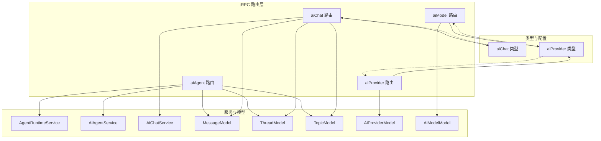
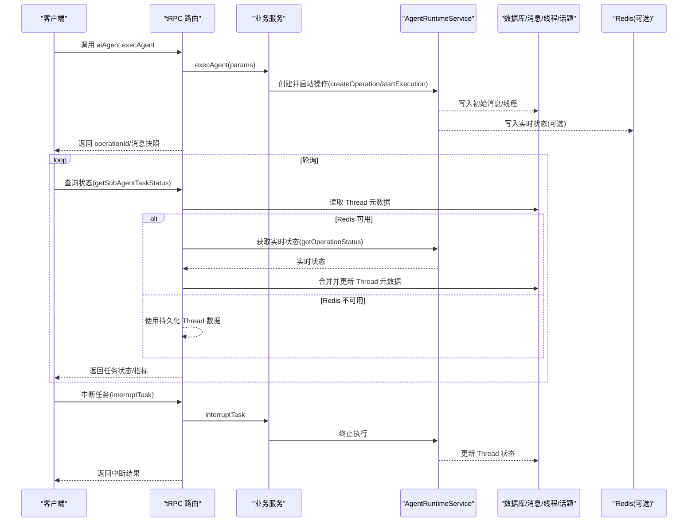
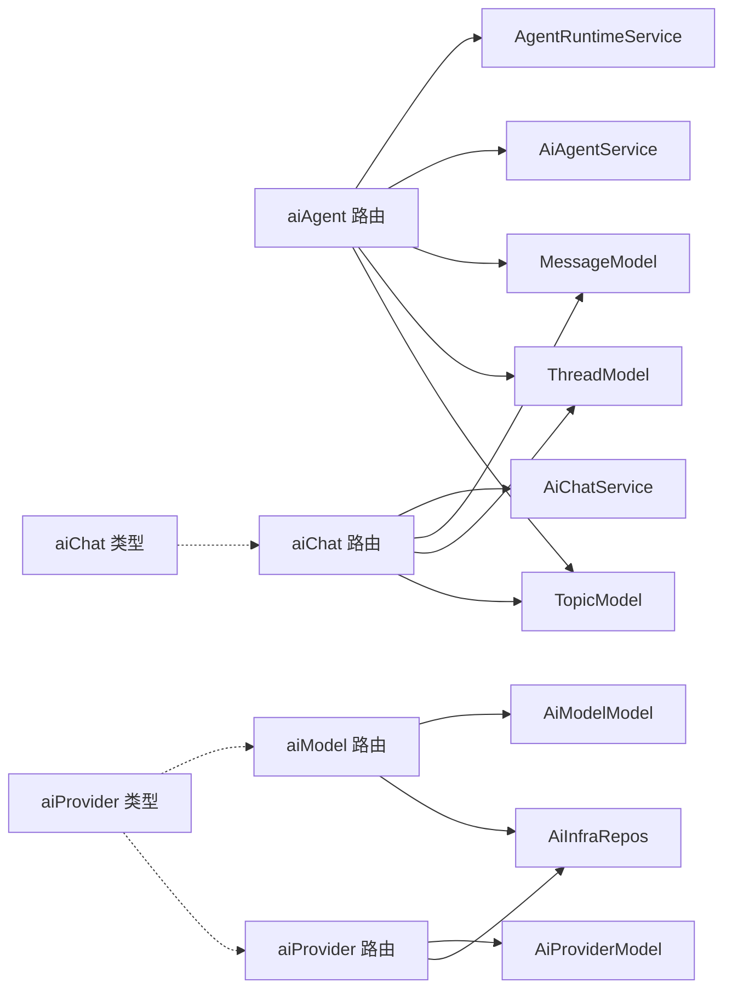

# AI Agent 路由模块

<cite>
**本文档引用的文件**
- [src/server/routers/lambda/aiAgent.ts](file://src/server/routers/lambda/aiAgent.ts)
- [src/server/routers/lambda/aiChat.ts](file://src/server/routers/lambda/aiChat.ts)
- [src/server/routers/lambda/aiModel.ts](file://src/server/routers/lambda/aiModel.ts)
- [src/server/routers/lambda/aiProvider.ts](file://src/server/routers/lambda/aiProvider.ts)
- [src/services/aiAgent.ts](file://src/services/aiAgent.ts)
- [packages/types/src/aiChat.ts](file://packages/types/src/aiChat.ts)
- [packages/types/src/aiProvider.ts](file://packages/types/src/aiProvider.ts)
</cite>

## 目录

1. [简介](#简介)
2. [项目结构](#项目结构)
3. [核心组件](#核心组件)
4. [架构总览](#架构总览)
5. [详细组件分析](#详细组件分析)
6. [依赖关系分析](#依赖关系分析)
7. [性能考虑](#性能考虑)
8. [故障排除指南](#故障排除指南)
9. [结论](#结论)
10. [附录](#附录)

## 简介

本文件为 AI Agent 路由模块的 tRPC 接口文档，覆盖以下核心路由与功能：

- aiAgent：AI Agent 执行、状态查询、干预与中断、客户端任务线程管理
- aiChat：结构化输出 JSON、服务端消息发送（含话题与线程）
- aiModel：模型管理（启用 / 禁用、批量更新、排序、清理）
- aiProvider：提供商管理（创建、启用 / 禁用、更新配置、运行时状态）

文档详细说明各接口的输入输出、异步任务处理、并发控制、流式响应支持、错误处理策略与性能监控建议，并提供客户端集成示例与最佳实践。

## 项目结构

AI Agent 路由模块位于后端 Lambda tRPC 路由层，围绕 Agent 运行时、消息与线程持久化、提供商与模型配置进行组织。核心文件如下：

- 路由层：aiAgent.ts、aiChat.ts、aiModel.ts、aiProvider.ts
- 类型定义：packages/types/src/aiChat.ts、packages/types/src/aiProvider.ts
- 客户端封装：src/services/aiAgent.ts

图表来源

- [src/server/routers/lambda/aiAgent.ts](file://src/server/routers/lambda/aiAgent.ts#L235-L248)
- [src/server/routers/lambda/aiChat.ts](file://src/server/routers/lambda/aiChat.ts#L19-L32)
- [src/server/routers/lambda/aiModel.ts](file://src/server/routers/lambda/aiModel.ts#L19-L37)
- [src/server/routers/lambda/aiProvider.ts](file://src/server/routers/lambda/aiProvider.ts#L18-L36)
- [packages/types/src/aiChat.ts](file://packages/types/src/aiChat.ts#L1-L163)
- [packages/types/src/aiProvider.ts](file://packages/types/src/aiProvider.ts#L1-L385)

章节来源

- [src/server/routers/lambda/aiAgent.ts](file://src/server/routers/lambda/aiAgent.ts#L1-L1209)
- [src/server/routers/lambda/aiChat.ts](file://src/server/routers/lambda/aiChat.ts#L1-L190)
- [src/server/routers/lambda/aiModel.ts](file://src/server/routers/lambda/aiModel.ts#L1-L147)
- [src/server/routers/lambda/aiProvider.ts](file://src/server/routers/lambda/aiProvider.ts#L1-L125)
- [src/services/aiAgent.ts](file://src/services/aiAgent.ts#L1-L156)
- [packages/types/src/aiChat.ts](file://packages/types/src/aiChat.ts#L1-L163)
- [packages/types/src/aiProvider.ts](file://packages/types/src/aiProvider.ts#L1-L385)

## 核心组件

- aiAgent 路由：负责 Agent 任务执行、状态轮询、人工干预、中断、客户端任务线程创建与完成上报；支持单 Agent、群组 Agent 与子任务委托。
- aiChat 路由：提供结构化 JSON 输出能力与服务端消息发送流程，支持话题与线程联动。
- aiModel 路由：提供模型的增删改查、启用 / 禁用、批量操作与排序。
- aiProvider 路由：提供提供商的增删改查、启用 / 禁用、配置更新与运行时状态查询。
- 类型系统：统一约束输入参数与返回结构，确保前后端一致性。

章节来源

- [src/server/routers/lambda/aiAgent.ts](file://src/server/routers/lambda/aiAgent.ts#L250-L1209)
- [src/server/routers/lambda/aiChat.ts](file://src/server/routers/lambda/aiChat.ts#L34-L190)
- [src/server/routers/lambda/aiModel.ts](file://src/server/routers/lambda/aiModel.ts#L39-L144)
- [src/server/routers/lambda/aiProvider.ts](file://src/server/routers/lambda/aiProvider.ts#L38-L122)
- [src/services/aiAgent.ts](file://src/services/aiAgent.ts#L91-L156)
- [packages/types/src/aiChat.ts](file://packages/types/src/aiChat.ts#L1-L163)
- [packages/types/src/aiProvider.ts](file://packages/types/src/aiProvider.ts#L1-L385)

## 架构总览

下图展示从客户端到 tRPC 路由、服务与数据存储的整体调用链路，以及异步任务与状态回写机制：

图表来源

- [src/server/routers/lambda/aiAgent.ts](file://src/server/routers/lambda/aiAgent.ts#L520-L1027)
- [src/services/aiAgent.ts](file://src/services/aiAgent.ts#L91-L156)

## 详细组件分析

### aiAgent 路由接口规范

- 认证与上下文
  - 使用已认证过程与数据库中间件注入上下文，包含 AgentRuntimeService、AiAgentService、AiChatService、MessageModel、ThreadModel、TopicModel。

- 关键接口
  - createClientTaskThread：为桌面客户端创建隔离线程，不立即执行，仅持久化初始用户消息，返回线程与消息快照。
  - createClientGroupAgentTaskThread：群组场景创建隔离线程，支持不同代理的消息混合查询。
  - createOperation：创建 Agent 运行时操作，生成 operationId，可自动调度首步。
  - execAgent：执行单个 Agent 任务，支持传入现有消息 ID、应用上下文与自动启动。
  - execAgents：批量执行多个 Agent 任务，支持并发或串行，内置并发控制。
  - execGroupAgent：群组 Supervisor 一次性执行，包含话题 / 线程创建与消息占位。
  - execSubAgentTask：委托子任务给子代理，支持群组与单代理模式。
  - getOperationStatus：查询 Agent 运行时操作状态与历史。
  - getPendingInterventions：查询待处理的人工干预项。
  - getSubAgentTaskStatus：按线程查询子任务状态，结合 PostgreSQL 与 Redis 实时状态。
  - interruptTask：中断运行中任务，更新线程状态。
  - processHumanIntervention：处理人工干预（批准 / 拒绝 / 输入 / 选择）。
  - startExecution：延迟与优先级启动执行。
  - updateClientTaskThreadStatus：客户端本地执行完成后上报状态与指标。

- 异步任务与并发控制
  - 批量执行使用并发映射，支持并发度控制（默认 5），失败项单独记录。
  - 子任务状态轮询通过线程状态映射与 Redis 实时状态合并，保证在队列模式下的状态一致性。
  - 任务中断与人工干预通过运行时服务协调，确保状态原子性更新。

- 错误处理
  - 明确区分 TRPC 错误码（如 NOT_FOUND、BAD_REQUEST、INTERNAL_SERVER_ERROR）与通用异常转换。
  - 对 Redis 状态过期进行降级处理，仅使用持久化数据。

- 流式响应与 SSE
  - 该模块未直接暴露 SSE 端点；前端可通过轮询 getSubAgentTaskStatus 或在 execGroupAgent 成功后建立 SSE 连接。

- 请求 / 响应模式示例
  - execAgent 输入：agentId/slug、prompt、appContext、existingMessageIds、autoStart。
  - execAgents 输入：tasks 数组与 parallel 标志；输出：results、summary。
  - getSubAgentTaskStatus 输入：threadId；输出：状态、指标、当前活动、消息列表与任务详情。
  - interruptTask 输入：operationId 或 threadId；输出：成功标记。
  - processHumanIntervention 输入：operationId、action、data、reason、stepIndex；输出：调度消息 ID 与时间戳。

- 性能监控
  - 建议在运行时服务层埋点 operationId、步骤计数、令牌用量、工具调用次数与耗时。
  - Redis 实时状态用于动态指标聚合，线程元数据作为持久化备份。

章节来源

- [src/server/routers/lambda/aiAgent.ts](file://src/server/routers/lambda/aiAgent.ts#L235-L1209)
- [src/services/aiAgent.ts](file://src/services/aiAgent.ts#L91-L156)

### aiChat 路由接口规范

- 认证与上下文
  - 注入 AgentModel、AiChatService、FileService、MessageModel、ThreadModel、TopicModel。

- 关键接口
  - outputJSON：基于数据库中的提供商配置初始化模型运行时，生成结构化对象。
  - sendMessageInServer：创建话题（可选）、线程（可选）、用户消息与助手消息占位，返回最新消息与话题集合。

- 请求 / 响应模式示例
  - outputJSON 输入：provider、model、messages、schema、tools；输出：结构化对象。
  - sendMessageInServer 输入：agentId、groupId、newUserMessage、newAssistantMessage、newThread/newTopic、sessionId/threadId/topicId；输出：assistantMessageId、userMessageId、createdThreadId、isCreateNewTopic、messages、topics。

- 错误处理
  - 针对缺失参数与内部错误抛出明确 TRPC 错误码。

章节来源

- [src/server/routers/lambda/aiChat.ts](file://src/server/routers/lambda/aiChat.ts#L19-L190)
- [packages/types/src/aiChat.ts](file://packages/types/src/aiChat.ts#L36-L163)

### aiModel 路由接口规范

- 认证与上下文
  - 注入 AiInfraRepos、AiModelModel、KeyVaultsGateKeeper、UserModel。

- 关键接口
  - createAiModel：创建模型。
  - getAiModelById：按 ID 查询模型。
  - getAiProviderModelList：分页获取提供商模型列表。
  - updateAiModel/updateAiModelOrder：更新模型与排序。
  - toggleModelEnabled：切换启用状态。
  - batchToggleAiModels/batchUpdateAiModels：批量启用 / 更新。
  - clearModelsByProvider/clearRemoteModels：清理提供商模型。
  - removeAiModel：删除模型。

- 请求 / 响应模式示例
  - getAiProviderModelList 输入：id、enabled、limit、offset；输出：模型列表项。
  - updateAiModelOrder 输入：providerId、sortMap；输出：排序更新结果。

章节来源

- [src/server/routers/lambda/aiModel.ts](file://src/server/routers/lambda/aiModel.ts#L19-L144)
- [packages/types/src/aiProvider.ts](file://packages/types/src/aiProvider.ts#L251-L368)

### aiProvider 路由接口规范

- 认证与上下文
  - 注入 AiInfraRepos、AiProviderModel、KeyVaultsGateKeeper、UserModel。

- 关键接口
  - createAiProvider：创建提供商。
  - getAiProviderById：按 ID 查询提供商详情。
  - getAiProviderList：获取提供商列表。
  - getAiProviderRuntimeState：查询运行时状态（启用提供商与模型、运行时配置）。
  - removeAiProvider：删除提供商。
  - toggleProviderEnabled：切换启用状态。
  - updateAiProvider/updateAiProviderConfig：更新提供商与配置。
  - updateAiProviderOrder：更新排序。

- 请求 / 响应模式示例
  - getAiProviderRuntimeState 输入：isLogin 可选；输出：启用提供商与模型、运行时配置映射。

章节来源

- [src/server/routers/lambda/aiProvider.ts](file://src/server/routers/lambda/aiProvider.ts#L18-L122)
- [packages/types/src/aiProvider.ts](file://packages/types/src/aiProvider.ts#L288-L385)

## 依赖关系分析

- 路由层依赖
  - aiAgent 路由依赖 AgentRuntimeService、AiAgentService、AiChatService 与消息 / 线程 / 话题模型。
  - aiChat 路由依赖 AiChatService 与消息 / 线程 / 话题模型。
  - aiModel/aiProvider 路由依赖各自模型与 AiInfraRepos。
- 类型依赖
  - aiChat 路由使用 aiChat 类型定义校验输入与输出。
  - aiProvider 路由使用 aiProvider 类型定义校验提供商相关输入与输出。
- 外部依赖
  - 运行时状态依赖 Redis（可选）与 PostgreSQL（持久化）。
  - KeyVaultsGateKeeper 用于密钥加密与解密。

图表来源

- [src/server/routers/lambda/aiAgent.ts](file://src/server/routers/lambda/aiAgent.ts#L235-L248)
- [src/server/routers/lambda/aiChat.ts](file://src/server/routers/lambda/aiChat.ts#L19-L32)
- [src/server/routers/lambda/aiModel.ts](file://src/server/routers/lambda/aiModel.ts#L19-L37)
- [src/server/routers/lambda/aiProvider.ts](file://src/server/routers/lambda/aiProvider.ts#L18-L36)
- [packages/types/src/aiChat.ts](file://packages/types/src/aiChat.ts#L1-L163)
- [packages/types/src/aiProvider.ts](file://packages/types/src/aiProvider.ts#L1-L385)

章节来源

- [src/server/routers/lambda/aiAgent.ts](file://src/server/routers/lambda/aiAgent.ts#L235-L248)
- [src/server/routers/lambda/aiChat.ts](file://src/server/routers/lambda/aiChat.ts#L19-L32)
- [src/server/routers/lambda/aiModel.ts](file://src/server/routers/lambda/aiModel.ts#L19-L37)
- [src/server/routers/lambda/aiProvider.ts](file://src/server/routers/lambda/aiProvider.ts#L18-L36)

## 性能考虑

- 并发控制
  - 批量任务使用并发映射，默认并发度 5，避免过度占用资源。
- 状态合并
  - 子任务状态轮询优先读取 Redis 实时状态，若不可用则回退至线程表持久化数据，减少重复计算。
- 指标采集
  - 建议在运行时服务层记录 tokens、工具调用次数、步骤数与耗时，统一写入线程元数据。
- 数据库访问
  - 批量读取采用并行查询（线程消息与主消息），降低等待时间。
- 缓存与降级
  - Redis 不可用时，仍可基于线程表返回稳定状态，保障用户体验。

## 故障排除指南

- 常见错误码
  - NOT_FOUND：线程不存在或操作 ID 不存在。
  - BAD_REQUEST：缺少必要参数（如 provider、model、operationId）。
  - INTERNAL_SERVER_ERROR：未知内部错误，需检查日志与堆栈。
- 排查步骤
  - 确认 operationId 是否正确传递。
  - 检查 Redis 是否可用，确认实时状态是否过期。
  - 查看线程状态与元数据是否正确更新。
  - 核对提供商配置与密钥是否有效。
- 日志定位
  - 路由层使用调试日志记录关键路径与参数，便于问题复现。

章节来源

- [src/server/routers/lambda/aiAgent.ts](file://src/server/routers/lambda/aiAgent.ts#L714-L1027)

## 结论

AI Agent 路由模块以清晰的职责划分与强类型约束，提供了从任务执行、状态查询、人工干预到提供商与模型管理的完整能力。通过并发控制、状态合并与指标采集，兼顾了性能与可靠性。建议在生产环境中配合监控与告警体系，持续优化并发策略与状态回写逻辑。

## 附录

### 客户端集成示例与最佳实践

- 单次任务执行
  - 步骤：调用 execAgent 创建任务，轮询 getSubAgentTaskStatus 获取状态，根据 success 决定是否连接 SSE。
  - 最佳实践：设置合理的轮询间隔，避免频繁请求；在任务完成或失败时停止轮询。
- 批量任务执行
  - 步骤：调用 execAgents，解析 results 与 summary，对失败项进行重试或补偿。
  - 最佳实践：根据业务需求调整 parallel 参数；对高优先级任务提升并发度。
- 群组任务与子任务
  - 步骤：execGroupAgent 创建话题与线程；execSubAgentTask 委托子任务；getSubAgentTaskStatus 轮询子任务状态。
  - 最佳实践：子任务使用隔离线程，避免与其他消息混淆；在 UI 层区分 supervisor 与 worker 的消息。
- 客户端本地执行
  - 步骤：createClientTaskThread 创建线程；本地执行完成后调用 updateClientTaskThreadStatus 上报状态。
  - 最佳实践：上报前确保结果内容与指标完整；失败时记录错误信息以便后续排查。
- 提供商与模型管理
  - 步骤：aiProvider 路由创建 / 更新提供商；aiModel 路由维护模型列表与排序。
  - 最佳实践：定期同步远程模型列表；启用 / 禁用开关与排序变更需幂等处理。
