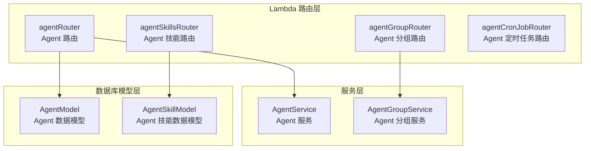
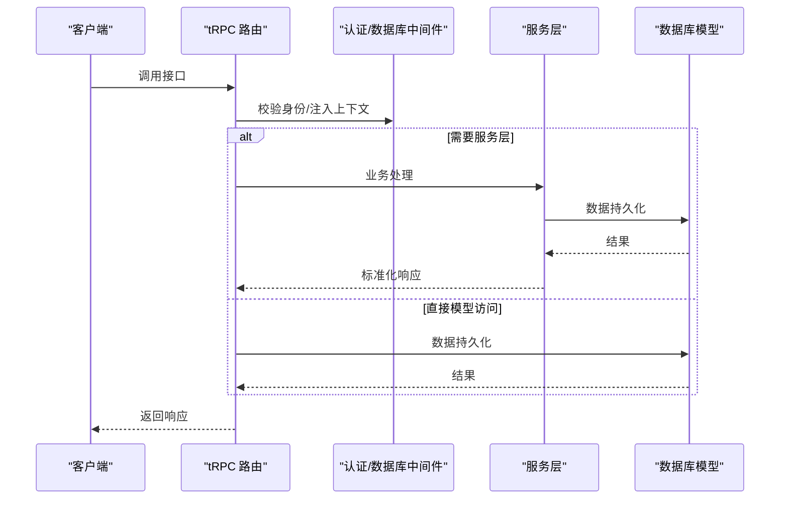
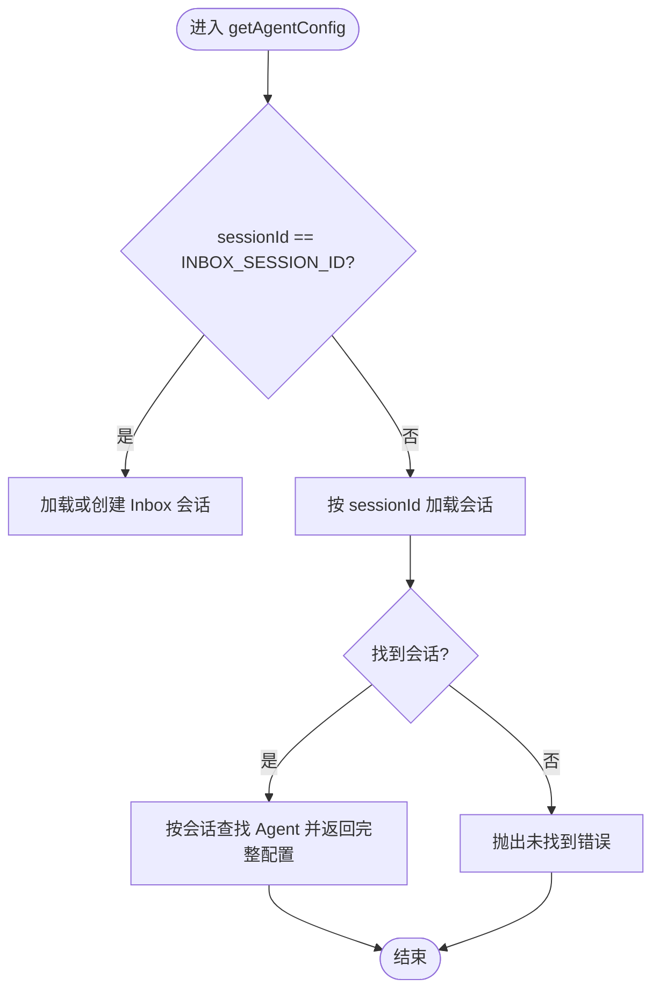
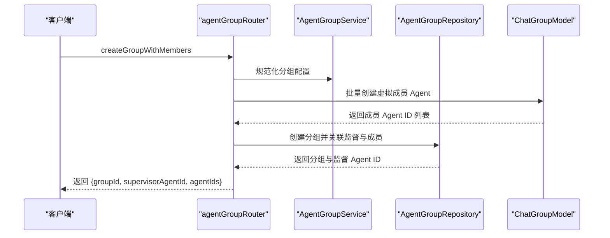
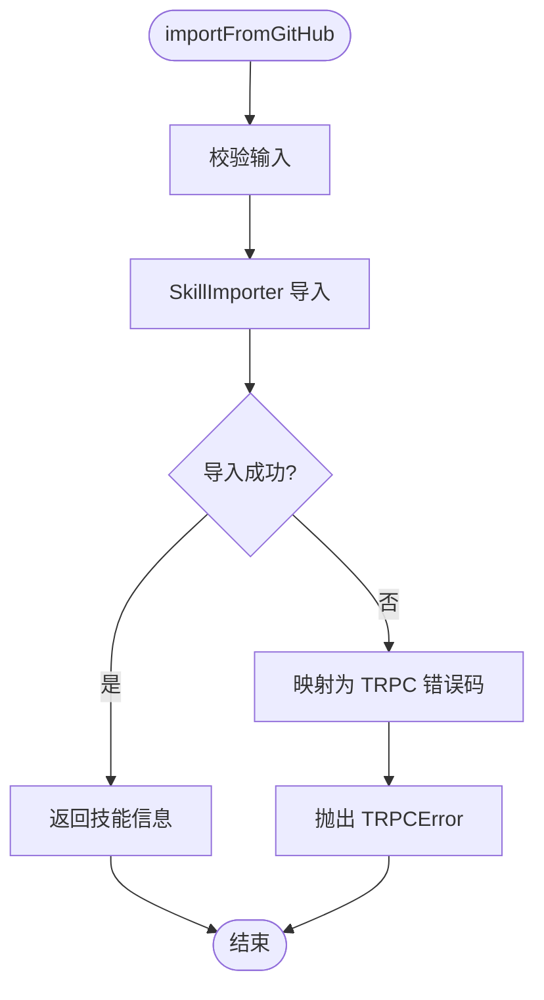
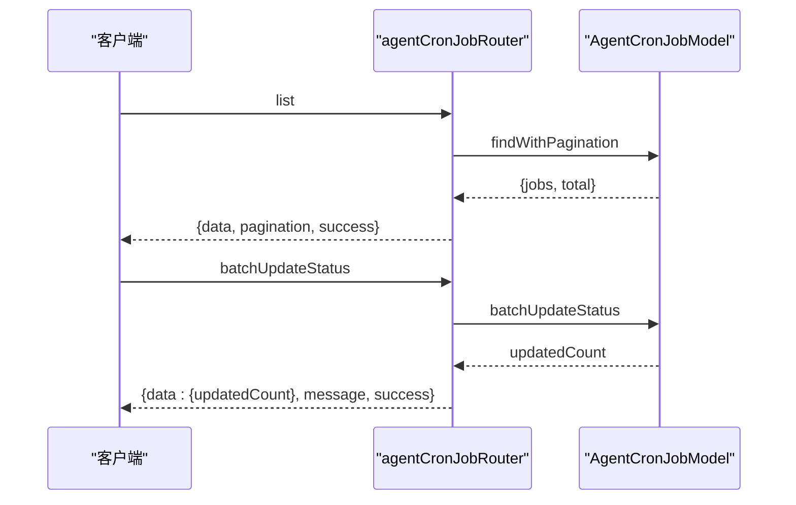
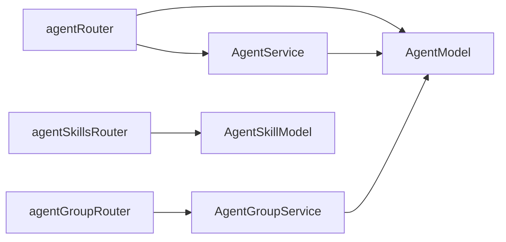

# Agent 路由模块

<cite>
**本文档引用的文件**
- [src/server/routers/lambda/agent.ts](file://src/server/routers/lambda/agent.ts)
- [src/server/routers/lambda/agentGroup.ts](file://src/server/routers/lambda/agentGroup.ts)
- [src/server/routers/lambda/agentSkills.ts](file://src/server/routers/lambda/agentSkills.ts)
- [src/server/routers/lambda/agentCronJob.ts](file://src/server/routers/lambda/agentCronJob.ts)
- [packages/openapi/src/services/agent.service.ts](file://packages/openapi/src/services/agent.service.ts)
- [packages/openapi/src/services/agent-group.service.ts](file://packages/openapi/src/services/agent-group.service.ts)
- [packages/openapi/src/types/agent.type.ts](file://packages/openapi/src/types/agent.type.ts)
- [packages/openapi/src/types/agent-group.type.ts](file://packages/openapi/src/types/agent-group.type.ts)
- [packages/database/src/models/agent.ts](file://packages/database/src/models/agent.ts)
- [packages/database/src/models/agentSkill.ts](file://packages/database/src/models/agentSkill.ts)
</cite>

## 目录

1. [简介](#简介)
2. [项目结构](#项目结构)
3. [核心组件](#核心组件)
4. [架构总览](#架构总览)
5. [详细组件分析](#详细组件分析)
6. [依赖分析](#依赖分析)
7. [性能考虑](#性能考虑)
8. [故障排查指南](#故障排查指南)
9. [结论](#结论)
10. [附录](#附录)

## 简介

本文件为 Agent 路由模块的 tRPC 接口文档，覆盖 Agent 创建、配置、管理以及分组协作、技能绑定、定时任务等能力。文档详细说明了各路由的输入参数、响应格式、错误处理与业务逻辑，并提供 TypeScript 类型定义、参数校验规则、中间件与权限控制策略，以及客户端集成建议与性能优化策略。

## 项目结构

Agent 路由模块位于后端 Lambda 层，围绕 tRPC 路由器组织，配合服务层与数据库模型实现完整的生命周期管理。

图表来源

- [src/server/routers/lambda/agent.ts](file://src/server/routers/lambda/agent.ts#L32-L370)
- [src/server/routers/lambda/agentGroup.ts](file://src/server/routers/lambda/agentGroup.ts#L56-L326)
- [src/server/routers/lambda/agentSkills.ts](file://src/server/routers/lambda/agentSkills.ts#L89-L272)
- [src/server/routers/lambda/agentCronJob.ts](file://src/server/routers/lambda/agentCronJob.ts#L39-L364)
- [packages/openapi/src/services/agent.service.ts](file://packages/openapi/src/services/agent.service.ts#L24-L358)
- [packages/openapi/src/services/agent-group.service.ts](file://packages/openapi/src/services/agent-group.service.ts#L20-L204)
- [packages/database/src/models/agent.ts](file://packages/database/src/models/agent.ts#L21-L576)
- [packages/database/src/models/agentSkill.ts](file://packages/database/src/models/agentSkill.ts#L36-L154)

章节来源

- [src/server/routers/lambda/agent.ts](file://src/server/routers/lambda/agent.ts#L1-L370)
- [src/server/routers/lambda/agentGroup.ts](file://src/server/routers/lambda/agentGroup.ts#L1-L326)
- [src/server/routers/lambda/agentSkills.ts](file://src/server/routers/lambda/agentSkills.ts#L1-L272)
- [src/server/routers/lambda/agentCronJob.ts](file://src/server/routers/lambda/agentCronJob.ts#L1-L364)

## 核心组件

- agentRouter：提供 Agent 的创建、配置读写、知识库 / 文件绑定、内置 Agent 查询、分组协作、生命周期管理等接口。
- agentGroupRouter：提供分组创建、成员管理、复制、配置更新、查询详情与列表等接口。
- agentSkillsRouter：提供技能导入（本地、GitHub、市场）、查询、资源读取、更新等接口。
- agentCronJobRouter：提供定时任务的创建、查询、批量启停、重置执行次数、统计等接口。

章节来源

- [src/server/routers/lambda/agent.ts](file://src/server/routers/lambda/agent.ts#L32-L370)
- [src/server/routers/lambda/agentGroup.ts](file://src/server/routers/lambda/agentGroup.ts#L56-L326)
- [src/server/routers/lambda/agentSkills.ts](file://src/server/routers/lambda/agentSkills.ts#L89-L272)
- [src/server/routers/lambda/agentCronJob.ts](file://src/server/routers/lambda/agentCronJob.ts#L39-L364)

## 架构总览

tRPC 路由层通过认证中间件与数据库上下文注入，调用服务层或直接访问数据库模型，返回标准化响应。

图表来源

- [src/server/routers/lambda/agent.ts](file://src/server/routers/lambda/agent.ts#L17-L30)
- [src/server/routers/lambda/agentGroup.ts](file://src/server/routers/lambda/agentGroup.ts#L42-L54)
- [src/server/routers/lambda/agentSkills.ts](file://src/server/routers/lambda/agentSkills.ts#L56-L69)
- [src/server/routers/lambda/agentCronJob.ts](file://src/server/routers/lambda/agentCronJob.ts#L10-L10)

## 详细组件分析

### Agent 路由（agentRouter）

- 中间件与上下文
  - 使用认证过程与数据库中间件，向 ctx 注入 AgentModel、AgentService、ChatGroupModel、FileModel、KnowledgeBaseModel、SessionModel。

- 主要接口
  - checkByMarketIdentifier：按市场标识符检查是否已存在。
  - createAgent：创建带会话的 Agent，返回 agentId 与 sessionId。
  - createAgentOnly：仅创建 Agent（不创建会话），用于群组代理构建器。
  - createAgentFiles/createAgentKnowledgeBase：为 Agent 绑定文件 / 知识库。
  - deleteAgentFile/deleteAgentKnowledgeBase：解绑文件 / 知识库。
  - duplicateAgent：复制 Agent 及其会话。
  - getAgentByForkedFromIdentifier/getAgentByMarketIdentifier：按派生或市场标识符查询。
  - getAgentConfig/getAgentConfigById：按会话或 ID 获取完整配置（含知识库 / 文件）。
  - getBuiltinAgent：获取或创建内置 Agent。
  - getKnowledgeBasesAndFiles：列出可选的知识库与文件并标注启用状态。
  - queryAgents：关键词搜索非虚拟 Agent（最小信息集）。
  - removeAgent：删除 Agent 及其会话。
  - toggleFile/toggleKnowledgeBase：切换文件 / 知识库启用状态。
  - updateAgentConfig：更新 Agent 配置（支持部分更新与 params 合并）。
  - updateAgentPinned：固定 / 取消固定 Agent。

- 参数与响应
  - 输入参数均使用 zod 校验，如 createAgent 的 config 使用 insertAgentSchema 的部分字段透传。
  - 响应统一返回对象，包含业务数据与标准字段（如 agentId、sessionId 等）。

- 错误处理
  - 未找到会话时抛出错误；其他异常通过 TRPCError 统一转换。

- 业务逻辑
  - 内置 Agent（如 inbox）兼容历史存储方式，首次访问时进行 slug 回填与标记。
  - 知识库 / 文件绑定采用并行查询与去重插入，提升性能。
  - params 字段支持逐项删除（undefined）与禁用（null）的语义化更新。

图表来源

- [src/server/routers/lambda/agent.ts](file://src/server/routers/lambda/agent.ts#L199-L225)

章节来源

- [src/server/routers/lambda/agent.ts](file://src/server/routers/lambda/agent.ts#L32-L370)
- [packages/database/src/models/agent.ts](file://packages/database/src/models/agent.ts#L30-L119)

### Agent 分组路由（agentGroupRouter）

- 中间件与上下文
  - 注入 AgentGroupRepository、AgentGroupService、AgentModel、ChatGroupModel、UserModel。

- 主要接口
  - addAgentsToGroup：将多个 Agent 添加到分组。
  - batchCreateAgentsInGroup：批量创建虚拟 Agent 并加入分组。
  - checkAgentsBeforeRemoval：移除前检查，识别将被永久删除的虚拟 Agent。
  - createGroup：创建带监督 Agent 的分组。
  - createGroupWithMembers：从模板创建分组（监督与成员均为虚拟 Agent）。
  - deleteGroup：删除分组。
  - duplicateGroup：复制分组（监督 Agent 重新生成，成员复制或引用）。
  - getGroup/getGroupAgents/getGroupDetail：查询分组、成员与详情（合并默认 Agent 配置）。
  - getGroups：获取分组列表（合并默认配置）。
  - removeAgentsFromGroup：从分组移除 Agent（区分虚拟 / 非虚拟处理）。
  - updateAgentInGroup：更新分组内 Agent 的启用、排序与角色。
  - updateGroup：更新分组配置（规范化配置）。

- 参数与响应
  - 成员输入使用自定义 schema（避免 JSONB 类型推断问题），支持部分字段更新。
  - 批量创建返回创建的 Agent ID 列表与实体。

- 错误处理
  - 移除前检查返回结构化结果，便于前端确认。

- 业务逻辑
  - 虚拟 Agent 与非虚拟 Agent 的区分：移除时虚拟 Agent 将被永久删除，非虚拟 Agent 仅解除关联。
  - 分组详情合并用户默认 Agent 配置，保证前端渲染一致性。

图表来源

- [src/server/routers/lambda/agentGroup.ts](file://src/server/routers/lambda/agentGroup.ts#L135-L189)

章节来源

- [src/server/routers/lambda/agentGroup.ts](file://src/server/routers/lambda/agentGroup.ts#L56-L326)
- [packages/openapi/src/services/agent-group.service.ts](file://packages/openapi/src/services/agent-group.service.ts#L20-L204)

### Agent 技能路由（agentSkillsRouter）

- 中间件与上下文
  - 注入 FileModel、FileService、MarketService、SkillImporter、AgentSkillModel、SkillResourceService。

- 主要接口
  - create：创建用户自定义技能（内容 + 元数据）。
  - delete：删除技能。
  - getById/getByIdentifier/getByName：按 ID / 标识符 / 名称查询。
  - getByIdWithZipUrl：返回可下载的 ZIP 包地址（若存在）。
  - importFromGitHub/importFromUrl/importFromZip/importFromMarket：从不同来源导入技能。
  - list/listResources/readResource/search：列出、列出资源、读取资源、搜索。
  - update：更新技能内容与元数据（同步 name/description 到顶层字段）。

- 参数与响应
  - 输入使用 zod 校验，如 create/update 的 schema。
  - 资源读取支持选择是否包含内容。

- 错误处理
  - 导入流程捕获特定错误类型并映射为 TRPC 错误码（CONFLICT/NOT_FOUND/BAD_GATEWAY/BAD_REQUEST）。

- 业务逻辑
  - ZIP 下载地址通过市场服务获取，导入后同步元数据。
  - 资源读取对缺失路径进行 NOT_FOUND 映射。

图表来源

- [src/server/routers/lambda/agentSkills.ts](file://src/server/routers/lambda/agentSkills.ts#L143-L156)
- [src/server/routers/lambda/agentSkills.ts](file://src/server/routers/lambda/agentSkills.ts#L21-L52)

章节来源

- [src/server/routers/lambda/agentSkills.ts](file://src/server/routers/lambda/agentSkills.ts#L89-L272)
- [packages/database/src/models/agentSkill.ts](file://packages/database/src/models/agentSkill.ts#L36-L154)

### Agent 定时任务路由（agentCronJobRouter）

- 中间件与上下文
  - 使用认证中间件，注入 serverDB 与 userId。

- 主要接口
  - batchUpdateStatus：批量启停任务。
  - create：创建任务（userId 自动注入）。
  - delete：删除任务（未找到时返回 NOT_FOUND）。
  - findByAgent：按 Agent 查询任务。
  - findById：按 ID 查询任务。
  - getNearDepletion：查询接近耗尽的任务（阈值可配）。
  - getStats：获取执行统计。
  - list：分页查询（支持 agentId/enable 过滤）。
  - resetExecutions：重置执行计数（可选新上限）。
  - update：更新任务配置。

- 参数与响应
  - 输入使用 zod 校验，如 list 支持 limit/offset/agentId/enabled。
  - 统一返回 {data, pagination?, success, message?} 结构。

- 错误处理
  - 未找到、内部错误等场景抛出 TRPCError。

- 业务逻辑
  - 批量更新返回受影响条数与提示消息。
  - 统计与分页查询封装底层模型方法。

图表来源

- [src/server/routers/lambda/agentCronJob.ts](file://src/server/routers/lambda/agentCronJob.ts#L250-L281)
- [src/server/routers/lambda/agentCronJob.ts](file://src/server/routers/lambda/agentCronJob.ts#L43-L66)

章节来源

- [src/server/routers/lambda/agentCronJob.ts](file://src/server/routers/lambda/agentCronJob.ts#L39-L364)

## 依赖分析

- 路由层依赖
  - 认证中间件与数据库中间件提供上下文注入。
  - 服务层负责复杂业务逻辑与权限校验。
  - 数据模型层负责数据持久化与查询。
- 类型与校验
  - OpenAPI 类型与 Zod Schema 提供输入输出规范。
- 循环依赖
  - 路由层通过服务层间接访问模型层，避免直接循环依赖。

图表来源

- [src/server/routers/lambda/agent.ts](file://src/server/routers/lambda/agent.ts#L13-L30)
- [src/server/routers/lambda/agentGroup.ts](file://src/server/routers/lambda/agentGroup.ts#L9-L54)
- [src/server/routers/lambda/agentSkills.ts](file://src/server/routers/lambda/agentSkills.ts#L8-L17)
- [packages/openapi/src/services/agent.service.ts](file://packages/openapi/src/services/agent.service.ts#L24-L27)
- [packages/openapi/src/services/agent-group.service.ts](file://packages/openapi/src/services/agent-group.service.ts#L20-L26)
- [packages/database/src/models/agent.ts](file://packages/database/src/models/agent.ts#L21-L28)
- [packages/database/src/models/agentSkill.ts](file://packages/database/src/models/agentSkill.ts#L36-L43)

章节来源

- [packages/openapi/src/types/agent.type.ts](file://packages/openapi/src/types/agent.type.ts#L1-L200)
- [packages/openapi/src/types/agent-group.type.ts](file://packages/openapi/src/types/agent-group.type.ts#L1-L54)

## 性能考虑

- 并行查询
  - Agent 知识库 / 文件查询采用 Promise.all 并行执行，减少往返时间。
- 批量操作
  - 批量创建虚拟 Agent 与批量更新任务，降低网络与事务开销。
- 去重插入
  - 文件绑定时先查询已存在记录，仅插入缺失项，避免重复写入。
- 分页与限制
  - list 接口限制每页最大 100，避免超大数据集查询。
- 缓存与索引
  - 建议在高频查询字段（如 userId、marketIdentifier、slug）建立索引以提升查询性能。

## 故障排查指南

- 常见错误码
  - NOT_FOUND：资源不存在（如技能、定时任务、会话）。
  - CONFLICT：导入冲突（如标识符重复）。
  - BAD_GATEWAY：外部资源下载失败。
  - BAD_REQUEST：输入参数非法或资源无内容。
  - INTERNAL_SERVER_ERROR：服务器内部错误。
- 典型问题定位
  - Agent 配置为空：检查会话是否存在，必要时触发 Inbox 初始化。
  - 知识库 / 文件未生效：确认 enabled 字段与绑定记录存在。
  - 定时任务未执行：检查任务状态、剩余执行次数与阈值设置。
- 日志与追踪
  - 路由层对关键操作打印日志，便于定位问题。

章节来源

- [src/server/routers/lambda/agent.ts](file://src/server/routers/lambda/agent.ts#L206-L221)
- [src/server/routers/lambda/agentSkills.ts](file://src/server/routers/lambda/agentSkills.ts#L21-L52)
- [src/server/routers/lambda/agentCronJob.ts](file://src/server/routers/lambda/agentCronJob.ts#L58-L65)

## 结论

Agent 路由模块通过清晰的职责划分与严格的参数校验，提供了完整的 Agent 生命周期管理、分组协作、技能导入与定时任务能力。结合服务层的权限控制与模型层的数据一致性保障，整体具备良好的扩展性与稳定性。建议在生产环境中配合缓存、索引与监控体系进一步优化性能与可观测性。

## 附录

### TypeScript 类型定义与校验规则

- Agent 类型
  - CreateAgentRequest/UpdateAgentRequest/AgentDeleteRequest：定义创建、更新、删除的请求结构与必填字段。
  - CreateAgentRequestSchema/UpdateAgentRequestSchema：Zod 校验规则，覆盖聊天配置、参数、系统角色等字段。
  - AgentDetailResponse：包含 Agent 详情与关联的文件、知识库、会话关系。
- Agent 分组类型
  - CreateAgentGroupRequest/UpdateAgentGroupRequest/DeleteAgentGroupRequest：分组 CRUD 请求。
  - CreateAgentGroupRequestSchema/UpdateAgentGroupRequestSchema：分组名称与排序校验。
- 技能类型
  - create/update 输入 schema：内容、描述、标识符、名称等字段校验。
  - 资源读取：支持包含内容的开关。
- 定时任务类型
  - list 输入：agentId/enabled/limit/offset。
  - resetExecutions 输入：id/newMaxExecutions。
  - batchUpdateStatus 输入：ids/enabled。

章节来源

- [packages/openapi/src/types/agent.type.ts](file://packages/openapi/src/types/agent.type.ts#L10-L200)
- [packages/openapi/src/types/agent-group.type.ts](file://packages/openapi/src/types/agent-group.type.ts#L8-L54)
