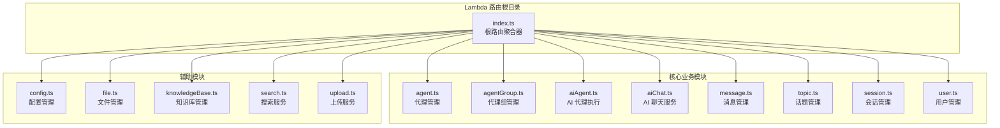
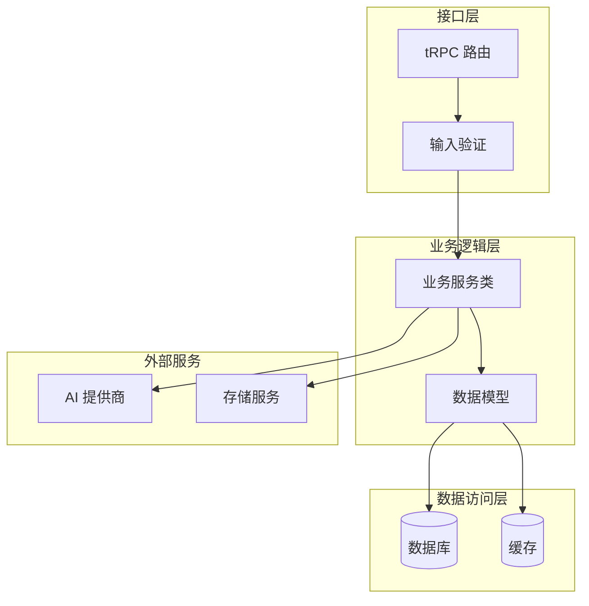
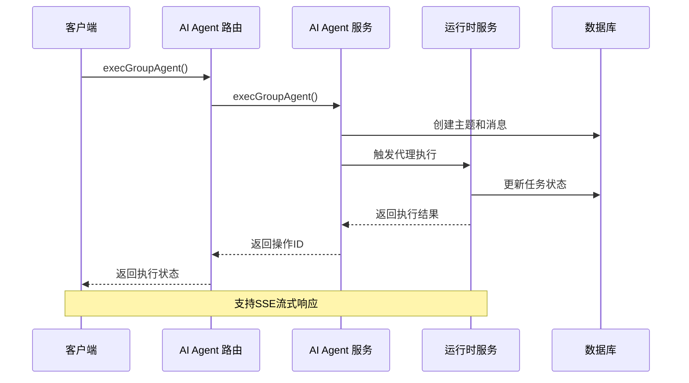
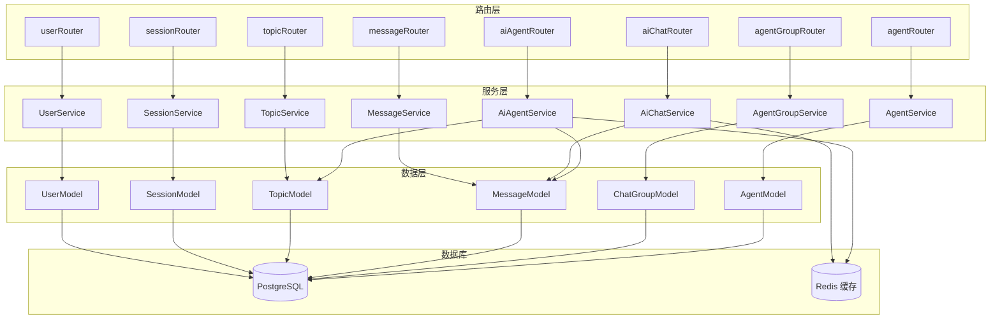

# Lambda 路由模块

<cite>
**本文档引用的文件**
- [src/server/routers/lambda/index.ts](file://src/server/routers/lambda/index.ts)
- [src/server/routers/lambda/agent.ts](file://src/server/routers/lambda/agent.ts)
- [src/server/routers/lambda/agentGroup.ts](file://src/server/routers/lambda/agentGroup.ts)
- [src/server/routers/lambda/aiAgent.ts](file://src/server/routers/lambda/aiAgent.ts)
- [src/server/routers/lambda/aiChat.ts](file://src/server/routers/lambda/aiChat.ts)
- [src/server/routers/lambda/message.ts](file://src/server/routers/lambda/message.ts)
- [src/server/routers/lambda/topic.ts](file://src/server/routers/lambda/topic.ts)
- [src/server/routers/lambda/session.ts](file://src/server/routers/lambda/session.ts)
- [src/server/routers/lambda/user.ts](file://src/server/routers/lambda/user.ts)
</cite>

## 目录

1. [简介](#简介)
2. [项目结构](#项目结构)
3. [核心组件](#核心组件)
4. [架构概览](#架构概览)
5. [详细组件分析](#详细组件分析)
6. [依赖关系分析](#依赖关系分析)
7. [性能考虑](#性能考虑)
8. [故障排除指南](#故障排除指南)
9. [结论](#结论)

## 简介

Lambda 路由模块是 LobeChat tRPC 后端的核心接口层，提供了完整的 AI 聊天和代理管理功能。该模块采用模块化设计，将不同的业务领域分离到独立的路由文件中，实现了高内聚、低耦合的架构。

本模块支持多种 AI 代理模式，包括单代理对话、群组代理协作、批量代理执行等高级特性。通过 tRPC 的强类型系统和自动代码生成，确保了前后端接口的一致性和安全性。

## 项目结构

Lambda 路由模块采用按功能域划分的组织方式，每个核心业务模块都有独立的路由文件：

**图表来源**

- [src/server/routers/lambda/index.ts](file://src/server/routers/lambda/index.ts#L56-L107)

**章节来源**

- [src/server/routers/lambda/index.ts](file://src/server/routers/lambda/index.ts#L1-L110)

## 核心组件

Lambda 路由模块包含以下核心组件：

### 认证中间件

所有路由都使用 `authedProcedure` 进行认证，确保只有已登录用户可以访问受保护的接口。

### 数据库中间件

`serverDatabase` 中间件提供统一的数据库连接管理，支持事务处理和连接池优化。

### 模型注入

每个路由在初始化时注入相应的数据模型和服务类，实现依赖注入和解耦。

**章节来源**

- [src/server/routers/lambda/agent.ts](file://src/server/routers/lambda/agent.ts#L17-L30)
- [src/server/routers/lambda/agentGroup.ts](file://src/server/routers/lambda/agentGroup.ts#L42-L54)
- [src/server/routers/lambda/aiAgent.ts](file://src/server/routers/lambda/aiAgent.ts#L235-L248)

## 架构概览

Lambda 路由模块采用分层架构设计，从上到下分为：

**图表来源**

- [src/server/routers/lambda/aiChat.ts](file://src/server/routers/lambda/aiChat.ts#L19-L32)
- [src/server/routers/lambda/aiAgent.ts](file://src/server/routers/lambda/aiAgent.ts#L235-L248)

## 详细组件分析

### 代理管理 (agent.ts)

代理管理模块提供了完整的代理生命周期管理功能：

#### 核心功能

- **代理创建**: 支持创建新代理并关联会话
- **代理复制**: 克隆现有代理及其配置
- **代理配置**: 更新代理设置和参数
- **知识库集成**: 管理代理与知识库的关联
- **文件管理**: 关联文件到代理

#### 主要接口

- `createAgent`: 创建新代理
- `duplicateAgent`: 复制代理
- `updateAgentConfig`: 更新代理配置
- `getKnowledgeBasesAndFiles`: 获取代理知识库和文件
- `queryAgents`: 查询可用代理

**章节来源**

- [src/server/routers/lambda/agent.ts](file://src/server/routers/lambda/agent.ts#L32-L370)

### 代理组管理 (agentGroup.ts)

代理组管理模块支持多代理协作场景：

#### 核心功能

- **群组创建**: 创建包含监督代理的群组
- **成员管理**: 添加 / 移除代理成员
- **批量操作**: 批量创建虚拟代理
- **群组复制**: 克隆整个群组配置

#### 主要接口

- `createGroup`: 创建群组
- `batchCreateAgentsInGroup`: 批量创建代理
- `addAgentsToGroup`: 添加代理到群组
- `removeAgentsFromGroup`: 从群组移除代理
- `duplicateGroup`: 复制群组

**章节来源**

- [src/server/routers/lambda/agentGroup.ts](file://src/server/routers/lambda/agentGroup.ts#L56-L326)

### AI 代理执行 (aiAgent.ts)

AI 代理执行模块是最复杂的组件，支持多种执行模式：

#### 执行模式

- **单代理执行**: `execAgent` - 执行单个代理
- **群组代理执行**: `execGroupAgent` - 执行监督代理
- **子代理任务**: `execSubAgentTask` - 执行子代理任务
- **批量执行**: `execAgents` - 并行执行多个代理

#### 高级特性

- **客户端任务执行**: 支持桌面客户端本地执行
- **任务状态管理**: 完整的任务生命周期跟踪
- **干预处理**: 支持人工干预和审批流程
- **流式响应**: 支持实时流式输出

**图表来源**

- [src/server/routers/lambda/aiAgent.ts](file://src/server/routers/lambda/aiAgent.ts#L630-L671)

**章节来源**

- [src/server/routers/lambda/aiAgent.ts](file://src/server/routers/lambda/aiAgent.ts#L250-L800)

### AI 聊天服务 (aiChat.ts)

AI 聊天服务模块处理聊天消息的完整生命周期：

#### 核心流程

1. **上下文解析**: 解析会话、主题、线程上下文
2. **消息创建**: 创建用户消息和助手占位符
3. **AI 生成**: 调用 AI 模型生成回复
4. **状态同步**: 更新消息状态和元数据

#### 主要接口

- `sendMessageInServer`: 发送消息到服务器
- `outputJSON`: 结构化输出 JSON

**章节来源**

- [src/server/routers/lambda/aiChat.ts](file://src/server/routers/lambda/aiChat.ts#L34-L190)

### 消息管理 (message.ts)

消息管理模块提供全面的消息操作功能：

#### 核心功能

- **消息 CRUD**: 基本的消息创建、读取、更新、删除
- **压缩功能**: 消息历史压缩和摘要生成
- **插件集成**: 支持工具调用和插件消息
- **翻译功能**: 内置翻译支持

#### 高级特性

- **批量操作**: 支持批量删除和更新
- **搜索功能**: 关键词搜索和过滤
- **文件关联**: 支持文件附件

**章节来源**

- [src/server/routers/lambda/message.ts](file://src/server/routers/lambda/message.ts#L34-L495)

### 话题管理 (topic.ts)

话题管理模块负责对话主题的生命周期管理：

#### 核心功能

- **主题创建**: 创建新的对话主题
- **主题查询**: 分页查询和搜索
- **主题克隆**: 复制现有主题
- **分享功能**: 主题分享和权限管理

#### 主要接口

- `createTopic`: 创建主题
- `getTopics`: 获取主题列表
- `cloneTopic`: 克隆主题
- `enableSharing`: 启用分享
- `disableSharing`: 禁用分享

**章节来源**

- [src/server/routers/lambda/topic.ts](file://src/server/routers/lambda/topic.ts#L40-L528)

### 会话管理 (session.ts)

会话管理模块处理用户会话的创建和维护：

#### 核心功能

- **会话创建**: 创建新的聊天会话
- **会话查询**: 获取会话列表和详情
- **会话克隆**: 复制现有会话
- **配置管理**: 会话配置更新

#### 主要接口

- `createSession`: 创建会话
- `getSessions`: 获取会话列表
- `cloneSession`: 克隆会话
- `updateSession`: 更新会话
- `updateSessionChatConfig`: 更新聊天配置

**章节来源**

- [src/server/routers/lambda/session.ts](file://src/server/routers/lambda/session.ts#L26-L197)

### 用户管理 (user.ts)

用户管理模块提供用户信息和设置的管理功能：

#### 核心功能

- **用户状态**: 获取用户初始化状态
- **设置管理**: 用户偏好和设置更新
- **头像管理**: 用户头像上传和更新
- **账户安全**: 用户名验证和冲突检查

#### 主要接口

- `getUserState`: 获取用户状态
- `updatePreference`: 更新用户偏好
- `updateSettings`: 更新用户设置
- `updateAvatar`: 更新用户头像
- `updateUsername`: 更新用户名

**章节来源**

- [src/server/routers/lambda/user.ts](file://src/server/routers/lambda/user.ts#L47-L230)

## 依赖关系分析

Lambda 路由模块的依赖关系呈现清晰的层次结构：

**图表来源**

- [src/server/routers/lambda/agent.ts](file://src/server/routers/lambda/agent.ts#L17-L30)
- [src/server/routers/lambda/aiAgent.ts](file://src/server/routers/lambda/aiAgent.ts#L235-L248)

**章节来源**

- [src/server/routers/lambda/index.ts](file://src/server/routers/lambda/index.ts#L11-L55)

## 性能考虑

### 连接池优化

- 使用 `serverDatabase` 中间件管理数据库连接
- 支持连接复用和自动回收
- 配置合理的连接池大小

### 查询优化

- 批量操作支持：`batchCreate`、`batchDelete` 等
- 条件查询优化：使用索引字段进行过滤
- 分页查询：避免一次性加载大量数据

### 缓存策略

- Redis 缓存运行时状态
- 智能缓存失效机制
- 缓存预热和降级策略

### 异步处理

- 任务队列支持长时间运行的操作
- 流式响应处理大体积数据
- 并发控制和资源限制

## 故障排除指南

### 常见错误类型

#### 认证相关错误

- `UNAUTHORIZED`: 未认证用户访问受保护接口
- `FORBIDDEN`: 权限不足访问特定资源

#### 数据验证错误

- `BAD_REQUEST`: 请求参数格式不正确
- `CONFLICT`: 资源冲突（如用户名已被占用）

#### 业务逻辑错误

- `NOT_FOUND`: 请求的资源不存在
- `INTERNAL_SERVER_ERROR`: 服务器内部错误

### 调试建议

1. **启用调试日志**: 在开发环境中启用 debug 日志
2. **检查数据库连接**: 确保数据库连接正常
3. **验证输入参数**: 使用 Zod 验证器检查请求参数
4. **监控性能指标**: 关注慢查询和高延迟操作

**章节来源**

- [src/server/routers/lambda/user.ts](file://src/server/routers/lambda/user.ts#L219-L226)

## 结论

Lambda 路由模块通过模块化设计和清晰的分层架构，为 LobeChat 提供了强大而灵活的后端接口层。该模块不仅支持基本的 CRUD 操作，还提供了高级的 AI 代理执行、群组协作、批量处理等企业级功能。

模块的设计充分考虑了可扩展性、性能和安全性，通过 tRPC 的强类型系统确保了前后端接口的一致性。同时，完善的错误处理和监控机制保证了系统的稳定运行。

未来可以进一步优化的方向包括：

- 增加更多的缓存策略
- 实现更细粒度的权限控制
- 扩展异步任务处理能力
- 增强监控和可观测性
