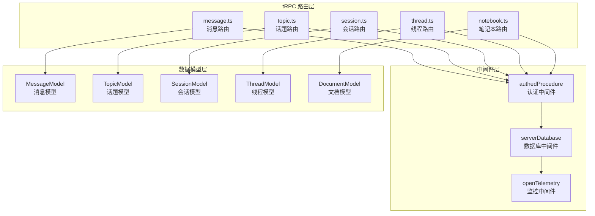
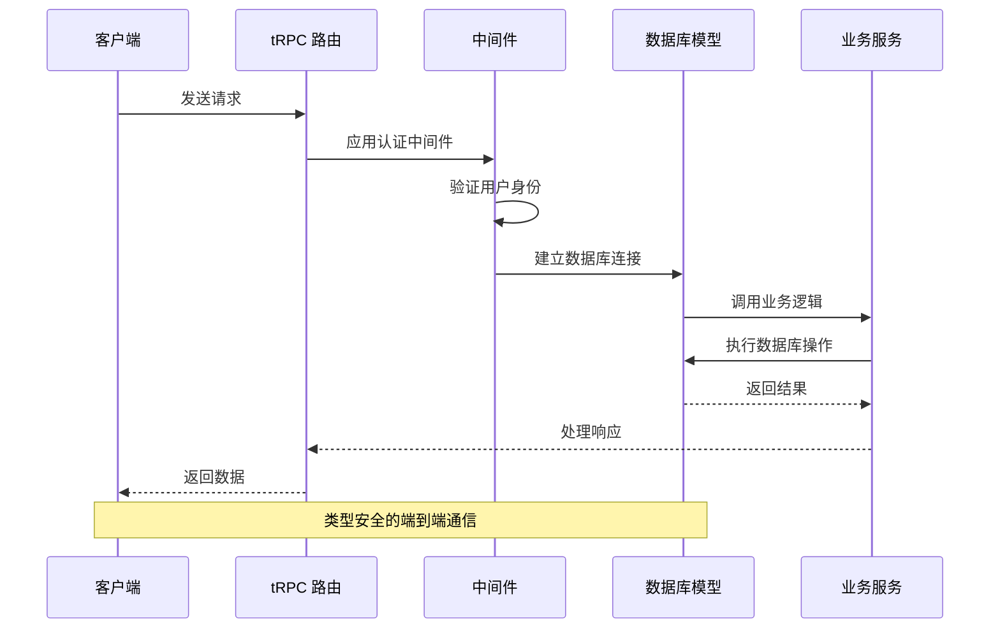
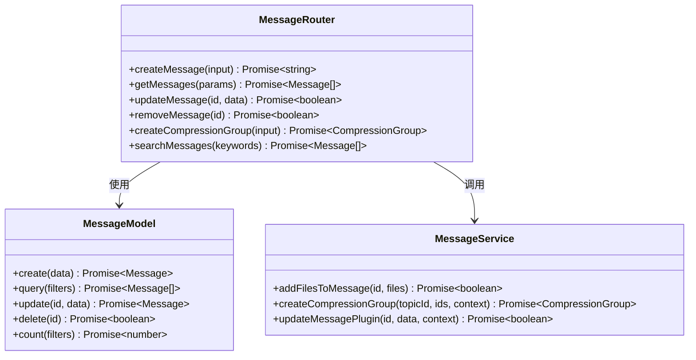
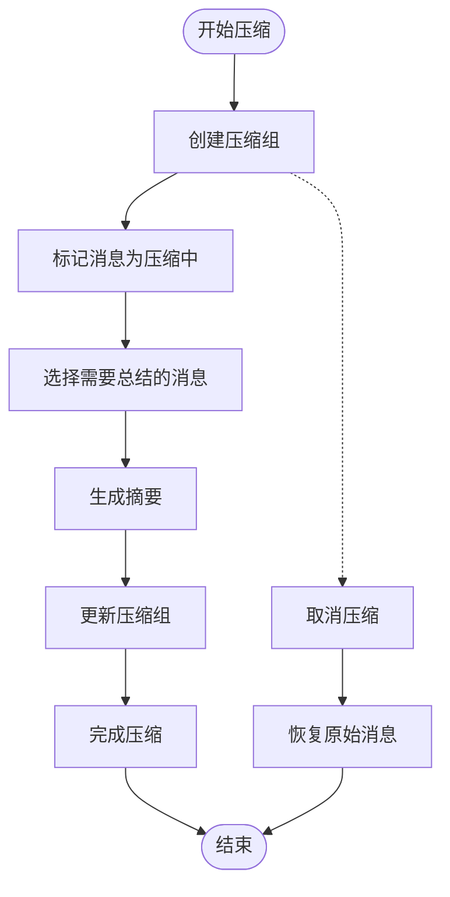
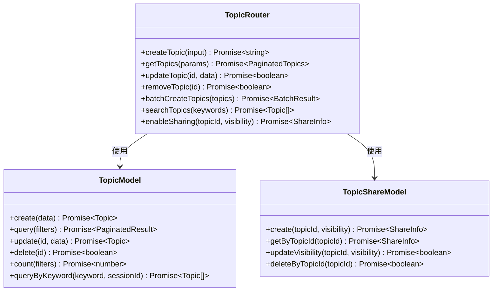
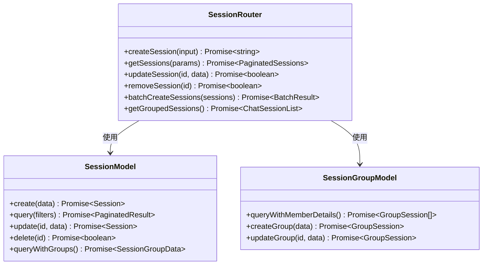
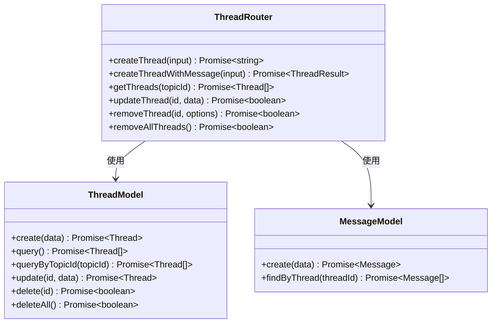
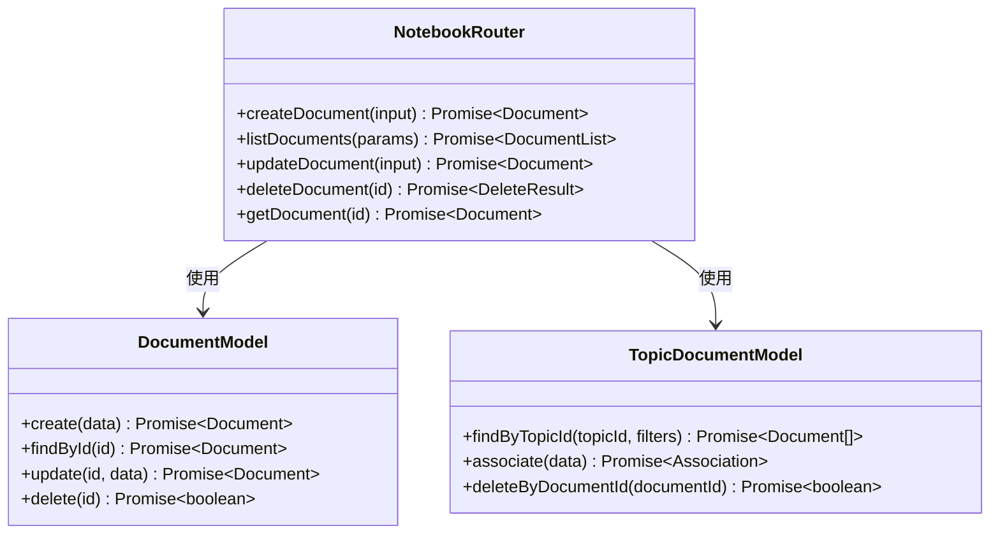
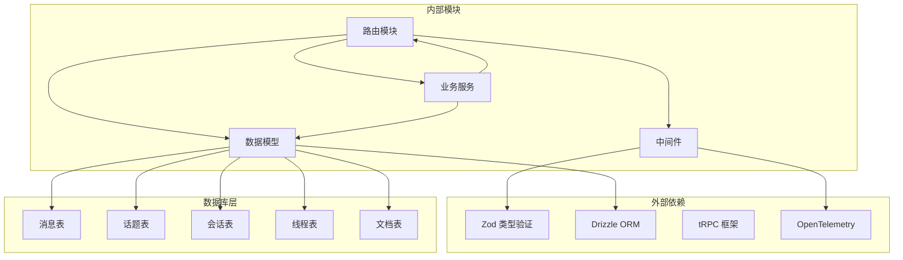

# 内容管理路由模块

<cite>
**本文档引用的文件**
- [message.ts](file://src/server/routers/lambda/message.ts)
- [topic.ts](file://src/server/routers/lambda/topic.ts)
- [session.ts](file://src/server/routers/lambda/session.ts)
- [thread.ts](file://src/server/routers/lambda/thread.ts)
- [notebook.ts](file://src/server/routers/lambda/notebook.ts)
- [thread.ts](file://packages/types/src/topic/thread.ts)
- [index.ts](file://src/libs/trpc/lambda/index.ts)
- [serverDatabase.ts](file://src/libs/trpc/lambda/middleware/serverDatabase.ts)
- [index.ts](file://src/services/thread/index.ts)
</cite>

## 目录

1. [简介](#简介)
2. [项目结构](#项目结构)
3. [核心组件](#核心组件)
4. [架构概览](#架构概览)
5. [详细组件分析](#详细组件分析)
6. [依赖关系分析](#依赖关系分析)
7. [性能考虑](#性能考虑)
8. [故障排除指南](#故障排除指南)
9. [结论](#结论)

## 简介

内容管理路由模块是基于 tRPC 的后端服务，专门用于管理聊天应用中的核心内容实体。该模块提供了完整的内容生命周期管理功能，包括消息、话题、会话、线程和笔记本等实体的增删改查操作。

本模块采用 Lambda 函数部署模式，通过 tRPC 实现类型安全的客户端 - 服务器通信。每个路由都经过严格的权限验证和数据验证，确保系统的安全性和可靠性。

## 项目结构

内容管理路由模块位于 `src/server/routers/lambda/` 目录下，采用按功能模块划分的组织方式：

**图表来源**

- [message.ts](file://src/server/routers/lambda/message.ts#L1-L495)
- [topic.ts](file://src/server/routers/lambda/topic.ts#L1-L528)
- [session.ts](file://src/server/routers/lambda/session.ts#L1-L197)
- [thread.ts](file://src/server/routers/lambda/thread.ts#L1-L87)
- [notebook.ts](file://src/server/routers/lambda/notebook.ts#L1-L143)

**章节来源**

- [message.ts](file://src/server/routers/lambda/message.ts#L1-L495)
- [topic.ts](file://src/server/routers/lambda/topic.ts#L1-L528)
- [session.ts](file://src/server/routers/lambda/session.ts#L1-L197)
- [thread.ts](file://src/server/routers/lambda/thread.ts#L1-L87)
- [notebook.ts](file://src/server/routers/lambda/notebook.ts#L1-L143)

## 核心组件

### 认证和授权机制

系统采用多层认证机制确保安全性：

1. **OpenTelemetry 中间件**：提供分布式追踪和性能监控
2. **OIDC 认证中间件**：支持 OpenID Connect 协议的身份验证
3. **用户认证中间件**：验证用户会话的有效性

### 数据库连接管理

通过 `serverDatabase` 中间件统一管理数据库连接，支持：

- 自动连接池管理
- 事务支持
- 连接超时处理

### 类型安全的数据验证

所有输入参数都经过严格的 Zod 验证，确保数据的完整性和一致性。

**章节来源**

- [index.ts](file://src/libs/trpc/lambda/index.ts#L1-L38)
- [serverDatabase.ts](file://src/libs/trpc/lambda/middleware/serverDatabase.ts#L1-L12)

## 架构概览

**图表来源**

- [message.ts](file://src/server/routers/lambda/message.ts#L21-L32)
- [topic.ts](file://src/server/routers/lambda/topic.ts#L27-L38)
- [session.ts](file://src/server/routers/lambda/session.ts#L15-L24)

## 详细组件分析

### 消息管理路由 (messageRouter)

消息路由提供了完整的消息生命周期管理功能：

#### 核心功能

1. **消息创建和查询**
   - 支持单个消息创建
   - 批量消息查询
   - 条件筛选和排序

2. **消息更新操作**
   - 内容更新
   - 元数据管理
   - 插件状态更新
   - 翻译和 TTS 处理

3. **压缩和归档**
   - 消息压缩组管理
   - 历史消息归档
   - 统计信息收集

**图表来源**

- [message.ts](file://src/server/routers/lambda/message.ts#L34-L495)

#### 消息压缩流程

**图表来源**

- [message.ts](file://src/server/routers/lambda/message.ts#L112-L131)
- [message.ts](file://src/server/routers/lambda/message.ts#L152-L167)

**章节来源**

- [message.ts](file://src/server/routers/lambda/message.ts#L1-L495)

### 话题管理路由 (topicRouter)

话题路由负责管理用户的对话主题：

#### 核心功能

1. **话题创建和管理**
   - 单个话题创建
   - 批量话题操作
   - 话题克隆和复制

2. **搜索和过滤**
   - 关键词搜索
   - 条件过滤
   - 分页查询

3. **分享和协作**
   - 话题分享功能
   - 访问权限控制
   - 共享链接管理

**图表来源**

- [topic.ts](file://src/server/routers/lambda/topic.ts#L40-L528)

**章节来源**

- [topic.ts](file://src/server/routers/lambda/topic.ts#L1-L528)

### 会话管理路由 (sessionRouter)

会话路由管理用户的不同聊天会话：

#### 核心功能

1. **会话生命周期管理**
   - 会话创建和配置
   - 会话分组管理
   - 会话克隆和复制

2. **配置管理**
   - 聊天配置更新
   - 代理配置管理
   - 元数据维护

3. **分组和排序**
   - 会话分组查询
   - 最新会话获取
   - 排序和筛选

**图表来源**

- [session.ts](file://src/server/routers/lambda/session.ts#L26-L197)

**章节来源**

- [session.ts](file://src/server/routers/lambda/session.ts#L1-L197)

### 线程管理路由 (threadRouter)

线程路由管理复杂的对话流程：

#### 核心功能

1. **线程创建和关联**
   - 独立线程创建
   - 基于消息的线程创建
   - 父子线程关系管理

2. **线程状态管理**
   - 状态跟踪和更新
   - 元数据管理
   - 执行统计信息

3. **批量操作**
   - 线程删除
   - 线程查询
   - 批量清理

**图表来源**

- [thread.ts](file://src/server/routers/lambda/thread.ts#L22-L85)

**章节来源**

- [thread.ts](file://src/server/routers/lambda/thread.ts#L1-L87)
- [thread.ts](file://packages/types/src/topic/thread.ts#L1-L119)

### 笔记本管理路由 (notebookRouter)

笔记本路由管理用户的知识文档：

#### 核心功能

1. **文档创建和管理**
   - 多种文档类型支持
   - 文档元数据管理
   - 内容长度统计

2. **主题关联**
   - 文档与主题关联
   - 关联关系管理
   - 查询优化

3. **内容操作**
   - 文档内容更新
   - 追加模式支持
   - 删除和清理

**图表来源**

- [notebook.ts](file://src/server/routers/lambda/notebook.ts#L20-L143)

**章节来源**

- [notebook.ts](file://src/server/routers/lambda/notebook.ts#L1-L143)

## 依赖关系分析

**图表来源**

- [message.ts](file://src/server/routers/lambda/message.ts#L1-L20)
- [topic.ts](file://src/server/routers/lambda/topic.ts#L1-L25)
- [session.ts](file://src/server/routers/lambda/session.ts#L1-L13)

**章节来源**

- [message.ts](file://src/server/routers/lambda/message.ts#L1-L495)
- [topic.ts](file://src/server/routers/lambda/topic.ts#L1-L528)
- [session.ts](file://src/server/routers/lambda/session.ts#L1-L197)
- [thread.ts](file://src/server/routers/lambda/thread.ts#L1-L87)
- [notebook.ts](file://src/server/routers/lambda/notebook.ts#L1-L143)

## 性能考虑

### 数据库优化策略

1. **索引优化**
   - 为常用查询字段建立索引
   - 复合索引优化复杂查询
   - 避免全表扫描

2. **查询优化**
   - 使用分页查询避免大数据集
   - 条件筛选减少数据传输
   - 结果集缓存机制

3. **连接池管理**
   - 合理配置连接池大小
   - 连接复用减少开销
   - 超时处理防止资源泄漏

### 缓存策略

1. **响应缓存**
   - 静态数据缓存
   - 查询结果缓存
   - 配置数据缓存

2. **计算优化**
   - 批量操作减少往返
   - 异步处理耗时任务
   - 流式处理大文件

### 监控和追踪

1. **性能监控**
   - 请求延迟追踪
   - 错误率监控
   - 资源使用监控

2. **日志记录**
   - 关键操作日志
   - 性能指标收集
   - 错误堆栈追踪

## 故障排除指南

### 常见问题和解决方案

1. **认证失败**
   - 检查用户会话有效性
   - 验证 OIDC 配置
   - 确认用户权限

2. **数据库连接问题**
   - 检查连接池配置
   - 验证数据库状态
   - 查看连接超时设置

3. **数据验证错误**
   - 检查输入参数格式
   - 验证数据完整性
   - 查看约束条件

### 调试工具

1. **开发环境调试**
   - 启用详细日志
   - 使用调试器
   - 模拟异常情况

2. **生产环境监控**
   - 设置告警阈值
   - 监控关键指标
   - 快速响应机制

**章节来源**

- [index.ts](file://src/libs/trpc/lambda/index.ts#L1-L38)
- [serverDatabase.ts](file://src/libs/trpc/lambda/middleware/serverDatabase.ts#L1-L12)

## 结论

内容管理路由模块提供了完整、类型安全且高性能的内容管理解决方案。通过清晰的模块化设计和严格的类型验证，确保了系统的可靠性和可维护性。

该模块的主要优势包括：

- **类型安全**：全程类型检查确保数据完整性
- **模块化设计**：清晰的功能分离便于维护
- **性能优化**：多种优化策略提升系统性能
- **安全保障**：多层认证机制保护系统安全
- **扩展性强**：良好的架构支持功能扩展

建议在实际使用中重点关注：

- 数据库索引优化
- 缓存策略实施
- 监控告警配置
- 性能基准测试
- 安全审计定期执行
