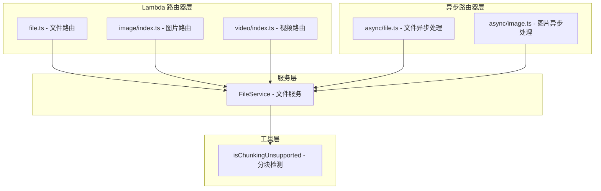
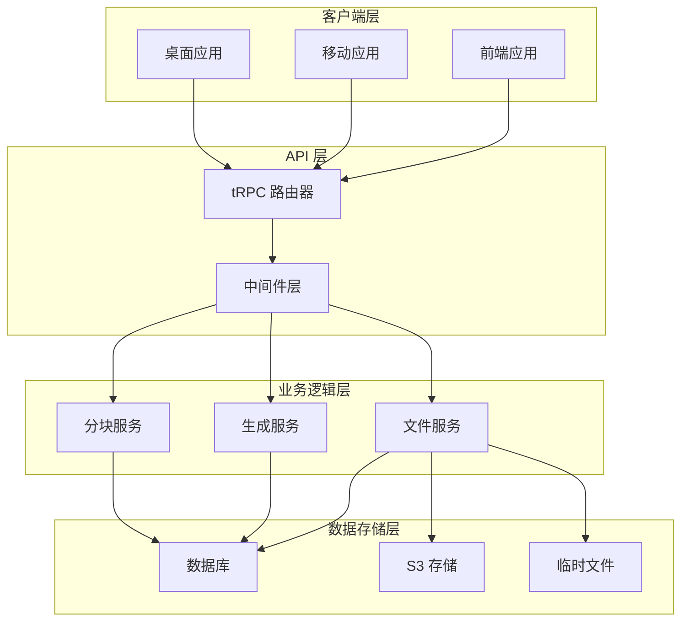
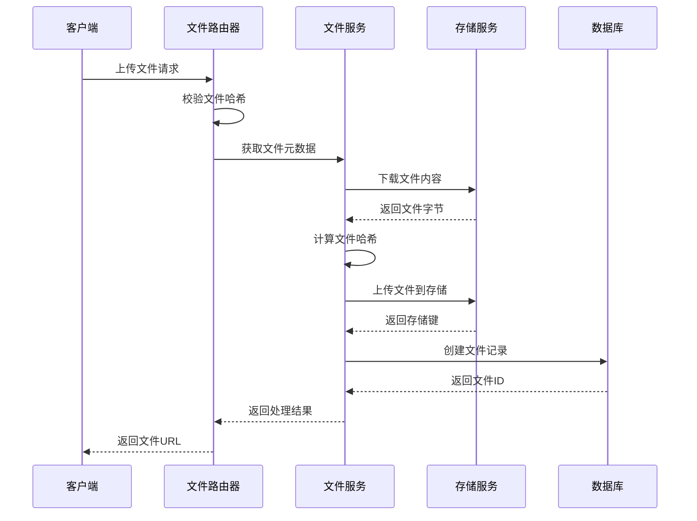
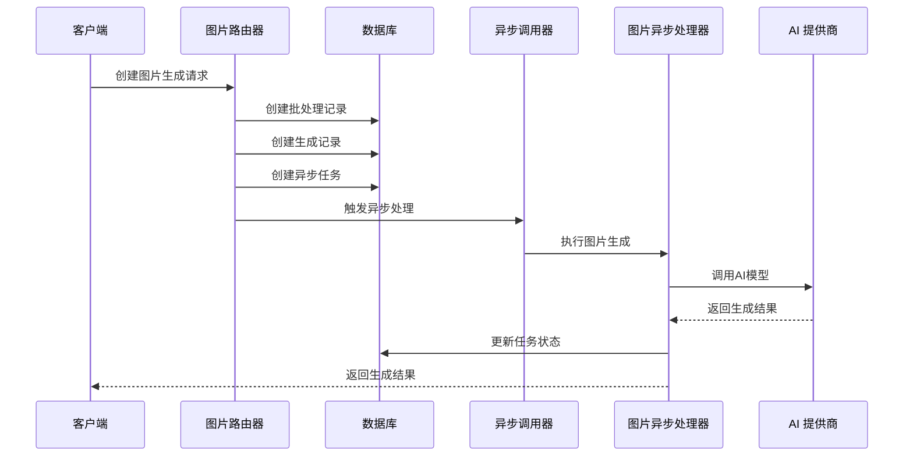
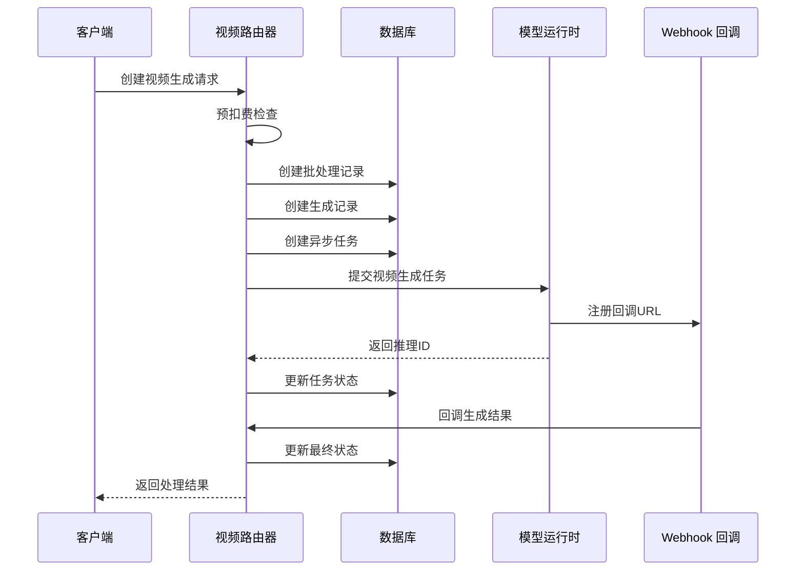
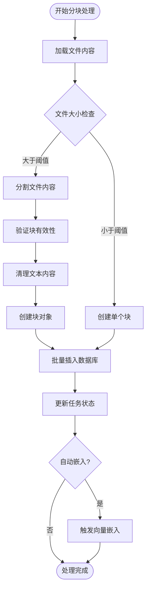

# 媒体处理路由模块

<cite>
**本文档引用的文件**
- [src/server/routers/lambda/file.ts](file://src/server/routers/lambda/file.ts)
- [src/server/routers/lambda/image/index.ts](file://src/server/routers/lambda/image/index.ts)
- [src/server/routers/lambda/video/index.ts](file://src/server/routers/lambda/video/index.ts)
- [src/server/routers/async/file.ts](file://src/server/routers/async/file.ts)
- [src/server/routers/async/image.ts](file://src/server/routers/async/image.ts)
- [src/server/services/file/index.ts](file://src/server/services/file/index.ts)
- [packages/utils/src/isChunkingUnsupported.ts](file://packages/utils/src/isChunkingUnsupported.ts)
- [src/server/routers/lambda/__tests__/file.test.ts](file://src/server/routers/lambda/__tests__/file.test.ts)
</cite>

## 目录

1. [简介](#简介)
2. [项目结构](#项目结构)
3. [核心组件](#核心组件)
4. [架构概览](#架构概览)
5. [详细组件分析](#详细组件分析)
6. [依赖关系分析](#依赖关系分析)
7. [性能考虑](#性能考虑)
8. [故障排除指南](#故障排除指南)
9. [结论](#结论)

## 简介

媒体处理路由模块是基于 tRPC 构建的完整媒体处理系统，涵盖了文件上传、图片生成、视频生成、分块处理等核心功能。该模块采用 Lambda 路由器处理即时请求，配合异步路由器处理后台任务，实现了高效的媒体处理工作流。

系统支持多种媒体格式处理，包括图片、视频、音频和文档文件，并提供了完整的安全检查、进度跟踪和缓存策略。通过分层架构设计，模块能够处理从简单文件上传到复杂的 AI 驱动媒体生成等各种场景。

## 项目结构

媒体处理路由模块采用分层架构设计，主要包含以下核心目录：



**图表来源**

- [src/server/routers/lambda/file.ts](file://src/server/routers/lambda/file.ts#L1-L443)
- [src/server/routers/lambda/image/index.ts](file://src/server/routers/lambda/image/index.ts#L1-L309)
- [src/server/routers/lambda/video/index.ts](file://src/server/routers/lambda/video/index.ts#L1-L280)

**章节来源**

- [src/server/routers/lambda/file.ts](file://src/server/routers/lambda/file.ts#L1-L443)
- [src/server/routers/lambda/image/index.ts](file://src/server/routers/lambda/image/index.ts#L1-L309)
- [src/server/routers/lambda/video/index.ts](file://src/server/routers/lambda/video/index.ts#L1-L280)

## 核心组件

### 文件处理路由器 (fileRouter)

文件处理路由器提供完整的文件生命周期管理功能：

- **文件查询**: 支持按条件查询文件列表，包含分页和过滤功能
- **文件元数据**: 提供文件详细信息查询，包括分块状态和嵌入状态
- **文件操作**: 支持单个文件删除、批量删除和文件更新
- **知识库集成**: 提供与知识库的集成查询功能

### 图片处理路由器 (imageRouter)

图片处理路由器专注于 AI 图片生成任务：

- **批量生成**: 支持一次生成多张图片
- **参数配置**: 完整的图片生成参数支持，包括尺寸、步数、CFG 比例等
- **引用图片**: 支持使用现有图片作为参考进行风格转换
- **异步处理**: 通过异步任务队列处理长时间运行的生成任务

### 视频处理路由器 (videoRouter)

视频处理路由器提供 AI 视频生成能力：

- **视频生成**: 支持基于文本描述生成视频
- **帧处理**: 支持首帧和尾帧图片作为视频起始和结束画面
- **预付费机制**: 实现预扣费防止并发滥用
- **回调通知**: 通过 Webhook 机制提供生成进度和结果通知

### 异步处理路由器

异步处理路由器负责后台任务的执行和监控：

- **文件分块**: 将大文件分割成可管理的块
- **向量嵌入**: 为文件内容生成向量表示用于检索
- **进度跟踪**: 提供详细的处理进度和状态监控

**章节来源**

- [src/server/routers/lambda/file.ts](file://src/server/routers/lambda/file.ts#L41-L440)
- [src/server/routers/lambda/image/index.ts](file://src/server/routers/lambda/image/index.ts#L65-L305)
- [src/server/routers/lambda/video/index.ts](file://src/server/routers/lambda/video/index.ts#L66-L270)

## 架构概览

媒体处理系统采用分层架构，确保了良好的可扩展性和维护性：



**图表来源**

- [src/server/routers/lambda/file.ts](file://src/server/routers/lambda/file.ts#L26-L39)
- [src/server/routers/lambda/image/index.ts](file://src/server/routers/lambda/image/index.ts#L25-L44)
- [src/server/routers/lambda/video/index.ts](file://src/server/routers/lambda/video/index.ts#L32-L44)

系统的核心特点包括：

1. **分层设计**: 清晰的职责分离，便于维护和测试
2. **异步处理**: 复杂任务通过异步队列处理，提升用户体验
3. **安全机制**: 多层安全检查和访问控制
4. **缓存策略**: 智能缓存减少重复计算和存储成本

## 详细组件分析

### 文件上传处理流程

文件上传处理流程展示了完整的文件处理管道：



**图表来源**

- [src/server/routers/lambda/file.ts](file://src/server/routers/lambda/file.ts#L49-L107)
- [src/server/services/file/index.ts](file://src/server/services/file/index.ts#L233-L279)

### 图片生成处理流程

图片生成处理流程体现了异步任务的完整生命周期：



**图表来源**

- [src/server/routers/lambda/image/index.ts](file://src/server/routers/lambda/image/index.ts#L162-L233)
- [src/server/routers/async/image.ts](file://src/server/routers/async/image.ts#L196-L378)

### 视频生成处理流程

视频生成处理流程展示了复杂的异步处理机制：



**图表来源**

- [src/server/routers/lambda/video/index.ts](file://src/server/routers/lambda/video/index.ts#L145-L201)
- [src/server/routers/lambda/video/index.ts](file://src/server/routers/lambda/video/index.ts#L205-L256)

### 分块处理算法

分块处理算法展示了如何将大文件分割成可管理的块：



**图表来源**

- [src/server/routers/async/file.ts](file://src/server/routers/async/file.ts#L198-L253)

**章节来源**

- [src/server/routers/async/file.ts](file://src/server/routers/async/file.ts#L41-L273)
- [src/server/services/file/index.ts](file://src/server/services/file/index.ts#L233-L330)

## 依赖关系分析

媒体处理模块的依赖关系展现了清晰的层次结构：

```mermaid
graph TB
subgraph "外部依赖"
A[@trpc/server - tRPC框架]
B[zod - 数据验证]
C[drizzle-orm - ORM]
D[js-sha256 - 哈希计算]
end
subgraph "内部模块"
E[business - 业务逻辑]
F[database - 数据库模型]
G[services - 服务层]
H[modules - 功能模块]
I[types - 类型定义]
end
subgraph "工具函数"
J[inferContentType - 内容类型推断]
K[nanoid/uuid - ID生成]
L[sanitizeUTF8 - 文本清理]
end
A --> E
B --> F
C --> G
D --> H
E --> I
F --> J
G --> K
H --> L
```

**图表来源**

- [src/server/routers/lambda/file.ts](file://src/server/routers/lambda/file.ts#L1-L18)
- [src/server/routers/lambda/image/index.ts](file://src/server/routers/lambda/image/index.ts#L1-L21)
- [src/server/routers/lambda/video/index.ts](file://src/server/routers/lambda/video/index.ts#L1-L28)

### 核心依赖关系

1. **tRPC 集成**: 使用 @trpc/server 和 zod 进行接口定义和数据验证
2. **数据库访问**: 通过 drizzle-orm 进行数据库操作
3. **业务逻辑**: 依赖 business 模块处理复杂的业务规则
4. **存储服务**: 集成 S3 存储和其他文件存储解决方案
5. **AI 模型**: 通过 ModelRuntime 模块集成各种 AI 生成模型

**章节来源**

- [src/server/routers/lambda/file.ts](file://src/server/routers/lambda/file.ts#L1-L39)
- [src/server/routers/lambda/image/index.ts](file://src/server/routers/lambda/image/index.ts#L1-L44)
- [src/server/routers/lambda/video/index.ts](file://src/server/routers/lambda/video/index.ts#L1-L44)

## 性能考虑

媒体处理模块在设计时充分考虑了性能优化：

### 缓存策略

- **文件哈希缓存**: 通过文件哈希避免重复上传相同文件
- **元数据缓存**: 缓存文件元数据减少网络请求
- **任务状态缓存**: 缓存异步任务状态避免频繁查询

### 并发控制

- **批量处理**: 支持批量文件处理提高效率
- **并发限制**: 通过配置控制并发数量防止资源耗尽
- **超时机制**: 实现任务超时保护避免长时间占用资源

### 存储优化

- **智能分块**: 大文件自动分块处理
- **压缩存储**: 支持文件压缩减少存储空间
- **CDN 集成**: 通过 CDN 提升文件访问速度

## 故障排除指南

### 常见问题及解决方案

**文件上传失败**

- 检查文件大小限制和格式支持
- 验证存储权限和配额
- 确认网络连接稳定性

**图片生成异常**

- 检查 AI 模型配置和 API 密钥
- 验证输入参数的有效性
- 查看异步任务日志获取详细错误信息

**视频生成超时**

- 检查预付费机制是否正常
- 验证 Webhook 回调配置
- 监控模型提供商的响应时间

### 错误处理策略

系统实现了多层次的错误处理机制：

1. **输入验证**: 使用 zod 进行严格的输入验证
2. **异常捕获**: 全面的 try-catch 机制
3. **状态回滚**: 失败时自动回滚数据库事务
4. **错误分类**: 将错误分类为可恢复和不可恢复类型

**章节来源**

- [src/server/routers/lambda/file.ts](file://src/server/routers/lambda/file.ts#L87-L89)
- [src/server/routers/async/image.ts](file://src/server/routers/async/image.ts#L391-L409)

## 结论

媒体处理路由模块是一个功能完整、架构清晰的 tRPC 媒体处理系统。通过合理的分层设计和异步处理机制，系统能够高效地处理各种媒体文件，从简单的文件上传到复杂的 AI 驱动媒体生成。

模块的主要优势包括：

- **完整的功能覆盖**: 涵盖文件处理、图片生成、视频生成等核心功能
- **优秀的架构设计**: 清晰的分层结构便于维护和扩展
- **强大的异步处理能力**: 支持长时间运行的任务处理
- **完善的安全机制**: 多层安全检查保护系统安全
- **灵活的配置选项**: 支持各种自定义配置满足不同需求

未来可以考虑的功能增强包括：更丰富的媒体格式支持、更智能的缓存策略、更完善的监控和告警机制等。
