# 工具服务路由模块

<cite>
**本文档引用的文件**
- [src/server/routers/lambda/index.ts](file://src/server/routers/lambda/index.ts)
- [src/server/routers/lambda/exporter.ts](file://src/server/routers/lambda/exporter.ts)
- [src/server/routers/lambda/importer.ts](file://src/server/routers/lambda/importer.ts)
- [src/server/routers/lambda/generation.ts](file://src/server/routers/lambda/generation.ts)
- [src/server/routers/lambda/generationBatch.ts](file://src/server/routers/lambda/generationBatch.ts)
- [src/server/routers/lambda/generationTopic.ts](file://src/server/routers/lambda/generationTopic.ts)
- [src/libs/trpc/lambda/index.ts](file://src/libs/trpc/lambda/index.ts)
- [src/services/export/index.ts](file://src/services/export/index.ts)
- [src/server/routers/lambda/__tests__/importer.test.ts](file://src/server/routers/lambda/__tests__/importer.test.ts)
</cite>

## 目录
1. [简介](#简介)
2. [项目结构](#项目结构)
3. [核心组件](#核心组件)
4. [架构概览](#架构概览)
5. [详细组件分析](#详细组件分析)
6. [依赖关系分析](#依赖关系分析)
7. [性能考虑](#性能考虑)
8. [故障排除指南](#故障排除指南)
9. [结论](#结论)

## 简介

工具服务路由模块是 LobeHub 项目中基于 tRPC 构建的核心后端服务层，专门负责处理各种工具化操作和数据处理任务。该模块提供了完整的配置管理、数据导出导入、内容生成等工具服务接口，支持批量处理、异步任务管理和模板引擎等功能。

本模块采用分层架构设计，通过 tRPC 路由器将业务逻辑封装为类型安全的 API 接口，支持客户端和服务端的双向通信。模块涵盖了从基础的数据导出导入到高级的内容生成和批量处理的完整工具链。

## 项目结构

工具服务路由模块位于 `src/server/routers/lambda/` 目录下，采用按功能分组的组织方式：

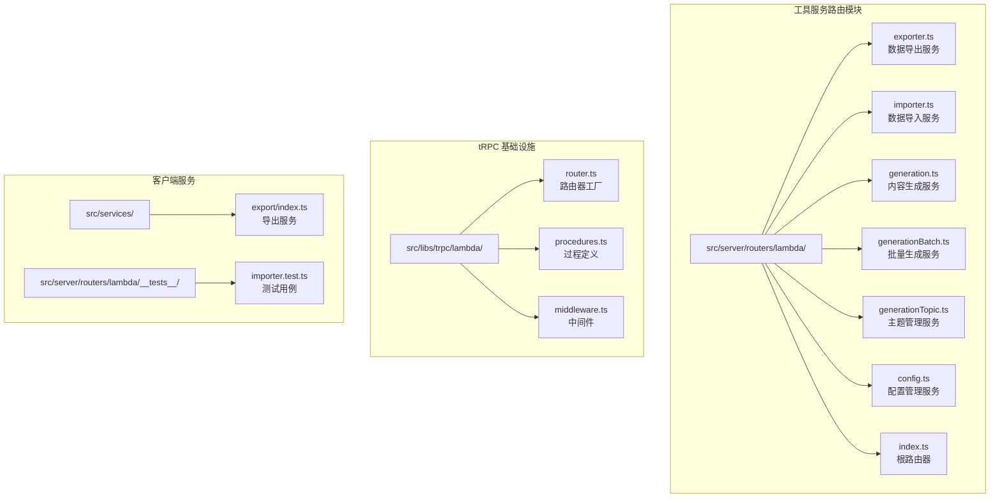

**图表来源**
- [src/server/routers/lambda/index.ts](file://src/server/routers/lambda/index.ts#L1-L110)
- [src/libs/trpc/lambda/index.ts](file://src/libs/trpc/lambda/index.ts#L1-L38)

**章节来源**
- [src/server/routers/lambda/index.ts](file://src/server/routers/lambda/index.ts#L1-L110)
- [src/libs/trpc/lambda/index.ts](file://src/libs/trpc/lambda/index.ts#L1-L38)

## 核心组件

工具服务路由模块包含以下核心组件：

### 1. 根路由器 (Lambda Router)
作为整个工具服务的入口点，根路由器聚合了所有子路由并提供统一的访问接口。

### 2. 数据导出服务 (Exporter Router)
提供数据导出功能，支持标准格式和 PDF 格式的导出。

### 3. 数据导入服务 (Importer Router)
处理数据导入操作，支持文件上传和直接数据导入两种方式。

### 4. 内容生成服务 (Generation Router)
管理单个内容生成任务的状态查询和生命周期管理。

### 5. 批量生成服务 (Generation Batch Router)
处理批量内容生成任务，支持图片和视频类型的批量处理。

### 6. 主题管理服务 (Generation Topic Router)
管理内容生成的主题分类和元数据。

**章节来源**
- [src/server/routers/lambda/index.ts](file://src/server/routers/lambda/index.ts#L56-L107)
- [src/server/routers/lambda/exporter.ts](file://src/server/routers/lambda/exporter.ts#L170-L194)
- [src/server/routers/lambda/importer.ts](file://src/server/routers/lambda/importer.ts#L22-L83)

## 架构概览

工具服务路由模块采用分层架构设计，确保了良好的可维护性和扩展性：

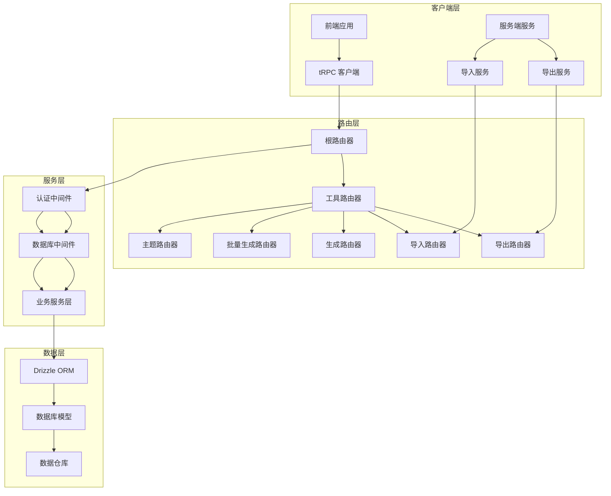

**图表来源**
- [src/server/routers/lambda/index.ts](file://src/server/routers/lambda/index.ts#L1-L110)
- [src/libs/trpc/lambda/index.ts](file://src/libs/trpc/lambda/index.ts#L1-L38)

### 认证和授权流程

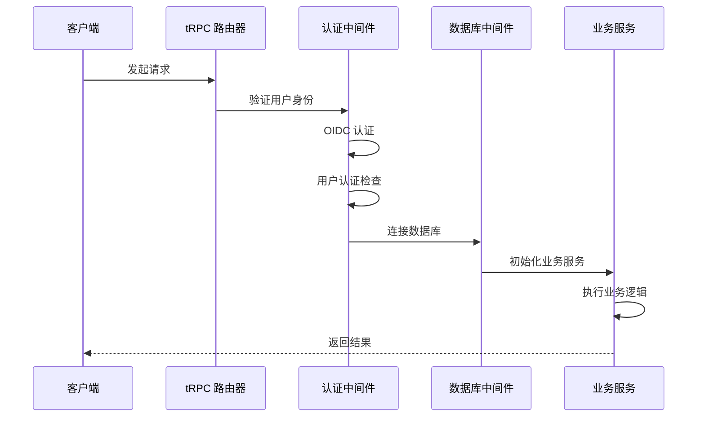

**图表来源**
- [src/libs/trpc/lambda/index.ts](file://src/libs/trpc/lambda/index.ts#L30-L31)
- [src/server/routers/lambda/exporter.ts](file://src/server/routers/lambda/exporter.ts#L13-L23)

## 详细组件分析

### 导出服务 (Exporter Router)

导出服务提供了完整的数据导出功能，支持多种输出格式：

#### 核心功能
- **数据导出**: 导出用户数据到指定格式
- **PDF 生成**: 将 Markdown 内容转换为 PDF 文档
- **模板渲染**: 支持自定义模板和样式

#### 接口规范

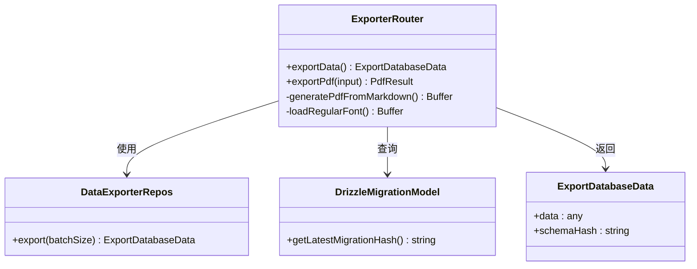

**图表来源**
- [src/server/routers/lambda/exporter.ts](file://src/server/routers/lambda/exporter.ts#L170-L194)
- [src/server/routers/lambda/exporter.ts](file://src/server/routers/lambda/exporter.ts#L13-L23)

#### PDF 生成流程

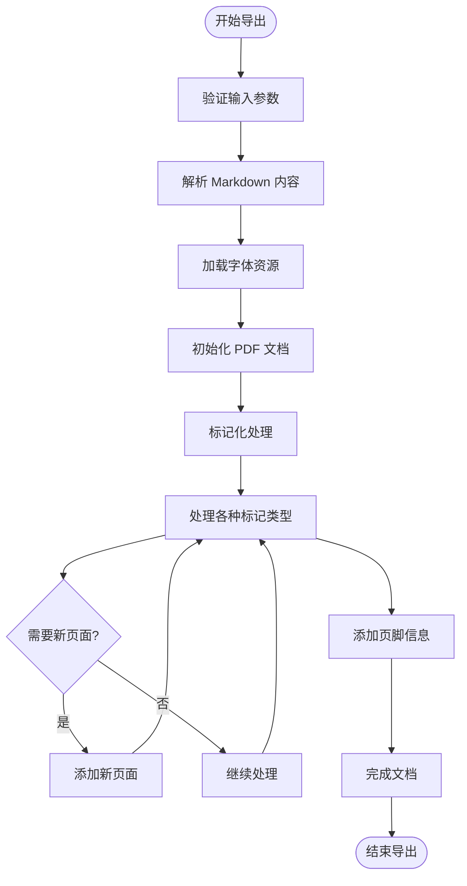

**图表来源**
- [src/server/routers/lambda/exporter.ts](file://src/server/routers/lambda/exporter.ts#L44-L168)

**章节来源**
- [src/server/routers/lambda/exporter.ts](file://src/server/routers/lambda/exporter.ts#L170-L194)
- [src/server/routers/lambda/exporter.ts](file://src/server/routers/lambda/exporter.ts#L13-L23)

### 导入服务 (Importer Router)

导入服务处理各种数据导入场景，提供了灵活的导入机制：

#### 核心功能
- **文件导入**: 从文件系统导入数据
- **POST 导入**: 直接通过 HTTP 请求导入数据
- **PG 数据导入**: 支持 PostgreSQL 数据结构导入
- **自动清理**: 导入完成后自动清理临时文件

#### 接口规范

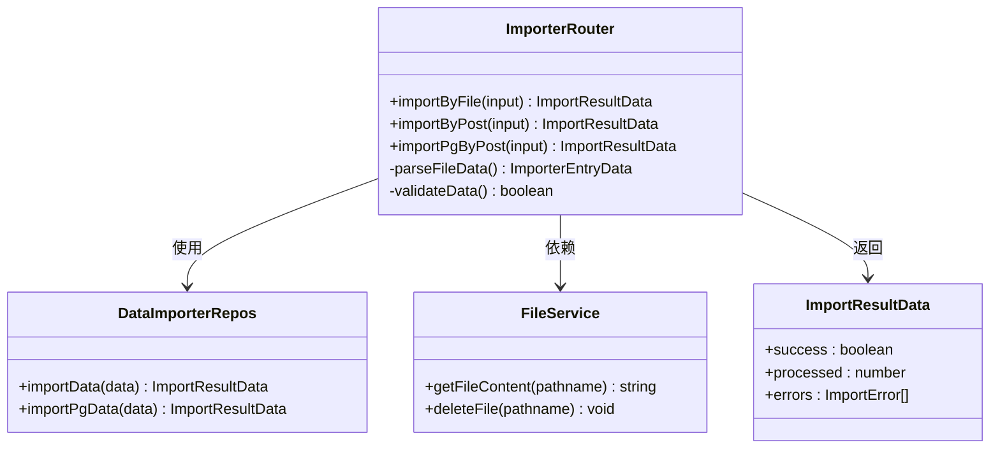

**图表来源**
- [src/server/routers/lambda/importer.ts](file://src/server/routers/lambda/importer.ts#L22-L83)
- [src/server/routers/lambda/importer.ts](file://src/server/routers/lambda/importer.ts#L11-L20)

#### 导入流程

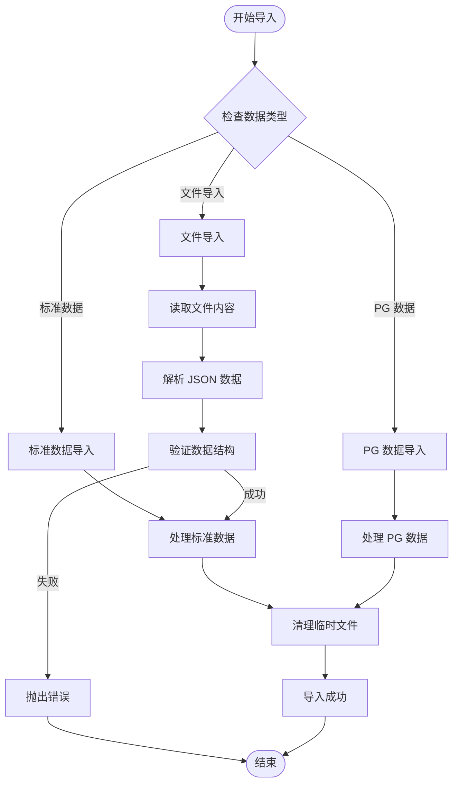

**图表来源**
- [src/server/routers/lambda/importer.ts](file://src/server/routers/lambda/importer.ts#L25-L54)

**章节来源**
- [src/server/routers/lambda/importer.ts](file://src/server/routers/lambda/importer.ts#L22-L83)
- [src/server/routers/lambda/__tests__/importer.test.ts](file://src/server/routers/lambda/__tests__/importer.test.ts#L59-L161)

### 内容生成服务 (Generation Router)

内容生成服务管理单个内容生成任务的完整生命周期：

#### 核心功能
- **状态查询**: 实时查询生成任务状态
- **任务删除**: 删除已完成或失败的生成任务
- **异步任务管理**: 处理长时间运行的生成任务

#### 接口规范

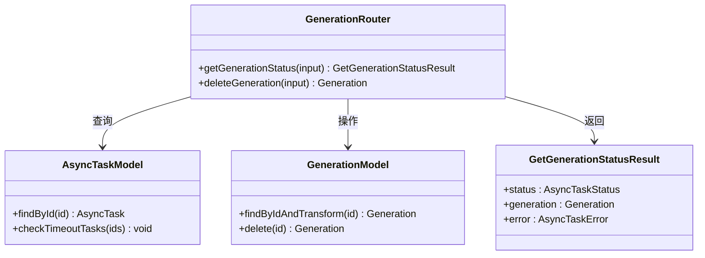

**图表来源**
- [src/server/routers/lambda/generation.ts](file://src/server/routers/lambda/generation.ts#L31-L84)
- [src/server/routers/lambda/generation.ts](file://src/server/routers/lambda/generation.ts#L25-L29)

**章节来源**
- [src/server/routers/lambda/generation.ts](file://src/server/routers/lambda/generation.ts#L31-L84)

### 批量生成服务 (Generation Batch Router)

批量生成服务处理多个内容生成任务的协调和管理：

#### 核心功能
- **批量删除**: 一次性删除多个生成任务
- **批量查询**: 获取主题下的所有生成批次
- **延迟计算**: 为视频生成计算平均延迟

#### 接口规范

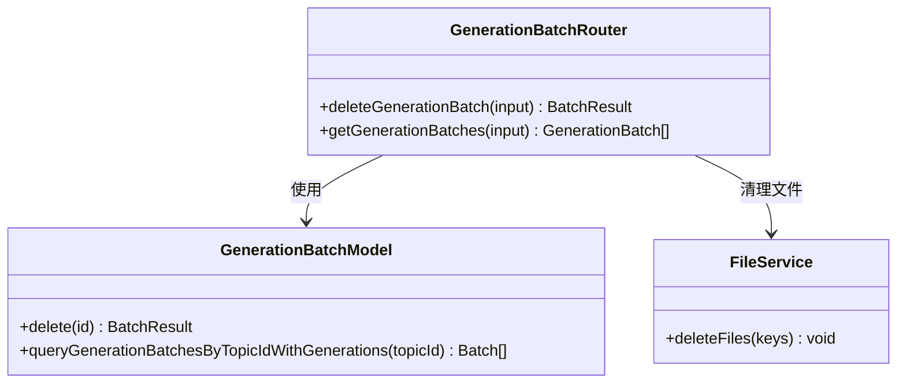

**图表来源**
- [src/server/routers/lambda/generationBatch.ts](file://src/server/routers/lambda/generationBatch.ts#L20-L71)
- [src/server/routers/lambda/generationBatch.ts](file://src/server/routers/lambda/generationBatch.ts#L9-L18)

**章节来源**
- [src/server/routers/lambda/generationBatch.ts](file://src/server/routers/lambda/generationBatch.ts#L20-L71)

### 主题管理服务 (Generation Topic Router)

主题管理服务负责内容生成主题的创建、更新和删除：

#### 核心功能
- **主题创建**: 创建新的生成主题
- **主题删除**: 删除主题及其关联资源
- **主题更新**: 更新主题元数据
- **封面处理**: 自动处理主题封面图片

#### 接口规范

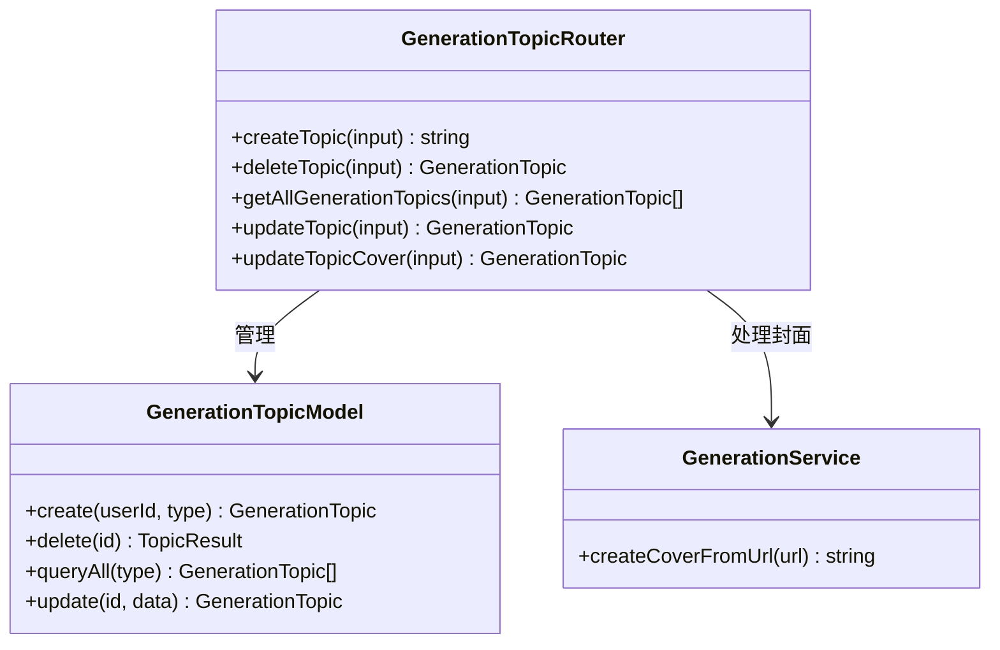

**图表来源**
- [src/server/routers/lambda/generationTopic.ts](file://src/server/routers/lambda/generationTopic.ts#L36-L90)
- [src/server/routers/lambda/generationTopic.ts](file://src/server/routers/lambda/generationTopic.ts#L10-L20)

**章节来源**
- [src/server/routers/lambda/generationTopic.ts](file://src/server/routers/lambda/generationTopic.ts#L36-L90)

## 依赖关系分析

工具服务路由模块的依赖关系体现了清晰的关注点分离：

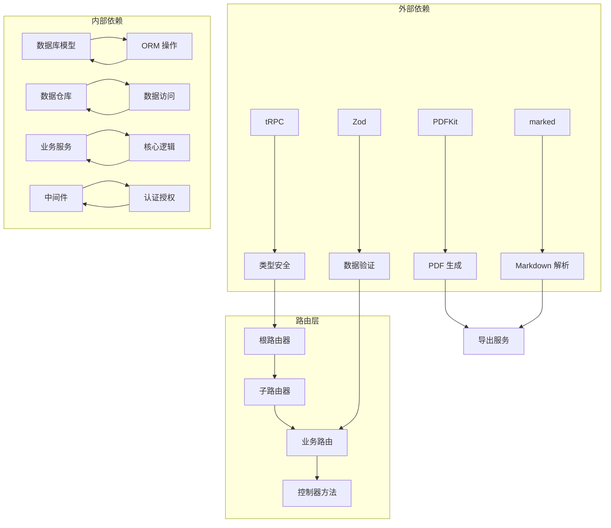

**图表来源**
- [src/server/routers/lambda/exporter.ts](file://src/server/routers/lambda/exporter.ts#L1-L12)
- [src/server/routers/lambda/importer.ts](file://src/server/routers/lambda/importer.ts#L1-L9)

### 组件耦合度分析

| 组件 | 内聚性 | 耦合度 | 说明 |
|------|--------|--------|------|
| 导出路由器 | 高 | 中 | 专注于数据导出功能，与其他组件耦合适中 |
| 导入路由器 | 中 | 高 | 需要处理多种数据格式，耦合度较高 |
| 生成路由器 | 高 | 低 | 专注于单个生成任务管理 |
| 批量生成路由器 | 中 | 中 | 需要协调多个生成任务 |
| 主题路由器 | 高 | 低 | 专注于主题管理功能 |

**章节来源**
- [src/server/routers/lambda/index.ts](file://src/server/routers/lambda/index.ts#L1-L110)

## 性能考虑

工具服务路由模块在设计时充分考虑了性能优化：

### 异步处理机制
- **批量处理**: 支持批量数据处理，减少数据库连接开销
- **延迟计算**: 视频生成延迟计算采用异步方式
- **文件清理**: 导入完成后异步清理临时文件

### 缓存策略
- **字体缓存**: PDF 字体资源缓存，避免重复下载
- **数据库连接池**: 合理的数据库连接管理

### 错误处理优化
- **渐进式清理**: 即使文件清理失败也不影响主要业务逻辑
- **超时检测**: 自动检测和清理超时任务

## 故障排除指南

### 常见问题及解决方案

#### 导入失败
**问题**: 导入过程中出现错误
**解决方案**: 
1. 检查数据格式是否正确
2. 验证文件路径是否有效
3. 查看服务器日志获取详细错误信息

#### 导出失败
**问题**: PDF 导出过程中出现异常
**解决方案**:
1. 确认 Markdown 内容格式正确
2. 检查网络连接以获取字体资源
3. 验证磁盘空间充足

#### 认证失败
**问题**: 用户认证相关错误
**解决方案**:
1. 检查 OIDC 配置
2. 验证用户会话有效性
3. 确认数据库连接正常

**章节来源**
- [src/server/routers/lambda/importer.ts](file://src/server/routers/lambda/importer.ts#L35-L40)
- [src/server/routers/lambda/exporter.ts](file://src/server/routers/lambda/exporter.ts#L34-L36)

## 结论

工具服务路由模块通过 tRPC 提供了类型安全、高性能的工具化服务接口。模块设计具有以下特点：

1. **模块化设计**: 每个功能模块职责明确，便于维护和扩展
2. **类型安全**: 全面的 TypeScript 类型定义确保接口稳定性
3. **异步处理**: 支持长时间运行的任务和批量操作
4. **错误处理**: 完善的错误处理机制保证系统稳定性
5. **性能优化**: 合理的缓存策略和异步处理提升性能

该模块为 LobeHub 提供了完整的工具服务基础设施，支持从基础的数据导出导入到高级的内容生成和批量处理的完整工具链，具备良好的可扩展性和自动化能力。