# 市场服务路由模块

<cite>
**本文档引用的文件**
- [src/server/routers/lambda/market/index.ts](file://src/server/routers/lambda/market/index.ts)
- [src/server/routers/lambda/market/agent.ts](file://src/server/routers/lambda/market/agent.ts)
- [src/server/routers/lambda/market/skill.ts](file://src/server/routers/lambda/market/skill.ts)
- [src/server/routers/lambda/market/user.ts](file://src/server/routers/lambda/market/user.ts)
- [src/server/services/market/index.ts](file://src/server/services/market/index.ts)
- [src/services/discover.ts](file://src/services/discover.ts)
- [src/libs/trpc/lambda/middleware/marketSDK.ts](file://src/libs/trpc/lambda/middleware/marketSDK.ts)
- [src/libs/trusted-client/index.ts](file://src/libs/trusted-client/index.ts)
- [src/services/marketApi.ts](file://src/services/marketApi.ts)
- [src/services/mcp.ts](file://src/services/mcp.ts)
- [src/app/(backend)/market/oidc/[[...segments]]/route.ts](file://src/app/(backend)/market/oidc/[[...segments]]/route.ts)
- [src/layout/AuthProvider/MarketAuth/MarketAuthProvider.tsx](file://src/layout/AuthProvider/MarketAuth/MarketAuthProvider.tsx)
</cite>

## 目录
1. [简介](#简介)
2. [项目结构](#项目结构)
3. [核心组件](#核心组件)
4. [架构概览](#架构概览)
5. [详细组件分析](#详细组件分析)
6. [依赖关系分析](#依赖关系分析)
7. [性能考量](#性能考量)
8. [故障排除指南](#故障排除指南)
9. [结论](#结论)
10. [附录](#附录)

## 简介

市场服务路由模块是 LobeChat 生态系统中的核心组件，负责管理插件市场、分享服务、内容发现等市场相关功能。该模块基于 tRPC 架构构建，提供了完整的市场服务接口规范，包括插件发布、Agent 分享、内容推荐等功能。

本模块实现了多层次的认证体系，支持用户认证、机器对机器(M2M)认证和可信客户端认证三种模式。通过统一的 MarketService 封装，将 MarketSDK 的复杂性抽象化，为上层应用提供简洁易用的接口。

## 项目结构

市场服务路由模块采用按功能域划分的组织方式，主要包含以下核心目录和文件：

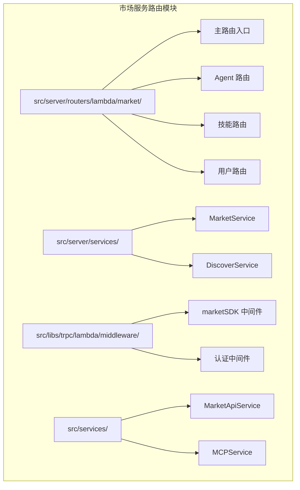

**图表来源**
- [src/server/routers/lambda/market/index.ts:50-928](file://src/server/routers/lambda/market/index.ts#L50-L928)
- [src/server/services/market/index.ts:77-570](file://src/server/services/market/index.ts#L77-L570)

**章节来源**
- [src/server/routers/lambda/market/index.ts:1-928](file://src/server/routers/lambda/market/index.ts#L1-L928)
- [src/server/services/market/index.ts:1-570](file://src/server/services/market/index.ts#L1-L570)

## 核心组件

### MarketService 核心服务

MarketService 是市场服务的核心封装类，提供了对 MarketSDK 的统一接口。它支持多种认证方式：

- **用户认证**: 通过 OIDC 流程获取的访问令牌
- **可信客户端认证**: 基于用户信息生成的加密令牌
- **M2M 认证**: 机器对机器的客户端凭据认证
- **公共访问**: 无需认证的公开接口

### DiscoverService 发现服务

DiscoverService 负责处理市场内容的发现和检索功能，包括：
- 插件市场查询和分类
- Agent 市场浏览
- 技能市场探索
- 用户资料查询

### tRPC 路由系统

路由系统采用分层设计，每个功能域都有独立的路由处理器：
- **公共路由**: 无需认证即可访问的市场浏览功能
- **认证路由**: 需要用户登录的个人化功能
- **管理路由**: 高权限的市场管理操作

**章节来源**
- [src/server/services/market/index.ts:77-570](file://src/server/services/market/index.ts#L77-L570)
- [src/services/discover.ts:45-635](file://src/services/discover.ts#L45-L635)

## 架构概览

市场服务路由模块采用分层架构设计，确保了良好的可维护性和扩展性：

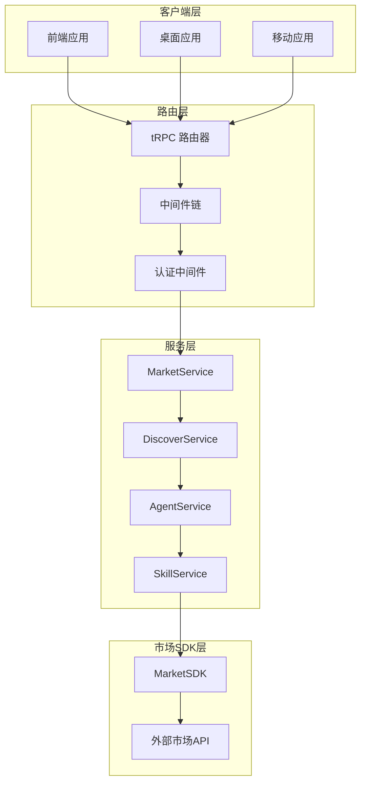

**图表来源**
- [src/server/routers/lambda/market/index.ts:29-48](file://src/server/routers/lambda/market/index.ts#L29-L48)
- [src/server/services/market/index.ts:77-102](file://src/server/services/market/index.ts#L77-L102)

### 认证架构

系统实现了多层认证机制，确保不同场景下的安全访问：

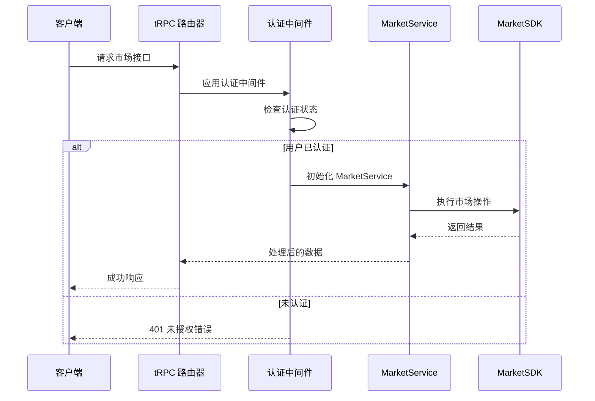

**图表来源**
- [src/libs/trpc/lambda/middleware/marketSDK.ts:19-59](file://src/libs/trpc/lambda/middleware/marketSDK.ts#L19-L59)
- [src/server/services/market/index.ts:80-102](file://src/server/services/market/index.ts#L80-L102)

**章节来源**
- [src/libs/trpc/lambda/middleware/marketSDK.ts:1-60](file://src/libs/trpc/lambda/middleware/marketSDK.ts#L1-L60)
- [src/libs/trusted-client/index.ts:1-65](file://src/libs/trusted-client/index.ts#L1-L65)

## 详细组件分析

### 插件市场路由

插件市场路由提供了完整的插件发现、浏览和管理功能：

#### 主要接口规范

| 接口名称 | 方法 | 路径 | 认证要求 | 功能描述 |
|---------|------|------|----------|----------|
| getPluginList | GET | /market/getPluginList | 无 | 获取插件列表 |
| getPluginDetail | GET | /market/getPluginDetail | 无 | 获取插件详情 |
| getPluginCategories | GET | /market/getPluginCategories | 无 | 获取插件分类 |
| getPluginIdentifiers | GET | /market/getPluginIdentifiers | 无 | 获取插件标识符 |

#### 查询参数定义

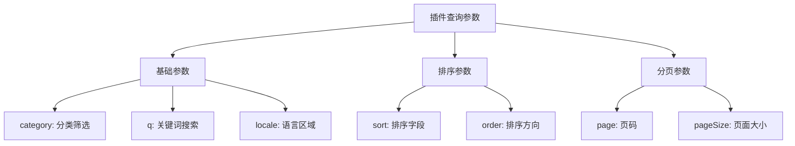

**图表来源**
- [src/server/routers/lambda/market/index.ts:540-566](file://src/server/routers/lambda/market/index.ts#L540-L566)

**章节来源**
- [src/server/routers/lambda/market/index.ts:480-566](file://src/server/routers/lambda/market/index.ts#L480-L566)

### Agent 市场路由

Agent 市场路由实现了完整的 Agent 生命周期管理：

#### Agent 管理接口

| 接口名称 | 方法 | 路径 | 认证要求 | 功能描述 |
|---------|------|------|----------|----------|
| createAgent | POST | /market/agent/create | 需要认证 | 创建新的 Agent |
| publishAgent | POST | /market/agent/:id/publish | 需要认证 | 发布 Agent |
| unpublishAgent | POST | /market/agent/:id/unpublish | 需要认证 | 下架 Agent |
| deprecateAgent | POST | /market/agent/:id/deprecate | 需要认证 | 弃用 Agent |
| forkAgent | POST | /market/agent/:id/fork | 需要认证 | Fork Agent |
| getAgentDetail | GET | /market/agent/:id | 无 | 获取 Agent 详情 |
| getOwnAgents | GET | /market/agent/own | 需要认证 | 获取用户的 Agent |

#### 发布流程

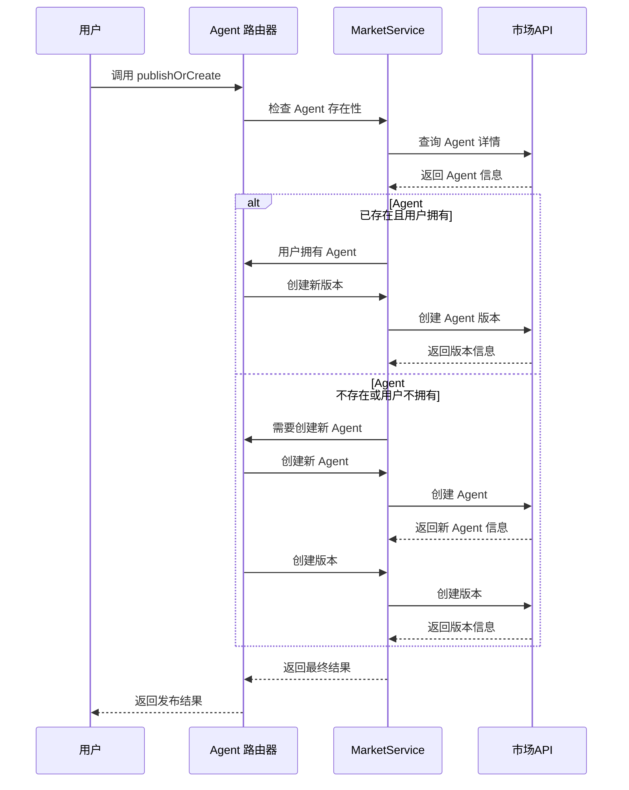

**图表来源**
- [src/server/routers/lambda/market/agent.ts:580-660](file://src/server/routers/lambda/market/agent.ts#L580-L660)

**章节来源**
- [src/server/routers/lambda/market/agent.ts:188-686](file://src/server/routers/lambda/market/agent.ts#L188-L686)

### 技能市场路由

技能市场路由提供了技能的发现和管理功能：

#### 技能市场接口

| 接口名称 | 方法 | 路径 | 认证要求 | 功能描述 |
|---------|------|------|----------|----------|
| getSkillList | GET | /market/skill/getSkillList | 无 | 获取技能列表 |
| getSkillDetail | GET | /market/skill/getSkillDetail | 无 | 获取技能详情 |
| getSkillCategories | GET | /market/skill/getSkillCategories | 无 | 获取技能分类 |

#### 技能执行机制

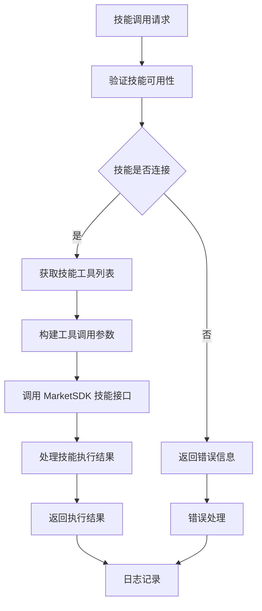

**图表来源**
- [src/server/routers/lambda/market/skill.ts:76-102](file://src/server/routers/lambda/market/skill.ts#L76-L102)

**章节来源**
- [src/server/routers/lambda/market/skill.ts:1-104](file://src/server/routers/lambda/market/skill.ts#L1-L104)

### 用户路由

用户路由提供了用户资料管理和个人化功能：

#### 用户管理接口

| 接口名称 | 方法 | 路径 | 认证要求 | 功能描述 |
|---------|------|------|----------|----------|
| getUserByUsername | GET | /market/user/:username | 无 | 获取用户资料 |
| updateUserProfile | PUT | /market/user/me | 需要认证 | 更新用户资料 |

#### 用户资料结构

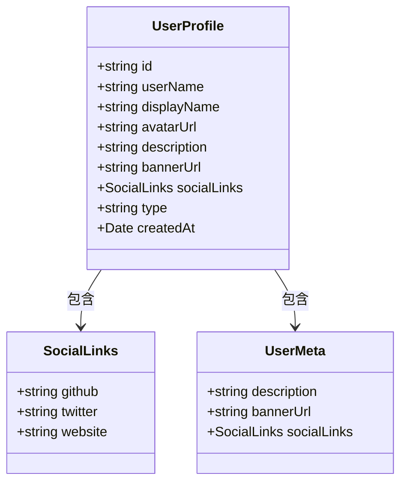

**图表来源**
- [src/server/routers/lambda/market/user.ts:36-124](file://src/server/routers/lambda/market/user.ts#L36-L124)

**章节来源**
- [src/server/routers/lambda/market/user.ts:1-124](file://src/server/routers/lambda/market/user.ts#L1-L124)

### MCP 服务集成

MCP(模型控制协议)服务集成了云端和本地的插件执行能力：

#### MCP 服务架构

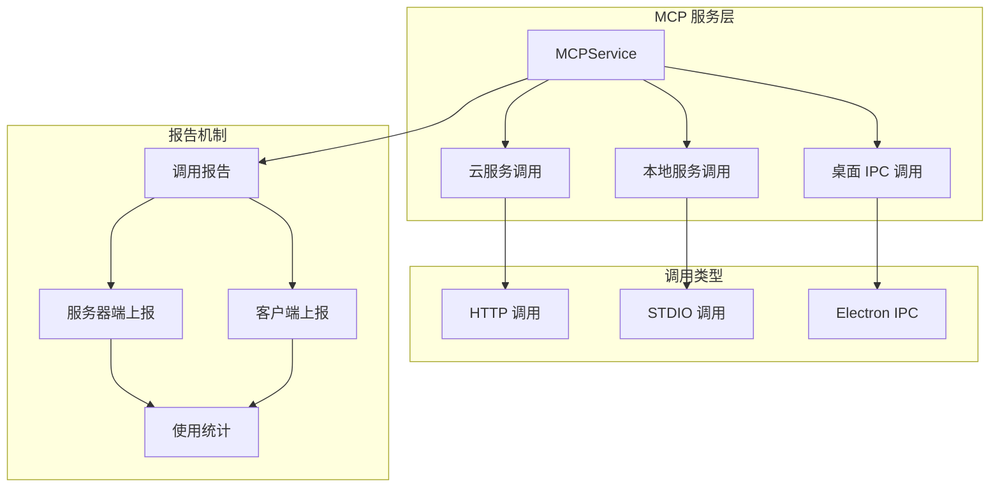

**图表来源**
- [src/services/mcp.ts:33-274](file://src/services/mcp.ts#L33-L274)

**章节来源**
- [src/services/mcp.ts:1-274](file://src/services/mcp.ts#L1-L274)

## 依赖关系分析

市场服务路由模块的依赖关系体现了清晰的分层架构：

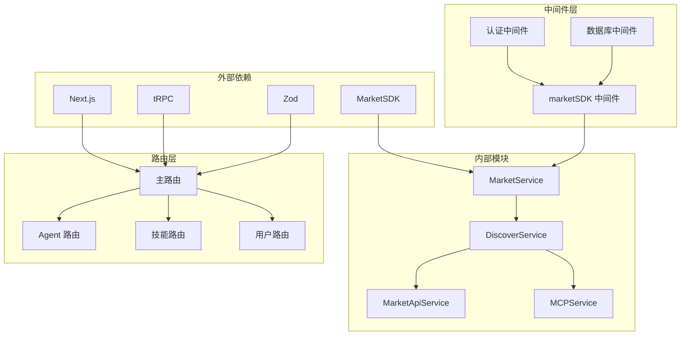

**图表来源**
- [src/server/routers/lambda/market/index.ts:1-28](file://src/server/routers/lambda/market/index.ts#L1-L28)
- [src/server/services/market/index.ts:1-12](file://src/server/services/market/index.ts#L1-L12)

### 数据流分析

系统中的数据流遵循统一的处理模式：

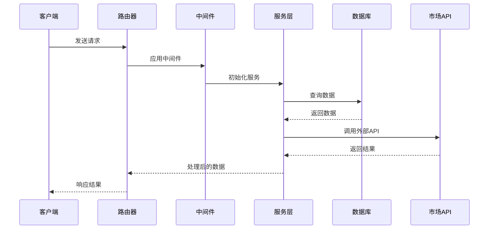

**图表来源**
- [src/server/routers/lambda/market/index.ts:32-48](file://src/server/routers/lambda/market/index.ts#L32-L48)

**章节来源**
- [src/server/routers/lambda/market/index.ts:1-928](file://src/server/routers/lambda/market/index.ts#L1-L928)

## 性能考量

### 缓存策略

系统实现了多层次的缓存机制来提升性能：

1. **客户端缓存**: 使用浏览器缓存存储常用数据
2. **服务端缓存**: Redis 缓存热门内容
3. **CDN 缓存**: 静态资源通过 CDN 加速

### 并发控制

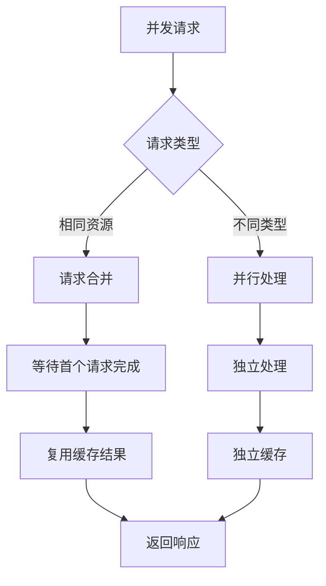

### 错误处理

系统采用渐进式错误处理策略：

1. **本地错误**: 优先尝试本地修复
2. **重试机制**: 对临时性错误进行自动重试
3. **降级策略**: 在服务不可用时提供降级功能
4. **监控告警**: 对严重错误进行实时监控

## 故障排除指南

### 常见问题诊断

#### 认证问题

| 问题症状 | 可能原因 | 解决方案 |
|----------|----------|----------|
| 401 未授权 | 令牌过期或无效 | 重新登录或刷新令牌 |
| 403 禁止访问 | 权限不足 | 检查用户权限或联系管理员 |
| 认证循环 | 会话配置错误 | 检查 Cookie 设置和域名配置 |

#### 性能问题

| 问题症状 | 可能原因 | 解决方案 |
|----------|----------|----------|
| 响应缓慢 | 数据库查询慢 | 优化查询或添加索引 |
| 内存泄漏 | 缓存未清理 | 检查缓存清理逻辑 |
| 并发冲突 | 锁竞争 | 实施分布式锁或队列化处理 |

#### 集成问题

| 问题症状 | 可能原因 | 解决方案 |
|----------|----------|----------|
| API 调用失败 | 网络连接问题 | 检查网络连通性和代理设置 |
| 数据不一致 | 同步延迟 | 实施事件驱动同步或补偿机制 |
| 格式错误 | 协议变更 | 更新客户端适配新版本 |

**章节来源**
- [src/libs/trpc/lambda/middleware/marketSDK.ts:43-59](file://src/libs/trpc/lambda/middleware/marketSDK.ts#L43-L59)
- [src/services/discover.ts:413-533](file://src/services/discover.ts#L413-L533)

## 结论

市场服务路由模块通过精心设计的架构和完善的认证机制，为 LobeChat 生态系统提供了强大而灵活的市场服务能力。模块具有以下特点：

1. **模块化设计**: 清晰的功能分离和职责划分
2. **多层认证**: 支持多种认证场景的安全访问
3. **统一接口**: 通过 MarketService 提供一致的 API 接口
4. **可扩展性**: 良好的架构设计便于功能扩展
5. **性能优化**: 多层次的缓存和并发控制机制

该模块不仅满足了当前的市场服务需求，还为未来的功能扩展和生态建设奠定了坚实的基础。

## 附录

### 接口参数参考表

#### 通用查询参数
- `locale`: 语言区域代码 (如: zh-CN, en-US)
- `page`: 页码 (默认: 1)
- `pageSize`: 每页数量 (默认: 20)
- `q`: 搜索关键词

#### 排序参数
- `sort`: 排序字段 (createdAt, updatedAt, name, relevance)
- `order`: 排序方向 (asc, desc)

#### 认证参数
- `Authorization`: Bearer 令牌
- `x-lobe-trust-token`: 可信客户端令牌
- `clientId/clientSecret`: M2M 客户端凭据

### 部署配置建议

1. **环境变量配置**
   - MARKET_BASE_URL: 市场服务基础 URL
   - MARKET_TRUSTED_CLIENT_ID: 可信客户端 ID
   - MARKET_TRUSTED_CLIENT_SECRET: 可信客户端密钥

2. **安全配置**
   - HTTPS 证书配置
   - CORS 策略设置
   - CSRF 保护启用

3. **性能配置**
   - 缓存策略调整
   - 连接池大小配置
   - 超时时间设置