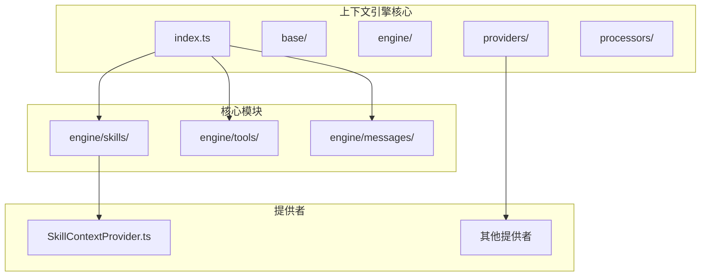
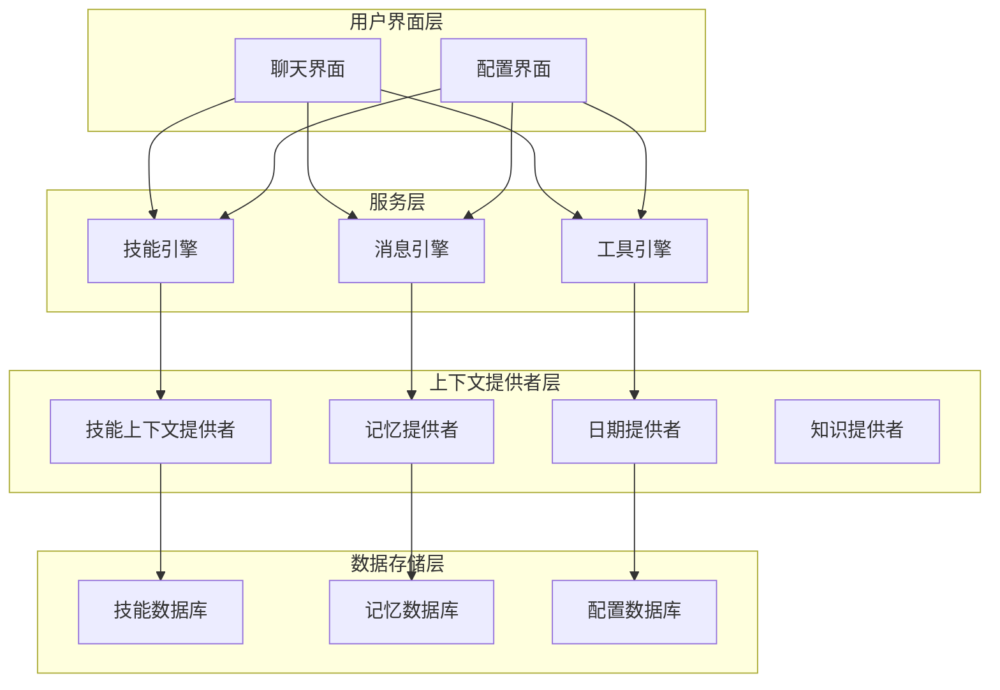
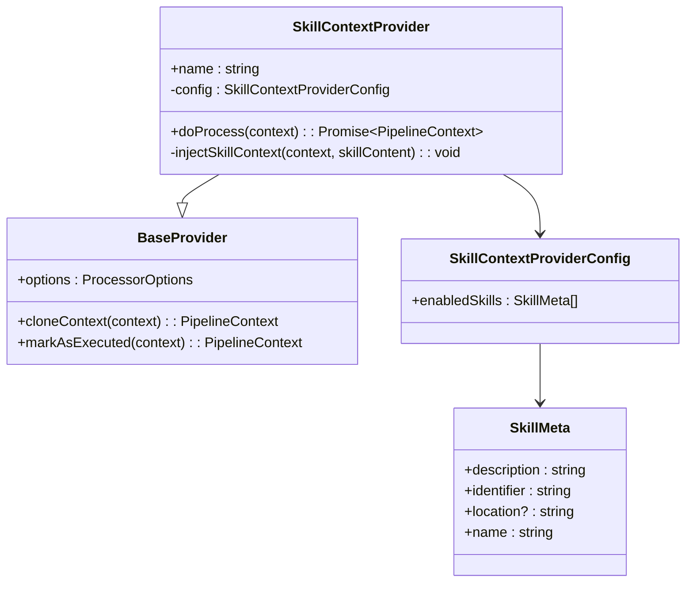
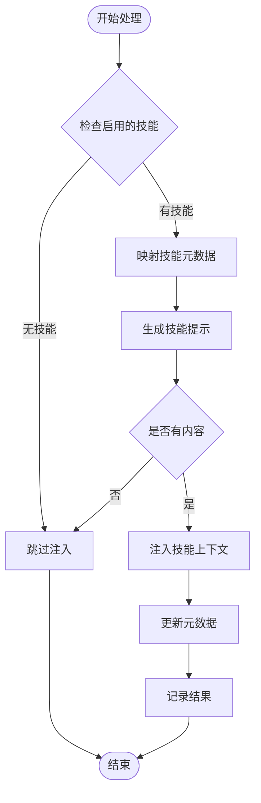
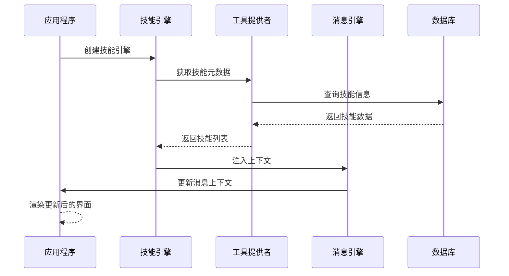
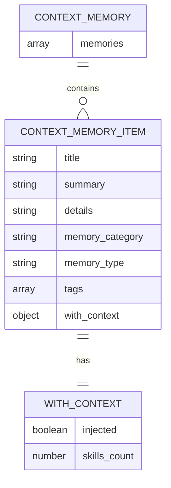

# 标题上下文提取系统

<cite>
**本文档引用的文件**
- [README.md](file://README.md)
- [package.json](file://packages/context-engine/package.json)
- [index.ts](file://packages/context-engine/src/index.ts)
- [constants.ts](file://packages/context-engine/src/base/constants.ts)
- [SkillContextProvider.ts](file://packages/context-engine/src/providers/SkillContextProvider.ts)
- [engine/index.ts](file://packages/context-engine/src/engine/index.ts)
- [engine/skills/index.ts](file://packages/context-engine/src/engine/skills/index.ts)
- [engine/tools/index.ts](file://packages/context-engine/src/engine/tools/index.ts)
- [engine/messages/index.ts](file://packages/context-engine/src/engine/messages/index.ts)
- [providers/index.ts](file://packages/context-engine/src/providers/index.ts)
- [skillEngineering.ts](file://src/services/chat/mecha/skillEngineering.ts)
- [context.ts](file://packages/memory-user-memory/src/schemas/context.ts)
</cite>

## 目录

1. [简介](#简介)
2. [项目结构](#项目结构)
3. [核心组件](#核心组件)
4. [架构概览](#架构概览)
5. [详细组件分析](#详细组件分析)
6. [依赖关系分析](#依赖关系分析)
7. [性能考虑](#性能考虑)
8. [故障排除指南](#故障排除指南)
9. [结论](#结论)

## 简介

标题上下文提取系统是 LobeHub 生态系统中的一个关键组件，专门负责从各种数据源中提取和管理标题相关的上下文信息。该系统基于上下文引擎架构，为 AI 聊天应用提供智能的上下文注入和管理能力。

LobeHub 是一个面向工作和生活的终极空间，旨在帮助用户发现、构建和协作拥有能够与他们共同成长的代理伙伴。该系统支持多种功能，包括代理作为工作单元、协作网络扩展、人类与代理的共同进化等特性。

## 项目结构

标题上下文提取系统位于 packages/context-engine 包中，采用模块化设计，包含以下主要目录结构：



**图表来源**

- [index.ts:1-32](file://packages/context-engine/src/index.ts#L1-L32)
- [engine/index.ts:1-7](file://packages/context-engine/src/engine/index.ts#L1-L7)

**章节来源**

- [package.json:1-36](file://packages/context-engine/package.json#L1-L36)
- [index.ts:1-32](file://packages/context-engine/src/index.ts#L1-L32)

## 核心组件

标题上下文提取系统的核心组件包括：

### 上下文引擎 (ContextEngine)

- **职责**: 作为整个系统的入口点，协调各个子引擎的工作
- **功能**: 提供统一的接口来管理技能、工具和消息上下文
- **配置**: 支持灵活的配置选项和插件机制

### 技能上下文提供者 (SkillContextProvider)

- **职责**: 轻量级地将技能元数据注入到系统提示中
- **功能**: 允许 LLM 了解可用技能并调用 `runSkill` 函数
- **兼容性**: 与 `@lobechat/types` 中的 `SkillMeta` 兼容

### 常量定义 (Constants)

- **系统上下文标记**: 使用特定标记包装注入的上下文内容
- **上下文指令**: 为模型提供处理注入上下文的指导原则

**章节来源**

- [constants.ts:1-20](file://packages/context-engine/src/base/constants.ts#L1-L20)
- [SkillContextProvider.ts:1-101](file://packages/context-engine/src/providers/SkillContextProvider.ts#L1-L101)

## 架构概览

标题上下文提取系统采用分层架构设计，确保了良好的可扩展性和维护性：



**图表来源**

- [engine/index.ts:1-7](file://packages/context-engine/src/engine/index.ts#L1-L7)
- [providers/index.ts:1-60](file://packages/context-engine/src/providers/index.ts#L1-L60)

## 详细组件分析

### 技能上下文提供者分析

技能上下文提供者是标题上下文提取系统的核心组件之一，负责将技能元数据注入到系统提示中：



**图表来源**

- [SkillContextProvider.ts:1-101](file://packages/context-engine/src/providers/SkillContextProvider.ts#L1-L101)

#### 处理流程

技能上下文提供者的处理流程如下：



**图表来源**

- [SkillContextProvider.ts:42-75](file://packages/context-engine/src/providers/SkillContextProvider.ts#L42-L75)

**章节来源**

- [SkillContextProvider.ts:1-101](file://packages/context-engine/src/providers/SkillContextProvider.ts#L1-L101)

### 上下文引擎集成

标题上下文提取系统通过以下方式与主应用集成：



**图表来源**

- [skillEngineering.ts:1-33](file://src/services/chat/mecha/skillEngineering.ts#L1-L33)

**章节来源**

- [skillEngineering.ts:1-33](file://src/services/chat/mecha/skillEngineering.ts#L1-L33)

### 记忆上下文模式

系统使用 Zod 验证器定义记忆上下文的数据结构：



**图表来源**

- [context.ts:75-101](file://packages/memory-user-memory/src/schemas/context.ts#L75-L101)

**章节来源**

- [context.ts:75-101](file://packages/memory-user-memory/src/schemas/context.ts#L75-L101)

## 依赖关系分析

标题上下文提取系统具有清晰的依赖关系结构：

```mermaid
graph LR
subgraph "外部依赖"
PROMPTS[@lobechat/prompts]
UTILS[@lobechat/utils]
DEBUG[debug]
IMMER[immer]
ZOD[zod]
end
subgraph "内部包"
TYPES[@lobechat/types]
CONTEXT_ENGINE[@lobechat/context-engine]
DATABASE[@lobechat/database]
MEMORY_USER_MEMORY[@lobechat/memory-user-memory]
end
CONTEXT_ENGINE --> PROMPTS
CONTEXT_ENGINE --> UTILS
CONTEXT_ENGINE --> DEBUG
CONTEXT_ENGINE --> IMMER
PROMPTS --> TYPES
UTILS --> TYPES
MEMORY_USER_MEMORY --> DATABASE
CONTEXT_ENGINE --> MEMORY_USER_MEMORY
```

**图表来源**

- [package.json:20-34](file://packages/context-engine/package.json#L20-L34)

**章节来源**

- [package.json:1-36](file://packages/context-engine/package.json#L1-L36)

## 性能考虑

标题上下文提取系统在设计时充分考虑了性能优化：

### 缓存策略

- **技能元数据缓存**: 启用的技能元数据会被缓存以避免重复查询
- **上下文内容缓存**: 注入的上下文内容会进行缓存以提高响应速度

### 异步处理

- **非阻塞操作**: 所有上下文处理都是异步执行，不会阻塞主线程
- **并发处理**: 支持多个上下文提供者同时处理不同的上下文类型

### 内存管理

- **智能释放**: 处理完成的上下文会及时释放内存
- **增量更新**: 只更新发生变化的上下文部分

## 故障排除指南

### 常见问题及解决方案

#### 技能上下文未注入

**症状**: LLM 无法识别可用技能
**原因**:

- 启用的技能列表为空
- 技能内容生成失败
- 系统消息格式错误

**解决方案**:

1. 检查技能配置是否正确
2. 验证技能元数据的有效性
3. 确认系统消息的格式

#### 上下文注入延迟

**症状**: 用户界面显示延迟
**原因**:

- 数据库查询超时
- 网络请求延迟
- 处理逻辑复杂度高

**解决方案**:

1. 优化数据库查询
2. 实施缓存机制
3. 简化处理逻辑

#### 内存泄漏

**症状**: 应用内存持续增长
**原因**:

- 上下文对象未正确释放
- 事件监听器未移除
- 循环引用

**解决方案**:

1. 实施正确的对象生命周期管理
2. 移除不再使用的事件监听器
3. 检查并修复循环引用

**章节来源**

- [SkillContextProvider.ts:47-75](file://packages/context-engine/src/providers/SkillContextProvider.ts#L47-L75)

## 结论

标题上下文提取系统为 LobeHub 提供了强大而灵活的上下文管理能力。通过模块化的架构设计、清晰的依赖关系和完善的错误处理机制，该系统能够有效地处理各种复杂的上下文提取需求。

系统的主要优势包括：

- **高度模块化**: 清晰的组件分离和职责划分
- **可扩展性**: 支持新的上下文提供者和处理器
- **性能优化**: 智能缓存和异步处理机制
- **可靠性**: 完善的错误处理和故障恢复机制

未来的发展方向包括：

- 增强机器学习算法以提高上下文提取准确性
- 扩展支持更多的数据源和格式
- 优化性能以支持更大规模的应用场景
- 增强安全性和隐私保护机制
