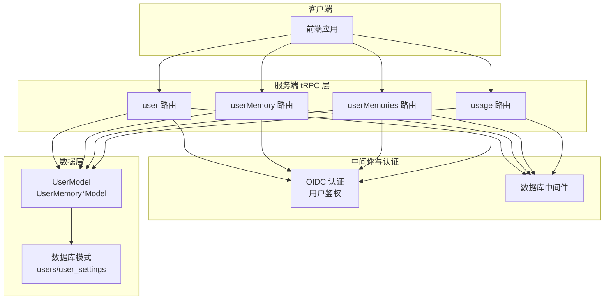
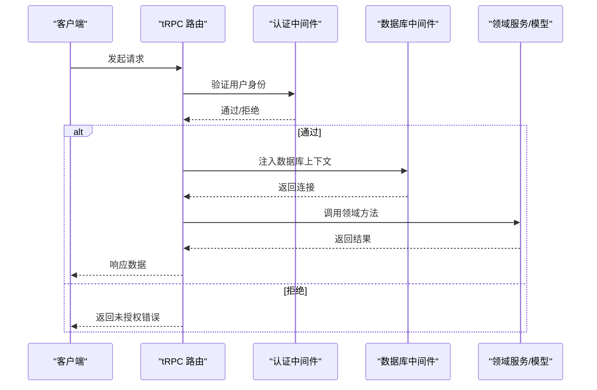
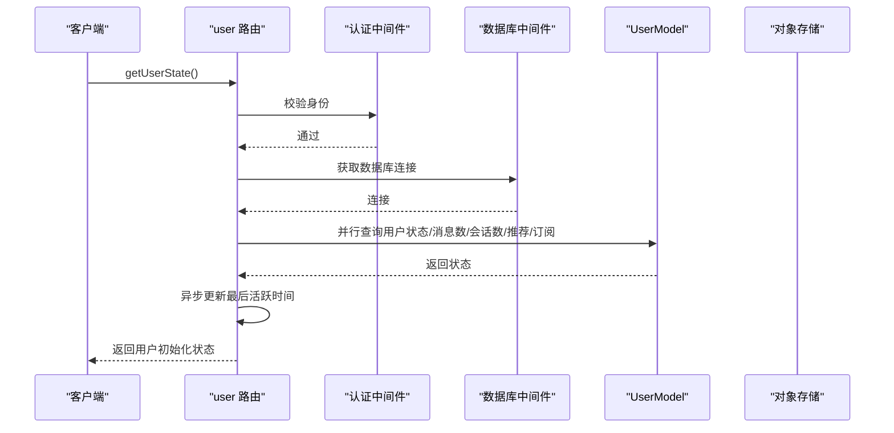
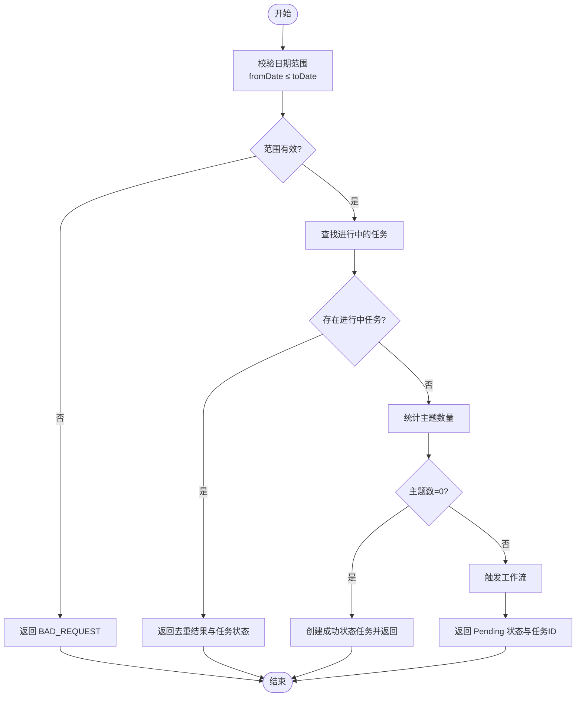
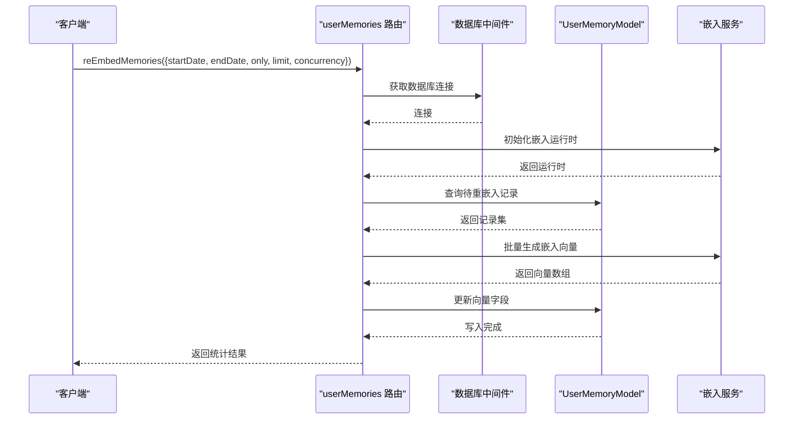
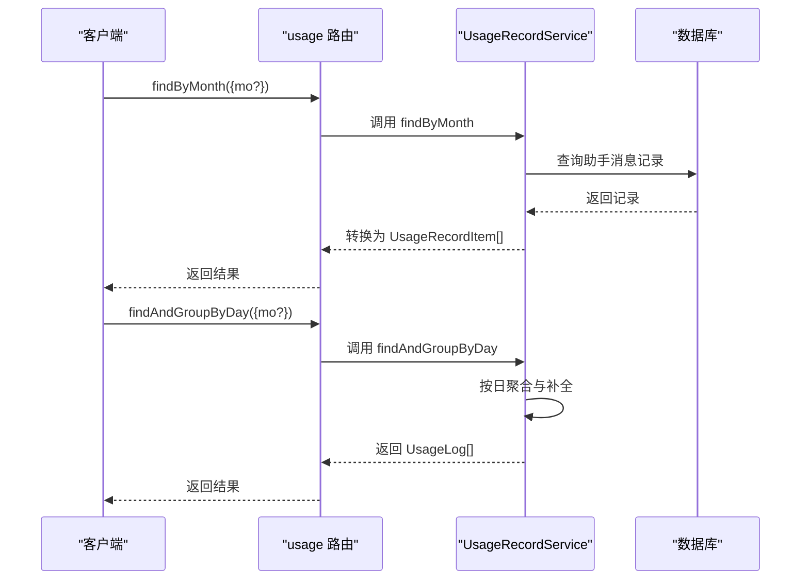
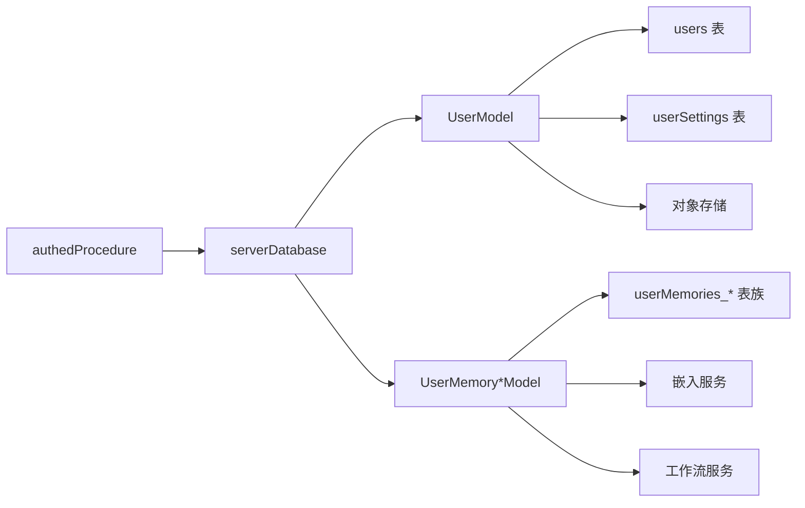

# 用户管理路由模块

<cite>
**本文档引用的文件**
- [src/server/routers/lambda/user.ts](file://src/server/routers/lambda/user.ts)
- [src/server/routers/lambda/userMemory.ts](file://src/server/routers/lambda/userMemory.ts)
- [src/server/routers/lambda/userMemories.ts](file://src/server/routers/lambda/userMemories.ts)
- [src/server/routers/lambda/usage.ts](file://src/server/routers/lambda/usage.ts)
- [packages/database/src/schemas/user.ts](file://packages/database/src/schemas/user.ts)
- [packages/database/src/models/user.ts](file://packages/database/src/models/user.ts)
- [packages/const/src/user.ts](file://packages/const/src/user.ts)
- [packages/openapi/src/types/user.type.ts](file://packages/openapi/src/types/user.type.ts)
- [src/server/services/usage/index.ts](file://src/server/services/usage/index.ts)
- [src/libs/trpc/lambda/index.ts](file://src/libs/trpc/lambda/index.ts)
</cite>

## 目录
1. [简介](#简介)
2. [项目结构](#项目结构)
3. [核心组件](#核心组件)
4. [架构概览](#架构概览)
5. [详细组件分析](#详细组件分析)
6. [依赖关系分析](#依赖关系分析)
7. [性能考量](#性能考量)
8. [故障排除指南](#故障排除指南)
9. [结论](#结论)
10. [附录](#附录)

## 简介
本文件为用户管理路由模块的详细 tRPC 接口文档，覆盖用户信息、用户记忆、使用统计等核心功能。文档面向开发者与运维人员，提供接口规范、数据模型、安全与隐私保护、访问控制、数据同步策略及最佳实践。

## 项目结构
用户管理路由模块位于服务端 tRPC 路由层，围绕以下四个核心路由展开：
- user：用户基本信息与偏好设置更新
- userMemory：用户记忆实体的增删改查与记忆提取任务
- userMemories：用户记忆检索与批量重嵌入
- usage：使用统计查询（按日聚合）

**图表来源**
- [src/server/routers/lambda/user.ts](file://src/server/routers/lambda/user.ts#L47-L229)
- [src/server/routers/lambda/userMemory.ts](file://src/server/routers/lambda/userMemory.ts#L74-L391)
- [src/server/routers/lambda/userMemories.ts](file://src/server/routers/lambda/userMemories.ts#L286-L800)
- [src/server/routers/lambda/usage.ts](file://src/server/routers/lambda/usage.ts#L16-L36)
- [src/libs/trpc/lambda/index.ts](file://src/libs/trpc/lambda/index.ts#L31-L31)

**章节来源**
- [src/server/routers/lambda/user.ts](file://src/server/routers/lambda/user.ts#L1-L230)
- [src/server/routers/lambda/userMemory.ts](file://src/server/routers/lambda/userMemory.ts#L1-L392)
- [src/server/routers/lambda/userMemories.ts](file://src/server/routers/lambda/userMemories.ts#L1-L800)
- [src/server/routers/lambda/usage.ts](file://src/server/routers/lambda/usage.ts#L1-L37)
- [src/libs/trpc/lambda/index.ts](file://src/libs/trpc/lambda/index.ts#L1-L37)

## 核心组件
- user 路由：提供用户状态获取、引导流程、偏好设置、个人资料更新、头像上传、用户名校验等能力
- userMemory 路由：提供记忆身份、活动、上下文、经验、偏好的增删改查，以及基于聊天主题的记忆提取任务调度与状态查询
- userMemories 路由：提供记忆检索、分页查询、标签与角色统计、向量重嵌入等高级能力
- usage 路由：提供按月与按日聚合的使用统计查询

**章节来源**
- [src/server/routers/lambda/user.ts](file://src/server/routers/lambda/user.ts#L47-L229)
- [src/server/routers/lambda/userMemory.ts](file://src/server/routers/lambda/userMemory.ts#L74-L391)
- [src/server/routers/lambda/userMemories.ts](file://src/server/routers/lambda/userMemories.ts#L286-L800)
- [src/server/routers/lambda/usage.ts](file://src/server/routers/lambda/usage.ts#L16-L36)

## 架构概览
用户管理路由通过统一的认证中间件确保仅已登录用户可调用；每个路由在进入业务处理前注入数据库上下文与领域模型实例，保证数据一致性与事务隔离。

**图表来源**
- [src/libs/trpc/lambda/index.ts](file://src/libs/trpc/lambda/index.ts#L31-L31)
- [src/server/routers/lambda/user.ts](file://src/server/routers/lambda/user.ts#L36-L45)
- [src/server/routers/lambda/userMemory.ts](file://src/server/routers/lambda/userMemory.ts#L33-L49)
- [src/server/routers/lambda/userMemories.ts](file://src/server/routers/lambda/userMemories.ts#L263-L284)
- [src/server/routers/lambda/usage.ts](file://src/server/routers/lambda/usage.ts#L7-L14)

## 详细组件分析

### user 路由接口规范
- 路由入口：userRouter
- 认证：authedProcedure（OIDC + 用户鉴权）
- 数据库：serverDatabase 中间件注入
- 关键接口
  - getUserState：获取用户初始化状态，包含头像、姓名、邮箱、偏好、设置、引导状态、订阅计划等，并异步更新最后活跃时间
  - getUserRegistrationDuration：返回注册时长与创建日期
  - getUserSSOProviders：返回用户绑定的 SSO 提供商
  - makeUserOnboarded：标记用户完成引导
  - resetSettings：删除用户设置
  - updateAvatar：支持 Base64 与 URL 两种方式上传头像，自动加密与清理旧资源
  - updateFullName/updateInterests/updateGuide/updateOnboarding/updatePreference/updateSettings/updateUsername：分别更新对应字段，含输入校验与冲突检测

**图表来源**
- [src/server/routers/lambda/user.ts](file://src/server/routers/lambda/user.ts#L56-L113)

**章节来源**
- [src/server/routers/lambda/user.ts](file://src/server/routers/lambda/user.ts#L47-L229)

### userMemory 路由接口规范
- 路由入口：userMemoryRouter
- 认证：authedProcedure
- 数据库：serverDatabase
- 关键接口
  - Identity CRUD：createIdentity、getIdentities、updateIdentity、deleteIdentity
  - Activity/Context/Experience/Preference CRUD：各层增删改查
  - getPersona：获取最新人物画像摘要
  - getMemoryExtractionTask：查询记忆提取任务状态与超时处理
  - requestMemoryFromChatTopic：基于聊天主题触发记忆提取工作流，支持去重与范围限制

**图表来源**
- [src/server/routers/lambda/userMemory.ts](file://src/server/routers/lambda/userMemory.ts#L211-L308)

**章节来源**
- [src/server/routers/lambda/userMemory.ts](file://src/server/routers/lambda/userMemory.ts#L74-L391)

### userMemories 路由接口规范
- 路由入口：userMemoriesRouter
- 认证：authedProcedure
- 数据库：serverDatabase
- 关键接口
  - getMemoryDetail：按 ID 与层级获取记忆详情
  - queryActivities/queryExperiences/queryIdentities/queryMemories：分页查询与排序筛选
  - queryIdentitiesForInjection：用于注入的身份标识查询
  - queryIdentityRoles：身份角色与标签统计
  - queryTags：记忆标签查询
  - reEmbedMemories：按配置批量重嵌入，支持并发与时间范围过滤

**图表来源**
- [src/server/routers/lambda/userMemories.ts](file://src/server/routers/lambda/userMemories.ts#L472-L800)

**章节来源**
- [src/server/routers/lambda/userMemories.ts](file://src/server/routers/lambda/userMemories.ts#L286-L800)

### usage 路由接口规范
- 路由入口：usageRouter
- 认证：authedProcedure
- 数据库：serverDatabase
- 关键接口
  - findByMonth：按自然月查询使用记录（默认当月）
  - findAndGroupByDay：按日聚合统计（补全空日期）

**图表来源**
- [src/server/routers/lambda/usage.ts](file://src/server/routers/lambda/usage.ts#L16-L36)
- [src/server/services/usage/index.ts](file://src/server/services/usage/index.ts#L27-L166)

**章节来源**
- [src/server/routers/lambda/usage.ts](file://src/server/routers/lambda/usage.ts#L16-L36)
- [src/server/services/usage/index.ts](file://src/server/services/usage/index.ts#L14-L168)

## 依赖关系分析
- 认证与中间件
  - OIDC 认证与用户鉴权：authedProcedure.use(oidcAuth).use(userAuth)
  - 数据库中间件：serverDatabase 注入数据库连接
- 领域模型
  - UserModel：用户状态、设置、偏好、SSO 提供商、唯一字段规范化等
  - UserMemory*Model：记忆身份、活动、上下文、经验、偏好、人物画像等模型
- 数据库模式
  - users：用户基础信息与唯一约束
  - userSettings：用户设置与密钥库
- 外部集成
  - 对象存储：头像上传与清理
  - 嵌入服务：记忆检索与重嵌入
  - 工作流服务：记忆提取任务触发

**图表来源**
- [src/libs/trpc/lambda/index.ts](file://src/libs/trpc/lambda/index.ts#L31-L31)
- [src/server/routers/lambda/user.ts](file://src/server/routers/lambda/user.ts#L36-L45)
- [src/server/routers/lambda/userMemory.ts](file://src/server/routers/lambda/userMemory.ts#L33-L49)
- [packages/database/src/schemas/user.ts](file://packages/database/src/schemas/user.ts#L9-L109)
- [packages/database/src/models/user.ts](file://packages/database/src/models/user.ts#L50-L418)

**章节来源**
- [src/libs/trpc/lambda/index.ts](file://src/libs/trpc/lambda/index.ts#L1-L37)
- [src/server/routers/lambda/user.ts](file://src/server/routers/lambda/user.ts#L1-L230)
- [src/server/routers/lambda/userMemory.ts](file://src/server/routers/lambda/userMemory.ts#L1-L392)
- [packages/database/src/schemas/user.ts](file://packages/database/src/schemas/user.ts#L1-L109)
- [packages/database/src/models/user.ts](file://packages/database/src/models/user.ts#L1-L418)

## 性能考量
- 并行查询：getUserState 内部对多个统计查询采用 Promise.all 并行执行，减少往返延迟
- 嵌入重计算：reEmbedMemories 支持并发与分批处理，避免阻塞主线程
- 主题计数与超时：记忆提取任务根据主题数量动态估算超时阈值，防止长时间占用
- 索引优化：users 表建立多索引以加速查询与筛选

[本节为通用性能建议，无需特定文件引用]

## 故障排除指南
- 用户不存在：UserNotFoundError 返回 UNAUTHORIZED 错误
- 用户名冲突：updateUsername 在用户名已被他人使用时返回 CONFLICT
- 记忆提取超时：getMemoryExtractionTask 在超过估算阈值后将任务置为 Error 并返回超时错误
- 上传头像失败：updateAvatar 捕获异常并抛出错误，包含原始错误原因
- 使用统计月份无效：findByMonth/findAndGroupByDay 将回退到当前月

**章节来源**
- [packages/database/src/models/user.ts](file://packages/database/src/models/user.ts#L26-L30)
- [src/server/routers/lambda/user.ts](file://src/server/routers/lambda/user.ts#L219-L226)
- [src/server/routers/lambda/userMemory.ts](file://src/server/routers/lambda/userMemory.ts#L162-L185)
- [src/server/routers/lambda/user.ts](file://src/server/routers/lambda/user.ts#L166-L171)
- [src/server/services/usage/index.ts](file://src/server/services/usage/index.ts#L27-L86)

## 结论
用户管理路由模块通过清晰的职责划分与强类型约束，提供了从用户信息维护到记忆检索与使用统计的完整能力。配合认证中间件与数据库中间件，确保了安全性与一致性。建议在生产环境中启用严格的输入校验、监控与告警，并定期评估嵌入模型与工作流性能。

[本节为总结性内容，无需特定文件引用]

## 附录

### 数据模型与字段说明
- 用户表（users）
  - 唯一标识：id（主键）
  - 唯一约束：username、email、normalized_email
  - 可选字段：avatar、phone、firstName、lastName、fullName、interests
  - 引导与偏好：isOnboarded、onboarding、preference（JSON，默认值来自常量）
  - 安全与状态：role、banned、banReason、banExpires、twoFactorEnabled、phoneNumberVerified、lastActiveAt
  - 时间戳：createdAt、updatedAt
- 用户设置表（userSettings）
  - 主键：id（外键指向 users.id，级联删除）
  - 设置项：tts、hotkey、keyVaults、general、languageModel、systemAgent、defaultAgent、market、memory、tool、image

**章节来源**
- [packages/database/src/schemas/user.ts](file://packages/database/src/schemas/user.ts#L9-L109)

### 默认偏好与引导
- 默认偏好：包含引导开关、实验功能、话题展示模式、快捷键等
- 当前引导版本：CURRENT_ONBOARDING_VERSION

**章节来源**
- [packages/const/src/user.ts](file://packages/const/src/user.ts#L9-L22)

### 用户 CRUD 类型（OpenAPI）
- 创建用户：CreateUserRequestSchema（邮箱、用户名等）
- 更新用户：UpdateUserRequestSchema（同上，部分字段可选）
- 角色管理：AddRoleRequestSchema、UpdateUserRolesRequestSchema（含互斥校验）

**章节来源**
- [packages/openapi/src/types/user.type.ts](file://packages/openapi/src/types/user.type.ts#L42-L84)
- [packages/openapi/src/types/user.type.ts](file://packages/openapi/src/types/user.type.ts#L106-L150)