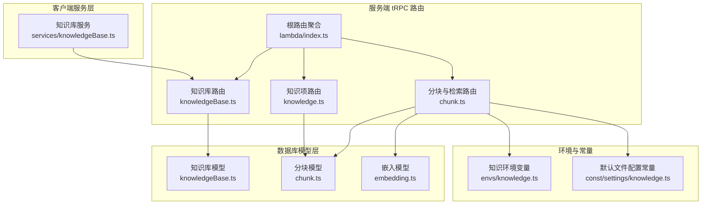
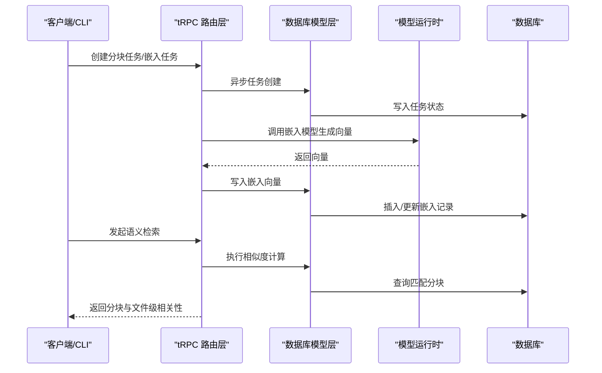
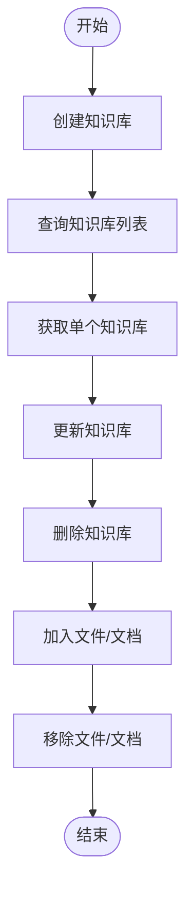
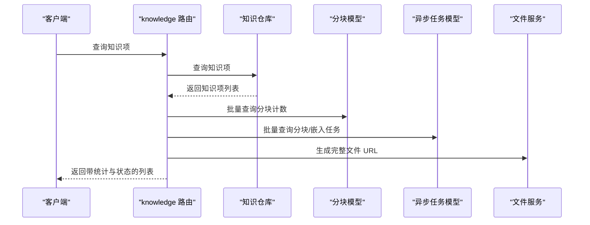
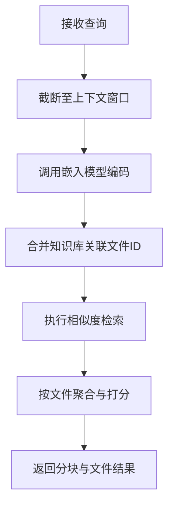
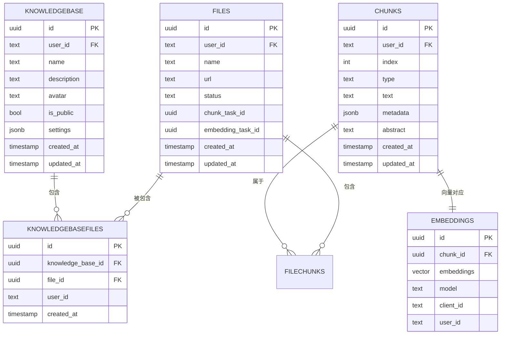
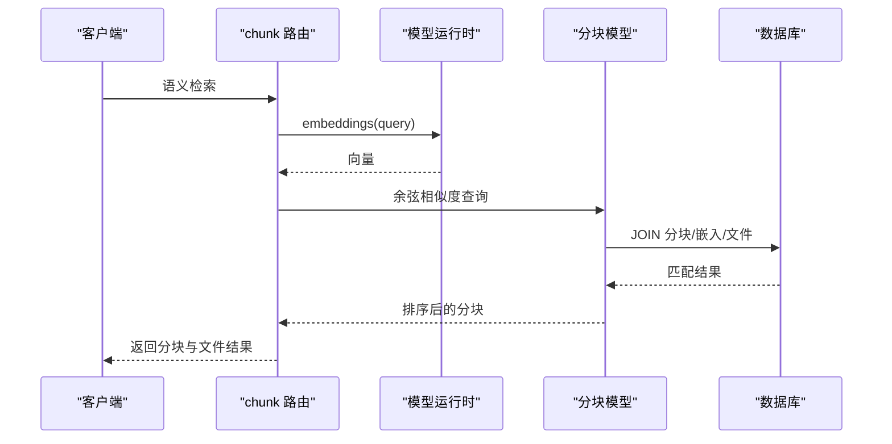
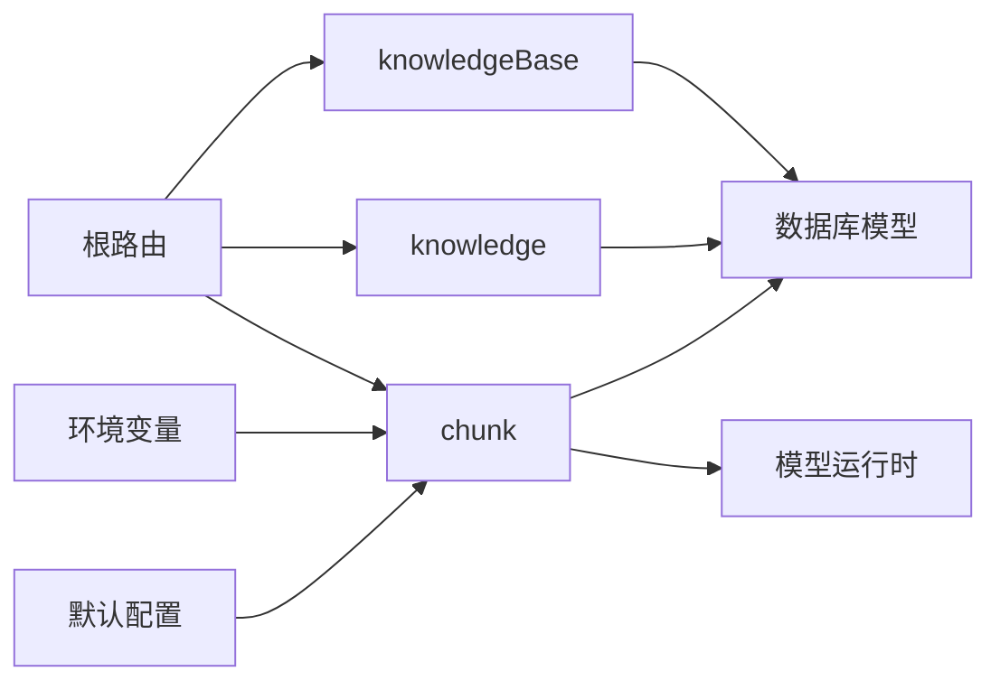

# 知识管理路由模块

<cite>
**本文档引用的文件**
- [src/server/routers/lambda/knowledgeBase.ts](file://src/server/routers/lambda/knowledgeBase.ts)
- [packages/database/src/models/knowledgeBase.ts](file://packages/database/src/models/knowledgeBase.ts)
- [src/services/knowledgeBase.ts](file://src/services/knowledgeBase.ts)
- [src/server/routers/lambda/knowledge.ts](file://src/server/routers/lambda/knowledge.ts)
- [src/server/routers/lambda/chunk.ts](file://src/server/routers/lambda/chunk.ts)
- [packages/database/src/models/chunk.ts](file://packages/database/src/models/chunk.ts)
- [packages/database/src/models/embedding.ts](file://packages/database/src/models/embedding.ts)
- [src/server/routers/lambda/index.ts](file://src/server/routers/lambda/index.ts)
- [src/envs/knowledge.ts](file://src/envs/knowledge.ts)
- [packages/const/src/settings/knowledge.ts](file://packages/const/src/settings/knowledge.ts)
- [apps/cli/src/commands/kb.ts](file://apps/cli/src/commands/kb.ts)
- [apps/cli/src/commands/kb.test.ts](file://apps/cli/src/commands/kb.test.ts)
</cite>

## 目录
1. [简介](#简介)
2. [项目结构](#项目结构)
3. [核心组件](#核心组件)
4. [架构总览](#架构总览)
5. [详细组件分析](#详细组件分析)
6. [依赖关系分析](#依赖关系分析)
7. [性能考虑](#性能考虑)
8. [故障排查指南](#故障排查指南)
9. [结论](#结论)
10. [附录](#附录)

## 简介
本文件为知识管理路由模块的 tRPC 接口文档，覆盖知识库、文档管理、分块与嵌入、语义检索等核心能力。重点说明以下方面：
- 路由定义：knowledge、knowledgeBase、chunk、search（在根路由中聚合）
- 数据模型：知识库、文件/文档、分块、嵌入
- 业务流程：知识入库、索引构建、语义搜索、相似度匹配
- 技术特性：向量化处理、嵌入模型选择、检索优化与预算控制
- 性能与扩展：并发处理、索引设计、错误映射与可观测性

## 项目结构
知识管理相关模块主要分布在服务端 tRPC 路由层、数据库模型层与环境配置层，并通过统一的根路由进行聚合。

**图表来源**
- [src/server/routers/lambda/knowledgeBase.ts](file://src/server/routers/lambda/knowledgeBase.ts#L1-L96)
- [src/server/routers/lambda/knowledge.ts](file://src/server/routers/lambda/knowledge.ts#L1-L96)
- [src/server/routers/lambda/chunk.ts](file://src/server/routers/lambda/chunk.ts#L1-L314)
- [src/server/routers/lambda/index.ts](file://src/server/routers/lambda/index.ts#L56-L107)
- [packages/database/src/models/knowledgeBase.ts](file://packages/database/src/models/knowledgeBase.ts#L1-L162)
- [packages/database/src/models/chunk.ts](file://packages/database/src/models/chunk.ts#L1-L236)
- [packages/database/src/models/embedding.ts](file://packages/database/src/models/embedding.ts#L1-L63)
- [src/envs/knowledge.ts](file://src/envs/knowledge.ts#L1-L18)
- [packages/const/src/settings/knowledge.ts](file://packages/const/src/settings/knowledge.ts#L1-L26)

**章节来源**
- [src/server/routers/lambda/index.ts](file://src/server/routers/lambda/index.ts#L56-L107)

## 核心组件
- 知识库路由（knowledgeBase）：提供知识库的创建、查询、更新、删除、文件增删等操作；支持将文档 ID 解析为镜像文件 ID 并同步更新文档关联。
- 知识项路由（knowledge）：列出知识项，补充分块计数、异步任务状态、嵌入完成标记与文件 URL。
- 分块与检索路由（chunk）：提供解析文件内容、创建分块与嵌入任务、按文件获取分块、语义检索与聊天场景检索。
- 数据模型：知识库模型、分块模型、嵌入模型，负责与数据库交互与查询优化。
- 客户端服务：封装对知识库路由的调用，便于前端或 CLI 使用。

**章节来源**
- [src/server/routers/lambda/knowledgeBase.ts](file://src/server/routers/lambda/knowledgeBase.ts#L20-L96)
- [src/server/routers/lambda/knowledge.ts](file://src/server/routers/lambda/knowledge.ts#L28-L96)
- [src/server/routers/lambda/chunk.ts](file://src/server/routers/lambda/chunk.ts#L88-L314)
- [packages/database/src/models/knowledgeBase.ts](file://packages/database/src/models/knowledgeBase.ts#L8-L162)
- [packages/database/src/models/chunk.ts](file://packages/database/src/models/chunk.ts#L9-L236)
- [packages/database/src/models/embedding.ts](file://packages/database/src/models/embedding.ts#L7-L63)
- [src/services/knowledgeBase.ts](file://src/services/knowledgeBase.ts#L4-L35)

## 架构总览
知识管理的端到端流程包括：文件上传/导入 → 解析为文档 → 分块 → 嵌入向量化 → 检索与排序 → 结果返回。

**图表来源**
- [src/server/routers/lambda/chunk.ts](file://src/server/routers/lambda/chunk.ts#L89-L240)
- [packages/database/src/models/chunk.ts](file://packages/database/src/models/chunk.ts#L139-L220)
- [packages/database/src/models/embedding.ts](file://packages/database/src/models/embedding.ts#L16-L32)

## 详细组件分析

### 知识库路由（knowledgeBase）
- 功能要点
  - 创建知识库：输入名称、描述、头像，返回知识库 ID。
  - 查询知识库列表：按更新时间倒序返回当前用户的知识库。
  - 获取单个知识库：按 ID 查询。
  - 更新知识库：部分字段更新。
  - 删除知识库：支持删除全部或指定 ID。
  - 文件管理：将文件或文档加入/移除知识库；文档 ID 会解析为镜像文件 ID 并同步更新文档关联。
  - 错误处理：捕获 PostgreSQL 唯一约束冲突并映射为 tRPC CONFLICT 错误。
- 输入输出与校验
  - 使用 Zod Schema 对输入参数进行严格校验。
  - 返回值为知识库实体或受影响的行数。
- 事务与一致性
  - 文件加入/移除涉及多表写入，使用模型内部的事务保障一致性。

**图表来源**
- [src/server/routers/lambda/knowledgeBase.ts](file://src/server/routers/lambda/knowledgeBase.ts#L20-L96)
- [packages/database/src/models/knowledgeBase.ts](file://packages/database/src/models/knowledgeBase.ts#L17-L122)

**章节来源**
- [src/server/routers/lambda/knowledgeBase.ts](file://src/server/routers/lambda/knowledgeBase.ts#L20-L96)
- [packages/database/src/models/knowledgeBase.ts](file://packages/database/src/models/knowledgeBase.ts#L8-L162)

### 知识项路由（knowledge）
- 功能要点
  - 列出知识项：根据查询条件过滤，补充分块数量、异步任务状态、嵌入完成标记与文件 URL。
  - 文件项：统计分块数量，查询对应分块与嵌入任务状态，拼装结果。
  - 文档项：直接透传编辑器数据与基础元信息。
- 性能优化
  - 批量查询分块计数与异步任务状态，减少多次往返。
  - 对大对象字段进行延迟加载与必要裁剪。

**图表来源**
- [src/server/routers/lambda/knowledge.ts](file://src/server/routers/lambda/knowledge.ts#L28-L96)
- [packages/database/src/models/chunk.ts](file://packages/database/src/models/chunk.ts#L113-L137)

**章节来源**
- [src/server/routers/lambda/knowledge.ts](file://src/server/routers/lambda/knowledge.ts#L28-L96)

### 分块与检索路由（chunk）
- 功能要点
  - 解析文件内容：对文件进行解析并缓存文档内容与元数据。
  - 创建分块任务：异步解析文件为分块。
  - 创建嵌入任务：异步生成分块向量并写入数据库。
  - 按文件获取分块：分页读取分块列表。
  - 语义检索：将查询文本编码为向量，基于余弦相似度检索匹配分块。
  - 聊天场景检索：支持限定文件集合并按文件聚合相关性评分。
- 模型与配置
  - 默认嵌入模型与提供商来自常量配置。
  - 运行时从数据库读取用户配置，动态初始化模型运行时。
- 错误映射
  - 将提供商 API Key 无效与业务错误映射为 METHOD_NOT_SUPPORTED 与 BAD_REQUEST。
  - 其他未知错误映射为 INTERNAL_SERVER_ERROR。
- 预算与限流
  - 在语义检索中间件中检查预算使用情况。

**图表来源**
- [src/server/routers/lambda/chunk.ts](file://src/server/routers/lambda/chunk.ts#L215-L312)
- [packages/database/src/models/chunk.ts](file://packages/database/src/models/chunk.ts#L174-L220)
- [packages/const/src/settings/knowledge.ts](file://packages/const/src/settings/knowledge.ts#L11-L25)

**章节来源**
- [src/server/routers/lambda/chunk.ts](file://src/server/routers/lambda/chunk.ts#L88-L314)
- [packages/database/src/models/chunk.ts](file://packages/database/src/models/chunk.ts#L139-L220)
- [packages/const/src/settings/knowledge.ts](file://packages/const/src/settings/knowledge.ts#L1-L26)

### 数据模型与关系
- 知识库模型（KnowledgeBaseModel）
  - 支持创建、查询、更新、删除、批量添加/移除文件。
  - 文档 ID 与文件 ID 的映射与同步更新。
- 分块模型（ChunkModel）
  - 批量插入分块与文件分块关联。
  - 统计分块数量、按文件获取分块列表。
  - 语义检索：基于向量列的余弦距离计算相似度。
- 嵌入模型（EmbeddingModel）
  - 向量写入、去重插入、用量统计。

**图表来源**
- [packages/database/src/models/knowledgeBase.ts](file://packages/database/src/models/knowledgeBase.ts#L1-L162)
- [packages/database/src/models/chunk.ts](file://packages/database/src/models/chunk.ts#L1-L236)
- [packages/database/src/models/embedding.ts](file://packages/database/src/models/embedding.ts#L1-L63)

**章节来源**
- [packages/database/src/models/knowledgeBase.ts](file://packages/database/src/models/knowledgeBase.ts#L8-L162)
- [packages/database/src/models/chunk.ts](file://packages/database/src/models/chunk.ts#L9-L236)
- [packages/database/src/models/embedding.ts](file://packages/database/src/models/embedding.ts#L7-L63)

### 搜索与检索接口
- 语义检索（semanticSearch）
  - 输入：可选文件 ID 列表与查询文本。
  - 处理：编码查询为向量，计算与已嵌入分块的余弦相似度，按相似度降序返回。
- 聊天场景检索（semanticSearchForChat）
  - 输入：查询文本、可选文件 ID 列表、知识库 ID 列表、topK。
  - 处理：自动合并知识库关联文件，按文件聚合相关性评分，返回分块与文件结果。
- 文件内容获取（getFileContents）
  - 输入：文件 ID 列表。
  - 处理：解析文件为文档，统计字符/行数，返回预览与元数据。

**图表来源**
- [src/server/routers/lambda/chunk.ts](file://src/server/routers/lambda/chunk.ts#L215-L284)
- [packages/database/src/models/chunk.ts](file://packages/database/src/models/chunk.ts#L139-L220)

**章节来源**
- [src/server/routers/lambda/chunk.ts](file://src/server/routers/lambda/chunk.ts#L215-L312)
- [packages/database/src/models/chunk.ts](file://packages/database/src/models/chunk.ts#L139-L220)

### 环境与配置
- 知识环境变量
  - DEFAULT_FILES_CONFIG：默认文件处理配置。
  - FILE_TYPE_CHUNKING_RULES：文件类型分块规则。
  - UNSTRUCTURED_API_KEY/UNSTRUCTURED_SERVER_URL：非结构化解析服务配置。
- 默认嵌入与重排配置
  - DEFAULT_FILE_EMBEDDING_MODEL_ITEM：默认嵌入模型与提供商。
  - DEFAULT_FILES_CONFIG：包含嵌入模型、查询模式与重排模型。

**章节来源**
- [src/envs/knowledge.ts](file://src/envs/knowledge.ts#L4-L17)
- [packages/const/src/settings/knowledge.ts](file://packages/const/src/settings/knowledge.ts#L11-L25)

### CLI 与服务集成
- CLI 命令
  - kb list：调用知识库列表查询，支持 JSON 输出与表格展示。
- 服务封装
  - knowledgeBaseService：封装知识库路由的 mutate/query 方法，便于上层调用。

**章节来源**
- [apps/cli/src/commands/kb.ts](file://apps/cli/src/commands/kb.ts#L8-L37)
- [apps/cli/src/commands/kb.test.ts](file://apps/cli/src/commands/kb.test.ts#L61-L72)
- [src/services/knowledgeBase.ts](file://src/services/knowledgeBase.ts#L4-L35)

## 依赖关系分析
- 路由聚合
  - 根路由将知识库、知识项、分块、检索等子路由统一挂载。
- 中间件链
  - 认证中间件、数据库中间件、密钥中间件贯穿各路由，确保安全与上下文注入。
- 模型依赖
  - 路由层依赖数据库模型层，模型层依赖 Drizzle ORM 与数据库 schema。
- 运行时依赖
  - 模型运行时按用户配置动态初始化，支持不同提供商与模型。

**图表来源**
- [src/server/routers/lambda/index.ts](file://src/server/routers/lambda/index.ts#L56-L107)
- [src/server/routers/lambda/chunk.ts](file://src/server/routers/lambda/chunk.ts#L24-L42)
- [src/envs/knowledge.ts](file://src/envs/knowledge.ts#L4-L17)
- [packages/const/src/settings/knowledge.ts](file://packages/const/src/settings/knowledge.ts#L11-L25)

**章节来源**
- [src/server/routers/lambda/index.ts](file://src/server/routers/lambda/index.ts#L56-L107)
- [src/server/routers/lambda/chunk.ts](file://src/server/routers/lambda/chunk.ts#L24-L42)

## 性能考虑
- 向量检索
  - 使用余弦距离计算相似度，限制返回条数以控制响应大小。
  - 文件级聚合与打分，避免前端重复计算。
- 并发与批处理
  - 文件内容获取采用并发限制，避免资源争用。
  - 分块与嵌入批量写入，减少事务次数。
- 索引与查询
  - 嵌入向量列具备唯一索引组合，避免重复向量写入。
  - 分块与文件关联查询使用 JOIN 与 LIMIT，保证查询效率。
- 预算与限流
  - 语义检索前检查预算使用，防止超支。

[本节为通用性能建议，不直接分析具体文件]

## 故障排查指南
- 常见错误与映射
  - 提供商 API Key 无效：映射为 METHOD_NOT_SUPPORTED。
  - 提供商业务错误：映射为 BAD_REQUEST。
  - 未知错误：映射为 INTERNAL_SERVER_ERROR。
- 唯一约束冲突
  - 文件已存在于知识库时，捕获 PostgreSQL 唯一约束错误并返回 CONFLICT。
- 日志与可观测性
  - 检索过程记录请求与响应统计，便于定位性能瓶颈。

**章节来源**
- [src/server/routers/lambda/chunk.ts](file://src/server/routers/lambda/chunk.ts#L285-L312)
- [src/server/routers/lambda/knowledgeBase.ts](file://src/server/routers/lambda/knowledgeBase.ts#L20-L40)

## 结论
知识管理路由模块通过清晰的路由分层、严谨的数据模型与中间件链路，实现了从知识入库、索引构建到语义检索的完整闭环。结合环境配置与默认常量，系统具备良好的可扩展性与可维护性。建议在生产环境中配合预算控制、索引优化与并发限制，持续监控检索性能与资源消耗。

## 附录
- 关键流程图与序列图已在相应章节中给出，便于快速理解端到端调用链。
- CLI 与服务封装提供了便捷的外部集成方式。