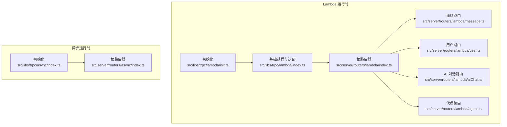
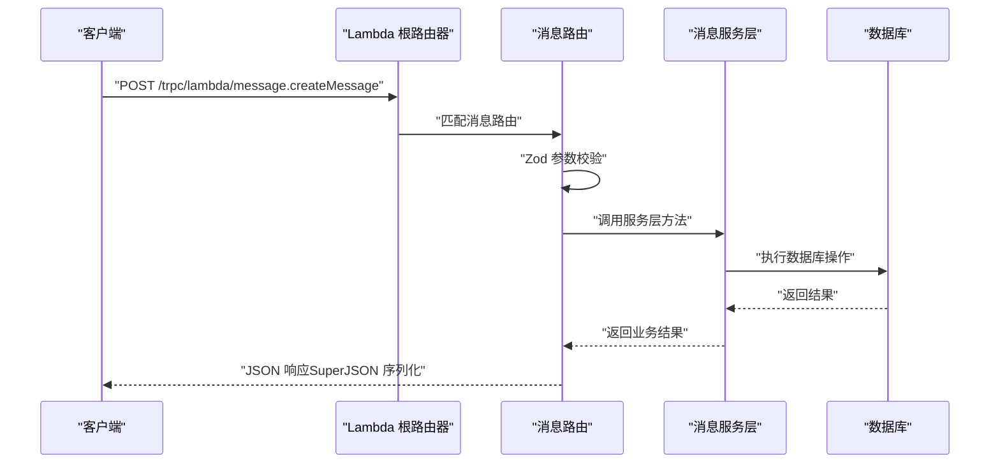
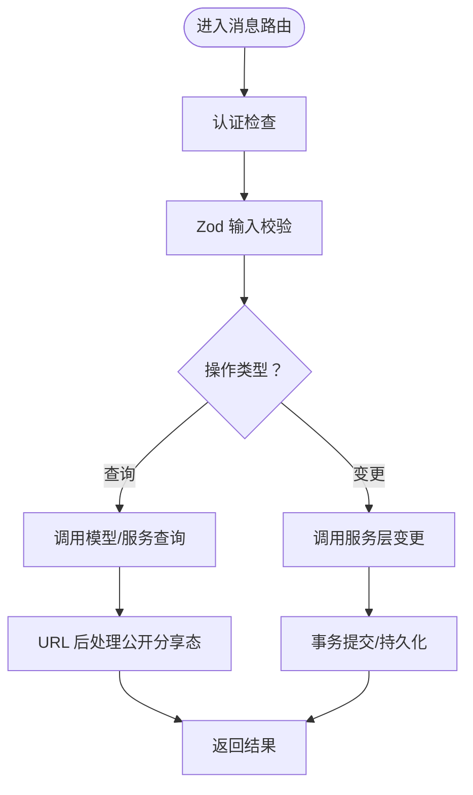
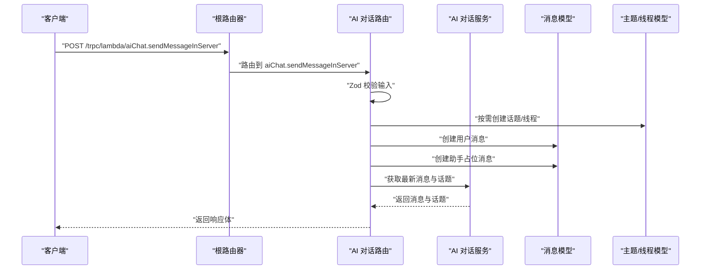

# tRPC 接口规范

<cite>
**本文引用的文件**
- [src/libs/trpc/lambda/init.ts](file://src/libs/trpc/lambda/init.ts)
- [src/libs/trpc/lambda/index.ts](file://src/libs/trpc/lambda/index.ts)
- [src/libs/trpc/async/index.ts](file://src/libs/trpc/async/index.ts)
- [src/server/routers/lambda/index.ts](file://src/server/routers/lambda/index.ts)
- [src/server/routers/lambda/message.ts](file://src/server/routers/lambda/message.ts)
- [src/server/routers/lambda/user.ts](file://src/server/routers/lambda/user.ts)
- [src/server/routers/lambda/agent.ts](file://src/server/routers/lambda/agent.ts)
- [src/server/routers/lambda/aiChat.ts](file://src/server/routers/lambda/aiChat.ts)
- [src/server/routers/async/index.ts](file://src/server/routers/async/index.ts)
- [apps/cli/src/api/client.ts](file://apps/cli/src/api/client.ts)
- [apps/desktop/src/main/controllers/RemoteServerSyncCtr.ts](file://apps/desktop/src/main/controllers/RemoteServerSyncCtr.ts)
- [apps/desktop/src/preload/streamer.test.ts](file://apps/desktop/src/preload/streamer.test.ts)
</cite>

## 目录
1. [简介](#简介)
2. [项目结构](#项目结构)
3. [核心组件](#核心组件)
4. [架构总览](#架构总览)
5. [详细组件分析](#详细组件分析)
6. [依赖关系分析](#依赖关系分析)
7. [性能考量](#性能考量)
8. [故障排查指南](#故障排查指南)
9. [结论](#结论)
10. [附录](#附录)

## 简介
本规范面向 LobeHub 后端的 tRPC 接口，系统性梳理了服务端配置、路由器组织、过程定义（查询/变更/订阅）、参数校验、错误处理、中间件与上下文注入、客户端集成方式、缓存与实时更新策略，并覆盖异步任务、批量操作与流式响应等高级能力。目标是帮助开发者准确理解并高效使用 tRPC 实现前后端类型安全通信。

## 项目结构
LobeHub 将 tRPC 分为两类运行时：
- Lambda 运行时：用于主业务路由（如消息、用户、代理、AI 对话等），统一通过根路由器聚合。
- 异步运行时：用于后台任务、文件处理、RAG 评估等异步流程，提供独立的路由器与调用器。

图表来源
- [src/libs/trpc/lambda/init.ts](file://src/libs/trpc/lambda/init.ts#L1-L34)
- [src/libs/trpc/lambda/index.ts](file://src/libs/trpc/lambda/index.ts#L1-L38)
- [src/server/routers/lambda/index.ts](file://src/server/routers/lambda/index.ts#L1-L110)
- [src/server/routers/lambda/message.ts](file://src/server/routers/lambda/message.ts#L1-L495)
- [src/server/routers/lambda/user.ts](file://src/server/routers/lambda/user.ts#L1-L230)
- [src/server/routers/lambda/aiChat.ts](file://src/server/routers/lambda/aiChat.ts#L1-L190)
- [src/server/routers/lambda/agent.ts](file://src/server/routers/lambda/agent.ts#L1-L370)
- [src/libs/trpc/async/index.ts](file://src/libs/trpc/async/index.ts#L1-L34)
- [src/server/routers/async/index.ts](file://src/server/routers/async/index.ts#L1-L18)

章节来源
- [src/server/routers/lambda/index.ts](file://src/server/routers/lambda/index.ts#L1-L110)
- [src/server/routers/async/index.ts](file://src/server/routers/async/index.ts#L1-L18)

## 核心组件
- 初始化与数据转换
  - 使用 initTRPC 创建实例，启用 SuperJSON 数据转换器，统一错误格式化（保留底层错误的 data 字段）。
- 基础过程与中间件
  - 公共过程：默认注入 OpenTelemetry 中间件。
  - 已认证过程：在公共基础上叠加 OIDC 与用户认证中间件。
  - 提供 createCallerFactory 以支持服务端侧调用。
- 异步运行时
  - 提供公共过程、已认证过程与数据库中间件（自动注入 serverDB 上下文），以及 createAsyncCallerFactory。

章节来源
- [src/libs/trpc/lambda/init.ts](file://src/libs/trpc/lambda/init.ts#L15-L33)
- [src/libs/trpc/lambda/index.ts](file://src/libs/trpc/lambda/index.ts#L26-L37)
- [src/libs/trpc/async/index.ts](file://src/libs/trpc/async/index.ts#L10-L33)

## 架构总览
tRPC 在 LobeHub 的整体架构如下：
- 客户端通过 HTTP 链接调用后端接口，请求被路由到对应路由器下的过程。
- 每个过程可附加多个中间件（认证、数据库连接、OpenTelemetry 等），并在上下文中注入服务层对象。
- 错误通过统一格式化器返回，必要时携带底层错误数据。

图表来源
- [src/server/routers/lambda/message.ts](file://src/server/routers/lambda/message.ts#L135-L146)
- [src/libs/trpc/lambda/init.ts](file://src/libs/trpc/lambda/init.ts#L15-L33)

## 详细组件分析

### Lambda 根路由器与模块化组织
- 根路由器将各功能模块（消息、用户、代理、AI 对话、知识库、市场、上传等）聚合为树状命名空间。
- 每个模块导出独立的 router 并在根路由器中注册，便于按功能拆分与维护。
- 提供健康检查公开查询端点，便于运维监控。

章节来源
- [src/server/routers/lambda/index.ts](file://src/server/routers/lambda/index.ts#L56-L107)

### 消息模块（message）
- 功能概览
  - 支持消息创建、删除、批量删除、更新元数据与插件状态、翻译、TTS、工具参数更新、压缩与归档等。
  - 支持公开分享态读取（通过分享 ID 访问），并自动注入文件 URL 处理回调。
- 过程类型与典型端点
  - 查询类：计数、词数统计、热力图、按条件检索、公开分享态读取。
  - 变更类：创建消息、删除单条或多条、取消/完成压缩组、更新多种字段、添加文件、工具消息合并更新等。
- 参数校验
  - 使用 Zod Schema 对输入进行严格校验，例如创建消息使用专用 Schema，更新插件状态使用部分模式 Schema。
- 错误处理
  - 认证要求场景抛出 UNAUTHORIZED；用户名冲突抛出 CONFLICT；其他错误通过统一格式化器返回。
- 中间件与上下文
  - 使用 authedProcedure 并注入 CompressionRepository、FileService、MessageModel、MessageService 等。

图表来源
- [src/server/routers/lambda/message.ts](file://src/server/routers/lambda/message.ts#L34-L494)

章节来源
- [src/server/routers/lambda/message.ts](file://src/server/routers/lambda/message.ts#L1-L495)

### 用户模块（user）
- 功能概览
  - 获取用户初始化状态（含引导、偏好、订阅计划、推荐状态等），更新头像（支持 Base64 上传至 S3）、全名、兴趣、设置、偏好、用户名等。
- 参数校验与约束
  - 用户名长度、字符集限制；全名长度限制；设置/偏好使用强类型 Schema。
- 业务逻辑
  - 头像更新：若为 Base64 则上传至 S3 并替换旧头像；否则直接更新 URL。
  - 用户名冲突检测与冲突错误码。
- 性能优化
  - 并行查询用户状态、消息计数、会话数量、推荐与订阅信息，减少往返次数。

章节来源
- [src/server/routers/lambda/user.ts](file://src/server/routers/lambda/user.ts#L1-L230)

### 代理模块（agent）
- 功能概览
  - 代理创建（含仅创建实体或同时创建会话）、复制、查询内置代理、获取/更新代理配置、分配/切换知识库与文件、查询非虚拟代理列表、置顶/取消置顶等。
- 关键流程
  - 创建代理：先创建会话，再从会话解析出代理 ID 返回。
  - 获取代理配置：对收件箱特殊处理（无会话则创建）。
  - 知识库与文件分配：支持启用/禁用切换与批量管理。
- 参数校验
  - 使用 Zod 对输入进行严格约束，如创建配置的 Schema 采用 passthrough 与 partial 组合以兼容扩展字段。

章节来源
- [src/server/routers/lambda/agent.ts](file://src/server/routers/lambda/agent.ts#L1-L370)

### AI 对话模块（aiChat）
- 功能概览
  - 结构化输出生成（JSON Schema 校验输出）。
  - 服务端发送消息：根据输入自动创建话题/线程，插入用户与助手消息，并返回最新消息与话题集合。
- 流程要点
  - 新建话题/线程：依据输入标志位决定是否创建，并回填 ID。
  - 插入消息：用户消息与助手占位消息分别创建，助手消息初始内容为加载标记。
  - 输出封装：返回用户消息 ID、助手消息 ID、是否新建话题、创建的线程 ID、消息与话题结果集。

图表来源
- [src/server/routers/lambda/aiChat.ts](file://src/server/routers/lambda/aiChat.ts#L56-L188)

章节来源
- [src/server/routers/lambda/aiChat.ts](file://src/server/routers/lambda/aiChat.ts#L1-L190)

### 异步运行时（async）
- 组织结构
  - 提供公共与已认证过程，以及数据库中间件（自动注入 serverDB）。
  - 聚合文件、图片、RAG 评估等异步任务路由。
- 调用器
  - 提供 createAsyncCallerFactory，便于服务端侧调用异步过程。

章节来源
- [src/libs/trpc/async/index.ts](file://src/libs/trpc/async/index.ts#L1-L34)
- [src/server/routers/async/index.ts](file://src/server/routers/async/index.ts#L1-L18)

## 依赖关系分析
- 路由器到服务层
  - 各路由在 authedProcedure 中间链路注入具体模型与服务实例，形成“路由 -> 服务 -> 模型”的清晰分层。
- 中间件链
  - 公共过程：OpenTelemetry。
  - 已认证过程：OIDC 认证 -> 用户认证 -> 数据库上下文注入。
- 错误传播
  - 统一错误格式化器保留底层错误的 data 字段，便于前端识别业务错误详情。

图表来源
- [src/libs/trpc/lambda/init.ts](file://src/libs/trpc/lambda/init.ts#L15-L33)
- [src/libs/trpc/lambda/index.ts](file://src/libs/trpc/lambda/index.ts#L26-L31)
- [src/server/routers/lambda/message.ts](file://src/server/routers/lambda/message.ts#L21-L32)

章节来源
- [src/libs/trpc/lambda/init.ts](file://src/libs/trpc/lambda/init.ts#L15-L33)
- [src/libs/trpc/lambda/index.ts](file://src/libs/trpc/lambda/index.ts#L26-L31)
- [src/server/routers/lambda/message.ts](file://src/server/routers/lambda/message.ts#L21-L32)

## 性能考量
- 数据传输
  - 使用 SuperJSON 作为数据转换器，提升复杂类型序列化效率与一致性。
- 并行查询
  - 用户状态聚合中并行执行多项查询，降低 RTT。
- 中间件开销
  - OpenTelemetry 中间件为每个过程注入追踪，建议在生产环境开启采样策略以控制开销。
- 批量与流式
  - 当前消息与用户路由未见显式批量接口；异步路由提供后台任务入口，适合批量/流式处理场景。

章节来源
- [src/libs/trpc/lambda/init.ts](file://src/libs/trpc/lambda/init.ts#L32-L33)
- [src/server/routers/lambda/user.ts](file://src/server/routers/lambda/user.ts#L75-L82)

## 故障排查指南
- 认证失败
  - 现象：返回 UNAUTHORIZED。
  - 排查：确认 OIDC 与用户认证中间件是否正确注入；检查访问令牌有效性。
- 资源冲突
  - 现象：用户名冲突返回 CONFLICT。
  - 排查：检查用户名唯一性约束与业务层冲突检测逻辑。
- 参数校验失败
  - 现象：Zod 校验报错。
  - 排查：对照各路由的输入 Schema，逐项核对必填与类型。
- 错误详情丢失
  - 现象：错误未携带底层 data。
  - 排查：确认错误格式化器是否正确传递 error.cause.data。

章节来源
- [src/server/routers/lambda/message.ts](file://src/server/routers/lambda/message.ts#L210-L212)
- [src/server/routers/lambda/user.ts](file://src/server/routers/lambda/user.ts#L221-L225)
- [src/libs/trpc/lambda/init.ts](file://src/libs/trpc/lambda/init.ts#L19-L28)

## 结论
LobeHub 的 tRPC 实践体现了清晰的分层与模块化设计：以 initTRPC 为基础，通过中间件链实现认证与可观测性，以路由器聚合业务域，以服务层承载业务逻辑。配合严格的参数校验与统一错误格式化，实现了类型安全与高可靠性的前后端通信。异步运行时进一步拓展了后台任务与流式处理能力，满足复杂业务场景需求。

## 附录

### 客户端集成示例（CLI）
- 客户端类型
  - 使用 createTRPCClient 并指定链接地址，类型由 Lambda 路由器推断。
- 链接地址
  - 通过环境变量拼接 /trpc/lambda 路径，确保与后端路由一致。

章节来源
- [apps/cli/src/api/client.ts](file://apps/cli/src/api/client.ts#L10-L33)

### 桌面端集成与流式请求
- 桌面端通过 IPC 代理 tRPC 请求，支持流式场景与远程服务器同步。
- 单元测试覆盖了不同 URL 路径与批处理参数的行为。

章节来源
- [apps/desktop/src/main/controllers/RemoteServerSyncCtr.ts](file://apps/desktop/src/main/controllers/RemoteServerSyncCtr.ts#L52-L101)
- [apps/desktop/src/preload/streamer.test.ts](file://apps/desktop/src/preload/streamer.test.ts#L34-L142)