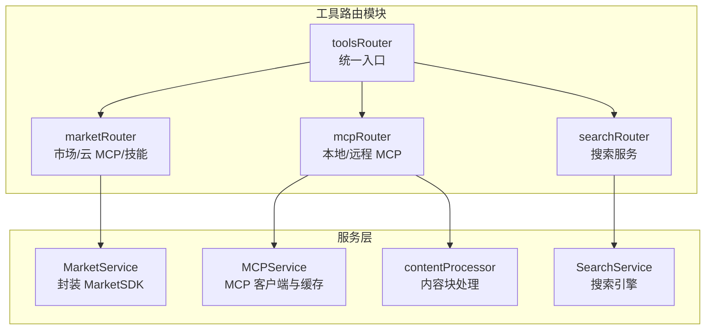
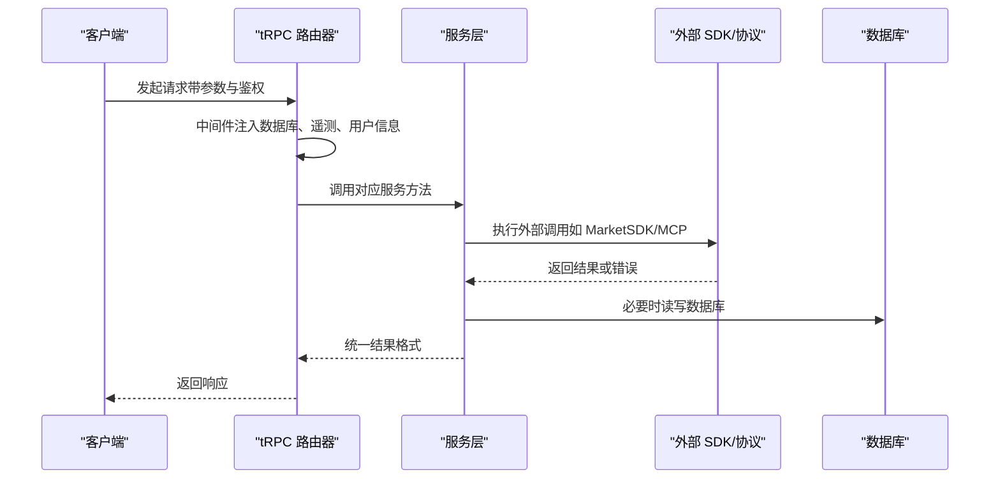
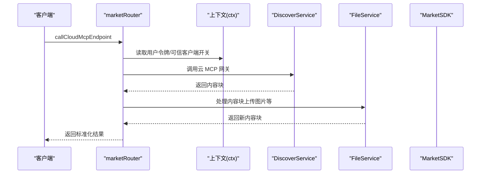
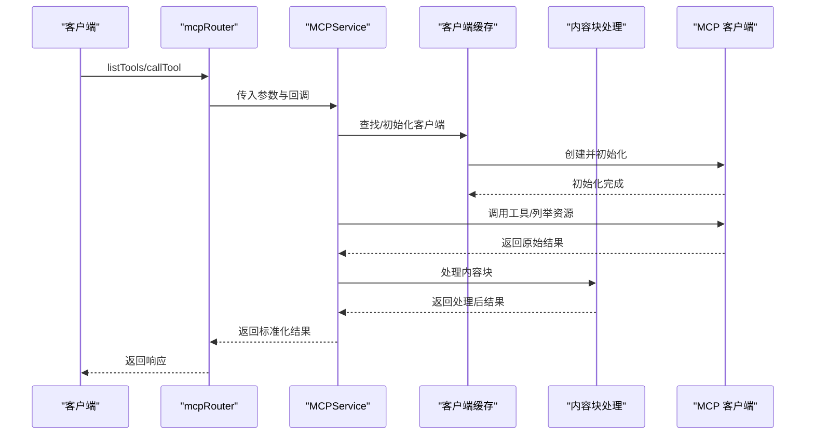
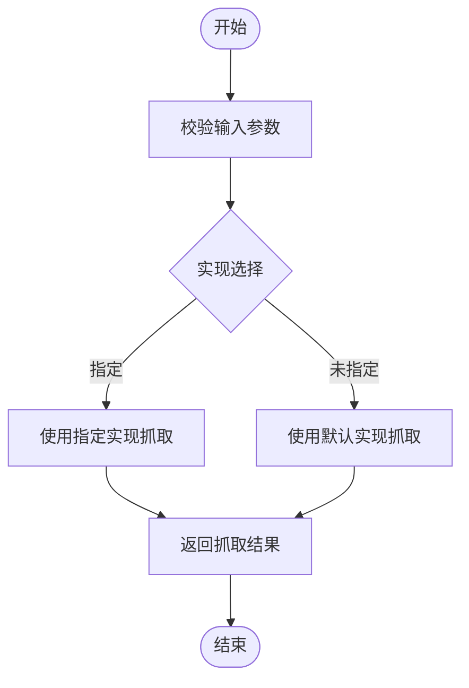
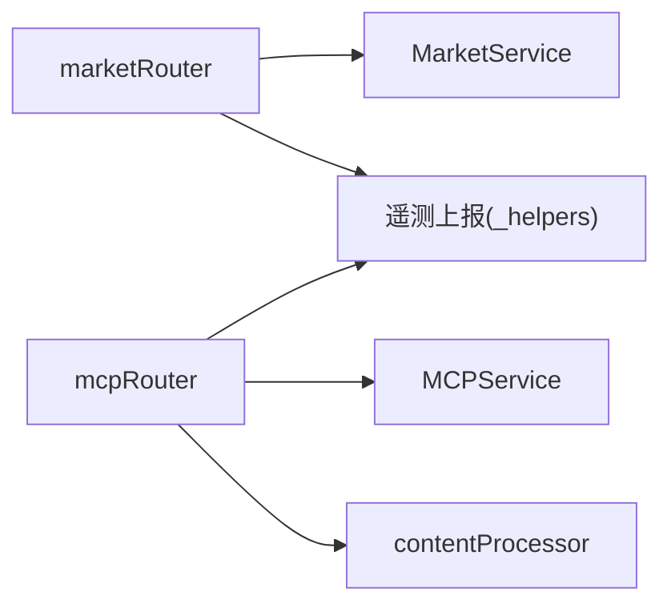

# 工具路由模块

<cite>
**本文引用的文件**
- [src/server/routers/tools/index.ts](file://src/server/routers/tools/index.ts)
- [src/server/routers/tools/market.ts](file://src/server/routers/tools/market.ts)
- [src/server/routers/tools/mcp.ts](file://src/server/routers/tools/mcp.ts)
- [src/server/routers/tools/search.ts](file://src/server/routers/tools/search.ts)
- [src/server/services/mcp/index.ts](file://src/server/services/mcp/index.ts)
- [src/server/services/market/index.ts](file://src/server/services/market/index.ts)
- [src/server/services/mcp/contentProcessor.ts](file://src/server/services/mcp/contentProcessor.ts)
- [src/server/services/mcp/deps.ts](file://src/server/services/mcp/deps.ts)
- [src/server/services/search/index.ts](file://src/server/services/search/index.ts)
- [src/server/routers/tools/_helpers.ts](file://src/server/routers/tools/_helpers.ts)
- [apps/desktop/src/main/controllers/ToolDetectorCtr.ts](file://apps/desktop/src/main/controllers/ToolDetectorCtr.ts)
- [packages/context-engine/src/engine/tools/__tests__/ToolResolver.test.ts](file://packages/context-engine/src/engine/tools/__tests__/ToolResolver.test.ts)
- [docs/usage/community/mcp-market.mdx](file://docs/usage/community/mcp-market.mdx)
</cite>

## 目录
1. [简介](#简介)
2. [项目结构](#项目结构)
3. [核心组件](#核心组件)
4. [架构总览](#架构总览)
5. [详细组件分析](#详细组件分析)
6. [依赖关系分析](#依赖关系分析)
7. [性能考量](#性能考量)
8. [故障排查指南](#故障排查指南)
9. [结论](#结论)
10. [附录](#附录)

## 简介
本文件为工具路由模块的 tRPC 接口文档，覆盖工具市场、MCP 协议、搜索功能等工具相关接口的规范与实现细节。内容包括：
- 工具的注册、发现、调用流程与生命周期管理
- MCP 协议的实现要点（连接类型、认证、资源/提示/工具列举、工具调用）
- 工具分类体系、评分与版本管理的现状与建议
- 工具开发指南、接口集成示例与最佳实践
- 安全性考虑、权限控制与性能监控

## 项目结构
工具路由模块位于后端服务层，通过 tRPC 路由器聚合多个子模块：
- tools 路由：统一入口，包含健康检查、市场、MCP、搜索等子路由
- market 子路由：对接 LobeHub 市场 SDK，支持云 MCP 网关调用、技能工具调用、连接管理、文件导出上传等
- mcp 子路由：封装 MCP 客户端，支持 HTTP/STDIO 连接、工具/资源/提示列举、工具调用
- search 子路由：提供网页搜索、查询与页面抓取能力

图表来源
- [src/server/routers/tools/index.ts](file://src/server/routers/tools/index.ts#L1-L17)
- [src/server/routers/tools/market.ts](file://src/server/routers/tools/market.ts#L1-L680)
- [src/server/routers/tools/mcp.ts](file://src/server/routers/tools/mcp.ts#L1-L182)
- [src/server/routers/tools/search.ts](file://src/server/routers/tools/search.ts#L1-L53)

章节来源
- [src/server/routers/tools/index.ts](file://src/server/routers/tools/index.ts#L1-L17)

## 核心组件
- toolsRouter：聚合所有工具相关路由，提供健康检查与子模块入口
- marketRouter：面向用户态的工具市场与云 MCP 网关调用，包含技能工具调用、连接授权、文件导出上传等功能
- mcpRouter：面向 MCP 协议的客户端封装，支持 HTTP/STDIO 参数校验、工具/资源/提示列举、工具调用与内容块处理
- searchRouter：提供网页搜索、查询与页面抓取能力

章节来源
- [src/server/routers/tools/index.ts](file://src/server/routers/tools/index.ts#L8-L14)
- [src/server/routers/tools/market.ts](file://src/server/routers/tools/market.ts#L137-L680)
- [src/server/routers/tools/mcp.ts](file://src/server/routers/tools/mcp.ts#L77-L182)
- [src/server/routers/tools/search.ts](file://src/server/routers/tools/search.ts#L8-L53)

## 架构总览
工具路由模块采用“路由器 + 服务层”的分层设计：
- 路由器负责输入校验、中间件注入（数据库、遥测、用户信息）与业务编排
- 服务层封装外部 SDK 与内部逻辑，提供可复用的能力（如 MarketSDK、MCP 客户端缓存、内容块处理）

图表来源
- [src/server/routers/tools/market.ts](file://src/server/routers/tools/market.ts#L27-L50)
- [src/server/routers/tools/mcp.ts](file://src/server/routers/tools/mcp.ts#L66-L75)
- [src/server/services/market/index.ts](file://src/server/services/market/index.ts#L77-L102)
- [src/server/services/mcp/index.ts](file://src/server/services/mcp/index.ts#L52-L56)

## 详细组件分析

### marketRouter：工具市场与云 MCP 网关
- 认证与上下文
  - 使用已认证过程，注入数据库、遥测、用户信息，并构建 DiscoverService、MarketService、FileService
- 关键接口
  - 云 MCP 网关调用：支持可信客户端与用户令牌两种模式；失败时抛出 TRPCError；调用后进行内容块处理与字符串化
  - 代码解释器工具调用：支持 execScript 的 zipUrl 注入；返回标准化结果结构
  - 技能工具调用：基于 MarketSDK 的技能工具调用，处理未连接/过期等错误
  - 连接管理：授权 URL 获取、状态查询、列表、刷新、撤销
  - 文件导出上传：在沙箱中导出文件并上传至 S3，生成永久链接并创建文件记录

图表来源
- [src/server/routers/tools/market.ts](file://src/server/routers/tools/market.ts#L139-L227)
- [src/server/services/market/index.ts](file://src/server/services/market/index.ts#L267-L278)
- [src/server/services/mcp/contentProcessor.ts](file://src/server/services/mcp/contentProcessor.ts)

章节来源
- [src/server/routers/tools/market.ts](file://src/server/routers/tools/market.ts#L27-L50)
- [src/server/routers/tools/market.ts](file://src/server/routers/tools/market.ts#L139-L227)
- [src/server/routers/tools/market.ts](file://src/server/routers/tools/market.ts#L229-L341)
- [src/server/routers/tools/market.ts](file://src/server/routers/tools/market.ts#L343-L584)
- [src/server/routers/tools/market.ts](file://src/server/routers/tools/market.ts#L586-L679)

### mcpRouter：MCP 协议实现
- 参数校验
  - HTTP/STDIO 参数分别定义 Zod 模式；STDIO 在非桌面环境直接拒绝
- 关键接口
  - 列举工具/资源/提示：将参数传递给 MCPService，内部使用客户端缓存与重试策略
  - 调用工具：绑定文件服务与用户上下文，处理内容块并上报遥测
  - 获取可流式的 MCP 插件清单：根据工具列表生成插件清单

图表来源
- [src/server/routers/tools/mcp.ts](file://src/server/routers/tools/mcp.ts#L90-L132)
- [src/server/services/mcp/index.ts](file://src/server/services/mcp/index.ts#L92-L134)
- [src/server/services/mcp/index.ts](file://src/server/services/mcp/index.ts#L211-L280)

章节来源
- [src/server/routers/tools/mcp.ts](file://src/server/routers/tools/mcp.ts#L18-L44)
- [src/server/routers/tools/mcp.ts](file://src/server/routers/tools/mcp.ts#L77-L182)
- [src/server/services/mcp/index.ts](file://src/server/services/mcp/index.ts#L52-L56)
- [src/server/services/mcp/index.ts](file://src/server/services/mcp/index.ts#L92-L134)
- [src/server/services/mcp/index.ts](file://src/server/services/mcp/index.ts#L211-L280)

### searchRouter：搜索功能
- 页面抓取：支持多种实现（browserless、exa、firecrawl、jina、naive、search1api、tavily），批量抓取指定 URL
- 查询：支持可选参数（搜索类别、引擎、时间范围）
- 网页搜索：统一查询入口，封装不同搜索引擎

图表来源
- [src/server/routers/tools/search.ts](file://src/server/routers/tools/search.ts#L9-L21)
- [src/server/routers/tools/search.ts](file://src/server/routers/tools/search.ts#L23-L38)
- [src/server/routers/tools/search.ts](file://src/server/routers/tools/search.ts#L40-L52)

章节来源
- [src/server/routers/tools/search.ts](file://src/server/routers/tools/search.ts#L8-L53)

### MCP 安装检查与系统依赖
- 支持多部署选项的安装检查，推荐满足依赖的选项；必要时返回配置 schema
- 用于桌面端 MCP 插件安装前的系统依赖验证

章节来源
- [src/server/services/mcp/index.ts](file://src/server/services/mcp/index.ts#L430-L486)
- [src/server/services/mcp/deps.ts](file://src/server/services/mcp/deps.ts)

### 工具检测与分类（桌面端）
- 提供工具检测、分类查询、按分类获取工具等 IPC 接口，便于前端展示工具可用性

章节来源
- [apps/desktop/src/main/controllers/ToolDetectorCtr.ts](file://apps/desktop/src/main/controllers/ToolDetectorCtr.ts#L14-L115)

## 依赖关系分析
- 路由器到服务层：marketRouter/mcpRouter 通过中间件注入上下文，调用 MarketService/MCPService
- 服务层到外部 SDK：MarketService 封装 MarketSDK；MCPService 封装 MCPClient 并维护客户端缓存
- 内容处理：mcpRouter 调用 contentProcessor 对工具调用结果的内容块进行处理（如上传图片）
- 遥测上报：各路由在 finally 中调用调度函数上报工具调用报告

图表来源
- [src/server/routers/tools/market.ts](file://src/server/routers/tools/market.ts#L139-L227)
- [src/server/routers/tools/mcp.ts](file://src/server/routers/tools/mcp.ts#L133-L180)
- [src/server/routers/tools/_helpers.ts](file://src/server/routers/tools/_helpers.ts)

章节来源
- [src/server/routers/tools/market.ts](file://src/server/routers/tools/market.ts#L139-L227)
- [src/server/routers/tools/mcp.ts](file://src/server/routers/tools/mcp.ts#L133-L180)
- [src/server/routers/tools/_helpers.ts](file://src/server/routers/tools/_helpers.ts)

## 性能考量
- 客户端缓存：MCPService 维护客户端实例缓存，避免重复初始化
- 重试策略：列举工具时对特定错误进行有限次数重试，提升稳定性
- 内容块处理：仅在需要时处理内容块（如上传图片），减少不必要的 IO
- 遥测上报：统一在 finally 中上报，确保性能指标统计完整

章节来源
- [src/server/services/mcp/index.ts](file://src/server/services/mcp/index.ts#L52-L56)
- [src/server/services/mcp/index.ts](file://src/server/services/mcp/index.ts#L96-L134)
- [src/server/routers/tools/mcp.ts](file://src/server/routers/tools/mcp.ts#L133-L180)

## 故障排查指南
- MCP 客户端初始化失败
  - 可能原因：命令不可执行、网络不通、认证失败
  - 处理方式：查看日志中的详细错误信息；确认 STDIO 命令与参数；检查 HTTP 认证头
- 工具调用异常
  - 可能原因：MCP 错误、参数解析失败、内容块处理失败
  - 处理方式：捕获 McpError 并返回标准化错误；确保参数 JSON 可解析；检查文件服务可用性
- 市场调用失败
  - 可能原因：用户令牌缺失、提供商未连接/过期
  - 处理方式：检查可信客户端开关与用户令牌；重新授权或刷新令牌

章节来源
- [src/server/services/mcp/index.ts](file://src/server/services/mcp/index.ts#L254-L280)
- [src/server/routers/tools/market.ts](file://src/server/routers/tools/market.ts#L375-L393)
- [src/server/routers/tools/mcp.ts](file://src/server/routers/tools/mcp.ts#L37-L44)

## 结论
工具路由模块以清晰的分层设计实现了工具市场、MCP 协议与搜索能力的统一接入。通过服务层封装外部 SDK 与内部逻辑，结合客户端缓存、重试与内容块处理，提供了稳定且可扩展的工具调用体验。未来可在工具分类体系、评分与版本管理方面进一步完善，以提升工具生态的治理与用户体验。

## 附录

### 工具开发指南与最佳实践
- MCP 开发
  - 使用 STDIO/HTTP 两种连接方式，优先使用 HTTP 以便多用户共享
  - 明确工具输入参数 Schema，确保参数可序列化与可验证
  - 实现健壮的错误处理，区分业务错误与系统错误
- 市场集成
  - 通过 MarketSDK 提供技能工具与连接管理，遵循授权与刷新流程
  - 导出文件时使用预签名 URL 并在完成后创建持久化文件记录
- 搜索集成
  - 根据场景选择合适的抓取实现，注意并发与超时控制
  - 合理设置查询参数（类别、引擎、时间范围），提升检索质量

章节来源
- [docs/usage/community/mcp-market.mdx](file://docs/usage/community/mcp-market.mdx#L1-L200)
- [src/server/routers/tools/market.ts](file://src/server/routers/tools/market.ts#L586-L679)
- [src/server/routers/tools/search.ts](file://src/server/routers/tools/search.ts#L9-L52)

### 工具分类体系、评分与版本管理
- 分类体系
  - 市场文档中按“开发、生产力、数据与分析、云服务、文件系统、通信、搜索与知识”等维度组织 MCP 插件
- 评分与版本
  - 当前实现未见内置评分与版本管理逻辑；建议在 MarketSDK 层引入评分字段与版本号，便于排序与回滚

章节来源
- [docs/usage/community/mcp-market.mdx](file://docs/usage/community/mcp-market.mdx#L165-L180)

### 安全性考虑与权限控制
- 连接级权限：仅允许已批准服务器连接，首次连接需审核，可随时撤销
- 工具级权限：可启用/禁用特定工具，区分只读与读写，破坏性操作需审批
- 资源级权限：限制目录/数据库访问，限制敏感数据，保留审计日志
- 最佳实践：仅从可信来源安装 MCP 插件；首次使用只读权限；定期轮换密钥；测试环境先行

章节来源
- [docs/usage/community/mcp-market.mdx](file://docs/usage/community/mcp-market.mdx#L414-L450)

### 工具生命周期管理
- 注册：通过 MarketSDK 或 MCP 客户端注册工具清单
- 发现：列举工具/资源/提示，生成插件清单
- 调用：绑定文件服务与用户上下文，处理内容块并上报遥测
- 卸载/撤销：支持撤销连接与清理缓存

章节来源
- [src/server/services/mcp/index.ts](file://src/server/services/mcp/index.ts#L348-L428)
- [src/server/routers/tools/mcp.ts](file://src/server/routers/tools/mcp.ts#L133-L180)
- [src/server/services/market/index.ts](file://src/server/services/market/index.ts#L267-L278)