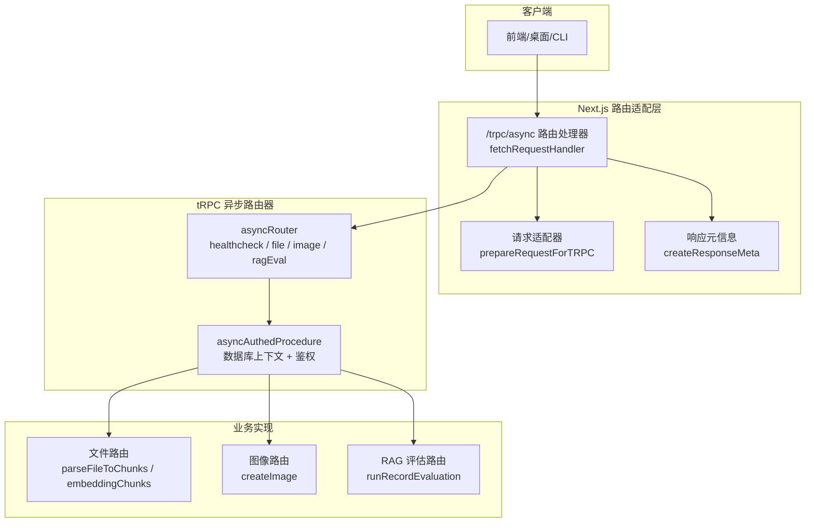
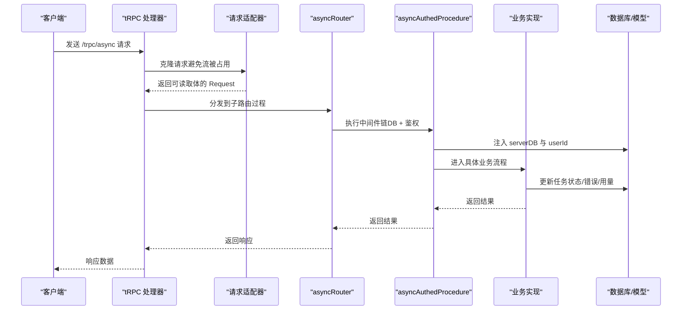
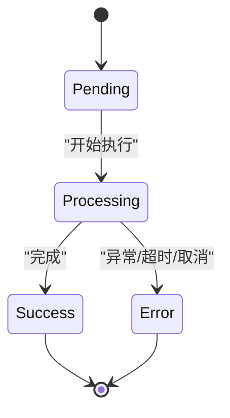
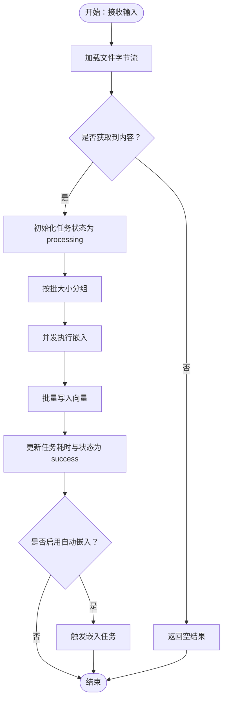
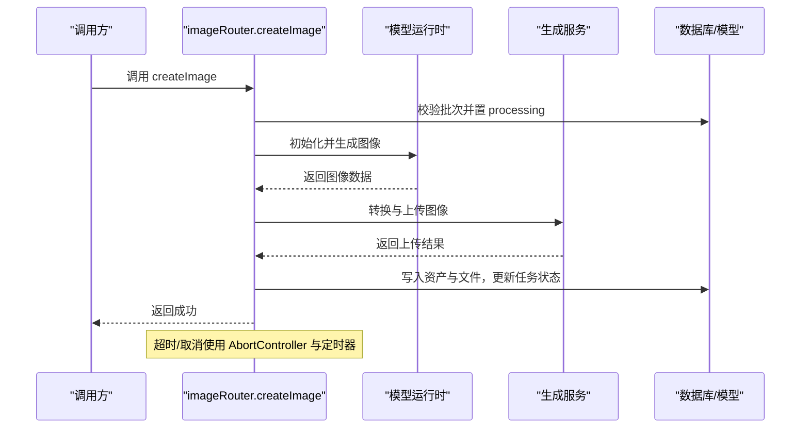
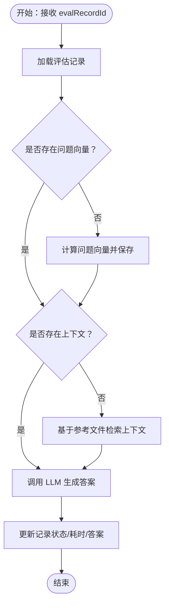
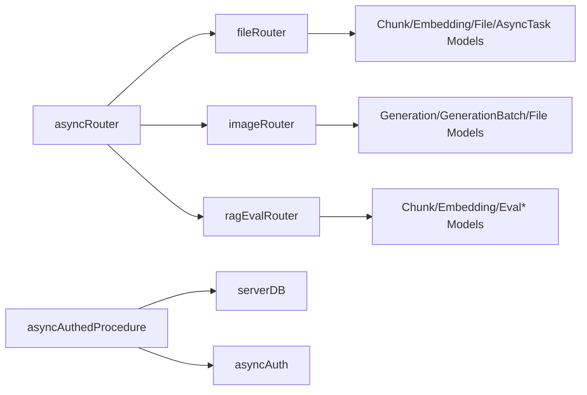

# 异步路由模块

<cite>
**本文引用的文件**
- [src/app/(backend)/trpc/async/[trpc]/route.ts](file://src/app/(backend)/trpc/async/[trpc]/route.ts)
- [src/libs/trpc/utils/request-adapter.ts](file://src/libs/trpc/utils/request-adapter.ts)
- [src/libs/trpc/async/index.ts](file://src/libs/trpc/async/index.ts)
- [src/libs/trpc/async/context.ts](file://src/libs/trpc/async/context.ts)
- [src/libs/trpc/async/asyncAuth.ts](file://src/libs/trpc/async/asyncAuth.ts)
- [src/server/routers/async/index.ts](file://src/server/routers/async/index.ts)
- [src/server/routers/async/file.ts](file://src/server/routers/async/file.ts)
- [src/server/routers/async/image.ts](file://src/server/routers/async/image.ts)
- [src/server/routers/async/ragEval.ts](file://src/server/routers/async/ragEval.ts)
- [src/server/routers/async/caller.ts](file://src/server/routers/async/caller.ts)
- [packages/types/src/asyncTask.ts](file://packages/types/src/asyncTask.ts)
- [src/envs/file.ts](file://src/envs/file.ts)
- [src/config/db.ts](file://src/config/db.ts)
</cite>

## 目录

1. [简介](#简介)
2. [项目结构](#项目结构)
3. [核心组件](#核心组件)
4. [架构总览](#架构总览)
5. [详细组件分析](#详细组件分析)
6. [依赖关系分析](#依赖关系分析)
7. [性能考量](#性能考量)
8. [故障排查指南](#故障排查指南)
9. [结论](#结论)
10. [附录](#附录)

## 简介

本文件为异步路由模块的 tRPC 接口文档，聚焦以下能力：

- 异步任务生命周期管理：创建、状态跟踪、超时与错误恢复
- 文件上传与解析：分片切分、并发嵌入、进度与错误处理
- 图像生成：异步调度、超时与中断、错误分类与恢复
- RAG 评估：问答向量化检索与 LLM 评分流程
- 调度策略、重试机制与资源管理：超时、并发、批量大小、AbortController、数据库事务与中间件

该模块通过独立的 tRPC 路由端点暴露能力，并在服务端以内部 JWT 与加密头进行鉴权，确保跨进程 / 跨服务的安全调用。

## 项目结构

异步路由模块位于服务端 tRPC 路由树下，入口为 Next.js 路由适配器，配合通用请求适配与响应元信息生成器，将请求交由 async 路由执行。

图表来源

- [src/app/(backend)/trpc/async/\[trpc\]/route.ts](<file://src/app/(backend)/trpc/async/[trpc]/route.ts#L1-L37>)
- [src/libs/trpc/utils/request-adapter.ts](file://src/libs/trpc/utils/request-adapter.ts#L1-L20)
- [src/server/routers/async/index.ts](file://src/server/routers/async/index.ts#L1-L18)

章节来源

- [src/app/(backend)/trpc/async/\[trpc\]/route.ts](<file://src/app/(backend)/trpc/async/[trpc]/route.ts#L1-L37>)
- [src/libs/trpc/utils/request-adapter.ts](file://src/libs/trpc/utils/request-adapter.ts#L1-L20)
- [src/server/routers/async/index.ts](file://src/server/routers/async/index.ts#L1-L18)

## 核心组件

- 异步路由器与过程
  - 公共过程：publicProcedure（公开查询）
  - 认证过程：asyncAuthedProcedure（数据库上下文 + 内部 JWT + 用户校验）
- 上下文与鉴权
  - createAsyncRouteContext：从请求头解析并解密用户身份
  - asyncAuth：验证内部 JWT 并查询用户有效性
- 路由集合
  - asyncRouter：聚合 file /image/ragEval 子路由与健康检查
- 客户端工厂
  - createAsyncServerClient：构造带内部 JWT 与加密头的 HTTP 客
  - createAsyncCaller：递归代理调用路径，统一 mutate 调用

章节来源

- [src/libs/trpc/async/index.ts](file://src/libs/trpc/async/index.ts#L1-L34)
- [src/libs/trpc/async/context.ts](file://src/libs/trpc/async/context.ts#L1-L69)
- [src/libs/trpc/async/asyncAuth.ts](file://src/libs/trpc/async/asyncAuth.ts#L1-L57)
- [src/server/routers/async/index.ts](file://src/server/routers/async/index.ts#L1-L18)
- [src/server/routers/async/caller.ts](file://src/server/routers/async/caller.ts#L1-L94)

## 架构总览

异步路由采用 “请求适配 → tRPC 处理器 → 中间件链 → 路由过程 → 业务模型” 的流水线式设计。每个过程均注入数据库连接与用户上下文，并在业务执行中更新异步任务状态与错误信息。

图表来源

- [src/app/(backend)/trpc/async/\[trpc\]/route.ts](<file://src/app/(backend)/trpc/async/[trpc]/route.ts#L9-L35>)
- [src/libs/trpc/utils/request-adapter.ts](file://src/libs/trpc/utils/request-adapter.ts#L16-L20)
- [src/libs/trpc/async/index.ts](file://src/libs/trpc/async/index.ts#L14-L31)
- [src/server/routers/async/index.ts](file://src/server/routers/async/index.ts#L7-L12)

## 详细组件分析

### 异步任务生命周期与状态管理

- 任务类型与状态
  - 类型：chunk、embedding、image_generation、video_generation、user_memory_extraction:chat_topic
  - 状态：pending、processing、success、error
- 生命周期
  - 创建：业务开始前先创建任务并置为 pending
  - 执行：进入 processing，期间根据步骤更新进度或状态
  - 结束：成功置为 success，失败置为 error 并记录错误类型与消息
- 错误类型
  - 包含超时、无分片、无效 Provider API Key、模型不存在、服务器错误、配额限制等
- 超时与中断
  - 文件嵌入与分片：使用 Promise.race 设置超时，超时后抛出 AsyncTaskError
  - 图像生成：使用 AbortController 与定时器，超时或取消时中止并清理资源

图表来源

- [packages/types/src/asyncTask.ts](file://packages/types/src/asyncTask.ts#L1-L91)
- [src/server/routers/async/file.ts](file://src/server/routers/async/file.ts#L66-L75)
- [src/server/routers/async/image.ts](file://src/server/routers/async/image.ts#L365-L368)

章节来源

- [packages/types/src/asyncTask.ts](file://packages/types/src/asyncTask.ts#L1-L91)
- [src/server/routers/async/file.ts](file://src/server/routers/async/file.ts#L66-L75)
- [src/server/routers/async/image.ts](file://src/server/routers/async/image.ts#L365-L368)

### 文件上传与解析（分片、嵌入、进度）

- 输入参数
  - fileId：目标文件 ID
  - taskId：异步任务 ID
- 流程
  - 解析文件内容为字节数组
  - 将内容按批大小切分为块，设置并发度
  - 对每批调用模型运行时执行嵌入，批量写入向量表
  - 更新任务耗时与状态为 success；若开启自动嵌入，则触发后续嵌入任务
- 并发与批大小
  - 由环境变量控制：EMBEDDING_BATCH_SIZE、EMBEDDING_CONCURRENCY
- 错误处理
  - 文件缺失：删除数据库记录并返回错误
  - 无分片：返回 NoChunkError
  - 超时：返回 Timeout
  - 其他：封装为 EmbeddingError 或 ServerError

图表来源

- [src/server/routers/async/file.ts](file://src/server/routers/async/file.ts#L85-L118)
- [src/envs/file.ts](file://src/envs/file.ts#L46-L47)

章节来源

- [src/server/routers/async/file.ts](file://src/server/routers/async/file.ts#L41-L151)
- [src/envs/file.ts](file://src/envs/file.ts#L1-L65)

### 图像生成（异步调度、超时与错误恢复）

- 输入参数
  - generationBatchId /generationId/generationTopicId：批次与生成标识
  - model /provider：模型与提供商
  - params：尺寸、CFG、步数、提示词、种子、源图等
  - taskId：异步任务 ID
- 流程
  - 校验批次存在性
  - 初始化模型运行时（从数据库读取用户配置）
  - 调用提供商生成图像，转换为标准格式并上传
  - 写入生成资产与文件记录
  - 更新任务状态与耗时；如启用商业功能则计费
- 超时与中断
  - 使用 AbortController 与定时器，超时或取消时中止并清理
- 错误分类
  - 细化 Provider 错误类型，映射为 AsyncTaskErrorType，便于前端本地化与引导修复

图表来源

- [src/server/routers/async/image.ts](file://src/server/routers/async/image.ts#L196-L411)

章节来源

- [src/server/routers/async/image.ts](file://src/server/routers/async/image.ts#L192-L411)

### RAG 评估（问答向量化、检索与评分）

- 输入参数
  - evalRecordId：评估记录 ID
- 流程
  - 若问题向量不存在则计算并存储
  - 若上下文为空则基于参考文件进行语义检索并缓存
  - 使用 LLM 生成答案并写回记录，更新状态与耗时
- 错误处理
  - 捕获异常并记录到评估记录与评估整体状态

图表来源

- [src/server/routers/async/ragEval.ts](file://src/server/routers/async/ragEval.ts#L45-L139)

章节来源

- [src/server/routers/async/ragEval.ts](file://src/server/routers/async/ragEval.ts#L38-L141)

### 调度策略、重试机制与资源管理

- 调度策略
  - 文件嵌入：按批大小分组，设置并发度，逐批调用模型运行时
  - 图像生成：单次请求，超时与中断控制，完成后一次性落库
- 重试机制
  - 当前实现未内置自动重试；建议在上层调用侧按错误类型与幂等性决定重试
- 资源管理
  - 使用 AbortController 防止资源泄漏
  - 超时定时器在成功 / 失败后清理
  - 数据库事务与中间件确保上下文一致

章节来源

- [src/server/routers/async/file.ts](file://src/server/routers/async/file.ts#L91-L118)
- [src/server/routers/async/image.ts](file://src/server/routers/async/image.ts#L232-L377)

## 依赖关系分析

- 路由到过程
  - asyncRouter 聚合 file /image/ragEval，并导出公共 healthcheck
  - asyncAuthedProcedure 注入数据库与用户上下文
- 过程到业务
  - file：ChunkService、ChunkModel、EmbeddingModel、FileModel、AsyncTaskModel
  - image：GenerationService、GenerationModel、FileModel、GenerationBatchModel
  - ragEval：ChunkModel、EmbeddingModel、Eval\*Model、FileModel
- 工具与配置
  - 请求适配器：解决 Next.js 16 流占用问题
  - 环境变量：文件嵌入批大小与并发度、S3 配置等
  - 数据库配置：驱动、密钥库、全局文件移除策略

图表来源

- [src/server/routers/async/index.ts](file://src/server/routers/async/index.ts#L7-L12)
- [src/libs/trpc/async/index.ts](file://src/libs/trpc/async/index.ts#L14-L31)

章节来源

- [src/server/routers/async/index.ts](file://src/server/routers/async/index.ts#L1-L18)
- [src/libs/trpc/async/index.ts](file://src/libs/trpc/async/index.ts#L1-L34)

## 性能考量

- 并发与批大小
  - 合理设置 EMBEDDING_BATCH_SIZE 与 EMBEDDING_CONCURRENCY，避免过载
  - 建议根据模型运行时的吞吐与延迟动态调整
- 超时控制
  - 文件分片与嵌入、图像生成均设置超时，防止长时间占用
- 资源释放
  - 使用 AbortController 与定时器，确保异常 / 超时场景及时清理
- I/O 与存储
  - 图像生成后优先上传至对象存储，避免将大体积数据写入数据库
- 缓存与复用
  - 评估流程中对问题向量与上下文进行缓存，减少重复计算

## 故障排查指南

- 常见错误类型与定位
  - 无分片：检查文件类型与解析器支持范围
  - 无效 Provider API Key：核对 Provider 配置与密钥
  - 超时：检查网络、模型运行时可用性与批大小 / 并发度
  - 服务器错误：查看日志与错误体，确认模型运行时状态
- 诊断步骤
  - 确认任务状态与错误字段
  - 检查模型运行时初始化与配置
  - 校验对象存储访问权限与域名
- 恢复建议
  - 对于超时 / 网络错误，建议在上层进行指数退避重试
  - 对于配额限制，引导用户升级计划或降低批大小

章节来源

- [src/server/routers/async/file.ts](file://src/server/routers/async/file.ts#L222-L228)
- [src/server/routers/async/image.ts](file://src/server/routers/async/image.ts#L392-L408)
- [packages/types/src/asyncTask.ts](file://packages/types/src/asyncTask.ts#L16-L46)

## 结论

异步路由模块通过清晰的生命周期与中间件体系，实现了文件解析、图像生成与 RAG 评估的可靠异步处理。其超时与中断控制、错误分类与状态持久化，为复杂 AI 工作流提供了稳健基础。建议在上层调用侧结合业务特性完善重试与限流策略，并持续优化批大小与并发度以获得最佳吞吐与延迟表现。

## 附录

- 端点与方法
  - GET /trpc/async/healthcheck：健康检查
  - POST /trpc/async/file.parseFileToChunks：文件分片
  - POST /trpc/async/file.embeddingChunks：文件嵌入
  - POST /trpc/async/image.createImage：图像生成
  - POST /trpc/async/ragEval.runRecordEvaluation：RAG 评估
- 客户端调用
  - 使用 createAsyncServerClient 构造带内部 JWT 与加密头的 HTTP 客户端
  - 使用 createAsyncCaller 提供统一的递归代理调用方式

章节来源

- [src/server/routers/async/index.ts](file://src/server/routers/async/index.ts#L7-L12)
- [src/server/routers/async/caller.ts](file://src/server/routers/async/caller.ts#L14-L93)
