# 移动端路由模块

<cite>
**本文档引用的文件**
- [src/app/(backend)/trpc/mobile/[trpc]/route.ts](file://src/app/(backend)/trpc/mobile/[trpc]/route.ts)
- [src/server/routers/mobile/index.ts](file://src/server/routers/mobile/index.ts)
- [src/server/routers/mobile/topic.ts](file://src/server/routers/mobile/topic.ts)
- [src/libs/trpc/lambda/context.ts](file://src/libs/trpc/lambda/context.ts)
- [src/libs/trpc/utils/request-adapter.ts](file://src/libs/trpc/utils/request-adapter.ts)
- [src/spa/router/mobileRouter.config.tsx](file://src/spa/router/mobileRouter.config.tsx)
- [src/spa/entry.mobile.tsx](file://src/spa/entry.mobile.tsx)
- [src/routes/(main)/community/(detail)/skill/index.tsx](file://src/routes/(main)/community/(detail)/skill/index.tsx)
- [src/spa/router/desktopRouter.config.tsx](file://src/spa/router/desktopRouter.config.tsx)
</cite>

## 更新摘要

**所做更改**

- 新增技能详情路由配置，完善移动端发现功能
- 扩展提供商详情路由系统，增强设置页面导航
- 完善移动端与桌面端路由的一致性设计
- 优化嵌套路由结构，提升导航体验

## 目录

1. [简介](#简介)
2. [项目结构](#项目结构)
3. [核心组件](#核心组件)
4. [架构概览](#架构概览)
5. [详细组件分析](#详细组件分析)
6. [依赖关系分析](#依赖关系分析)
7. [性能考虑](#性能考虑)
8. [故障排除指南](#故障排除指南)
9. [结论](#结论)

## 简介

移动端路由模块是 LobeChat 项目中专门为移动设备设计的路由系统，基于 tRPC 架构构建，提供了完整的移动端话题管理、设备同步和离线数据处理功能。该模块通过声明式路由配置、类型安全的 API 调用和优化的移动端用户体验，实现了与桌面端的差异化服务。

**更新** 新增技能详情路由和提供商详情路由，进一步完善移动端发现功能和设置导航系统。

## 项目结构

移动端路由模块采用分层架构设计，主要包含以下核心层次：

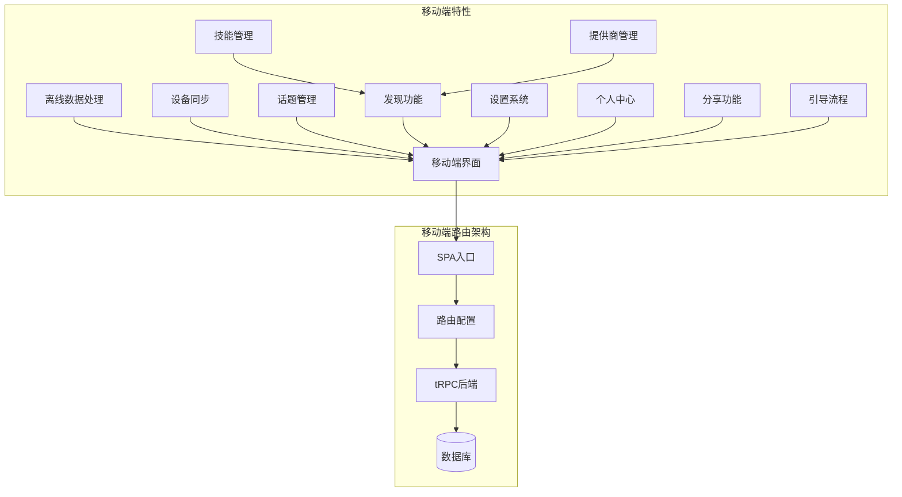

**图表来源**

- [src/spa/router/mobileRouter.config.tsx:1-323](file://src/spa/router/mobileRouter.config.tsx#L1-L323)
- [src/app/(backend)/trpc/mobile/\[trpc\]/route.ts](<file://src/app/(backend)/trpc/mobile/[trpc]/route.ts#L1-L34>)

**章节来源**

- [src/spa/router/mobileRouter.config.tsx:1-323](file://src/spa/router/mobileRouter.config.tsx#L1-L323)
- [src/spa/entry.mobile.tsx:1-18](file://src/spa/entry.mobile.tsx#L1-L18)

## 核心组件

### 移动端路由配置

移动端路由采用声明式配置方式，支持嵌套路由、动态加载和错误边界处理。**更新** 新增技能详情路由和提供商详情路由配置：

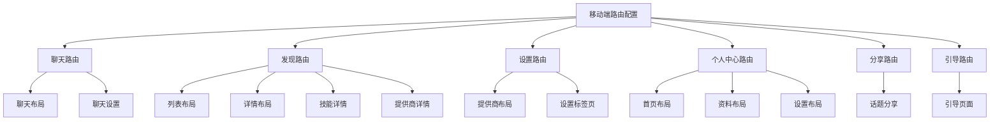

**图表来源**

- [src/spa/router/mobileRouter.config.tsx:12-322](file://src/spa/router/mobileRouter.config.tsx#L12-L322)

### 技能详情路由系统

**新增** 移动端技能详情路由系统，提供完整的技能浏览和交互功能：

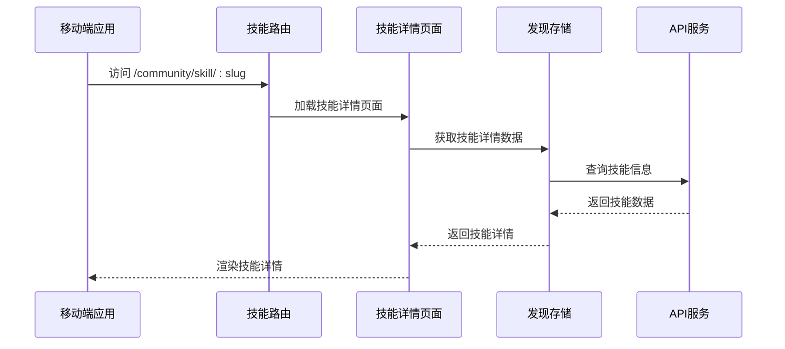

**图表来源**

- [src/routes/(main)/community/(detail)/skill/index.tsx](<file://src/routes/(main)/community/(detail)/skill/index.tsx#L1-L48>)

### tRPC 移动端处理器

移动端 tRPC 处理器专门负责处理移动客户端的请求，提供类型安全的 API 调用：

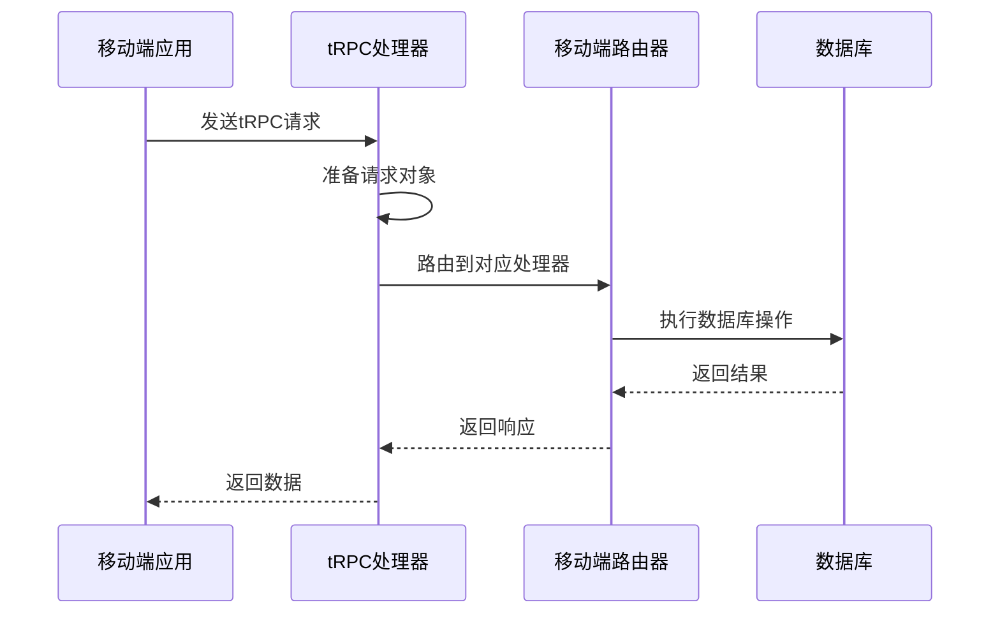

**图表来源**

- [src/app/(backend)/trpc/mobile/\[trpc\]/route.ts](<file://src/app/(backend)/trpc/mobile/[trpc]/route.ts#L9-L31>)

**章节来源**

- [src/app/(backend)/trpc/mobile/\[trpc\]/route.ts](<file://src/app/(backend)/trpc/mobile/[trpc]/route.ts#L1-L34>)
- [src/server/routers/mobile/index.ts:1-43](file://src/server/routers/mobile/index.ts#L1-L43)

## 架构概览

移动端路由模块的整体架构采用前后端分离设计，通过 tRPC 实现类型安全的通信：

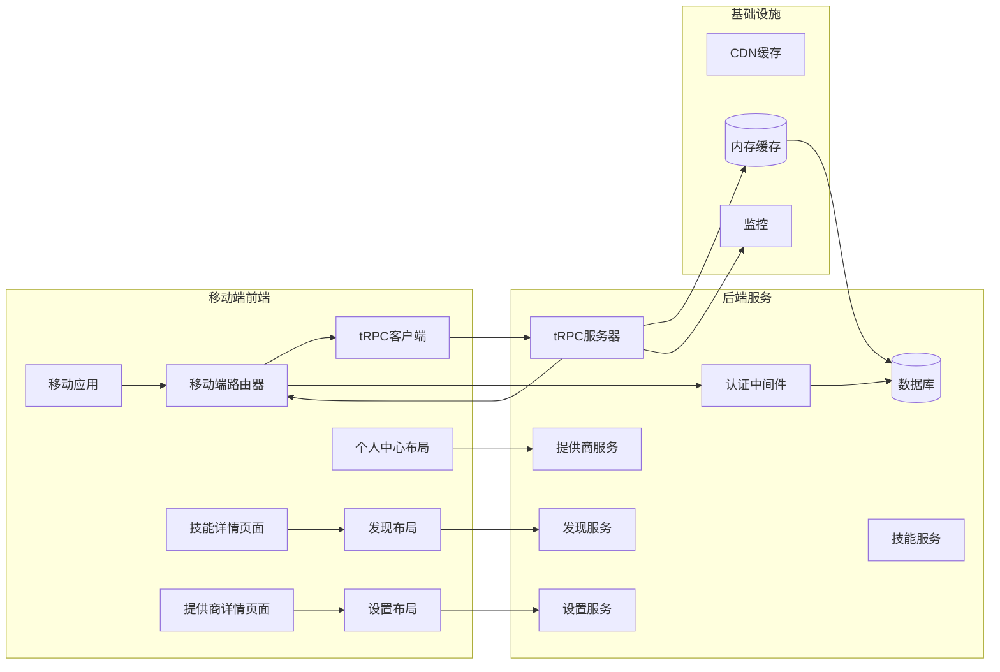

**图表来源**

- [src/libs/trpc/lambda/context.ts:84-199](file://src/libs/trpc/lambda/context.ts#L84-L199)
- [src/server/routers/mobile/index.ts:24-42](file://src/server/routers/mobile/index.ts#L24-L42)

## 详细组件分析

### 移动端话题管理系统

移动端话题管理是模块的核心功能之一，提供了完整的话题生命周期管理：

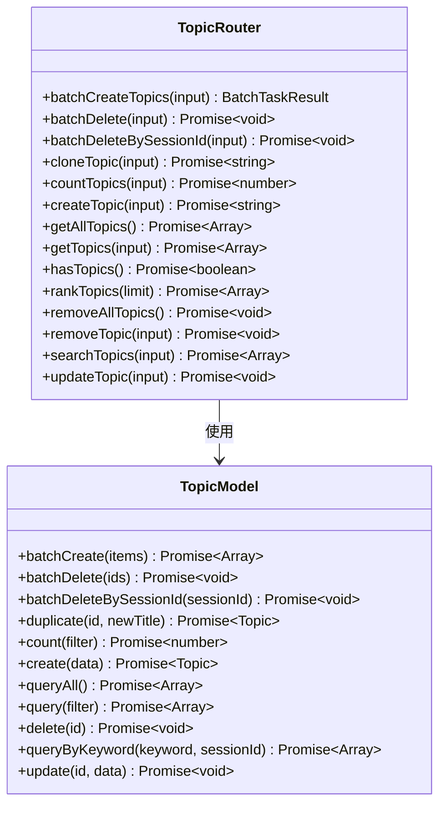

**图表来源**

- [src/server/routers/mobile/topic.ts:17-164](file://src/server/routers/mobile/topic.ts#L17-L164)

#### 话题管理接口规范

移动端话题管理提供了以下核心接口：

| 接口名称 | 方法                | 输入参数                                                  | 返回值                     | 描述         |
| -------- | ------------------- | --------------------------------------------------------- | -------------------------- | ------------ |
| 创建话题 | `createTopic`       | `{title: string, sessionId?: string, favorite?: boolean}` | `Promise<string>`          | 创建新话题   |
| 批量创建 | `batchCreateTopics` | `Array<{title: string, sessionId?: string}>`              | `Promise<BatchTaskResult>` | 批量创建话题 |
| 更新话题 | `updateTopic`       | `{id: string, value: TopicUpdateData}`                    | `Promise<void>`            | 更新话题信息 |
| 删除话题 | `removeTopic`       | `{id: string}`                                            | `Promise<void>`            | 删除指定话题 |
| 搜索话题 | `searchTopics`      | `{keywords: string, sessionId?: string}`                  | `Promise<Array<Topic>>`    | 搜索话题     |
| 获取话题 | `getTopics`         | `{current?: number, pageSize?: number}`                   | `Promise<Array<Topic>>`    | 分页获取话题 |

**章节来源**

- [src/server/routers/mobile/topic.ts:17-164](file://src/server/routers/mobile/topic.ts#L17-L164)

### 技能详情路由系统

**新增** 移动端技能详情路由系统，提供完整的技能浏览和交互功能：

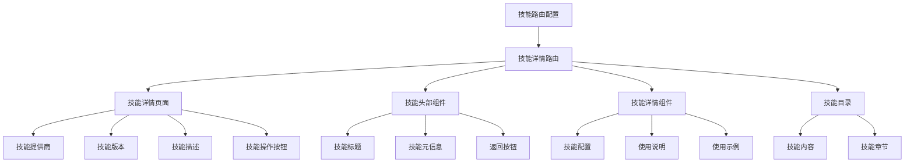

**图表来源**

- [src/routes/(main)/community/(detail)/skill/index.tsx](<file://src/routes/(main)/community/(detail)/skill/index.tsx#L1-L48>)

#### 技能详情页面组件结构

技能详情页面采用模块化设计，包含以下核心组件：

- **Header 组件**: 显示技能标题、元信息和返回按钮
- **DetailProvider**: 提供技能数据上下文
- **TocProvider**: 管理技能目录导航
- **Details 组件**: 展示技能详细信息
- **Loading 组件**: 处理加载状态
- **NotFound 组件**: 处理未找到情况

**章节来源**

- [src/routes/(main)/community/(detail)/skill/index.tsx](<file://src/routes/(main)/community/(detail)/skill/index.tsx#L1-L48>)

### 提供商详情路由系统

**更新** 扩展提供商详情路由系统，增强设置页面导航：

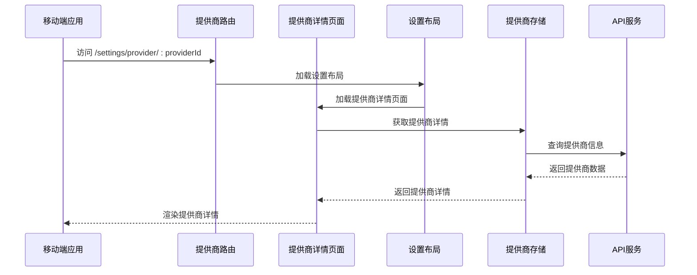

**图表来源**

- [src/spa/router/mobileRouter.config.tsx:182-203](file://src/spa/router/mobileRouter.config.tsx#L182-L203)

#### 提供商详情路由配置

提供商详情路由支持以下路径模式：

- `/settings/provider` - 提供商列表
- `/settings/provider/all` - 全部提供商
- `/settings/provider/:providerId` - 特定提供商详情

**章节来源**

- [src/spa/router/mobileRouter.config.tsx:182-203](file://src/spa/router/mobileRouter.config.tsx#L182-L203)

### 认证上下文管理

移动端路由模块提供了灵活的认证机制，支持多种认证方式：

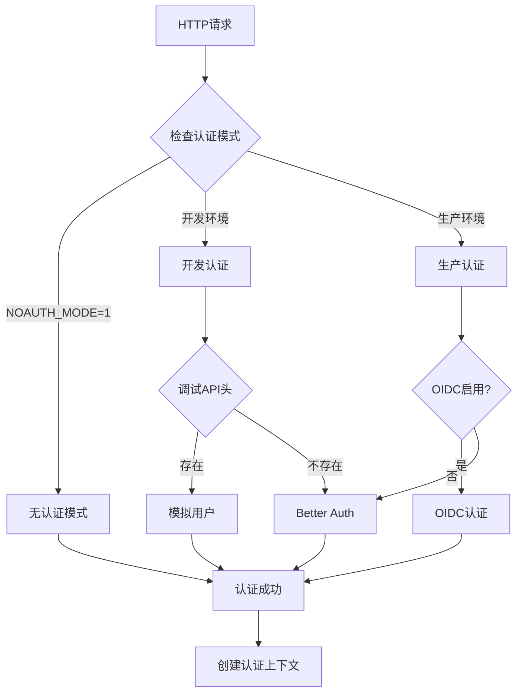

**图表来源**

- [src/libs/trpc/lambda/context.ts:84-199](file://src/libs/trpc/lambda/context.ts#L84-L199)

**章节来源**

- [src/libs/trpc/lambda/context.ts:1-200](file://src/libs/trpc/lambda/context.ts#L1-L200)

### 请求适配器

为了解决 Next.js 16 中的请求体锁定问题，移动端实现了专门的请求适配器：

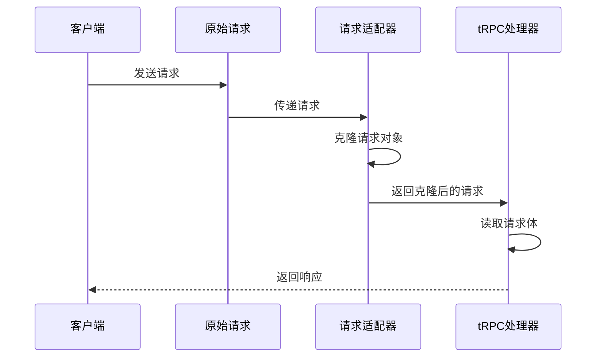

**图表来源**

- [src/libs/trpc/utils/request-adapter.ts:16-20](file://src/libs/trpc/utils/request-adapter.ts#L16-L20)

**章节来源**

- [src/libs/trpc/utils/request-adapter.ts:1-21](file://src/libs/trpc/utils/request-adapter.ts#L1-L21)

## 依赖关系分析

移动端路由模块的依赖关系清晰明确，遵循单一职责原则：

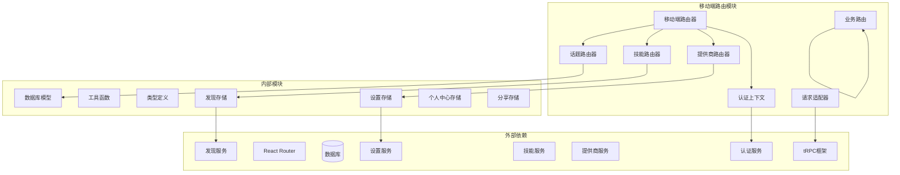

**图表来源**

- [src/server/routers/mobile/index.ts:24-42](file://src/server/routers/mobile/index.ts#L24-L42)
- [src/libs/trpc/lambda/context.ts:1-200](file://src/libs/trpc/lambda/context.ts#L1-L200)

**章节来源**

- [src/server/routers/mobile/index.ts:1-43](file://src/server/routers/mobile/index.ts#L1-L43)

## 性能考虑

### 移动端性能优化策略

移动端路由模块采用了多项性能优化措施：

1. **懒加载路由**: 使用动态导入实现路由级别的代码分割
2. **请求体克隆**: 避免 Next.js 16 的请求体锁定问题
3. **类型安全**: 通过 tRPC 提供编译时类型检查
4. **缓存策略**: 支持响应元数据缓存
5. **错误边界**: 提供完善的错误处理机制
6. **嵌套路由优化**: 减少不必要的组件重新渲染

### 网络适配方案

移动端网络环境复杂多变，模块提供了以下适配方案：

- **重试机制**: 自动重试失败的请求
- **超时控制**: 合理的请求超时设置
- **离线支持**: 支持离线数据缓存和同步
- **流量优化**: 压缩和最小化传输数据
- **路由预加载**: 提前加载常用路由组件

## 故障排除指南

### 常见问题及解决方案

#### 认证问题

- **问题**: 用户无法登录
- **原因**: 认证头缺失或无效
- **解决**: 检查 `LOBE_CHAT_AUTH_HEADER` 设置

#### 请求体错误

- **问题**: "Response body object should not be disturbed or locked"
- **原因**: Next.js 16 的请求体锁定问题
- **解决**: 使用请求适配器克隆请求对象

#### 路由配置错误

- **问题**: 页面无法正确渲染
- **原因**: 路由配置不正确
- **解决**: 检查 `mobileRouter.config.tsx` 中的路由配置

#### 技能详情加载失败

- **问题**: 技能详情页面显示空白
- **原因**: 技能数据加载失败或路由参数错误
- **解决**: 检查技能标识符和版本参数，验证 API 服务状态

#### 提供商详情路由问题

- **问题**: 提供商详情页面无法访问
- **原因**: 路由参数不匹配或提供商不存在
- **解决**: 验证提供商 ID 格式，检查提供商数据源

**章节来源**

- [src/app/(backend)/trpc/mobile/\[trpc\]/route.ts](<file://src/app/(backend)/trpc/mobile/[trpc]/route.ts#L22-L25>)

## 结论

移动端路由模块通过精心设计的架构和实现，为移动设备提供了完整的路由解决方案。**更新** 新增的技能详情路由和提供商详情路由进一步完善了移动端的功能体系。

其特点包括：

1. **类型安全**: 基于 tRPC 的类型安全 API 调用
2. **性能优化**: 针对移动端的性能优化策略
3. **灵活认证**: 支持多种认证方式的灵活切换
4. **错误处理**: 完善的错误处理和调试机制
5. **扩展性**: 模块化的架构设计便于功能扩展
6. **一致性**: 与桌面端路由系统的良好一致性
7. **完整性**: 覆盖聊天、发现、设置、个人中心等核心功能

该模块为移动端应用提供了稳定可靠的路由基础，支持话题管理、设备同步、技能浏览、提供商管理等核心功能，同时保持了良好的性能表现和用户体验。新增的技能详情路由和提供商详情路由进一步增强了移动端的功能完整性，为用户提供了更加丰富的移动应用体验。
