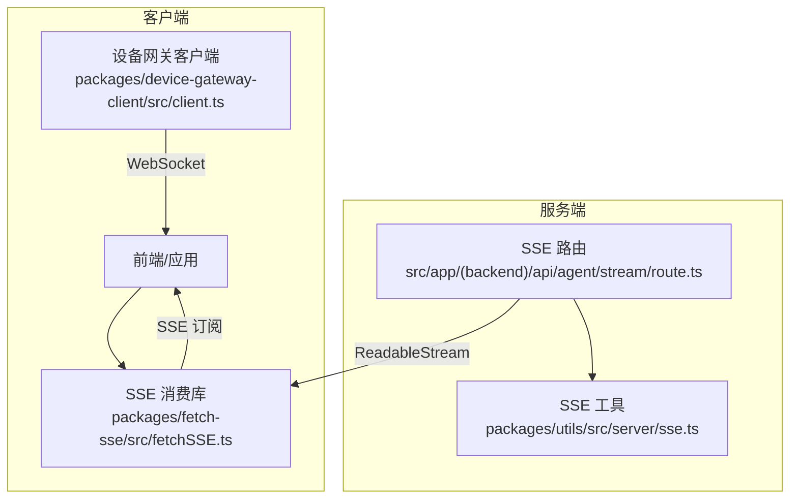
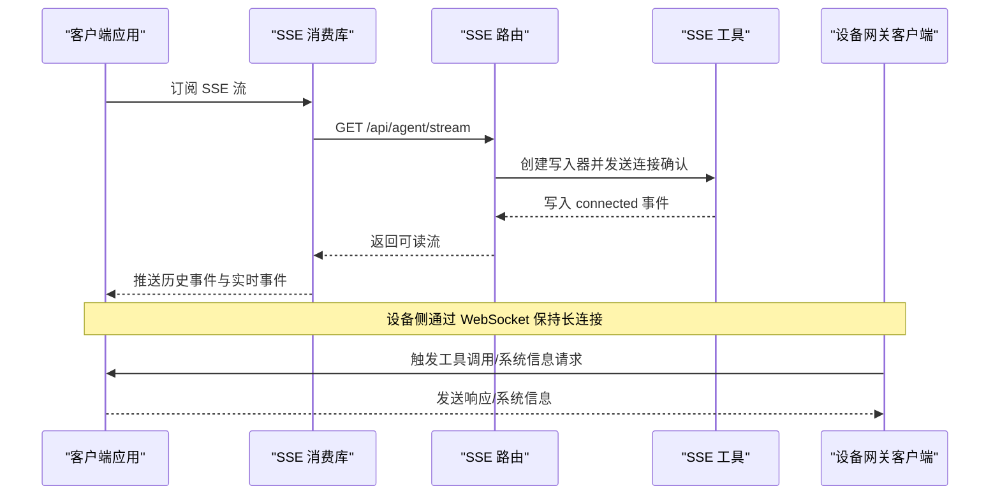
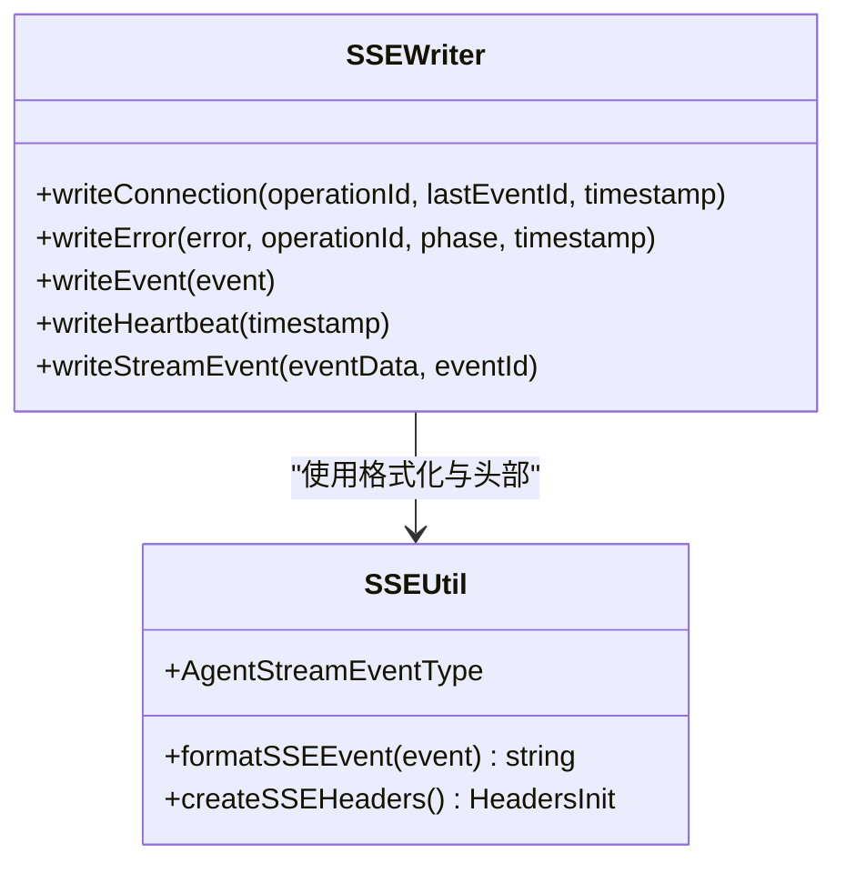
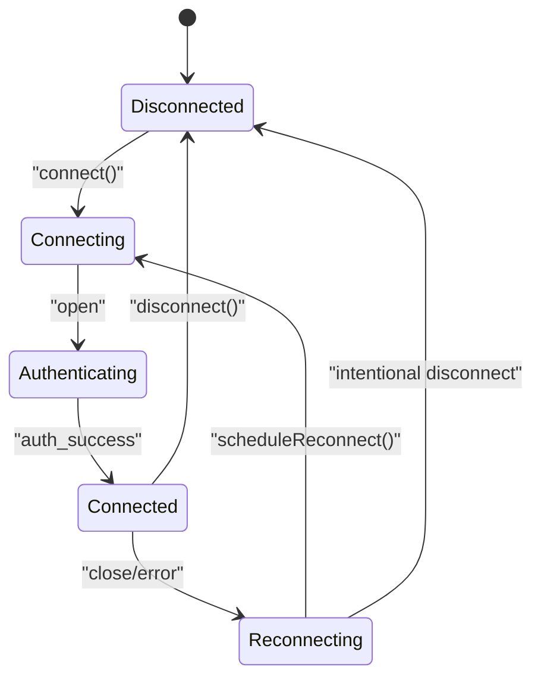
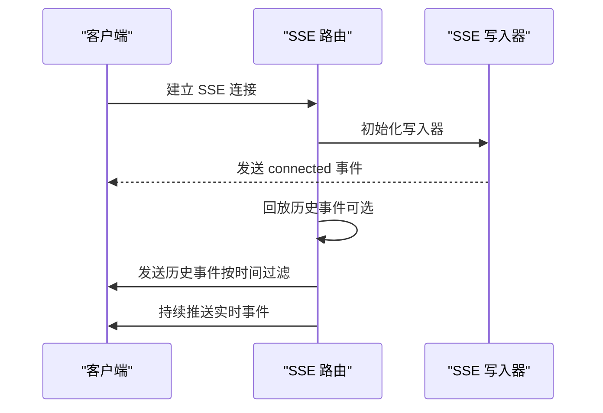
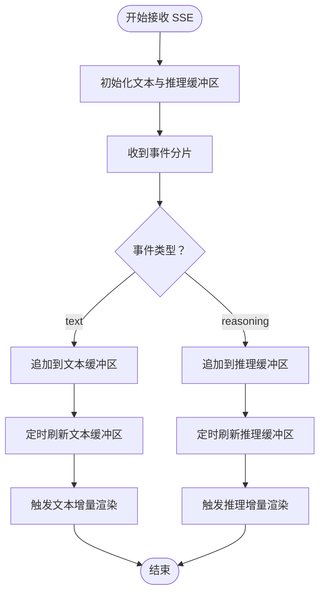
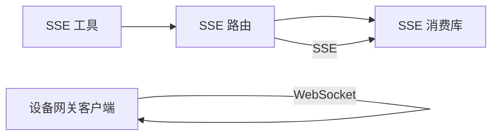

# 实时通信接口

<cite>
**本文引用的文件**
- [packages/utils/src/server/sse.ts](file://packages/utils/src/server/sse.ts)
- [packages/device-gateway-client/src/client.ts](file://packages/device-gateway-client/src/client.ts)
- [packages/device-gateway-client/src/types.ts](file://packages/device-gateway-client/src/types.ts)
- [src/app/(backend)/api/agent/stream/route.ts](file://src/app/(backend)/api/agent/stream/route.ts)
- [packages/fetch-sse/src/fetchSSE.ts](file://packages/fetch-sse/src/fetchSSE.ts)
- [packages/device-gateway-client/src/client.test.ts](file://packages/device-gateway-client/src/client.test.ts)
- [e2e/src/mocks/llm/index.ts](file://e2e/src/mocks/llm/index.ts)
- [apps/desktop/src/main/core/infrastructure/__tests__/BackendProxyProtocolManager.test.ts](file://apps/desktop/src/main/core/infrastructure/__tests__/BackendProxyProtocolManager.test.ts)
</cite>

## 目录
1. [简介](#简介)
2. [项目结构](#项目结构)
3. [核心组件](#核心组件)
4. [架构总览](#架构总览)
5. [详细组件分析](#详细组件分析)
6. [依赖关系分析](#依赖关系分析)
7. [性能考量](#性能考量)
8. [故障排查指南](#故障排查指南)
9. [结论](#结论)
10. [附录](#附录)

## 简介
本文件面向 LobeHub 项目的实时通信能力，系统化梳理 WebSocket 连接建立、消息格式规范、事件类型定义、状态同步机制，并覆盖流式响应处理、增量更新、断线重连策略与消息确认机制。文档同时给出聊天消息的实时传输、Agent 响应的流式输出、状态变更通知机制的实现要点与最佳实践，帮助开发者快速集成并保障实时通信的稳定性与用户体验。

## 项目结构
围绕实时通信的关键模块包括：
- 服务端 SSE 工具：负责将事件格式化为 Server-Sent Events，支持心跳、连接确认、错误上报与流式事件发送。
- 客户端设备网关 SDK：封装 WebSocket 连接、鉴权、心跳、断线重连（指数退避）、事件派发与状态机。
- 路由层 SSE 流：在 Next.js 路由中创建可读流，向客户端推送历史与实时事件。
- 客户端流式消费库：对 SSE 流进行平滑缓冲与增量渲染，支持文本与推理内容的分片展示。
- E2E 模拟器：构造符合 LobeChat 实际流式格式的 SSE 分片，便于测试与演示。

图表来源
- [packages/fetch-sse/src/fetchSSE.ts](file://packages/fetch-sse/src/fetchSSE.ts#L245-L291)
- [packages/device-gateway-client/src/client.ts](file://packages/device-gateway-client/src/client.ts#L99-L156)
- [src/app/(backend)/api/agent/stream/route.ts](file://src/app/(backend)/api/agent/stream/route.ts#L46-L76)
- [packages/utils/src/server/sse.ts](file://packages/utils/src/server/sse.ts#L52-L122)

章节来源
- [packages/utils/src/server/sse.ts](file://packages/utils/src/server/sse.ts#L1-L152)
- [packages/device-gateway-client/src/client.ts](file://packages/device-gateway-client/src/client.ts#L1-L332)
- [src/app/(backend)/api/agent/stream/route.ts](file://src/app/(backend)/api/agent/stream/route.ts#L46-L76)

## 核心组件
- SSE 工具与事件类型
  - 提供事件格式化、连接确认、心跳、错误与流式事件写入等能力。
  - 定义 Agent 流事件类型集合，统一服务端与客户端的消息语义。
- 设备网关客户端
  - 封装 WebSocket 连接、鉴权、心跳、断线重连（指数退避上限）与状态机。
  - 通过事件发射器对外派发连接、工具调用请求、系统信息请求、心跳确认等事件。
- SSE 路由
  - 在 Next.js 路由中创建可读流，先发送连接确认，再按需回放历史事件，最后持续推送实时事件。
- SSE 客户端消费库
  - 对 SSE 流进行缓冲与平滑渲染，区分文本与推理内容，支持定时刷新与增量更新。
- E2E 模拟器
  - 构造符合实际流式格式的数据分片，验证客户端渲染与性能。

章节来源
- [packages/utils/src/server/sse.ts](file://packages/utils/src/server/sse.ts#L52-L151)
- [packages/device-gateway-client/src/client.ts](file://packages/device-gateway-client/src/client.ts#L51-L332)
- [src/app/(backend)/api/agent/stream/route.ts](file://src/app/(backend)/api/agent/stream/route.ts#L46-L76)
- [packages/fetch-sse/src/fetchSSE.ts](file://packages/fetch-sse/src/fetchSSE.ts#L245-L291)
- [e2e/src/mocks/llm/index.ts](file://e2e/src/mocks/llm/index.ts#L43-L92)

## 架构总览
下图展示了从服务端到客户端的完整实时数据通路：服务端以 SSE 可读流形式推送事件，客户端通过 SSE 消费库或 WebSocket 客户端订阅并渲染增量内容；同时，设备网关客户端通过 WebSocket 与服务端保持长连接，用于设备侧的工具调用与系统信息交互。

图表来源
- [src/app/(backend)/api/agent/stream/route.ts](file://src/app/(backend)/api/agent/stream/route.ts#L46-L76)
- [packages/utils/src/server/sse.ts](file://packages/utils/src/server/sse.ts#L52-L122)
- [packages/fetch-sse/src/fetchSSE.ts](file://packages/fetch-sse/src/fetchSSE.ts#L245-L291)
- [packages/device-gateway-client/src/client.ts](file://packages/device-gateway-client/src/client.ts#L177-L235)

## 详细组件分析

### SSE 工具与事件模型
- 事件格式化
  - 支持 id、event、retry 与 data 字段，自动序列化对象数据并按行拼接。
- 写入器能力
  - 连接确认：发送 connected 类型事件，携带 operationId、lastEventId、timestamp。
  - 错误事件：发送 error 类型事件，包含错误信息、阶段与可选堆栈。
  - 心跳事件：发送 heartbeat 类型事件，用于保活。
  - 流式事件：发送带类型标识的流事件，支持自定义事件 id。
- 事件类型枚举
  - 定义 Agent 流事件类型集合，覆盖连接、流开始/分片/结束、错误与心跳等。

图表来源
- [packages/utils/src/server/sse.ts](file://packages/utils/src/server/sse.ts#L52-L151)

章节来源
- [packages/utils/src/server/sse.ts](file://packages/utils/src/server/sse.ts#L1-L152)

### 设备网关客户端（WebSocket）
- 连接与 URL 构建
  - 自动根据网关地址协议选择 ws/wss，附加设备信息参数；支持通过 userId 注入用户上下文。
- 鉴权与状态机
  - 连接后立即发送鉴权消息；收到 auth_success 后进入 connected 并启动心跳；收到 auth_failed 则断开并触发失败事件。
- 心跳与保活
  - 定期发送 heartbeat，收到 heartbeat_ack 后维持连接健康。
- 断线重连（指数退避）
  - 默认初始延迟 1s，最大延迟 30s；每次重连失败后翻倍，成功连接后重置延迟。
- 事件派发
  - 连接、断开、错误、心跳确认、工具调用请求、系统信息请求等事件均通过事件发射器对外暴露。

图表来源
- [packages/device-gateway-client/src/client.ts](file://packages/device-gateway-client/src/client.ts#L99-L156)
- [packages/device-gateway-client/src/client.ts](file://packages/device-gateway-client/src/client.ts#L177-L235)
- [packages/device-gateway-client/src/client.ts](file://packages/device-gateway-client/src/client.ts#L274-L289)

章节来源
- [packages/device-gateway-client/src/client.ts](file://packages/device-gateway-client/src/client.ts#L51-L332)
- [packages/device-gateway-client/src/types.ts](file://packages/device-gateway-client/src/types.ts#L25-L123)
- [packages/device-gateway-client/src/client.test.ts](file://packages/device-gateway-client/src/client.test.ts#L339-L414)

### SSE 路由与流式推送
- 连接建立
  - 创建 SSE 写入器并向客户端发送连接确认事件。
- 历史事件回放
  - 可选回放历史事件，仅发送晚于 lastEventId 的事件，保证幂等与增量。
- 实时事件推送
  - 在历史回放完成后，持续推送新的流事件，支持流开始、分片、结束与错误等类型。

图表来源
- [src/app/(backend)/api/agent/stream/route.ts](file://src/app/(backend)/api/agent/stream/route.ts#L46-L76)
- [packages/utils/src/server/sse.ts](file://packages/utils/src/server/sse.ts#L52-L122)

章节来源
- [src/app/(backend)/api/agent/stream/route.ts](file://src/app/(backend)/api/agent/stream/route.ts#L46-L76)
- [packages/utils/src/server/sse.ts](file://packages/utils/src/server/sse.ts#L52-L122)

### 客户端流式消费与增量渲染
- 缓冲与平滑
  - 文本与推理内容分别维护缓冲区与定时器，按固定间隔刷新，避免频繁渲染。
- 增量更新
  - 通过平滑控制器计算增量文本，分别触发 text 与 reasoning 类型事件，提升阅读体验。
- 图像与用量
  - 支持图像分片收集与用量统计的增量更新，便于在界面中展示性能指标。

图表来源
- [packages/fetch-sse/src/fetchSSE.ts](file://packages/fetch-sse/src/fetchSSE.ts#L245-L291)

章节来源
- [packages/fetch-sse/src/fetchSSE.ts](file://packages/fetch-sse/src/fetchSSE.ts#L245-L291)

### E2E 流式格式模拟
- 构造符合实际的 SSE 分片
  - 包含初始 data 事件、多段 text 事件、停止事件与用量统计事件，便于端到端测试与演示。

章节来源
- [e2e/src/mocks/llm/index.ts](file://e2e/src/mocks/llm/index.ts#L43-L92)

## 依赖关系分析
- 组件耦合
  - SSE 路由依赖 SSE 工具进行事件格式化与头部设置。
  - 设备网关客户端独立于 SSE，但共享一致的状态与事件语义，便于跨协议扩展。
  - 客户端消费库与路由解耦，既可消费 SSE，也可适配其他流式协议。
- 外部依赖
  - WebSocket 客户端库用于设备网关连接。
  - Node ReadableStream 用于 SSE 路由输出。
  - 测试用例覆盖断线重连、心跳、URL 构建与事件派发等关键路径。

图表来源
- [packages/utils/src/server/sse.ts](file://packages/utils/src/server/sse.ts#L141-L151)
- [src/app/(backend)/api/agent/stream/route.ts](file://src/app/(backend)/api/agent/stream/route.ts#L46-L76)
- [packages/fetch-sse/src/fetchSSE.ts](file://packages/fetch-sse/src/fetchSSE.ts#L245-L291)
- [packages/device-gateway-client/src/client.ts](file://packages/device-gateway-client/src/client.ts#L134-L156)

章节来源
- [packages/utils/src/server/sse.ts](file://packages/utils/src/server/sse.ts#L141-L151)
- [packages/device-gateway-client/src/client.ts](file://packages/device-gateway-client/src/client.ts#L134-L156)
- [src/app/(backend)/api/agent/stream/route.ts](file://src/app/(backend)/api/agent/stream/route.ts#L46-L76)

## 性能考量
- SSE 与 WebSocket 的选择
  - SSE 适合单向服务端推送与浏览器原生支持场景；WebSocket 更适合双向、低延迟的设备侧交互。
- 流式渲染优化
  - 客户端采用缓冲与定时刷新，减少频繁渲染带来的抖动；合理设置刷新间隔以平衡实时性与性能。
- 心跳与保活
  - WebSocket 心跳周期建议与网络环境匹配，避免过于频繁导致额外开销。
- 断线重连退避
  - 指数退避上限控制重试频率，防止雪崩效应；在高可用部署中结合负载均衡与多实例部署提升可用性。
- 历史事件回放
  - 服务端按 lastEventId 过滤，避免重复推送；客户端按事件 id 去重，确保幂等。

## 故障排查指南
- WebSocket 连接失败
  - 检查网关地址协议（ws/wss）与证书配置；确认鉴权消息是否正确发送；查看日志中的错误码与原因。
- 心跳异常
  - 确认心跳定时器是否正常启动与清理；检查网络波动与代理设置；必要时调整心跳间隔。
- 断线重连问题
  - 验证指数退避逻辑与最大延迟设置；确保在连接成功后及时重置延迟；避免重复连接。
- SSE 流中断
  - 检查服务端可读流是否被提前关闭；确认事件 id 与 lastEventId 的传递；验证客户端缓冲区刷新逻辑。
- E2E 测试
  - 使用模拟器构造标准 SSE 分片，验证客户端渲染与增量更新行为；逐步增加分片大小与数量评估性能。

章节来源
- [packages/device-gateway-client/src/client.test.ts](file://packages/device-gateway-client/src/client.test.ts#L339-L414)
- [packages/device-gateway-client/src/client.ts](file://packages/device-gateway-client/src/client.ts#L257-L296)
- [e2e/src/mocks/llm/index.ts](file://e2e/src/mocks/llm/index.ts#L43-L92)

## 结论
LobeHub 的实时通信体系以 SSE 与 WebSocket 双通道协同：SSE 用于服务端到客户端的高效单向推送，WebSocket 用于设备侧的双向交互与保活。通过统一的事件模型、完善的断线重连与心跳机制、以及客户端的平滑渲染策略，系统在保证实时性的同时兼顾了稳定性与用户体验。建议在生产环境中结合负载均衡与多实例部署，进一步提升可用性与吞吐能力。

## 附录

### 消息格式规范（SSE）
- 事件字段
  - id：事件唯一标识，用于 lastEventId 与断点续传。
  - event：事件类型，如 connected、stream、error、heartbeat、stream_start、stream_chunk、stream_end、stream_error。
  - data：事件载荷，支持字符串或对象，自动序列化。
  - retry：重试间隔（可选）。
- 典型事件
  - 连接确认：包含 operationId、lastEventId、timestamp 与 type=connected。
  - 错误事件：包含错误信息、阶段与可选堆栈，type=error。
  - 心跳事件：包含 timestamp 与 type=heartbeat。
  - 流事件：包含流式内容与类型，如 stream_start、stream_chunk、stream_end、stream_error。

章节来源
- [packages/utils/src/server/sse.ts](file://packages/utils/src/server/sse.ts#L5-L10)
- [packages/utils/src/server/sse.ts](file://packages/utils/src/server/sse.ts#L124-L135)
- [packages/utils/src/server/sse.ts](file://packages/utils/src/server/sse.ts#L141-L151)

### 事件类型定义（WebSocket）
- 客户端消息
  - 鉴权：type=auth，携带 token。
  - 心跳：type=heartbeat。
  - 系统信息响应：type=system_info_response，携带 requestId 与结果。
  - 工具调用响应：type=tool_call_response，携带 requestId 与结果。
- 服务端消息
  - 鉴权成功：type=auth_success。
  - 鉴权失败：type=auth_failed，携带原因。
  - 心跳确认：type=heartbeat_ack。
  - 工具调用请求：type=tool_call_request，携带 requestId 与工具调用信息。
  - 系统信息请求：type=system_info_request，携带 requestId。

章节来源
- [packages/device-gateway-client/src/types.ts](file://packages/device-gateway-client/src/types.ts#L25-L100)

### 状态同步机制
- WebSocket 状态机
  - disconnected → connecting → authenticating → connected → reconnecting → disconnected。
- SSE 增量同步
  - 通过 lastEventId 与事件 id 实现断点续传与去重，确保客户端与服务端状态一致。

章节来源
- [packages/device-gateway-client/src/client.ts](file://packages/device-gateway-client/src/client.ts#L100-L105)
- [packages/device-gateway-client/src/client.ts](file://packages/device-gateway-client/src/client.ts#L300-L305)
- [src/app/(backend)/api/agent/stream/route.ts](file://src/app/(backend)/api/agent/stream/route.ts#L62-L76)

### 流式响应处理与增量更新
- 文本与推理内容分离缓冲，定时刷新，避免频繁渲染。
- 增量文本与推理内容分别触发事件，支持平滑过渡动画。
- 图像分片与用量统计的增量更新，便于界面性能指标展示。

章节来源
- [packages/fetch-sse/src/fetchSSE.ts](file://packages/fetch-sse/src/fetchSSE.ts#L245-L291)

### 断线重连策略
- 指数退避：初始 1s，上限 30s，失败后翻倍，成功后重置。
- 可配置自动重连开关与日志记录，便于诊断与恢复。

章节来源
- [packages/device-gateway-client/src/client.ts](file://packages/device-gateway-client/src/client.ts#L274-L289)
- [packages/device-gateway-client/src/client.test.ts](file://packages/device-gateway-client/src/client.test.ts#L384-L414)

### 客户端集成指南与 SDK 使用示例
- SSE 客户端
  - 使用消费库订阅服务端 SSE 流，按事件类型处理文本、推理、图像与用量等增量内容。
- WebSocket 客户端
  - 初始化设备网关客户端，监听连接、工具调用请求与系统信息请求事件，按需发送响应消息。
- E2E 测试
  - 使用模拟器构造标准 SSE 分片，验证客户端渲染与性能表现。

章节来源
- [packages/fetch-sse/src/fetchSSE.ts](file://packages/fetch-sse/src/fetchSSE.ts#L245-L291)
- [packages/device-gateway-client/src/client.ts](file://packages/device-gateway-client/src/client.ts#L99-L156)
- [e2e/src/mocks/llm/index.ts](file://e2e/src/mocks/llm/index.ts#L43-L92)

### 调试工具与监控指标
- 日志记录
  - 关键事件（连接、鉴权、心跳、错误、重连）均输出日志，便于定位问题。
- 监控指标
  - 连接成功率、平均重连延迟、心跳丢失率、SSE 分片延迟与客户端渲染帧率等。

章节来源
- [packages/device-gateway-client/src/client.ts](file://packages/device-gateway-client/src/client.ts#L251-L254)
- [packages/device-gateway-client/src/client.ts](file://packages/device-gateway-client/src/client.ts#L274-L289)