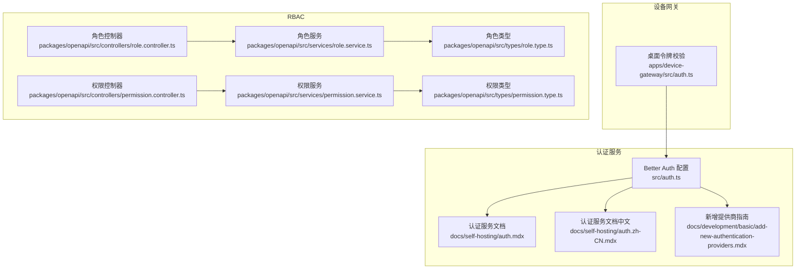
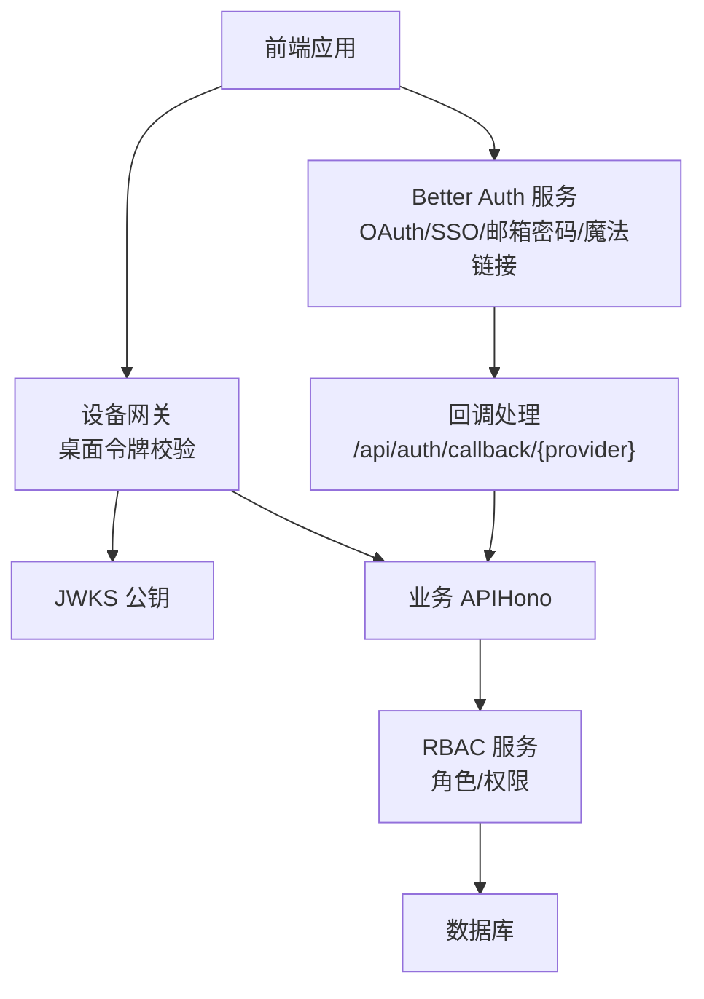
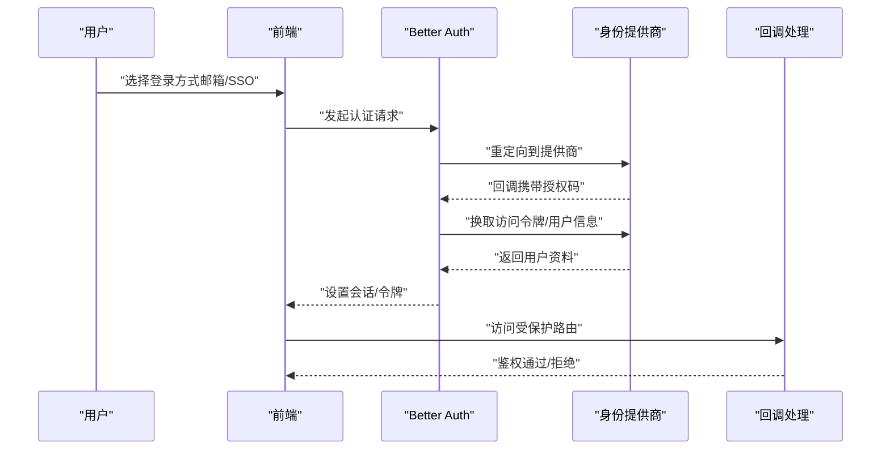
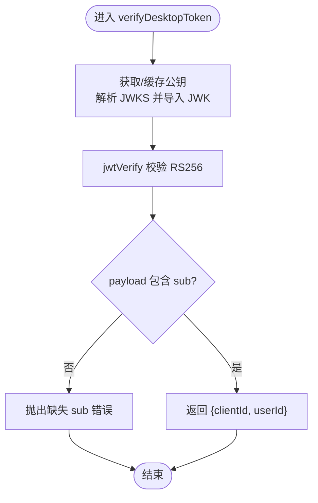
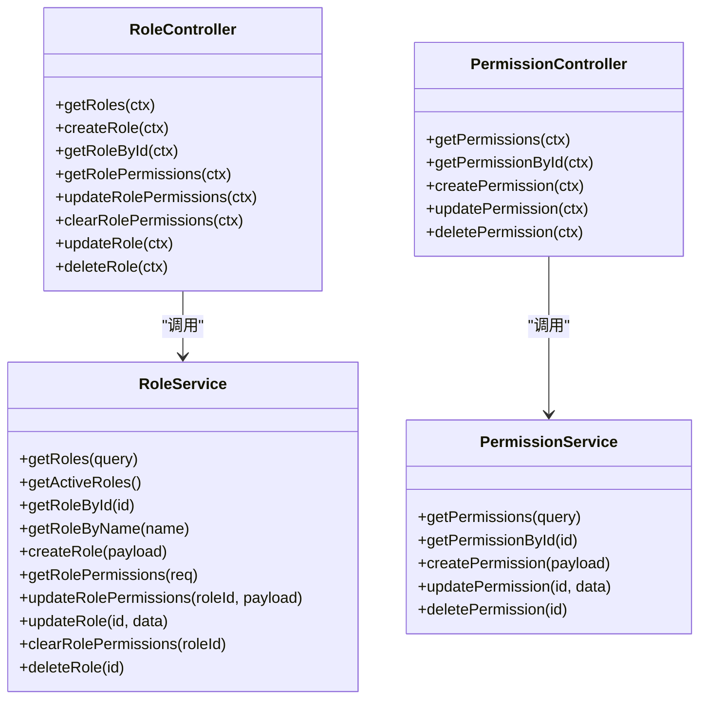
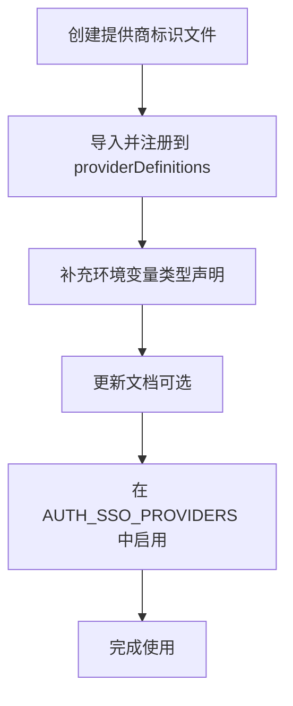
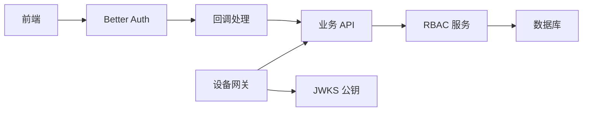
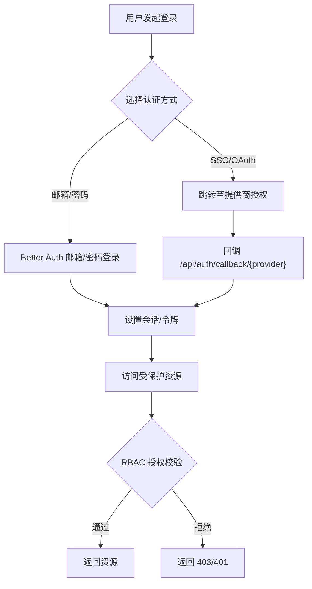
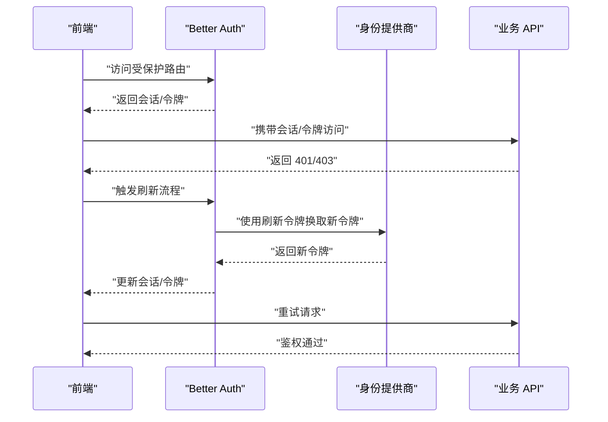

# 认证与授权

<cite>
**本文引用的文件**
- [apps/device-gateway/src/auth.ts](file://apps/device-gateway/src/auth.ts)
- [docs/self-hosting/auth.mdx](file://docs/self-hosting/auth.mdx)
- [docs/self-hosting/auth.zh-CN.mdx](file://docs/self-hosting/auth.zh-CN.mdx)
- [docs/development/basic/add-new-authentication-providers.mdx](file://docs/development/basic/add-new-authentication-providers.mdx)
- [src/auth.ts](file://src/auth.ts)
- [packages/openapi/src/controllers/role.controller.ts](file://packages/openapi/src/controllers/role.controller.ts)
- [packages/openapi/src/services/role.service.ts](file://packages/openapi/src/services/role.service.ts)
- [packages/openapi/src/types/role.type.ts](file://packages/openapi/src/types/role.type.ts)
- [packages/openapi/src/controllers/permission.controller.ts](file://packages/openapi/src/controllers/permission.controller.ts)
- [packages/openapi/src/services/permission.service.ts](file://packages/openapi/src/services/permission.service.ts)
- [packages/openapi/src/types/permission.type.ts](file://packages/openapi/src/types/permission.type.ts)
</cite>

## 目录

1. [简介](#简介)
2. [项目结构](#项目结构)
3. [核心组件](#核心组件)
4. [架构总览](#架构总览)
5. [详细组件分析](#详细组件分析)
6. [依赖关系分析](#依赖关系分析)
7. [性能考量](#性能考量)
8. [故障排查指南](#故障排查指南)
9. [结论](#结论)
10. [附录](#附录)

## 简介

本文件面向 LobeHub 的认证与授权体系，覆盖用户认证流程、令牌管理、会话生命周期与安全策略；同时详述多种认证方式（OAuth 2.0、OpenID Connect、API Key、设备流等）的实现要点与最佳实践。文档还包含授权策略、角色权限模型、资源访问控制与 RBAC 实现，以及多租户支持、组织管理、权限继承等高级特性。为便于理解，文档提供了认证流程图、令牌刷新机制示意、安全头设置与 CORS 配置要点，并给出用户注册登录、密码重置、账户验证等 API 规范。

## 项目结构

围绕认证与授权的核心代码主要分布在以下区域：

- 设备网关的桌面令牌校验模块，负责基于 JWKS 的 RS256 JWT 校验
- 自托管认证服务文档，基于 Better Auth 的 SSO/OIDC 配置与环境变量
- RBAC 控制器与服务层，提供角色与权限的增删改查与授权校验
- 新增认证提供商指南，说明如何扩展 OIDC/OAuth 提供商

图表来源

- [src/auth.ts](file://src/auth.ts#L1-L6)
- [docs/self-hosting/auth.mdx](file://docs/self-hosting/auth.mdx#L1-L248)
- [docs/self-hosting/auth.zh-CN.mdx](file://docs/self-hosting/auth.zh-CN.mdx#L1-L245)
- [docs/development/basic/add-new-authentication-providers.mdx](file://docs/development/basic/add-new-authentication-providers.mdx#L1-L187)
- [apps/device-gateway/src/auth.ts](file://apps/device-gateway/src/auth.ts#L1-L37)
- [packages/openapi/src/controllers/role.controller.ts](file://packages/openapi/src/controllers/role.controller.ts#L1-L184)
- [packages/openapi/src/services/role.service.ts](file://packages/openapi/src/services/role.service.ts#L1-L504)
- [packages/openapi/src/types/role.type.ts](file://packages/openapi/src/types/role.type.ts#L1-L108)
- [packages/openapi/src/controllers/permission.controller.ts](file://packages/openapi/src/controllers/permission.controller.ts#L1-L112)
- [packages/openapi/src/services/permission.service.ts](file://packages/openapi/src/services/permission.service.ts#L1-L206)
- [packages/openapi/src/types/permission.type.ts](file://packages/openapi/src/types/permission.type.ts#L1-L66)

章节来源

- [src/auth.ts](file://src/auth.ts#L1-L6)
- [docs/self-hosting/auth.mdx](file://docs/self-hosting/auth.mdx#L1-L248)
- [docs/self-hosting/auth.zh-CN.mdx](file://docs/self-hosting/auth.zh-CN.mdx#L1-L245)
- [docs/development/basic/add-new-authentication-providers.mdx](file://docs/development/basic/add-new-authentication-providers.mdx#L1-L187)
- [apps/device-gateway/src/auth.ts](file://apps/device-gateway/src/auth.ts#L1-L37)
- [packages/openapi/src/controllers/role.controller.ts](file://packages/openapi/src/controllers/role.controller.ts#L1-L184)
- [packages/openapi/src/services/role.service.ts](file://packages/openapi/src/services/role.service.ts#L1-L504)
- [packages/openapi/src/types/role.type.ts](file://packages/openapi/src/types/role.type.ts#L1-L108)
- [packages/openapi/src/controllers/permission.controller.ts](file://packages/openapi/src/controllers/permission.controller.ts#L1-L112)
- [packages/openapi/src/services/permission.service.ts](file://packages/openapi/src/services/permission.service.ts#L1-L206)
- [packages/openapi/src/types/permission.type.ts](file://packages/openapi/src/types/permission.type.ts#L1-L66)

## 核心组件

- Better Auth 认证服务：提供 OAuth/SSO、邮箱 / 密码、魔法链接等多种认证方式，支持通用 OIDC/OAuth，具备会话存储与回调 URL 配置能力
- 设备网关桌面令牌校验：基于 JWKS 的 RS256 JWT 校验，返回用户与客户端标识
- RBAC 系统：角色与权限的增删改查、授权校验、权限映射与批量变更
- 新增认证提供商指南：说明如何基于 OIDC/OAuth 扩展新的 SSO 提供商

章节来源

- [src/auth.ts](file://src/auth.ts#L1-L6)
- [docs/self-hosting/auth.mdx](file://docs/self-hosting/auth.mdx#L17-L28)
- [apps/device-gateway/src/auth.ts](file://apps/device-gateway/src/auth.ts#L1-L37)
- [packages/openapi/src/controllers/role.controller.ts](file://packages/openapi/src/controllers/role.controller.ts#L1-L184)
- [packages/openapi/src/controllers/permission.controller.ts](file://packages/openapi/src/controllers/permission.controller.ts#L1-L112)
- [docs/development/basic/add-new-authentication-providers.mdx](file://docs/development/basic/add-new-authentication-providers.mdx#L14-L24)

## 架构总览

下图展示了认证与授权的整体交互：前端通过 Better Auth 完成登录与回调；设备网关对桌面端 JWT 进行 RS256 校验；RBAC 服务在业务层进行权限校验与资源控制。

图表来源

- [docs/self-hosting/auth.mdx](file://docs/self-hosting/auth.mdx#L101-L107)
- [apps/device-gateway/src/auth.ts](file://apps/device-gateway/src/auth.ts#L1-L37)
- [packages/openapi/src/services/role.service.ts](file://packages/openapi/src/services/role.service.ts#L30-L78)
- [packages/openapi/src/services/permission.service.ts](file://packages/openapi/src/services/permission.service.ts#L25-L70)

## 详细组件分析

### Better Auth 认证服务

- 支持的认证方式：邮箱 / 密码、邮箱验证、魔法链接、OAuth/SSO、通用 OIDC/OAuth
- 关键环境变量：AUTH_SECRET、NEXT_PUBLIC_AUTH_URL、AUTH_SSO_PROVIDERS，以及各提供商的 ID/Secret/Issuer/Domain/Region/UserPool/Tenant 等
- 回调 URL 格式：开发环境 <http://localhost:3210/api/auth/callback/{provider}，生产> <https://yourdomain.com/api/auth/callback/{provider}>
- 会话存储：默认数据库存储，可选 Redis 作为二级存储以提升跨实例会话共享与性能
- 邮件服务：用于邮箱验证、密码重置、魔法链接投递，需配置 SMTP_HOST/PORT/SECURE/USER/PASS/FROM

图表来源

- [docs/self-hosting/auth.mdx](file://docs/self-hosting/auth.mdx#L101-L107)
- [docs/self-hosting/auth.mdx](file://docs/self-hosting/auth.mdx#L131-L156)
- [docs/self-hosting/auth.mdx](file://docs/self-hosting/auth.mdx#L157-L172)

章节来源

- [docs/self-hosting/auth.mdx](file://docs/self-hosting/auth.mdx#L17-L28)
- [docs/self-hosting/auth.mdx](file://docs/self-hosting/auth.mdx#L31-L60)
- [docs/self-hosting/auth.mdx](file://docs/self-hosting/auth.mdx#L101-L107)
- [docs/self-hosting/auth.mdx](file://docs/self-hosting/auth.mdx#L157-L172)
- [docs/self-hosting/auth.mdx](file://docs/self-hosting/auth.mdx#L178-L189)
- [docs/self-hosting/auth.zh-CN.mdx](file://docs/self-hosting/auth.zh-CN.mdx#L15-L26)
- [docs/self-hosting/auth.zh-CN.mdx](file://docs/self-hosting/auth.zh-CN.mdx#L29-L36)
- [docs/self-hosting/auth.zh-CN.mdx](file://docs/self-hosting/auth.zh-CN.mdx#L99-L105)
- [docs/self-hosting/auth.zh-CN.mdx](file://docs/self-hosting/auth.zh-CN.mdx#L155-L171)
- [docs/self-hosting/auth.zh-CN.mdx](file://docs/self-hosting/auth.zh-CN.mdx#L176-L187)

### 设备网关桌面令牌校验

- 功能：从环境变量解析 JWKS，提取 RS256 公钥，对传入的桌面端 JWT 进行校验，返回用户与客户端标识
- 关键点：缓存公钥避免重复导入；校验算法为 RS256；要求 JWT 包含 sub；缺失 claims 将抛出错误

图表来源

- [apps/device-gateway/src/auth.ts](file://apps/device-gateway/src/auth.ts#L1-L37)

章节来源

- [apps/device-gateway/src/auth.ts](file://apps/device-gateway/src/auth.ts#L1-L37)

### RBAC 角色与权限

- 角色（Role）：支持创建、查询、更新、删除、清空权限映射；支持系统角色与激活状态
- 权限（Permission）：支持创建、查询、更新、删除；删除前需确保未被角色引用
- 授权校验：服务层在执行敏感操作前进行权限解析与授权判定
- 批量变更：支持按集合进行授权 / 撤销，自动去重与冲突处理

图表来源

- [packages/openapi/src/controllers/role.controller.ts](file://packages/openapi/src/controllers/role.controller.ts#L1-L184)
- [packages/openapi/src/services/role.service.ts](file://packages/openapi/src/services/role.service.ts#L1-L504)
- [packages/openapi/src/controllers/permission.controller.ts](file://packages/openapi/src/controllers/permission.controller.ts#L1-L112)
- [packages/openapi/src/services/permission.service.ts](file://packages/openapi/src/services/permission.service.ts#L1-L206)

章节来源

- [packages/openapi/src/controllers/role.controller.ts](file://packages/openapi/src/controllers/role.controller.ts#L1-L184)
- [packages/openapi/src/services/role.service.ts](file://packages/openapi/src/services/role.service.ts#L21-L183)
- [packages/openapi/src/types/role.type.ts](file://packages/openapi/src/types/role.type.ts#L1-L108)
- [packages/openapi/src/controllers/permission.controller.ts](file://packages/openapi/src/controllers/permission.controller.ts#L1-L112)
- [packages/openapi/src/services/permission.service.ts](file://packages/openapi/src/services/permission.service.ts#L17-L206)
- [packages/openapi/src/types/permission.type.ts](file://packages/openapi/src/types/permission.type.ts#L1-L66)

### 新增认证提供商（OIDC/OAuth）

- 架构：内置提供商与通用 OIDC/OAuth 两类；通用 OIDC 通过构建 OIDC 配置与用户资料映射实现
- 步骤：创建提供商标识文件 → 注册到提供商定义数组 → 补充环境变量类型 → 更新文档
- 回调格式：内置与通用 OIDC 均使用 /api/auth/callback/{providerId}

图表来源

- [docs/development/basic/add-new-authentication-providers.mdx](file://docs/development/basic/add-new-authentication-providers.mdx#L25-L92)
- [docs/development/basic/add-new-authentication-providers.mdx](file://docs/development/basic/add-new-authentication-providers.mdx#L119-L166)
- [docs/development/basic/add-new-authentication-providers.mdx](file://docs/development/basic/add-new-authentication-providers.mdx#L168-L174)

章节来源

- [docs/development/basic/add-new-authentication-providers.mdx](file://docs/development/basic/add-new-authentication-providers.mdx#L14-L24)
- [docs/development/basic/add-new-authentication-providers.mdx](file://docs/development/basic/add-new-authentication-providers.mdx#L25-L92)
- [docs/development/basic/add-new-authentication-providers.mdx](file://docs/development/basic/add-new-authentication-providers.mdx#L119-L166)
- [docs/development/basic/add-new-authentication-providers.mdx](file://docs/development/basic/add-new-authentication-providers.mdx#L168-L174)

## 依赖关系分析

- Better Auth 与前端交互：通过回调 URL 完成授权码换取与会话建立
- 设备网关与 Better Auth：桌面端 JWT 由 Better Auth 颁发，设备网关独立校验
- RBAC 与业务 API：控制器调用服务层，服务层在执行前进行权限解析与授权判定
- 数据持久化：RBAC 服务通过数据库进行角色、权限与映射的读写

图表来源

- [docs/self-hosting/auth.mdx](file://docs/self-hosting/auth.mdx#L101-L107)
- [apps/device-gateway/src/auth.ts](file://apps/device-gateway/src/auth.ts#L1-L37)
- [packages/openapi/src/services/role.service.ts](file://packages/openapi/src/services/role.service.ts#L30-L78)
- [packages/openapi/src/services/permission.service.ts](file://packages/openapi/src/services/permission.service.ts#L25-L70)

章节来源

- [docs/self-hosting/auth.mdx](file://docs/self-hosting/auth.mdx#L101-L107)
- [apps/device-gateway/src/auth.ts](file://apps/device-gateway/src/auth.ts#L1-L37)
- [packages/openapi/src/services/role.service.ts](file://packages/openapi/src/services/role.service.ts#L30-L78)
- [packages/openapi/src/services/permission.service.ts](file://packages/openapi/src/services/permission.service.ts#L25-L70)

## 性能考量

- 会话存储：启用 Redis 作为二级存储可提升跨实例会话共享与验证性能
- JWT 校验：设备网关对公钥进行缓存，避免重复导入开销
- 分页与过滤：RBAC 查询使用分页与条件拼装，降低大表扫描压力
- 并发与事务：角色权限批量变更在事务内执行，保证一致性与原子性

章节来源

- [docs/self-hosting/auth.mdx](file://docs/self-hosting/auth.mdx#L178-L189)
- [apps/device-gateway/src/auth.ts](file://apps/device-gateway/src/auth.ts#L5-L19)
- [packages/openapi/src/services/role.service.ts](file://packages/openapi/src/services/role.service.ts#L61-L74)
- [packages/openapi/src/services/role.service.ts](file://packages/openapi/src/services/role.service.ts#L289-L357)

## 故障排查指南

- Better Auth 回调失败：确认回调 URL 与环境变量 NEXT_PUBLIC_AUTH_URL 一致；检查提供商回调地址白名单
- 邮件服务不可用：核对 SMTP_HOST/PORT/SECURE/USER/PASS/FROM；确保可从部署环境访问 SMTP 服务器
- SSO 仅模式（禁用邮箱密码）：启用 AUTH_DISABLE_EMAIL_PASSWORD 前必须至少配置一个 SSO 提供商
- 邮箱限制与验证：AUTH_ALLOWED_EMAILS 仅限制注册邮箱，如需强制验证需开启 AUTH_EMAIL_VERIFICATION 并配置邮件服务
- 设备网关 RS256 校验失败：检查 JWKS_PUBLIC_KEY 是否包含 alg=RS256 的密钥；确认 JWT 中包含 sub
- RBAC 删除权限报错：权限仍被角色引用，需先清理角色权限映射再删除

章节来源

- [docs/self-hosting/auth.mdx](file://docs/self-hosting/auth.mdx#L101-L107)
- [docs/self-hosting/auth.mdx](file://docs/self-hosting/auth.mdx#L157-L172)
- [docs/self-hosting/auth.mdx](file://docs/self-hosting/auth.mdx#L216-L225)
- [docs/self-hosting/auth.mdx](file://docs/self-hosting/auth.mdx#L226-L235)
- [apps/device-gateway/src/auth.ts](file://apps/device-gateway/src/auth.ts#L10-L18)
- [packages/openapi/src/services/permission.service.ts](file://packages/openapi/src/services/permission.service.ts#L182-L189)

## 结论

LobeHub 的认证与授权体系以 Better Auth 为核心，结合 OIDC/OAuth、邮箱 / 密码与魔法链接，满足企业级 SSO 需求；设备网关提供独立的桌面端 JWT 校验能力；RBAC 服务在业务层实现细粒度的资源访问控制。通过合理的环境变量配置、回调地址规范、会话存储与邮件服务，系统在安全性、可靠性与易用性之间取得平衡。建议在生产环境中启用 Redis 会话存储、严格邮箱验证与最小权限原则，并定期审计角色与权限映射。

## 附录

### 认证流程图（概念）

### 令牌刷新机制（概念）

### 安全头与 CORS 配置要点

- 安全头：建议启用严格的 CSP、X-Frame-Options、X-Content-Type-Options、Referrer-Policy、Strict-Transport-Security（HTTPS 环境）
- CORS：仅允许可信源；对 /api/auth/\* 路径放行回调所需 Origin；对敏感路径限制 Credentials 传递
- Cookie 安全：Secure、SameSite、HttpOnly（根据部署环境调整）

\[本节为通用指导，不直接分析具体文件，故无章节来源]
