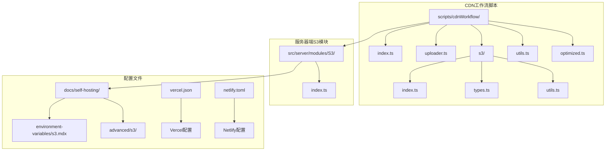
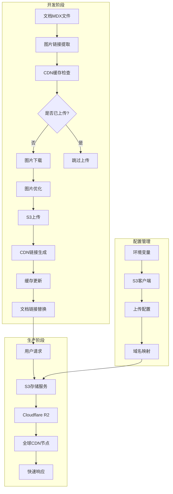
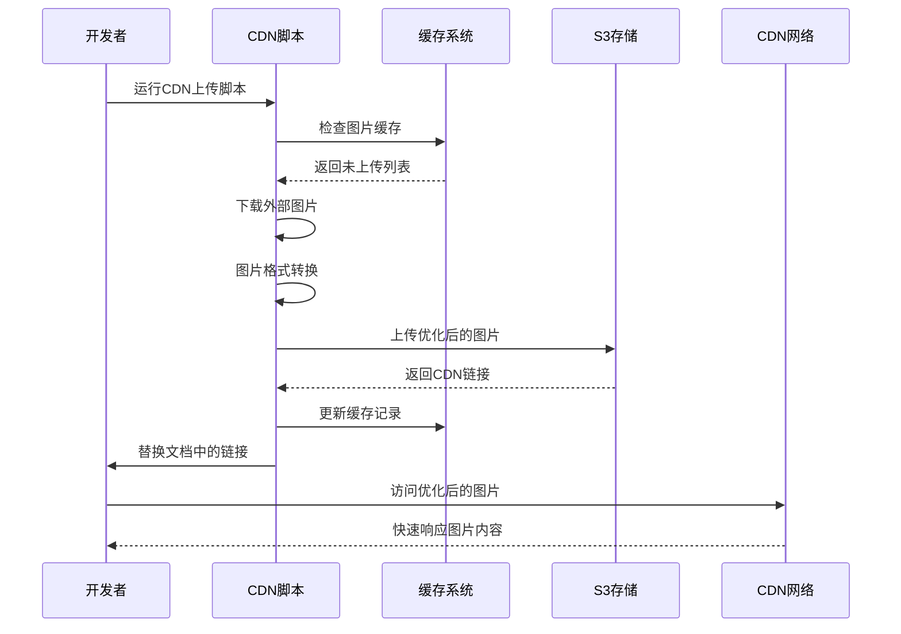
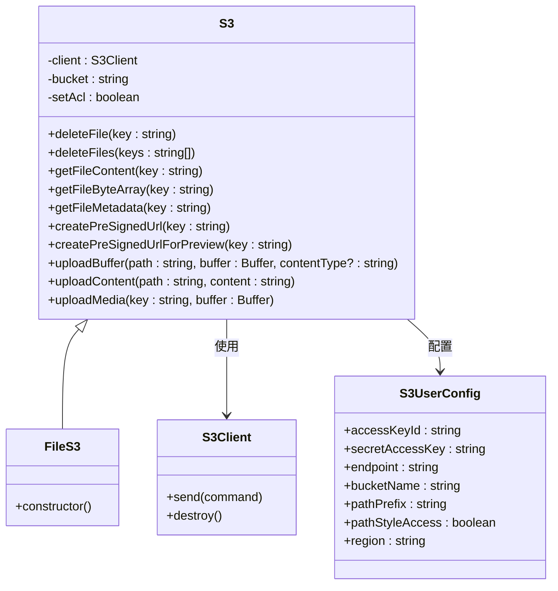
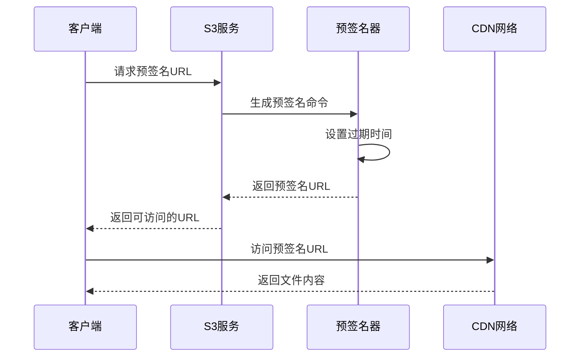

# CDN集成

<cite>
**本文档引用的文件**
- [scripts/cdnWorkflow/index.ts](file://scripts/cdnWorkflow/index.ts)
- [scripts/cdnWorkflow/uploader.ts](file://scripts/cdnWorkflow/uploader.ts)
- [scripts/cdnWorkflow/s3/index.ts](file://scripts/cdnWorkflow/s3/index.ts)
- [scripts/cdnWorkflow/s3/types.ts](file://scripts/cdnWorkflow/s3/types.ts)
- [scripts/cdnWorkflow/s3/utils.ts](file://scripts/cdnWorkflow/s3/utils.ts)
- [scripts/cdnWorkflow/utils.ts](file://scripts/cdnWorkflow/utils.ts)
- [scripts/cdnWorkflow/optimized.ts](file://scripts/cdnWorkflow/optimized.ts)
- [src/server/modules/S3/index.ts](file://src/server/modules/S3/index.ts)
- [src/envs/file.ts](file://src/envs/file.ts)
- [docs/self-hosting/environment-variables/s3.mdx](file://docs/self-hosting/environment-variables/s3.mdx)
- [docs/self-hosting/advanced/s3/cloudflare-r2.mdx](file://docs/self-hosting/advanced/s3/cloudflare-r2.mdx)
- [docs/self-hosting/platform/vercel.mdx](file://docs/self-hosting/platform/vercel.mdx)
- [vercel.json](file://vercel.json)
- [netlify.toml](file://netlify.toml)
</cite>

## 目录
1. [简介](#简介)
2. [项目结构](#项目结构)
3. [核心组件](#核心组件)
4. [架构概览](#架构概览)
5. [详细组件分析](#详细组件分析)
6. [依赖关系分析](#依赖关系分析)
7. [性能考虑](#性能考虑)
8. [故障排除指南](#故障排除指南)
9. [结论](#结论)

## 简介

本项目实现了完整的CDN（内容分发网络）集成方案，主要包含两个层面：

1. **文档图片CDN上传系统**：自动检测和上传文档中的外部图片资源到Cloudflare R2存储
2. **S3兼容存储服务**：提供完整的S3 API兼容性，支持文件上传、预签名URL生成、媒体文件缓存等

该系统通过自动化脚本和配置文件，实现了从本地开发到生产部署的完整CDN解决方案，支持多种云存储提供商和静态托管平台。

## 项目结构

项目的CDN相关代码主要分布在以下目录：



**图表来源**
- [scripts/cdnWorkflow/index.ts:1-231](file://scripts/cdnWorkflow/index.ts#L1-L231)
- [src/server/modules/S3/index.ts:1-216](file://src/server/modules/S3/index.ts#L1-L216)

**章节来源**
- [scripts/cdnWorkflow/index.ts:1-231](file://scripts/cdnWorkflow/index.ts#L1-L231)
- [src/server/modules/S3/index.ts:1-216](file://src/server/modules/S3/index.ts#L1-L216)

## 核心组件

### 文档图片CDN上传器

ImageCDNUploader类是整个CDN系统的核心组件，负责：

- **图片链接收集**：从文档中提取所有外部HTTPS链接
- **智能过滤**：识别GitHub CDN和第三方CDN的图片资源
- **批量上传**：并发上传未缓存的图片资源
- **链接替换**：更新文档中的图片链接为CDN地址

### S3存储客户端

S3类提供了完整的S3兼容存储服务：

- **文件操作**：上传、下载、删除文件
- **预签名URL**：生成临时访问链接
- **媒体优化**：自动压缩和格式转换
- **缓存控制**：长期缓存策略

### 配置管理系统

通过环境变量配置CDN和存储参数：

- S3访问凭据管理
- 存储桶配置
- CDN域名设置
- 访问控制策略

**章节来源**
- [scripts/cdnWorkflow/index.ts:37-225](file://scripts/cdnWorkflow/index.ts#L37-L225)
- [src/server/modules/S3/index.ts:28-216](file://src/server/modules/S3/index.ts#L28-L216)
- [src/envs/file.ts:33-64](file://src/envs/file.ts#L33-L64)

## 架构概览



**图表来源**
- [scripts/cdnWorkflow/index.ts:63-224](file://scripts/cdnWorkflow/index.ts#L63-L224)
- [src/server/modules/S3/index.ts:135-203](file://src/server/modules/S3/index.ts#L135-L203)

## 详细组件分析

### 图片CDN上传流程



**图表来源**
- [scripts/cdnWorkflow/index.ts:104-126](file://scripts/cdnWorkflow/index.ts#L104-L126)
- [scripts/cdnWorkflow/utils.ts:62-94](file://scripts/cdnWorkflow/utils.ts#L62-L94)

#### 图片处理算法

```mermaid
flowchart TD
Start([开始处理图片]) --> CheckType{检查文件类型}
CheckType --> |.gif| OptGif[优化GIF为WebP]
CheckType --> |.png|.jpg| OptImg[优化图片为WebP]
CheckType --> Other[保持原格式]
OptGif --> SetSize[设置最大宽度1600px]
OptImg --> SetSize
SetSize --> Compress[压缩图片质量]
Compress --> Convert[转换为WebP格式]
Convert --> Upload[上传到S3]
Other --> Upload
Upload --> GenURL[生成CDN链接]
GenURL --> End([完成])
```

**图表来源**
- [scripts/cdnWorkflow/optimized.ts:5-21](file://scripts/cdnWorkflow/optimized.ts#L5-L21)
- [scripts/cdnWorkflow/utils.ts:74-80](file://scripts/cdnWorkflow/utils.ts#L74-L80)

**章节来源**
- [scripts/cdnWorkflow/index.ts:103-140](file://scripts/cdnWorkflow/index.ts#L103-L140)
- [scripts/cdnWorkflow/optimized.ts:1-22](file://scripts/cdnWorkflow/optimized.ts#L1-L22)

### S3存储服务架构



**图表来源**
- [src/server/modules/S3/index.ts:28-216](file://src/server/modules/S3/index.ts#L28-L216)
- [scripts/cdnWorkflow/s3/types.ts:8-17](file://scripts/cdnWorkflow/s3/types.ts#L8-L17)

#### 预签名URL生成流程



**图表来源**
- [src/server/modules/S3/index.ts:135-154](file://src/server/modules/S3/index.ts#L135-L154)
- [scripts/cdnWorkflow/s3/index.ts:8-31](file://scripts/cdnWorkflow/s3/index.ts#L8-L31)

**章节来源**
- [src/server/modules/S3/index.ts:135-203](file://src/server/modules/S3/index.ts#L135-L203)
- [scripts/cdnWorkflow/s3/index.ts:58-110](file://scripts/cdnWorkflow/s3/index.ts#L58-L110)

### 配置管理系统

系统通过环境变量实现灵活的配置管理：

| 环境变量 | 类型 | 必需 | 描述 |
|---------|------|------|------|
| S3_ACCESS_KEY_ID | 字符串 | 是 | S3访问密钥ID |
| S3_SECRET_ACCESS_KEY | 字符串 | 是 | S3秘密访问密钥 |
| S3_ENDPOINT | 字符串(URL) | 是 | 存储桶请求端点 |
| S3_BUCKET | 字符串 | 是 | 存储桶名称 |
| S3_REGION | 字符串 | 否 | 存储桶区域 |
| S3_SET_ACL | 布尔值 | 否 | 是否设置公共读权限 |
| S3_ENABLE_PATH_STYLE | 布尔值 | 否 | 是否启用路径样式访问 |

**章节来源**
- [src/envs/file.ts:33-64](file://src/envs/file.ts#L33-L64)
- [docs/self-hosting/environment-variables/s3.mdx:17-66](file://docs/self-hosting/environment-variables/s3.mdx#L17-L66)

## 依赖关系分析

```mermaid
graph TB
subgraph "CDN工作流依赖"
A[ImageCDNUploader] --> B[fetch]
A --> C[p-map]
A --> D[gray-matter]
A --> E[fs-extra]
A --> F[sharp]
end
subgraph "S3存储依赖"
G[S3类] --> H[@aws-sdk/client-s3]
G --> I[@aws-sdk/s3-request-presigner]
G --> J[mime]
end
subgraph "配置依赖"
K[环境变量] --> L[zod]
M[上传器] --> N[dotenv]
end
A --> G
O[静态托管] --> P[Vercel]
O --> Q[Netlify]
```

**图表来源**
- [scripts/cdnWorkflow/index.ts:1-20](file://scripts/cdnWorkflow/index.ts#L1-L20)
- [src/server/modules/S3/index.ts:1-12](file://src/server/modules/S3/index.ts#L1-L12)

### 外部依赖分析

系统的关键依赖包括：

- **AWS SDK**：提供S3 API兼容性
- **Sharp**：图像处理和格式转换
- **Mime**：文件类型检测
- **Zod**：环境变量验证
- **Consola**：日志输出

**章节来源**
- [scripts/cdnWorkflow/index.ts:1-20](file://scripts/cdnWorkflow/index.ts#L1-L20)
- [src/server/modules/S3/index.ts:1-12](file://src/server/modules/S3/index.ts#L1-L12)

## 性能考虑

### 图像优化策略

1. **自动格式转换**：GIF转换为WebP，PNG/JPG转换为WebP
2. **尺寸限制**：最大宽度1600px，防止过大文件
3. **质量压缩**：在保证质量的前提下减少文件大小
4. **长期缓存**：媒体文件设置1年缓存策略

### 并发处理

- **批量上传**：使用p-map实现并发上传
- **缓存机制**：避免重复上传相同图片
- **内存管理**：及时释放处理后的缓冲区

### CDN优化

- **全球分发**：通过Cloudflare R2实现全球加速
- **边缘缓存**：利用CDN节点缓存热门资源
- **智能路由**：根据用户位置选择最优节点

## 故障排除指南

### 常见问题及解决方案

#### S3连接问题

**症状**：上传失败或连接超时
**原因**：
- 网络连接不稳定
- 凭据配置错误
- 端点URL格式不正确

**解决方案**：
1. 验证S3_ENDPOINT格式（必须包含https://）
2. 检查访问密钥和秘密密钥
3. 确认存储桶名称正确
4. 测试网络连接

#### 图片上传失败

**症状**：图片无法上传或显示空白
**原因**：
- 图片格式不受支持
- 文件过大
- CDN缓存问题

**解决方案**：
1. 检查图片格式是否为支持的类型
2. 确认文件大小不超过限制
3. 清除浏览器缓存
4. 重新运行CDN上传脚本

#### CORS配置问题

**症状**：跨域请求被阻止
**解决方案**：
1. 在Cloudflare R2中配置CORS规则
2. 添加允许的源域名
3. 确保允许的方法和头部正确

**章节来源**
- [scripts/cdnWorkflow/uploader.ts:10-26](file://scripts/cdnWorkflow/uploader.ts#L10-L26)
- [docs/self-hosting/platform/vercel.mdx:213-225](file://docs/self-hosting/platform/vercel.mdx#L213-L225)

### 调试工具

系统提供了详细的日志输出：

- **上传进度**：显示当前处理的图片链接
- **错误信息**：详细记录上传失败的原因
- **缓存状态**：显示缓存命中情况
- **性能指标**：统计处理时间和成功率

**章节来源**
- [scripts/cdnWorkflow/index.ts:107-121](file://scripts/cdnWorkflow/index.ts#L107-L121)

## 结论

本项目的CDN集成方案提供了完整的自动化解决方案，具有以下优势：

1. **自动化程度高**：从图片检测到上传替换全程自动化
2. **性能优化**：智能图像处理和CDN缓存策略
3. **配置灵活**：支持多种S3兼容存储提供商
4. **易于维护**：清晰的代码结构和完善的错误处理

通过该系统，开发者可以专注于内容创作，而无需担心图片资源的存储和分发问题。系统支持从本地开发到生产部署的完整生命周期，确保图片资源的高效传输和优质体验。

建议在生产环境中：
- 定期运行CDN上传脚本
- 监控CDN缓存命中率
- 配置适当的CORS规则
- 设置合理的过期时间
- 监控存储成本和使用情况