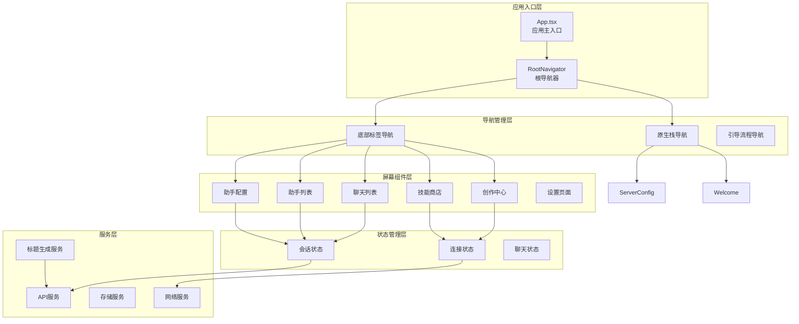
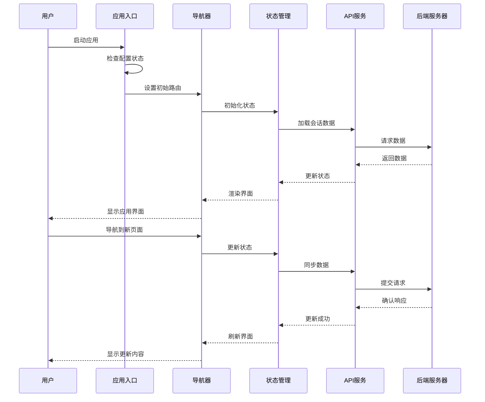
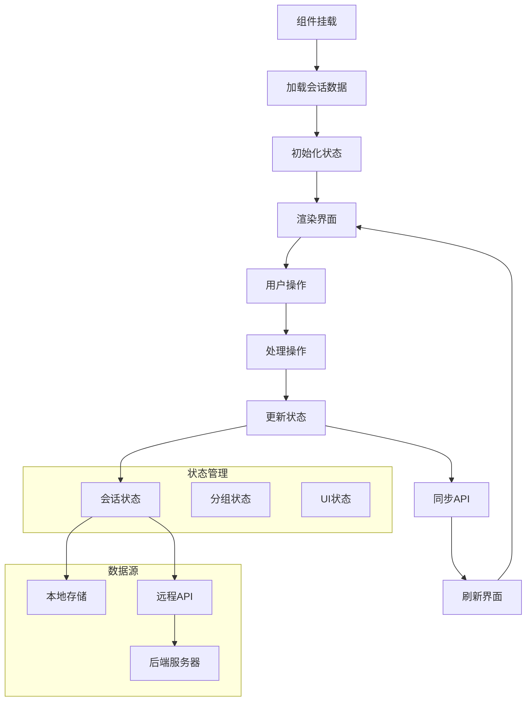
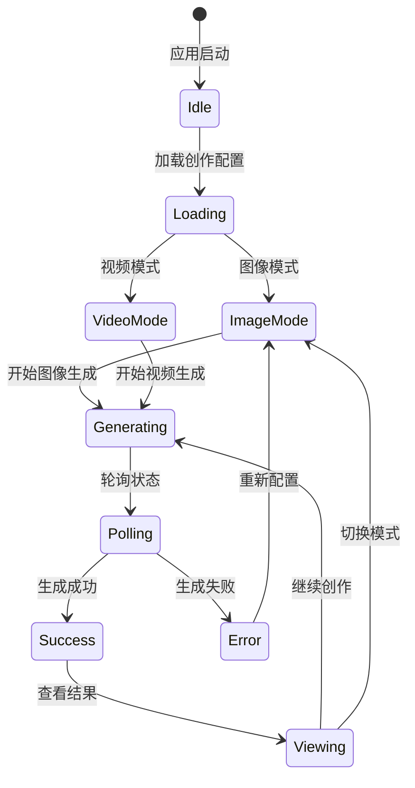
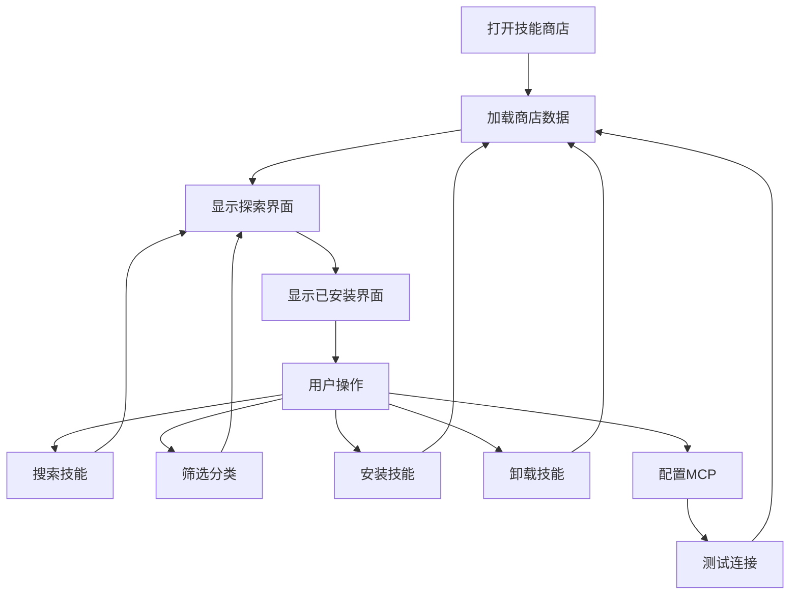
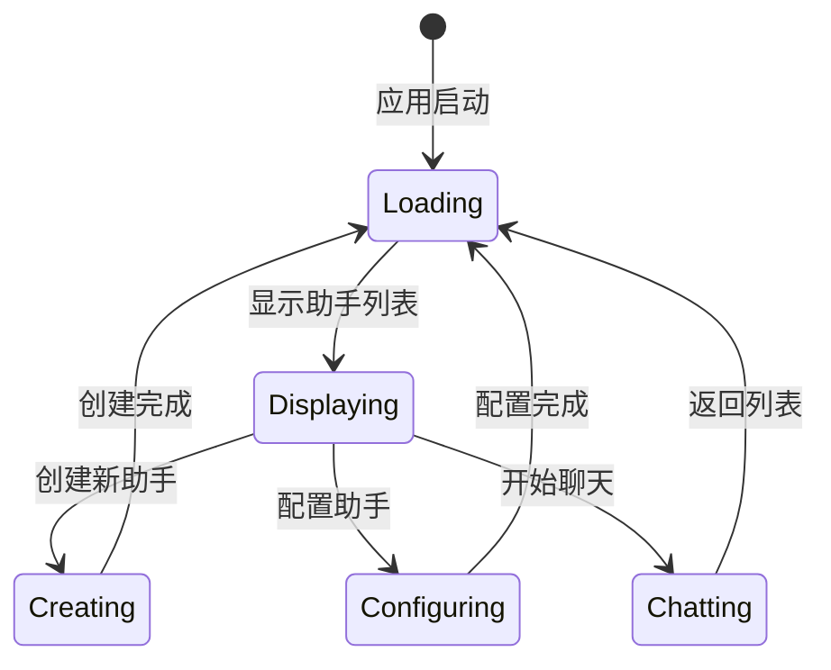
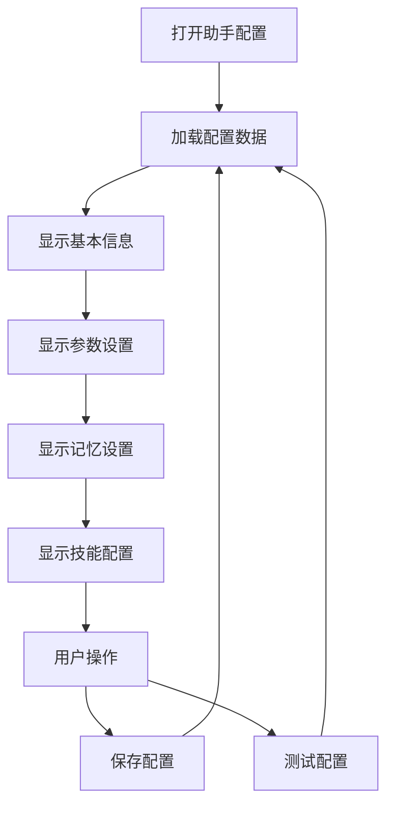
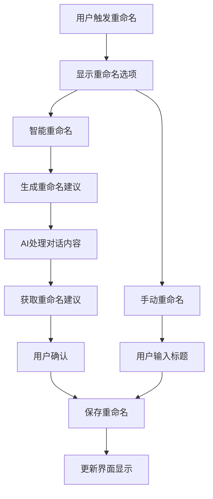
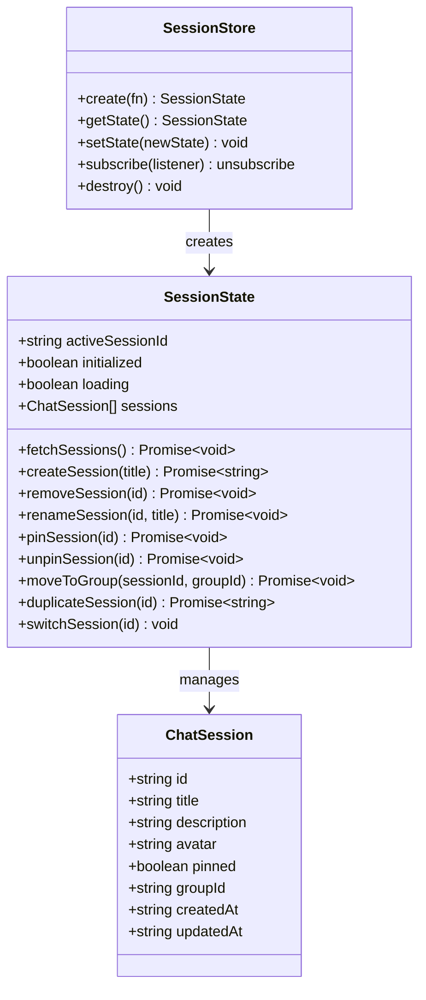

# 移动端导航系统

<cite>
**本文档引用的文件**
- [apps/mobile/App.tsx](file://apps/mobile/App.tsx)
- [apps/mobile/src/navigation/index.tsx](file://apps/mobile/src/navigation/index.tsx)
- [apps/mobile/src/screens/CreateScreen.tsx](file://apps/mobile/src/screens/CreateScreen.tsx)
- [apps/mobile/src/screens/StoreScreen.tsx](file://apps/mobile/src/screens/StoreScreen.tsx)
- [apps/mobile/src/screens/AgentListScreen.tsx](file://apps/mobile/src/screens/AgentListScreen.tsx)
- [apps/mobile/src/screens/AgentConfigScreen.tsx](file://apps/mobile/src/screens/AgentConfigScreen.tsx)
- [apps/mobile/src/screens/ChatListScreen.tsx](file://apps/mobile/src/screens/ChatListScreen.tsx)
- [apps/mobile/src/screens/ChatDetailScreen.tsx](file://apps/mobile/src/screens/ChatDetailScreen.tsx)
- [apps/mobile/src/components/ui/TopicItem.tsx](file://apps/mobile/src/components/ui/TopicItem.tsx)
- [apps/mobile/src/lib/titleGeneration.ts](file://apps/mobile/src/lib/titleGeneration.ts)
- [apps/mobile/src/store/session.ts](file://apps/mobile/src/store/session.ts)
- [apps/mobile/src/store/connection.ts](file://apps/mobile/src/store/connection.ts)
- [apps/mobile/src/lib/api.ts](file://apps/mobile/src/lib/api.ts)
- [apps/mobile/src/components/ui/ScreenHeader.tsx](file://apps/mobile/src/components/ui/ScreenHeader.tsx)
- [apps/mobile/package.json](file://apps/mobile/package.json)
- [locales/en-US/common.json](file://locales/en-US/common.json)
</cite>

## 更新摘要

**所做更改**

- 新增助手中心导航系统，包含 AgentListScreen 和 AgentConfigScreen
- 重构 Tab 界面，将 Artwork 标签替换为 Create 标签，新增 Store 标签
- 新增智能重命名功能，支持对话主题的智能重命名
- 新增视频创作功能，与图像生成并列的创作模式
- 优化导航结构，提供更清晰的助手管理和技能商店入口

## 目录

1. [简介](#简介)
2. [项目结构](#项目结构)
3. [核心组件](#核心组件)
4. [架构概览](#架构概览)
5. [详细组件分析](#详细组件分析)
6. [依赖关系分析](#依赖关系分析)
7. [性能考虑](#性能考虑)
8. [故障排除指南](#故障排除指南)
9. [结论](#结论)

## 简介

移动端导航系统是 LobeHub 移动应用的核心基础设施，基于 React Navigation 构建，提供了完整的移动端应用导航体验。该系统采用原生栈导航器和底部标签导航器的组合架构，支持多屏幕路由、状态管理和用户交互。

系统主要特点包括：

- 基于 React Navigation 的现代化导航架构
- 支持移动端特有的手势操作和动画效果
- 完整的生命周期管理和状态持久化
- 实时网络状态检测和错误处理机制
- 本地存储集成和数据同步

## 项目结构

移动端导航系统的整体架构采用分层设计模式，清晰分离了导航逻辑、业务逻辑和 UI 组件：



**图表来源**

- [apps/mobile/App.tsx:35-112](file://apps/mobile/App.tsx#L35-L112)
- [apps/mobile/src/navigation/index.tsx:116-274](file://apps/mobile/src/navigation/index.tsx#L116-L274)

**章节来源**

- [apps/mobile/App.tsx:1-112](file://apps/mobile/App.tsx#L1-L112)
- [apps/mobile/src/navigation/index.tsx:1-318](file://apps/mobile/src/navigation/index.tsx#L1-L318)

## 核心组件

### 应用主入口组件

应用主入口组件负责初始化应用状态、处理网络状态监听和管理应用启动流程。该组件实现了智能的初始路由选择逻辑，根据用户的配置状态决定应用的启动路径。

关键特性：

- 智能初始路由决策（引导流程、服务器配置、主界面）
- 网络状态实时监控和提示
- 国际化语言加载
- 启动画面显示和延迟加载

### 根导航器组件

根导航器是整个应用导航系统的核心，采用原生栈导航器包装底部标签导航器的设计模式。这种架构允许在不同场景下灵活切换导航模式。

导航层次结构：

- 引导流程：欢迎页面 → 服务器配置 → 完成页面
- 主应用：底部标签导航（聊天、创作、资源、技能商店、我的）
- 设置页面：独立的导航栈
- 助手管理：独立的导航栈
- 创作功能：独立的导航栈

**更新** 新增了 Create、Store 和 AgentList 标签，替换了原有的 Discover 标签

**章节来源**

- [apps/mobile/App.tsx:35-112](file://apps/mobile/App.tsx#L35-L112)
- [apps/mobile/src/navigation/index.tsx:174-318](file://apps/mobile/src/navigation/index.tsx#L174-L318)

## 架构概览

移动端导航系统采用模块化架构设计，各组件职责明确，耦合度低，便于维护和扩展。



**图表来源**

- [apps/mobile/App.tsx:59-93](file://apps/mobile/App.tsx#L59-L93)
- [apps/mobile/src/navigation/index.tsx:174-201](file://apps/mobile/src/navigation/index.tsx#L174-L201)

## 详细组件分析

### 聊天列表屏幕组件

聊天列表屏幕是应用的核心界面之一，提供了完整的会话管理功能。该组件实现了复杂的 UI 交互和状态管理逻辑。

#### 主要功能模块

1. **动态问候系统**：根据当前时间显示不同的问候语
2. **会话分组管理**：支持固定会话、自定义分组和默认分组
3. **搜索过滤功能**：实时搜索和过滤会话
4. **手势操作支持**：滑动删除、长按菜单等
5. **快捷操作面板**：提供常用操作的快速入口

#### 数据流分析



**图表来源**

- [apps/mobile/src/screens/ChatListScreen.tsx:79-128](file://apps/mobile/src/screens/ChatListScreen.tsx#L79-L128)
- [apps/mobile/src/store/session.ts:37-185](file://apps/mobile/src/store/session.ts#L37-L185)

#### 性能优化策略

- **虚拟滚动**：使用 React Native 的高性能滚动视图
- **状态选择器**：使用 useShallow 避免不必要的重渲染
- **懒加载**：按需加载用户头像和图片资源
- **防抖处理**：搜索输入的防抖优化

**章节来源**

- [apps/mobile/src/screens/ChatListScreen.tsx:1-550](file://apps/mobile/src/screens/ChatListScreen.tsx#L1-L550)
- [apps/mobile/src/store/session.ts:1-185](file://apps/mobile/src/store/session.ts#L1-L185)

### 创作中心屏幕组件

**新增** 创作中心屏幕是新增的导航标签，专门用于 AI 内容创作功能。该组件提供了图像生成和视频创作的统一入口。

#### 主要功能模块

1. **创作模式切换**：支持图像生成和视频创作两种模式
2. **智能重命名**：为对话主题提供智能重命名功能
3. **创作历史管理**：查看和管理之前的创作记录
4. **模型选择**：支持多种 AI 创作模型的选择和配置
5. **参数配置**：分辨率、风格、质量等创作参数设置

#### 创作模式流程



**图表来源**

- [apps/mobile/src/screens/CreateScreen.tsx:15-87](file://apps/mobile/src/screens/CreateScreen.tsx#L15-L87)

#### 技术特性

- **双模式支持**：统一的界面管理图像和视频创作
- **智能重命名**：集成对话主题的智能重命名功能
- **实时状态轮询**：自动轮询创作任务状态
- **配置持久化**：使用 AsyncStorage 保存用户配置
- **错误处理机制**：完善的错误捕获和用户提示

**章节来源**

- [apps/mobile/src/screens/CreateScreen.tsx:1-87](file://apps/mobile/src/screens/CreateScreen.tsx#L1-L87)

### 技能商店屏幕组件

**更新** Store 标签页提供了完整的技能和 MCP 服务器管理功能，支持 Agent 技能、社区 MCP 和自定义 MCP 的管理。

#### 功能分类

1. **探索模式**：浏览和搜索可用的技能和 MCP 服务器
2. **已安装管理**：查看和管理已安装的技能和插件
3. **技能分类**：按类型、来源、评分等维度分类管理
4. **搜索过滤**：支持关键词搜索和多维度筛选
5. **批量操作**：支持批量安装、卸载和更新

#### 商店管理流程



**图表来源**

- [apps/mobile/src/screens/StoreScreen.tsx:1-800](file://apps/mobile/src/screens/StoreScreen.tsx#L1-L800)

#### 技术特性

- **多源技能管理**：支持内置、市场和用户技能的统一管理
- **MCP 服务器管理**：完整的 MCP 服务器生命周期管理
- **技能导入功能**：支持多种导入方式和格式验证
- **连接测试**：提供 MCP 服务器连接测试功能
- **权限管理**：支持不同类型的认证方式

**章节来源**

- [apps/mobile/src/screens/StoreScreen.tsx:1-800](file://apps/mobile/src/screens/StoreScreen.tsx#L1-L800)

### 助手列表屏幕组件

**新增** 助手列表屏幕提供了完整的 AI 助手管理功能，支持助手的创建、配置、删除和会话管理。

#### 主要功能模块

1. **助手列表展示**：显示所有可用的 AI 助手
2. **助手创建**：支持快速创建新的 AI 助手
3. **助手配置**：进入助手详细配置界面
4. **助手删除**：安全删除不需要的助手
5. **会话关联**：将助手与现有会话关联

#### 助手管理流程



**图表来源**

- [apps/mobile/src/screens/AgentListScreen.tsx:51-342](file://apps/mobile/src/screens/AgentListScreen.tsx#L51-L342)

#### 技术特性

- **助手查询**：从 API 获取完整的助手列表
- **会话关联**：自动关联已有会话
- **创建向导**：简化新助手的创建流程
- **删除保护**：防止误删默认助手
- **实时刷新**：支持手动刷新助手列表

**章节来源**

- [apps/mobile/src/screens/AgentListScreen.tsx:1-342](file://apps/mobile/src/screens/AgentListScreen.tsx#L1-L342)

### 助手配置屏幕组件

**新增** 助手配置屏幕提供了完整的 AI 助手个性化配置功能。

#### 功能分类

1. **基本信息配置**：标题、描述、头像等基础信息
2. **对话参数设置**：温度、最大令牌数、频率惩罚等
3. **记忆功能配置**：记忆开关、记忆强度设置
4. **技能集成**：选择和配置助手使用的技能
5. **模型选择**：选择合适的 AI 模型和提供商

#### 配置管理流程



**图表来源**

- [apps/mobile/src/screens/AgentConfigScreen.tsx:1-800](file://apps/mobile/src/screens/AgentConfigScreen.tsx#L1-L800)

#### 技术特性

- **参数验证**：对数值参数进行有效性验证
- **实时预览**：配置变化的实时预览效果
- **技能管理**：完整的技能选择和管理界面
- **模型选择**：直观的模型和提供商选择
- **配置保存**：支持部分参数的增量保存

**章节来源**

- [apps/mobile/src/screens/AgentConfigScreen.tsx:1-800](file://apps/mobile/src/screens/AgentConfigScreen.tsx#L1-L800)

### 智能重命名功能

**新增** 智能重命名功能为对话主题提供了 AI 驱动的自动重命名能力。

#### 功能特性

1. **AI 重命名建议**：基于对话内容生成智能重命名建议
2. **手动重命名**：支持用户手动输入自定义标题
3. **重命名历史**：查看和管理历史重命名记录
4. **重命名策略**：支持多种重命名策略和模板
5. **批量重命名**：支持批量重命名多个对话主题

#### 重命名流程



**图表来源**

- [apps/mobile/src/components/ui/TopicItem.tsx:30-269](file://apps/mobile/src/components/ui/TopicItem.tsx#L30-L269)
- [apps/mobile/src/lib/titleGeneration.ts](file://apps/mobile/src/lib/titleGeneration.ts)

#### 技术实现

- **标题生成算法**：基于对话内容的智能标题生成
- **AI 集成**：与后端 AI 服务的深度集成
- **用户反馈**：支持用户对 AI 建议的反馈和调整
- **历史记录**：完整的重命名历史追踪
- **性能优化**：高效的重命名处理和缓存机制

**章节来源**

- [apps/mobile/src/components/ui/TopicItem.tsx:1-269](file://apps/mobile/src/components/ui/TopicItem.tsx#L1-L269)
- [apps/mobile/src/lib/titleGeneration.ts](file://apps/mobile/src/lib/titleGeneration.ts)

### 状态管理系统

移动端导航系统采用 Zustand 作为状态管理解决方案，提供了轻量级但功能强大的状态管理能力。

#### 会话状态管理

会话状态管理负责维护用户的所有聊天会话数据，包括创建、删除、重命名和分组等功能。



**图表来源**

- [apps/mobile/src/store/session.ts:18-35](file://apps/mobile/src/store/session.ts#L18-L35)

#### 连接状态管理

连接状态管理负责监控服务器连接状态，提供实时的网络可用性信息。

**章节来源**

- [apps/mobile/src/store/session.ts:1-185](file://apps/mobile/src/store/session.ts#L1-L185)
- [apps/mobile/src/store/connection.ts:1-39](file://apps/mobile/src/store/connection.ts#L1-L39)

## 依赖关系分析

移动端导航系统的主要依赖关系如下：

```mermaid
graph LR
subgraph "核心依赖"
ReactNavigation[React Navigation<br/>@react-navigation/native]
BottomTabs[@react-navigation/bottom-tabs]
NativeStack[@react-navigation/native-stack]
GestureHandler[react-native-gesture-handler]
SafeArea[react-native-safe-area-context]
end
subgraph "UI框架"
ReactNative[React Native<br/>react-native]
Expo[Expo SDK<br/>expo]
Tailwind[Tailwind CSS<br/>nativewind]
end
subgraph "状态管理"
Zustand[Zustand<br/>zustand]
AsyncStorage[@react-native-async-storage]
end
subgraph "网络通信"
Fetch[Fetch API<br/>原生HTTP]
SuperJSON[SuperJSON<br/>数据序列化]
NetInfo[@react-native-community/netinfo]
end
ReactNavigation --> BottomTabs
ReactNavigation --> NativeStack
ReactNavigation --> GestureHandler
ReactNavigation --> SafeArea
BottomTabs --> ReactNative
NativeStack --> ReactNative
GestureHandler --> ReactNative
SafeArea --> ReactNative
Zustand --> AsyncStorage
Zustand --> ReactNative
NetInfo --> ReactNative
Expo --> ReactNative
Tailwind --> ReactNative
```

**图表来源**

- [apps/mobile/package.json:12-42](file://apps/mobile/package.json#L12-L42)

**章节来源**

- [apps/mobile/package.json:1-50](file://apps/mobile/package.json#L1-L50)

## 性能考虑

移动端导航系统在性能方面采用了多项优化策略：

### 渲染性能优化

1. **虚拟化列表**：使用 React Native 的虚拟化列表组件优化大量数据的渲染
2. **状态选择器**：使用 useShallow 避免不必要的组件重渲染
3. **懒加载策略**：按需加载图片和资源文件
4. **动画优化**：使用原生驱动的动画提高流畅度

### 内存管理

1. **状态清理**：及时清理不再使用的状态和事件监听器
2. **缓存策略**：合理使用缓存减少重复的数据请求
3. **内存泄漏防护**：确保所有订阅都能正确清理

### 网络性能

1. **连接池管理**：复用 HTTP 连接减少网络开销
2. **数据压缩**：使用 SuperJSON 进行高效的数据序列化
3. **离线支持**：提供基本的离线功能和数据同步

## 故障排除指南

### 常见问题及解决方案

#### 导航问题

**问题**：页面无法正确导航或出现导航异常

- 检查导航器配置是否正确
- 验证屏幕组件的导入路径
- 确认路由名称与组件名称匹配

**问题**：底部标签不显示或图标不正确

- 检查图标库的正确导入
- 验证主题配置中的颜色设置
- 确认平台特定的样式设置

#### 新增功能问题

**问题**：Create 标签无法访问或功能异常

- 检查 CreateScreen 组件的导入和注册
- 验证 AI 模型配置和网络连接
- 确认图像生成 API 的可用性

**问题**：Store 标签显示空白或加载失败

- 检查 StoreScreen 组件的导入和注册
- 验证技能 API 接口和网络连接
- 确认 MCP 服务器配置和认证状态

**问题**：AgentList 标签显示空白或加载失败

- 检查 AgentListScreen 组件的导入和注册
- 验证 Agent API 接口和网络连接
- 确认用户权限和认证状态

**问题**：智能重命名功能异常

- 检查 TitleGeneration 服务的可用性
- 验证 AI 重命名 API 的连接状态
- 确认对话内容的完整性

#### 状态管理问题

**问题**：状态更新后界面不刷新

- 检查状态更新函数的调用方式
- 验证状态选择器的使用
- 确认组件的订阅机制

**问题**：数据同步失败或数据丢失

- 检查 API 调用的错误处理
- 验证本地存储的读写权限
- 确认网络连接状态

#### 性能问题

**问题**：应用启动缓慢或界面卡顿

- 检查是否有过多的重渲染
- 验证数据加载的优化策略
- 确认动画和过渡效果的使用

**章节来源**

- [apps/mobile/src/navigation/index.tsx:43-110](file://apps/mobile/src/navigation/index.tsx#L43-L110)
- [apps/mobile/src/store/session.ts:43-60](file://apps/mobile/src/store/session.ts#L43-L60)

## 结论

移动端导航系统展现了现代移动应用开发的最佳实践，通过合理的架构设计和组件分离，实现了高度可维护和可扩展的导航解决方案。

### 主要优势

1. **架构清晰**：分层设计使得代码结构清晰，职责明确
2. **性能优秀**：采用多种优化策略确保流畅的用户体验
3. **易于维护**：模块化设计便于功能扩展和 bug 修复
4. **用户体验佳**：丰富的交互效果和流畅的导航体验

### 技术亮点

- 基于 React Navigation 的现代化导航架构
- 完整的状态管理和数据同步机制
- 实时网络状态监控和错误处理
- 本地存储集成和数据持久化
- 响应式设计和跨平台兼容性

### 新功能价值

**助手中心导航系统**：为用户提供完整的 AI 助手管理功能，支持助手的创建、配置和管理
**智能重命名功能**：通过 AI 技术为对话主题提供智能重命名建议，提升用户体验
**创作中心**：统一管理图像生成和视频创作功能，提供更好的创作体验
**技能商店**：提供完整的技能和 MCP 服务器管理，支持丰富的 AI 功能扩展

该导航系统为 LobeHub 移动应用提供了坚实的技术基础，能够支持复杂的功能需求和良好的用户体验。
