# 移动端导航系统

<cite>
**本文档引用的文件**
- [apps/mobile/App.tsx](file://apps/mobile/App.tsx)
- [apps/mobile/src/navigation/index.tsx](file://apps/mobile/src/navigation/index.tsx)
- [apps/mobile/src/screens/ArtworkScreen.tsx](file://apps/mobile/src/screens/ArtworkScreen.tsx)
- [apps/mobile/src/screens/ResourceScreen.tsx](file://apps/mobile/src/screens/ResourceScreen.tsx)
- [apps/mobile/src/screens/SettingsScreen.tsx](file://apps/mobile/src/screens/SettingsScreen.tsx)
- [apps/mobile/src/screens/ProfileScreen.tsx](file://apps/mobile/src/screens/ProfileScreen.tsx)
- [apps/mobile/src/screens/DiscoverScreen.tsx](file://apps/mobile/src/screens/DiscoverScreen.tsx)
- [apps/mobile/src/screens/ChatListScreen.tsx](file://apps/mobile/src/screens/ChatListScreen.tsx)
- [apps/mobile/src/screens/ServerConfigScreen.tsx](file://apps/mobile/src/screens/ServerConfigScreen.tsx)
- [apps/mobile/src/screens/onboarding/WelcomeScreen.tsx](file://apps/mobile/src/screens/onboarding/WelcomeScreen.tsx)
- [apps/mobile/src/screens/SkillSettingsScreen.tsx](file://apps/mobile/src/screens/SkillSettingsScreen.tsx)
- [apps/mobile/src/store/session.ts](file://apps/mobile/src/store/session.ts)
- [apps/mobile/src/store/connection.ts](file://apps/mobile/src/store/connection.ts)
- [apps/mobile/src/lib/api.ts](file://apps/mobile/src/lib/api.ts)
- [apps/mobile/src/components/ui/ScreenHeader.tsx](file://apps/mobile/src/components/ui/ScreenHeader.tsx)
- [apps/mobile/package.json](file://apps/mobile/package.json)
- [locales/en-US/common.json](file://locales/en-US/common.json)
</cite>

## 更新摘要

**所做更改**

- 重构导航结构，新增 Artwork 标签页（带调色板图标）和 Resources 标签页
- 新增 Skills 标签页，提供技能和 MCP 服务器管理功能
- 将 Profile 标签页重命名为 Settings，创建更合理的创意工具、资源和技能管理导航流程
- 新增 ResourceScreen 组件，提供文件资源管理功能
- 新增 SettingsScreen 组件，提供完整设置管理界面
- 新增 SkillSettingsScreen 组件，提供技能和 MCP 服务器管理功能
- 更新底部标签导航器的标签配置，替换 Discover 标签为 Artwork 标签
- 重新组织导航层级，优化用户体验流程

## 目录

1. [简介](#简介)
2. [项目结构](#项目结构)
3. [核心组件](#核心组件)
4. [架构概览](#架构概览)
5. [详细组件分析](#详细组件分析)
6. [依赖关系分析](#依赖关系分析)
7. [性能考虑](#性能考虑)
8. [故障排除指南](#故障排除指南)
9. [结论](#结论)

## 简介

移动端导航系统是 LobeHub 移动应用的核心基础设施，基于 React Navigation 构建，提供了完整的移动端应用导航体验。该系统采用原生栈导航器和底部标签导航器的组合架构，支持多屏幕路由、状态管理和用户交互。

系统主要特点包括：

- 基于 React Navigation 的现代化导航架构
- 支持移动端特有的手势操作和动画效果
- 完整的生命周期管理和状态持久化
- 实时网络状态检测和错误处理机制
- 本地存储集成和数据同步

## 项目结构

移动端导航系统的整体架构采用分层设计模式，清晰分离了导航逻辑、业务逻辑和 UI 组件：

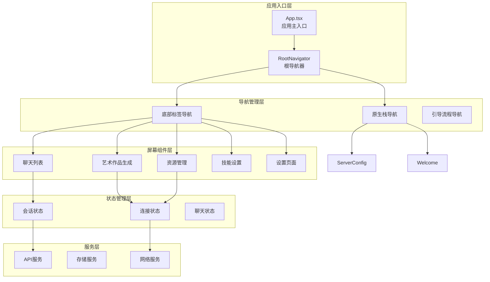

**图表来源**

- [apps/mobile/App.tsx:35-112](file://apps/mobile/App.tsx#L35-L112)
- [apps/mobile/src/navigation/index.tsx:116-274](file://apps/mobile/src/navigation/index.tsx#L116-L274)

**章节来源**

- [apps/mobile/App.tsx:1-112](file://apps/mobile/App.tsx#L1-L112)
- [apps/mobile/src/navigation/index.tsx:1-318](file://apps/mobile/src/navigation/index.tsx#L1-L318)

## 核心组件

### 应用主入口组件

应用主入口组件负责初始化应用状态、处理网络状态监听和管理应用启动流程。该组件实现了智能的初始路由选择逻辑，根据用户的配置状态决定应用的启动路径。

关键特性：

- 智能初始路由决策（引导流程、服务器配置、主界面）
- 网络状态实时监控和提示
- 国际化语言加载
- 启动画面显示和延迟加载

### 根导航器组件

根导航器是整个应用导航系统的核心，采用原生栈导航器包装底部标签导航器的设计模式。这种架构允许在不同场景下灵活切换导航模式。

导航层次结构：

- 引导流程：欢迎页面 → 服务器配置 → 完成页面
- 主应用：底部标签导航（聊天、艺术作品、资源、技能、设置）
- 设置页面：独立的导航栈
- 艺术作品功能：独立的导航栈

**更新** 新增了 Artwork、Resources 和 Skills 标签，替换了原有的 Discover 标签

**章节来源**

- [apps/mobile/App.tsx:35-112](file://apps/mobile/App.tsx#L35-L112)
- [apps/mobile/src/navigation/index.tsx:174-318](file://apps/mobile/src/navigation/index.tsx#L174-L318)

## 架构概览

移动端导航系统采用模块化架构设计，各组件职责明确，耦合度低，便于维护和扩展。

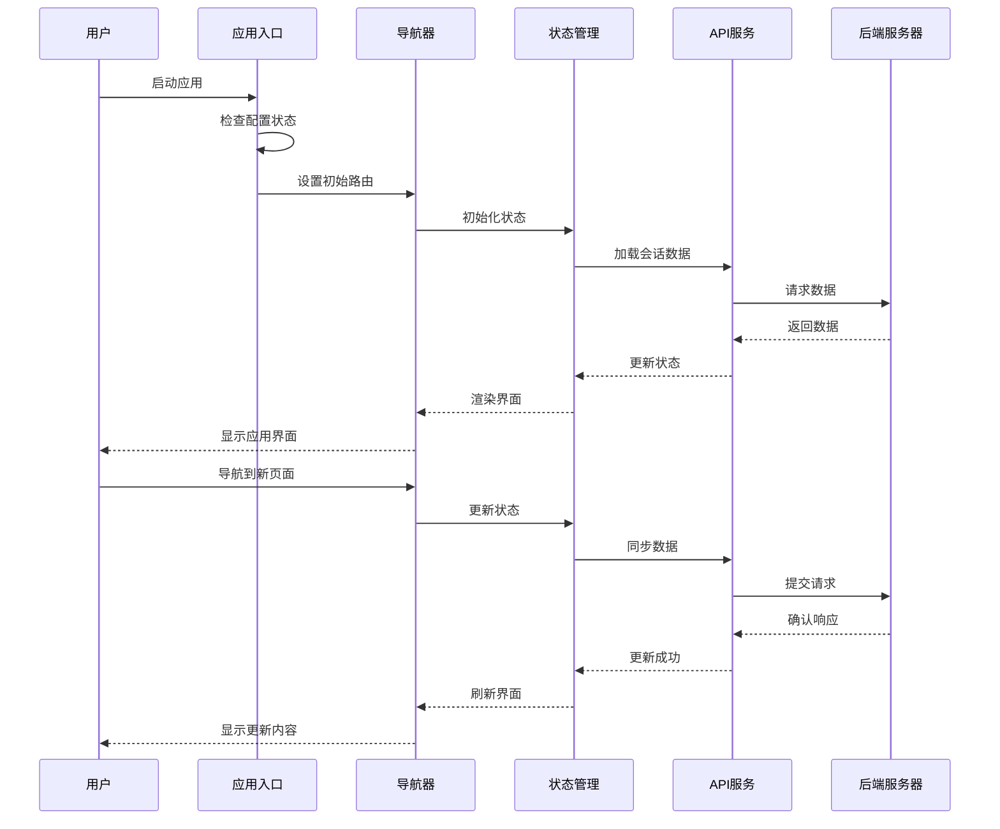

**图表来源**

- [apps/mobile/App.tsx:59-93](file://apps/mobile/App.tsx#L59-L93)
- [apps/mobile/src/navigation/index.tsx:174-201](file://apps/mobile/src/navigation/index.tsx#L174-L201)

## 详细组件分析

### 聊天列表屏幕组件

聊天列表屏幕是应用的核心界面之一，提供了完整的会话管理功能。该组件实现了复杂的 UI 交互和状态管理逻辑。

#### 主要功能模块

1. **动态问候系统**：根据当前时间显示不同的问候语
2. **会话分组管理**：支持固定会话、自定义分组和默认分组
3. **搜索过滤功能**：实时搜索和过滤会话
4. **手势操作支持**：滑动删除、长按菜单等
5. **快捷操作面板**：提供常用操作的快速入口

#### 数据流分析

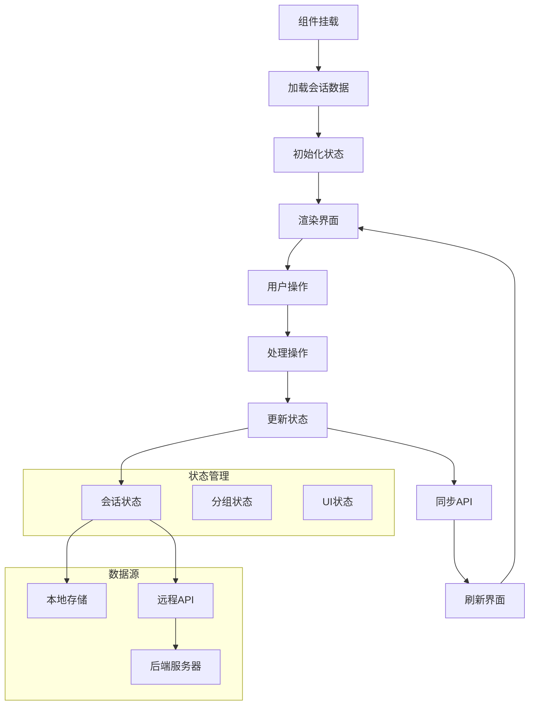

**图表来源**

- [apps/mobile/src/screens/ChatListScreen.tsx:79-128](file://apps/mobile/src/screens/ChatListScreen.tsx#L79-L128)
- [apps/mobile/src/store/session.ts:37-185](file://apps/mobile/src/store/session.ts#L37-L185)

#### 性能优化策略

- **虚拟滚动**：使用 React Native 的高性能滚动视图
- **状态选择器**：使用 useShallow 避免不必要的重渲染
- **懒加载**：按需加载用户头像和图片资源
- **防抖处理**：搜索输入的防抖优化

**章节来源**

- [apps/mobile/src/screens/ChatListScreen.tsx:1-550](file://apps/mobile/src/screens/ChatListScreen.tsx#L1-L550)
- [apps/mobile/src/store/session.ts:1-185](file://apps/mobile/src/store/session.ts#L1-L185)

### 艺术作品生成屏幕组件

**新增** 艺术作品生成屏幕是新增的导航标签，专门用于图像生成功能。该组件提供了完整的 AI 图像生成工作流程。

#### 主要功能模块

1. **模型选择器**：支持多种 AI 图像生成模型的选择和配置
2. **参数配置**：分辨率、宽高比、图像数量等生成参数设置
3. **参考图像上传**：支持多张参考图像的上传和管理
4. **生成队列管理**：实时显示生成任务状态和结果
5. **历史记录查看**：查看和管理之前的生成批次

#### 生成流程

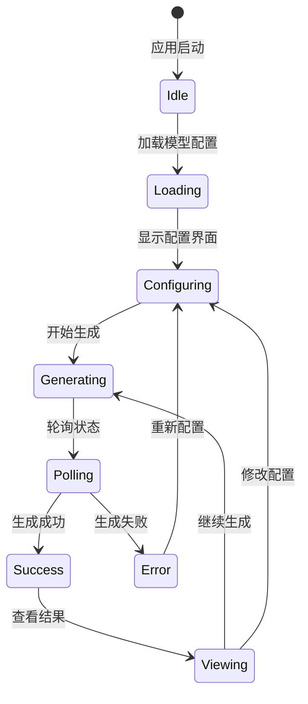

**图表来源**

- [apps/mobile/src/screens/ArtworkScreen.tsx:375-453](file://apps/mobile/src/screens/ArtworkScreen.tsx#L375-L453)

#### 技术特性

- **实时状态轮询**：自动轮询生成任务状态，最长轮询时间为 15 秒
- **配置持久化**：使用 AsyncStorage 保存用户配置
- **异步任务处理**：支持多个并发生成任务
- **错误处理机制**：完善的错误捕获和用户提示

**章节来源**

- [apps/mobile/src/screens/ArtworkScreen.tsx:1-1073](file://apps/mobile/src/screens/ArtworkScreen.tsx#L1-L1073)

### 资源管理屏幕组件

**新增** 资源管理屏幕提供了完整的文件资源管理功能，支持多种文件类型的上传、下载和管理。

#### 主要功能模块

1. **文件分类管理**：按类型（全部、图片、文档、其他）分类显示
2. **文件上传功能**：支持相机相册和文件选择器上传
3. **文件搜索过滤**：支持关键词搜索和实时过滤
4. **文件预览功能**：支持图片缩略图预览
5. **文件删除管理**：支持单个和批量文件删除

#### 文件管理流程

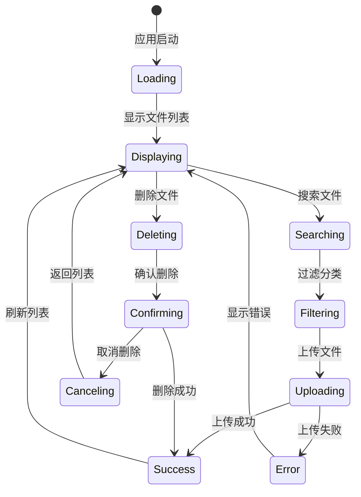

**图表来源**

- [apps/mobile/src/screens/ResourceScreen.tsx:172-469](file://apps/mobile/src/screens/ResourceScreen.tsx#L172-L469)

#### 技术特性

- **多平台支持**：支持 iOS 和 Android 平台的文件操作
- **分类显示**：智能识别文件类型并分类显示
- **搜索功能**：支持关键词搜索和实时过滤
- **上传管理**：支持多文件同时上传和进度显示
- **删除确认**：防止误删的重要文件

**章节来源**

- [apps/mobile/src/screens/ResourceScreen.tsx:1-469](file://apps/mobile/src/screens/ResourceScreen.tsx#L1-L469)

### 设置屏幕组件

**更新** 将原有的 Profile 标签页重命名为 Settings，提供完整的设置管理功能。

#### 功能分类

1. **工作区概览**：用户信息、默认模型、AI 提供商状态
2. **使用统计**：消息数、会话数、话题数统计
3. **快速设置**：服务器配置、AI 提供商、默认模型、语言设置
4. **更多设置**：高级设置、数据存储、语音设置、关于页面
5. **账户管理**：退出登录功能

#### 设置流程

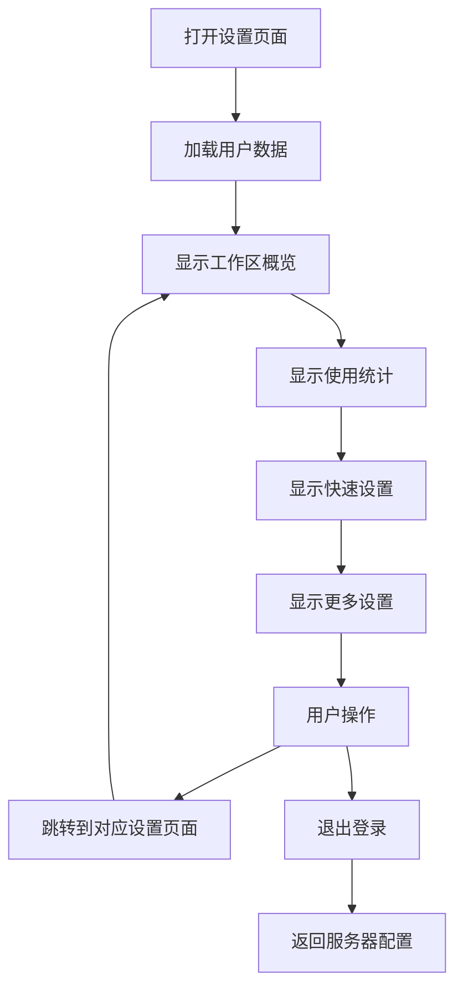

**图表来源**

- [apps/mobile/src/screens/ProfileScreen.tsx:38-346](file://apps/mobile/src/screens/ProfileScreen.tsx#L38-L346)

#### 特殊功能

- **实时统计**：显示准确的消息、会话、话题统计数据
- **快速导航**：提供常用设置的快速入口
- **账户安全**：提供安全的退出登录机制
- **版本信息**：显示应用版本信息

**章节来源**

- [apps/mobile/src/screens/ProfileScreen.tsx:1-346](file://apps/mobile/src/screens/ProfileScreen.tsx#L1-L346)

### 技能设置屏幕组件

**新增** 技能设置屏幕提供了完整的技能和 MCP 服务器管理功能，支持 Agent 技能、社区 MCP 和自定义 MCP 的管理。

#### 功能分类

1. **Agent 技能管理**：内置、市场和用户技能的安装、卸载和管理
2. **社区 MCP 管理**：第三方 MCP 服务器的安装和管理
3. **自定义 MCP 管理**：用户自定义 MCP 服务器的添加、测试和管理
4. **技能导入功能**：支持从 URL、GitHub 和 JSON 导入技能

#### 技能管理流程

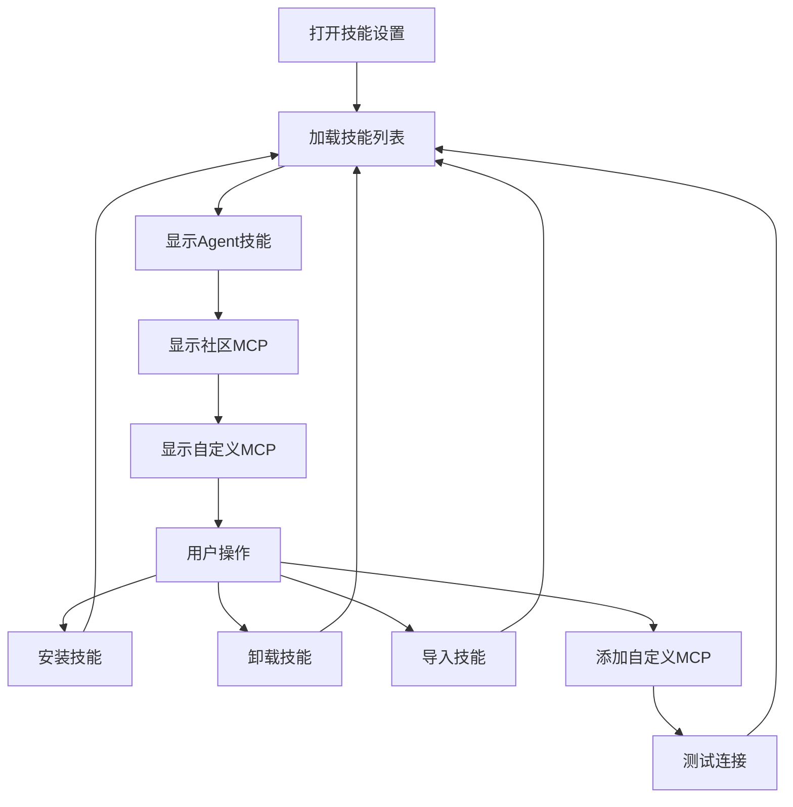

**图表来源**

- [apps/mobile/src/screens/SkillSettingsScreen.tsx:1-1277](file://apps/mobile/src/screens/SkillSettingsScreen.tsx#L1-L1277)

#### 技术特性

- **多源技能管理**：支持内置、市场和用户技能的统一管理
- **MCP 服务器管理**：完整的 MCP 服务器生命周期管理
- **技能导入功能**：支持多种导入方式和格式验证
- **连接测试**：提供 MCP 服务器连接测试功能
- **权限管理**：支持不同类型的认证方式

**章节来源**

- [apps/mobile/src/screens/SkillSettingsScreen.tsx:1-1277](file://apps/mobile/src/screens/SkillSettingsScreen.tsx#L1-L1277)

### 更多设置屏幕组件

**新增** 更多设置屏幕提供了完整的高级设置管理功能。

#### 设置分类

1. **AI 配置**：默认代理设置
2. **数据存储**：云同步备份、存储管理
3. **语音设置**：语音识别、文本转语音
4. **关于信息**：隐私政策、应用信息

#### 设置管理流程

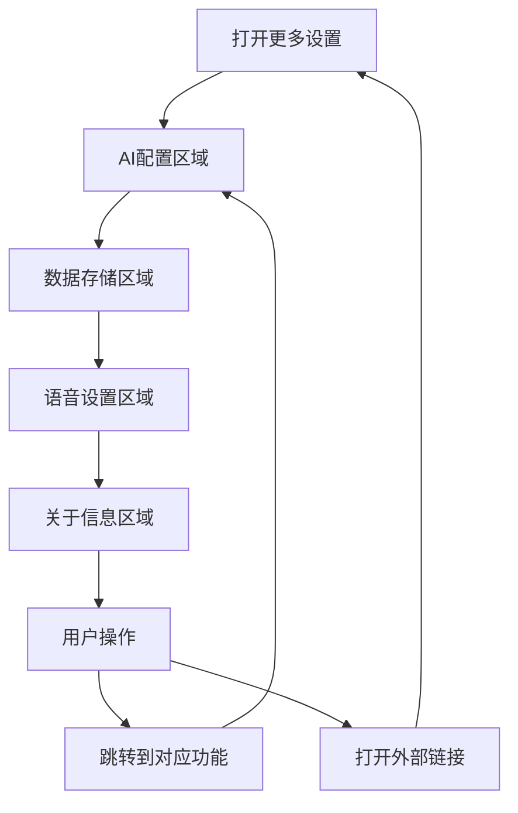

**图表来源**

- [apps/mobile/src/screens/SettingsScreen.tsx:84-156](file://apps/mobile/src/screens/SettingsScreen.tsx#L84-L156)

#### 技术特性

- **模块化设计**：按功能区域组织设置项
- **动画效果**：提供流畅的页面切换动画
- **外部链接**：支持打开外部网页链接
- **状态管理**：提供占位符和未来功能预留

**章节来源**

- [apps/mobile/src/screens/SettingsScreen.tsx:1-156](file://apps/mobile/src/screens/SettingsScreen.tsx#L1-L156)

### 服务器配置屏幕组件

服务器配置屏幕提供了完整的后端服务器连接配置功能。该组件实现了安全的 URL 验证和连接测试机制。

#### 配置流程

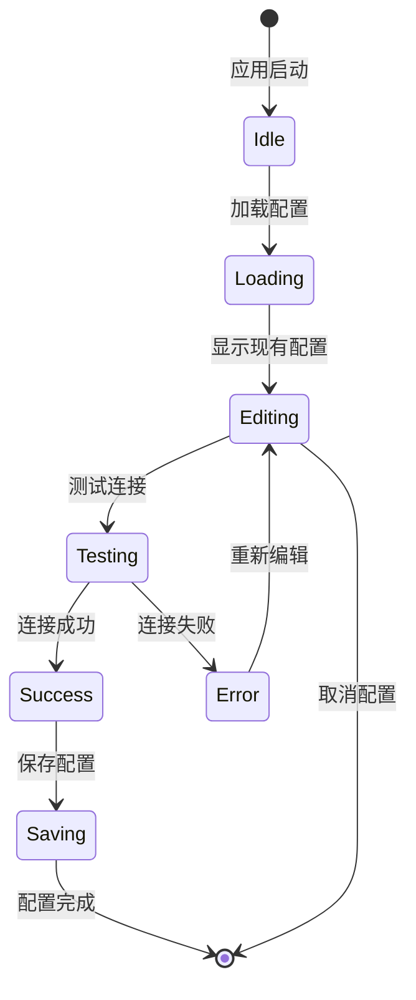

**图表来源**

- [apps/mobile/src/screens/ServerConfigScreen.tsx:32-97](file://apps/mobile/src/screens/ServerConfigScreen.tsx#L32-L97)

#### 安全验证机制

- **URL 格式验证**：自动添加协议前缀和去除尾部斜杠
- **连接测试**：通过健康检查端点验证服务器可达性
- **错误处理**：详细的错误信息反馈和用户指导
- **配置持久化**：使用 AsyncStorage 安全存储配置信息

**章节来源**

- [apps/mobile/src/screens/ServerConfigScreen.tsx:1-275](file://apps/mobile/src/screens/ServerConfigScreen.tsx#L1-L275)
- [apps/mobile/src/lib/api.ts:78-89](file://apps/mobile/src/lib/api.ts#L78-L89)

### 引导流程屏幕组件

引导流程为新用户提供完整的应用介绍和初始配置过程。该流程包含三个关键步骤：

1. **欢迎页面**：品牌介绍和功能概述
2. **服务器配置**：后端连接设置
3. **完成页面**：配置确认和开始使用

#### 引导流程序列

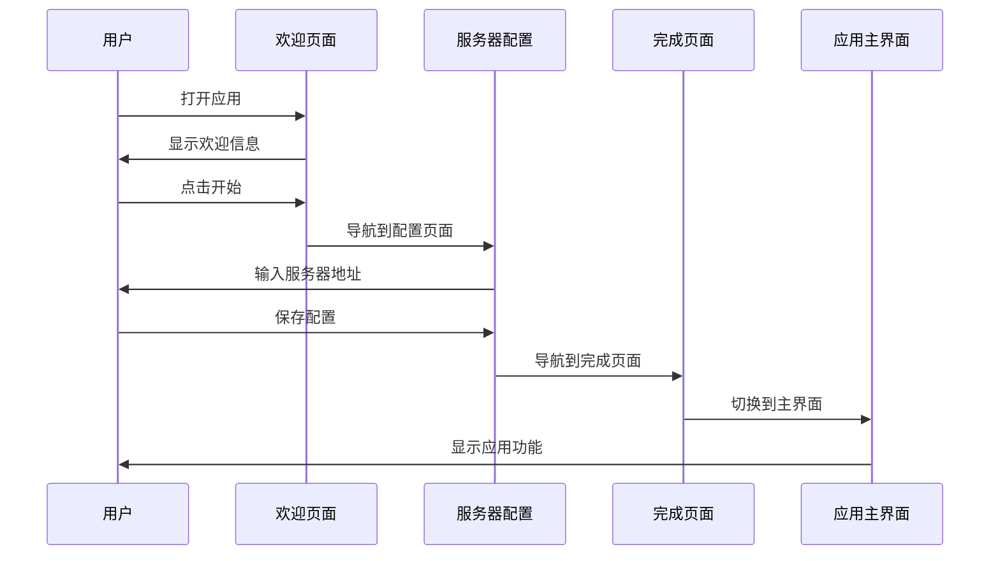

**图表来源**

- [apps/mobile/src/screens/onboarding/WelcomeScreen.tsx:11-44](file://apps/mobile/src/screens/onboarding/WelcomeScreen.tsx#L11-L44)

**章节来源**

- [apps/mobile/src/screens/onboarding/WelcomeScreen.tsx:1-45](file://apps/mobile/src/screens/onboarding/WelcomeScreen.tsx#L1-L45)

### 发现屏幕组件

**移除** Discover 标签页已被 Artwork、Resources 和 Skills 标签页替代，原有的发现功能整合到新的导航结构中。

#### 发现功能迁移

发现屏幕原本提供 Agent、Model 和 Provider 的发现功能，现已整合到以下新的导航结构中：

- Agent 发现 → 通过技能市场和 Agent 详情页面
- Model 发现 → 通过 AI 提供商和模型列表页面
- Provider 发现 → 通过 AI 提供商详情页面

**章节来源**

- [apps/mobile/src/screens/DiscoverScreen.tsx:1-217](file://apps/mobile/src/screens/DiscoverScreen.tsx#L1-L217)

### 状态管理系统

移动端导航系统采用 Zustand 作为状态管理解决方案，提供了轻量级但功能强大的状态管理能力。

#### 会话状态管理

会话状态管理负责维护用户的所有聊天会话数据，包括创建、删除、重命名和分组等功能。

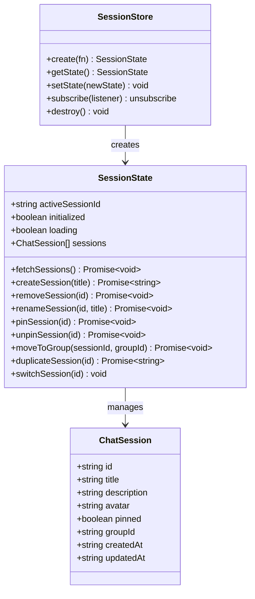

**图表来源**

- [apps/mobile/src/store/session.ts:18-35](file://apps/mobile/src/store/session.ts#L18-L35)

#### 连接状态管理

连接状态管理负责监控服务器连接状态，提供实时的网络可用性信息。

**章节来源**

- [apps/mobile/src/store/session.ts:1-185](file://apps/mobile/src/store/session.ts#L1-L185)
- [apps/mobile/src/store/connection.ts:1-39](file://apps/mobile/src/store/connection.ts#L1-L39)

## 依赖关系分析

移动端导航系统的主要依赖关系如下：

```mermaid
graph LR
subgraph "核心依赖"
ReactNavigation[React Navigation<br/>@react-navigation/native]
BottomTabs[@react-navigation/bottom-tabs]
NativeStack[@react-navigation/native-stack]
GestureHandler[react-native-gesture-handler]
SafeArea[react-native-safe-area-context]
end
subgraph "UI框架"
ReactNative[React Native<br/>react-native]
Expo[Expo SDK<br/>expo]
Tailwind[Tailwind CSS<br/>nativewind]
end
subgraph "状态管理"
Zustand[Zustand<br/>zustand]
AsyncStorage[@react-native-async-storage]
end
subgraph "网络通信"
Fetch[Fetch API<br/>原生HTTP]
SuperJSON[SuperJSON<br/>数据序列化]
NetInfo[@react-native-community/netinfo]
end
ReactNavigation --> BottomTabs
ReactNavigation --> NativeStack
ReactNavigation --> GestureHandler
ReactNavigation --> SafeArea
BottomTabs --> ReactNative
NativeStack --> ReactNative
GestureHandler --> ReactNative
SafeArea --> ReactNative
Zustand --> AsyncStorage
Zustand --> ReactNative
NetInfo --> ReactNative
Expo --> ReactNative
Tailwind --> ReactNative
```

**图表来源**

- [apps/mobile/package.json:12-42](file://apps/mobile/package.json#L12-L42)

**章节来源**

- [apps/mobile/package.json:1-50](file://apps/mobile/package.json#L1-L50)

## 性能考虑

移动端导航系统在性能方面采用了多项优化策略：

### 渲染性能优化

1. **虚拟化列表**：使用 React Native 的虚拟化列表组件优化大量数据的渲染
2. **状态选择器**：使用 useShallow 避免不必要的组件重渲染
3. **懒加载策略**：按需加载图片和资源文件
4. **动画优化**：使用原生驱动的动画提高流畅度

### 内存管理

1. **状态清理**：及时清理不再使用的状态和事件监听器
2. **缓存策略**：合理使用缓存减少重复的数据请求
3. **内存泄漏防护**：确保所有订阅都能正确清理

### 网络性能

1. **连接池管理**：复用 HTTP 连接减少网络开销
2. **数据压缩**：使用 SuperJSON 进行高效的数据序列化
3. **离线支持**：提供基本的离线功能和数据同步

## 故障排除指南

### 常见问题及解决方案

#### 导航问题

**问题**：页面无法正确导航或出现导航异常

- 检查导航器配置是否正确
- 验证屏幕组件的导入路径
- 确认路由名称与组件名称匹配

**问题**：底部标签不显示或图标不正确

- 检查图标库的正确导入
- 验证主题配置中的颜色设置
- 确认平台特定的样式设置

#### 新增功能问题

**问题**：Artwork 标签无法访问或功能异常

- 检查 ArtworkScreen 组件的导入和注册
- 验证 AI 模型配置和网络连接
- 确认图像生成 API 的可用性

**问题**：Resources 标签显示空白或加载失败

- 检查 ResourceScreen 组件的导入和注册
- 验证文件 API 接口和网络连接
- 确认用户权限和认证状态

**问题**：Skills 标签显示空白或加载失败

- 检查 SkillSettingsScreen 组件的导入和注册
- 验证技能 API 接口和网络连接
- 确认 MCP 服务器配置和认证状态

**问题**：Settings 标签显示空白或加载失败

- 检查 SettingsScreen 组件的导入和注册
- 验证设置数据的 API 接口
- 确认设置存储的读写权限

#### 状态管理问题

**问题**：状态更新后界面不刷新

- 检查状态更新函数的调用方式
- 验证状态选择器的使用
- 确认组件的订阅机制

**问题**：数据同步失败或数据丢失

- 检查 API 调用的错误处理
- 验证本地存储的读写权限
- 确认网络连接状态

#### 性能问题

**问题**：应用启动缓慢或界面卡顿

- 检查是否有过多的重渲染
- 验证数据加载的优化策略
- 确认动画和过渡效果的使用

**章节来源**

- [apps/mobile/src/navigation/index.tsx:43-110](file://apps/mobile/src/navigation/index.tsx#L43-L110)
- [apps/mobile/src/store/session.ts:43-60](file://apps/mobile/src/store/session.ts#L43-L60)

## 结论

移动端导航系统展现了现代移动应用开发的最佳实践，通过合理的架构设计和组件分离，实现了高度可维护和可扩展的导航解决方案。

### 主要优势

1. **架构清晰**：分层设计使得代码结构清晰，职责明确
2. **性能优秀**：采用多种优化策略确保流畅的用户体验
3. **易于维护**：模块化设计便于功能扩展和 bug 修复
4. **用户体验佳**：丰富的交互效果和流畅的导航体验

### 技术亮点

- 基于 React Navigation 的现代化导航架构
- 完整的状态管理和数据同步机制
- 实时网络状态监控和错误处理
- 本地存储集成和数据持久化
- 响应式设计和跨平台兼容性

### 新功能价值

**Artwork 标签**：为用户提供 AI 图像生成功能，支持多种模型和参数配置
**Resources 标签**：提供完整的文件资源管理功能，支持多类型文件的上传、下载和管理
**Skills 标签**：统一管理 Agent 技能和 MCP 服务器，提供完整的技能生态系统
**Settings 标签**：统一管理应用设置，提供更合理的导航流程和用户体验

该导航系统为 LobeHub 移动应用提供了坚实的技术基础，能够支持复杂的功能需求和良好的用户体验。
