# 移动端 UI 组件更新文档

<cite>
**本文档中引用的文件**
- [App.tsx](file://apps/mobile/App.tsx)
- [package.json](file://apps/mobile/package.json)
- [MessageBubble.tsx](file://apps/mobile/src/components/ui/MessageBubble.tsx)
- [ComposerShell.tsx](file://apps/mobile/src/components/ui/ComposerShell.tsx)
- [Toast.tsx](file://apps/mobile/src/components/ui/Toast.tsx)
- [ChatDetailScreen.tsx](file://apps/mobile/src/screens/ChatDetailScreen.tsx)
- [index.tsx](file://apps/mobile/src/navigation/index.tsx)
- [ScreenHeader.tsx](file://apps/mobile/src/components/ui/ScreenHeader.tsx)
- [SettingsLayout.tsx](file://apps/mobile/src/components/ui/SettingsLayout.tsx)
- [theme/index.ts](file://apps/mobile/src/theme/index.ts)
</cite>

## 目录
1. [项目概述](#项目概述)
2. [架构概览](#架构概览)
3. [核心组件分析](#核心组件分析)
4. [UI 组件详细分析](#ui-组件详细分析)
5. [导航系统](#导航系统)
6. [主题系统](#主题系统)
7. [性能优化](#性能优化)
8. [故障排除指南](#故障排除指南)
9. [总结](#总结)

## 项目概述

LobeHub 移动端应用是一个基于 React Native 和 Expo 的现代化聊天应用，专注于提供流畅的移动端用户体验。该应用采用了最新的移动开发技术栈，包括 React Native 0.83、Expo 55、TailwindCSS 和 Zustand 状态管理。

### 主要特性
- **响应式设计**：针对不同屏幕尺寸优化的 UI 布局
- **高性能渲染**：使用 FlashList 实现大数据集的高效滚动
- **现代化动画**：集成 Reanimated 提供流畅的动画效果
- **深色模式支持**：完整的深色/浅色主题切换
- **离线支持**：网络状态检测和离线提示功能
- **通知系统**：自定义 Toast 通知组件

## 架构概览

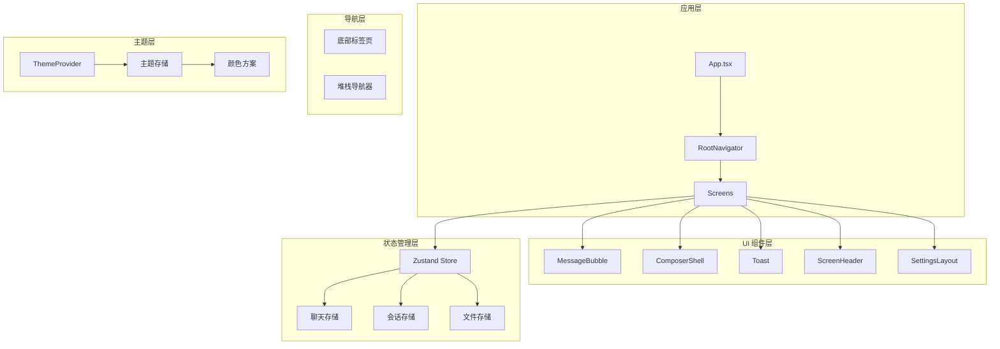

**图表来源**
- [App.tsx:85-235](file://apps/mobile/App.tsx#L85-L235)
- [index.tsx:280-380](file://apps/mobile/src/navigation/index.tsx#L280-L380)
- [theme/index.ts:11-38](file://apps/mobile/src/theme/index.ts#L11-L38)

## 核心组件分析

### 应用入口点

应用的主入口点位于 `App.tsx`，负责初始化应用状态、处理启动流程和错误边界管理。

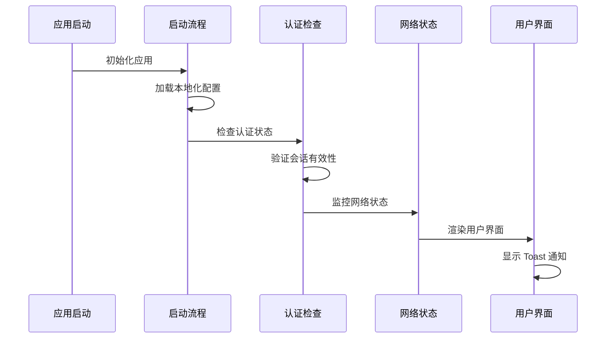

**图表来源**
- [App.tsx:131-206](file://apps/mobile/App.tsx#L131-L206)
- [App.tsx:208-212](file://apps/mobile/App.tsx#L208-L212)

### 状态管理系统

应用采用 Zustand 作为状态管理解决方案，提供了轻量级但功能强大的状态管理能力。

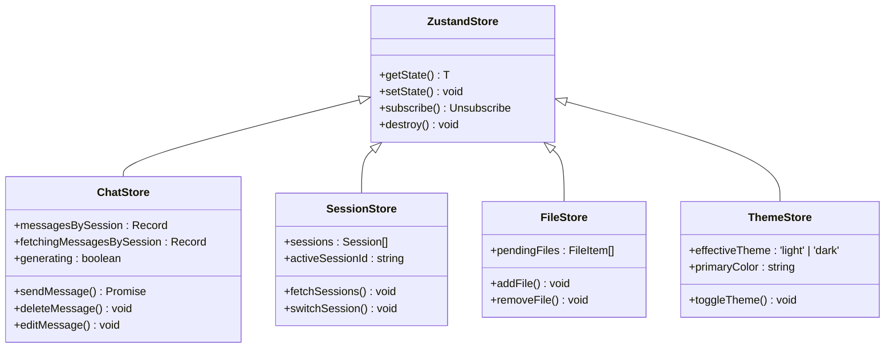

**图表来源**
- [ChatDetailScreen.tsx:90-98](file://apps/mobile/src/screens/ChatDetailScreen.tsx#L90-L98)
- [ChatDetailScreen.tsx:126-133](file://apps/mobile/src/screens/ChatDetailScreen.tsx#L126-L133)

**章节来源**
- [App.tsx:85-235](file://apps/mobile/App.tsx#L85-L235)
- [package.json:12-52](file://apps/mobile/package.json#L12-L52)

## UI 组件详细分析

### 消息气泡组件

消息气泡组件是聊天界面的核心组件，支持多种内容类型和交互功能。

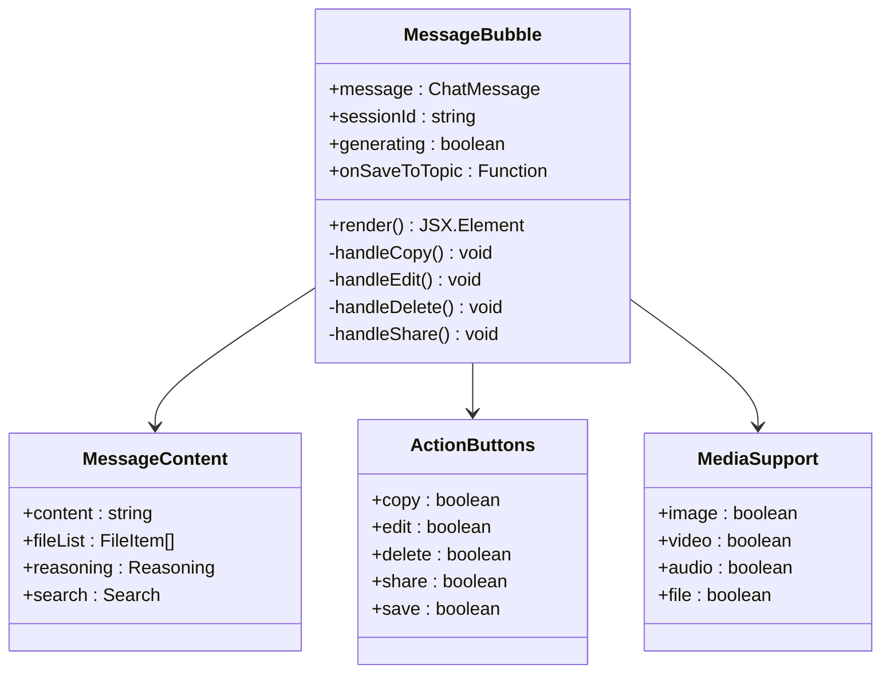

**图表来源**
- [MessageBubble.tsx:640-800](file://apps/mobile/src/components/ui/MessageBubble.tsx#L640-L800)

#### 支持的内容类型

组件支持以下内容类型的渲染：

| 内容类型 | 描述 | 特性 |
|---------|------|------|
| 文本消息 | 标准聊天文本 | Markdown 渲染、链接识别、代码高亮 |
| 图片 | 图像文件 | 预览、下载、全屏查看 |
| 文件 | 附件文件 | 下载进度显示、文件类型图标 |
| 代码块 | 代码片段 | 语法高亮、复制功能 |
| 数学公式 | LaTeX 公式 | KaTeX 渲染、动态高度调整 |
| Mermaid 图 | 流程图 | 动态渲染、高度自适应 |

**章节来源**
- [MessageBubble.tsx:1-800](file://apps/mobile/src/components/ui/MessageBubble.tsx#L1-L800)

### 组合器外壳组件

组合器外壳组件为输入区域提供统一的视觉样式和交互行为。

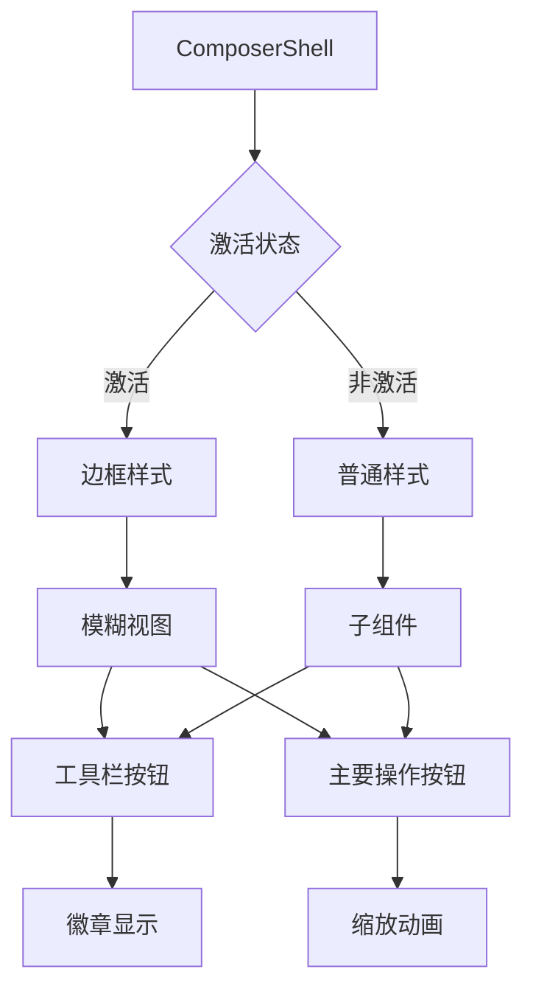

**图表来源**
- [ComposerShell.tsx:31-52](file://apps/mobile/src/components/ui/ComposerShell.tsx#L31-L52)

**章节来源**
- [ComposerShell.tsx:1-124](file://apps/mobile/src/components/ui/ComposerShell.tsx#L1-L124)

### Toast 通知系统

Toast 组件提供了轻量级的通知机制，支持多种通知类型和动画效果。

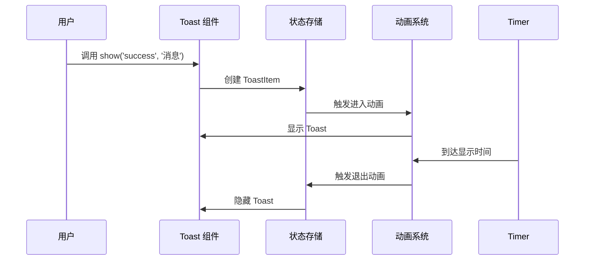

**图表来源**
- [Toast.tsx:45-68](file://apps/mobile/src/components/ui/Toast.tsx#L45-L68)

#### 通知类型

| 类型 | 颜色 | 图标 | 持续时间 |
|------|------|------|----------|
| success | 成功色 | ✓ | 2.2秒 |
| error | 错误色 | ⚠️ | 动态（最长8秒） |
| info | 信息色 | ℹ️ | 默认 |

**章节来源**
- [Toast.tsx:1-203](file://apps/mobile/src/components/ui/Toast.tsx#L1-L203)

### 屏幕头部组件

ScreenHeader 组件提供了统一的页面头部样式，支持多种布局模式。

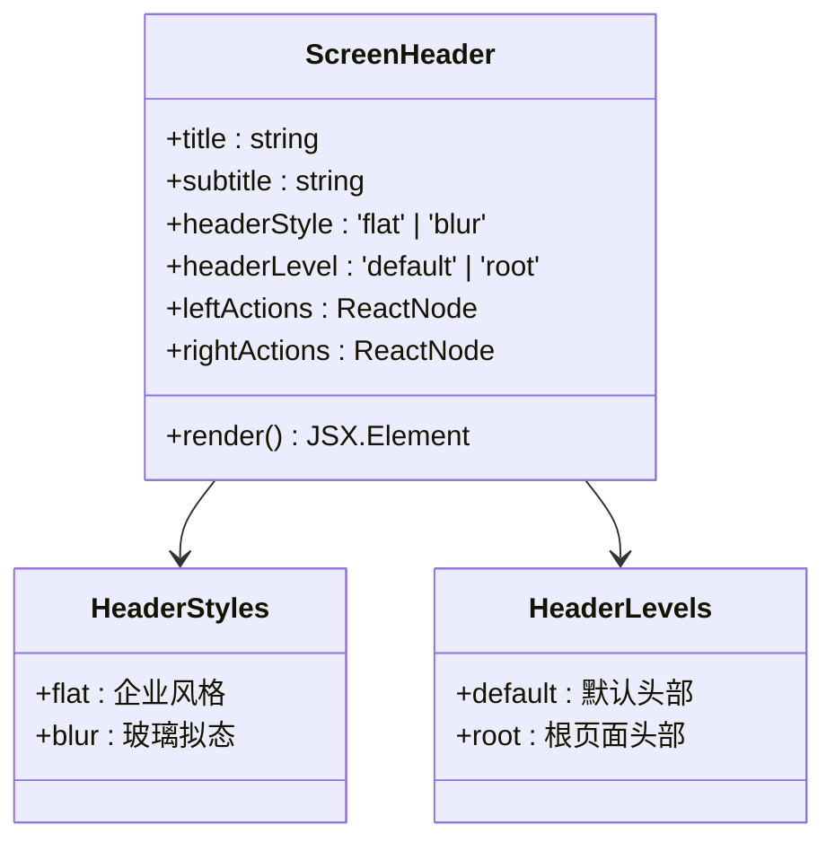

**图表来源**
- [ScreenHeader.tsx:33-49](file://apps/mobile/src/components/ui/ScreenHeader.tsx#L33-L49)

**章节来源**
- [ScreenHeader.tsx:1-239](file://apps/mobile/src/components/ui/ScreenHeader.tsx#L1-L239)

### 设置布局组件

SettingsLayout 组件为设置页面提供统一的列表布局和交互模式。

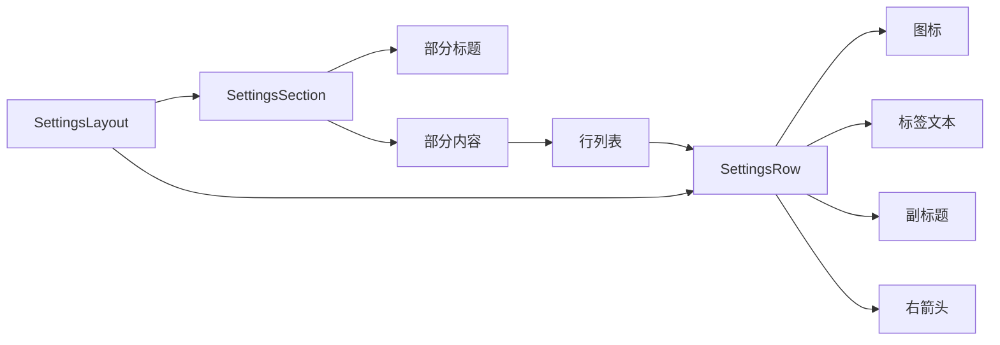

**图表来源**
- [SettingsLayout.tsx:84-99](file://apps/mobile/src/components/ui/SettingsLayout.tsx#L84-L99)

**章节来源**
- [SettingsLayout.tsx:1-100](file://apps/mobile/src/components/ui/SettingsLayout.tsx#L1-L100)

## 导航系统

### 底部标签页导航

应用使用底部标签页提供主要的功能导航，每个标签都有独特的动画效果。

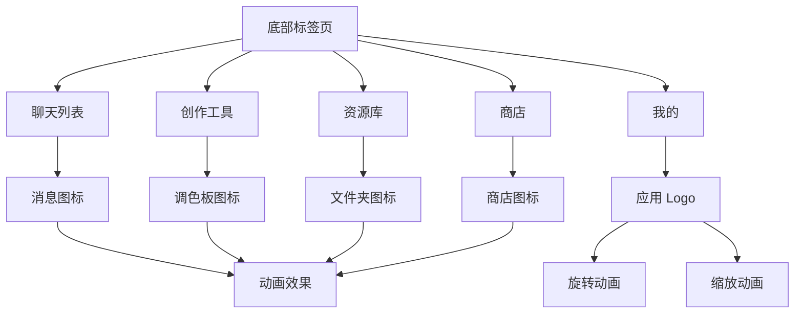

**图表来源**
- [index.tsx:169-274](file://apps/mobile/src/navigation/index.tsx#L169-L274)

### 堆栈导航器

堆栈导航器管理页面间的导航和转场动画。

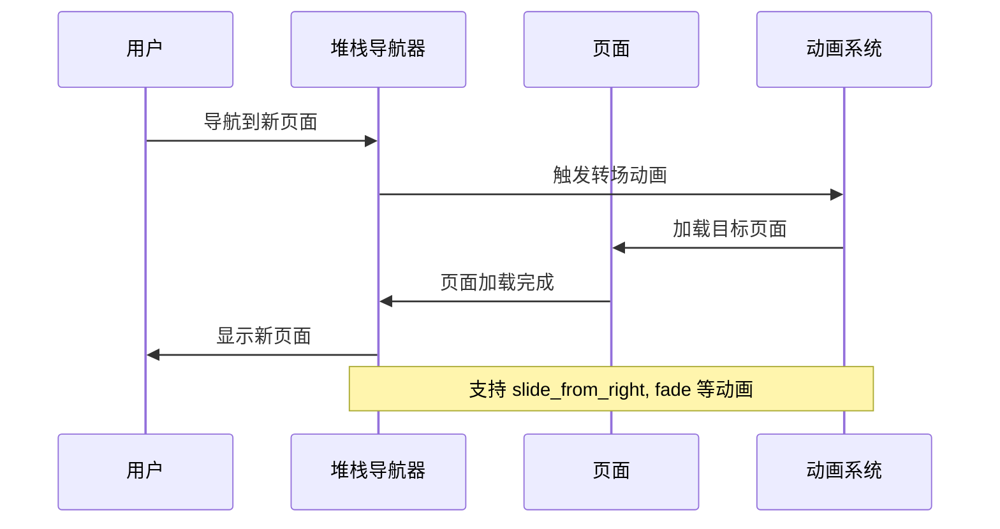

**图表来源**
- [index.tsx:280-380](file://apps/mobile/src/navigation/index.tsx#L280-L380)

**章节来源**
- [index.tsx:1-380](file://apps/mobile/src/navigation/index.tsx#L1-L380)

## 主题系统

### 颜色方案

应用支持深色和浅色两种主题模式，每种模式都有完整的颜色令牌系统。

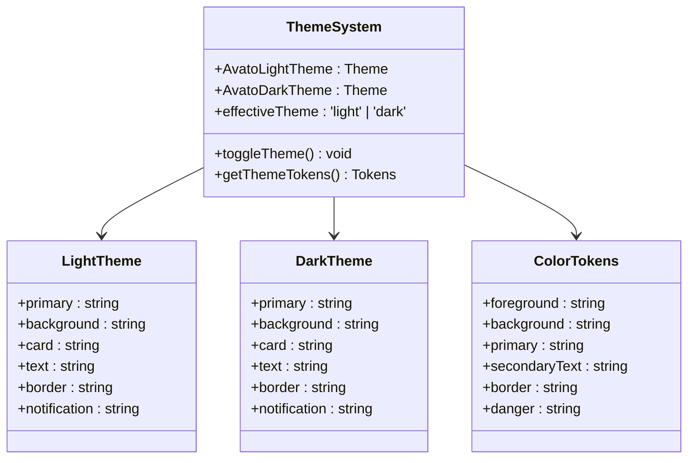

**图表来源**
- [theme/index.ts:11-38](file://apps/mobile/src/theme/index.ts#L11-L38)

### 主题存储

主题状态通过 Zustand 进行管理，支持实时的主题切换和持久化。

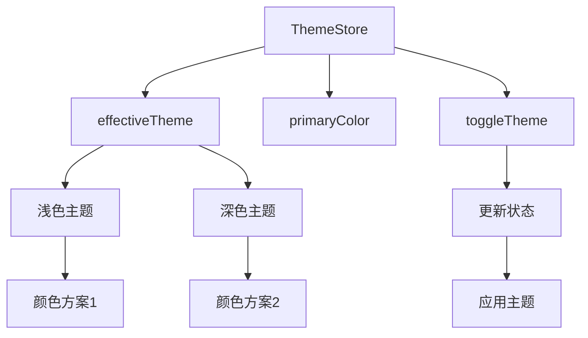

**图表来源**
- [theme/index.ts:1-38](file://apps/mobile/src/theme/index.ts#L1-L38)

**章节来源**
- [theme/index.ts:1-38](file://apps/mobile/src/theme/index.ts#L1-L38)

## 性能优化

### 大数据集优化

应用使用 FlashList 替代传统的 FlatList，提供更好的滚动性能。

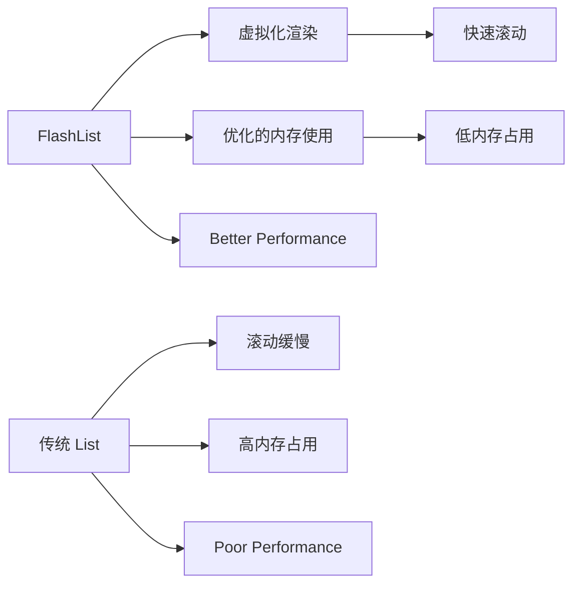

### 动画优化

应用广泛使用 Reanimated 进行动画优化，确保 60fps 的流畅体验。

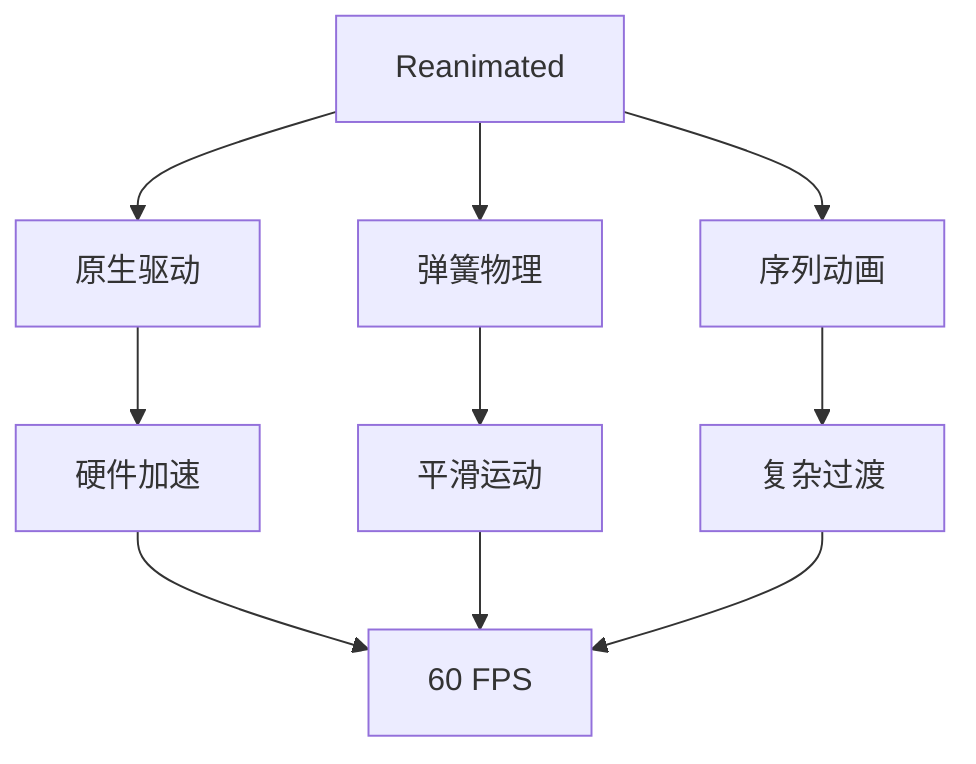

## 故障排除指南

### 常见问题及解决方案

| 问题类型 | 症状 | 解决方案 |
|---------|------|----------|
| 启动失败 | 应用无法启动 | 检查网络连接和服务器配置 |
| 消息不显示 | 聊天消息缺失 | 验证会话状态和消息存储 |
| 主题切换无效 | 主题更改未生效 | 清除应用缓存并重启 |
| 动画卡顿 | 页面动画不流畅 | 检查设备性能和内存使用 |

### 错误处理机制

应用实现了多层次的错误处理机制：

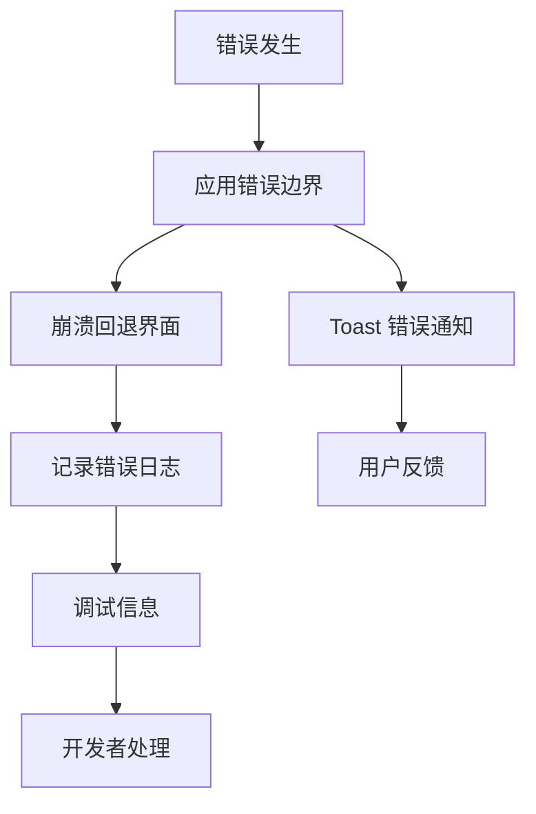

**图表来源**
- [App.tsx:58-83](file://apps/mobile/App.tsx#L58-L83)

**章节来源**
- [App.tsx:58-83](file://apps/mobile/App.tsx#L58-L83)

## 总结

LobeHub 移动端应用展现了现代移动应用开发的最佳实践，具有以下特点：

### 技术优势
- **现代化技术栈**：React Native + Expo + TypeScript + TailwindCSS
- **高性能架构**：Zustand 状态管理 + Reanimated 动画 + FlashList 优化
- **完整功能**：聊天、文件管理、主题切换、离线支持等
- **优秀 UX**：流畅动画、响应式设计、无障碍支持

### 设计亮点
- **统一的组件体系**：可复用的 UI 组件和一致的设计语言
- **灵活的主题系统**：深色/浅色模式自动适配
- **智能的导航结构**：底部标签页 + 堆栈导航的组合
- **完善的错误处理**：多层次的错误边界和用户反馈

### 发展方向
- 继续优化性能表现，特别是在低端设备上的体验
- 扩展更多 AI 功能集成
- 增强离线功能和数据同步
- 完善国际化支持

这个移动端应用为用户提供了现代化、流畅且功能丰富的聊天体验，是 React Native 开发的优秀范例。