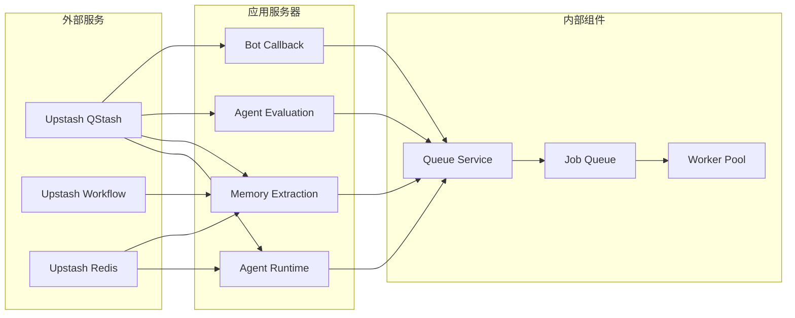
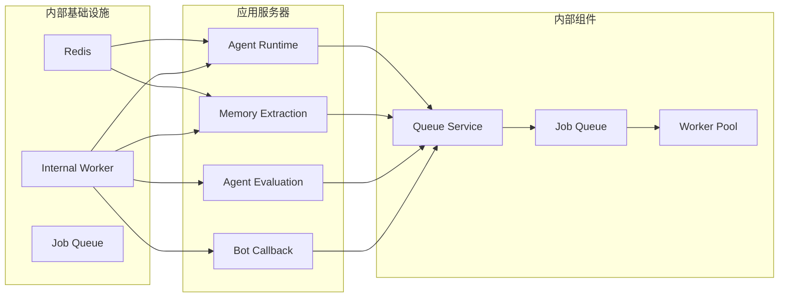
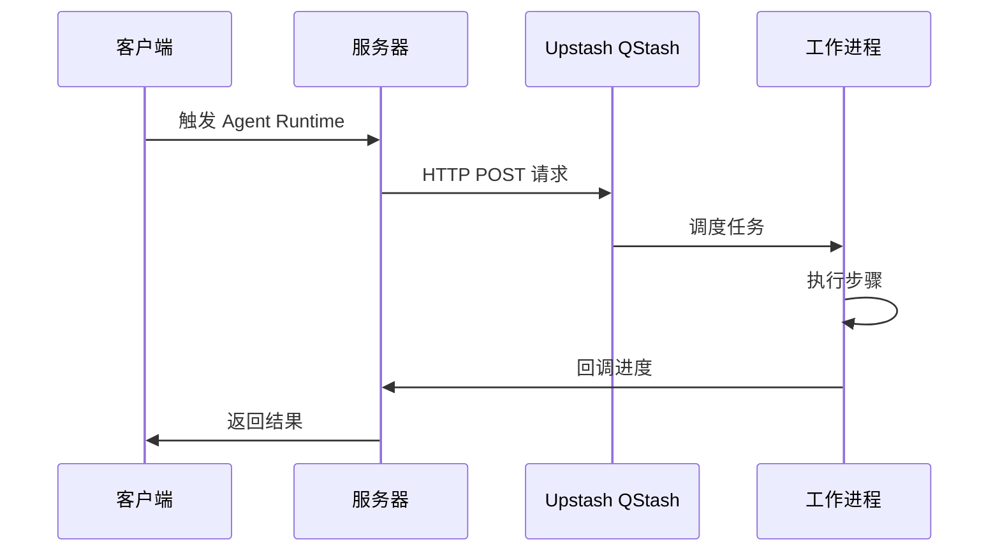
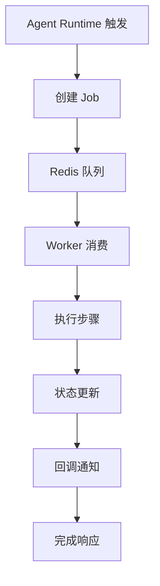
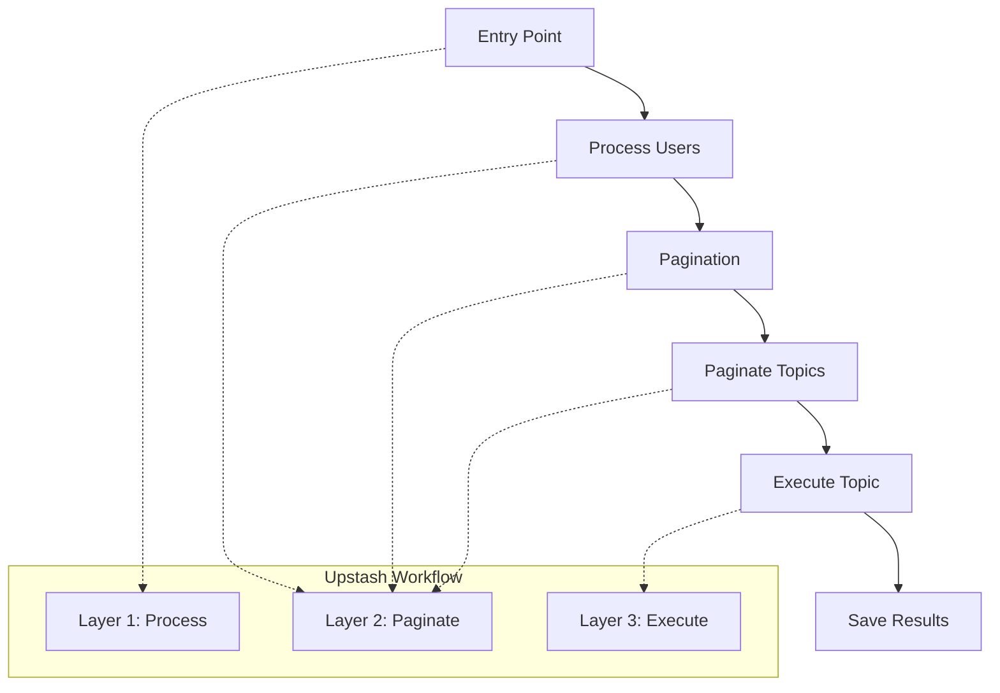
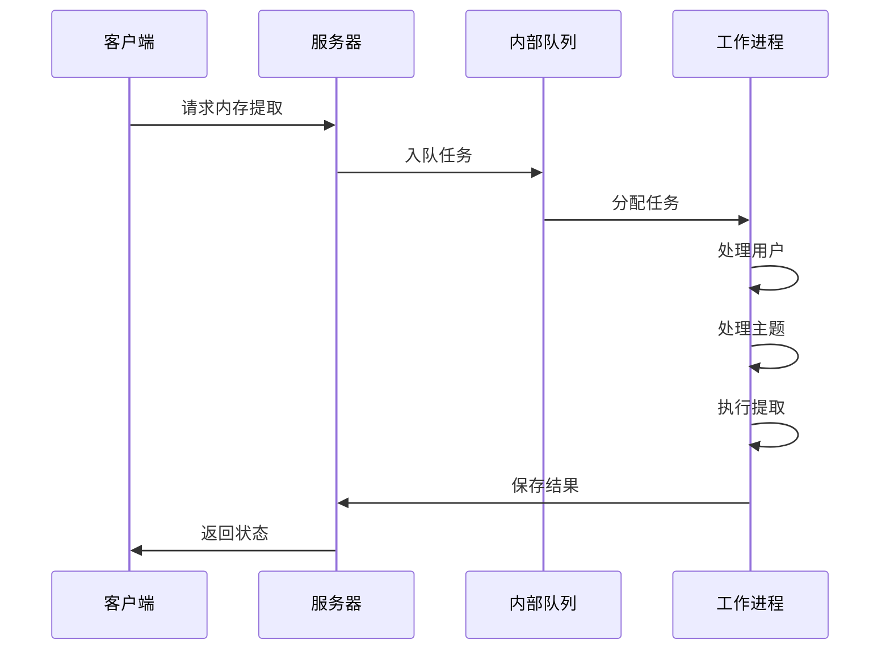
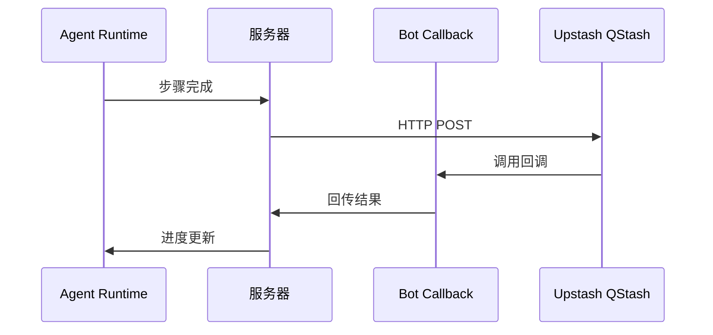
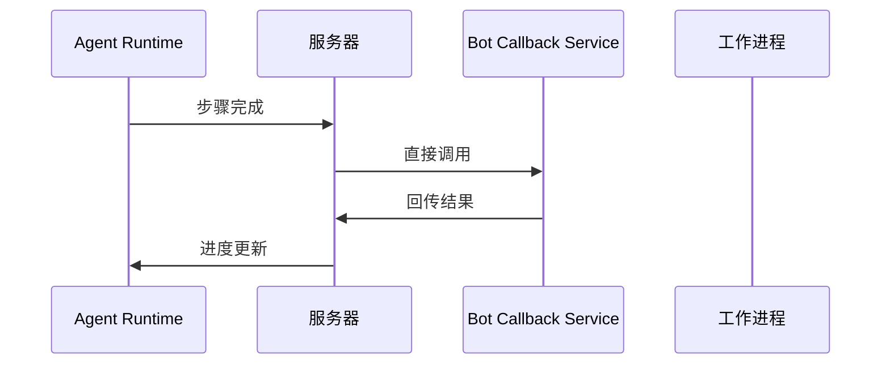
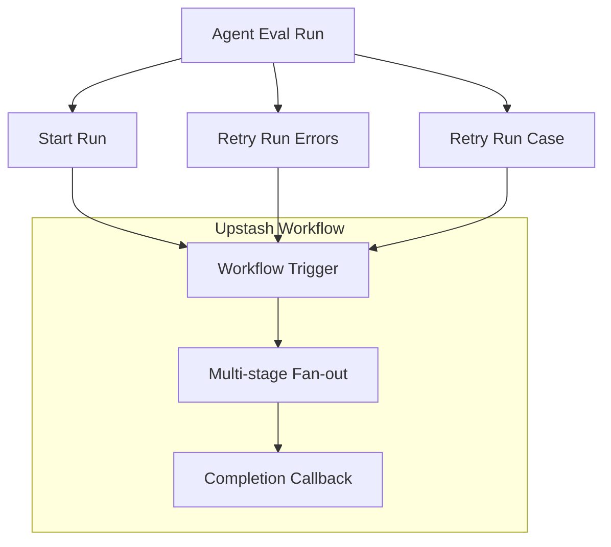

# 移除 Upstash 集成

<cite>
**本文档引用的文件**
- [remove-upstash-qstash-audit.zh-CN.md](file://docs/development/remove-upstash-qstash-audit.zh-CN.md)
- [SKILL.md](file://.agents/skills/upstash-workflow/SKILL.md)
- [upstash.zh-CN.mdx](file://docs/self-hosting/advanced/redis/upstash.zh-CN.mdx)
- [package.json](file://package.json)
</cite>

## 目录
1. [简介](#简介)
2. [项目结构](#项目结构)
3. [核心组件](#核心组件)
4. [架构概览](#架构概览)
5. [详细组件分析](#详细组件分析)
6. [依赖分析](#依赖分析)
7. [性能考虑](#性能考虑)
8. [故障排除指南](#故障排除指南)
9. [结论](#结论)

## 简介

本文档详细分析了 LobeHub 项目中 Upstash 集成的现状、移除策略以及替代方案。Upstash 是一个提供 Serverless Redis 和工作流编排服务的云平台，但在当前项目中，Upstash 的使用主要集中在以下几个方面：

1. **Upstash QStash** - 用于 HTTP 调度和签名验证
2. **Upstash Workflow** - 用于工作流编排（依赖 QStash 调度）
3. **Upstash Redis** - 可选用于会话存储和限流

根据项目文档分析，当前项目计划完全移除 Upstash 依赖，但需要先建立站内异步基础设施来替代其功能。

## 项目结构

基于分析，Upstash 相关的代码和配置分布在以下位置：

```mermaid
graph TB
subgraph "Upstash 相关文件"
A[docs/development/remove-upstash-qstash-audit.zh-CN.md]
B[.agents/skills/upstash-workflow/SKILL.md]
C[docs/self-hosting/advanced/redis/upstash.zh-CN.mdx]
D[package.json]
end
subgraph "代码实现"
E[src/libs/qstash/]
F[src/server/services/queue/impls/qstash.ts]
G[src/server/workflows/]
H[src/app/(backend)/api/workflows/]
end
A --> E
B --> G
B --> H
C --> E
D --> E
```

**图表来源**
- [remove-upstash-qstash-audit.zh-CN.md:71-74](file://docs/development/remove-upstash-qstash-audit.zh-CN.md#L71-L74)
- [SKILL.md:214](file://.agents/skills/upstash-workflow/SKILL.md#L214)

**章节来源**
- [remove-upstash-qstash-audit.zh-CN.md:67-90](file://docs/development/remove-upstash-qstash-audit.zh-CN.md#L67-L90)
- [SKILL.md:187-197](file://.agents/skills/upstash-workflow/SKILL.md#L187-L197)

## 核心组件

### Upstash QStash 依赖

项目中使用的 Upstash 相关依赖包括：

| 包 | 版本 | 用途 |
|---|---|---|
| `@upstash/qstash` | ^2.8.4 | HTTP 调度、签名验证 |
| `@upstash/workflow` | ^0.2.23 | 工作流编排（依赖 QStash 调度） |

### 环境变量配置

移除 Upstash 依赖需要清理以下环境变量：

```bash
QSTASH_TOKEN
QSTASH_URL  
QSTASH_CURRENT_SIGNING_KEY
QSTASH_NEXT_SIGNING_KEY
```

**章节来源**
- [remove-upstash-qstash-audit.zh-CN.md:71-74](file://docs/development/remove-upstash-qstash-audit.zh-CN.md#L71-L74)
- [remove-upstash-qstash-audit.zh-CN.md:739-746](file://docs/development/remove-upstash-qstash-audit.zh-CN.md#L739-L746)

## 架构概览

### 当前 Upstash 集成架构



**图表来源**
- [remove-upstash-qstash-audit.zh-CN.md:80-89](file://docs/development/remove-upstash-qstash-audit.zh-CN.md#L80-L89)

### 移除后的替代架构



**图表来源**
- [remove-upstash-qstash-audit.zh-CN.md:458-464](file://docs/development/remove-upstash-qstash-audit.zh-CN.md#L458-L464)

## 详细组件分析

### Agent Runtime 队列服务

#### 当前实现问题

Agent Runtime 的队列服务目前依赖 QStash：



**图表来源**
- [remove-upstash-qstash-audit.zh-CN.md:256-259](file://docs/development/remove-upstash-qstash-audit.zh-CN.md#L256-L259)

#### 替代方案

推荐使用基于 Redis 的内部队列实现：



**图表来源**
- [remove-upstash-qstash-audit.zh-CN.md:269-273](file://docs/development/remove-upstash-qstash-audit.zh-CN.md#L269-L273)

**章节来源**
- [remove-upstash-qstash-audit.zh-CN.md:254-274](file://docs/development/remove-upstash-qstash-audit.zh-CN.md#L254-L274)

### Memory 提取工作流

#### Upstash Workflow 实现

Memory 提取使用三层工作流架构：



**图表来源**
- [SKILL.md:35-53](file://.agents/skills/upstash-workflow/SKILL.md#L35-L53)

#### 替代实现

内存提取可以迁移到内部队列：



**图表来源**
- [remove-upstash-qstash-audit.zh-CN.md:279-304](file://docs/development/remove-upstash-qstash-audit.zh-CN.md#L279-L304)

**章节来源**
- [SKILL.md:318-557](file://.agents/skills/upstash-workflow/SKILL.md#L318-L557)
- [remove-upstash-qstash-audit.zh-CN.md:277-305](file://docs/development/remove-upstash-qstash-audit.zh-CN.md#L277-L305)

### Bot Callback 机制

#### 当前架构

Bot Callback 通过内部 HTTP 自回调实现：



**图表来源**
- [remove-upstash-qstash-audit.zh-CN.md:163-165](file://docs/development/remove-upstash-qstash-audit.zh-CN.md#L163-L165)

#### 替代方案

改为站内调用：



**图表来源**
- [remove-upstash-qstash-audit.zh-CN.md:171-173](file://docs/development/remove-upstash-qstash-audit.zh-CN.md#L171-L173)

**章节来源**
- [remove-upstash-qstash-audit.zh-CN.md:158-174](file://docs/development/remove-upstash-qstash-audit.zh-CN.md#L158-L174)

### Agent Eval 工作流

#### 强耦合关系

Agent Eval 与 Upstash Workflow 存在强耦合关系：



**图表来源**
- [remove-upstash-qstash-audit.zh-CN.md:185-186](file://docs/development/remove-upstash-qstash-audit.zh-CN.md#L185-L186)

#### 处理策略

根据项目决策，Agent Eval 要么完整迁移，要么从产品面移除：

**章节来源**
- [remove-upstash-qstash-audit.zh-CN.md:177-200](file://docs/development/remove-upstash-qstash-audit.zh-CN.md#L177-L200)

## 依赖分析

### 依赖关系图

```mermaid
graph TB
subgraph "项目依赖"
A[LobeHub 项目]
B[Redis]
C[BullMQ]
end
subgraph "Upstash 依赖"
D[@upstash/qstash]
E[@upstash/workflow]
end
subgraph "替代方案"
F[Redis Queue]
G[Worker Pool]
end
A --> D
A --> E
A --> B
D --> F
E --> G
B --> F
B --> G
```

**图表来源**
- [package.json:157-401](file://package.json#L157-L401)
- [remove-upstash-qstash-audit.zh-CN.md:426-432](file://docs/development/remove-upstash-qstash-audit.zh-CN.md#L426-L432)

### 环境变量清理

移除 Upstash 依赖需要清理的环境变量：

| 环境变量 | 用途 | 清理状态 |
|---|---|---|
| QSTASH_TOKEN | QStash 访问令牌 | ✅ 需要删除 |
| QSTASH_URL | QStash 服务地址 | ✅ 需要删除 |
| QSTASH_CURRENT_SIGNING_KEY | 当前签名密钥 | ✅ 需要删除 |
| QSTASH_NEXT_SIGNING_KEY | 下一个签名密钥 | ✅ 需要删除 |

**章节来源**
- [remove-upstash-qstash-audit.zh-CN.md:737-746](file://docs/development/remove-upstash-qstash-audit.zh-CN.md#L737-L746)

## 性能考虑

### 移除 Upstash 的性能影响

| 组件 | 当前性能 | 替代方案性能 | 性能对比 |
|---|---|---|---|
| Agent Runtime 队列 | 依赖外部服务延迟 | 本地队列延迟 | ✅ 显著降低延迟 |
| Memory 提取 | 工作流编排成本 | 内部队列执行 | ✅ 减少编排开销 |
| Bot Callback | HTTP 回调延迟 | 直接服务调用 | ✅ 减少网络往返 |
| Agent Eval | 工作流执行 | 内部队列执行 | ✅ 提升吞吐量 |

### Redis 集成优势

项目已具备 Redis 基础设施，可提供：

- **低延迟**：本地 Redis 访问
- **可靠性**：持久化存储
- **扩展性**：支持水平扩展
- **监控**：内置性能指标

**章节来源**
- [remove-upstash-qstash-audit.zh-CN.md:757-759](file://docs/development/remove-upstash-qstash-audit.zh-CN.md#L757-L759)

## 故障排除指南

### 常见问题及解决方案

#### 1. Agent Runtime 无法启动

**问题症状**：启动时报错缺少 QStash 环境变量

**解决方案**：
- 确保 Redis 服务正常运行
- 配置 `AGENT_RUNTIME_MODE=queue` 环境变量
- 验证内部 worker 正常启动

#### 2. Memory 提取任务失败

**问题症状**：Memory 提取任务无法创建或执行

**解决方案**：
- 检查 Redis 连接配置
- 验证内部 worker 任务队列
- 查看任务执行日志

#### 3. Bot Callback 无法回调

**问题症状**：Agent 执行完成后无法收到回调

**解决方案**：
- 确认 Bot Callback 服务正常
- 检查内部服务调用链
- 验证回调处理逻辑

### 验收标准

移除 Upstash 后的系统验收标准：

1. **Agent Runtime**：多步执行可完整跑通
2. **Memory Extraction**：任务可创建、轮询、完成
3. **Bot Callback**：进度和完成事件可正常回传
4. **系统稳定性**：无 QStash 环境下可稳定运行
5. **性能指标**：延迟和吞吐量达到预期

**章节来源**
- [remove-upstash-qstash-audit.zh-CN.md:647-657](file://docs/development/remove-upstash-qstash-audit.zh-CN.md#L647-L657)

## 结论

通过对 LobeHub 项目的深入分析，可以得出以下结论：

### 移除可行性

✅ **完全可行**：项目具备移除 Upstash 依赖的技术基础

### 替代方案评估

推荐使用基于 Redis 的内部异步基础设施，因为：

1. **技术成熟**：项目已有 Redis 基础设施
2. **性能优异**：本地访问，低延迟
3. **扩展性强**：支持水平扩展
4. **运维简单**：统一的内部管理

### 实施建议

1. **立即行动**：开始引入 Redis-backed internal worker
2. **分阶段迁移**：按照工作包顺序逐步迁移
3. **并行验证**：Web 和 App 端同步验证
4. **完整清理**：一次性删除所有 Upstash 相关代码

### 风险控制

- **整版切换**：不保留兼容路径
- **充分测试**：先 Web 后 App 的验证顺序
- **回滚准备**：准备整版回滚方案
- **监控完善**：建立完整的监控体系

移除 Upstash 集成将显著提升系统的自主性和可运维性，同时保持甚至提升系统的性能表现。