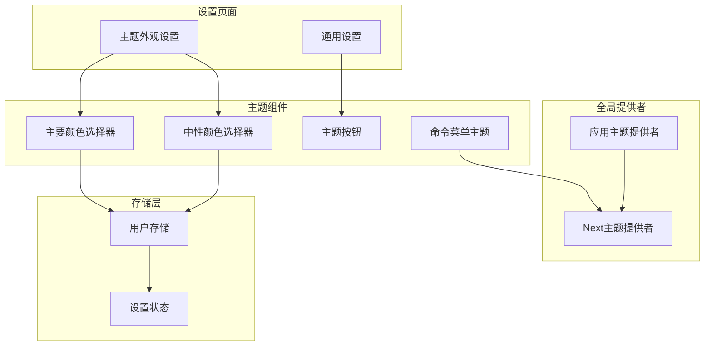
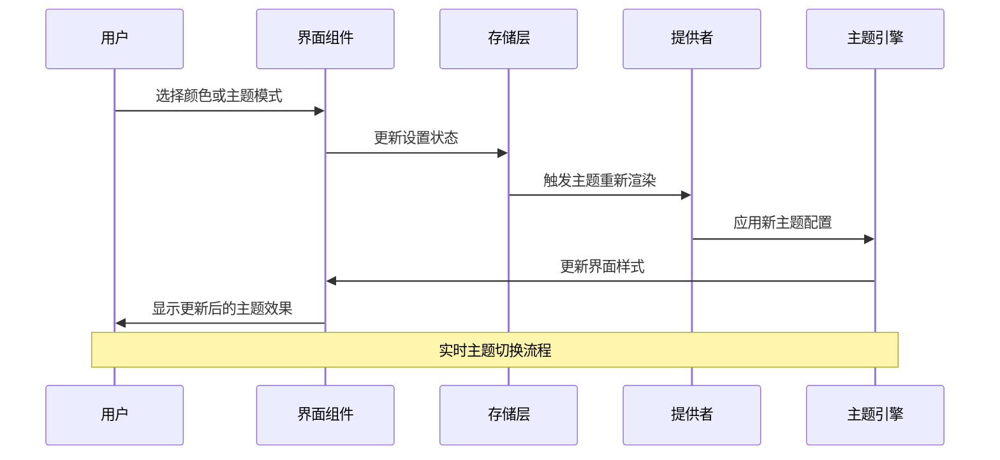
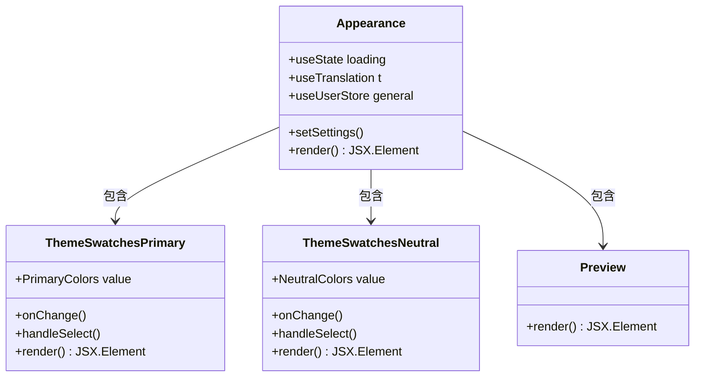
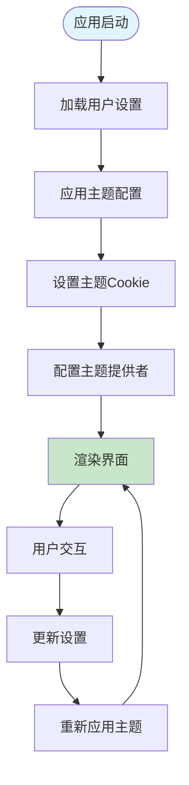
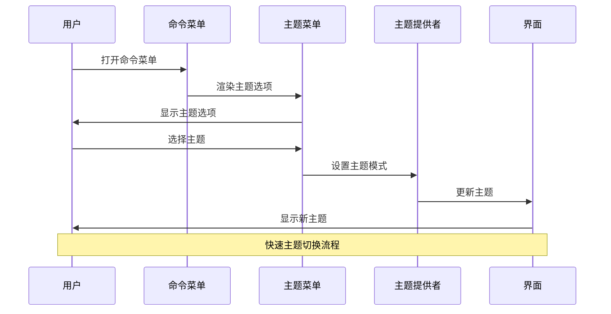
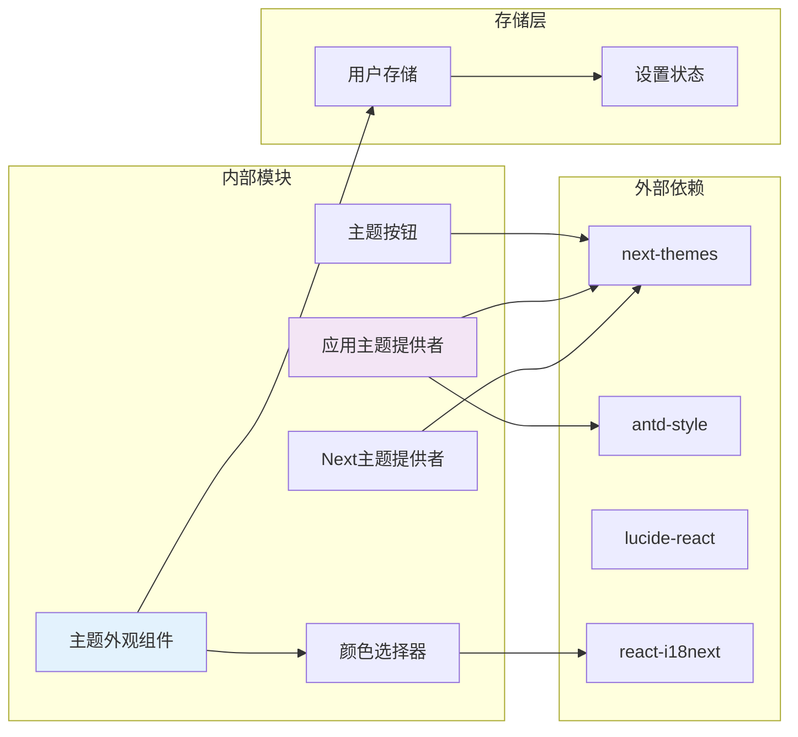

# 主题选择器界面

<cite>
**本文档引用的文件**
- [src/routes/(main)/settings/common/features/Appearance/index.tsx](file://src/routes/(main)/settings/common/features/Appearance/index.tsx)
- [src/routes/(main)/settings/common/features/Appearance/ThemeSwatches/ThemeSwatchesPrimary.tsx](file://src/routes/(main)/settings/common/features/Appearance/ThemeSwatches/ThemeSwatchesPrimary.tsx)
- [src/routes/(main)/settings/common/features/Appearance/ThemeSwatches/ThemeSwatchesNeutral.tsx](file://src/routes/(main)/settings/common/features/Appearance/ThemeSwatches/ThemeSwatchesNeutral.tsx)
- [src/routes/(main)/settings/common/features/Common/Common.tsx](file://src/routes/(main)/settings/common/features/Common/Common.tsx)
- [src/features/CommandMenu/ThemeMenu.tsx](file://src/features/CommandMenu/ThemeMenu.tsx)
- [src/features/User/UserPanel/ThemeButton.tsx](file://src/features/User/UserPanel/ThemeButton.tsx)
- [src/layout/GlobalProvider/AppTheme.tsx](file://src/layout/GlobalProvider/AppTheme.tsx)
- [src/layout/GlobalProvider/NextThemeProvider.tsx](file://src/layout/GlobalProvider/NextThemeProvider.tsx)
- [src/hooks/useIsDark.ts](file://src/hooks/useIsDark.ts)
- [packages/const/src/theme.ts](file://packages/const/src/theme.ts)
- [apps/desktop/src/main/const/theme.ts](file://apps/desktop/src/main/const/theme.ts)
</cite>

## 目录

1. [简介](#简介)
2. [项目结构](#项目结构)
3. [核心组件](#核心组件)
4. [架构概览](#架构概览)
5. [详细组件分析](#详细组件分析)
6. [依赖关系分析](#依赖关系分析)
7. [性能考虑](#性能考虑)
8. [故障排除指南](#故障排除指南)
9. [结论](#结论)

## 简介

主题选择器界面是 LobeChat 应用中的一个关键功能模块，允许用户自定义应用的主题外观。该系统支持多种颜色方案选择，包括主要颜色和中性颜色的选择，以及整体主题模式的切换（浅色、深色、自动跟随系统）。

该界面集成了现代化的设计理念，提供了直观的颜色选择器、实时预览功能和完整的主题配置选项。用户可以通过简单的点击操作来个性化他们的应用体验。

## 项目结构

主题选择器界面在项目中的组织结构如下：

**图表来源**

- [src/routes/(main)/settings/common/features/Appearance/index.tsx](<file://src/routes/(main)/settings/common/features/Appearance/index.tsx#L1-L69>)
- [src/layout/GlobalProvider/AppTheme.tsx:1-197](file://src/layout/GlobalProvider/AppTheme.tsx#L1-L197)

**章节来源**

- [src/routes/(main)/settings/common/features/Appearance/index.tsx](<file://src/routes/(main)/settings/common/features/Appearance/index.tsx#L1-L69>)
- [src/layout/GlobalProvider/AppTheme.tsx:1-197](file://src/layout/GlobalProvider/AppTheme.tsx#L1-L197)

## 核心组件

主题选择器界面由多个相互协作的组件构成，每个组件都有特定的功能和职责：

### 主要颜色选择器

负责提供主要品牌颜色的选择功能，支持多种预定义的颜色选项，包括透明色作为默认选项。

### 中性颜色选择器

提供中性色调的选择功能，支持多种中性色彩方案，用于界面元素的配色。

### 主题模式切换

实现整体主题模式的切换功能，支持浅色、深色和自动跟随系统三种模式。

### 实时预览

提供即时的主题效果预览功能，让用户能够看到颜色变化的实际效果。

**章节来源**

- [src/routes/(main)/settings/common/features/Appearance/ThemeSwatches/ThemeSwatchesPrimary.tsx](<file://src/routes/(main)/settings/common/features/Appearance/ThemeSwatches/ThemeSwatchesPrimary.tsx#L1-L82>)
- [src/routes/(main)/settings/common/features/Appearance/ThemeSwatches/ThemeSwatchesNeutral.tsx](<file://src/routes/(main)/settings/common/features/Appearance/ThemeSwatches/ThemeSwatchesNeutral.tsx#L1-L54>)

## 架构概览

主题选择器界面采用分层架构设计，确保了良好的可维护性和扩展性：

**图表来源**

- [src/layout/GlobalProvider/AppTheme.tsx:152-192](file://src/layout/GlobalProvider/AppTheme.tsx#L152-L192)
- [src/routes/(main)/settings/common/features/Appearance/index.tsx](<file://src/routes/(main)/settings/common/features/Appearance/index.tsx#L58-L65>)

该架构的核心优势在于：

- **响应式更新**：用户操作立即反映到界面
- **状态管理**：集中化的设置状态管理
- **主题隔离**：主题逻辑与业务逻辑分离
- **性能优化**：避免不必要的重渲染

## 详细组件分析

### 主题外观设置组件

这是主题选择器界面的主要容器组件，负责组织和管理所有主题相关的设置选项：

**图表来源**

- [src/routes/(main)/settings/common/features/Appearance/index.tsx](<file://src/routes/(main)/settings/common/features/Appearance/index.tsx#L17-L68>)
- [src/routes/(main)/settings/common/features/Appearance/ThemeSwatches/ThemeSwatchesPrimary.tsx](<file://src/routes/(main)/settings/common/features/Appearance/ThemeSwatches/ThemeSwatchesPrimary.tsx#L11-L79>)

### 颜色选择器组件

两个颜色选择器组件都基于相同的架构模式，但服务于不同的颜色类别：

#### 主要颜色选择器

- 支持 13 种主要颜色选项
- 包含透明色作为默认选项
- 使用国际化标签提供本地化支持

#### 中性颜色选择器

- 支持 6 种中性颜色选项
- 提供更柔和的色彩选择
- 适用于界面元素的基础配色

**章节来源**

- [src/routes/(main)/settings/common/features/Appearance/ThemeSwatches/ThemeSwatchesPrimary.tsx](<file://src/routes/(main)/settings/common/features/Appearance/ThemeSwatches/ThemeSwatchesPrimary.tsx#L1-L82>)
- [src/routes/(main)/settings/common/features/Appearance/ThemeSwatches/ThemeSwatchesNeutral.tsx](<file://src/routes/(main)/settings/common/features/Appearance/ThemeSwatches/ThemeSwatchesNeutral.tsx#L1-L54>)

### 主题提供者系统

应用主题提供者负责将用户的选择应用到整个应用界面：

**图表来源**

- [src/layout/GlobalProvider/AppTheme.tsx:137-143](file://src/layout/GlobalProvider/AppTheme.tsx#L137-L143)
- [src/layout/GlobalProvider/AppTheme.tsx:152-192](file://src/layout/GlobalProvider/AppTheme.tsx#L152-L192)

**章节来源**

- [src/layout/GlobalProvider/AppTheme.tsx:94-196](file://src/layout/GlobalProvider/AppTheme.tsx#L94-L196)

### 命令菜单集成

命令菜单提供了快速主题切换的功能，通过键盘快捷键实现：

**图表来源**

- [src/features/CommandMenu/ThemeMenu.tsx:10-51](file://src/features/CommandMenu/ThemeMenu.tsx#L10-L51)

**章节来源**

- [src/features/CommandMenu/ThemeMenu.tsx:1-57](file://src/features/CommandMenu/ThemeMenu.tsx#L1-L57)

## 依赖关系分析

主题选择器界面的依赖关系体现了清晰的关注点分离：

**图表来源**

- [src/routes/(main)/settings/common/features/Appearance/index.tsx](<file://src/routes/(main)/settings/common/features/Appearance/index.tsx#L1-L16>)
- [src/layout/GlobalProvider/AppTheme.tsx:1-27](file://src/layout/GlobalProvider/AppTheme.tsx#L1-L27)

### 关键依赖特性

1. **next-themes 集成**：提供系统主题检测和主题切换功能
2. **antd-style 支持**：实现 CSS 变量主题系统
3. **国际化支持**：完整的多语言本地化
4. **状态持久化**：用户设置的持久化存储

**章节来源**

- [src/layout/GlobalProvider/NextThemeProvider.tsx:1-22](file://src/layout/GlobalProvider/NextThemeProvider.tsx#L1-L22)
- [src/hooks/useIsDark.ts:1-11](file://src/hooks/useIsDark.ts#L1-L11)

## 性能考虑

主题选择器界面在设计时充分考虑了性能优化：

### 渲染优化

- 使用 React.memo 避免不必要的重渲染
- 按需加载主题资源
- 优化颜色选择器的渲染性能

### 内存管理

- 合理的组件卸载处理
- 避免内存泄漏的事件监听器清理
- 图片资源的懒加载策略

### 网络优化

- CDN 加速的字体和图片资源
- 条件加载桌面端特殊资源
- 缓存策略优化

## 故障排除指南

### 常见问题及解决方案

#### 主题切换不生效

1. **检查浏览器主题设置**：确认系统主题设置正确
2. **清除缓存**：刷新页面并清除浏览器缓存
3. **检查网络连接**：确保主题资源可以正常加载

#### 颜色选择器无响应

1. **验证权限设置**：确认应用有必要的权限
2. **检查控制台错误**：查看是否有 JavaScript 错误
3. **重启应用**：完全关闭后重新启动应用

#### 主题状态不同步

1. **检查存储状态**：验证用户设置是否正确保存
2. **同步设置**：手动触发设置更新
3. **重置设置**：恢复到默认主题设置

**章节来源**

- [src/routes/(main)/settings/common/features/Appearance/index.tsx](<file://src/routes/(main)/settings/common/features/Appearance/index.tsx#L58-L65>)
- [src/layout/GlobalProvider/AppTheme.tsx:137-143](file://src/layout/GlobalProvider/AppTheme.tsx#L137-L143)

## 结论

主题选择器界面展现了现代前端应用的最佳实践，通过精心设计的架构和组件化开发，为用户提供了丰富而直观的主题定制体验。该系统不仅功能完善，而且具有良好的可维护性和扩展性。

### 主要成就

- **用户体验优化**：直观的颜色选择器和实时预览
- **技术架构先进**：基于 React 和 TypeScript 的现代化开发
- **性能表现优秀**：优化的渲染和资源管理
- **可访问性强**：完整的键盘导航和屏幕阅读器支持

### 未来发展方向

- **更多主题选项**：扩展颜色选择器的覆盖范围
- **高级定制功能**：支持更精细的主题参数调整
- **主题分享机制**：允许用户创建和分享自定义主题
- **AI 辅助设计**：利用人工智能生成协调的主题配色

这个主题选择器界面为整个应用提供了强大的视觉定制能力，是提升用户满意度和产品专业度的重要组成部分。
