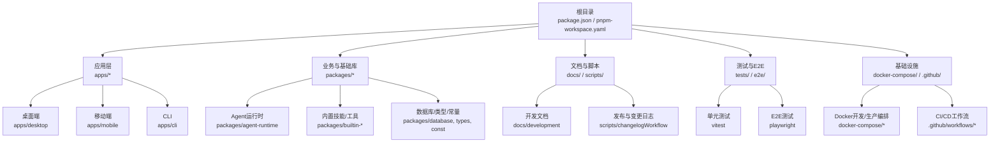
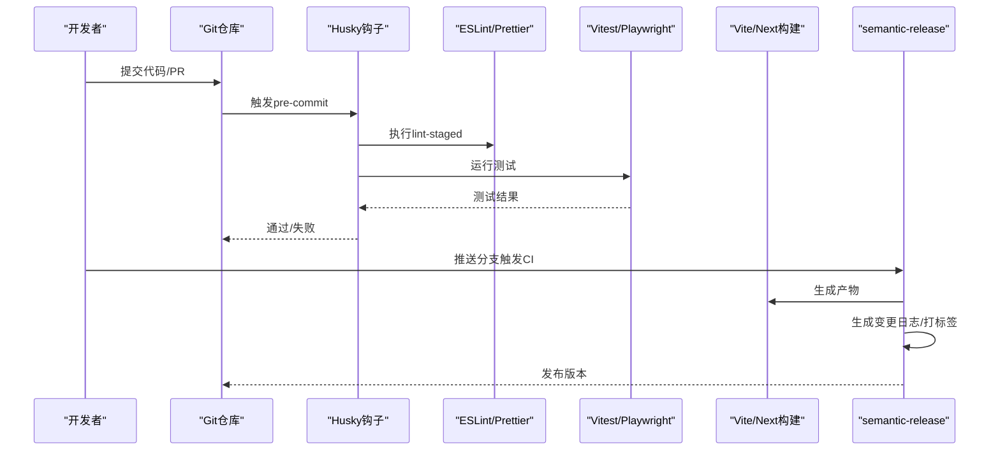
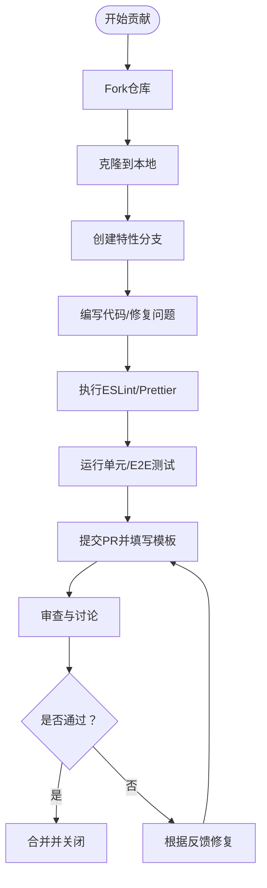
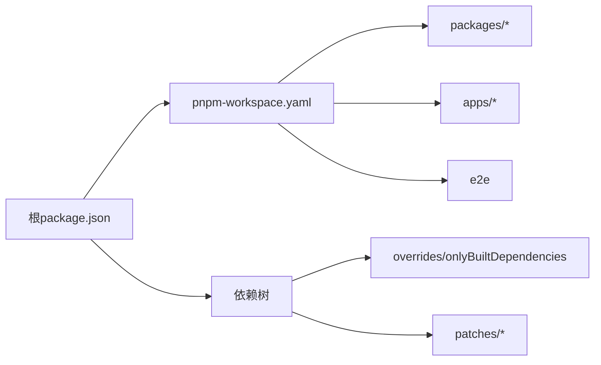

# 开发指南

<cite>
**本文引用的文件**   
- [CONTRIBUTING.md](file://CONTRIBUTING.md)
- [CODE_OF_CONDUCT.md](file://CODE_OF_CONDUCT.md)
- [.github/PULL_REQUEST_TEMPLATE.md](file://.github/PULL_REQUEST_TEMPLATE.md)
- [package.json](file://package.json)
- [pnpm-workspace.yaml](file://pnpm-workspace.yaml)
- [eslint.config.mjs](file://eslint.config.mjs)
- [prettier.config.mjs](file://prettier.config.mjs)
- [.releaserc.cjs](file://.releaserc.cjs)
- [tsconfig.json](file://tsconfig.json)
- [vite.config.ts](file://vite.config.ts)
</cite>

## 目录
1. [简介](#简介)
2. [项目结构](#项目结构)
3. [核心组件](#核心组件)
4. [架构总览](#架构总览)
5. [详细组件分析](#详细组件分析)
6. [依赖分析](#依赖分析)
7. [性能考虑](#性能考虑)
8. [故障排查指南](#故障排查指南)
9. [结论](#结论)
10. [附录](#附录)

## 简介
本开发指南面向希望参与 LobeHub（原 Lobe Chat）项目的贡献者与维护者，系统化阐述开发规范、提交规范、代码审查流程、贡献流程、Issue 与 PR 模板、开发工具与 IDE 配置、调试技巧、工作流（新功能开发、Bug 修复、版本发布）、治理与社区规则、质量标准（文档、测试、性能），帮助新贡献者快速上手并高效协作。

## 项目结构
LobeHub 采用多包工作区（monorepo）组织，核心由以下部分构成：
- 应用层：桌面端应用、移动端应用、CLI 工具、设备网关等
- 业务与基础库：Agent 运行时、工具集、数据库、状态管理、国际化、可观测性等
- 文档与脚本：开发文档、自动生成脚本、发布与变更日志工作流
- 测试与端到端：单元测试、覆盖率、E2E 测试与 Playwright 配置
- 基础设施：Docker Compose 开发与部署编排、Vercel/Netlify 等平台集成

图表来源
- [package.json](file://package.json#L30-L35)
- [pnpm-workspace.yaml](file://pnpm-workspace.yaml#L1-L5)

章节来源
- [package.json](file://package.json#L30-L35)
- [pnpm-workspace.yaml](file://pnpm-workspace.yaml#L1-L5)

## 核心组件
- 贡献与行为准则：贡献流程、PR 模板、社区行为规范
- 规范与工具：ESLint、Prettier、TypeScript、语义化发布
- 开发与构建：Vite、Next.js、PWA、代理与热更新
- 测试与质量：单元测试、覆盖率、E2E、lint-staged、husky
- 发布与变更日志：semantic-release、自定义 prepare 脚本
- 工作区与依赖：pnpm workspace、overrides、patches

章节来源
- [CONTRIBUTING.md](file://CONTRIBUTING.md#L1-L89)
- [.github/PULL_REQUEST_TEMPLATE.md](file://.github/PULL_REQUEST_TEMPLATE.md#L1-L48)
- [CODE_OF_CONDUCT.md](file://CODE_OF_CONDUCT.md#L1-L129)
- [eslint.config.mjs](file://eslint.config.mjs#L1-L151)
- [prettier.config.mjs](file://prettier.config.mjs#L1-L4)
- [.releaserc.cjs](file://.releaserc.cjs#L1-L19)
- [tsconfig.json](file://tsconfig.json#L1-L70)
- [vite.config.ts](file://vite.config.ts#L1-L123)
- [package.json](file://package.json#L124-L153)

## 架构总览
下图展示了从本地开发到 CI/CD 的典型流程，包括代码规范、测试、构建与发布：

图表来源
- [package.json](file://package.json#L124-L153)
- [.releaserc.cjs](file://.releaserc.cjs#L1-L19)

## 详细组件分析

### 贡献与协作流程
- Fork 与克隆：在 GitHub 上 Fork 仓库，使用 HTTPS 克隆到本地
- 分支策略：基于 main 新建特性分支，命名清晰
- 编码风格：遵循 ESLint 与 Prettier 规则；可使用脚本一键检查
- 提交与同步：定期与上游同步，保持分支最新
- PR 流程：填写模板、描述变更、提供截图/测试说明、等待审查与协作修改
- 审查与合并：维护者审查、反馈与迭代，最终合并

章节来源
- [CONTRIBUTING.md](file://CONTRIBUTING.md#L19-L89)
- [.github/PULL_REQUEST_TEMPLATE.md](file://.github/PULL_REQUEST_TEMPLATE.md#L1-L48)

### 行为准则与治理
- 社区承诺：包容、尊重、多元、健康
- 正面行为：同理心、尊重差异、建设性反馈、团队优先
- 不可接受行为：骚扰、歧视、隐私泄露、威胁等
- 执行责任：社区领袖负责澄清与执行标准，必要时移除不当内容
- 范围：适用于所有社区空间与代表社区的公共场合
- 影响等级：从纠正到暂时/永久封禁分级处理

章节来源
- [CODE_OF_CONDUCT.md](file://CODE_OF_CONDUCT.md#L1-L129)

### 代码规范与工具链
- ESLint：统一 React/Next/Turbo 规则，支持 MDX 文件；对特定目录放宽限制（如测试、CLI）
- Prettier：统一格式化风格
- TypeScript：严格模式、路径别名、类型检查
- Stylelint：样式文件检查（通过 lint-staged 集成）
- lint-staged + husky：在提交前自动格式化与校验，减少 CI 压力

章节来源
- [eslint.config.mjs](file://eslint.config.mjs#L1-L151)
- [prettier.config.mjs](file://prettier.config.mjs#L1-L4)
- [tsconfig.json](file://tsconfig.json#L1-L70)
- [package.json](file://package.json#L124-L153)

### 开发与构建配置
- Vite：开发服务器、代理、PWA 缓存策略、移动端/桌面端差异化输出
- Next.js：SSR/ISR、TypeScript 支持、路径别名
- 构建脚本：SPA 构建、拷贝与模板生成、Next 构建、Docker 构建、站点地图生成
- 本地隧道与调试：Cloudflare Tunnel、ngrok、本地代理打印

章节来源
- [vite.config.ts](file://vite.config.ts#L1-L123)
- [tsconfig.json](file://tsconfig.json#L1-L70)
- [package.json](file://package.json#L37-L122)

### 测试与质量保障
- 单元测试：Vitest，支持覆盖率与更新快照
- E2E 测试：Playwright，支持 smoke 测试与 UI 模式
- 质量门禁：lint-staged 在提交前拦截问题；husky 钩子保证流程一致性
- 类型检查：tsc 与 tsgo 双通道保障类型安全

章节来源
- [package.json](file://package.json#L101-L107)
- [package.json](file://package.json#L124-L153)

### 版本发布与变更日志
- 语义化发布：基于 semantic-release，支持主分支与 next 预发布分支
- 自动化：prepare 阶段调用变更日志生成脚本，确保每次发布都有记录
- 分支策略：main 稳定版，next 预发布版

章节来源
- [.releaserc.cjs](file://.releaserc.cjs#L1-L19)
- [package.json](file://package.json#L95-L96)
- [package.json](file://package.json#L112-L114)

### 工作区与依赖管理
- pnpm workspace：统一管理 packages、apps、e2e 等包
- overrides：锁定关键依赖版本，避免不兼容升级
- patches：对第三方依赖进行小补丁，确保稳定性

章节来源
- [pnpm-workspace.yaml](file://pnpm-workspace.yaml#L1-L23)
- [package.json](file://package.json#L505-L516)

## 依赖分析
- 包管理器：pnpm，启用 onlyBuiltDependencies 与 overrides
- 工作区：packages/**、apps/desktop/src/main、e2e
- 依赖覆盖：React、Drizzle、pdfjs-dist、jose 等关键依赖版本锁定
- 补丁：Swagger 与 Upstash QStash 的 patch

图表来源
- [pnpm-workspace.yaml](file://pnpm-workspace.yaml#L1-L23)
- [package.json](file://package.json#L505-L516)

章节来源
- [pnpm-workspace.yaml](file://pnpm-workspace.yaml#L1-L23)
- [package.json](file://package.json#L505-L516)

## 性能考虑
- 构建缓存与内存：构建脚本中设置较大的 Node 内存上限，避免 OOM
- PWA 缓存策略：字体、图片、API 使用不同缓存策略，平衡性能与新鲜度
- 依赖体积：仅构建必要依赖，避免不必要的打包体积
- 本地开发：Vite 热更新与代理，提升迭代效率

章节来源
- [package.json](file://package.json#L38-L44)
- [vite.config.ts](file://vite.config.ts#L64-L103)

## 故障排查指南
- 提交被拒绝：检查 lint-staged 是否通过，修正 ESLint/Prettier 报错
- 测试失败：先在本地运行对应测试命令，定位失败用例与断言
- 构建错误：查看内存相关报错，适当提高 NODE_OPTIONS 或分模块构建
- 代理与本地联调：确认 Vite 代理配置与本地服务端口一致
- 发布失败：检查 semantic-release 日志与 prepare 脚本输出

章节来源
- [package.json](file://package.json#L124-L153)
- [vite.config.ts](file://vite.config.ts#L106-L121)
- [.releaserc.cjs](file://.releaserc.cjs#L11-L16)

## 结论
本指南提供了从贡献流程、代码规范、工具链配置到发布与治理的完整参考。建议新贡献者在首次提交前通读贡献与行为准则，按模板填写 PR，并在本地完成 lint 与测试验证，以提高审查效率与合并质量。

## 附录

### 提交与审查要点清单
- 清晰的提交信息与 PR 描述
- 必要的截图或视频演示
- 本地/测试已通过
- 遵循代码风格与类型检查
- 如有破坏性变更，提供迁移指南

章节来源
- [.github/PULL_REQUEST_TEMPLATE.md](file://.github/PULL_REQUEST_TEMPLATE.md#L1-L48)

### 开发环境与 IDE 建议
- 使用 VS Code 并安装推荐扩展（ESLint、Prettier、TypeScript）
- 启用保存时格式化与 ESLint 自动修复
- 在终端中使用项目提供的脚本启动各应用与服务
- 配置 Vite 代理与 Next 开发端口，便于前后端联调

章节来源
- [vite.config.ts](file://vite.config.ts#L106-L121)
- [package.json](file://package.json#L60-L68)