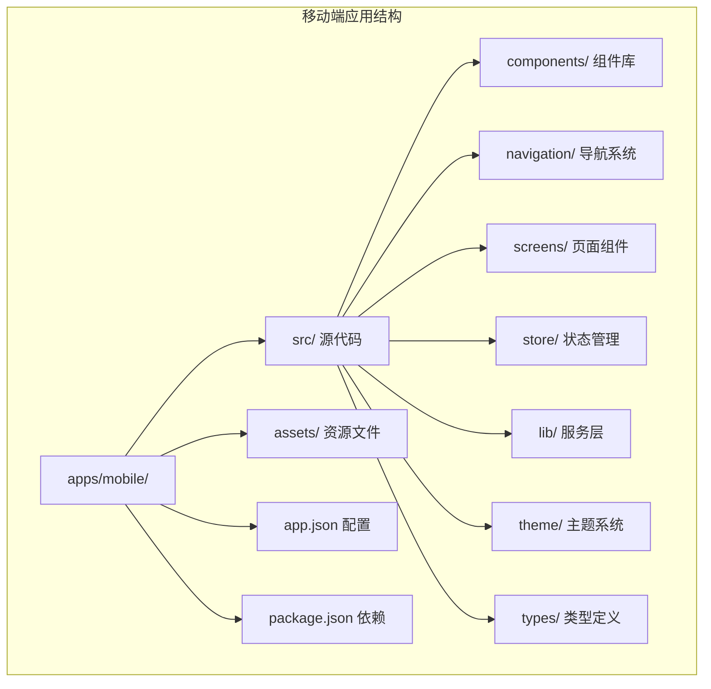
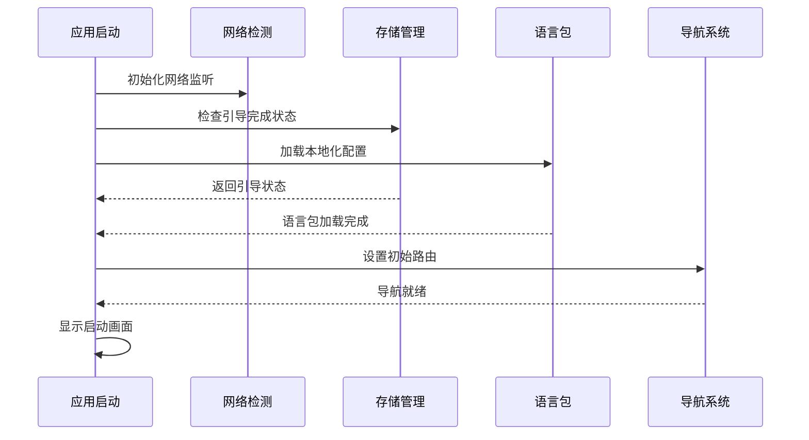
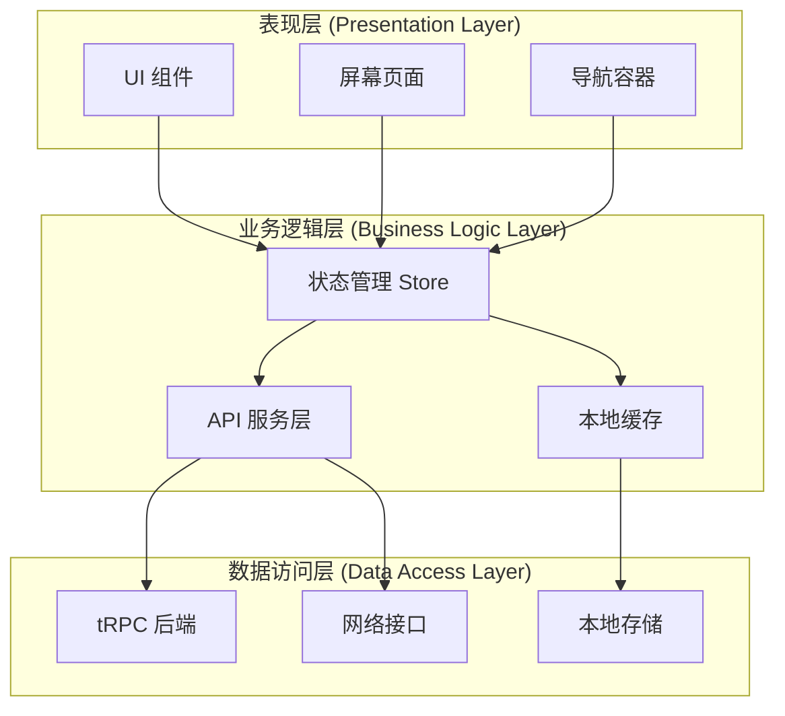
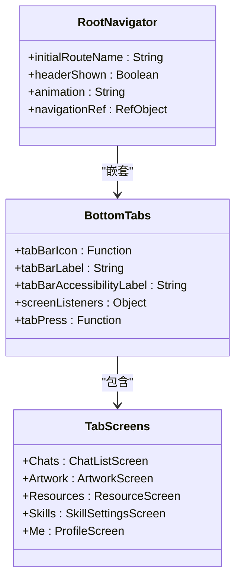
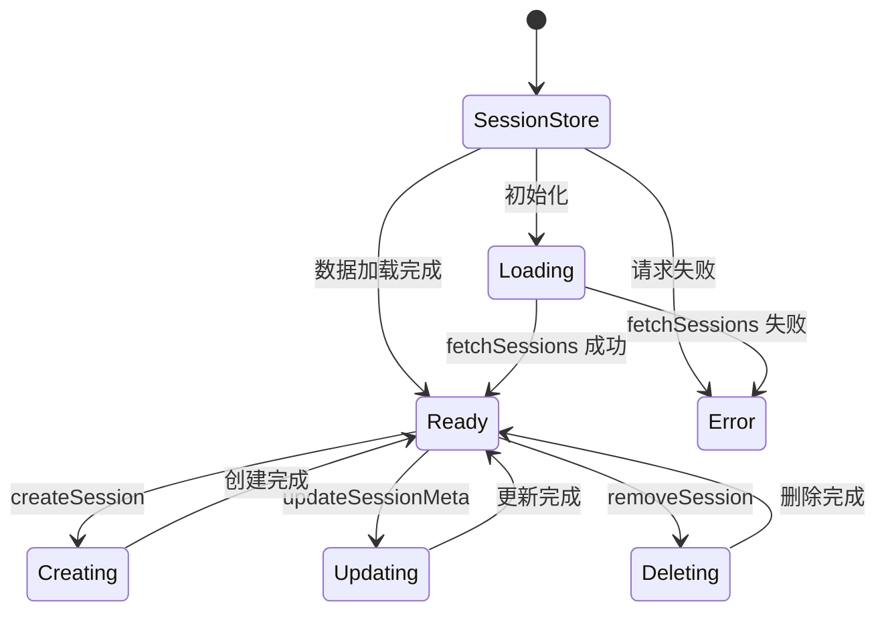
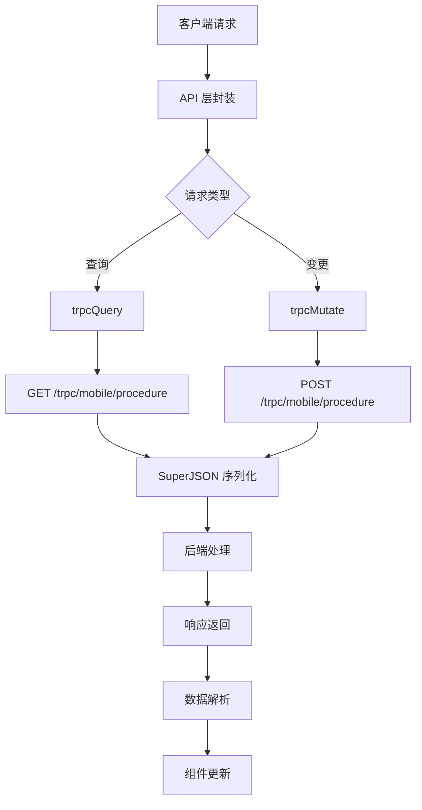
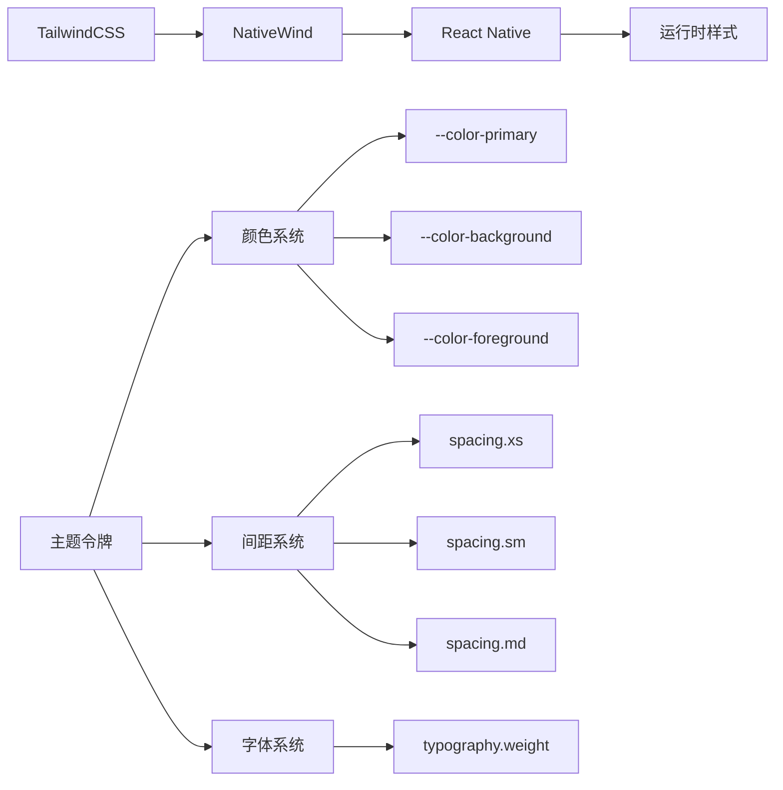
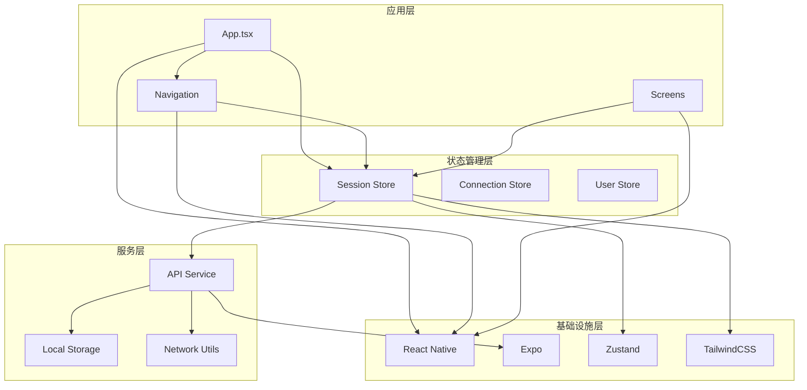

# 移动端开发指南

<cite>
**本文档引用的文件**
- [apps/mobile/package.json](file://apps/mobile/package.json)
- [apps/mobile/App.tsx](file://apps/mobile/App.tsx)
- [apps/mobile/tsconfig.json](file://apps/mobile/tsconfig.json)
- [apps/mobile/tailwind.config.js](file://apps/mobile/tailwind.config.js)
- [apps/mobile/metro.config.js](file://apps/mobile/metro.config.js)
- [apps/mobile/global.css](file://apps/mobile/global.css)
- [apps/mobile/app.json](file://apps/mobile/app.json)
- [apps/mobile/src/navigation/index.tsx](file://apps/mobile/src/navigation/index.tsx)
- [apps/mobile/src/store/session.ts](file://apps/mobile/src/store/session.ts)
- [apps/mobile/src/store/connection.ts](file://apps/mobile/src/store/connection.ts)
- [apps/mobile/src/lib/api.ts](file://apps/mobile/src/lib/api.ts)
- [apps/mobile/src/theme/index.ts](file://apps/mobile/src/theme/index.ts)
- [apps/mobile/src/theme/tokens.ts](file://apps/mobile/src/theme/tokens.ts)
</cite>

## 目录

1. [简介](#简介)
2. [项目结构](#项目结构)
3. [核心组件](#核心组件)
4. [架构概览](#架构概览)
5. [详细组件分析](#详细组件分析)
6. [依赖关系分析](#依赖关系分析)
7. [性能考虑](#性能考虑)
8. [故障排除指南](#故障排除指南)
9. [结论](#结论)

## 简介

本指南面向移动端开发者，详细介绍 LobeHub 移动端应用的架构设计、技术栈选择、核心功能实现以及最佳实践。该应用基于 React Native 和 Expo 构建，采用现代化的移动端开发模式，支持多平台部署（iOS、Android、Web）。

## 项目结构

移动端应用采用模块化组织方式，主要目录结构如下：

**图表来源**

- [apps/mobile/package.json:1-50](file://apps/mobile/package.json#L1-L50)
- [apps/mobile/app.json:1-34](file://apps/mobile/app.json#L1-L34)

**章节来源**

- [apps/mobile/package.json:1-50](file://apps/mobile/package.json#L1-L50)
- [apps/mobile/app.json:1-34](file://apps/mobile/app.json#L1-L34)

## 核心组件

### 技术栈与依赖

移动端应用采用以下核心技术栈：

| 组件类别     | 核心库           | 版本     | 功能描述       |
| ------------ | ---------------- | -------- | -------------- |
| **框架**     | React Native     | 0.83.2   | 移动端基础框架 |
| **UI 导航**  | React Navigation | ^7.15.5  | 底部标签导航   |
| **状态管理** | Zustand          | ^5.0.11  | 轻量级状态管理 |
| **样式系统** | TailwindCSS      | ^3.3.2   | 原子化样式工具 |
| **原生集成** | Expo             | \~55.0.5 | 跨平台开发环境 |
| **网络请求** | SuperJSON        | ^2.2.6   | 数据序列化     |

### 应用初始化流程

**图表来源**

- [apps/mobile/App.tsx:35-93](file://apps/mobile/App.tsx#L35-L93)

**章节来源**

- [apps/mobile/App.tsx:1-112](file://apps/mobile/App.tsx#L1-L112)
- [apps/mobile/package.json:12-42](file://apps/mobile/package.json#L12-L42)

## 架构概览

移动端应用采用分层架构设计，各层职责清晰分离：

**图表来源**

- [apps/mobile/src/store/session.ts:41-253](file://apps/mobile/src/store/session.ts#L41-L253)
- [apps/mobile/src/lib/api.ts:110-137](file://apps/mobile/src/lib/api.ts#L110-L137)

## 详细组件分析

### 导航系统

应用采用底部标签导航与原生堆栈导航相结合的设计：

**图表来源**

- [apps/mobile/src/navigation/index.tsx:73-168](file://apps/mobile/src/navigation/index.tsx#L73-L168)
- [apps/mobile/src/navigation/index.tsx:174-317](file://apps/mobile/src/navigation/index.tsx#L174-L317)

导航系统特点：

- 支持五种主要功能区域：聊天、艺术作品、资源、技能、个人中心
- 每个标签页都有自定义图标和焦点状态
- 底部标签栏在 iOS 和 Android 上有差异化适配
- 提供触觉反馈增强用户体验

**章节来源**

- [apps/mobile/src/navigation/index.tsx:1-318](file://apps/mobile/src/navigation/index.tsx#L1-L318)

### 状态管理系统

应用使用 Zustand 实现轻量级状态管理：

**图表来源**

- [apps/mobile/src/store/session.ts:41-253](file://apps/mobile/src/store/session.ts#L41-L253)

核心状态管理功能：

- 会话列表管理（创建、删除、重命名、固定）
- 活跃会话切换与持久化
- 本地存储与服务器数据同步
- 错误处理与用户提示

**章节来源**

- [apps/mobile/src/store/session.ts:1-254](file://apps/mobile/src/store/session.ts#L1-L254)

### API 服务层

应用采用 tRPC 协议与后端通信：

**图表来源**

- [apps/mobile/src/lib/api.ts:110-137](file://apps/mobile/src/lib/api.ts#L110-L137)

API 设计特点：

- 使用 SuperJSON 进行数据序列化
- 支持流式响应处理
- 完整的错误处理机制
- 缓存策略优化

**章节来源**

- [apps/mobile/src/lib/api.ts:1-800](file://apps/mobile/src/lib/api.ts#L1-L800)

### 主题与样式系统

应用采用原子化样式设计：

**图表来源**

- [apps/mobile/tailwind.config.js:1-20](file://apps/mobile/tailwind.config.js#L1-L20)
- [apps/mobile/global.css:1-14](file://apps/mobile/global.css#L1-L14)

**章节来源**

- [apps/mobile/tailwind.config.js:1-20](file://apps/mobile/tailwind.config.js#L1-L20)
- [apps/mobile/global.css:1-14](file://apps/mobile/global.css#L1-L14)
- [apps/mobile/src/theme/index.ts:1-24](file://apps/mobile/src/theme/index.ts#L1-L24)
- [apps/mobile/src/theme/tokens.ts:1-60](file://apps/mobile/src/theme/tokens.ts#L1-L60)

## 依赖关系分析

移动端应用的依赖关系呈现清晰的层次结构：

**图表来源**

- [apps/mobile/package.json:12-42](file://apps/mobile/package.json#L12-L42)
- [apps/mobile/src/store/session.ts:9-16](file://apps/mobile/src/store/session.ts#L9-L16)

**章节来源**

- [apps/mobile/package.json:1-50](file://apps/mobile/package.json#L1-L50)

## 性能考虑

### 启动性能优化

应用采用渐进式启动策略：

- 启动画面显示 2 秒，确保关键资源加载完成
- 异步加载语言包和配置数据
- 网络连接状态检查非阻塞执行
- 会话数据懒加载策略

### 内存管理

- 使用 Zustand 替代 Redux，减少内存开销
- 本地存储与服务器数据分离管理
- 图片资源按需加载和缓存策略
- 组件卸载时自动清理事件监听器

### 网络优化

- tRPC 协议减少传输数据量
- SuperJSON 序列化提升数据传输效率
- 流式响应处理大文本内容
- 自动重连机制处理网络波动

## 故障排除指南

### 常见问题诊断

**网络连接问题**

- 检查 `useConnectionStore` 的连接状态
- 验证服务器 URL 配置
- 确认防火墙和代理设置

**状态同步问题**

- 检查 `useSessionStore` 的数据一致性
- 验证本地存储权限
- 确认 API 响应格式

**UI 渲染问题**

- 检查 TailwindCSS 样式编译
- 验证主题配置正确性
- 确认组件 props 传递

**章节来源**

- [apps/mobile/src/store/connection.ts:23-38](file://apps/mobile/src/store/connection.ts#L23-L38)
- [apps/mobile/src/store/session.ts:48-93](file://apps/mobile/src/store/session.ts#L48-L93)

### 开发调试技巧

1. **网络请求调试**
   - 使用浏览器开发者工具监控网络请求
   - 检查 tRPC 请求的输入输出
   - 验证 SuperJSON 序列化结果

2. **状态管理调试**
   - 利用 React DevTools 检查组件状态
   - 监控 Zustand store 变化
   - 跟踪异步操作执行流程

3. **样式问题排查**
   - 检查 TailwindCSS 配置文件
   - 验证 NativeWind 集成
   - 确认 CSS 变量定义

## 结论

LobeHub 移动端应用展现了现代移动端开发的最佳实践：

**架构优势**

- 清晰的分层架构便于维护和扩展
- 现代化技术栈提供良好开发体验
- 原子化样式系统确保设计一致性

**性能特性**

- 渐进式启动优化用户体验
- 高效的状态管理和数据同步
- 优化的网络请求处理机制

**开发体验**

- 完善的 TypeScript 支持
- 丰富的 UI 组件库
- 灵活的主题定制能力

该架构为移动端应用开发提供了良好的参考模板，开发者可以在此基础上进行功能扩展和性能优化。
