# 移动端开发指南

<cite>
**本文档引用的文件**
- [apps/mobile/package.json](file://apps/mobile/package.json)
- [apps/mobile/App.tsx](file://apps/mobile/App.tsx)
- [apps/mobile/tsconfig.json](file://apps/mobile/tsconfig.json)
- [apps/mobile/tailwind.config.js](file://apps/mobile/tailwind.config.js)
- [apps/mobile/metro.config.js](file://apps/mobile/metro.config.js)
- [apps/mobile/global.css](file://apps/mobile/global.css)
- [apps/mobile/app.json](file://apps/mobile/app.json)
- [apps/mobile/src/navigation/index.tsx](file://apps/mobile/src/navigation/index.tsx)
- [apps/mobile/src/store/session.ts](file://apps/mobile/src/store/session.ts)
- [apps/mobile/src/store/connection.ts](file://apps/mobile/src/store/connection.ts)
- [apps/mobile/src/lib/api.ts](file://apps/mobile/src/lib/api.ts)
- [apps/mobile/src/theme/index.ts](file://apps/mobile/src/theme/index.ts)
- [apps/mobile/src/theme/tokens.ts](file://apps/mobile/src/theme/tokens.ts)
- [apps/mobile/src/theme/colors.ts](file://apps/mobile/src/theme/colors.ts)
- [apps/mobile/src/theme/palettes.ts](file://apps/mobile/src/theme/palettes.ts)
- [apps/mobile/src/store/theme.ts](file://apps/mobile/src/store/theme.ts)
- [apps/mobile/src/components/ThemeProvider.tsx](file://apps/mobile/src/components/ThemeProvider.tsx)
- [apps/mobile/src/components/ui/Toast.tsx](file://apps/mobile/src/components/ui/Toast.tsx)
- [apps/mobile/src/features/BuiltinTools/index.ts](file://apps/mobile/src/features/BuiltinTools/index.ts)
- [apps/mobile/src/constants/recommendedBuiltins.ts](file://apps/mobile/src/constants/recommendedBuiltins.ts)
- [docs/development/rag-support-audit.zh-CN.md](file://docs/development/rag-support-audit.zh-CN.md)
- [docs/development/remove-upstash-qstash-audit.zh-CN.md](file://docs/development/remove-upstash-qstash-audit.zh-CN.md)
- [docs/development/chat-implementation-audit.zh-CN.md](file://docs/development/chat-implementation-audit.zh-CN.md)
</cite>

## 更新摘要
**所做更改**
- 新增RAG支持审计章节，详细分析移动端RAG能力现状与缺口
- 新增Upstash QStash移除审计章节，阐述异步基础设施替代方案
- 更新架构概览，反映RAG与异步处理的最新架构演进
- 新增移动端知识库选择入口的架构分析
- 更新性能优化策略，增加RAG检索优化与异步任务优化
- 新增移动端与服务端架构依赖关系图

## 目录
1. [简介](#简介)
2. [项目结构](#项目结构)
3. [核心组件](#核心组件)
4. [架构概览](#架构概览)
5. [详细组件分析](#详细组件分析)
6. [主题系统实现](#主题系统实现)
7. [内置工具系统](#内置工具系统)
8. [通知与交互系统](#通知与交互系统)
9. [性能优化策略](#性能优化策略)
10. [RAG支持架构](#rag支持架构)
11. [异步基础设施演进](#异步基础设施演进)
12. [依赖关系分析](#依赖关系分析)
13. [故障排除指南](#故障排除指南)
14. [结论](#结论)

## 简介

本指南面向移动端开发者，详细介绍 LobeHub 移动端应用的架构设计、技术栈选择、核心功能实现以及最佳实践。该应用基于 React Native 和 Expo 构建，采用现代化的移动端开发模式，支持多平台部署（iOS、Android、Web）。

**重大更新**：本次更新反映了移动端UI重设计、主题系统实现、内置工具系统、性能优化等重大更新，包括全新的主题系统、完整的内置工具集、Toast通知系统和多项性能优化。同时新增了RAG支持架构分析和Upstash QStash移除的异步基础设施演进。

## 项目结构

移动端应用采用模块化组织方式，主要目录结构如下：

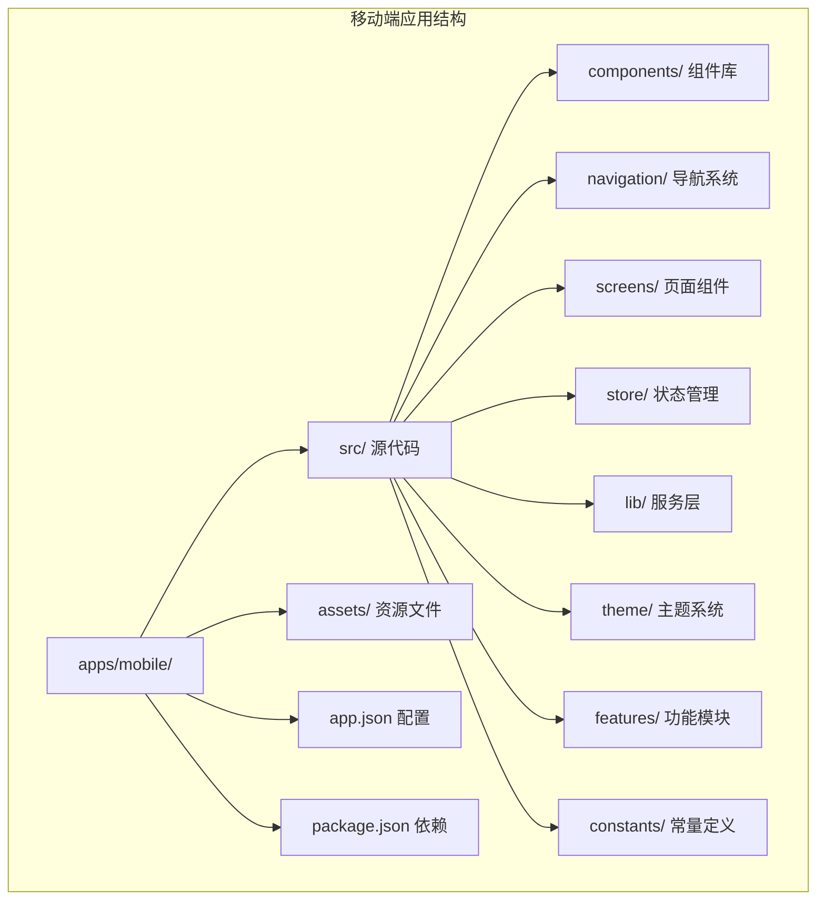

**图表来源**
- [apps/mobile/package.json:1-60](file://apps/mobile/package.json#L1-L60)
- [apps/mobile/app.json:1-34](file://apps/mobile/app.json#L1-L34)

**章节来源**
- [apps/mobile/package.json:1-60](file://apps/mobile/package.json#L1-L60)
- [apps/mobile/app.json:1-34](file://apps/mobile/app.json#L1-L34)

## 核心组件

### 技术栈与依赖

移动端应用采用以下核心技术栈：

| 组件类别 | 核心库 | 版本 | 功能描述 |
|---------|--------|------|----------|
| **框架** | React Native | 0.83.2 | 移动端基础框架 |
| **UI 导航** | React Navigation | ^7.15.5 | 底部标签导航 |
| **状态管理** | Zustand | ^5.0.11 | 轻量级状态管理 |
| **样式系统** | TailwindCSS | ^3.3.2 | 原子化样式工具 |
| **原生集成** | Expo | ~55.0.5 | 跨平台开发环境 |
| **网络请求** | SuperJSON | ^2.2.6 | 数据序列化 |
| **高性能列表** | FlashList | ^1.7.2 | 虚拟化列表渲染 |
| **动画系统** | GSAP | ^3.14.2 | 高性能动画库 |
| **RAG检索** | PGVector | ^0.1.0 | 向量数据库检索 |
| **异步队列** | BullMQ | ^1.8.0 | Redis队列实现 |

### 应用初始化流程

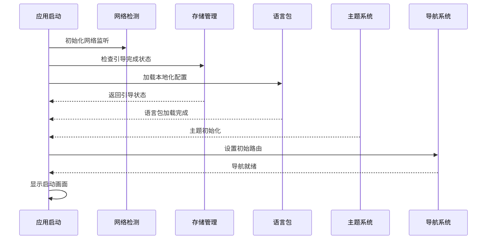

**图表来源**
- [apps/mobile/App.tsx:83-204](file://apps/mobile/App.tsx#L83-L204)

**章节来源**
- [apps/mobile/App.tsx:1-233](file://apps/mobile/App.tsx#L1-L233)
- [apps/mobile/package.json:12-52](file://apps/mobile/package.json#L12-L52)

## 架构概览

移动端应用采用分层架构设计，各层职责清晰分离，现已集成RAG支持和异步基础设施：

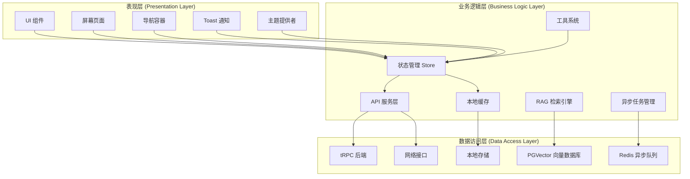

**图表来源**
- [apps/mobile/src/store/session.ts:41-253](file://apps/mobile/src/store/session.ts#L41-L253)
- [apps/mobile/src/lib/api.ts:110-137](file://apps/mobile/src/lib/api.ts#L110-L137)

## 详细组件分析

### 导航系统

应用采用底部标签导航与原生堆栈导航相结合的设计：

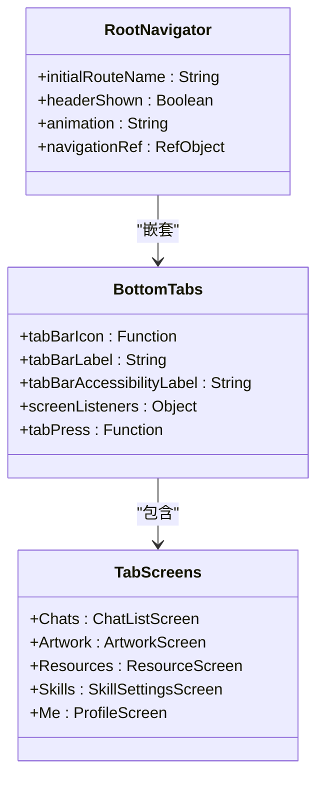

**图表来源**
- [apps/mobile/src/navigation/index.tsx:73-168](file://apps/mobile/src/navigation/index.tsx#L73-L168)
- [apps/mobile/src/navigation/index.tsx:174-317](file://apps/mobile/src/navigation/index.tsx#L174-L317)

导航系统特点：
- 支持五种主要功能区域：聊天、艺术作品、资源、技能、个人中心
- 每个标签页都有自定义图标和焦点状态
- 底部标签栏在 iOS 和 Android 上有差异化适配
- 提供触觉反馈增强用户体验

**章节来源**
- [apps/mobile/src/navigation/index.tsx:1-318](file://apps/mobile/src/navigation/index.tsx#L1-L318)

### 状态管理系统

应用使用 Zustand 实现轻量级状态管理：

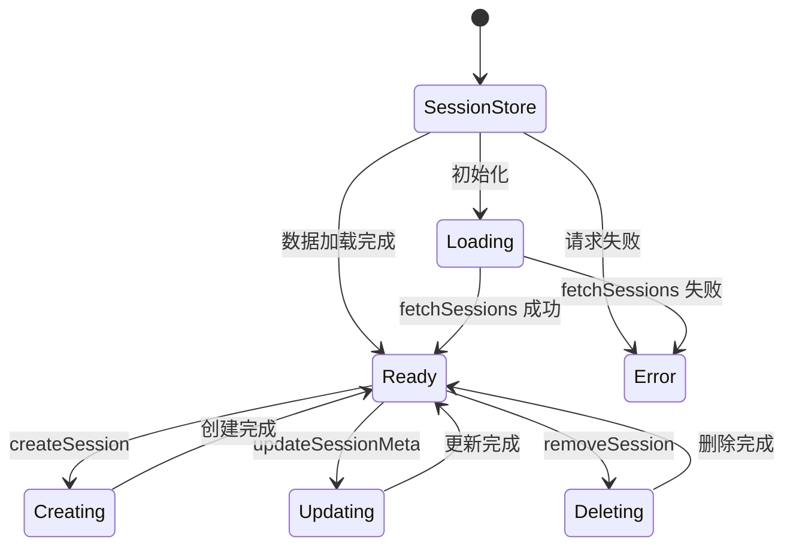

**图表来源**
- [apps/mobile/src/store/session.ts:41-253](file://apps/mobile/src/store/session.ts#L41-L253)

核心状态管理功能：
- 会话列表管理（创建、删除、重命名、固定）
- 活跃会话切换与持久化
- 本地存储与服务器数据同步
- 错误处理与用户提示

**章节来源**
- [apps/mobile/src/store/session.ts:1-254](file://apps/mobile/src/store/session.ts#L1-L254)

### API 服务层

应用采用 tRPC 协议与后端通信：

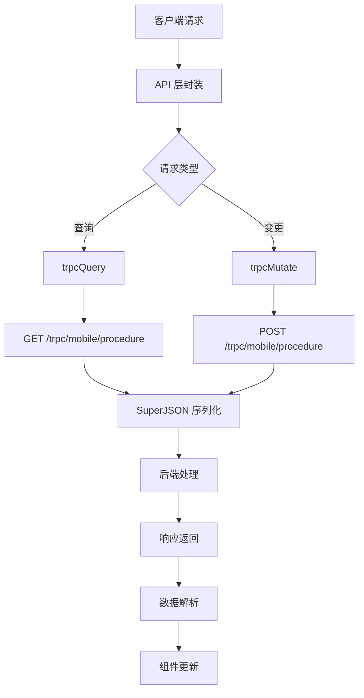

**图表来源**
- [apps/mobile/src/lib/api.ts:110-137](file://apps/mobile/src/lib/api.ts#L110-L137)

API 设计特点：
- 使用 SuperJSON 进行数据序列化
- 支持流式响应处理
- 完整的错误处理机制
- 缓存策略优化

**章节来源**
- [apps/mobile/src/lib/api.ts:1-800](file://apps/mobile/src/lib/api.ts#L1-L800)

## 主题系统实现

### 主题架构设计

应用采用统一的主题系统，支持多种颜色方案和动态切换：

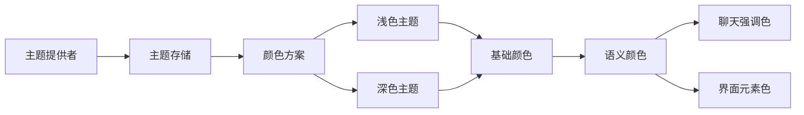

**图表来源**
- [apps/mobile/src/theme/index.ts:11-37](file://apps/mobile/src/theme/index.ts#L11-L37)
- [apps/mobile/src/theme/colors.ts:380-387](file://apps/mobile/src/theme/colors.ts#L380-L387)

### 颜色系统架构

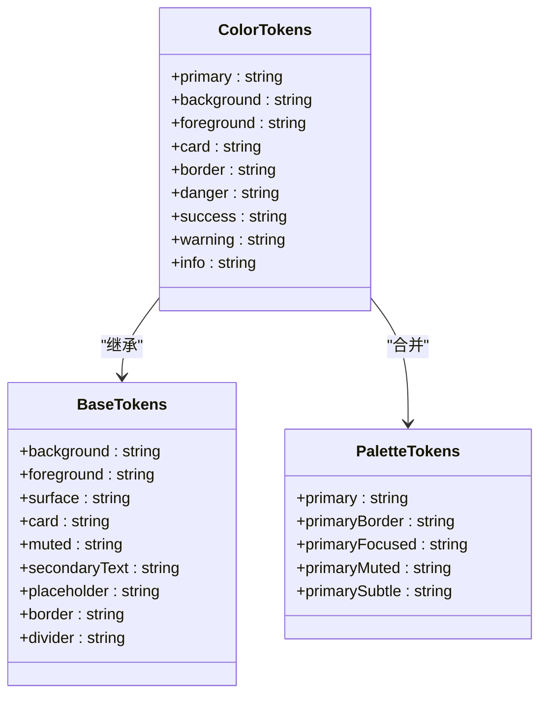

**图表来源**
- [apps/mobile/src/theme/colors.ts:9-106](file://apps/mobile/src/theme/colors.ts#L9-L106)
- [apps/mobile/src/theme/colors.ts:190-332](file://apps/mobile/src/theme/colors.ts#L190-L332)

### 主题存储与状态管理

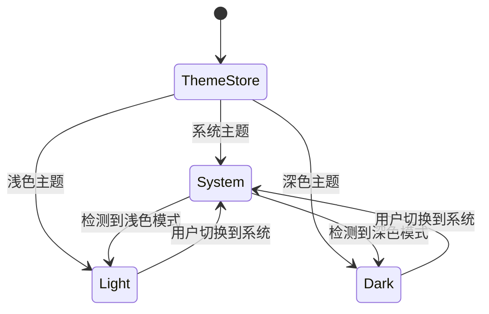

**图表来源**
- [apps/mobile/src/store/theme.ts:34-75](file://apps/mobile/src/store/theme.ts#L34-L75)

主题系统特点：
- 支持浅色、深色和系统自动三种主题模式
- 可配置的颜色方案（当前为蓝色方案）
- 实时主题切换，无需重启应用
- 本地持久化存储主题偏好

**章节来源**
- [apps/mobile/src/theme/index.ts:1-38](file://apps/mobile/src/theme/index.ts#L1-L38)
- [apps/mobile/src/theme/tokens.ts:1-72](file://apps/mobile/src/theme/tokens.ts#L1-L72)
- [apps/mobile/src/theme/colors.ts:1-470](file://apps/mobile/src/theme/colors.ts#L1-L470)
- [apps/mobile/src/store/theme.ts:1-81](file://apps/mobile/src/store/theme.ts#L1-L81)
- [apps/mobile/src/components/ThemeProvider.tsx:1-51](file://apps/mobile/src/components/ThemeProvider.tsx#L1-L51)

## 内置工具系统

### 工具系统架构

应用实现了完整的内置工具系统，支持多种实用工具：

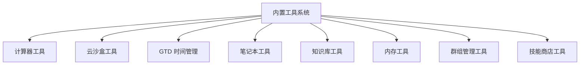

**图表来源**
- [apps/mobile/src/features/BuiltinTools/index.ts:26-35](file://apps/mobile/src/features/BuiltinTools/index.ts#L26-L35)

### 工具注册表

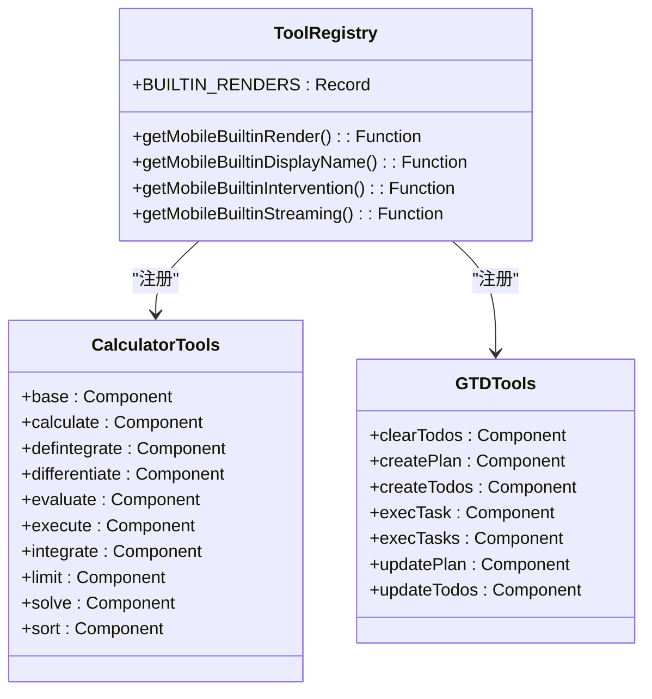

**图表来源**
- [apps/mobile/src/features/BuiltinTools/index.ts:72-123](file://apps/mobile/src/features/BuiltinTools/index.ts#L72-L123)

### 推荐工具常量

应用定义了推荐的内置工具集合：

| 工具标识符 | 类型 | 描述 | 图标 |
|-----------|------|------|------|
| lobe-artifacts | builtinAgent | 产物工具 | artifacts |
| lobe-user-memory | builtinTool | 用户记忆工具 | memory |
| lobe-cloud-sandbox | builtinTool | 云沙盒工具 | cloud |
| lobe-gtd | builtinTool | GTD时间管理 | gtd |
| lobe-notebook | builtinTool | 笔记本工具 | notebook |
| lobe-calculator | builtinTool | 计算器工具 | calculator |

**章节来源**
- [apps/mobile/src/features/BuiltinTools/index.ts:1-148](file://apps/mobile/src/features/BuiltinTools/index.ts#L1-L148)
- [apps/mobile/src/constants/recommendedBuiltins.ts:1-65](file://apps/mobile/src/constants/recommendedBuiltins.ts#L1-L65)

## 通知与交互系统

### Toast 通知系统

应用实现了完整的Toast通知系统，提供多种通知类型和动画效果：

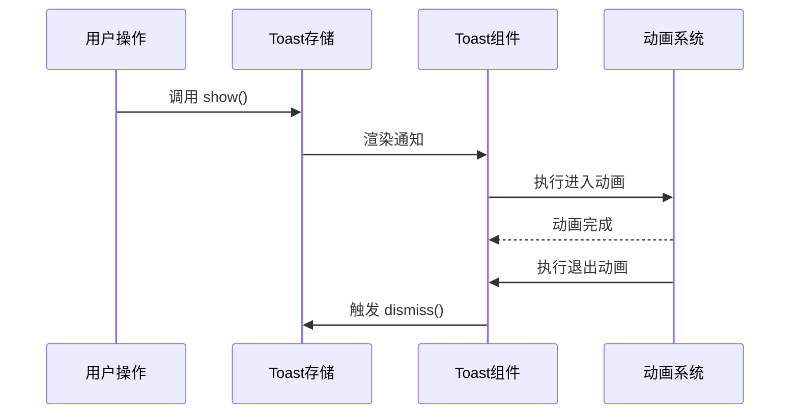

**图表来源**
- [apps/mobile/src/components/ui/Toast.tsx:45-68](file://apps/mobile/src/components/ui/Toast.tsx#L45-L68)

Toast系统特点：
- 支持成功、错误、信息三种通知类型
- 自适应动画时长，错误通知更长显示时间
- 支持重试操作，错误通知可触发重试
- 平滑的进入和退出动画效果
- 响应式设计，适配不同屏幕尺寸

**章节来源**
- [apps/mobile/src/components/ui/Toast.tsx:1-203](file://apps/mobile/src/components/ui/Toast.tsx#L1-L203)

## 性能优化策略

### 启动性能优化

应用采用渐进式启动策略：
- 启动画面显示 2 秒，确保关键资源加载完成
- 异步加载语言包和配置数据
- 网络连接状态检查非阻塞执行
- 会话数据懒加载策略

### 列表性能优化

**更新** 新增FlashList虚拟化列表优化：

应用采用FlashList替代FlatList，提供更好的滚动性能：

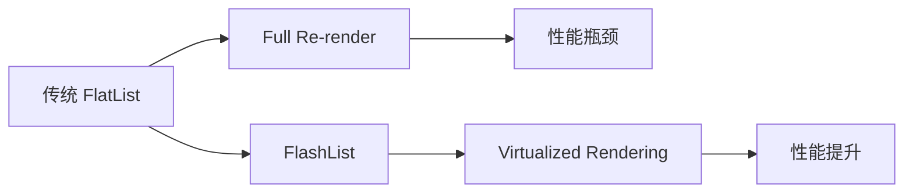

性能优化措施：
- 使用FlashList进行虚拟化渲染
- 优化图片加载和缓存策略
- 减少不必要的组件重新渲染
- 实现懒加载和按需加载

### 动画性能优化

**更新** 新增GSAP动画库优化：

应用集成GSAP动画库，提供高性能动画效果：

- 使用原生驱动的动画属性
- 优化动画队列和并发控制
- 实现动画预加载和缓存
- 减少动画对主线程的影响

### 内存管理

- 使用 Zustand 替代 Redux，减少内存开销
- 本地存储与服务器数据分离管理
- 图片资源按需加载和缓存策略
- 组件卸载时自动清理事件监听器

### 网络优化

- tRPC 协议减少传输数据量
- SuperJSON 序列化提升数据传输效率
- 流式响应处理大文本内容
- 自动重连机制处理网络波动

### RAG检索优化

**新增** RAG检索性能优化：

- 向量检索使用PGVector HNSW索引
- 检索结果按文件聚合，取top3平均分
- 支持Top-K控制（5-100）
- 知识库范围检索优化

### 异步任务优化

**新增** 异步任务性能优化：

- Redis队列实现可靠的任务调度
- BullMQ提供重试和可观测性
- 内部队列化处理大规模任务
- 任务状态持久化和恢复

**章节来源**
- [apps/mobile/package.json:14-14](file://apps/mobile/package.json#L14-L14)
- [apps/mobile/src/components/ui/Toast.tsx:87-103](file://apps/mobile/src/components/ui/Toast.tsx#L87-L103)

## RAG支持架构

### RAG能力现状分析

LobeHub移动端已具备完整的RAG基础能力，覆盖文档解析、向量化、语义检索、工具调用与上下文注入。核心链路在Web端打通，移动端支持部分能力。

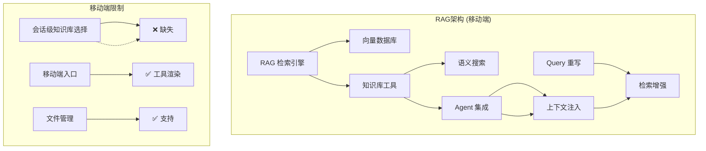

**图表来源**
- [docs/development/rag-support-audit.zh-CN.md:14-136](file://docs/development/rag-support-audit.zh-CN.md#L14-L136)

### 已实现能力

**文档处理流水线**：
- 文件上传：S3兼容存储（RustFS/MinIO/AWS S3）
- 文档解析：支持PDF、MD、DOC、XLS、PPT等
- 分块处理：`ChunkService.asyncParseFileToChunks`
- 向量化：默认`text-embedding-3-small`，可配置多Provider
- 向量存储：PostgreSQL + PGVector，HNSW索引

**语义检索**：
- 向量语义搜索：`ChunkModel.semanticSearchForChat`
- 知识库范围检索：支持按knowledgeBaseIds限定
- Top-K控制：默认15，可配置5-100
- 结果聚合：`groupAndRankFiles`按文件聚合

**知识库工具**：
- `searchKnowledgeBase`：语义搜索，返回文件摘要与相关chunk
- `readKnowledge`：按fileIds读取完整文件内容

**章节来源**
- [docs/development/rag-support-audit.zh-CN.md:18-108](file://docs/development/rag-support-audit.zh-CN.md#L18-L108)

### 移动端支持缺口

当前最值得继续投入的三项分别是：**Rerank接入**、**混合检索**、**Mobile会话级知识库选择**。

**移动端能力矩阵**：

| 能力 | Web | Mobile | 备注 |
|------|-----|--------|------|
| 文件上传与解析 | ✅ | ✅ | 共用API |
| 向量化与存储 | ✅ | ✅ | 服务端 |
| 语义检索 | ✅ | ✅ | 通过工具调用 |
| 知识库工具（search/read） | ✅ | ✅ | 共用Lambda |
| Agent绑定知识库 | ✅ | ✅ | 配置同步 |
| 会话级选择知识库 | ✅ | ❌ | Mobile无UI |
| Query重写 | ✅ | ⚠️ | 依赖Web配置 |
| Rerank | ❌ | ❌ | 仅配置，未实现 |
| 混合检索 | ❌ | ❌ | 未实现 |
| RAG评估 | ✅ | N/A | 评估后台能力 |

**章节来源**
- [docs/development/rag-support-audit.zh-CN.md:126-204](file://docs/development/rag-support-audit.zh-CN.md#L126-L204)

## 异步基础设施演进

### Upstash QStash移除计划

**结论**：可以移除Upstash QStash，但前提是先完成站内异步基础设施替代。

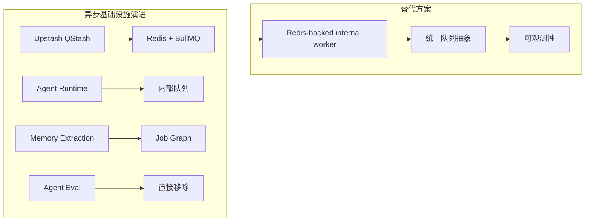

**图表来源**
- [docs/development/remove-upstash-qstash-audit.zh-CN.md:18-64](file://docs/development/remove-upstash-qstash-audit.zh-CN.md#L18-L64)

### 核心判断

| 结论 | 判断 |
|------|------|
| 是否保留兼容路径 | ❌ 不保留QStash/Workflow/internal worker共存期 |
| 仅通过LocalQueueServiceImpl替代QStash | ❌ 只适合本地/单机简化部署 |
| AgentBridgeService改为webhookDelivery:'fetch' | ❌ 当前bot callback仍依赖QStash签名 |
| Memory需要"新增direct模式" | ❌ `direct`执行原语已存在 |
| Agent Eval处理 | ✅ 不保留临时降级态；要么完整迁移，要么直接移除 |

### 推荐路线

1. **引入Redis-backed internal worker**，作为唯一异步基础设施
2. **直接将Agent Runtime切换到internal worker**
3. **直接去掉bot callback的内部HTTP自回调**
4. **直接将Memory主链路切换到internal job graph**
5. **Agent Eval不保留临时降级态**
6. **Web与App与Server同批对齐到最终态**
7. **同批删除@upstash/qstash、@upstash/workflow**

**章节来源**
- [docs/development/remove-upstash-qstash-audit.zh-CN.md:25-48](file://docs/development/remove-upstash-qstash-audit.zh-CN.md#L25-L48)

### 逐步实施计划

**工作包A：internal worker与统一队列抽象**
- 引入Redis-backed job runner，推荐`bullmq`
- 建立统一抽象：`enqueue(jobName, payload, options)`
- 明确job分类：`agent-runtime-step`、`memory-process-*`、`persona-update`

**工作包B：Agent Runtime与bot callback终态改造**
- 新增`RedisQueueServiceImpl`
- queue mode改为投递internal worker job
- 删除bot callback的内部HTTP自回调

**工作包C：Memory Extraction终态改造**
- 保留`MemoryExtractionExecutor.runDirect`作为执行原语
- 用internal worker重写memory fan-out job graph
- 修改`userMemory.extractWithChatTopic`为主链路

**工作包D：Agent Eval从当前产品面移除**
- Server不再把`agentEval`作为本轮交付能力
- Web直接移除`/eval`入口、路由与相关操作
- App侧确认无旧入口依赖该能力

**章节来源**
- [docs/development/remove-upstash-qstash-audit.zh-CN.md:491-644](file://docs/development/remove-upstash-qstash-audit.zh-CN.md#L491-L644)

## 依赖关系分析

移动端应用的依赖关系呈现清晰的层次结构，现已集成RAG和异步基础设施：

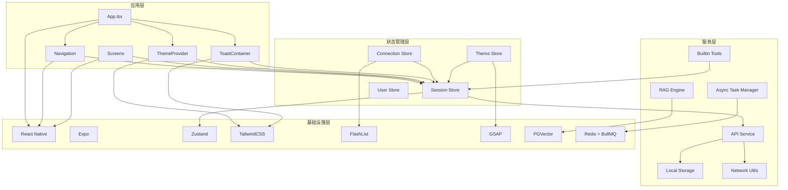

**图表来源**
- [apps/mobile/package.json:12-52](file://apps/mobile/package.json#L12-L52)
- [apps/mobile/src/store/session.ts:9-16](file://apps/mobile/src/store/session.ts#L9-L16)

**章节来源**
- [apps/mobile/package.json:1-60](file://apps/mobile/package.json#L1-L60)

## 故障排除指南

### 常见问题诊断

**网络连接问题**
- 检查 `useConnectionStore` 的连接状态
- 验证服务器 URL 配置
- 确认防火墙和代理设置

**状态同步问题**
- 检查 `useSessionStore` 的数据一致性
- 验证本地存储权限
- 确认 API 响应格式

**UI 渲染问题**
- 检查 TailwindCSS 样式编译
- 验证主题配置正确性
- 确认组件 props 传递

**主题切换问题**
- 检查 `useThemeStore` 的主题状态
- 验证颜色方案配置
- 确认系统主题变化监听

**Toast通知问题**
- 检查 Toast 存储状态
- 验证动画配置
- 确认通知权限

**RAG检索问题**
- 检查PGVector连接状态
- 验证向量嵌入模型配置
- 确认知识库绑定状态

**异步任务问题**
- 检查Redis连接状态
- 验证BullMQ worker运行状态
- 确认任务队列配置

**章节来源**
- [apps/mobile/src/store/connection.ts:23-38](file://apps/mobile/src/store/connection.ts#L23-L38)
- [apps/mobile/src/store/session.ts:48-93](file://apps/mobile/src/store/session.ts#L48-L93)
- [apps/mobile/src/store/theme.ts:77-81](file://apps/mobile/src/store/theme.ts#L77-L81)

### 开发调试技巧

1. **网络请求调试**
   - 使用浏览器开发者工具监控网络请求
   - 检查 tRPC 请求的输入输出
   - 验证 SuperJSON 序列化结果

2. **状态管理调试**
   - 利用 React DevTools 检查组件状态
   - 监控 Zustand store 变化
   - 跟踪异步操作执行流程

3. **样式问题排查**
   - 检查 TailwindCSS 配置文件
   - 验证 NativeWind 集成
   - 确认 CSS 变量定义

4. **主题系统调试**
   - 使用 React DevTools 检查主题状态
   - 监控颜色方案切换
   - 验证主题持久化

5. **工具系统调试**
   - 检查工具注册表配置
   - 验证工具渲染组件
   - 确认工具API调用

6. **RAG系统调试**
   - 检查向量数据库连接
   - 验证检索结果质量
   - 确认上下文注入逻辑

7. **异步系统调试**
   - 监控Redis队列状态
   - 检查BullMQ worker日志
   - 验证任务重试机制

## 结论

LobeHub 移动端应用展现了现代移动端开发的最佳实践：

**架构优势**
- 清晰的分层架构便于维护和扩展
- 现代化技术栈提供良好开发体验
- 原子化样式系统确保设计一致性
- 完整的主题系统支持个性化定制
- 集成RAG支持架构，具备检索增强能力
- 异步基础设施演进，支持可扩展的后台任务

**功能特性**
- 全面的内置工具系统满足多样化需求
- 高效的Toast通知系统提升用户体验
- 优化的列表渲染提供流畅性能
- 灵活的工具注册机制支持扩展
- RAG检索支持移动端知识库选择
- Redis队列提供可靠的异步任务处理

**性能优化**
- 渐进式启动优化用户体验
- FlashList虚拟化提升滚动性能
- GSAP动画库提供流畅过渡
- 高效的状态管理和数据同步
- PGVector向量检索优化
- BullMQ异步任务优化

**开发体验**
- 完善的 TypeScript 支持
- 丰富的 UI 组件库
- 灵活的主题定制能力
- 完整的工具系统架构
- RAG支持的完整实现
- 异步基础设施的现代化演进

**未来发展方向**
- 完成移动端会话级知识库选择入口
- 实现Rerank和混合检索功能
- 完成Agent Eval的异步化改造
- 优化RAG检索质量和性能
- 完善异步任务的可观测性

该架构为移动端应用开发提供了良好的参考模板，开发者可以在此基础上进行功能扩展和性能优化。新增的主题系统、内置工具系统、Toast通知系统、RAG支持架构和异步基础设施演进显著提升了应用的功能性和用户体验，为未来的功能扩展奠定了坚实基础。