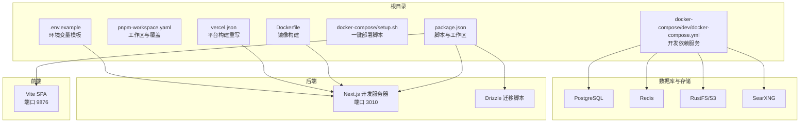
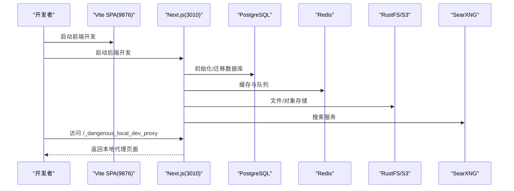
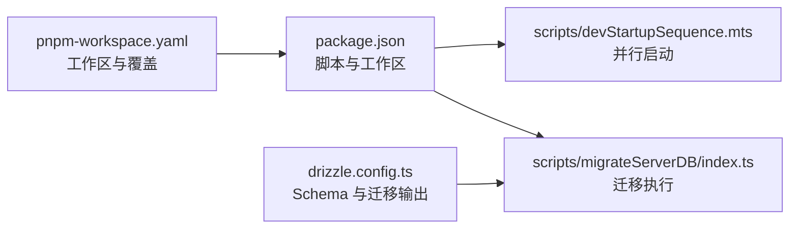

# 快速开始

<cite>
**本文引用的文件**
- [README.md](file://README.md)
- [package.json](file://package.json)
- [pnpm-workspace.yaml](file://pnpm-workspace.yaml)
- [docker-compose/dev/docker-compose.yml](file://docker-compose/dev/docker-compose.yml)
- [docker-compose/setup.sh](file://docker-compose/setup.sh)
- [Dockerfile](file://Dockerfile)
- [vercel.json](file://vercel.json)
- [.env.example](file://.env.example)
- [drizzle.config.ts](file://drizzle.config.ts)
- [scripts/devStartupSequence.mts](file://scripts/devStartupSequence.mts)
- [scripts/migrateServerDB/index.ts](file://scripts/migrateServerDB/index.ts)
- [apps/desktop/Development.md](file://apps/desktop/Development.md)
</cite>

## 目录

1. [简介](#简介)
2. [项目结构](#项目结构)
3. [核心组件](#核心组件)
4. [架构总览](#架构总览)
5. [详细组件分析](#详细组件分析)
6. [依赖关系分析](#依赖关系分析)
7. [性能考虑](#性能考虑)
8. [故障排除指南](#故障排除指南)
9. [结论](#结论)
10. [附录](#附录)

## 简介

本指南面向首次接触 LobeHub 的开发者与运维人员，帮助你在最短时间内完成环境准备、本地开发、数据库初始化、API 密钥配置以及多种部署方式的入门实践。你将获得从零到一的完整路径：从安装依赖、启动开发服务器，到使用 Docker 一键部署、Vercel 一键部署，再到自托管方案的配置要点与常见问题排查。

## 项目结构

LobeHub 采用多包工作区（monorepo）组织，核心由前端 SPA（Vite）、Next.js 后端、数据库迁移与脚本、桌面端（Electron）等组成。根目录提供统一的构建与开发脚本，docker-compose 提供本地开发与生产部署所需的依赖服务（PostgreSQL、Redis、RustFS/S3、SearXNG）。

图表来源

- [package.json](file://package.json#L36-L123)
- [pnpm-workspace.yaml](file://pnpm-workspace.yaml#L1-L23)
- [docker-compose/dev/docker-compose.yml](file://docker-compose/dev/docker-compose.yml#L1-L123)
- [Dockerfile](file://Dockerfile#L104-L153)
- [vercel.json](file://vercel.json#L1-L15)
- [.env.example](file://.env.example#L1-L411)

章节来源

- [README.md](file://README.md#L700-L726)
- [package.json](file://package.json#L36-L123)
- [pnpm-workspace.yaml](file://pnpm-workspace.yaml#L1-L23)

## 核心组件

- 开发脚本与启动序列
  - 根脚本提供一键启动全栈开发（Next.js + Vite SPA），并内置端口解析与健康检查。
  - 参考路径：[scripts/devStartupSequence.mts](file://scripts/devStartupSequence.mts#L119-L134)
- 数据库迁移与 Drizzle
  - 通过 Drizzle Kit 读取 .env 并执行迁移，支持 Neon 与 Node 驱动。
  - 参考路径：[drizzle.config.ts](file://drizzle.config.ts#L1-L22)、[scripts/migrateServerDB/index.ts](file://scripts/migrateServerDB/index.ts#L23-L36)
- Docker 与一键部署
  - Dockerfile 提供多阶段构建与生产镜像；docker-compose 提供开发与部署所需的服务编排；setup.sh 用于交互式生成 .env 与服务配置。
  - 参考路径：[Dockerfile](file://Dockerfile#L104-L153)、[docker-compose/dev/docker-compose.yml](file://docker-compose/dev/docker-compose.yml#L1-L123)、[docker-compose/setup.sh](file://docker-compose/setup.sh#L519-L773)
- 平台部署
  - vercel.json 定义构建命令与重写规则，适配本地调试代理。
  - 参考路径：[vercel.json](file://vercel.json#L1-L15)
- 环境变量
  - .env.example 提供 API Key、数据库、认证、S3、MCP、插件等配置项的完整清单。
  - 参考路径：[.env.example](file://.env.example#L1-L411)

章节来源

- [scripts/devStartupSequence.mts](file://scripts/devStartupSequence.mts#L119-L134)
- [drizzle.config.ts](file://drizzle.config.ts#L1-L22)
- [scripts/migrateServerDB/index.ts](file://scripts/migrateServerDB/index.ts#L23-L36)
- [Dockerfile](file://Dockerfile#L104-L153)
- [docker-compose/dev/docker-compose.yml](file://docker-compose/dev/docker-compose.yml#L1-L123)
- [docker-compose/setup.sh](file://docker-compose/setup.sh#L519-L773)
- [vercel.json](file://vercel.json#L1-L15)
- [.env.example](file://.env.example#L1-L411)

## 架构总览

下图展示了本地开发与生产部署的关键交互：前端 SPA 与 Next.js 后端通过本地端口提供服务；数据库与缓存由 Docker Compose 提供；生产镜像通过 Drizzle 迁移初始化数据库；平台部署（Vercel）通过 vercel.json 重写规则支持本地调试代理。

图表来源

- [scripts/devStartupSequence.mts](file://scripts/devStartupSequence.mts#L119-L134)
- [docker-compose/dev/docker-compose.yml](file://docker-compose/dev/docker-compose.yml#L17-L111)
- [vercel.json](file://vercel.json#L4-L13)

章节来源

- [scripts/devStartupSequence.mts](file://scripts/devStartupSequence.mts#L119-L134)
- [docker-compose/dev/docker-compose.yml](file://docker-compose/dev/docker-compose.yml#L17-L111)
- [vercel.json](file://vercel.json#L4-L13)

## 详细组件分析

### 本地开发环境设置

- 系统要求
  - Node.js 版本与包管理器：参考根 package.json 中的 packageManager 字段与依赖声明。
  - 参考路径：[package.json](file://package.json#L500-L504)
- 安装与启动
  - 安装依赖：使用 pnpm workspace 管理多包依赖。
  - 启动全栈开发：根脚本会同时启动 Next.js 与 Vite SPA，并等待 Next 就绪后预热。
  - 参考路径：[package.json](file://package.json#L60-L68)、[scripts/devStartupSequence.mts](file://scripts/devStartupSequence.mts#L119-L134)
- 本地调试代理
  - 开发脚本会在启动后打印本地代理地址，便于在生产后端上进行 HMR 调试。
  - 参考路径：[README.md](file://README.md#L716-L718)

章节来源

- [package.json](file://package.json#L500-L504)
- [package.json](file://package.json#L60-L68)
- [scripts/devStartupSequence.mts](file://scripts/devStartupSequence.mts#L119-L134)
- [README.md](file://README.md#L716-L718)

### 数据库初始化与迁移

- 环境变量
  - 设置 DATABASE_URL 与 KEY_VAULTS_SECRET，确保迁移脚本可读取。
  - 参考路径：[.env.example](file://.env.example#L379-L384)
- 迁移执行
  - 通过根脚本触发迁移，或直接运行迁移脚本。
  - 参考路径：[package.json](file://package.json#L49)、[scripts/migrateServerDB/index.ts](file://scripts/migrateServerDB/index.ts#L23-L36)
- Drizzle 配置
  - 读取 .env 并指定 schema 与 migrations 输出目录。
  - 参考路径：[drizzle.config.ts](file://drizzle.config.ts#L1-L22)

章节来源

- [.env.example](file://.env.example#L379-L384)
- [package.json](file://package.json#L49)
- [scripts/migrateServerDB/index.ts](file://scripts/migrateServerDB/index.ts#L23-L36)
- [drizzle.config.ts](file://drizzle.config.ts#L1-L22)

### API 密钥与模型配置

- 必填项
  - OPENAI_API_KEY 为必填项，其他模型提供商可按需启用。
  - 参考路径：[README.md](file://README.md#L642-L655)、[.env.example](file://.env.example#L50-L57)
- 模型列表与代理
  - 可通过 OPENAI_MODEL_LIST 与 OPENAI_PROXY_URL 控制可用模型与请求代理。
  - 参考路径：[README.md](file://README.md#L642-L655)、[.env.example](file://.env.example#L56-L57)

章节来源

- [README.md](file://README.md#L642-L655)
- [.env.example](file://.env.example#L50-L57)

### Docker 开发与一键部署

- 开发环境
  - 使用 docker-compose/dev/docker-compose.yml 启动 PostgreSQL、Redis、RustFS、SearXNG。
  - 参考路径：[docker-compose/dev/docker-compose.yml](file://docker-compose/dev/docker-compose.yml#L17-L111)
- 一键部署脚本
  - setup.sh 支持交互式生成 .env、配置域名 / 端口模式、生成安全密钥、初始化数据库等。
  - 参考路径：[docker-compose/setup.sh](file://docker-compose/setup.sh#L519-L773)
- 生产镜像
  - Dockerfile 提供多阶段构建、环境变量注入与生产启动脚本。
  - 参考路径：[Dockerfile](file://Dockerfile#L104-L153)

章节来源

- [docker-compose/dev/docker-compose.yml](file://docker-compose/dev/docker-compose.yml#L17-L111)
- [docker-compose/setup.sh](file://docker-compose/setup.sh#L519-L773)
- [Dockerfile](file://Dockerfile#L104-L153)

### Vercel 一键部署

- 构建与重写
  - vercel.json 指定构建命令与本地调试代理重写规则。
  - 参考路径：[vercel.json](file://vercel.json#L1-L15)
- 环境变量
  - 在平台面板中配置 OPENAI_API_KEY 等必要变量。
  - 参考路径：[README.md](file://README.md#L581-L586)

章节来源

- [vercel.json](file://vercel.json#L1-L15)
- [README.md](file://README.md#L581-L586)

### 自托管方案（桌面端）

- 桌面端架构
  - 主进程与渲染进程通过 IPC 通信，提供菜单、快捷键、系统托盘、自动更新等功能。
  - 参考路径：[apps/desktop/Development.md](file://apps/desktop/Development.md#L497-L533)
- 开发与打包
  - 使用 pnpm workspace 管理桌面端子工程，遵循 Electron IPC 与模块化设计。
  - 参考路径：[apps/desktop/Development.md](file://apps/desktop/Development.md#L1-L110)

章节来源

- [apps/desktop/Development.md](file://apps/desktop/Development.md#L497-L533)
- [apps/desktop/Development.md](file://apps/desktop/Development.md#L1-L110)

## 依赖关系分析

- 包管理与工作区
  - pnpm-workspace.yaml 声明工作区与依赖覆盖，保证版本一致性与补丁应用。
  - 参考路径：[pnpm-workspace.yaml](file://pnpm-workspace.yaml#L1-L23)
- 开发脚本耦合
  - dev 脚本并行启动 Next 与 Vite，Next 就绪后进行预热，避免前端空白。
  - 参考路径：[scripts/devStartupSequence.mts](file://scripts/devStartupSequence.mts#L119-L134)
- 数据库驱动
  - 运行时根据 DATABASE_DRIVER 选择迁移驱动（Neon 或 Node）。
  - 参考路径：[scripts/migrateServerDB/index.ts](file://scripts/migrateServerDB/index.ts#L27-L31)

图表来源

- [package.json](file://package.json#L36-L123)
- [scripts/devStartupSequence.mts](file://scripts/devStartupSequence.mts#L119-L134)
- [scripts/migrateServerDB/index.ts](file://scripts/migrateServerDB/index.ts#L23-L36)
- [pnpm-workspace.yaml](file://pnpm-workspace.yaml#L1-L23)
- [drizzle.config.ts](file://drizzle.config.ts#L1-L22)

章节来源

- [package.json](file://package.json#L36-L123)
- [pnpm-workspace.yaml](file://pnpm-workspace.yaml#L1-L23)
- [scripts/devStartupSequence.mts](file://scripts/devStartupSequence.mts#L119-L134)
- [scripts/migrateServerDB/index.ts](file://scripts/migrateServerDB/index.ts#L23-L36)
- [drizzle.config.ts](file://drizzle.config.ts#L1-L22)

## 性能考虑

- 构建内存与并发
  - Dockerfile 与构建脚本设置了较大的堆内存参数，建议在资源充足的机器上进行构建。
  - 参考路径：[Dockerfile](file://Dockerfile#L68-L69)、[package.json](file://package.json#L38-L44)
- 迁移与数据库
  - 迁移脚本根据驱动选择执行路径，确保在 Neon 与 Node 环境下均能稳定运行。
  - 参考路径：[scripts/migrateServerDB/index.ts](file://scripts/migrateServerDB/index.ts#L27-L31)
- 开发体验
  - devStartupSequence 会等待 Next 就绪并进行一次预热请求，减少首次访问延迟。
  - 参考路径：[scripts/devStartupSequence.mts](file://scripts/devStartupSequence.mts#L60-L91)

章节来源

- [Dockerfile](file://Dockerfile#L68-L69)
- [package.json](file://package.json#L38-L44)
- [scripts/migrateServerDB/index.ts](file://scripts/migrateServerDB/index.ts#L27-L31)
- [scripts/devStartupSequence.mts](file://scripts/devStartupSequence.mts#L60-L91)

## 故障排除指南

- 迁移失败
  - 若提示缺失 vector 扩展，按照提示启用 pgvector；若出现邮箱唯一约束冲突，检查重复邮箱；若初始化异常，参考初始化提示。
  - 参考路径：[scripts/migrateServerDB/index.ts](file://scripts/migrateServerDB/index.ts#L49-L58)
- Docker 权限不足
  - setup.sh 会提示为当前用户授予 Docker 权限，或检查 docker stats 是否可用。
  - 参考路径：[docker-compose/setup.sh](file://docker-compose/setup.sh#L717-L723)
- 本地调试代理
  - 若无法访问代理页面，确认 dev:spa 启动并检查代理重写规则。
  - 参考路径：[README.md](file://README.md#L716-L718)、[vercel.json](file://vercel.json#L4-L13)
- 端口占用
  - 开发与部署涉及多个端口（3210、9000、9001、9876、3010），请确保未被占用。
  - 参考路径：[docker-compose/dev/docker-compose.yml](file://docker-compose/dev/docker-compose.yml#L7-L11)、[docker-compose/setup.sh](file://docker-compose/setup.sh#L286-L286)

章节来源

- [scripts/migrateServerDB/index.ts](file://scripts/migrateServerDB/index.ts#L49-L58)
- [docker-compose/setup.sh](file://docker-compose/setup.sh#L717-L723)
- [README.md](file://README.md#L716-L718)
- [vercel.json](file://vercel.json#L4-L13)
- [docker-compose/dev/docker-compose.yml](file://docker-compose/dev/docker-compose.yml#L7-L11)
- [docker-compose/setup.sh](file://docker-compose/setup.sh#L286-L286)

## 结论

通过本指南，你可以在本地快速完成 LobeHub 的环境搭建与开发启动，理解数据库迁移与 Docker 一键部署的流程，并掌握 Vercel 与自托管的入门要点。遇到问题时，可依据 “故障排除指南” 定位常见错误并快速恢复。

## 附录

- 快速命令清单
  - 安装依赖：使用 pnpm workspace 管理多包依赖。
  - 启动开发：根脚本并行启动 Next 与 Vite。
  - 数据库迁移：设置 DATABASE_URL 后执行迁移脚本。
  - Docker 一键部署：运行 setup.sh 并按提示完成配置。
  - Vercel 部署：在平台面板配置环境变量并触发构建。
- 参考路径
  - [package.json](file://package.json#L36-L123)
  - [scripts/devStartupSequence.mts](file://scripts/devStartupSequence.mts#L119-L134)
  - [scripts/migrateServerDB/index.ts](file://scripts/migrateServerDB/index.ts#L23-L36)
  - [docker-compose/setup.sh](file://docker-compose/setup.sh#L519-L773)
  - [vercel.json](file://vercel.json#L1-L15)
