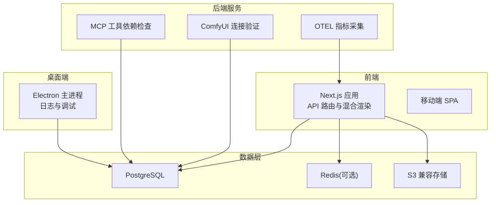
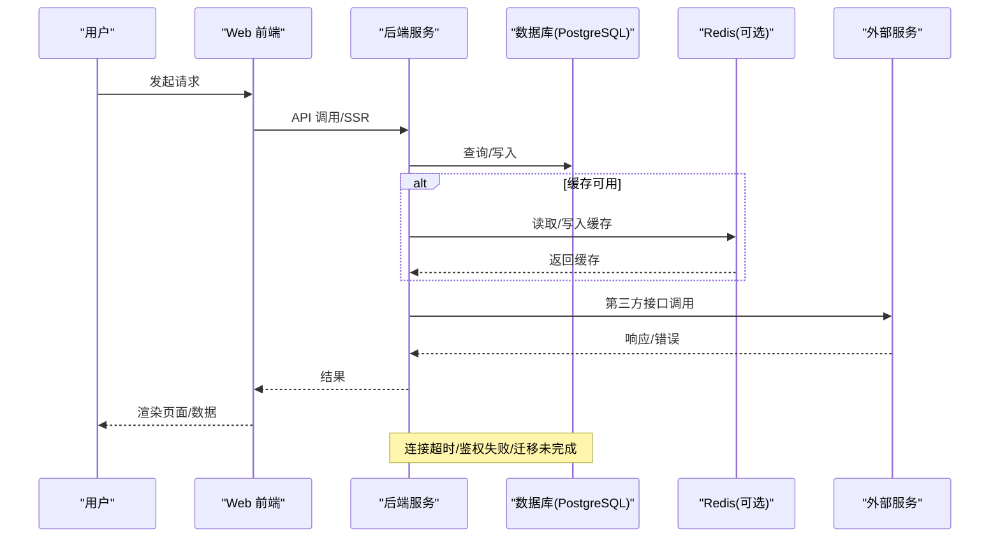
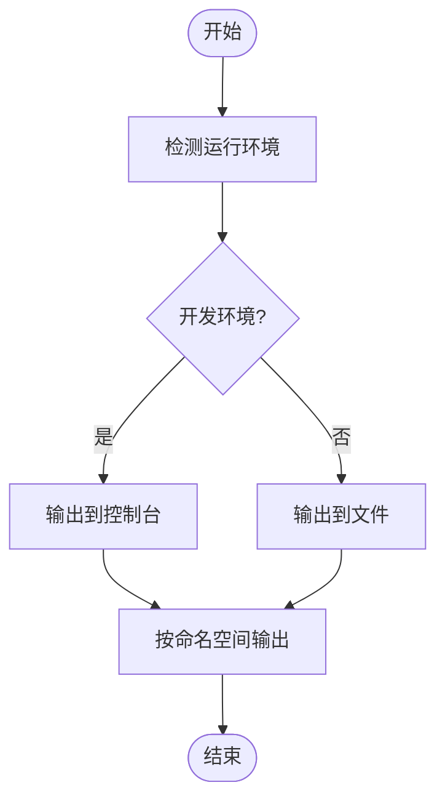
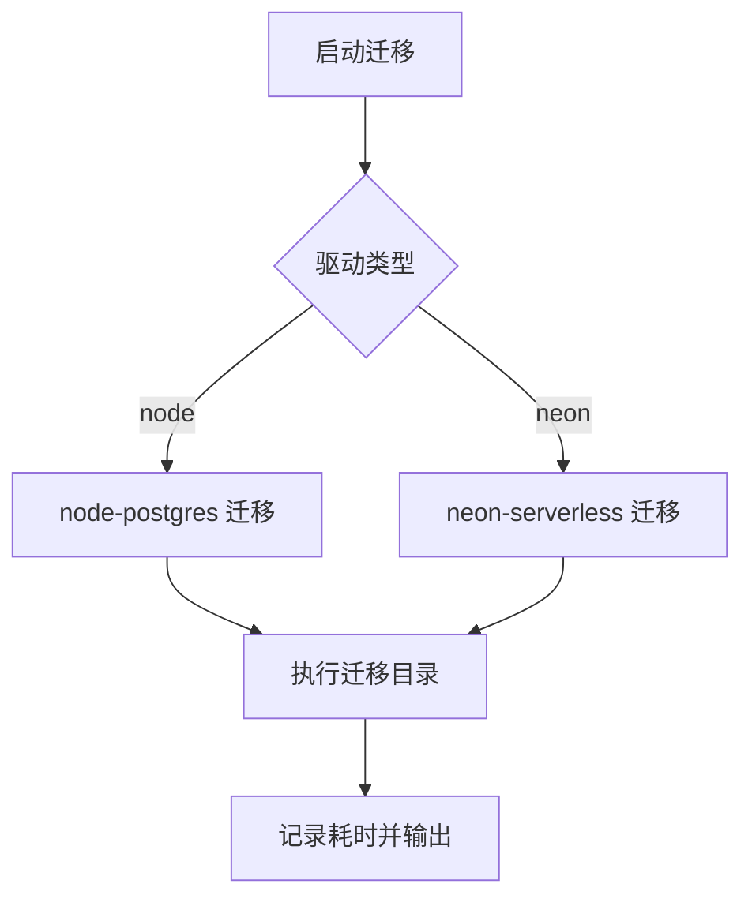
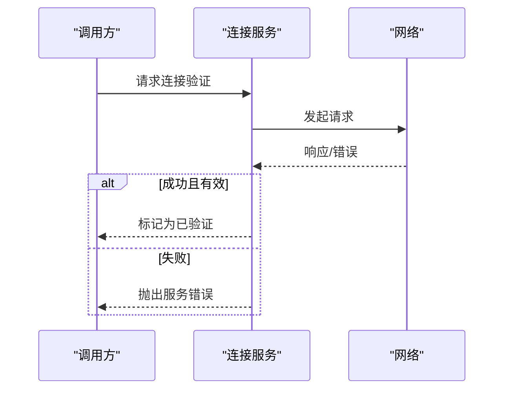
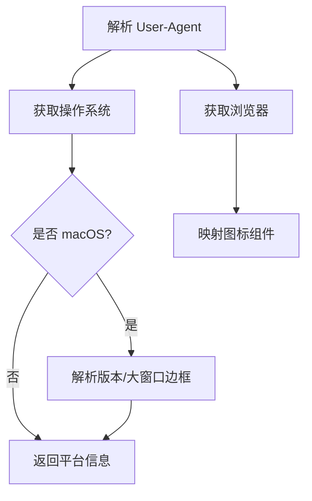
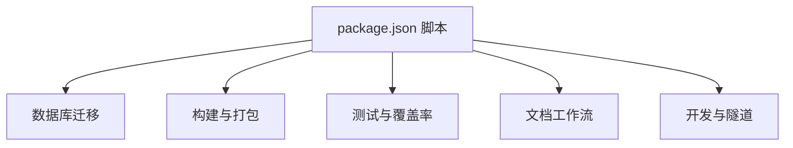

# 故障排除

<cite>
**本文引用的文件**
- [docs/self-hosting/start.mdx](file://docs/self-hosting/start.mdx)
- [docs/self-hosting/environment-variables.mdx](file://docs/self-hosting/environment-variables.mdx)
- [package.json](file://package.json)
- [apps/desktop/src/main/utils/logger.ts](file://apps/desktop/src/main/utils/logger.ts)
- [apps/desktop/src/main/utils/__tests__/logger.test.ts](file://apps/desktop/src/main/utils/__tests__/logger.test.ts)
- [src/libs/mcp/types.ts](file://src/libs/mcp/types.ts)
- [src/server/services/comfyui/__tests__/core/comfyUIConnectionService.test.ts](file://src/server/services/comfyui/__tests__/core/comfyUIConnectionService.test.ts)
- [packages/utils/src/error.ts](file://packages/utils/src/error.ts)
- [packages/web-crawler/src/utils/__tests__/errorType.test.ts](file://packages/web-crawler/src/utils/__tests__/errorType.test.ts)
- [.agents/skills/debug/SKILL.md](file://.agents/skills/debug/SKILL.md)
- [packages/database/src/models/drizzleMigration.ts](file://packages/database/src/models/drizzleMigration.ts)
- [packages/database/src/models/__tests__/drizzleMigration.test.ts](file://packages/database/src/models/__tests__/drizzleMigration.test.ts)
- [scripts/migrateServerDB/index.ts](file://scripts/migrateServerDB/index.ts)
- [src/store/global/selectors/clientDB.ts](file://src/store/global/selectors/clientDB.ts)
- [packages/types/src/clientDB.ts](file://packages/types/src/clientDB.ts)
- [src/store/tool/slices/mcpStore/action.ts](file://src/store/tool/slices/mcpStore/action.ts)
- [src/server/services/mcp/deps/MCPSystemDepsCheckService.test.ts](file://src/server/services/mcp/deps/MCPSystemDepsCheckService.test.ts)
- [packages/utils/src/platform.ts](file://packages/utils/src/platform.ts)
- [src/hooks/usePlatform.ts](file://src/hooks/usePlatform.ts)
- [src/components/BrowserIcon/index.tsx](file://src/components/BrowserIcon/index.tsx)
- [packages/observability-otel/src/trpc/metrics.ts](file://packages/observability-otel/src/trpc/metrics.ts)
- [packages/model-runtime/src/core/streams/protocol.ts](file://packages/model-runtime/src/core/streams/protocol.ts)
- [src/components/DebugNode.tsx](file://src/components/DebugNode.tsx)
- [src/services/debug.ts](file://src/services/debug.ts)
- [packages/utils/src/env.ts](file://packages/utils/src/env.ts)
- [scripts/_shared/checkDeprecatedAuth.js](file://scripts/_shared/checkDeprecatedAuth.js)
</cite>

## 目录
1. [简介](#简介)
2. [项目结构](#项目结构)
3. [核心组件](#核心组件)
4. [架构总览](#架构总览)
5. [详细组件分析](#详细组件分析)
6. [依赖分析](#依赖分析)
7. [性能考虑](#性能考虑)
8. [故障排除指南](#故障排除指南)
9. [结论](#结论)
10. [附录](#附录)

## 简介
本文件面向 LobeHub 用户与开发者，提供系统化的故障排除指南。内容覆盖安装与部署、配置错误、运行时异常、性能问题、网络与数据库连接、第三方服务集成、日志分析与调试工具使用，以及跨平台兼容性问题的诊断与修复方法。目标是帮助用户与开发者快速定位并解决问题。

## 项目结构
LobeHub 采用多应用与多包（monorepo）结构，包含 Web 前端、桌面端应用、移动应用、设备网关、数据库迁移与模型运行时等模块。自托管部署支持多种方式：Docker Compose、Vercel、云平台等；数据库以 PostgreSQL 为主，可选 Redis、S3 兼容存储等。

**图表来源**
- [docs/self-hosting/start.mdx](file://docs/self-hosting/start.mdx#L21-L38)
- [package.json](file://package.json#L158-L403)

**章节来源**
- [docs/self-hosting/start.mdx](file://docs/self-hosting/start.mdx#L1-L152)
- [package.json](file://package.json#L1-L517)

## 核心组件
- 日志与调试：桌面端日志记录器、通用错误提取工具、调试命名空间规范、开发期调试节点。
- 数据库与迁移：Drizzle 迁移模型、客户端数据库加载状态、迁移进度与错误识别。
- 网络与连接：ComfyUI 连接状态缓存与失效、HTTP 错误与 JSON 解析异常处理。
- 平台与兼容性：UA 解析与平台检测、浏览器图标映射、PWA 支持判断。
- 性能可观测：OTEL 指标直方图、流式协议性能指标转换。
- 配置与环境变量：自托管部署与环境变量参考、弃用认证变量检查脚本。

**章节来源**
- [apps/desktop/src/main/utils/logger.ts](file://apps/desktop/src/main/utils/logger.ts#L1-L48)
- [packages/utils/src/error.ts](file://packages/utils/src/error.ts#L1-L67)
- [.agents/skills/debug/SKILL.md](file://.agents/skills/debug/SKILL.md#L1-L67)
- [src/components/DebugNode.tsx](file://src/components/DebugNode.tsx#L1-L21)
- [packages/database/src/models/drizzleMigration.ts](file://packages/database/src/models/drizzleMigration.ts#L1-L38)
- [packages/types/src/clientDB.ts](file://packages/types/src/clientDB.ts#L1-L42)
- [src/store/global/selectors/clientDB.ts](file://src/store/global/selectors/clientDB.ts#L1-L43)
- [src/server/services/comfyui/__tests__/core/comfyUIConnectionService.test.ts](file://src/server/services/comfyui/__tests__/core/comfyUIConnectionService.test.ts#L88-L213)
- [packages/utils/src/platform.ts](file://packages/utils/src/platform.ts#L1-L80)
- [src/hooks/usePlatform.ts](file://src/hooks/usePlatform.ts#L1-L43)
- [packages/observability-otel/src/trpc/metrics.ts](file://packages/observability-otel/src/trpc/metrics.ts#L1-L31)
- [packages/model-runtime/src/core/streams/protocol.ts](file://packages/model-runtime/src/core/streams/protocol.ts#L509-L533)
- [docs/self-hosting/environment-variables.mdx](file://docs/self-hosting/environment-variables.mdx#L1-L95)
- [scripts/_shared/checkDeprecatedAuth.js](file://scripts/_shared/checkDeprecatedAuth.js#L206-L251)

## 架构总览
下图展示从用户请求到数据库与外部服务的关键交互路径，以及常见故障点与恢复策略。

**图表来源**
- [docs/self-hosting/start.mdx](file://docs/self-hosting/start.mdx#L21-L38)
- [package.json](file://package.json#L158-L403)

## 详细组件分析

### 日志与调试
- 桌面端日志：根据环境选择输出到控制台或文件，并提供 debug 命名空间与详细级别控制。
- 通用错误工具：统一提取错误名称、消息、堆栈与原因，便于跨模块一致化处理。
- 调试命名空间：建议按模块/子系统划分命名空间，便于启用/过滤特定日志。
- 开发期调试节点：在开发模式下输出 Suspense 回退状态，辅助定位渲染卡顿。

**图表来源**
- [apps/desktop/src/main/utils/logger.ts](file://apps/desktop/src/main/utils/logger.ts#L1-L48)
- [.agents/skills/debug/SKILL.md](file://.agents/skills/debug/SKILL.md#L36-L55)

**章节来源**
- [apps/desktop/src/main/utils/logger.ts](file://apps/desktop/src/main/utils/logger.ts#L1-L48)
- [packages/utils/src/error.ts](file://packages/utils/src/error.ts#L1-L67)
- [.agents/skills/debug/SKILL.md](file://.agents/skills/debug/SKILL.md#L1-L67)
- [src/components/DebugNode.tsx](file://src/components/DebugNode.tsx#L1-L21)

### 数据库与迁移
- 迁移模型：查询表数量、列出迁移项、获取最新迁移哈希，用于诊断迁移状态。
- 客户端数据库加载阶段：定义初始化、WASM 加载、依赖加载、迁移等阶段与进度回调。
- 迁移状态选择器：将 SQL 列表与数据库记录映射为可显示的状态列表，识别失败迁移。
- 迁移执行脚本：支持 node 与 neon 驱动，按顺序执行迁移并输出耗时。

**图表来源**
- [scripts/migrateServerDB/index.ts](file://scripts/migrateServerDB/index.ts#L23-L33)
- [packages/database/src/models/drizzleMigration.ts](file://packages/database/src/models/drizzleMigration.ts#L1-L38)
- [packages/types/src/clientDB.ts](file://packages/types/src/clientDB.ts#L1-L42)
- [src/store/global/selectors/clientDB.ts](file://src/store/global/selectors/clientDB.ts#L1-L43)

**章节来源**
- [packages/database/src/models/drizzleMigration.ts](file://packages/database/src/models/drizzleMigration.ts#L1-L38)
- [packages/database/src/models/__tests__/drizzleMigration.test.ts](file://packages/database/src/models/__tests__/drizzleMigration.test.ts#L1-L70)
- [packages/types/src/clientDB.ts](file://packages/types/src/clientDB.ts#L1-L42)
- [src/store/global/selectors/clientDB.ts](file://src/store/global/selectors/clientDB.ts#L1-L43)
- [scripts/migrateServerDB/index.ts](file://scripts/migrateServerDB/index.ts#L1-L33)

### 网络与连接
- ComfyUI 连接验证：支持缓存校验结果并在 TTL 后失效，处理 HTTP 错误、JSON 解析异常与网络错误。
- MCP 工具连接合并：根据连接类型（HTTP/STDIO/CLOUD）合并头部/环境变量，必要时提示需要用户配置。
- 弃用认证变量检查：扫描并报告弃用或缺失的认证相关环境变量，指导修复与重新部署。

**图表来源**
- [src/server/services/comfyui/__tests__/core/comfyUIConnectionService.test.ts](file://src/server/services/comfyui/__tests__/core/comfyUIConnectionService.test.ts#L88-L213)
- [src/store/tool/slices/mcpStore/action.ts](file://src/store/tool/slices/mcpStore/action.ts#L422-L457)
- [scripts/_shared/checkDeprecatedAuth.js](file://scripts/_shared/checkDeprecatedAuth.js#L206-L251)

**章节来源**
- [src/server/services/comfyui/__tests__/core/comfyUIConnectionService.test.ts](file://src/server/services/comfyui/__tests__/core/comfyUIConnectionService.test.ts#L88-L213)
- [src/store/tool/slices/mcpStore/action.ts](file://src/store/tool/slices/mcpStore/action.ts#L422-L457)
- [scripts/_shared/checkDeprecatedAuth.js](file://scripts/_shared/checkDeprecatedAuth.js#L206-L251)

### 平台与兼容性
- 平台检测：通过 UA 解析获取浏览器与操作系统，支持 macOS 版本判断与 PWA 支持判定。
- 浏览器图标：根据浏览器名称映射到对应图标组件，便于 UI 展示与兼容性提示。
- 平台 Hook：汇总平台与浏览器信息，提供 PWA 支持能力判断。

**图表来源**
- [packages/utils/src/platform.ts](file://packages/utils/src/platform.ts#L1-L80)
- [src/hooks/usePlatform.ts](file://src/hooks/usePlatform.ts#L1-L43)
- [src/components/BrowserIcon/index.tsx](file://src/components/BrowserIcon/index.tsx#L1-L37)

**章节来源**
- [packages/utils/src/platform.ts](file://packages/utils/src/platform.ts#L1-L80)
- [src/hooks/usePlatform.ts](file://src/hooks/usePlatform.ts#L1-L43)
- [src/components/BrowserIcon/index.tsx](file://src/components/BrowserIcon/index.tsx#L1-L37)

### 性能可观测与指标
- OTEL 指标：RPC 服务器时延、请求/响应大小、每 RPC 的消息数等直方图指标。
- 流式协议性能：将流式数据转换为速度、延迟、TPS、TTFT 等性能指标块。

**图表来源**
- [packages/observability-otel/src/trpc/metrics.ts](file://packages/observability-otel/src/trpc/metrics.ts#L1-L31)
- [packages/model-runtime/src/core/streams/protocol.ts](file://packages/model-runtime/src/core/streams/protocol.ts#L509-L533)

**章节来源**
- [packages/observability-otel/src/trpc/metrics.ts](file://packages/observability-otel/src/trpc/metrics.ts#L1-L31)
- [packages/model-runtime/src/core/streams/protocol.ts](file://packages/model-runtime/src/core/streams/protocol.ts#L509-L533)

## 依赖分析
- 自托管部署与环境变量：文档提供环境变量参考与构建自定义镜像的方法。
- 依赖脚本：包含数据库迁移、构建、测试、文档工作流等常用命令。

**图表来源**
- [package.json](file://package.json#L36-L123)
- [docs/self-hosting/environment-variables.mdx](file://docs/self-hosting/environment-variables.mdx#L1-L95)

**章节来源**
- [package.json](file://package.json#L36-L123)
- [docs/self-hosting/environment-variables.mdx](file://docs/self-hosting/environment-variables.mdx#L1-L95)

## 性能考虑
- 内存与 GC：避免不必要的数组复制与对象深拷贝，优先使用不可变更新策略。
- 并发与限流：对第三方接口调用增加重试与超时控制，限制并发度防止资源争用。
- 缓存策略：合理利用 Redis 缓存热点数据，设置合理的过期时间与失效策略。
- 观测与告警：开启 OTEL 指标与日志，监控关键指标阈值并建立告警。
- 前端性能：动态加载移动端组件、减少首屏 JS、使用骨架屏与懒加载。

[本节为通用指导，无需“章节来源”]

## 故障排除指南

### 安装与部署问题
- Docker Compose 部署失败
  - 症状：容器启动报错或无法访问
  - 排查步骤：
    - 检查依赖服务（PostgreSQL、Redis、RustFS/Searxng）是否正常启动
    - 查看容器日志与网络连通性
    - 确认端口占用与防火墙规则
  - 参考文档：自托管部署与特性对比
- Vercel 部署受限
  - 症状：函数超时、无 WebSocket 支持
  - 排查步骤：
    - 使用外部 PostgreSQL 数据库
    - 关注 10 秒函数超时限制
  - 参考文档：部署平台特性对比

**章节来源**
- [docs/self-hosting/start.mdx](file://docs/self-hosting/start.mdx#L39-L92)

### 配置错误
- 环境变量缺失或弃用
  - 症状：鉴权失败、功能异常
  - 排查步骤：
    - 使用弃用检查脚本识别缺失或弃用变量
    - 按文档补充/替换为推荐变量
  - 参考脚本：弃用认证变量检查

**章节来源**
- [scripts/_shared/checkDeprecatedAuth.js](file://scripts/_shared/checkDeprecatedAuth.js#L206-L251)
- [docs/self-hosting/environment-variables.mdx](file://docs/self-hosting/environment-variables.mdx#L1-L95)

### 运行时异常
- 数据库迁移失败
  - 症状：页面白屏、功能不可用
  - 排查步骤：
    - 执行迁移脚本确认驱动类型与目录
    - 检查迁移状态选择器中的错误项
    - 对比最新迁移哈希与数据库记录
  - 参考实现：迁移模型与状态选择器

**章节来源**
- [scripts/migrateServerDB/index.ts](file://scripts/migrateServerDB/index.ts#L23-L33)
- [packages/database/src/models/drizzleMigration.ts](file://packages/database/src/models/drizzleMigration.ts#L1-L38)
- [src/store/global/selectors/clientDB.ts](file://src/store/global/selectors/clientDB.ts#L1-L43)

- ComfyUI 连接异常
  - 症状：连接超时、鉴权失败、JSON 解析错误
  - 排查步骤：
    - 检查连接缓存与 TTL 设置
    - 处理 HTTP 错误码与网络异常
    - 验证鉴权头与基础 URL 正确性
  - 参考测试：连接验证行为

**章节来源**
- [src/server/services/comfyui/__tests__/core/comfyUIConnectionService.test.ts](file://src/server/services/comfyui/__tests__/core/comfyUIConnectionService.test.ts#L88-L213)

- MCP 工具配置缺失
  - 症状：安装暂停、提示需要用户配置
  - 排查步骤：
    - 检查部署选项中的配置 Schema
    - 合并 HTTP/STDIO/Cloud 头部与环境变量
  - 参考实现：MCP 连接合并逻辑

**章节来源**
- [src/store/tool/slices/mcpStore/action.ts](file://src/store/tool/slices/mcpStore/action.ts#L422-L457)
- [src/server/services/mcp/deps/MCPSystemDepsCheckService.test.ts](file://src/server/services/mcp/deps/MCPSystemDepsCheckService.test.ts#L379-L465)

### 网络与第三方服务
- 网络连接错误
  - 症状：超时、连接中断
  - 排查步骤：
    - 区分超时与连接错误，检查网络与代理
    - 对第三方接口增加重试与熔断
  - 参考测试：错误类型定义

**章节来源**
- [packages/web-crawler/src/utils/__tests__/errorType.test.ts](file://packages/web-crawler/src/utils/__tests__/errorType.test.ts#L85-L260)

### 数据库连接问题
- PostgreSQL 连接失败
  - 症状：迁移失败、查询超时
  - 排查步骤：
    - 检查连接字符串、凭据与网络可达性
    - 确认数据库版本与驱动兼容性
  - 参考实现：迁移脚本与模型

**章节来源**
- [scripts/migrateServerDB/index.ts](file://scripts/migrateServerDB/index.ts#L23-L33)
- [packages/database/src/models/drizzleMigration.ts](file://packages/database/src/models/drizzleMigration.ts#L1-L38)

### 日志分析与调试
- 启用调试输出
  - 浏览器：localStorage.debug 或 URL 参数
  - Node/Electron：DEBUG 环境变量
- 桌面端日志
  - 生产环境输出到文件，开发环境输出到控制台
  - 使用命名空间区分模块日志

**章节来源**
- [.agents/skills/debug/SKILL.md](file://.agents/skills/debug/SKILL.md#L36-L55)
- [apps/desktop/src/main/utils/logger.ts](file://apps/desktop/src/main/utils/logger.ts#L1-L48)

### 兼容性问题
- 浏览器差异
  - 检测浏览器与操作系统，针对 Safari/macOS 版本差异调整 UI 行为
  - PWA 支持判断与安装条件
- 设备与屏幕
  - 使用移动端动态加载与响应式布局组件

**章节来源**
- [packages/utils/src/platform.ts](file://packages/utils/src/platform.ts#L1-L80)
- [src/hooks/usePlatform.ts](file://src/hooks/usePlatform.ts#L1-L43)
- [src/components/BrowserIcon/index.tsx](file://src/components/BrowserIcon/index.tsx#L1-L37)
- [src/components/client/ClientResponsiveContent/index.tsx](file://src/components/client/ClientResponsiveContent/index.tsx#L1-L33)
- [src/components/client/ClientResponsiveLayout.tsx](file://src/components/client/ClientResponsiveLayout.tsx#L1-L33)

### 性能瓶颈排查
- 指标监控
  - 启用 OTEL 指标，关注 RPC 时延与吞吐
- 流式性能
  - 检查 TTFT、TPS、延迟与吞吐转换逻辑
- 前端性能
  - 动态加载、骨架屏、懒加载与组件拆分

**章节来源**
- [packages/observability-otel/src/trpc/metrics.ts](file://packages/observability-otel/src/trpc/metrics.ts#L1-L31)
- [packages/model-runtime/src/core/streams/protocol.ts](file://packages/model-runtime/src/core/streams/protocol.ts#L509-L533)

## 结论
通过系统化的日志与调试、完善的数据库迁移与状态监控、严格的网络与第三方服务连接验证、以及跨平台兼容性检测，LobeHub 能够在复杂环境中稳定运行。建议在生产环境中开启详尽的日志与指标监控，并定期进行迁移与配置审计，以降低故障率并提升用户体验。

## 附录
- 常用命令与脚本
  - 数据库迁移：根据驱动类型执行迁移
  - 构建与测试：按需执行构建、测试与覆盖率
  - 文档与工作流：自动化生成与校验

**章节来源**
- [package.json](file://package.json#L36-L123)