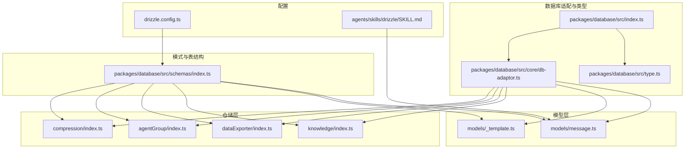
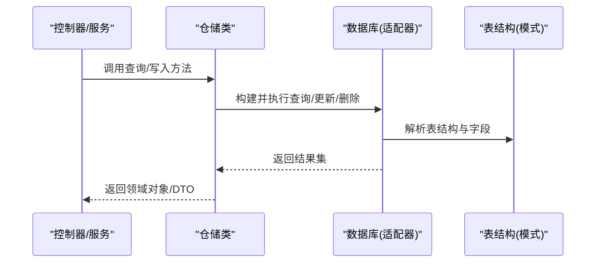
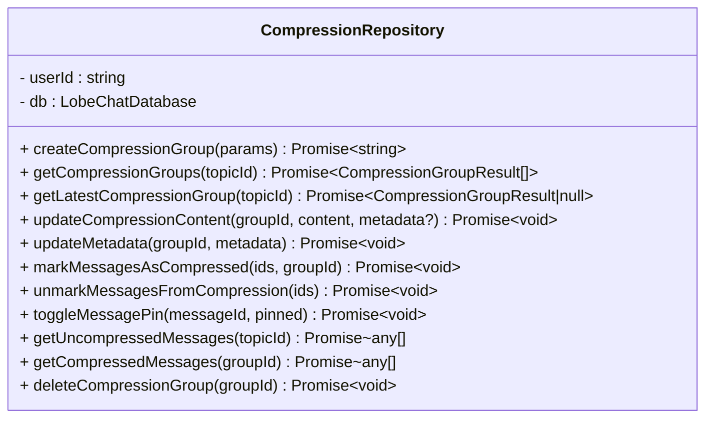
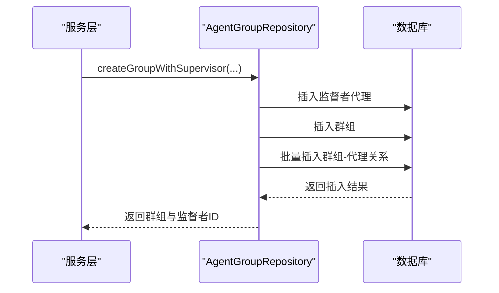
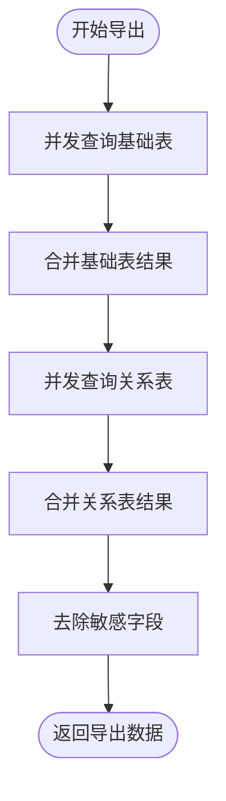
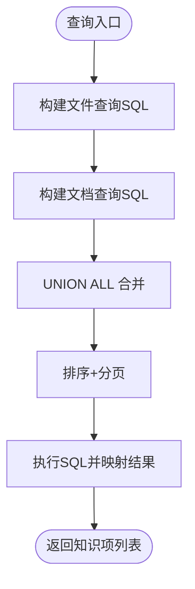
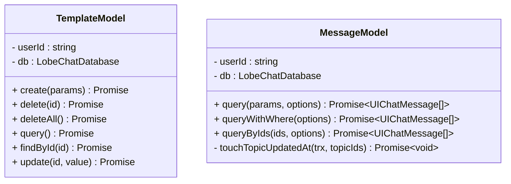
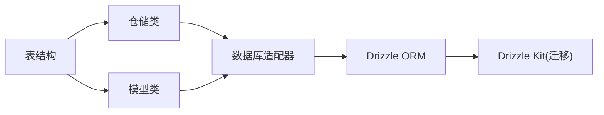

# 仓储模式

<cite>
**本文引用的文件**
- [packages/database/src/index.ts](file://packages/database/src/index.ts)
- [packages/database/src/core/db-adaptor.ts](file://packages/database/src/core/db-adaptor.ts)
- [packages/database/src/type.ts](file://packages/database/src/type.ts)
- [packages/database/src/schemas/index.ts](file://packages/database/src/schemas/index.ts)
- [packages/database/src/repositories/compression/index.ts](file://packages/database/src/repositories/compression/index.ts)
- [packages/database/src/repositories/agentGroup/index.ts](file://packages/database/src/repositories/agentGroup/index.ts)
- [packages/database/src/repositories/dataExporter/index.ts](file://packages/database/src/repositories/dataExporter/index.ts)
- [packages/database/src/repositories/knowledge/index.ts](file://packages/database/src/repositories/knowledge/index.ts)
- [packages/database/src/models/_template.ts](file://packages/database/src/models/_template.ts)
- [packages/database/src/models/message.ts](file://packages/database/src/models/message.ts)
- [drizzle.config.ts](file://drizzle.config.ts)
- [.agents/skills/drizzle/SKILL.md](file://.agents/skills/drizzle/SKILL.md)
</cite>

## 目录
1. [引言](#引言)
2. [项目结构](#项目结构)
3. [核心组件](#核心组件)
4. [架构总览](#架构总览)
5. [详细组件分析](#详细组件分析)
6. [依赖分析](#依赖分析)
7. [性能考量](#性能考量)
8. [故障排查指南](#故障排查指南)
9. [结论](#结论)
10. [附录](#附录)

## 引言
本文件系统化阐述 LobeHub 项目中的仓储模式（Repository Pattern）设计与实现，聚焦于数据库访问层的抽象、业务逻辑与数据访问的分离、查询构建与事务管理策略，并结合仓库内现有仓储类与模型类给出可操作的最佳实践与性能优化建议。通过统一的数据库适配器与类型约束，仓储层屏蔽底层驱动差异，使上层服务与控制器仅面向领域对象与查询契约进行交互。

## 项目结构
仓储与数据访问相关的核心目录与文件如下：
- 数据库适配与入口导出：packages/database/src/index.ts、packages/database/src/core/db-adaptor.ts、packages/database/src/type.ts
- 模式与表结构：packages/database/src/schemas/index.ts
- 仓储实现：packages/database/src/repositories/*
- 模型实现：packages/database/src/models/*
- 配置与风格指南：drizzle.config.ts、.agents/skills/drizzle/SKILL.md

图表来源
- [packages/database/src/index.ts](file://packages/database/src/index.ts#L1-L5)
- [packages/database/src/core/db-adaptor.ts](file://packages/database/src/core/db-adaptor.ts#L1-L25)
- [packages/database/src/type.ts](file://packages/database/src/type.ts#L1-L10)
- [packages/database/src/schemas/index.ts](file://packages/database/src/schemas/index.ts#L1-L24)
- [packages/database/src/repositories/compression/index.ts](file://packages/database/src/repositories/compression/index.ts#L1-L244)
- [packages/database/src/repositories/agentGroup/index.ts](file://packages/database/src/repositories/agentGroup/index.ts#L1-L473)
- [packages/database/src/repositories/dataExporter/index.ts](file://packages/database/src/repositories/dataExporter/index.ts#L1-L216)
- [packages/database/src/repositories/knowledge/index.ts](file://packages/database/src/repositories/knowledge/index.ts#L1-L646)
- [packages/database/src/models/_template.ts](file://packages/database/src/models/_template.ts#L1-L55)
- [packages/database/src/models/message.ts](file://packages/database/src/models/message.ts#L1-L800)
- [drizzle.config.ts](file://drizzle.config.ts#L1-L21)
- [.agents/skills/drizzle/SKILL.md](file://.agents/skills/drizzle/SKILL.md#L70-L139)

章节来源
- [packages/database/src/index.ts](file://packages/database/src/index.ts#L1-L5)
- [packages/database/src/core/db-adaptor.ts](file://packages/database/src/core/db-adaptor.ts#L1-L25)
- [packages/database/src/type.ts](file://packages/database/src/type.ts#L1-L10)
- [packages/database/src/schemas/index.ts](file://packages/database/src/schemas/index.ts#L1-L24)
- [drizzle.config.ts](file://drizzle.config.ts#L1-L21)
- [.agents/skills/drizzle/SKILL.md](file://.agents/skills/drizzle/SKILL.md#L70-L139)

## 核心组件
- 数据库适配器与懒加载实例
  - 通过统一入口导出数据库实例与工具，避免重复初始化与模块副作用。
  - 提供懒加载与错误兜底，确保服务端环境稳定可用。
- 类型约束与事务参数
  - 使用强类型数据库连接与事务参数，保证仓储与模型层调用的安全性与一致性。
- 模式索引与表结构
  - 统一导出各表结构，便于仓储与模型按需引用，降低耦合度。

章节来源
- [packages/database/src/index.ts](file://packages/database/src/index.ts#L1-L5)
- [packages/database/src/core/db-adaptor.ts](file://packages/database/src/core/db-adaptor.ts#L1-L25)
- [packages/database/src/type.ts](file://packages/database/src/type.ts#L1-L10)
- [packages/database/src/schemas/index.ts](file://packages/database/src/schemas/index.ts#L1-L24)

## 架构总览
仓储层围绕“用户维度 + 表结构 + 查询构建”展开，典型流程：
- 控制器/服务层通过仓储类发起查询或写入请求
- 仓储类基于 Drizzle 的查询构建器执行 SQL，返回领域对象或 DTO
- 对于复杂业务，仓储内部使用事务包裹多表写入，确保一致性
- 模型层提供更细粒度的数据模型封装与关系查询，服务于特定领域

图表来源
- [packages/database/src/core/db-adaptor.ts](file://packages/database/src/core/db-adaptor.ts#L1-L25)
- [packages/database/src/schemas/index.ts](file://packages/database/src/schemas/index.ts#L1-L24)
- [packages/database/src/repositories/compression/index.ts](file://packages/database/src/repositories/compression/index.ts#L1-L244)
- [packages/database/src/repositories/agentGroup/index.ts](file://packages/database/src/repositories/agentGroup/index.ts#L1-L473)
- [packages/database/src/repositories/dataExporter/index.ts](file://packages/database/src/repositories/dataExporter/index.ts#L1-L216)
- [packages/database/src/repositories/knowledge/index.ts](file://packages/database/src/repositories/knowledge/index.ts#L1-L646)

## 详细组件分析

### 压缩消息仓储（CompressionRepository）
- 职责边界
  - 管理消息压缩组的创建、查询、更新与删除
  - 将消息标记到压缩组或从压缩组移除
  - 支持元数据合并与 UI 状态更新
- 关键方法
  - 创建压缩组并关联消息
  - 查询主题下所有压缩组
  - 获取最新压缩组
  - 更新内容与元数据
  - 标记/取消标记消息为压缩
  - 获取未压缩消息与某压缩组内的压缩消息
  - 删除压缩组并解除关联
- 事务与一致性
  - 写入与更新均基于单库连接，保证原子性；如需跨表一致性，可在上层调用处使用事务包装
- 复杂查询
  - 使用条件组合与空值判断，确保仅对当前用户生效
- 性能要点
  - 批量标记/取消标记使用 inArray 条件，减少往返
  - 元数据更新采用先读再合并，避免覆盖

图表来源
- [packages/database/src/repositories/compression/index.ts](file://packages/database/src/repositories/compression/index.ts#L1-L244)

章节来源
- [packages/database/src/repositories/compression/index.ts](file://packages/database/src/repositories/compression/index.ts#L1-L244)

### 代理群组仓储（AgentGroupRepository）
- 职责边界
  - 提供聊天群组详情查询，自动补齐虚拟监督者代理
  - 创建带监督者的群组并维护成员关系
  - 移除成员前检查是否为虚拟代理，支持批量删除
  - 复制群组（含监督者与成员），区分虚拟成员复制与非虚拟成员复用
- 事务与一致性
  - 复制群组使用事务包裹，确保原子性
- 复杂查询
  - 使用内连接与条件组合，返回带角色信息的成员列表
- 性能要点
  - 批量删除与插入使用 inArray 与批量插入，减少往返
  - 虚拟代理直接删除，避免级联清理开销

图表来源
- [packages/database/src/repositories/agentGroup/index.ts](file://packages/database/src/repositories/agentGroup/index.ts#L159-L220)

章节来源
- [packages/database/src/repositories/agentGroup/index.ts](file://packages/database/src/repositories/agentGroup/index.ts#L1-L473)

### 数据导出仓储（DataExporterRepos）
- 职责边界
  - 基于配置导出用户相关数据，支持基础表与关系表分层查询
  - 自动去除敏感字段（如 userId），并按依赖顺序并发查询
- 复杂查询
  - 动态拼接 where 条件，支持多表关联过滤
  - 并发控制与错误降级，避免单点失败阻塞整体导出
- 性能要点
  - 分阶段并发查询，先基础表后关系表，减少无效查询
  - 严格按依赖关系跳过无数据的表，降低 IO

图表来源
- [packages/database/src/repositories/dataExporter/index.ts](file://packages/database/src/repositories/dataExporter/index.ts#L167-L214)

章节来源
- [packages/database/src/repositories/dataExporter/index.ts](file://packages/database/src/repositories/dataExporter/index.ts#L1-L216)

### 知识库仓储（KnowledgeRepo）
- 职责边界
  - 统一查询文件与文档两类资源，支持分类、搜索、知识库过滤、排序与分页
  - 提供最近更新项查询、批量删除、按 ID 查找等能力
- 复杂查询
  - 使用原生 SQL 组合文件与文档查询，通过 UNION ALL 合并并排序
  - 知识库过滤通过中间表关联，文档过滤通过字段与来源类型控制
- 性能要点
  - 使用 LEFT JOIN 与 COALESCE 合并字段，避免多次往返
  - 分页与排序在最终 SQL 中完成，减少内存处理

图表来源
- [packages/database/src/repositories/knowledge/index.ts](file://packages/database/src/repositories/knowledge/index.ts#L51-L154)

章节来源
- [packages/database/src/repositories/knowledge/index.ts](file://packages/database/src/repositories/knowledge/index.ts#L1-L646)

### 模板模型（TemplateModel）与消息模型（MessageModel）
- 模板模型
  - 展示仓储层最小实现：增删改查与排序，强调用户维度过滤与返回结构
- 消息模型
  - 高度复杂的查询与关系拼装：支持会话/话题/线程/分组等多维过滤
  - 通过并行查询聚合文件、插件、翻译、TTS、向量片段、任务线程等关系
  - 提供分页与时间窗口下的消息组节点（压缩/对比）拼装
  - 提供事务辅助方法以触达话题更新时间等跨表操作

图表来源
- [packages/database/src/models/_template.ts](file://packages/database/src/models/_template.ts#L1-L55)
- [packages/database/src/models/message.ts](file://packages/database/src/models/message.ts#L97-L530)

章节来源
- [packages/database/src/models/_template.ts](file://packages/database/src/models/_template.ts#L1-L55)
- [packages/database/src/models/message.ts](file://packages/database/src/models/message.ts#L1-L800)

## 依赖分析
- 仓储与模型的耦合
  - 仓储类直接依赖表结构与 Drizzle 查询构建器，模型类进一步封装关系查询与转换
  - 两者均通过数据库适配器获取连接，保持一致的类型约束
- 外部依赖
  - Drizzle ORM 作为查询构建与执行层
  - Drizzle Kit 用于迁移与 schema 管理
- 风格与规范
  - 团队技能文档强调优先使用显式 select + leftJoin，避免关系 API 的复杂 lateral join

图表来源
- [packages/database/src/core/db-adaptor.ts](file://packages/database/src/core/db-adaptor.ts#L1-L25)
- [packages/database/src/schemas/index.ts](file://packages/database/src/schemas/index.ts#L1-L24)
- [drizzle.config.ts](file://drizzle.config.ts#L1-L21)
- [.agents/skills/drizzle/SKILL.md](file://.agents/skills/drizzle/SKILL.md#L118-L139)

章节来源
- [packages/database/src/core/db-adaptor.ts](file://packages/database/src/core/db-adaptor.ts#L1-L25)
- [packages/database/src/schemas/index.ts](file://packages/database/src/schemas/index.ts#L1-L24)
- [drizzle.config.ts](file://drizzle.config.ts#L1-L21)
- [.agents/skills/drizzle/SKILL.md](file://.agents/skills/drizzle/SKILL.md#L118-L139)

## 性能考量
- 查询构建
  - 显式 select + leftJoin 更可控且易调试，避免关系 API 的复杂 lateral join
  - 使用 inArray 批量条件，减少多次往返
- 并发与分页
  - 导出仓储采用并发查询与分阶段依赖，提升吞吐
  - 消息模型在分页时对消息组节点采用时间窗口过滤，避免重复与溢出
- 字段与 JSONB
  - 对 JSONB 字段进行字符串解析与回填，注意异常兜底与空值处理
- 事务
  - 复制群组等多步写入使用事务，确保一致性

章节来源
- [.agents/skills/drizzle/SKILL.md](file://.agents/skills/drizzle/SKILL.md#L118-L139)
- [packages/database/src/repositories/dataExporter/index.ts](file://packages/database/src/repositories/dataExporter/index.ts#L167-L214)
- [packages/database/src/repositories/agentGroup/index.ts](file://packages/database/src/repositories/agentGroup/index.ts#L363-L470)
- [packages/database/src/repositories/knowledge/index.ts](file://packages/database/src/repositories/knowledge/index.ts#L103-L153)

## 故障排查指南
- 数据库连接与初始化
  - 若懒加载失败，检查数据库适配器初始化与环境变量配置
- 权限与用户隔离
  - 所有查询均带有 userId 过滤，若返回为空，确认当前用户上下文与传参
- 复杂查询报错
  - 检查条件组合与表别名，确保字段引用正确
  - 对 JSONB 字段解析失败时，关注字符串格式与异常日志
- 导出失败
  - 关注依赖表是否有数据，必要时调整并发或分批导出
- 事务问题
  - 确认事务包裹范围与回滚路径，避免部分写入导致不一致

章节来源
- [packages/database/src/core/db-adaptor.ts](file://packages/database/src/core/db-adaptor.ts#L1-L25)
- [packages/database/src/repositories/knowledge/index.ts](file://packages/database/src/repositories/knowledge/index.ts#L112-L151)
- [packages/database/src/repositories/dataExporter/index.ts](file://packages/database/src/repositories/dataExporter/index.ts#L104-L141)

## 结论
LobeHub 的仓储模式通过“数据库适配器 + 强类型 + 显式查询构建”的组合，实现了清晰的职责划分与良好的可维护性。仓储层专注于数据访问与业务边界，模型层负责复杂关系与转换，二者共同支撑高并发与复杂查询场景。遵循团队的查询风格指南与事务策略，有助于在保证性能的同时提升稳定性与可测性。

## 附录
- 使用示例（路径指引）
  - 创建压缩组：[createCompressionGroup](file://packages/database/src/repositories/compression/index.ts#L43-L70)
  - 查询群组详情与监督者：[findByIdWithAgents](file://packages/database/src/repositories/agentGroup/index.ts#L68-L148)
  - 导出用户数据：[export](file://packages/database/src/repositories/dataExporter/index.ts#L167-L214)
  - 统一知识查询（文件+文档）：[query](file://packages/database/src/repositories/knowledge/index.ts#L51-L154)
  - 高级消息查询（含关系聚合）：[queryWithWhere](file://packages/database/src/models/message.ts#L210-L530)
- 最佳实践
  - 优先使用显式 select + leftJoin，避免关系 API
  - 用户维度过滤必须显式加入
  - 批量操作使用 inArray，减少往返
  - 复杂写入使用事务包裹
- 扩展方法
  - 新增仓储：在 repositories 下新建目录与类，遵循现有命名与导出约定
  - 新增模型：在 models 下新增类，复用模板类的 CRUD 模式
- 测试策略
  - 仓储类：针对关键查询与事务路径编写单元测试，覆盖边界与异常
  - 模型类：重点验证关系聚合与转换逻辑，确保输出结构稳定