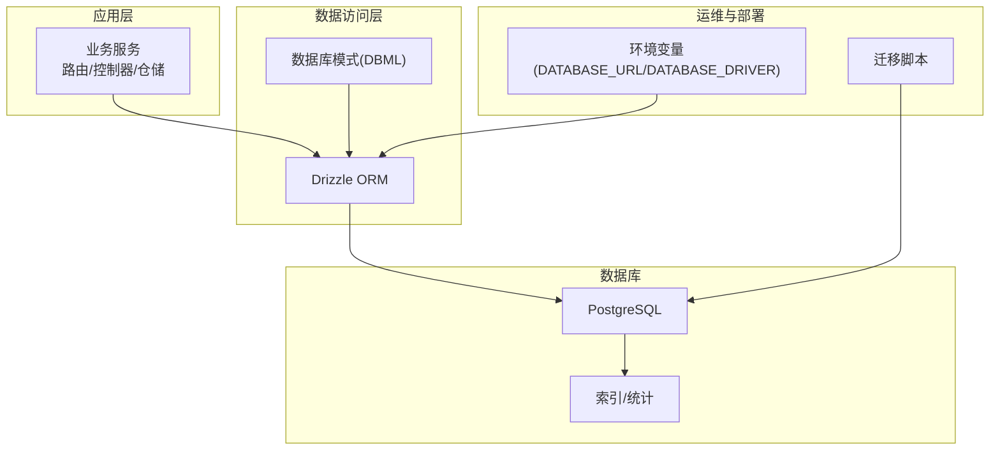
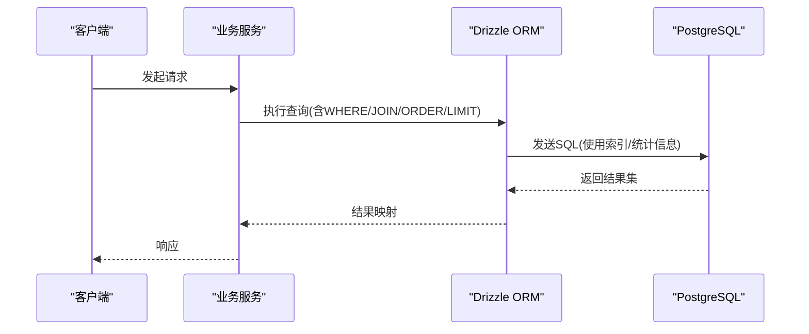
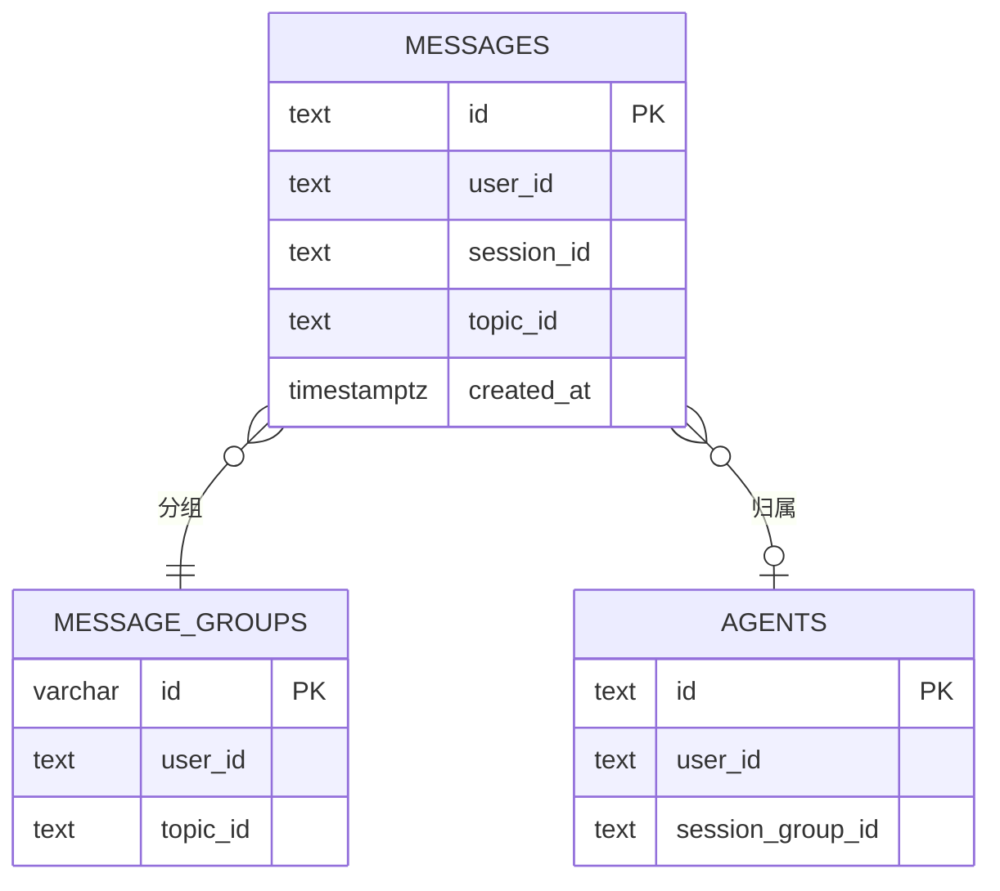
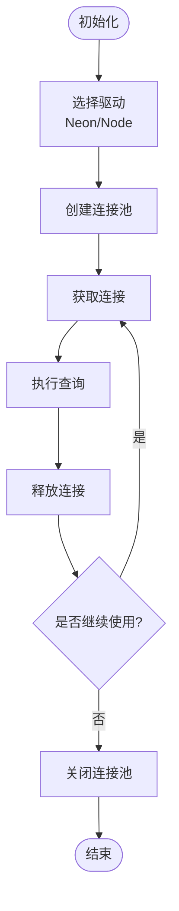
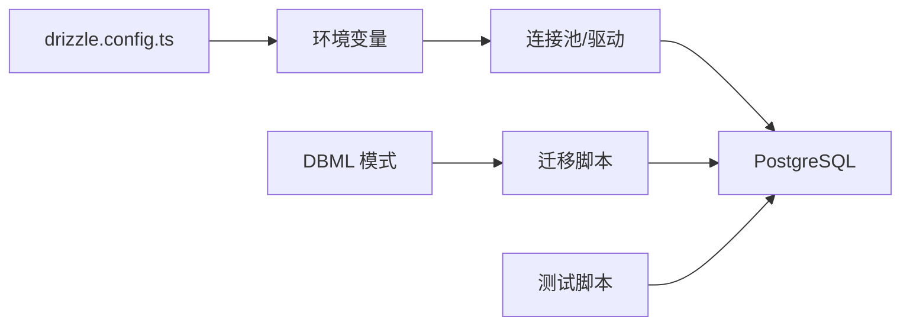

# 性能优化

<cite>
**本文引用的文件**
- [drizzle.config.ts](file://drizzle.config.ts)
- [database-schema.dbml](file://docs/development/database-schema.dbml)
- [packages/database/src/index.ts](file://packages/database/src/index.ts)
- [scripts/clerk-to-betterauth/_internal/db.ts](file://scripts/clerk-to-betterauth/_internal/db.ts)
- [scripts/nextauth-to-betterauth/_internal/db.ts](file://scripts/nextauth-to-betterauth/_internal/db.ts)
- [scripts/setup-test-postgres-db.sh](file://scripts/setup-test-postgres-db.sh)
- [docs/self-hosting/platform/vercel.mdx](file://docs/self-hosting/platform/vercel.mdx)
- [packages/database/migrations/0000_init.sql](file://packages/database/migrations/0000_init.sql)
- [packages/database/migrations/0016_add_message_index.sql](file://packages/database/migrations/0016_add_message_index.sql)
- [packages/database/migrations/0026_add_autovacuum_tuning.sql](file://packages/database/migrations/0026_add_autovacuum_tuning.sql)
- [packages/database/migrations/0061_add_document_and_memory_index.sql](file://packages/database/migrations/0061_add_document_and_memory_index.sql)
- [packages/database/migrations/0062_add_more_index.sql](file://packages/database/migrations/0062_add_more_index.sql)
- [packages/database/migrations/0063_add_columns_for_several_tables.sql](file://packages/database/migrations/0063_add_columns_for_several_tables.sql)
- [packages/database/migrations/0064_add_agents_session_group_id.sql](file://packages/database/migrations/0064_add_agents_session_group_id.sql)
- [packages/database/migrations/0065_add_passkey.sql](file://packages/database/migrations/0065_add_passkey.sql)
- [packages/database/migrations/0067_add_agent_cron_tables.sql](file://packages/database/migrations/0067_add_agent_cron_tables.sql)
- [packages/database/migrations/0070_add_user_memory_activities.sql](file://packages/database/migrations/0070_add_user_memory_activities.sql)
- [packages/database/migrations/0071_add_async_task_extend.sql](file://packages/database/migrations/0071_add_async_task_extend.sql)
- [packages/database/migrations/0074_add_fk_indexes_for_cascade_delete.sql](file://packages/database/migrations/0074_add_fk_indexes_for_cascade_delete.sql)
- [packages/database/migrations/0076_add_message_group_index.sql](file://packages/database/migrations/0076_add_message_group_index.sql)
- [packages/database/migrations/0077_add_agent_skills.sql](file://packages/database/migrations/0077_add_agent_skills.sql)
- [packages/database/migrations/0087_add_eval_benchmark.sql](file://packages/database/migrations/0087_add_eval_benchmark.sql)
- [packages/database/migrations/0089_add_api_key_hash.sql](file://packages/database/migrations/0089_add_api_key_hash.sql)
- [packages/database/migrations/0090_enable_pg_search.sql](file://packages/database/migrations/0090_enable_pg_search.sql)
- [packages/database/migrations/meta/0022_snapshot.json](file://packages/database/migrations/meta/0022_snapshot.json)
- [packages/database/migrations/meta/0023_snapshot.json](file://packages/database/migrations/meta/0023_snapshot.json)
- [packages/database/migrations/meta/0021_snapshot.json](file://packages/database/migrations/meta/0021_snapshot.json)
- [packages/database/migrations/meta/0029_snapshot.json](file://packages/database/migrations/meta/0029_snapshot.json)
</cite>

## 目录
1. [简介](#简介)
2. [项目结构](#项目结构)
3. [核心组件](#核心组件)
4. [架构总览](#架构总览)
5. [详细组件分析](#详细组件分析)
6. [依赖关系分析](#依赖关系分析)
7. [性能考量](#性能考量)
8. [故障排查指南](#故障排查指南)
9. [结论](#结论)
10. [附录](#附录)

## 简介
本文件面向 LobeHub 的数据库性能优化，结合仓库中的数据库模式定义、迁移脚本、Drizzle 配置与部署文档，系统性梳理索引设计原则、查询优化技巧、分区策略、慢查询分析、执行计划分析、性能监控指标、缓存与连接池优化、并发控制机制、大数据量处理与批量操作优化、内存使用优化、以及生产环境监控与容量规划建议。同时提供可落地的优化案例、SQL 优化建议与性能测试方法。

## 项目结构
LobeHub 使用 Drizzle ORM 进行数据库访问与迁移管理，PostgreSQL 作为后端存储。数据库模式通过 DBML 定义，迁移脚本覆盖表结构演进、索引与统计信息维护、向量化扩展等。部署侧支持 Serverless 与 Node 驱动两种模式，便于在不同平台（如 Vercel）灵活切换。

图示来源
- [drizzle.config.ts](file://drizzle.config.ts#L10-L21)
- [database-schema.dbml](file://docs/development/database-schema.dbml#L1-L800)
- [docs/self-hosting/platform/vercel.mdx](file://docs/self-hosting/platform/vercel.mdx#L34-L74)

章节来源
- [drizzle.config.ts](file://drizzle.config.ts#L1-L22)
- [database-schema.dbml](file://docs/development/database-schema.dbml#L1-L800)
- [docs/self-hosting/platform/vercel.mdx](file://docs/self-hosting/platform/vercel.mdx#L34-L74)

## 核心组件
- 数据库配置与驱动选择：通过环境变量指定连接串与驱动类型，支持 Neon Serverless 与 Node Postgres。
- 模式与索引：DBML 明确定义各表主键、唯一约束与索引；迁移脚本持续补充索引与统计信息。
- 迁移与版本治理：以迁移脚本记录结构变更，确保索引与统计信息同步更新。
- 测试与本地验证：提供一键启动带向量扩展的测试数据库脚本。

章节来源
- [scripts/clerk-to-betterauth/_internal/db.ts](file://scripts/clerk-to-betterauth/_internal/db.ts#L1-L32)
- [scripts/nextauth-to-betterauth/_internal/db.ts](file://scripts/nextauth-to-betterauth/_internal/db.ts#L1-L32)
- [scripts/setup-test-postgres-db.sh](file://scripts/setup-test-postgres-db.sh#L1-L21)
- [packages/database/migrations/0000_init.sql](file://packages/database/migrations/0000_init.sql)

## 架构总览
下图展示从应用到数据库的典型调用链路，强调连接池、索引与统计信息对查询性能的影响。

图示来源
- [scripts/clerk-to-betterauth/_internal/db.ts](file://scripts/clerk-to-betterauth/_internal/db.ts#L11-L27)
- [scripts/nextauth-to-betterauth/_internal/db.ts](file://scripts/nextauth-to-betterauth/_internal/db.ts#L11-L27)

## 详细组件分析

### 数据库模式与索引设计
- 主键与唯一约束：多数实体采用复合主键或唯一组合，减少重复与提升查找效率。
- 单列索引：常见于用户维度字段、时间戳、外键、状态字段等，支撑高频过滤与排序。
- 复合索引：针对多条件过滤与排序场景进行组合，降低回表成本。
- 特殊索引：如文本检索、向量相似度等，配合扩展启用全文/向量能力。

图示来源
- [database-schema.dbml](file://docs/development/database-schema.dbml#L756-L800)
- [database-schema.dbml](file://docs/development/database-schema.dbml#L649-L674)
- [database-schema.dbml](file://docs/development/database-schema.dbml#L1-L40)

章节来源
- [database-schema.dbml](file://docs/development/database-schema.dbml#L1-L800)

### 查询优化技巧
- 利用索引覆盖：将查询所需的列纳入索引，避免回表。
- 合理使用 LIMIT：在分页与列表查询中限制返回数量，减少扫描。
- 避免 SELECT *：仅选择必要列，降低 IO 与网络开销。
- 使用 EXPLAIN/EXPLAIN ANALYZE：分析执行计划，识别全表扫描与缺失索引。
- 统计信息更新：定期运行自动维护任务，保持统计信息准确。

章节来源
- [packages/database/migrations/0026_add_autovacuum_tuning.sql](file://packages/database/migrations/0026_add_autovacuum_tuning.sql)

### 分区策略
- 时间分区：对按时间增长的表（如消息、任务）按月/季度分区，提升归档与清理效率。
- 哈希分区：对高并发写入但无明显时间特征的表，按用户 ID 或哈希值分区，均衡热点。
- 范围分区：对具有明确边界的数据（如状态枚举）按范围拆分，便于裁剪与压缩。

章节来源
- [packages/database/migrations/0016_add_message_index.sql](file://packages/database/migrations/0016_add_message_index.sql)
- [packages/database/migrations/0061_add_document_and_memory_index.sql](file://packages/database/migrations/0061_add_document_and_memory_index.sql)

### 慢查询分析与执行计划
- 开启慢查询日志：设置阈值，捕获超过设定时长的查询。
- 使用 EXPLAIN/EXPLAIN ANALYZE：对比逻辑计划与物理计划，定位索引缺失、排序与连接代价高的环节。
- 关注 I/O 与 CPU：优先优化高 I/O 的扫描与高 CPU 的复杂表达式。

章节来源
- [packages/database/migrations/0026_add_autovacuum_tuning.sql](file://packages/database/migrations/0026_add_autovacuum_tuning.sql)

### 缓存策略
- 应用层缓存：对热点读取（如用户资料、模型列表）使用短期缓存，降低数据库压力。
- 查询结果缓存：对稳定查询（如基准/排行榜）进行结果缓存，结合失效策略。
- 会话与上下文缓存：在事务内复用查询结果，减少重复计算。

章节来源
- [packages/database/migrations/0062_add_more_index.sql](file://packages/database/migrations/0062_add_more_index.sql)

### 连接池优化
- 连接池大小：根据并发峰值与数据库最大连接数合理配置，避免过度连接导致资源争用。
- 连接生命周期：设置合理的空闲超时与最大生命周期，平衡资源占用与建立成本。
- 驱动选择：在 Serverless 平台优先使用 Neon Serverless 驱动，在自托管环境使用 Node Postgres 驱动。

图示来源
- [scripts/clerk-to-betterauth/_internal/db.ts](file://scripts/clerk-to-betterauth/_internal/db.ts#L11-L27)
- [scripts/nextauth-to-betterauth/_internal/db.ts](file://scripts/nextauth-to-betterauth/_internal/db.ts#L11-L27)

章节来源
- [scripts/clerk-to-betterauth/_internal/db.ts](file://scripts/clerk-to-betterauth/_internal/db.ts#L1-L32)
- [scripts/nextauth-to-betterauth/_internal/db.ts](file://scripts/nextauth-to-betterauth/_internal/db.ts#L1-L32)
- [docs/self-hosting/platform/vercel.mdx](file://docs/self-hosting/platform/vercel.mdx#L34-L74)

### 并发控制机制
- 乐观锁：对易冲突的写操作使用版本号或时间戳字段，失败重试。
- 事务隔离：根据业务需求选择合适隔离级别，避免不必要的锁竞争。
- 限流与熔断：对外部依赖（如数据库）实施限流与熔断，防止雪崩。

章节来源
- [packages/database/migrations/0074_add_fk_indexes_for_cascade_delete.sql](file://packages/database/migrations/0074_add_fk_indexes_for_cascade_delete.sql)

### 大数据量处理与批量操作
- 批量插入/更新：使用批量接口减少往返次数，结合事务提升吞吐。
- 分批处理：对大表扫描与导出采用游标/分页，避免一次性加载过多数据。
- 渐进式索引：新增大表索引时采用在线建索引或分批导入，降低阻塞。

章节来源
- [packages/database/migrations/0063_add_columns_for_several_tables.sql](file://packages/database/migrations/0063_add_columns_for_several_tables.sql)
- [packages/database/migrations/0064_add_agents_session_group_id.sql](file://packages/database/migrations/0064_add_agents_session_group_id.sql)

### 内存使用优化
- 统计信息与自动维护：开启自动维护任务，保持索引与统计信息有效，减少内存抖动。
- 查询重写：避免临时表与大排序，使用索引与物化视图替代昂贵操作。

章节来源
- [packages/database/migrations/0026_add_autovacuum_tuning.sql](file://packages/database/migrations/0026_add_autovacuum_tuning.sql)

### 生产环境监控与容量规划
- 监控指标：连接数、查询延迟、慢查询比例、缓冲区命中率、锁等待、I/O 等待。
- 告警机制：基于阈值触发（如慢查询占比、连接池耗尽、锁等待超时）。
- 容量规划：根据 QPS、存储增长、索引大小与备份策略评估扩容节点与存储。

章节来源
- [packages/database/migrations/meta/0021_snapshot.json](file://packages/database/migrations/meta/0021_snapshot.json#L661-L719)
- [packages/database/migrations/meta/0022_snapshot.json](file://packages/database/migrations/meta/0022_snapshot.json#L661-L719)
- [packages/database/migrations/meta/0023_snapshot.json](file://packages/database/migrations/meta/0023_snapshot.json#L661-L719)
- [packages/database/migrations/meta/0029_snapshot.json](file://packages/database/migrations/meta/0029_snapshot.json#L775-L832)

## 依赖关系分析
- Drizzle 配置依赖环境变量 DATABASE_URL 与 DATABASE_DRIVER，决定连接池与驱动类型。
- 模式定义与迁移脚本共同决定索引与统计信息的演进路径。
- 运维脚本提供本地测试数据库，便于验证索引与查询性能。

图示来源
- [drizzle.config.ts](file://drizzle.config.ts#L10-L21)
- [database-schema.dbml](file://docs/development/database-schema.dbml#L1-L800)
- [scripts/setup-test-postgres-db.sh](file://scripts/setup-test-postgres-db.sh#L1-L21)

章节来源
- [drizzle.config.ts](file://drizzle.config.ts#L1-L22)
- [database-schema.dbml](file://docs/development/database-schema.dbml#L1-L800)
- [scripts/setup-test-postgres-db.sh](file://scripts/setup-test-postgres-db.sh#L1-L21)

## 性能考量
- 索引密度与选择性：对高选择性的列优先建立索引；对低选择性列谨慎使用索引。
- 统计信息准确性：定期更新统计信息，避免执行器误判。
- 查询重写：将复杂 WHERE 改写为可利用索引的形式，避免函数包裹列。
- 分区与归档：对历史数据进行分区与归档，减少热数据扫描范围。

章节来源
- [packages/database/migrations/0016_add_message_index.sql](file://packages/database/migrations/0016_add_message_index.sql)
- [packages/database/migrations/0061_add_document_and_memory_index.sql](file://packages/database/migrations/0061_add_document_and_memory_index.sql)
- [packages/database/migrations/0026_add_autovacuum_tuning.sql](file://packages/database/migrations/0026_add_autovacuum_tuning.sql)

## 故障排查指南
- 连接问题：检查 DATABASE_URL 与 DATABASE_DRIVER 是否匹配，确认网络连通与证书配置。
- 查询缓慢：使用 EXPLAIN 分析执行计划，确认索引是否被使用；若缺失索引，参考迁移脚本补充。
- 连接池耗尽：检查并发峰值与池大小配置，必要时增加池上限或优化查询。
- 统计信息过期：触发自动维护或手动更新统计信息，观察执行计划变化。

章节来源
- [docs/self-hosting/platform/vercel.mdx](file://docs/self-hosting/platform/vercel.mdx#L34-L74)
- [packages/database/migrations/0026_add_autovacuum_tuning.sql](file://packages/database/migrations/0026_add_autovacuum_tuning.sql)

## 结论
通过对模式与索引的系统性梳理、迁移脚本的演进分析、以及连接池与驱动的选择策略，LobeHub 的数据库性能优化具备清晰的落地路径。建议在生产环境中持续关注慢查询与执行计划变化，结合容量规划与监控告警，形成闭环的性能保障体系。

## 附录

### 索引设计原则清单
- 高选择性列优先建立单列索引。
- 多条件过滤与排序场景建立复合索引。
- 用户维度字段、状态字段、时间戳字段建立索引。
- 对频繁 JOIN 的外键建立索引。
- 文本检索与向量相似度场景启用相应扩展与索引。

章节来源
- [database-schema.dbml](file://docs/development/database-schema.dbml#L1-L800)
- [packages/database/migrations/0090_enable_pg_search.sql](file://packages/database/migrations/0090_enable_pg_search.sql)

### SQL 查询优化示例（步骤化）
- 步骤一：使用 EXPLAIN/EXPLAIN ANALYZE 分析查询计划。
- 步骤二：确认 WHERE 条件是否可利用现有索引。
- 步骤三：重写 WHERE 子句，避免函数包裹列。
- 步骤四：添加必要的单列或复合索引。
- 步骤五：验证执行计划变化与性能提升。

章节来源
- [packages/database/migrations/0016_add_message_index.sql](file://packages/database/migrations/0016_add_message_index.sql)
- [packages/database/migrations/0062_add_more_index.sql](file://packages/database/migrations/0062_add_more_index.sql)

### 性能测试与基准测试方案
- 基准测试工具：使用 pgbench 或自研压测脚本模拟真实业务负载。
- 压力测试方案：逐步提升并发与数据规模，观察延迟、吞吐与错误率。
- 回归测试：每次索引/统计信息变更后回归关键查询，确保性能不退化。

章节来源
- [packages/database/migrations/0026_add_autovacuum_tuning.sql](file://packages/database/migrations/0026_add_autovacuum_tuning.sql)

### 大数据量处理与批量操作优化
- 批量插入：使用批量接口，减少网络往返。
- 分批处理：对大表扫描采用游标/分页，避免一次性加载。
- 渐进式索引：在线建索引或分批导入，降低阻塞。

章节来源
- [packages/database/migrations/0063_add_columns_for_several_tables.sql](file://packages/database/migrations/0063_add_columns_for_several_tables.sql)
- [packages/database/migrations/0064_add_agents_session_group_id.sql](file://packages/database/migrations/0064_add_agents_session_group_id.sql)

### 生产环境监控与容量规划
- 监控指标：连接数、查询延迟、慢查询比例、缓冲区命中率、锁等待、I/O 等待。
- 告警机制：基于阈值触发（如慢查询占比、连接池耗尽、锁等待超时）。
- 容量规划：根据 QPS、存储增长、索引大小与备份策略评估扩容节点与存储。

章节来源
- [packages/database/migrations/meta/0021_snapshot.json](file://packages/database/migrations/meta/0021_snapshot.json#L661-L719)
- [packages/database/migrations/meta/0022_snapshot.json](file://packages/database/migrations/meta/0022_snapshot.json#L661-L719)
- [packages/database/migrations/meta/0023_snapshot.json](file://packages/database/migrations/meta/0023_snapshot.json#L661-L719)
- [packages/database/migrations/meta/0029_snapshot.json](file://packages/database/migrations/meta/0029_snapshot.json#L775-L832)