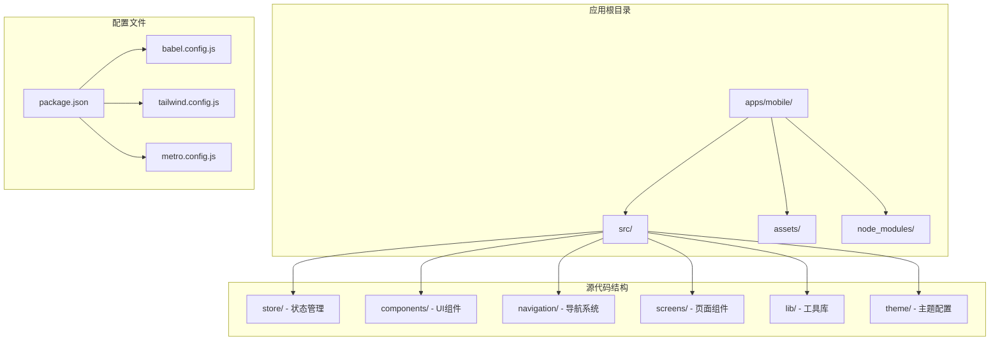
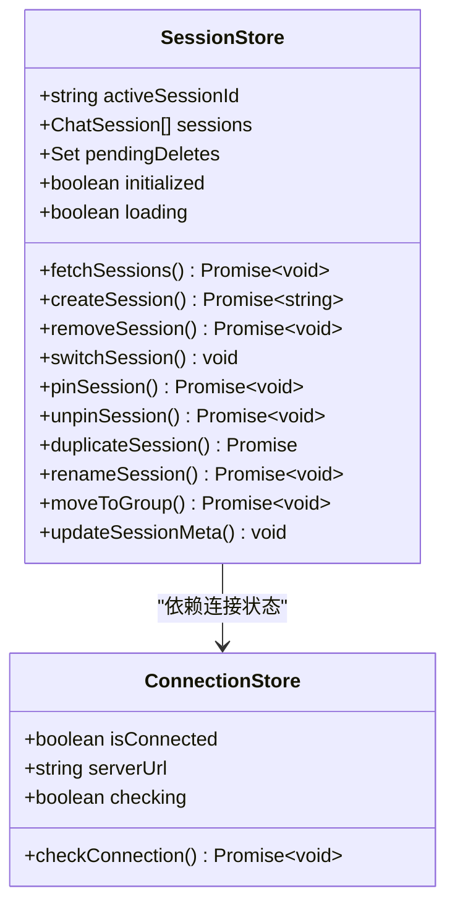
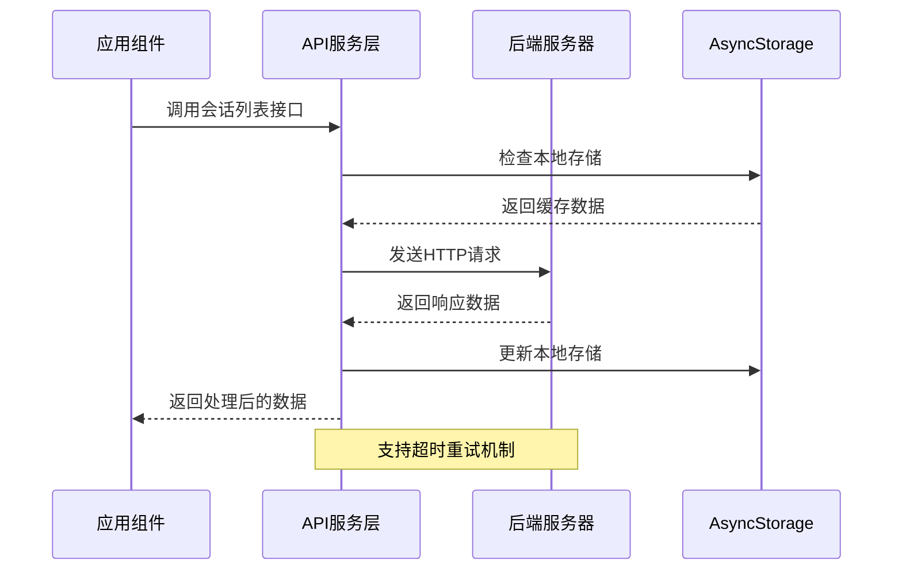
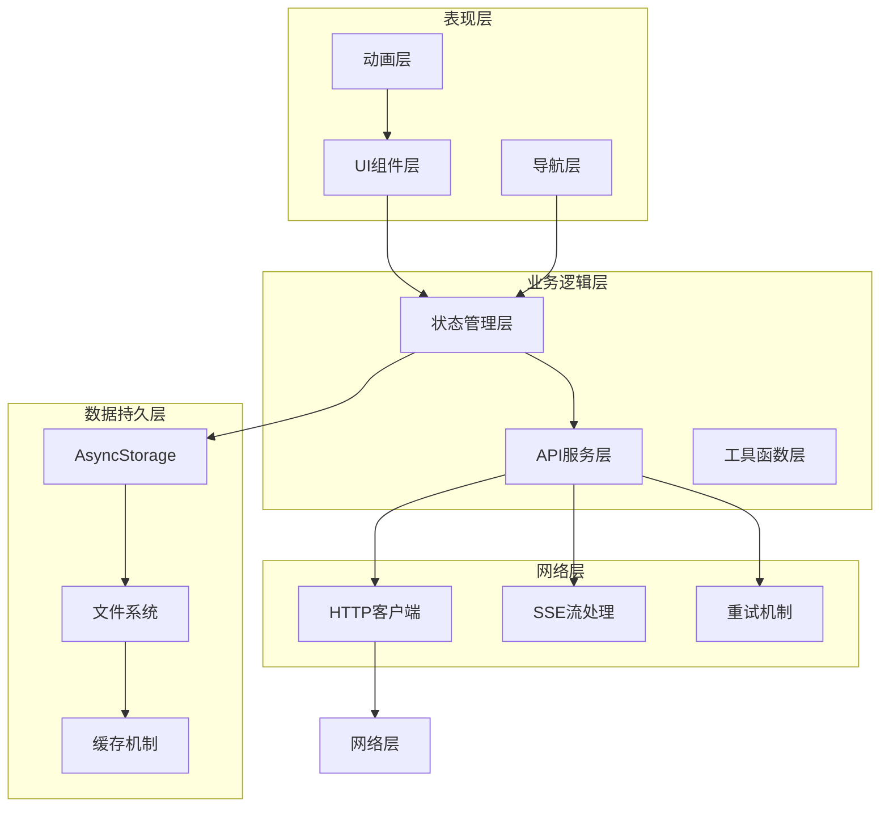
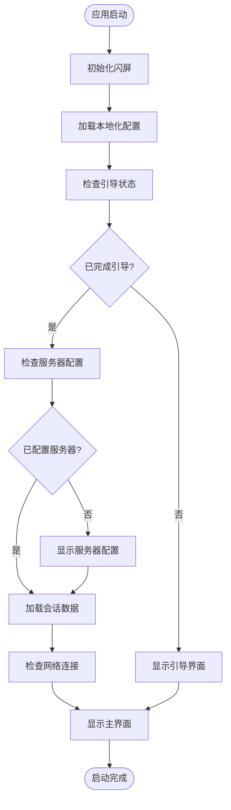
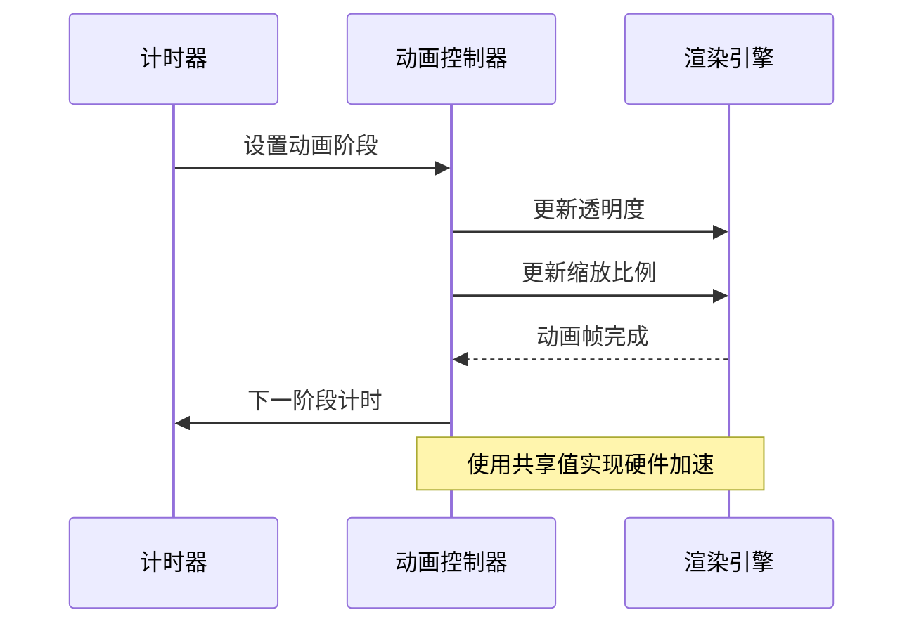
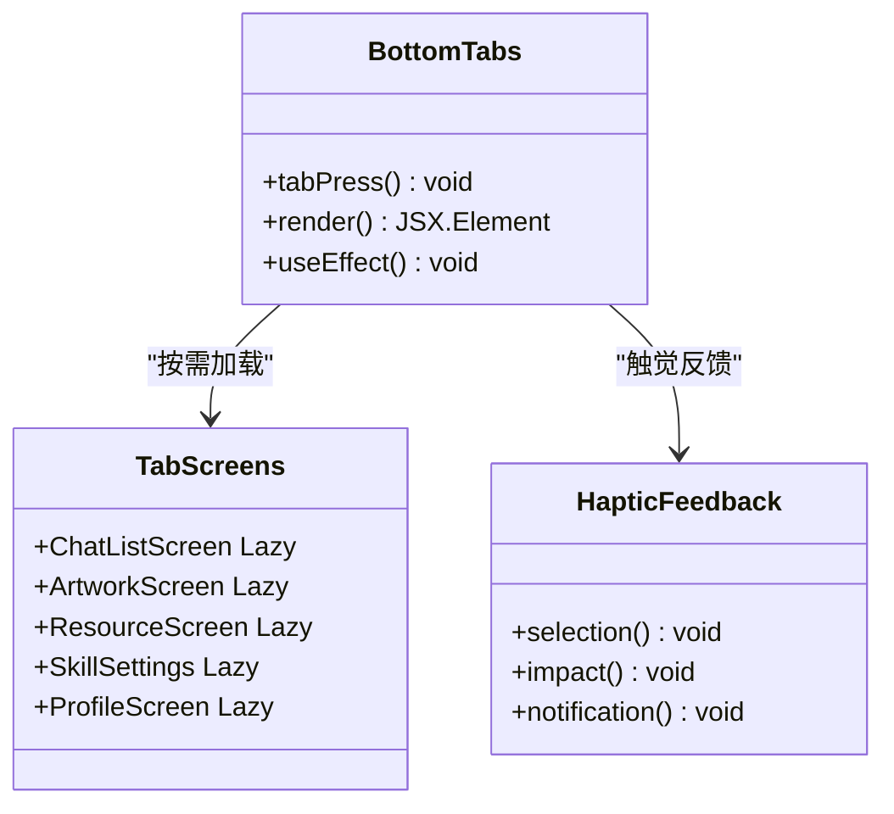
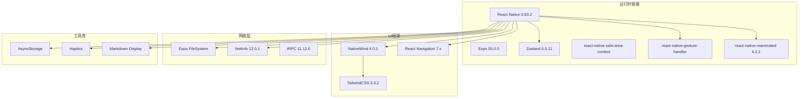
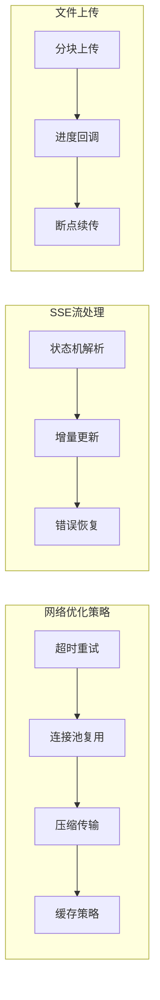
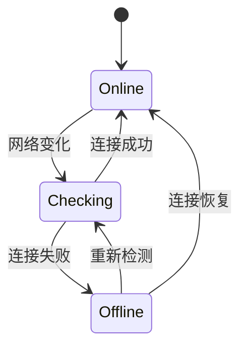

# 移动端性能优化

<cite>
**本文档引用的文件**
- [apps/mobile/package.json](file://apps/mobile/package.json)
- [apps/mobile/App.tsx](file://apps/mobile/App.tsx)
- [apps/mobile/metro.config.js](file://apps/mobile/metro.config.js)
- [apps/mobile/babel.config.js](file://apps/mobile/babel.config.js)
- [apps/mobile/tailwind.config.js](file://apps/mobile/tailwind.config.js)
- [apps/mobile/global.css](file://apps/mobile/global.css)
- [apps/mobile/index.ts](file://apps/mobile/index.ts)
- [apps/mobile/src/store/session.ts](file://apps/mobile/src/store/session.ts)
- [apps/mobile/src/store/connection.ts](file://apps/mobile/src/store/connection.ts)
- [apps/mobile/src/components/splash/SplashScreen.tsx](file://apps/mobile/src/components/splash/SplashScreen.tsx)
- [apps/mobile/src/navigation/index.tsx](file://apps/mobile/src/navigation/index.tsx)
- [apps/mobile/src/lib/api.ts](file://apps/mobile/src/lib/api.ts)
</cite>

## 目录
1. [简介](#简介)
2. [项目结构](#项目结构)
3. [核心组件](#核心组件)
4. [架构概览](#架构概览)
5. [详细组件分析](#详细组件分析)
6. [依赖关系分析](#依赖关系分析)
7. [性能考虑](#性能考虑)
8. [故障排除指南](#故障排除指南)
9. [结论](#结论)

## 简介

本文件针对 LobeHub 移动端应用的性能优化进行全面分析，基于实际代码实现探讨移动端性能优化的最佳实践。该应用采用 React Native + Expo 架构，结合 Zustand 状态管理、TailwindCSS 样式系统以及 reanimated 动画库，构建了一个功能完整的人工智能工作空间移动应用。

## 项目结构

移动端应用采用模块化架构设计，主要包含以下核心目录结构：

**图表来源**
- [apps/mobile/package.json:1-50](file://apps/mobile/package.json#L1-L50)
- [apps/mobile/App.tsx:1-112](file://apps/mobile/App.tsx#L1-L112)

**章节来源**
- [apps/mobile/package.json:1-50](file://apps/mobile/package.json#L1-L50)
- [apps/mobile/App.tsx:1-112](file://apps/mobile/App.tsx#L1-L112)

## 核心组件

### 状态管理系统

应用采用 Zustand 作为状态管理解决方案，实现了高效的状态更新机制：

**图表来源**
- [apps/mobile/src/store/session.ts:18-39](file://apps/mobile/src/store/session.ts#L18-L39)
- [apps/mobile/src/store/connection.ts:12-21](file://apps/mobile/src/store/connection.ts#L12-L21)

### 网络请求层

API 层采用自定义封装，支持 tRPC 协议和超时重试机制：

**图表来源**
- [apps/mobile/src/lib/api.ts:160-203](file://apps/mobile/src/lib/api.ts#L160-L203)
- [apps/mobile/src/store/session.ts:48-93](file://apps/mobile/src/store/session.ts#L48-L93)

**章节来源**
- [apps/mobile/src/store/session.ts:1-254](file://apps/mobile/src/store/session.ts#L1-L254)
- [apps/mobile/src/store/connection.ts:1-39](file://apps/mobile/src/store/connection.ts#L1-L39)
- [apps/mobile/src/lib/api.ts:1-800](file://apps/mobile/src/lib/api.ts#L1-L800)

## 架构概览

应用采用分层架构设计，确保各层职责清晰分离：

**图表来源**
- [apps/mobile/src/navigation/index.tsx:1-318](file://apps/mobile/src/navigation/index.tsx#L1-L318)
- [apps/mobile/src/lib/api.ts:287-517](file://apps/mobile/src/lib/api.ts#L287-L517)

## 详细组件分析

### 启动流程优化

应用实现了渐进式启动策略，通过闪屏动画和延迟加载优化用户体验：

**图表来源**
- [apps/mobile/App.tsx:59-93](file://apps/mobile/App.tsx#L59-L93)
- [apps/mobile/src/components/splash/SplashScreen.tsx:32-79](file://apps/mobile/src/components/splash/SplashScreen.tsx#L32-L79)

### 动画性能优化

闪屏动画采用 reanimated 库实现硬件加速动画：

**图表来源**
- [apps/mobile/src/components/splash/SplashScreen.tsx:39-62](file://apps/mobile/src/components/splash/SplashScreen.tsx#L39-L62)

### 导航性能优化

底部导航采用懒加载策略，减少初始渲染负担：

**图表来源**
- [apps/mobile/src/navigation/index.tsx:73-168](file://apps/mobile/src/navigation/index.tsx#L73-L168)
- [apps/mobile/src/navigation/index.tsx:48-71](file://apps/mobile/src/navigation/index.tsx#L48-L71)

**章节来源**
- [apps/mobile/App.tsx:1-112](file://apps/mobile/App.tsx#L1-L112)
- [apps/mobile/src/components/splash/SplashScreen.tsx:1-79](file://apps/mobile/src/components/splash/SplashScreen.tsx#L1-L79)
- [apps/mobile/src/navigation/index.tsx:1-318](file://apps/mobile/src/navigation/index.tsx#L1-L318)

## 依赖关系分析

### 核心依赖架构

应用依赖采用模块化设计，确保性能和可维护性：

**图表来源**
- [apps/mobile/package.json:12-42](file://apps/mobile/package.json#L12-L42)

### 构建配置优化

Metro 和 Babel 配置针对移动端进行了专门优化：

**章节来源**
- [apps/mobile/package.json:1-50](file://apps/mobile/package.json#L1-L50)
- [apps/mobile/metro.config.js:1-7](file://apps/mobile/metro.config.js#L1-L7)
- [apps/mobile/babel.config.js:1-13](file://apps/mobile/babel.config.js#L1-L13)
- [apps/mobile/tailwind.config.js:1-20](file://apps/mobile/tailwind.config.js#L1-L20)

## 性能考虑

### 内存管理策略

应用采用多种内存优化技术：

1. **状态管理优化**
   - 使用 Zustand 减少不必要的重渲染
   - 实现局部状态隔离，避免全局状态污染
   - 采用原子化状态更新，提高更新效率

2. **网络请求优化**
   - 实现超时重试机制，提升网络稳定性
   - 支持 SSE 流式传输，减少内存占用
   - 采用分页加载，控制单次数据量

3. **渲染性能优化**
   - 使用 reanimated 实现硬件加速动画
   - 采用懒加载策略，延迟非关键组件渲染
   - 实现虚拟列表，优化长列表性能

### 网络性能优化

**图表来源**
- [apps/mobile/src/lib/api.ts:287-517](file://apps/mobile/src/lib/api.ts#L287-L517)

### 存储性能优化

应用实现了多层次的存储策略：

1. **AsyncStorage 优化**
   - 批量操作减少磁盘 I/O
   - 数据序列化优化
   - 缓存失效策略

2. **文件系统优化**
   - Expo FileSystem 提供原生性能
   - 异步读写操作
   - 内存映射文件支持

## 故障排除指南

### 常见性能问题诊断

1. **启动缓慢问题**
   - 检查闪屏动画是否过度复杂
   - 验证异步初始化任务是否阻塞主线程
   - 监控网络请求超时情况

2. **内存泄漏排查**
   - 检查事件监听器是否正确清理
   - 验证定时器是否及时清除
   - 监控 Zustand 状态订阅数量

3. **动画卡顿问题**
   - 确认 reanimated 版本兼容性
   - 检查动画属性是否触发强制布局
   - 验证硬件加速是否正常工作

### 网络连接监控

应用实现了实时网络状态监控：

**图表来源**
- [apps/mobile/App.tsx:23-33](file://apps/mobile/App.tsx#L23-L33)
- [apps/mobile/src/store/connection.ts:23-38](file://apps/mobile/src/store/connection.ts#L23-L38)

**章节来源**
- [apps/mobile/App.tsx:23-57](file://apps/mobile/App.tsx#L23-L57)
- [apps/mobile/src/store/connection.ts:1-39](file://apps/mobile/src/store/connection.ts#L1-L39)

## 结论

LobeHub 移动端应用在性能优化方面采用了多项先进技术：

1. **架构层面**：采用分层架构和模块化设计，确保代码可维护性和性能优化空间

2. **状态管理**：使用 Zustand 实现高效的局部状态管理，减少不必要的重渲染

3. **动画性能**：通过 reanimated 实现硬件加速动画，提供流畅的用户体验

4. **网络优化**：实现超时重试、SSE 流式传输等技术，提升网络请求性能

5. **构建优化**：针对移动端定制 Metro 和 Babel 配置，优化打包和运行时性能

这些优化措施共同确保了应用在各种移动设备上的稳定运行和良好性能表现。建议在后续开发中继续关注新版本 React Native 的性能改进，并根据实际使用情况进行针对性优化。