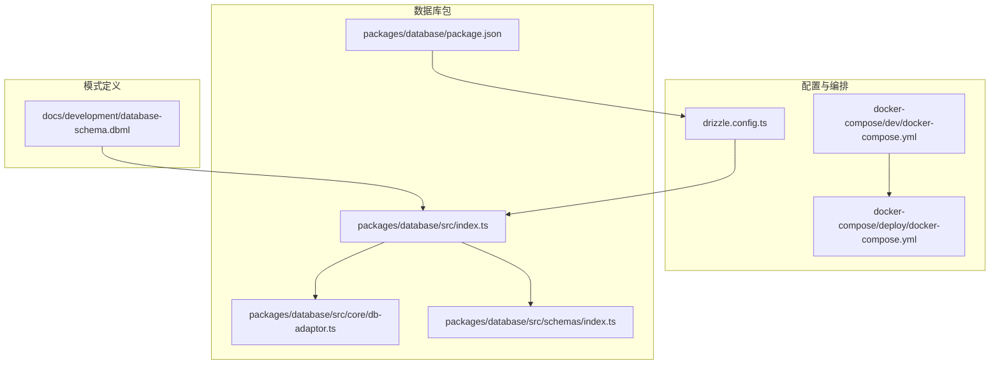
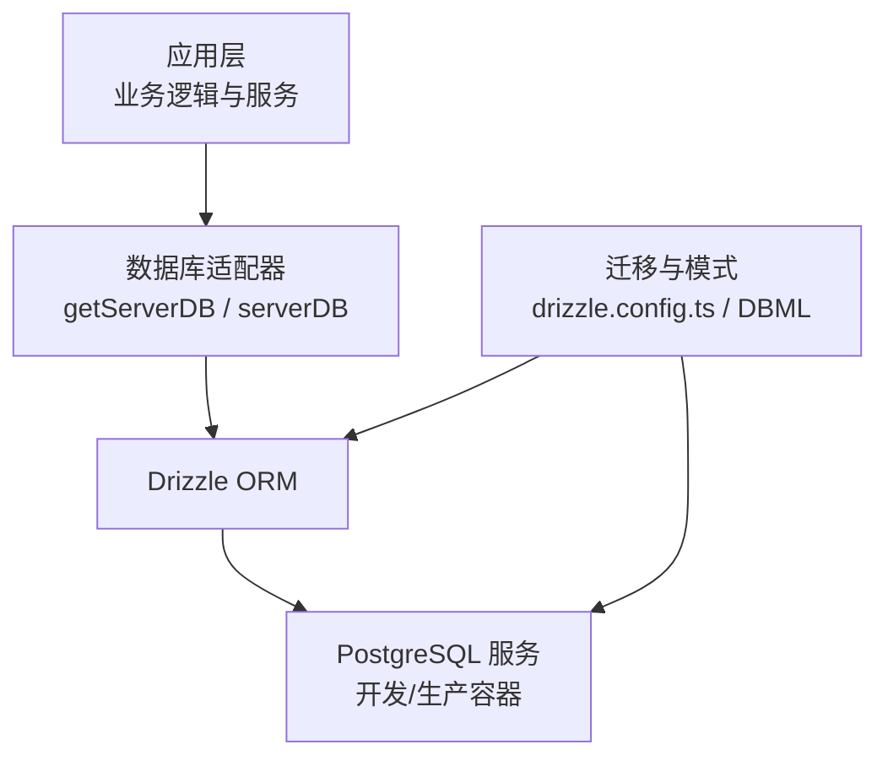
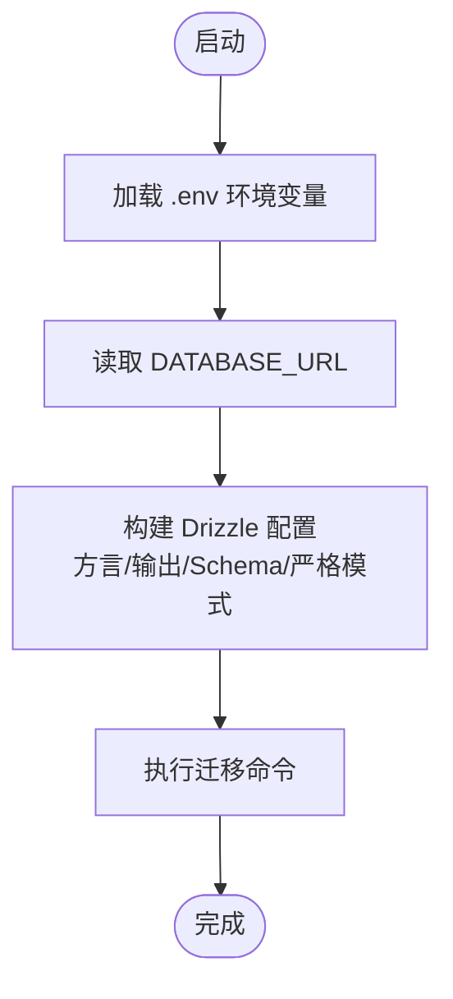
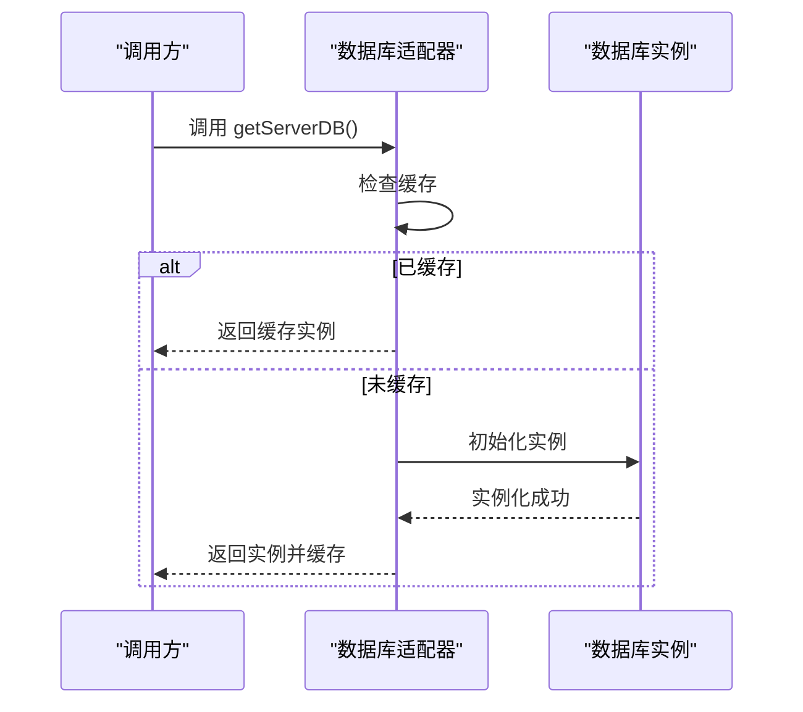
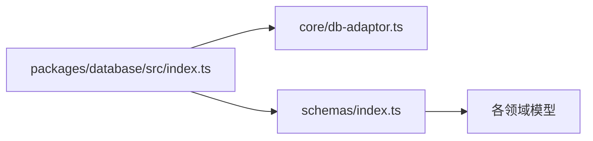
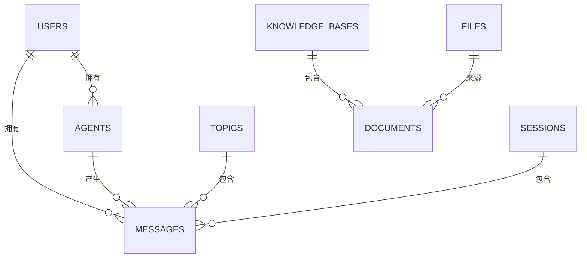
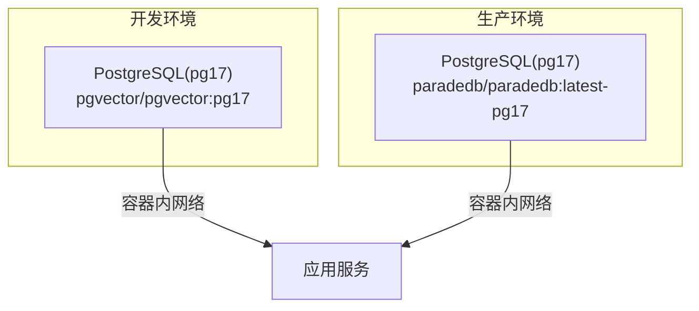
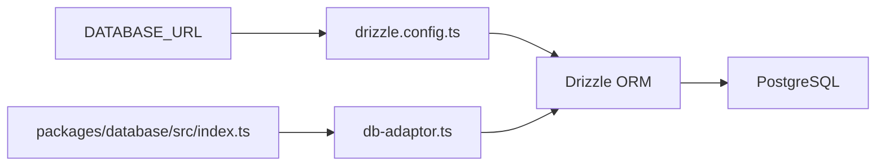
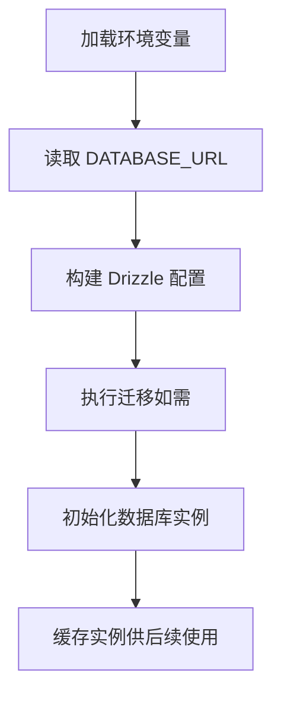

# 数据库架构

<cite>
**本文引用的文件**
- [drizzle.config.ts](file://drizzle.config.ts)
- [database-schema.dbml](file://docs/development/database-schema.dbml)
- [docker-compose.yml（开发）](file://docker-compose/dev/docker-compose.yml)
- [docker-compose.yml（部署）](file://docker-compose/deploy/docker-compose.yml)
- [packages/database/src/index.ts](file://packages/database/src/index.ts)
- [packages/database/src/core/db-adaptor.ts](file://packages/database/src/core/db-adaptor.ts)
- [packages/database/src/schemas/index.ts](file://packages/database/src/schemas/index.ts)
- [packages/database/package.json](file://packages/database/package.json)
</cite>

## 目录

1. [简介](#简介)
2. [项目结构](#项目结构)
3. [核心组件](#核心组件)
4. [架构总览](#架构总览)
5. [详细组件分析](#详细组件分析)
6. [依赖关系分析](#依赖关系分析)
7. [性能考量](#性能考量)
8. [故障排查指南](#故障排查指南)
9. [结论](#结论)
10. [附录](#附录)

## 简介

本文件系统性梳理 LobeHub 的数据库架构，覆盖 PostgreSQL 数据库配置、Drizzle ORM 集成、连接池与事务处理、初始化与连接管理策略、读写分离思路、安全与权限、备份恢复、性能监控与慢查询优化、部署配置与环境变量、以及与应用层的集成方式与 ORM 映射策略。内容基于仓库中的 Drizzle 配置、数据库模式定义、Docker Compose 编排与数据库包导出结构进行归纳总结。

## 项目结构

围绕数据库的核心目录与文件如下：

- Drizzle 配置：用于生成迁移、指定方言与 schema 路径
- 数据库模式：DBML 定义了完整的表结构与索引
- Docker Compose：开发与生产环境的数据库服务编排
- 数据库包：导出数据库适配器、仓库与工具，供上层业务调用

图表来源

- [drizzle.config.ts](file://drizzle.config.ts#L1-L22)
- [docker-compose/dev/docker-compose.yml](file://docker-compose/dev/docker-compose.yml#L1-L123)
- [docker-compose/deploy/docker-compose.yml](file://docker-compose/deploy/docker-compose.yml#L1-L144)
- [packages/database/src/index.ts](file://packages/database/src/index.ts#L1-L5)
- [packages/database/src/core/db-adaptor.ts](file://packages/database/src/core/db-adaptor.ts#L1-L25)
- [packages/database/src/schemas/index.ts](file://packages/database/src/schemas/index.ts#L1-L24)
- [packages/database/package.json](file://packages/database/package.json#L1-L38)
- [database-schema.dbml](file://docs/development/database-schema.dbml#L1-L800)

章节来源

- [drizzle.config.ts](file://drizzle.config.ts#L1-L22)
- [docker-compose/dev/docker-compose.yml](file://docker-compose/dev/docker-compose.yml#L1-L123)
- [docker-compose/deploy/docker-compose.yml](file://docker-compose/deploy/docker-compose.yml#L1-L144)
- [packages/database/src/index.ts](file://packages/database/src/index.ts#L1-L5)
- [packages/database/src/core/db-adaptor.ts](file://packages/database/src/core/db-adaptor.ts#L1-L25)
- [packages/database/src/schemas/index.ts](file://packages/database/src/schemas/index.ts#L1-L24)
- [packages/database/package.json](file://packages/database/package.json#L1-L38)
- [database-schema.dbml](file://docs/development/database-schema.dbml#L1-L800)

## 核心组件

- Drizzle 配置：定义数据库方言、迁移输出路径、schema 路径与严格模式
- 数据库适配器：延迟加载数据库实例，避免重复初始化
- 模式导出：统一导出各领域模型 schema，便于上层按需引入
- 数据库包：声明对 drizzle-orm、pg 等 peer 依赖，确保运行时环境满足

章节来源

- [drizzle.config.ts](file://drizzle.config.ts#L10-L21)
- [packages/database/src/core/db-adaptor.ts](file://packages/database/src/core/db-adaptor.ts#L8-L24)
- [packages/database/src/schemas/index.ts](file://packages/database/src/schemas/index.ts#L1-L24)
- [packages/database/package.json](file://packages/database/package.json#L31-L36)

## 架构总览

下图展示数据库在应用中的位置与交互关系：Drizzle 作为 ORM，通过数据库适配器获取连接；Docker Compose 提供开发与生产环境的 PostgreSQL 服务；DBML 描述了完整的数据模型。

图表来源

- [packages/database/src/core/db-adaptor.ts](file://packages/database/src/core/db-adaptor.ts#L10-L24)
- [drizzle.config.ts](file://drizzle.config.ts#L12-L21)
- [docker-compose/dev/docker-compose.yml](file://docker-compose/dev/docker-compose.yml#L17-L36)
- [docker-compose/deploy/docker-compose.yml](file://docker-compose/deploy/docker-compose.yml#L39-L59)
- [database-schema.dbml](file://docs/development/database-schema.dbml#L1-L800)

## 详细组件分析

### Drizzle 配置与迁移

- 方言与输出：使用 PostgreSQL 方言，迁移输出到数据库包的 migrations 目录，schema 指向数据库包的 schemas 目录
- 连接字符串：从环境变量 DATABASE_URL 获取连接信息
- 严格模式：启用严格模式以提升类型安全

图表来源

- [drizzle.config.ts](file://drizzle.config.ts#L1-L22)

章节来源

- [drizzle.config.ts](file://drizzle.config.ts#L1-L22)

### 数据库适配器与连接管理

- 延迟加载：首次访问时初始化数据库实例并缓存，避免重复初始化带来的开销
- 错误处理：初始化失败时记录错误并抛出异常，便于上层捕获与降级

图表来源

- [packages/database/src/core/db-adaptor.ts](file://packages/database/src/core/db-adaptor.ts#L10-L24)

章节来源

- [packages/database/src/core/db-adaptor.ts](file://packages/database/src/core/db-adaptor.ts#L1-L25)

### 模式与模型导出

- 统一导出：通过 schemas/index.ts 导出所有领域模型，便于上层按需引入
- 包导出：数据库包的入口 index.ts 导出适配器、仓库与工具，形成清晰的对外接口

图表来源

- [packages/database/src/index.ts](file://packages/database/src/index.ts#L1-L5)
- [packages/database/src/schemas/index.ts](file://packages/database/src/schemas/index.ts#L1-L24)

章节来源

- [packages/database/src/index.ts](file://packages/database/src/index.ts#L1-L5)
- [packages/database/src/schemas/index.ts](file://packages/database/src/schemas/index.ts#L1-L24)

### 数据库模式（DBML）

- 表与字段：DBML 描述了代理、会话、消息、知识库、任务、鉴权等核心实体及其字段
- 索引：大量复合唯一索引与单列索引，覆盖用户维度、客户端标识、时间戳排序等高频查询场景
- 关系：通过外键字段与索引体现实体间的关联（如 user_id、agent_id、topic_id 等）

图表来源

- [database-schema.dbml](file://docs/development/database-schema.dbml#L1-L800)

章节来源

- [database-schema.dbml](file://docs/development/database-schema.dbml#L1-L800)

### Docker Compose 编排（开发与生产）

- 开发环境：使用 pgvector/pgvector:pg17 提供向量扩展能力，挂载数据卷，健康检查确保可用性
- 生产环境：使用 paradedb/paradedb:latest-pg17，具备搜索与向量能力，同样提供健康检查与持久化

图表来源

- [docker-compose/dev/docker-compose.yml](file://docker-compose/dev/docker-compose.yml#L17-L36)
- [docker-compose/deploy/docker-compose.yml](file://docker-compose/deploy/docker-compose.yml#L39-L59)

章节来源

- [docker-compose/dev/docker-compose.yml](file://docker-compose/dev/docker-compose.yml#L1-L123)
- [docker-compose/deploy/docker-compose.yml](file://docker-compose/deploy/docker-compose.yml#L1-L144)

## 依赖关系分析

- Drizzle 配置依赖环境变量 DATABASE_URL
- 数据库包导出适配器与模式，供应用层直接使用
- Docker Compose 为数据库提供运行时环境与健康检查

图表来源

- [drizzle.config.ts](file://drizzle.config.ts#L10-L21)
- [packages/database/src/index.ts](file://packages/database/src/index.ts#L1-L5)
- [packages/database/src/core/db-adaptor.ts](file://packages/database/src/core/db-adaptor.ts#L1-L25)

章节来源

- [drizzle.config.ts](file://drizzle.config.ts#L1-L22)
- [packages/database/src/index.ts](file://packages/database/src/index.ts#L1-L5)
- [packages/database/src/core/db-adaptor.ts](file://packages/database/src/core/db-adaptor.ts#L1-L25)

## 性能考量

- 索引策略：DBML 中大量单列与复合唯一索引覆盖高频查询字段（如 user_id、client_id、created_at 等），有助于加速过滤与排序
- 向量化与搜索：开发与生产均采用 pg17，并结合向量扩展，适合 RAG 与相似度检索场景
- 迁移与版本控制：通过迁移脚本逐步演进，建议在变更前评估索引与查询计划变化
- 查询优化建议（通用原则）
  - 使用 EXPLAIN/EXPLAIN ANALYZE 分析慢查询
  - 对大表分页与条件过滤使用合适索引
  - 控制 JSONB 字段的扫描范围，必要时拆分或物化常用字段
  - 合理使用 LIMIT 与分区策略（如按时间分区）

\[本节为通用性能指导，不直接分析具体文件]

## 故障排查指南

- 初始化失败
  - 症状：应用启动时报数据库初始化错误
  - 排查：检查 DATABASE_URL 是否正确、PostgreSQL 是否健康、容器网络连通性
  - 参考：数据库适配器的错误日志与健康检查配置
- 迁移问题
  - 症状：迁移命令执行失败或状态不一致
  - 排查：确认 Drizzle 配置中的 schema 与输出路径、.env 文件是否正确加载
- 连接问题
  - 症状：应用无法连接数据库或连接超时
  - 排查：核对 Docker 网络、端口映射、容器健康状态与凭据

章节来源

- [packages/database/src/core/db-adaptor.ts](file://packages/database/src/core/db-adaptor.ts#L18-L21)
- [drizzle.config.ts](file://drizzle.config.ts#L1-L22)
- [docker-compose/dev/docker-compose.yml](file://docker-compose/dev/docker-compose.yml#L27-L31)
- [docker-compose/deploy/docker-compose.yml](file://docker-compose/deploy/docker-compose.yml#L52-L56)

## 结论

LobeHub 的数据库架构以 Drizzle ORM 为核心，配合明确的迁移与模式定义，通过延迟加载的数据库适配器实现高效稳定的连接管理。开发与生产环境均采用 PostgreSQL（含向量扩展），并通过 Docker Compose 提供可复现的部署体验。建议在生产中结合索引策略、慢查询分析与容量规划，持续优化查询性能与资源使用。

\[本节为总结性内容，不直接分析具体文件]

## 附录

### 数据库初始化流程（概念）

\[本图为概念流程，不直接对应具体源码文件]

### 环境变量与部署要点

- 数据库连接
  - DATABASE_URL：PostgreSQL 连接字符串
  - POSTGRES_DB / POSTGRES_PASSWORD：数据库名称与密码（开发 / 生产）
- 应用侧配置
  - REDIS_URL、REDIS_PREFIX 等缓存相关变量（由部署编排提供）
- 容器与网络
  - 开发 / 生产服务均通过健康检查保障可用性
  - 容器间通过自定义网络互通

章节来源

- [drizzle.config.ts](file://drizzle.config.ts#L10-L14)
- [docker-compose/dev/docker-compose.yml](file://docker-compose/dev/docker-compose.yml#L24-L36)
- [docker-compose/deploy/docker-compose.yml](file://docker-compose/deploy/docker-compose.yml#L17-L34)

### 与应用层的集成方式

- 通过数据库包导出的适配器获取数据库实例
- 在服务层按需引入相应模型与仓库，避免跨模块耦合
- 运行时依赖 peerDependencies 中的 drizzle-orm 与 pg

章节来源

- [packages/database/src/index.ts](file://packages/database/src/index.ts#L1-L5)
- [packages/database/package.json](file://packages/database/package.json#L31-L36)
