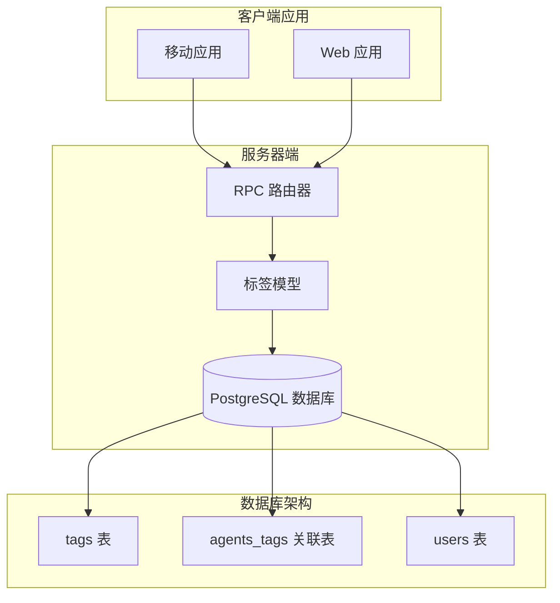
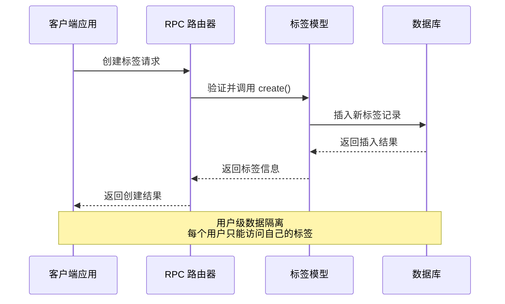
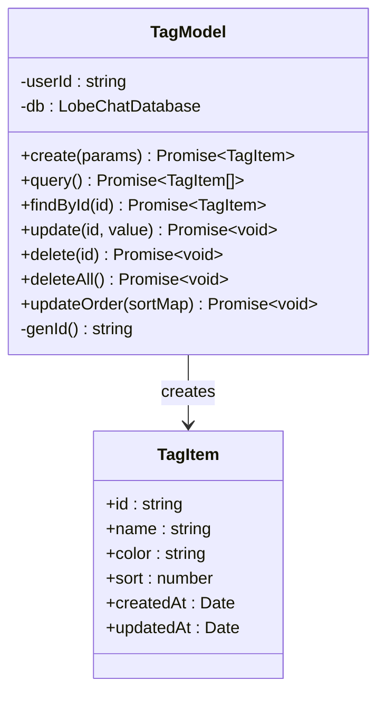
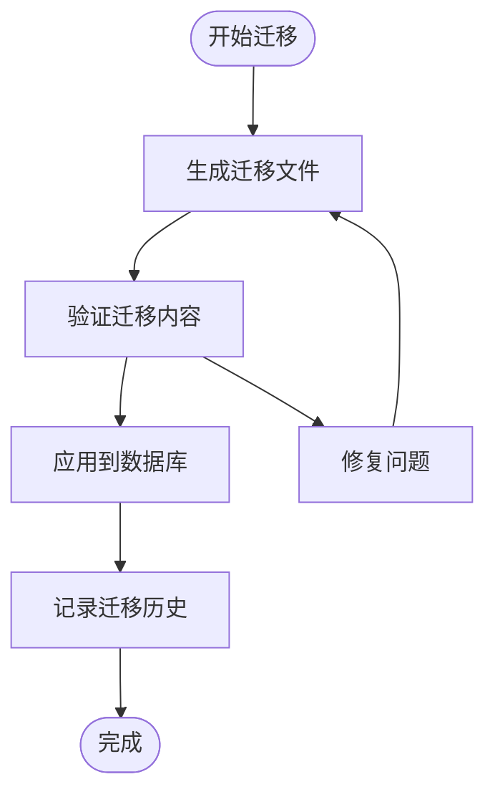
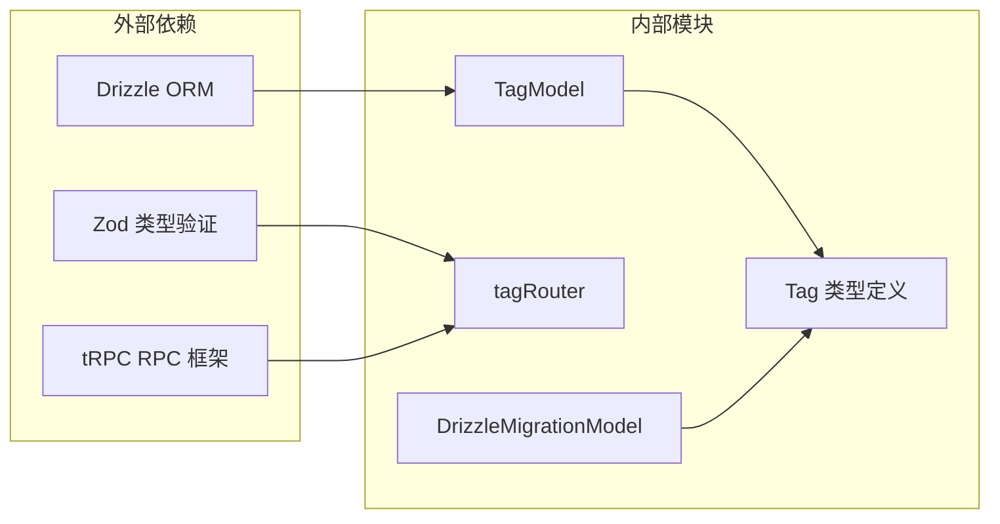

# 数据库标签系统

<cite>
**本文档引用的文件**
- [packages/database/src/models/tag.ts](file://packages/database/src/models/tag.ts)
- [src/server/routers/lambda/tag.ts](file://src/server/routers/lambda/tag.ts)
- [packages/types/src/tag/index.ts](file://packages/types/src/tag/index.ts)
- [packages/database/migrations/meta/0008_snapshot.json](file://packages/database/migrations/meta/0008_snapshot.json)
- [packages/database/migrations/meta/0009_snapshot.json](file://packages/database/migrations/meta/0009_snapshot.json)
- [packages/database/migrations/meta/_journal.json](file://packages/database/migrations/meta/_journal.json)
- [packages/database/src/models/drizzleMigration.ts](file://packages/database/src/models/drizzleMigration.ts)
- [packages/types/src/clientDB.ts](file://packages/types/src/clientDB.ts)
- [.agents/skills/db-migrations/SKILL.md](file://.agents/skills/db-migrations/SKILL.md)
- [apps/mobile/src/lib/api.ts](file://apps/mobile/src/lib/api.ts)
</cite>

## 目录
1. [简介](#简介)
2. [项目结构](#项目结构)
3. [核心组件](#核心组件)
4. [架构概览](#架构概览)
5. [详细组件分析](#详细组件分析)
6. [依赖关系分析](#依赖关系分析)
7. [性能考虑](#性能考虑)
8. [故障排除指南](#故障排除指南)
9. [结论](#结论)

## 简介

数据库标签系统是 LobeHub 项目中用于管理用户自定义标签的核心功能模块。该系统实现了完整的标签生命周期管理，包括标签的创建、查询、更新、删除以及排序功能。系统采用多层架构设计，支持用户级别的标签隔离，并通过关系型数据库实现标签与实体之间的关联管理。

标签系统的核心特点包括：
- 用户级数据隔离：每个用户只能访问和操作自己的标签
- 多层级权限控制：基于用户身份验证的访问控制
- 关联关系管理：支持标签与代理、知识库等实体的多对多关联
- 排序功能：支持动态调整标签显示顺序
- 完整的 CRUD 操作：提供标准的数据操作接口

## 项目结构

数据库标签系统在项目中的组织结构如下：

**图表来源**
- [src/server/routers/lambda/tag.ts:1-75](file://src/server/routers/lambda/tag.ts#L1-L75)
- [packages/database/src/models/tag.ts:1-69](file://packages/database/src/models/tag.ts#L1-L69)

**章节来源**
- [src/server/routers/lambda/tag.ts:1-75](file://src/server/routers/lambda/tag.ts#L1-L75)
- [packages/database/src/models/tag.ts:1-69](file://packages/database/src/models/tag.ts#L1-L69)

## 核心组件

### 数据模型层

标签系统的核心数据模型由三个主要组件构成：

#### 标签表 (tags)
- 主键：自增 ID
- 唯一约束：slug 字段唯一性
- 外键：user_id 引用 users 表
- 时间戳：created_at 和 updated_at 自动管理

#### 关联表 (agents_tags)
- 复合主键：agent_id + tag_id
- 外键约束：双向级联删除
- 支持多对多关系

#### 类型定义
系统提供了完整的 TypeScript 类型定义，确保类型安全的开发体验。

**章节来源**
- [packages/database/migrations/meta/0008_snapshot.json:661-724](file://packages/database/migrations/meta/0008_snapshot.json#L661-L724)
- [packages/database/migrations/meta/0009_snapshot.json:392-437](file://packages/database/migrations/meta/0009_snapshot.json#L392-L437)
- [packages/types/src/tag/index.ts:1-15](file://packages/types/src/tag/index.ts#L1-L15)

### 业务逻辑层

#### TagModel 类
负责处理所有标签相关的业务逻辑，包括：
- 标签创建和验证
- 查询和过滤操作
- 更新和删除功能
- 批量排序操作

#### RPC 路由器
提供标准化的 API 接口，支持：
- 标签 CRUD 操作
- 排序更新
- 权限验证

**章节来源**
- [packages/database/src/models/tag.ts:1-69](file://packages/database/src/models/tag.ts#L1-L69)
- [src/server/routers/lambda/tag.ts:1-75](file://src/server/routers/lambda/tag.ts#L1-L75)

## 架构概览

数据库标签系统采用分层架构设计，确保了良好的可维护性和扩展性：

**图表来源**
- [src/server/routers/lambda/tag.ts:19-36](file://src/server/routers/lambda/tag.ts#L19-L36)
- [packages/database/src/models/tag.ts:17-24](file://packages/database/src/models/tag.ts#L17-L24)

系统架构的关键特性：
- **分层设计**：清晰分离表示层、业务逻辑层和数据访问层
- **权限控制**：基于用户 ID 的数据访问隔离
- **事务管理**：批量操作使用数据库事务保证一致性
- **类型安全**：完整的 TypeScript 类型定义

## 详细组件分析

### 标签模型分析

#### 核心方法实现

**图表来源**
- [packages/database/src/models/tag.ts:8-68](file://packages/database/src/models/tag.ts#L8-L68)
- [packages/types/src/tag/index.ts:3-13](file://packages/types/src/tag/index.ts#L3-L13)

#### 数据库模式设计

标签系统采用标准的关系型数据库设计模式：

**标签表结构**：
- `id`: 主键，使用自定义 ID 生成器
- `slug`: 唯一标识符，确保标签名称的唯一性
- `name`: 标签显示名称
- `color`: 可选的颜色属性
- `sort`: 排序字段，支持动态排序
- `user_id`: 外键，关联到用户表
- `created_at`/`updated_at`: 自动时间戳管理

**关联表设计**：
- `agent_id`: 关联代理的 ID
- `tag_id`: 关联标签的 ID
- 复合主键确保唯一性约束

**章节来源**
- [packages/database/migrations/meta/0008_snapshot.json:664-702](file://packages/database/migrations/meta/0008_snapshot.json#L664-L702)
- [packages/database/migrations/meta/0009_snapshot.json:395-407](file://packages/database/migrations/meta/0009_snapshot.json#L395-L407)

### RPC 接口设计

#### API 方法映射

| RPC 方法 | HTTP 方法 | 功能描述 |
|---------|----------|----------|
| `createTag` | POST `/tag/createTag` | 创建新标签 |
| `getTags` | GET `/tag/getTags` | 获取用户标签列表 |
| `removeTag` | POST `/tag/removeTag` | 删除指定标签 |
| `removeAllTags` | POST `/tag/removeAllTags` | 删除用户所有标签 |
| `updateTag` | POST `/tag/updateTag` | 更新标签信息 |
| `updateTagOrder` | POST `/tag/updateTagOrder` | 更新标签排序 |

#### 输入输出规范

每个 API 方法都经过严格的参数验证和类型检查，确保数据的完整性和安全性。

**章节来源**
- [src/server/routers/lambda/tag.ts:20-72](file://src/server/routers/lambda/tag.ts#L20-L72)
- [apps/mobile/src/lib/api.ts:1795-1805](file://apps/mobile/src/lib/api.ts#L1795-L1805)

### 数据迁移管理

#### 迁移历史跟踪

系统使用专门的迁移管理机制来跟踪数据库结构变更：

**图表来源**
- [packages/database/migrations/meta/_journal.json:1-679](file://packages/database/migrations/meta/_journal.json#L1-L679)

#### 迁移策略

系统采用渐进式迁移策略，确保数据库结构演化的安全性和可追溯性。每次迁移都会生成详细的版本信息和时间戳记录。

**章节来源**
- [packages/database/migrations/meta/_journal.json:1-679](file://packages/database/migrations/meta/_journal.json#L1-L679)
- [.agents/skills/db-migrations/SKILL.md:1-111](file://.agents/skills/db-migrations/SKILL.md#L1-L111)

## 依赖关系分析

### 组件间依赖关系

**图表来源**
- [packages/database/src/models/tag.ts:1-69](file://packages/database/src/models/tag.ts#L1-L69)
- [src/server/routers/lambda/tag.ts:1-75](file://src/server/routers/lambda/tag.ts#L1-L75)

### 数据流分析

标签系统遵循标准的 MVC（Model-View-Controller）架构模式：

1. **控制器层**：RPC 路由器处理外部请求
2. **模型层**：TagModel 实现业务逻辑
3. **视图层**：客户端应用展示数据
4. **数据层**：关系型数据库存储数据

**章节来源**
- [packages/database/src/models/tag.ts:1-69](file://packages/database/src/models/tag.ts#L1-L69)
- [src/server/routers/lambda/tag.ts:1-75](file://src/server/routers/lambda/tag.ts#L1-L75)

## 性能考虑

### 查询优化策略

1. **索引设计**：为常用查询字段建立适当的索引
2. **批量操作**：使用事务处理批量排序更新
3. **分页查询**：对于大量数据的场景实现分页机制
4. **缓存策略**：合理使用数据库连接池和查询缓存

### 并发控制

系统通过以下机制确保并发环境下的数据一致性：
- 数据库事务管理
- 外键约束保证参照完整性
- 用户级数据隔离
- 原子性操作保证

## 故障排除指南

### 常见问题及解决方案

#### 标签创建失败
**可能原因**：
- 用户 ID 验证失败
- 标签名重复
- 数据库连接异常

**解决步骤**：
1. 检查用户认证状态
2. 验证标签名称的唯一性
3. 确认数据库连接正常

#### 标签排序异常
**可能原因**：
- 排序值冲突
- 事务未正确提交
- 并发更新问题

**解决步骤**：
1. 检查排序值的唯一性
2. 确认事务的原子性
3. 实施适当的锁机制

#### 数据迁移问题
**可能原因**：
- 迁移文件损坏
- 版本不匹配
- 权限不足

**解决步骤**：
1. 验证迁移文件的完整性
2. 检查数据库版本状态
3. 确认执行权限

**章节来源**
- [packages/database/src/models/drizzleMigration.ts:1-38](file://packages/database/src/models/drizzleMigration.ts#L1-L38)
- [packages/types/src/clientDB.ts:1-42](file://packages/types/src/clientDB.ts#L1-L42)

## 结论

数据库标签系统展现了现代 Web 应用中标签管理的最佳实践。系统通过清晰的分层架构、完善的类型定义和严格的数据验证，实现了功能完整且易于维护的标签管理功能。

### 主要优势

1. **架构清晰**：分层设计确保了良好的可维护性
2. **类型安全**：完整的 TypeScript 支持提供编译时错误检测
3. **数据隔离**：用户级权限控制确保数据安全性
4. **扩展性强**：模块化设计便于功能扩展
5. **性能优化**：合理的数据库设计和查询策略

### 技术亮点

- 使用 Drizzle ORM 提供类型安全的数据库操作
- 采用 tRPC 实现高效的前后端通信
- 实现完整的数据迁移管理机制
- 支持复杂的多对多关联关系
- 提供完整的 CRUD 操作和排序功能

该系统为 LobeHub 项目提供了坚实的数据基础，支持未来功能的持续扩展和演进。