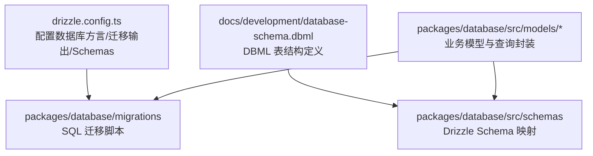
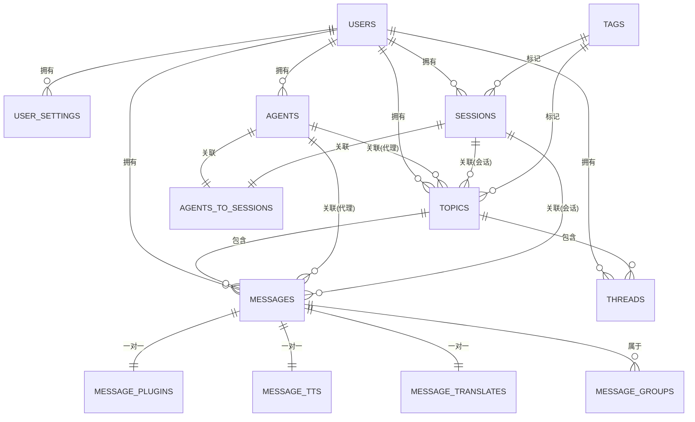
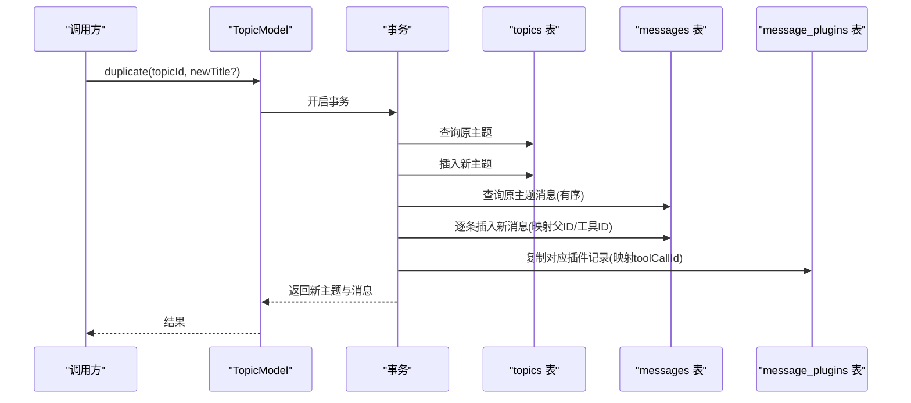
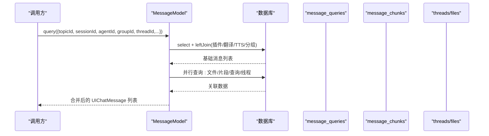
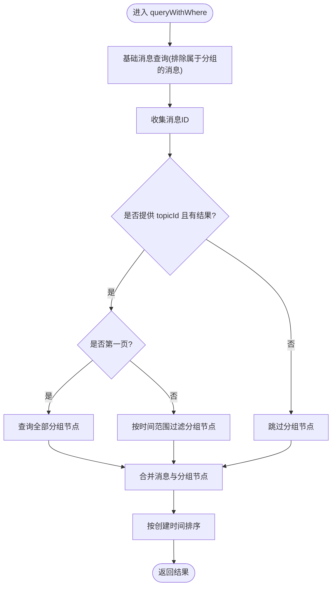
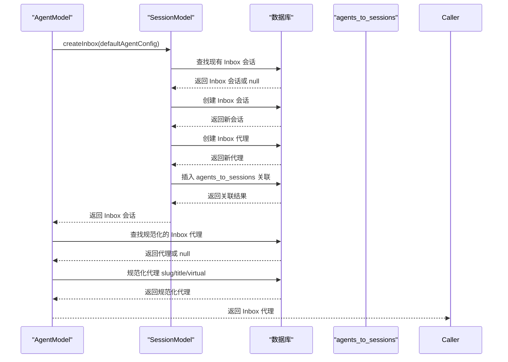
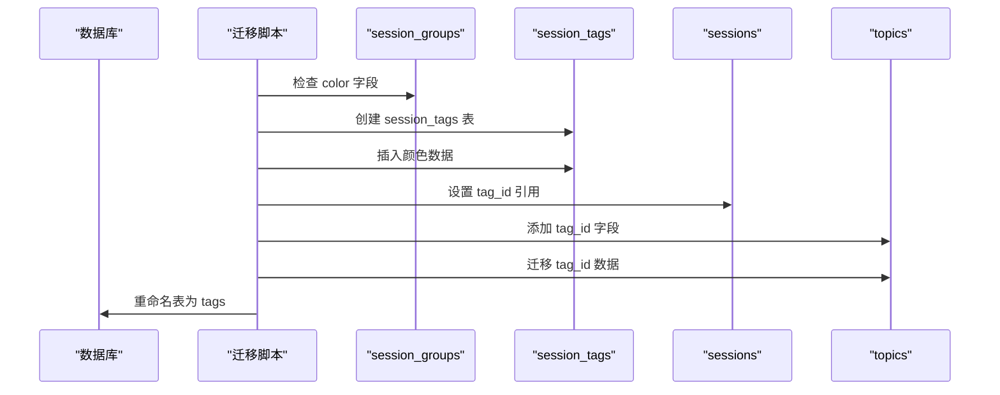
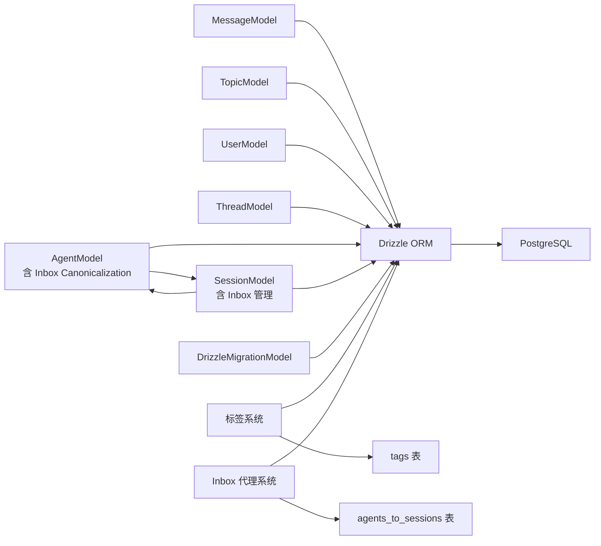

# 数据库设计

<cite>
**本文引用的文件**
- [drizzle.config.ts](file://drizzle.config.ts)
- [database-schema.dbml](file://docs/development/database-schema.dbml)
- [packages/database/src/models/message.ts](file://packages/database/src/models/message.ts)
- [packages/database/src/models/user.ts](file://packages/database/src/models/user.ts)
- [packages/database/src/models/topic.ts](file://packages/database/src/models/topic.ts)
- [packages/database/src/models/thread.ts](file://packages/database/src/models/thread.ts)
- [packages/database/src/models/agent.ts](file://packages/database/src/models/agent.ts)
- [packages/database/src/models/session.ts](file://packages/database/src/models/session.ts)
- [packages/database/src/models/drizzleMigration.ts](file://packages/database/src/models/drizzleMigration.ts)
- [packages/database/src/models/__tests__/agent.test.ts](file://packages/database/src/models/__tests__/agent.test.ts)
- [packages/database/src/models/__tests__/session.test.ts](file://packages/database/src/models/__tests__/session.test.ts)
- [packages/database/src/schemas/agent.ts](file://packages/database/src/schemas/agent.ts)
- [packages/database/src/schemas/session.ts](file://packages/database/src/schemas/session.ts)
- [packages/database/src/schemas/relations.ts](file://packages/database/src/schemas/relations.ts)
- [packages/database/migrations/meta/0075_snapshot.json](file://packages/database/migrations/meta/0075_snapshot.json)
- [packages/database/migrations/meta/0043_snapshot.json](file://packages/database/migrations/meta/0043_snapshot.json)
- [packages/database/migrations/meta/0095_snapshot.json](file://packages/database/migrations/meta/0095_snapshot.json)
- [packages/database/migrations/0091_add_session_group_color.sql](file://packages/database/migrations/0091_add_session_group_color.sql)
- [packages/database/migrations/0092_public_stick.sql](file://packages/database/migrations/0092_public_stick.sql)
- [packages/database/migrations/0093_add_sessions_config.sql](file://packages/database/migrations/0093_add_sessions_config.sql)
- [packages/database/migrations/0094_wet_zaran.sql](file://packages/database/migrations/0094_wet_zaran.sql)
- [packages/database/migrations/0095_rename_session_tags_to_tags.sql](file://packages/database/migrations/0095_rename_session_tags_to_tags.sql)
</cite>

## 更新摘要

**所做更改**

- 新增 Inbox Agent Canonicalization 相关的模型增强：AgentModel 和 SessionModel 的增强功能
- 更新 AgentModel 的内置代理处理逻辑，支持规范化的 Inbox 代理
- 增强 SessionModel 的 Inbox 会话创建和管理功能
- 更新迁移管理章节，反映 Inbox Agent Canonicalization 的相关变更
- 增强表结构描述，包含新的字段和约束
- 更新实体关系图，展示 Inbox Agent Canonicalization 的完整架构

## 目录

1. [简介](#简介)
2. [项目结构](#项目结构)
3. [核心组件](#核心组件)
4. [架构总览](#架构总览)
5. [详细组件分析](#详细组件分析)
6. [依赖分析](#依赖分析)
7. [性能考量](#性能考量)
8. [故障排查指南](#故障排查指南)
9. [结论](#结论)
10. [附录](#附录)

## 简介

本文件面向 LobeHub 的数据库设计与实现，基于仓库中的 DBML 模型、Drizzle 配置与模型层代码，系统化梳理数据库架构、表结构、字段定义、索引策略、实体关系、事务与数据访问模式，并补充迁移管理、版本控制、运维与性能优化建议。文档同时给出与 ORM（Drizzle）集成的最佳实践与常见问题排查方法。

**更新** 本次更新反映了应用变更：数据库迁移包含 Inbox Agent Canonicalization 功能，增强了 AgentModel 和 SessionModel 的处理逻辑，新增了规范化的内置代理管理和 Inbox 会话处理机制。

## 项目结构

数据库相关的核心位置如下：

- Drizzle 配置：用于定义连接字符串、迁移输出目录、Schema 路径与严格模式
- DBML 模型：定义所有表、字段、主键 / 唯一键、索引与注释
- 模型层：封装 CRUD、复杂查询、事务与跨表联结逻辑
- 迁移元数据：记录历史快照，支撑迁移一致性校验



**图示来源**

- [drizzle.config.ts:1-22](file://drizzle.config.ts#L1-L22)
- [database-schema.dbml:1-800](file://docs/development/database-schema.dbml#L1-L800)

**章节来源**

- [drizzle.config.ts:1-22](file://drizzle.config.ts#L1-L22)
- [database-schema.dbml:1-800](file://docs/development/database-schema.dbml#L1-L800)

## 核心组件

- 数据库配置与迁移
  - 使用 Drizzle Kit 生成与执行迁移，输出目录与 Schema 路径在配置中声明
  - 迁移元数据保存于 migrations/meta 下，包含各版本快照
- 数据模型与仓储
  - 消息模型：支持分页、多维度过滤、RAG 查询、任务线程关联、文件 / 插件 / 翻译 / TTS 关联
  - 主题模型：支持按会话 / 群组 / 代理筛选、关键词检索、统计排行、复制与批量删除
  - 用户模型：用户状态聚合、设置合并、SSO 提供商查询、内存提取用户列表
  - 线程模型：线程创建 / 查询 / 更新 / 删除，支持按话题过滤
  - 迁移模型：查询迁移列表、获取最新哈希、统计表数量
  - **Agent 模型增强**：支持 Inbox Agent Canonicalization，规范化内置代理处理
  - **Session 模型增强**：支持 Inbox 会话的创建、管理和关联处理
- 实体关系与索引
  - DBML 定义了完整的表、字段、主键 / 唯一键与索引
  - 多处外键约束与级联删除在迁移快照中体现

**更新** 新增 Inbox Agent Canonicalization 相关的模型增强功能，包括 AgentModel 和 SessionModel 的增强处理逻辑。

**章节来源**

- [packages/database/src/models/message.ts:1-800](file://packages/database/src/models/message.ts#L1-L800)
- [packages/database/src/models/topic.ts:1-800](file://packages/database/src/models/topic.ts#L1-L800)
- [packages/database/src/models/user.ts:1-418](file://packages/database/src/models/user.ts#L1-L418)
- [packages/database/src/models/thread.ts:1-85](file://packages/database/src/models/thread.ts#L1-L85)
- [packages/database/src/models/agent.ts:1-615](file://packages/database/src/models/agent.ts#L1-L615)
- [packages/database/src/models/session.ts:1-761](file://packages/database/src/models/session.ts#L1-L761)
- [packages/database/src/models/drizzleMigration.ts:1-38](file://packages/database/src/models/drizzleMigration.ts#L1-L38)

## 架构总览

下图展示数据库层与应用层交互：Drizzle ORM 通过 Schema 映射到 DBML 定义的表；模型层封装查询与事务；迁移层保障结构演进与一致性。

```mermaid
graph TB
subgraph "应用层"
M1["消息模型<br/>MessageModel"]
M2["主题模型<br/>TopicModel"]
M3["用户模型<br/>UserModel"]
M4["线程模型<br/>ThreadModel"]
M5["代理模型<br/>AgentModel<br/>含 Inbox Canonicalization"]
M6["会话模型<br/>SessionModel<br/>含 Inbox 管理"]
MM["迁移模型<br/>DrizzleMigrationModel"]
end
subgraph "ORM 层"
D["Drizzle ORM"]
S["Schema 映射<br/>src/schemas/*"]
end
subgraph "数据库"
DB["PostgreSQL"]
META["迁移元数据<br/>migrations/meta/*.json"]
TAGS["标签系统<br/>tags 表"]
INBOX["Inbox 代理<br/>agents 表规范"]
END
M1 --> D
M2 --> D
M3 --> D
M4 --> D
M5 --> D
M6 --> D
MM --> D
D --> S
S --> DB
MM --> META
TAGS --> DB
INBOX --> DB
```

**图示来源**

- [drizzle.config.ts:10-21](file://drizzle.config.ts#L10-L21)
- [packages/database/src/models/message.ts:1-800](file://packages/database/src/models/message.ts#L1-L800)
- [packages/database/src/models/topic.ts:1-800](file://packages/database/src/models/topic.ts#L1-L800)
- [packages/database/src/models/user.ts:1-418](file://packages/database/src/models/user.ts#L1-L418)
- [packages/database/src/models/thread.ts:1-85](file://packages/database/src/models/thread.ts#L1-L85)
- [packages/database/src/models/agent.ts:1-615](file://packages/database/src/models/agent.ts#L1-L615)
- [packages/database/src/models/session.ts:1-761](file://packages/database/src/models/session.ts#L1-L761)
- [packages/database/src/models/drizzleMigration.ts:1-38](file://packages/database/src/models/drizzleMigration.ts#L1-L38)

## 详细组件分析

### 数据库架构与 ER 图

以下 ER 图基于 DBML 定义，展示核心实体与关系。为便于理解，仅列出高频表与关键关系。



**更新** 新增 Inbox Agent Canonicalization 相关的实体关系，包括 agents_to_sessions 关系和规范化处理。

**图示来源**

- [database-schema.dbml:1-800](file://docs/development/database-schema.dbml#L1-L800)

**章节来源**

- [database-schema.dbml:1-800](file://docs/development/database-schema.dbml#L1-L800)

### 表结构与字段定义（节选）

- 用户与认证
  - users：用户基本信息、偏好、引导状态
  - user_settings：用户全局设置、默认代理、语言模型、工具、TTS、市场、记忆等
  - nextauth_accounts /accounts/auth_sessions /two_factor/verifications：认证相关表
- 会话与主题
  - topics：主题信息、收藏、摘要、元数据、触发器、标签关联
  - sessions：会话信息、颜色背景、配置字段、标签关联、类型标识
  - session_groups：会话分组、颜色标记、排序
- 消息与线程
  - messages：消息内容、角色、模型 / 提供商、工具、错误、引用链、RAG 元数据
  - threads：任务线程、状态、元数据、标题
  - message_groups：消息分组（压缩 / 对比）
- 文件与知识库
  - files /global_files：文件元数据、哈希、URL、大小
  - documents /knowledge_bases/knowledge_base_files：文档、知识库与文件关联
- 代理与技能
  - agents /agent_skills/agent_bot_providers /agent_cron_jobs：代理、技能、机器人提供商、定时任务
  - **agents_to_sessions**：代理与会话的关联表，支持 Inbox 代理绑定
- AI 模型与提供商
  - ai_providers /ai_models：提供商与模型配置
- 异步任务与生成
  - async_tasks：异步任务、状态、错误、推断 ID
  - generation_batches /generation_topics/generations：图像生成批次、主题、结果
- RAG 与评估
  - message_queries /message_query_chunks/chunks：查询重写、向量片段与相似度
  - agent_eval\_\* /rag_eval\_\*：评估基准、数据集、运行与记录
- 标签系统
  - tags：标签信息、颜色、名称、排序、用户关联
- **Inbox 代理规范**
  - **slug 字段规范化**：支持 Inbox 代理的 slug 规范化处理
  - **virtual 字段**：标识虚拟代理（如 Inbox 代理）
  - **title 字段处理**：Inbox 代理的标题规范化

**更新** 新增 Inbox Agent Canonicalization 相关的表结构增强，包括 agents_to_sessions 关系表和规范化处理字段。

**章节来源**

- [database-schema.dbml:1-800](file://docs/development/database-schema.dbml#L1-L800)

### 索引策略与查询优化

- 唯一性与复合索引
  - 例如 agents (slug,user_id)、documents (client_id,user_id)、knowledge_bases (client_id,user_id) 等，确保业务唯一性
  - 新增 tags 表的唯一索引：tags_client_id_user_id_unique
  - **新增 Inbox 相关索引**：agents (slug,userId,virtual) 用于 Inbox 代理快速查找
- 高频查询字段
  - messages(user_id, topic_id, session_id, thread_id, agent_id, group_id, created_at)
  - topics(user_id, agent_id, session_id, group_id, tag_id, updated_at)
  - threads(user_id, topic_id, updated_at)
  - sessions(user_id, group_id, tag_id, created_at, slug)
  - files(user_id, client_id, file_hash)
  - knowledge_base_files(knowledge_base_id, file_id)
  - **agents_to_sessions(agent_id, session_id)**：支持 Inbox 代理与会话的快速关联
- 向量化与搜索
  - 迁移中启用向量扩展与全文检索能力，配合 message_queries 与 message_query_chunks 建立相似度检索
- 分页与排序
  - 大多数查询以 created_at 或 updated_at 排序并使用 LIMIT/OFFSET，需结合索引避免全表扫描

**更新** 新增 Inbox Agent Canonicalization 相关的索引优化策略。

**章节来源**

- [database-schema.dbml:1-800](file://docs/development/database-schema.dbml#L1-L800)

### 数据访问模式与仓储实现

- 模型层职责
  - 封装复杂联结查询（如消息与插件、翻译、TTS、文件、分组、向量化片段）
  - 提供分页、范围过滤、关键词检索、统计与排行
  - 在事务中完成多表一致性写入（如复制主题时的消息与插件映射）
  - 支持标签系统查询与关联操作
  - **Agent 模型增强**：支持 Inbox Agent Canonicalization，规范化内置代理处理
  - **Session 模型增强**：支持 Inbox 会话的创建、管理和关联处理
- 事务管理
  - 主题复制、批量创建与删除均在事务内执行，保证原子性
  - 消息查询中对任务线程与消息分组节点进行合并与排序，提升前端渲染效率
  - 标签迁移过程中使用条件判断和数据转换，确保数据一致性
  - **Inbox 代理规范化**：在事务中处理 slug 规范化和冲突清理
  - **Inbox 会话管理**：支持 Inbox 会话的创建、更新和关联处理

**更新** 新增 Inbox Agent Canonicalization 相关的数据访问模式和事务处理逻辑。

**章节来源**

- [packages/database/src/models/message.ts:1-800](file://packages/database/src/models/message.ts#L1-L800)
- [packages/database/src/models/topic.ts:1-800](file://packages/database/src/models/topic.ts#L1-L800)
- [packages/database/src/models/user.ts:1-418](file://packages/database/src/models/user.ts#L1-L418)
- [packages/database/src/models/thread.ts:1-85](file://packages/database/src/models/thread.ts#L1-L85)
- [packages/database/src/models/agent.ts:1-615](file://packages/database/src/models/agent.ts#L1-L615)
- [packages/database/src/models/session.ts:1-761](file://packages/database/src/models/session.ts#L1-L761)

### 外键约束与级联删除

- 迁移快照显示多处外键与级联删除策略，确保删除代理 / 用户等实体时清理相关子数据
- 新增标签系统外键约束：
  - tags.user_id → users.id (级联删除)
  - topics.tag_id → tags.id (设置为空)
  - sessions.tag_id → tags.id (设置为空)
- **新增 Inbox 相关外键约束**：
  - agents_to_sessions.agent_id → agents.id (级联删除)
  - agents_to_sessions.session_id → sessions.id (级联删除)
  - agents_to_sessions.user_id → users.id (级联删除)
- 示例：某些版本快照中存在 "onDelete: cascade" 的外键定义，需在迁移中保持一致

**更新** 新增 Inbox Agent Canonicalization 相关的外键约束和级联删除策略。

**章节来源**

- [packages/database/migrations/meta/0075_snapshot.json:11930-11957](file://packages/database/migrations/meta/0075_snapshot.json#L11930-L11957)
- [packages/database/migrations/meta/0043_snapshot.json:8396-8419](file://packages/database/migrations/meta/0043_snapshot.json#L8396-L8419)

### 迁移管理与版本控制

- 迁移生成与执行
  - 通过 Drizzle Kit 生成迁移脚本，统一输出至 migrations 目录
  - 迁移元数据保存在 migrations/meta，包含每个版本的快照
- 迁移模型
  - 支持查询迁移列表、获取最新哈希、统计表数量，便于运维与自检
- 测试
  - 提供迁移模型的单元测试，覆盖返回值类型与字段结构
- 标签系统迁移
  - 0091：为 session_groups 添加 color 字段
  - 0092：创建 session_tags 表并迁移颜色数据
  - 0093：为 sessions 添加 config 字段
  - 0094：为主题添加 tag_id 字段并迁移数据
  - 0095：重命名 session_tags 为 tags
- **Inbox Agent Canonicalization 迁移**
  - **agents_to_sessions 关系表**：支持代理与会话的规范化关联
  - **slug 规范化处理**：确保 Inbox 代理的 slug 统一为 'inbox'
  - **virtual 字段设置**：标识 Inbox 代理为虚拟代理

**更新** 新增 Inbox Agent Canonicalization 相关的迁移流程和约束处理。

**章节来源**

- [drizzle.config.ts:10-21](file://drizzle.config.ts#L10-L21)
- [packages/database/src/models/drizzleMigration.ts:1-38](file://packages/database/src/models/drizzleMigration.ts#L1-L38)
- [packages/database/src/models/**tests**/drizzleMigration.test.ts:1-40](file://packages/database/src/models/__tests__/drizzleMigration.test.ts#L1-L40)

### 事务流程示例（主题复制）



**图示来源**

- [packages/database/src/models/topic.ts:481-583](file://packages/database/src/models/topic.ts#L481-L583)

**章节来源**

- [packages/database/src/models/topic.ts:481-583](file://packages/database/src/models/topic.ts#L481-L583)

### 查询流程示例（消息分页与联结）



**图示来源**

- [packages/database/src/models/message.ts:125-530](file://packages/database/src/models/message.ts#L125-L530)

**章节来源**

- [packages/database/src/models/message.ts:125-530](file://packages/database/src/models/message.ts#L125-L530)

### 复杂逻辑流程（消息分组与时间窗口）



**图示来源**

- [packages/database/src/models/message.ts:210-530](file://packages/database/src/models/message.ts#L210-L530)

**章节来源**

- [packages/database/src/models/message.ts:210-530](file://packages/database/src/models/message.ts#L210-L530)

### Inbox Agent Canonicalization 流程



**更新** 新增 Inbox Agent Canonicalization 的详细流程图，展示代理规范化和会话管理过程。

**图示来源**

- [packages/database/src/models/agent.ts:571-613](file://packages/database/src/models/agent.ts#L571-L613)
- [packages/database/src/models/session.ts:334-424](file://packages/database/src/models/session.ts#L334-L424)

### 标签系统迁移流程



**更新** 新增标签系统迁移的详细流程图。

**图示来源**

- [packages/database/migrations/0092_public_stick.sql:18-65](file://packages/database/migrations/0092_public_stick.sql#L18-L65)
- [packages/database/migrations/0094_wet_zaran.sql:10-26](file://packages/database/migrations/0094_wet_zaran.sql#L10-L26)
- [packages/database/migrations/0095_rename_session_tags_to_tags.sql:1-13](file://packages/database/migrations/0095_rename_session_tags_to_tags.sql#L1-L13)

## 依赖分析

- 组件耦合
  - 模型层依赖 Drizzle ORM 与 Schema 映射，查询广泛使用联结与并行查询
  - 迁移模型依赖元数据表与系统视图（如 information_schema），用于迁移状态与表计数
  - 标签系统依赖 sessions 和 topics 表的 tag_id 字段
  - **Agent 模型依赖 Session 模型**：用于 Inbox 代理的会话管理
  - **Session 模型依赖 Agent 模型**：用于会话配置和代理关联
- 外部依赖
  - PostgreSQL（方言）、Drizzle ORM、dotenv（环境变量加载）



**更新** 新增 Inbox Agent Canonicalization 相关的依赖关系和组件耦合分析。

**图示来源**

- [drizzle.config.ts:10-21](file://drizzle.config.ts#L10-L21)
- [packages/database/src/models/message.ts:1-800](file://packages/database/src/models/message.ts#L1-L800)
- [packages/database/src/models/topic.ts:1-800](file://packages/database/src/models/topic.ts#L1-L800)
- [packages/database/src/models/user.ts:1-418](file://packages/database/src/models/user.ts#L1-L418)
- [packages/database/src/models/thread.ts:1-85](file://packages/database/src/models/thread.ts#L1-L85)
- [packages/database/src/models/agent.ts:1-615](file://packages/database/src/models/agent.ts#L1-L615)
- [packages/database/src/models/session.ts:1-761](file://packages/database/src/models/session.ts#L1-L761)
- [packages/database/src/models/drizzleMigration.ts:1-38](file://packages/database/src/models/drizzleMigration.ts#L1-L38)

**章节来源**

- [drizzle.config.ts:10-21](file://drizzle.config.ts#L10-L21)
- [packages/database/src/models/message.ts:1-800](file://packages/database/src/models/message.ts#L1-L800)
- [packages/database/src/models/topic.ts:1-800](file://packages/database/src/models/topic.ts#L1-L800)
- [packages/database/src/models/user.ts:1-418](file://packages/database/src/models/user.ts#L1-L418)
- [packages/database/src/models/thread.ts:1-85](file://packages/database/src/models/thread.ts#L1-L85)
- [packages/database/src/models/agent.ts:1-615](file://packages/database/src/models/agent.ts#L1-L615)
- [packages/database/src/models/session.ts:1-761](file://packages/database/src/models/session.ts#L1-L761)
- [packages/database/src/models/drizzleMigration.ts:1-38](file://packages/database/src/models/drizzleMigration.ts#L1-L38)

## 性能考量

- 索引优先
  - 为高频过滤字段建立单列 / 复合索引，避免全表扫描
  - 对时间字段建立索引以支持分页与范围查询
  - 新增标签系统索引：tags_client_id_user_id_unique、tags_user_id_idx
  - **新增 Inbox 相关索引**：agents(slug,userId,virtual)、agents_to_sessions(agent_id,session_id)
- 并行查询
  - 消息查询中对文件、片段、查询与线程采用并行请求，缩短响应时间
  - 标签查询支持并行获取多个标签信息
  - **Inbox 代理查询**：支持并行查找和规范化处理
- 分页与排序
  - 使用 LIMIT/OFFSET 与合适索引，避免大偏移导致的性能退化
- 向量化与全文检索
  - 启用向量扩展与搜索索引，结合相似度阈值与 TopK 限制
- 缓存与读写分离
  - 可在应用层引入只读副本与热点数据缓存（建议在上层服务实现）
  - 标签数据适合缓存，因为变更频率较低
  - **Inbox 代理配置**：适合缓存，因为配置相对稳定
- 事务批处理
  - 批量导入 / 复制场景使用事务与批量写入，减少锁竞争
  - 标签迁移使用条件判断，避免不必要的数据移动
  - **Inbox 代理规范化**：在单个事务中处理 slug 规范化和冲突清理

**更新** 新增 Inbox Agent Canonicalization 相关的性能优化建议。

## 故障排查指南

- 迁移失败或不一致
  - 检查 migrations/meta 快照与当前数据库结构是否匹配
  - 使用迁移模型查询迁移列表与最新哈希，定位未应用或冲突的版本
  - 特别关注标签系统迁移和 Inbox Agent Canonicalization 的完整性
- 权限与外键错误
  - 确认外键约束与级联删除策略是否符合预期
  - 删除前检查是否存在子记录，必要时先清理或调整策略
  - 标签系统外键约束需要特别注意级联删除行为
  - **Inbox 相关外键约束**：确保 agents_to_sessions 关系的完整性
- 查询慢
  - 检查是否命中索引，确认过滤条件与排序字段是否具备索引
  - 对大结果集分页时，优先使用基于游标的分页（建议在上层实现）
  - 标签查询应使用 tags_client_id_user_id_unique 索引
  - **Inbox 查询优化**：使用 agents (slug,userId,virtual) 索引加速代理查找
- 认证与会话异常
  - 核对 accounts/nextauth_accounts/auth_sessions/two_factor/verifications 表的数据完整性与过期时间
- 标签系统问题
  - 检查 tags 表的唯一约束是否正确
  - 验证 sessions 和 topics 的 tag_id 外键关系
  - 确认颜色数据迁移是否完整
- **Inbox Agent Canonicalization 问题**
  - 检查 agents_to_sessions 表的关联是否正确
  - 验证 Inbox 代理的 slug 是否被正确规范化为 'inbox'
  - 确认 virtual 字段是否正确设置
  - 检查 slug 冲突清理逻辑是否正常工作

**更新** 新增 Inbox Agent Canonicalization 相关的故障排查指南。

**章节来源**

- [packages/database/src/models/drizzleMigration.ts:1-38](file://packages/database/src/models/drizzleMigration.ts#L1-L38)
- [packages/database/src/models/**tests**/drizzleMigration.test.ts:1-40](file://packages/database/src/models/__tests__/drizzleMigration.test.ts#L1-L40)
- [packages/database/src/models/**tests**/agent.test.ts:1170-1369](file://packages/database/src/models/__tests__/agent.test.ts#L1170-L1369)
- [packages/database/src/models/**tests**/session.test.ts:1-200](file://packages/database/src/models/__tests__/session.test.ts#L1-L200)
- [packages/database/migrations/meta/0075_snapshot.json:11930-11957](file://packages/database/migrations/meta/0075_snapshot.json#L11930-L11957)
- [packages/database/migrations/meta/0043_snapshot.json:8396-8419](file://packages/database/migrations/meta/0043_snapshot.json#L8396-L8419)

## 结论

本设计以 DBML 明确表结构与约束，Drizzle ORM 提供强类型映射与迁移管理，模型层封装复杂查询与事务，形成清晰的分层架构。通过合理的索引策略、并行查询与事务批处理，满足高并发下的查询与写入需求。新增的标签系统进一步增强了数据组织能力，支持颜色标记和配置管理。**新增的 Inbox Agent Canonicalization 功能**提供了规范化的内置代理管理机制，通过 agents_to_sessions 关系表实现了代理与会话的规范化关联，确保 Inbox 代理的 slug 统一性和虚拟代理标识的正确性。建议在生产环境中配合只读副本、缓存与监控体系，持续优化查询路径与资源占用。

**更新** 新增 Inbox Agent Canonicalization 功能带来的架构增强和功能扩展。

## 附录

- 运维建议
  - 定期备份数据库，验证恢复流程
  - 使用只读副本承载报表与搜索类查询
  - 对大表进行分区或归档，降低热数据压力
  - 标签系统数据适合长期缓存
  - **Inbox 代理配置**：适合缓存，因为配置相对稳定
- 最佳实践
  - 保持迁移幂等与可回滚
  - 在模型层统一处理业务规则与数据校验
  - 对外部依赖（如向量 / 搜索）进行降级与超时控制
  - 标签系统变更应谨慎处理，确保数据一致性
  - **Inbox Agent Canonicalization**：确保 slug 规范化和冲突清理的原子性
- 新功能特性
  - 会话颜色标记：支持视觉化的会话分类
  - 主题标签系统：支持主题级别的颜色标记
  - 会话配置字段：支持会话级别的配置存储
  - 标签迁移：从旧的分组系统平滑迁移到新的标签系统
  - **Inbox Agent Canonicalization**：规范化的内置代理管理机制
  - **agents_to_sessions 关系表**：支持代理与会话的规范化关联
  - **slug 规范化处理**：确保 Inbox 代理的 slug 统一为 'inbox'
  - **virtual 字段设置**：标识 Inbox 代理为虚拟代理

**更新** 新增 Inbox Agent Canonicalization 相关的运维建议和最佳实践。
