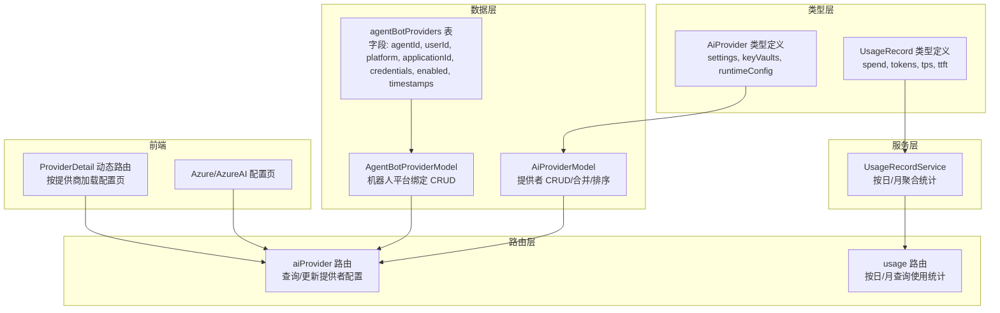
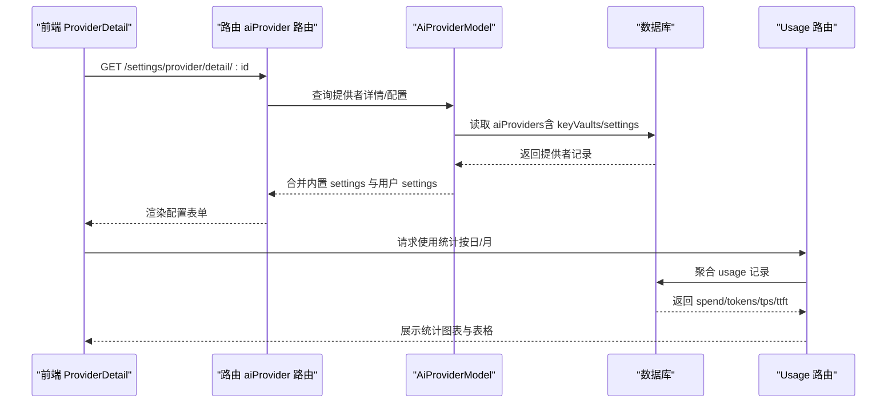
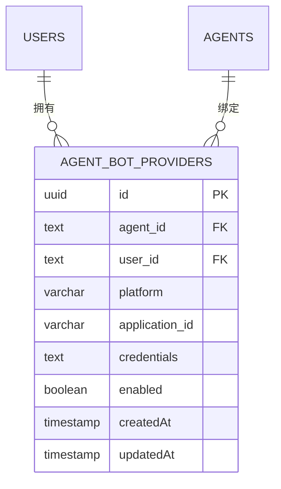
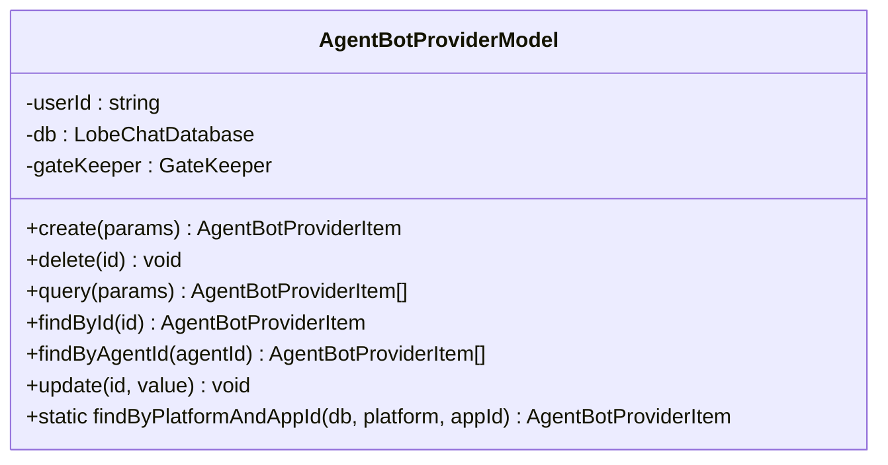
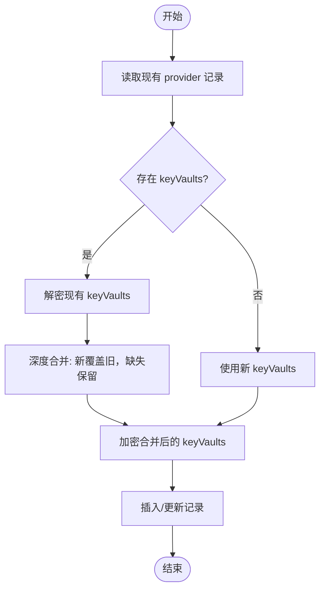
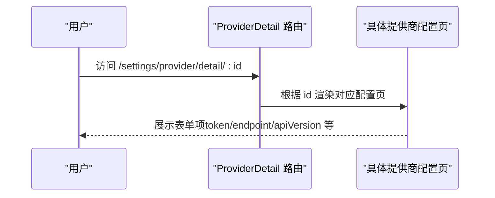
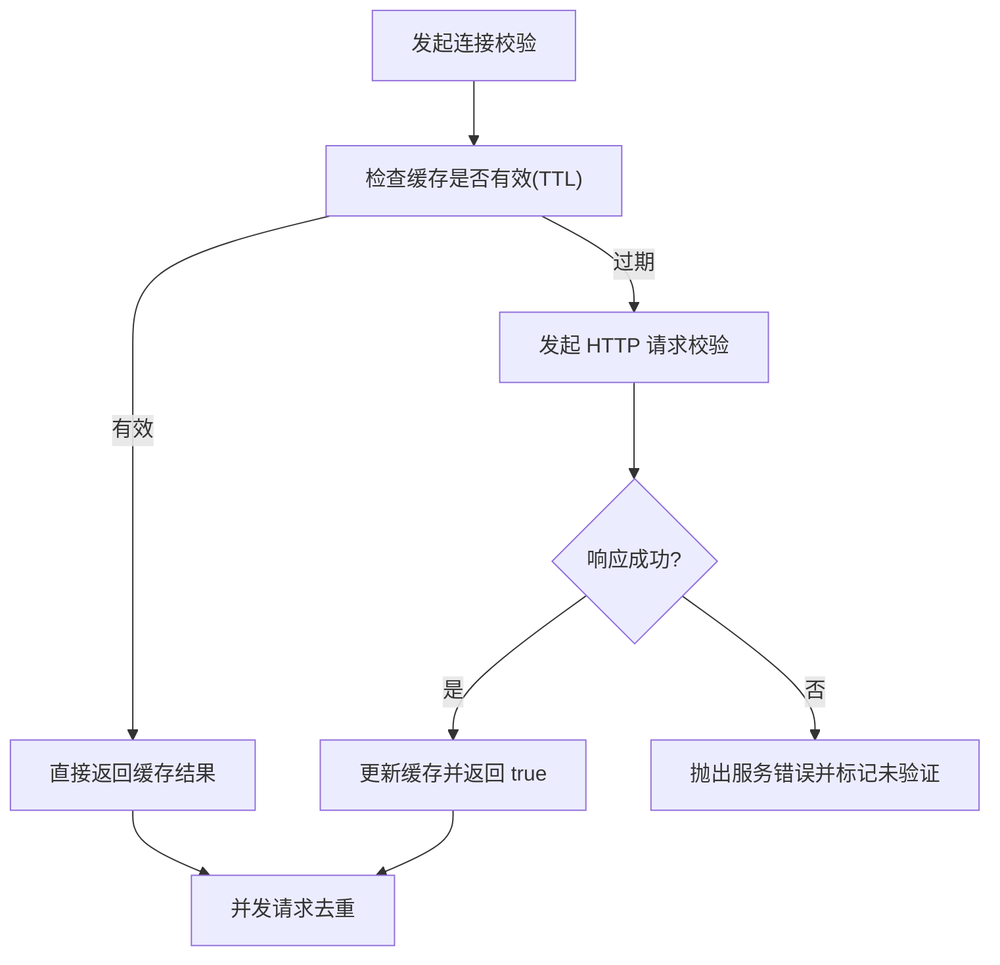
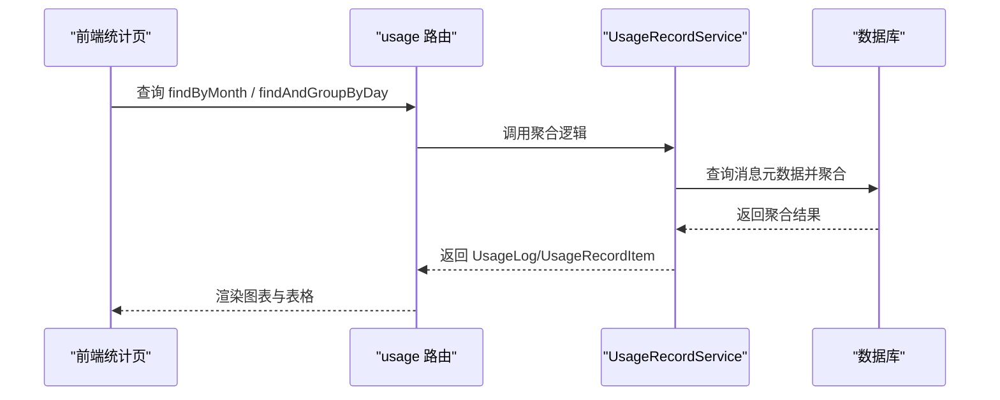
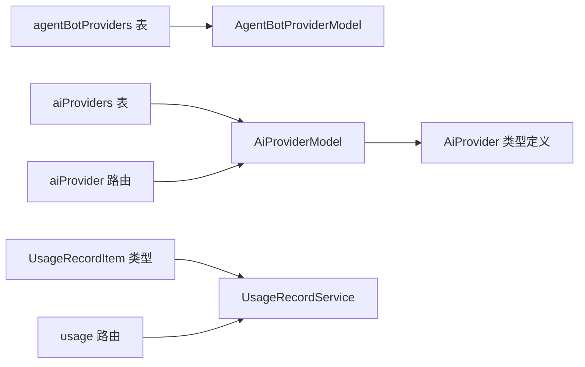

# Agent Bot 提供者模型

<cite>
**本文引用的文件**
- [packages/database/src/schemas/agentBotProvider.ts](file://packages/database/src/schemas/agentBotProvider.ts)
- [packages/database/src/models/agentBotProvider.ts](file://packages/database/src/models/agentBotProvider.ts)
- [packages/database/src/models/aiProvider.ts](file://packages/database/src/models/aiProvider.ts)
- [packages/types/src/aiProvider.ts](file://packages/types/src/aiProvider.ts)
- [src/server/routers/lambda/aiProvider.ts](file://src/server/routers/lambda/aiProvider.ts)
- [src/server/routers/lambda/usage.ts](file://src/server/routers/lambda/usage.ts)
- [src/server/services/usage/index.ts](file://src/server/services/usage/index.ts)
- [packages/types/src/usage/usageRecord.ts](file://packages/types/src/usage/usageRecord.ts)
- [src/routes/(main)/settings/provider/detail/index.tsx](file://src/routes/(main)/settings/provider/detail/index.tsx)
- [src/routes/(main)/settings/provider/detail/azure/index.tsx](file://src/routes/(main)/settings/provider/detail/azure/index.tsx)
- [src/routes/(main)/settings/provider/detail/azureai/index.tsx](file://src/routes/(main)/settings/provider/detail/azureai/index.tsx)
- [packages/model-runtime/src/utils/googleErrorParser.ts](file://packages/model-runtime/src/utils/googleErrorParser.ts)
- [packages/model-runtime/src/core/anthropicCompatibleFactory/index.ts](file://packages/model-runtime/src/core/anthropicCompatibleFactory/index.ts)
- [src/server/services/comfyui/__tests__/core/comfyUIConnectionService.test.ts](file://src/server/services/comfyui/__tests__/core/comfyUIConnectionService.test.ts)
- [src/routes/(main)/settings/skill/features/LobehubSkillItem.tsx](file://src/routes/(main)/settings/skill/features/LobehubSkillItem.tsx)
</cite>

## 目录

1. [简介](#简介)
2. [项目结构](#项目结构)
3. [核心组件](#核心组件)
4. [架构总览](#架构总览)
5. [详细组件分析](#详细组件分析)
6. [依赖关系分析](#依赖关系分析)
7. [性能考量](#性能考量)
8. [故障排查指南](#故障排查指南)
9. [结论](#结论)
10. [附录](#附录)

## 简介

本文件面向 Agent Bot 提供者模型，系统化梳理 agentBotProviders 表的数据结构与业务语义，解释提供者配置、认证信息、连接参数等核心字段，并覆盖以下主题：

- 不同 AI 提供商（OpenAI、Anthropic、Azure 等）在系统中的适配机制与配置管理
- 提供者的健康检查、缓存与重试策略（高可用）
- 计费管理、配额控制与使用统计（Usage）能力
- 提供者注册、配置、监控的完整数据流程
- 性能监控、错误处理与安全认证机制

## 项目结构

围绕 Agent Bot 提供者模型的关键代码分布在如下模块：

- 数据层：Drizzle ORM 表定义与模型封装
- 类型层：提供者与使用记录的接口定义
- 服务层：提供者配置更新、运行时合并、使用统计服务
- 路由层：提供者与使用统计的后端接口
- 前端：提供者详情页与配置表单（按提供商细分）

**图表来源**

- [packages/database/src/schemas/agentBotProvider.ts](file://packages/database/src/schemas/agentBotProvider.ts#L14-L47)
- [packages/database/src/models/agentBotProvider.ts](file://packages/database/src/models/agentBotProvider.ts#L16-L129)
- [packages/database/src/models/aiProvider.ts](file://packages/database/src/models/aiProvider.ts#L23-L298)
- [packages/types/src/aiProvider.ts](file://packages/types/src/aiProvider.ts#L262-L385)
- [src/server/routers/lambda/aiProvider.ts](file://src/server/routers/lambda/aiProvider.ts)
- [src/server/routers/lambda/usage.ts](file://src/server/routers/lambda/usage.ts#L1-L36)
- [src/server/services/usage/index.ts](file://src/server/services/usage/index.ts)
- [packages/types/src/usage/usageRecord.ts](file://packages/types/src/usage/usageRecord.ts#L3-L54)
- [src/routes/(main)/settings/provider/detail/index.tsx](<file://src/routes/(main)/settings/provider/detail/index.tsx#L58-L99>)
- [src/routes/(main)/settings/provider/detail/azure/index.tsx](<file://src/routes/(main)/settings/provider/detail/azure/index.tsx#L47-L101>)
- [src/routes/(main)/settings/provider/detail/azureai/index.tsx](<file://src/routes/(main)/settings/provider/detail/azureai/index.tsx#L17-L50>)

**章节来源**

- [packages/database/src/schemas/agentBotProvider.ts](file://packages/database/src/schemas/agentBotProvider.ts#L1-L53)
- [packages/database/src/models/agentBotProvider.ts](file://packages/database/src/models/agentBotProvider.ts#L16-L129)
- [packages/database/src/models/aiProvider.ts](file://packages/database/src/models/aiProvider.ts#L23-L298)
- [packages/types/src/aiProvider.ts](file://packages/types/src/aiProvider.ts#L262-L385)
- [src/server/routers/lambda/aiProvider.ts](file://src/server/routers/lambda/aiProvider.ts)
- [src/server/routers/lambda/usage.ts](file://src/server/routers/lambda/usage.ts#L1-L36)
- [src/server/services/usage/index.ts](file://src/server/services/usage/index.ts)
- [packages/types/src/usage/usageRecord.ts](file://packages/types/src/usage/usageRecord.ts#L3-L54)
- [src/routes/(main)/settings/provider/detail/index.tsx](<file://src/routes/(main)/settings/provider/detail/index.tsx#L58-L99>)
- [src/routes/(main)/settings/provider/detail/azure/index.tsx](<file://src/routes/(main)/settings/provider/detail/azure/index.tsx#L47-L101>)
- [src/routes/(main)/settings/provider/detail/azureai/index.tsx](<file://src/routes/(main)/settings/provider/detail/azureai/index.tsx#L17-L50>)

## 核心组件

- agentBotProviders 表：存储 “每个 Agent 的外部聊天平台机器人绑定”，用于 Webhook 路由（根据 platform + applicationId 定位 agent）
- AgentBotProviderModel：提供用户域内的增删改查、按 agentId 查询、启用状态切换、静态查询（跨用户）
- AiProviderModel：提供者配置模型，支持用户级 CRUD、内置 / 自定义源识别、密钥库合并、运行时配置合并
- UsageRecordService：按日 / 月聚合使用统计，输出 spend、tokens、tps、ttft 等指标
- ProviderDetail 动态路由：按提供商 ID 加载对应配置页面（如 Azure、AzureAI、OpenAI 等）

**章节来源**

- [packages/database/src/schemas/agentBotProvider.ts](file://packages/database/src/schemas/agentBotProvider.ts#L8-L47)
- [packages/database/src/models/agentBotProvider.ts](file://packages/database/src/models/agentBotProvider.ts#L29-L129)
- [packages/database/src/models/aiProvider.ts](file://packages/database/src/models/aiProvider.ts#L32-L292)
- [src/server/services/usage/index.ts](file://src/server/services/usage/index.ts)
- [src/routes/(main)/settings/provider/detail/index.tsx](<file://src/routes/(main)/settings/provider/detail/index.tsx#L58-L99>)

## 架构总览

Agent Bot 提供者模型贯穿 “数据层 — 类型层 — 服务层 — 路由层 — 前端” 的全链路，实现从配置到运行时的闭环。

**图表来源**

- [src/routes/(main)/settings/provider/detail/index.tsx](<file://src/routes/(main)/settings/provider/detail/index.tsx#L58-L99>)
- [src/server/routers/lambda/aiProvider.ts](file://src/server/routers/lambda/aiProvider.ts)
- [packages/database/src/models/aiProvider.ts](file://packages/database/src/models/aiProvider.ts#L197-L252)
- [src/server/routers/lambda/usage.ts](file://src/server/routers/lambda/usage.ts#L1-L36)
- [src/server/services/usage/index.ts](file://src/server/services/usage/index.ts)

## 详细组件分析

### 数据模型：agentBotProviders 表

- 字段设计目标
  - 平台标识 platform：如 discord、slack、feishu 等
  - 应用 / 机器人标识 applicationId：平台侧的 bot/app ID，用于 Webhook 路由
  - 绑定对象 agentId 与 userId：一对一关联到 agent 与用户
  - 凭证 credentials：加密存储（解密后为键值对，如 botToken、publicKey 等）
  - 启用开关 enabled：默认开启，支持禁用
  - 时间戳：createdAt/updatedAt
- 索引设计
  - 唯一索引：platform + applicationId，保证 webhook 路由唯一性
  - 普通索引：platform、agentId、userId，提升查询与过滤效率

**图表来源**

- [packages/database/src/schemas/agentBotProvider.ts](file://packages/database/src/schemas/agentBotProvider.ts#L14-L47)

**章节来源**

- [packages/database/src/schemas/agentBotProvider.ts](file://packages/database/src/schemas/agentBotProvider.ts#L8-L47)

### 模型封装：AgentBotProviderModel

- 用户域 CRUD
  - create：加密 credentials 后写入
  - query/findById/findByAgentId：按条件查询并解密 credentials
  - update：可单独更新非凭证字段；若传入 credentials 则重新加密
  - delete：按 userId 限定删除
- 静态方法
  - findByPlatformAndAppId：跨用户按 platform+applicationId 查找，用于 Webhook 路由

**图表来源**

- [packages/database/src/models/agentBotProvider.ts](file://packages/database/src/models/agentBotProvider.ts#L16-L129)

**章节来源**

- [packages/database/src/models/agentBotProvider.ts](file://packages/database/src/models/agentBotProvider.ts#L29-L129)

### 提供者配置模型：AiProviderModel

- 能力概览
  - 创建 / 删除 / 批量删除 / 查询 / 排序
  - 更新配置：支持合并 keyVaults（保留 OAuth 等长期令牌），并按需加密
  - 获取提供者详情：内置 provider settings 与用户 settings 合并
  - 运行时配置：返回 keyVaults、settings、config、fetchOnClient
- 关键点
  - 内置 / 自定义源识别：依据 DEFAULT_MODEL_PROVIDER_LIST 判定
  - 密钥合并策略：新旧 keyVaults 深度合并，避免覆盖已有 OAuth 令牌
  - 默认启用：新建 provider 默认启用

**图表来源**

- [packages/database/src/models/aiProvider.ts](file://packages/database/src/models/aiProvider.ts#L110-L156)

**章节来源**

- [packages/database/src/models/aiProvider.ts](file://packages/database/src/models/aiProvider.ts#L32-L292)
- [packages/types/src/aiProvider.ts](file://packages/types/src/aiProvider.ts#L262-L385)

### 提供者详情页与适配机制

- 动态路由：根据 id 分发到具体提供商配置页（如 azure、azureai、openai 等）
- Azure/AzureAI 配置页：展示 token、endpoint、apiVersion 等字段，统一通过 ProviderDetail 渲染

**图表来源**

- [src/routes/(main)/settings/provider/detail/index.tsx](<file://src/routes/(main)/settings/provider/detail/index.tsx#L58-L99>)
- [src/routes/(main)/settings/provider/detail/azure/index.tsx](<file://src/routes/(main)/settings/provider/detail/azure/index.tsx#L47-L101>)
- [src/routes/(main)/settings/provider/detail/azureai/index.tsx](<file://src/routes/(main)/settings/provider/detail/azureai/index.tsx#L17-L50>)

**章节来源**

- [src/routes/(main)/settings/provider/detail/index.tsx](<file://src/routes/(main)/settings/provider/detail/index.tsx#L58-L99>)
- [src/routes/(main)/settings/provider/detail/azure/index.tsx](<file://src/routes/(main)/settings/provider/detail/azure/index.tsx#L47-L101>)
- [src/routes/(main)/settings/provider/detail/azureai/index.tsx](<file://src/routes/(main)/settings/provider/detail/azureai/index.tsx#L17-L50>)

### 健康检查、缓存与高可用

- 健康检查
  - ComfyUI 连接服务：validateConnection 支持 TTL 缓存、并发请求去重、错误抛出与状态标记
  - OAuth 设备流轮询：LobehubSkillItem 中定时轮询授权状态，超时自动清理轮询
- 负载均衡与故障转移
  - 通过多提供者配置与运行时 settings 控制（如 showChecker、disableBrowserRequest 等）间接实现
  - 具体多实例 / 故障转移策略由各 SDK 实现（如 Anthropic、Google 等）
- 错误处理
  - Google 错误解析：优先解析 JSON 错误体，其次提取状态码，最后回退默认错误
  - Anthropic 兼容工厂：识别配额限制错误并映射为业务错误类型

**图表来源**

- [src/server/services/comfyui/**tests**/core/comfyUIConnectionService.test.ts](file://src/server/services/comfyui/__tests__/core/comfyUIConnectionService.test.ts#L88-L115)

**章节来源**

- [src/server/services/comfyui/**tests**/core/comfyUIConnectionService.test.ts](file://src/server/services/comfyui/__tests__/core/comfyUIConnectionService.test.ts#L88-L115)
- [src/routes/(main)/settings/skill/features/LobehubSkillItem.tsx](<file://src/routes/(main)/settings/skill/features/LobehubSkillItem.tsx#L71-L89>)
- [packages/model-runtime/src/utils/googleErrorParser.ts](file://packages/model-runtime/src/utils/googleErrorParser.ts#L257-L270)
- [packages/model-runtime/src/core/anthropicCompatibleFactory/index.ts](file://packages/model-runtime/src/core/anthropicCompatibleFactory/index.ts#L698-L715)

### 计费管理、配额控制与使用统计

- 使用统计模型
  - UsageRecordItem：包含 provider、model、spend、totalInputTokens、totalOutputTokens、totalTokens、tps、ttft、createdAt 等
  - UsageLog：按天分组的聚合记录
- 聚合服务
  - findAndGroupByDay：按日聚合请求次数、花费、token 数、TPS、TTFT
  - findByMonth：按月汇总
- 前端展示
  - UsageCards、UsageTrends、UsageTable：分别展示卡片、趋势图与明细表

**图表来源**

- [src/server/routers/lambda/usage.ts](file://src/server/routers/lambda/usage.ts#L16-L36)
- [src/server/services/usage/index.ts](file://src/server/services/usage/index.ts)
- [packages/types/src/usage/usageRecord.ts](file://packages/types/src/usage/usageRecord.ts#L3-L54)

**章节来源**

- [src/server/routers/lambda/usage.ts](file://src/server/routers/lambda/usage.ts#L1-L36)
- [src/server/services/usage/index.ts](file://src/server/services/usage/index.ts)
- [packages/types/src/usage/usageRecord.ts](file://packages/types/src/usage/usageRecord.ts#L3-L54)

### 安全认证与密钥管理

- 提供者密钥
  - AiProviderModel.updateConfig 支持 keyVaults 合并与加密存储，避免覆盖 OAuth 等长期令牌
  - 运行时通过 decryptor 解密 keyVaults，供 SDK 使用
- Agent Bot 凭证
  - AgentBotProviderModel.create/update 对 credentials 进行加密 / 解密，防止明文泄露
- OAuth 设备流
  - ProviderConfig 支持 OAuthDeviceFlowAuth，LobehubSkillItem 中定时轮询授权状态

**章节来源**

- [packages/database/src/models/aiProvider.ts](file://packages/database/src/models/aiProvider.ts#L110-L156)
- [packages/database/src/models/agentBotProvider.ts](file://packages/database/src/models/agentBotProvider.ts#L34-L102)
- [src/routes/(main)/settings/provider/features/ProviderConfig/index.tsx](<file://src/routes/(main)/settings/provider/features/ProviderConfig/index.tsx#L482-L513>)
- [src/routes/(main)/settings/skill/features/LobehubSkillItem.tsx](<file://src/routes/(main)/settings/skill/features/LobehubSkillItem.tsx#L71-L89>)

## 依赖关系分析

- 数据层依赖
  - agentBotProviders 表依赖 agents 与 users 外键，确保数据完整性
  - AiProviderModel 依赖 DEFAULT_MODEL_PROVIDER_LIST 识别内置提供者
- 类型层依赖
  - AiProviderDetailItem/AiProviderRuntimeConfig 依赖 AiProviderSettings/AiProviderSDKType
  - UsageRecordItem 依赖 MessageMetadata
- 服务层依赖
  - UsageRecordService 依赖消息元数据进行聚合
- 路由层依赖
  - aiProvider 路由依赖 AiProviderModel
  - usage 路由依赖 UsageRecordService

**图表来源**

- [packages/database/src/schemas/agentBotProvider.ts](file://packages/database/src/schemas/agentBotProvider.ts#L14-L47)
- [packages/database/src/models/agentBotProvider.ts](file://packages/database/src/models/agentBotProvider.ts#L16-L129)
- [packages/database/src/models/aiProvider.ts](file://packages/database/src/models/aiProvider.ts#L23-L298)
- [packages/types/src/aiProvider.ts](file://packages/types/src/aiProvider.ts#L262-L385)
- [packages/types/src/usage/usageRecord.ts](file://packages/types/src/usage/usageRecord.ts#L3-L54)
- [src/server/routers/lambda/aiProvider.ts](file://src/server/routers/lambda/aiProvider.ts)
- [src/server/routers/lambda/usage.ts](file://src/server/routers/lambda/usage.ts#L1-L36)

**章节来源**

- [packages/database/src/schemas/agentBotProvider.ts](file://packages/database/src/schemas/agentBotProvider.ts#L14-L47)
- [packages/database/src/models/agentBotProvider.ts](file://packages/database/src/models/agentBotProvider.ts#L16-L129)
- [packages/database/src/models/aiProvider.ts](file://packages/database/src/models/aiProvider.ts#L23-L298)
- [packages/types/src/aiProvider.ts](file://packages/types/src/aiProvider.ts#L262-L385)
- [packages/types/src/usage/usageRecord.ts](file://packages/types/src/usage/usageRecord.ts#L3-L54)
- [src/server/routers/lambda/aiProvider.ts](file://src/server/routers/lambda/aiProvider.ts)
- [src/server/routers/lambda/usage.ts](file://src/server/routers/lambda/usage.ts#L1-L36)

## 性能考量

- 数据访问
  - agentBotProviders 表建立唯一索引与多列索引，优化 webhook 路由与查询性能
  - AiProviderModel 使用事务删除 provider 及其模型，减少不一致风险
- 运行时配置
  - AiProviderModel.getAiProviderRuntimeConfig 合并内置与用户 settings，避免重复计算
- 健康检查
  - ComfyUI 连接服务采用 TTL 缓存与并发去重，降低重复请求开销
- 统计聚合
  - UsageRecordService 按日 / 月聚合，前端分页展示，避免一次性渲染大量数据

\[本节为通用指导，无需列出具体文件来源]

## 故障排查指南

- 提供者配置无法保存或密钥丢失
  - 检查 AiProviderModel.updateConfig 的 keyVaults 合并与加密流程
  - 确认 decryptor 正常工作，避免解密失败导致回退空值
- Agent Bot 凭证无效
  - 确认 AgentBotProviderModel 在 create/update 时正确加密 / 解密 credentials
  - 若解密失败，将返回空 credentials，需重新配置
- 健康检查失败
  - ComfyUI validateConnection 抛错时会标记未验证；检查网络、鉴权头与 TTL 设置
  - OAuth 设备流轮询：确认轮询间隔与超时设置合理
- 使用统计异常
  - 检查消息元数据字段是否为空，服务端已做空字段保护
  - 确认路由输入参数（月份）格式正确

**章节来源**

- [packages/database/src/models/aiProvider.ts](file://packages/database/src/models/aiProvider.ts#L110-L156)
- [packages/database/src/models/agentBotProvider.ts](file://packages/database/src/models/agentBotProvider.ts#L34-L102)
- [src/server/services/comfyui/**tests**/core/comfyUIConnectionService.test.ts](file://src/server/services/comfyui/__tests__/core/comfyUIConnectionService.test.ts#L117-L127)
- [src/routes/(main)/settings/skill/features/LobehubSkillItem.tsx](<file://src/routes/(main)/settings/skill/features/LobehubSkillItem.tsx#L71-L89>)
- [src/server/services/usage/index.ts](file://src/server/services/usage/index.ts#L101-L127)

## 结论

Agent Bot 提供者模型通过明确的数据表结构、完善的模型封装与类型定义，实现了：

- 提供者配置与密钥的安全存储与运行时合并
- Webhook 路由所需的平台绑定与凭证管理
- 健康检查、缓存与轮询的高可用机制
- 使用统计的聚合与可视化展示
  建议在生产环境中：
- 强化密钥轮换与审计日志
- 为关键 SDK 增加更细粒度的熔断与降级策略
- 扩展配额与费用阈值告警机制

\[本节为总结性内容，无需列出具体文件来源]

## 附录

- 关键流程路径参考
  - 提供者注册与配置：[packages/database/src/models/aiProvider.ts](file://packages/database/src/models/aiProvider.ts#L32-L52)
  - 提供者详情页路由：[src/routes/(main)/settings/provider/detail/index.tsx](<file://src/routes/(main)/settings/provider/detail/index.tsx#L58-L99>)
  - 使用统计路由与服务：[src/server/routers/lambda/usage.ts](file://src/server/routers/lambda/usage.ts#L16-L36), [src/server/services/usage/index.ts](file://src/server/services/usage/index.ts)
  - Agent Bot 绑定模型：[packages/database/src/models/agentBotProvider.ts](file://packages/database/src/models/agentBotProvider.ts#L29-L108)

\[本节为补充说明，无需列出具体文件来源]
