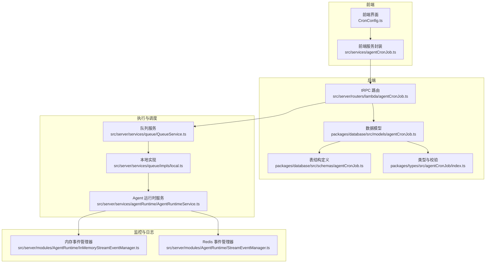
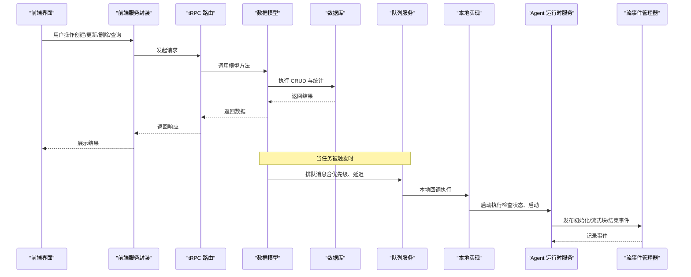
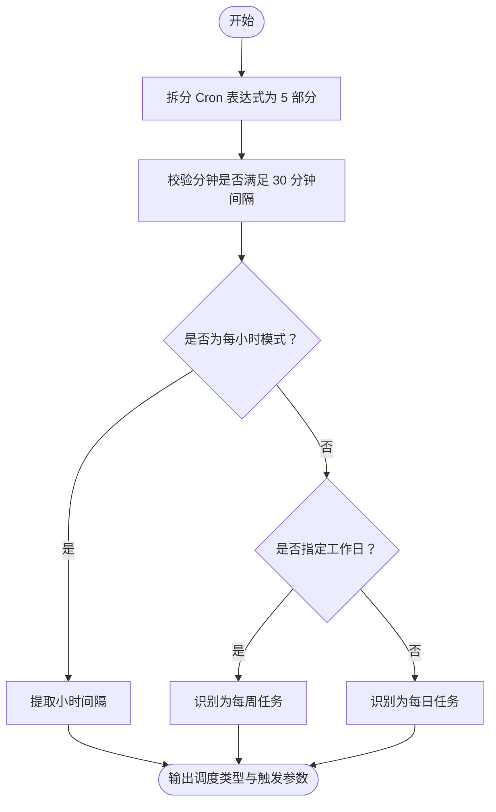
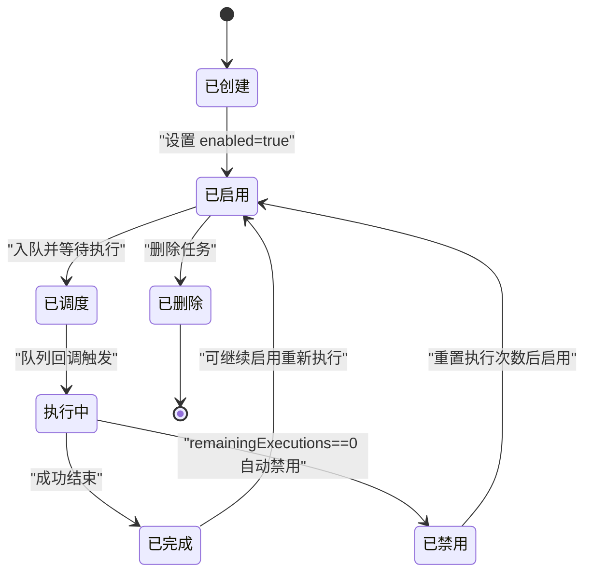
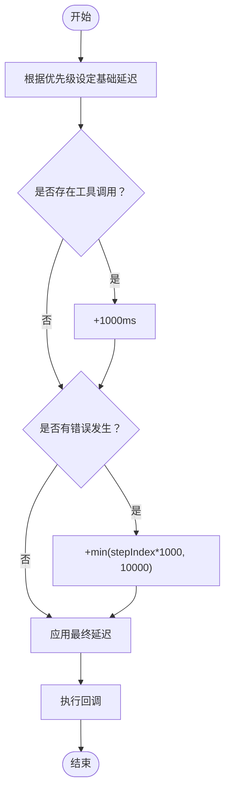
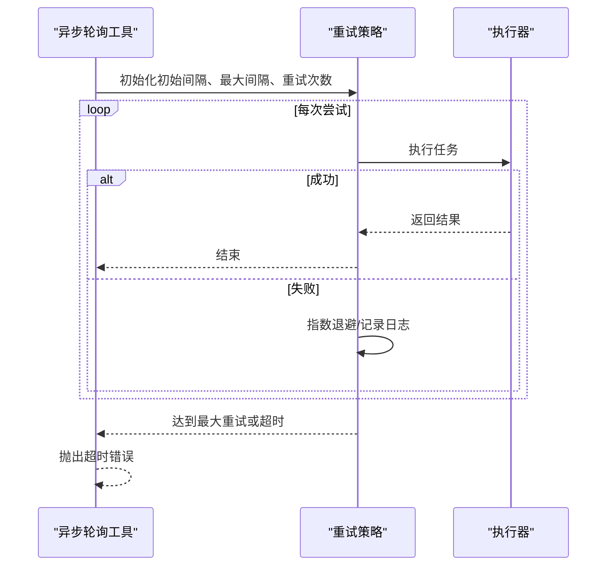
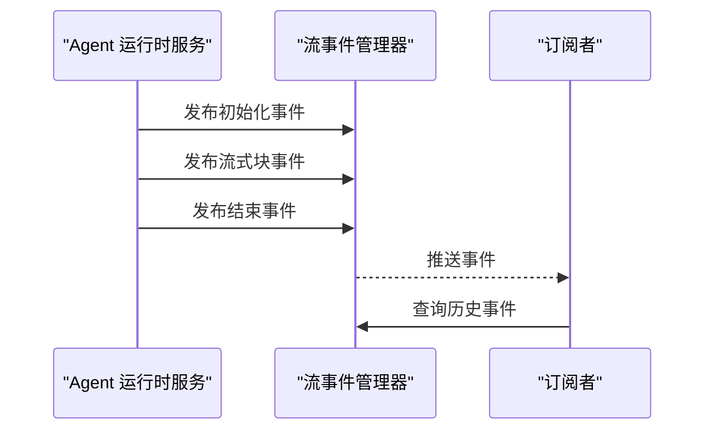
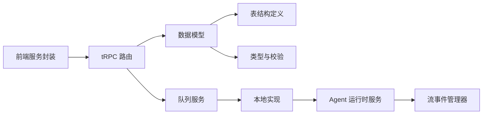

# Agent 定时任务模型

<cite>
**本文档引用的文件**
- [packages/database/src/schemas/agentCronJob.ts](file://packages/database/src/schemas/agentCronJob.ts)
- [packages/database/src/models/agentCronJob.ts](file://packages/database/src/models/agentCronJob.ts)
- [src/server/routers/lambda/agentCronJob.ts](file://src/server/routers/lambda/agentCronJob.ts)
- [src/services/agentCronJob.ts](file://src/services/agentCronJob.ts)
- [packages/types/src/agentCronJob/index.ts](file://packages/types/src/agentCronJob/index.ts)
- [src/routes/(main)/agent/cron/[cronId]/CronConfig.ts](file://src/routes/(main)/agent/cron/[cronId]/CronConfig.ts)
- [src/server/services/queue/QueueService.ts](file://src/server/services/queue/QueueService.ts)
- [src/server/services/queue/impls/local.ts](file://src/server/services/queue/impls/local.ts)
- [src/server/services/agentRuntime/AgentRuntimeService.ts](file://src/server/services/agentRuntime/AgentRuntimeService.ts)
- [src/server/modules/AgentRuntime/InMemoryStreamEventManager.ts](file://src/server/modules/AgentRuntime/InMemoryStreamEventManager.ts)
- [src/server/modules/AgentRuntime/StreamEventManager.ts](file://src/server/modules/AgentRuntime/StreamEventManager.ts)
- [packages/model-runtime/src/utils/asyncifyPolling.ts](file://packages/model-runtime/src/utils/asyncifyPolling.ts)
</cite>

## 目录

1. [简介](#简介)
2. [项目结构](#项目结构)
3. [核心组件](#核心组件)
4. [架构总览](#架构总览)
5. [详细组件分析](#详细组件分析)
6. [依赖关系分析](#依赖关系分析)
7. [性能考量](#性能考量)
8. [故障排查指南](#故障排查指南)
9. [结论](#结论)
10. [附录](#附录)

## 简介

本文件系统性梳理 Agent 定时任务模型（agentCronJobs）的数据结构、调度与执行机制、生命周期管理、可靠性保障（重试、失败处理、超时）、监控与日志、并发与资源控制等关键能力。目标是帮助开发者与运维人员快速理解并高效使用该模型。

## 项目结构

围绕 Agent 定时任务模型的关键文件分布如下：

- 数据库层：表结构定义与模型方法
- 类型与校验：Zod 校验与最小间隔约束
- 服务层：前端调用封装与后端路由
- 调度与执行：队列服务、本地执行回调、运行时服务
- 监控与日志：流事件管理器（内存与 Redis）

**图表来源**

- [src/routes/(main)/agent/cron/\[cronId\]/CronConfig.ts](<file://src/routes/(main)/agent/cron/[cronId]/CronConfig.ts#L84-L145>)
- [src/services/agentCronJob.ts](file://src/services/agentCronJob.ts#L1-L95)
- [src/server/routers/lambda/agentCronJob.ts](file://src/server/routers/lambda/agentCronJob.ts#L180-L231)
- [packages/database/src/models/agentCronJob.ts](file://packages/database/src/models/agentCronJob.ts#L1-L311)
- [packages/database/src/schemas/agentCronJob.ts](file://packages/database/src/schemas/agentCronJob.ts#L1-L73)
- [packages/types/src/agentCronJob/index.ts](file://packages/types/src/agentCronJob/index.ts#L1-L112)
- [src/server/services/queue/QueueService.ts](file://src/server/services/queue/QueueService.ts#L1-L109)
- [src/server/services/queue/impls/local.ts](file://src/server/services/queue/impls/local.ts#L1-L113)
- [src/server/services/agentRuntime/AgentRuntimeService.ts](file://src/server/services/agentRuntime/AgentRuntimeService.ts#L1165-L1197)
- [src/server/modules/AgentRuntime/InMemoryStreamEventManager.ts](file://src/server/modules/AgentRuntime/InMemoryStreamEventManager.ts#L1-L215)
- [src/server/modules/AgentRuntime/StreamEventManager.ts](file://src/server/modules/AgentRuntime/StreamEventManager.ts#L102-L152)

**章节来源**

- [packages/database/src/schemas/agentCronJob.ts](file://packages/database/src/schemas/agentCronJob.ts#L1-L73)
- [packages/database/src/models/agentCronJob.ts](file://packages/database/src/models/agentCronJob.ts#L1-L311)
- [packages/types/src/agentCronJob/index.ts](file://packages/types/src/agentCronJob/index.ts#L1-L112)
- [src/server/routers/lambda/agentCronJob.ts](file://src/server/routers/lambda/agentCronJob.ts#L180-L231)
- [src/services/agentCronJob.ts](file://src/services/agentCronJob.ts#L1-L95)
- [src/server/services/queue/QueueService.ts](file://src/server/services/queue/QueueService.ts#L1-L109)
- [src/server/services/queue/impls/local.ts](file://src/server/services/queue/impls/local.ts#L1-L113)
- [src/server/services/agentRuntime/AgentRuntimeService.ts](file://src/server/services/agentRuntime/AgentRuntimeService.ts#L1165-L1197)
- [src/server/modules/AgentRuntime/InMemoryStreamEventManager.ts](file://src/server/modules/AgentRuntime/InMemoryStreamEventManager.ts#L1-L215)
- [src/server/modules/AgentRuntime/StreamEventManager.ts](file://src/server/modules/AgentRuntime/StreamEventManager.ts#L102-L152)

## 核心组件

- 数据表与类型
  - 表名：agent_cron_jobs
  - 关键字段：任务标识、所属用户 / 代理 / 群组、启用状态、Cron 表达式、时区、内容、执行次数上限与剩余次数、执行条件（JSONB）、最近执行时间、累计执行次数、时间戳
  - 索引：agent_id、group_id、user_id、enabled、remaining_executions、last_executed_at
- 模型方法
  - 创建、查询、更新、删除、批量更新状态、分页查询、统计、近将耗尽任务查询、执行统计
- 类型与校验
  - Cron 表达式正则校验、最小 30 分钟间隔约束、执行条件（每日最大次数、时间范围、工作日）
- 前端服务与路由
  - tRPC 路由封装，提供创建、查询、列表、更新、删除、统计、近将耗尽任务、批量状态更新等接口
- 调度与执行
  - 队列服务（本地 / 生产可切换），延迟计算策略（优先级、工具调用、错误指数退避）
  - Agent 运行时服务启动执行、状态检查与错误格式化
- 监控与日志
  - 流事件管理器（内存 / Redis），发布初始化、步骤流式块、结束事件，支持订阅与历史查询

**章节来源**

- [packages/database/src/schemas/agentCronJob.ts](file://packages/database/src/schemas/agentCronJob.ts#L10-L63)
- [packages/database/src/models/agentCronJob.ts](file://packages/database/src/models/agentCronJob.ts#L21-L311)
- [packages/types/src/agentCronJob/index.ts](file://packages/types/src/agentCronJob/index.ts#L13-L112)
- [src/server/routers/lambda/agentCronJob.ts](file://src/server/routers/lambda/agentCronJob.ts#L180-L231)
- [src/services/agentCronJob.ts](file://src/services/agentCronJob.ts#L1-L95)
- [src/server/services/queue/QueueService.ts](file://src/server/services/queue/QueueService.ts#L73-L109)
- [src/server/services/agentRuntime/AgentRuntimeService.ts](file://src/server/services/agentRuntime/AgentRuntimeService.ts#L1165-L1197)
- [src/server/modules/AgentRuntime/InMemoryStreamEventManager.ts](file://src/server/modules/AgentRuntime/InMemoryStreamEventManager.ts#L24-L122)
- [src/server/modules/AgentRuntime/StreamEventManager.ts](file://src/server/modules/AgentRuntime/StreamEventManager.ts#L131-L152)

## 架构总览

Agent 定时任务从 “配置 — 调度 — 执行 — 统计” 的闭环流程如下：

**图表来源**

- [src/services/agentCronJob.ts](file://src/services/agentCronJob.ts#L1-L95)
- [src/server/routers/lambda/agentCronJob.ts](file://src/server/routers/lambda/agentCronJob.ts#L180-L231)
- [packages/database/src/models/agentCronJob.ts](file://packages/database/src/models/agentCronJob.ts#L67-L78)
- [src/server/services/queue/QueueService.ts](file://src/server/services/queue/QueueService.ts#L38-L47)
- [src/server/services/queue/impls/local.ts](file://src/server/services/queue/impls/local.ts#L39-L78)
- [src/server/services/agentRuntime/AgentRuntimeService.ts](file://src/server/services/agentRuntime/AgentRuntimeService.ts#L1165-L1197)
- [src/server/modules/AgentRuntime/InMemoryStreamEventManager.ts](file://src/server/modules/AgentRuntime/InMemoryStreamEventManager.ts#L24-L106)

## 详细组件分析

### 数据模型与字段设计

- 字段概览
  - 标识与归属：id、agentId、groupId、userId
  - 任务信息：name、description
  - 配置：enabled、cronPattern、timezone
  - 内容：content、editData（JSONB）
  - 执行计数：maxExecutions（可空表示无限）、remainingExecutions（同上）
  - 执行条件：executionConditions（JSONB，包含每日最大次数、时间范围、工作日）
  - 统计：lastExecutedAt、totalExecutions
  - 时间戳：createdAt、updatedAt
- 设计要点
  - 外键级联删除（代理 / 群组 / 用户）
  - 多索引优化查询（按 agent/group/user/enabled/remaining_executions/last_executed_at）
  - JSONB 存储灵活的执行条件
  - remainingExecutions 与 maxExecutions 的一致性维护（创建与更新时同步）

**章节来源**

- [packages/database/src/schemas/agentCronJob.ts](file://packages/database/src/schemas/agentCronJob.ts#L10-L63)
- [packages/database/src/models/agentCronJob.ts](file://packages/database/src/models/agentCronJob.ts#L21-L35)
- [packages/database/src/models/agentCronJob.ts](file://packages/database/src/models/agentCronJob.ts#L80-L116)
- [packages/database/src/models/agentCronJob.ts](file://packages/database/src/models/agentCronJob.ts#L129-L188)

### Cron 表达式解析与执行机制

- 解析逻辑
  - 将表达式拆分为 5 个部分（分钟、小时、日、月、周），支持标准格式与部分通配符
  - 提取调度类型（每小时、每日、每周）与触发时刻（小时、分钟、工作日）
  - 对分钟进行归一化（30 分钟间隔）
- 执行策略
  - 通过模型静态方法筛选 enabled 且 remainingExecutions > 0 或为 NULL 的任务
  - 更新 lastExecutedAt、totalExecutions，并在 remainingExecutions 减至 0 时自动禁用任务
- 最小间隔约束
  - 使用 Zod 校验确保最小 30 分钟间隔，支持多种合法模式（每 N 分钟、每小时、特定小时等）

**图表来源**

- [src/routes/(main)/agent/cron/\[cronId\]/CronConfig.ts](<file://src/routes/(main)/agent/cron/[cronId]/CronConfig.ts#L88-L145>)
- [packages/types/src/agentCronJob/index.ts](file://packages/types/src/agentCronJob/index.ts#L21-L72)
- [packages/database/src/models/agentCronJob.ts](file://packages/database/src/models/agentCronJob.ts#L67-L78)
- [packages/database/src/models/agentCronJob.ts](file://packages/database/src/models/agentCronJob.ts#L129-L167)

**章节来源**

- [src/routes/(main)/agent/cron/\[cronId\]/CronConfig.ts](<file://src/routes/(main)/agent/cron/[cronId]/CronConfig.ts#L84-L145>)
- [packages/types/src/agentCronJob/index.ts](file://packages/types/src/agentCronJob/index.ts#L13-L72)
- [packages/database/src/models/agentCronJob.ts](file://packages/database/src/models/agentCronJob.ts#L67-L78)
- [packages/database/src/models/agentCronJob.ts](file://packages/database/src/models/agentCronJob.ts#L129-L167)

### 任务生命周期管理

- 创建：写入基础字段，remainingExecutions 初始化为 maxExecutions；默认启用
- 调度：系统扫描 enabled 且未达上限的任务，按规则入队
- 执行：队列回调触发 Agent 运行时服务启动执行，检查状态并格式化错误
- 完成：更新统计字段，必要时自动禁用任务
- 删除：级联删除（表结构已定义）

**图表来源**

- [packages/database/src/models/agentCronJob.ts](file://packages/database/src/models/agentCronJob.ts#L21-L35)
- [packages/database/src/models/agentCronJob.ts](file://packages/database/src/models/agentCronJob.ts#L67-L78)
- [packages/database/src/models/agentCronJob.ts](file://packages/database/src/models/agentCronJob.ts#L129-L167)
- [src/server/services/agentRuntime/AgentRuntimeService.ts](file://src/server/services/agentRuntime/AgentRuntimeService.ts#L1165-L1197)

**章节来源**

- [packages/database/src/models/agentCronJob.ts](file://packages/database/src/models/agentCronJob.ts#L21-L35)
- [packages/database/src/models/agentCronJob.ts](file://packages/database/src/models/agentCronJob.ts#L67-L78)
- [packages/database/src/models/agentCronJob.ts](file://packages/database/src/models/agentCronJob.ts#L129-L167)
- [src/server/services/agentRuntime/AgentRuntimeService.ts](file://src/server/services/agentRuntime/AgentRuntimeService.ts#L1165-L1197)

### 调度算法与优先级管理

- 延迟计算
  - 基础延迟：高优先级 200ms、普通 1000ms、低 5000ms
  - 工具调用：额外 +1000ms
  - 错误退避：+min (stepIndex\*1000, 10000)，避免连续失败
- 本地执行
  - 使用 setTimeout 实现异步步骤执行，允许事件循环继续
  - 不支持取消已计划任务（本地模式）

**图表来源**

- [src/server/services/queue/QueueService.ts](file://src/server/services/queue/QueueService.ts#L73-L109)
- [src/server/services/queue/impls/local.ts](file://src/server/services/queue/impls/local.ts#L39-L78)

**章节来源**

- [src/server/services/queue/QueueService.ts](file://src/server/services/queue/QueueService.ts#L73-L109)
- [src/server/services/queue/impls/local.ts](file://src/server/services/queue/impls/local.ts#L39-L78)

### 可靠性保障：重试、失败处理、超时控制

- 重试与超时
  - 异步轮询工具支持指数退避、最大重试次数、超时抛错
- 失败处理
  - Agent 运行时服务统一错误格式化，区分不同错误类型
  - 队列实现对回调异常进行日志记录但不中断流程
- 超时控制
  - 轮询工具在达到最大尝试次数后抛出超时错误

**图表来源**

- [packages/model-runtime/src/utils/asyncifyPolling.ts](file://packages/model-runtime/src/utils/asyncifyPolling.ts#L168-L198)

**章节来源**

- [packages/model-runtime/src/utils/asyncifyPolling.ts](file://packages/model-runtime/src/utils/asyncifyPolling.ts#L168-L198)
- [src/server/services/agentRuntime/AgentRuntimeService.ts](file://src/server/services/agentRuntime/AgentRuntimeService.ts#L48-L79)
- [src/server/services/queue/impls/local.ts](file://src/server/services/queue/impls/local.ts#L61-L75)

### 任务监控、日志记录与性能统计

- 流事件管理
  - 内存实现：发布初始化、流式块、结束事件，支持订阅、历史查询、清理
  - Redis 实现：基于 XADD 持久化，带过期时间与性能计时
- 性能统计
  - 模型提供执行统计接口，返回活动任务数、已完成执行数、待执行数、任务总数
- 日志
  - 调试日志贯穿队列、运行时、事件管理器各环节

**图表来源**

- [src/server/modules/AgentRuntime/InMemoryStreamEventManager.ts](file://src/server/modules/AgentRuntime/InMemoryStreamEventManager.ts#L24-L122)
- [src/server/modules/AgentRuntime/StreamEventManager.ts](file://src/server/modules/AgentRuntime/StreamEventManager.ts#L131-L152)
- [src/server/routers/lambda/agentCronJob.ts](file://src/server/routers/lambda/agentCronJob.ts#L226-L231)

**章节来源**

- [src/server/modules/AgentRuntime/InMemoryStreamEventManager.ts](file://src/server/modules/AgentRuntime/InMemoryStreamEventManager.ts#L24-L122)
- [src/server/modules/AgentRuntime/StreamEventManager.ts](file://src/server/modules/AgentRuntime/StreamEventManager.ts#L102-L152)
- [src/server/routers/lambda/agentCronJob.ts](file://src/server/routers/lambda/agentCronJob.ts#L226-L231)

### 并发控制、资源限制与异常恢复

- 并发控制
  - 本地实现通过 setTimeout 允许事件循环继续，避免阻塞；不支持取消已计划任务
  - 队列延迟策略结合优先级与错误退避，降低并发压力
- 资源限制
  - 流事件长度限制（内存实现），防止内存溢出
  - 执行统计接口用于监控整体负载
- 异常恢复
  - 队列回调异常仅记录日志，不影响其他任务
  - 运行时服务对错误进行格式化，便于上层处理

**章节来源**

- [src/server/services/queue/impls/local.ts](file://src/server/services/queue/impls/local.ts#L49-L75)
- [src/server/modules/AgentRuntime/InMemoryStreamEventManager.ts](file://src/server/modules/AgentRuntime/InMemoryStreamEventManager.ts#L46-L49)
- [src/server/services/agentRuntime/AgentRuntimeService.ts](file://src/server/services/agentRuntime/AgentRuntimeService.ts#L48-L79)

## 依赖关系分析

- 组件耦合
  - 前端服务封装依赖 tRPC 路由；路由依赖数据模型；模型依赖表结构与类型
  - 队列服务与本地实现解耦，通过接口抽象；运行时服务依赖队列服务与事件管理器
- 外部依赖
  - Drizzle ORM 用于数据库访问
  - Zod 用于输入校验
  - Redis（可选）用于生产环境事件持久化

**图表来源**

- [src/services/agentCronJob.ts](file://src/services/agentCronJob.ts#L1-L95)
- [src/server/routers/lambda/agentCronJob.ts](file://src/server/routers/lambda/agentCronJob.ts#L180-L231)
- [packages/database/src/models/agentCronJob.ts](file://packages/database/src/models/agentCronJob.ts#L1-L311)
- [packages/database/src/schemas/agentCronJob.ts](file://packages/database/src/schemas/agentCronJob.ts#L1-L73)
- [packages/types/src/agentCronJob/index.ts](file://packages/types/src/agentCronJob/index.ts#L1-L112)
- [src/server/services/queue/QueueService.ts](file://src/server/services/queue/QueueService.ts#L1-L47)
- [src/server/services/queue/impls/local.ts](file://src/server/services/queue/impls/local.ts#L1-L113)
- [src/server/services/agentRuntime/AgentRuntimeService.ts](file://src/server/services/agentRuntime/AgentRuntimeService.ts#L1-L200)
- [src/server/modules/AgentRuntime/InMemoryStreamEventManager.ts](file://src/server/modules/AgentRuntime/InMemoryStreamEventManager.ts#L1-L215)

**章节来源**

- [src/services/agentCronJob.ts](file://src/services/agentCronJob.ts#L1-L95)
- [src/server/routers/lambda/agentCronJob.ts](file://src/server/routers/lambda/agentCronJob.ts#L180-L231)
- [packages/database/src/models/agentCronJob.ts](file://packages/database/src/models/agentCronJob.ts#L1-L311)
- [packages/database/src/schemas/agentCronJob.ts](file://packages/database/src/schemas/agentCronJob.ts#L1-L73)
- [packages/types/src/agentCronJob/index.ts](file://packages/types/src/agentCronJob/index.ts#L1-L112)
- [src/server/services/queue/QueueService.ts](file://src/server/services/queue/QueueService.ts#L1-L47)
- [src/server/services/queue/impls/local.ts](file://src/server/services/queue/impls/local.ts#L1-L113)
- [src/server/services/agentRuntime/AgentRuntimeService.ts](file://src/server/services/agentRuntime/AgentRuntimeService.ts#L1-L200)
- [src/server/modules/AgentRuntime/InMemoryStreamEventManager.ts](file://src/server/modules/AgentRuntime/InMemoryStreamEventManager.ts#L1-L215)

## 性能考量

- 数据库层面
  - 合理使用索引（enabled、remaining_executions、last_executed_at）提升查询效率
  - 批量更新状态与分页查询减少单次负载
- 执行层面
  - 延迟策略与错误退避避免热点时段拥塞
  - 本地实现适合开发测试，生产建议使用队列实现以获得更好的隔离与弹性
- 监控层面
  - 利用执行统计接口与流事件历史进行容量与性能评估

\[本节为通用指导，无需具体文件分析]

## 故障排查指南

- 常见问题定位
  - 任务未执行：检查 enabled 状态、remainingExecutions 是否为 0、Cron 表达式是否符合最小间隔要求
  - 执行统计异常：确认用户上下文与 userId 绑定是否正确
  - 队列回调失败：查看本地实现日志，确认回调注入与执行链路
  - 超时错误：检查轮询工具的重试与超时配置
- 排查步骤
  - 核对表结构与索引
  - 使用 tRPC 路由查询任务详情与统计
  - 查看运行时服务日志与流事件历史
  - 在本地模式下验证队列回调行为

**章节来源**

- [packages/database/src/models/agentCronJob.ts](file://packages/database/src/models/agentCronJob.ts#L206-L244)
- [src/server/routers/lambda/agentCronJob.ts](file://src/server/routers/lambda/agentCronJob.ts#L180-L231)
- [src/server/services/queue/impls/local.ts](file://src/server/services/queue/impls/local.ts#L61-L75)
- [packages/model-runtime/src/utils/asyncifyPolling.ts](file://packages/model-runtime/src/utils/asyncifyPolling.ts#L168-L198)

## 结论

Agent 定时任务模型通过清晰的数据结构、严格的校验与索引、灵活的调度与执行机制、完善的监控与日志体系，实现了从创建到完成的全生命周期管理。配合优先级与退避策略，能够在保证可靠性的同时兼顾性能与可维护性。建议在生产环境中采用队列实现与 Redis 事件管理器，并结合执行统计与流事件进行持续观测与优化。

\[本节为总结性内容，无需具体文件分析]

## 附录

- 关键接口与路径
  - 创建任务：/api/agentCronJob/create
  - 查询任务：/api/agentCronJob/findByAgent
  - 获取统计：/api/agentCronJob/getStats
  - 近将耗尽任务：/api/agentCronJob/getNearDepletion
  - 批量更新状态：/api/agentCronJob/batchUpdateStatus
- 相关类型与校验
  - Cron 表达式与最小间隔校验
  - 执行条件（每日最大次数、时间范围、工作日）

**章节来源**

- [src/server/routers/lambda/agentCronJob.ts](file://src/server/routers/lambda/agentCronJob.ts#L180-L231)
- [packages/types/src/agentCronJob/index.ts](file://packages/types/src/agentCronJob/index.ts#L13-L112)
