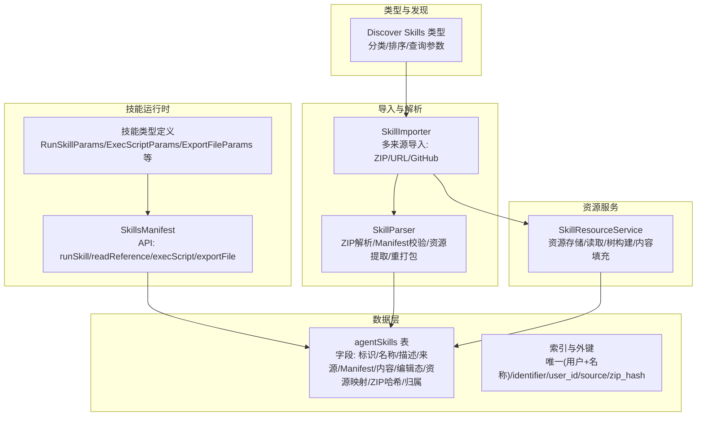
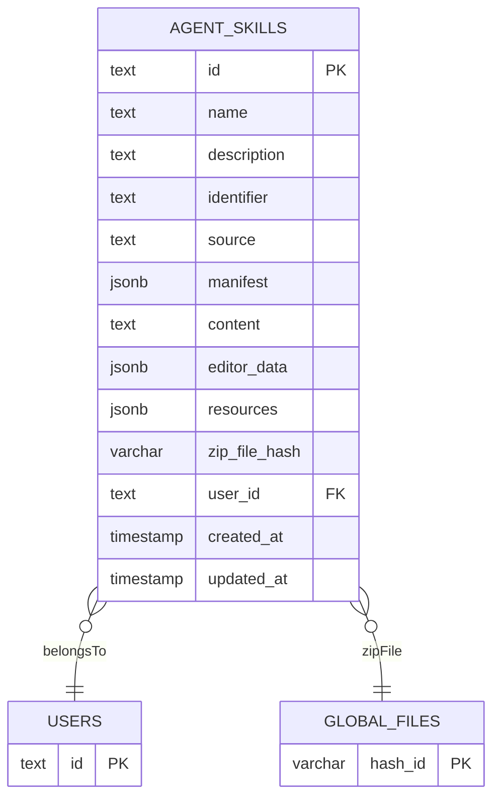
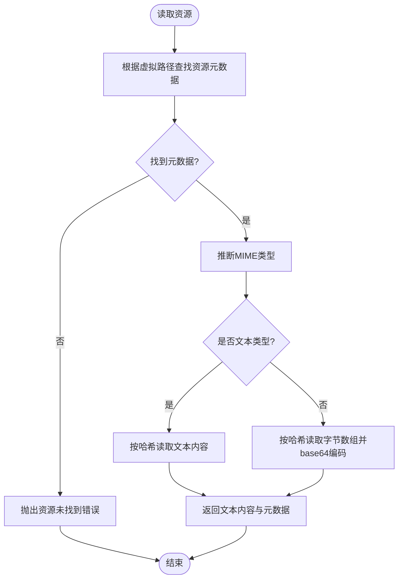
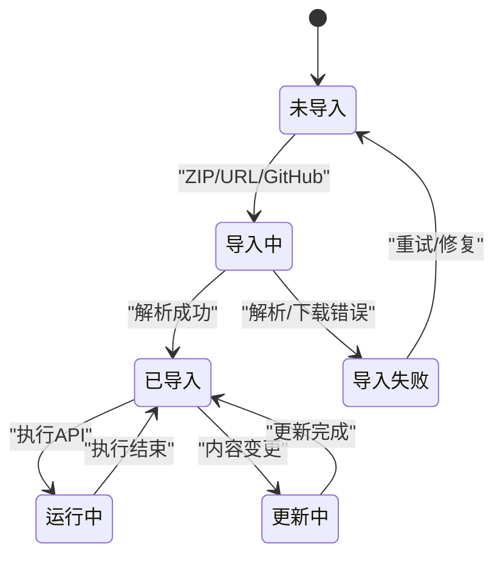
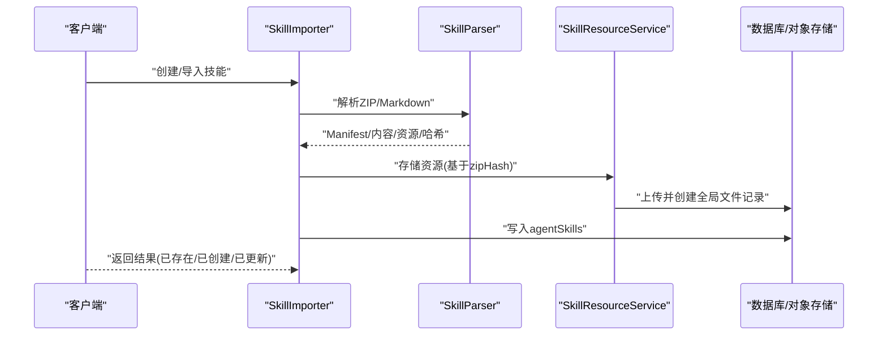
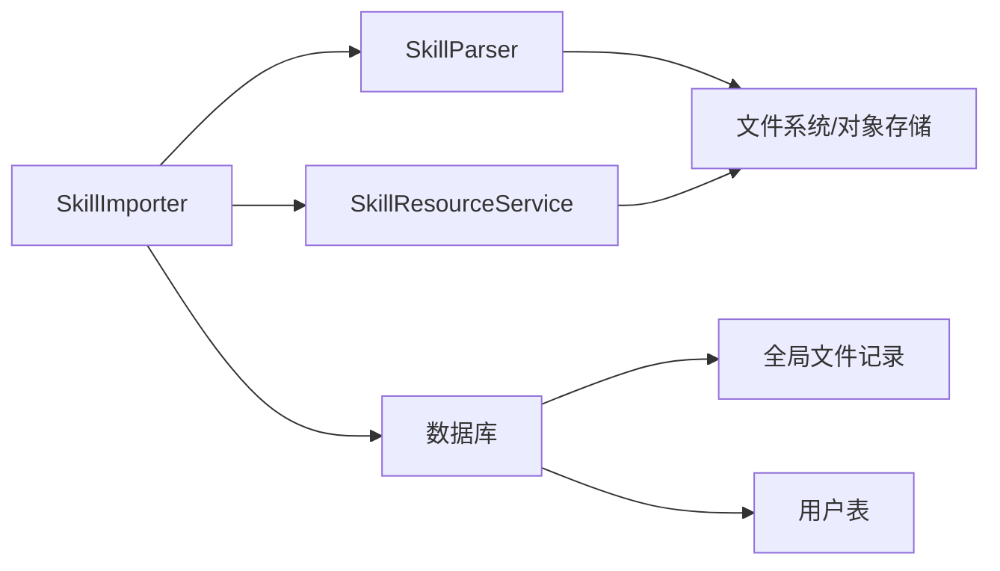

# Agent 技能模型

<cite>
**本文引用的文件**
- [packages/database/src/schemas/agentSkill.ts](file://packages/database/src/schemas/agentSkill.ts)
- [packages/builtin-tool-skills/src/types.ts](file://packages/builtin-tool-skills/src/types.ts)
- [packages/builtin-tool-skills/src/manifest.ts](file://packages/builtin-tool-skills/src/manifest.ts)
- [src/server/services/skill/importer.ts](file://src/server/services/skill/importer.ts)
- [src/server/services/skill/parser.ts](file://src/server/services/skill/parser.ts)
- [src/server/services/skill/resource.ts](file://src/server/services/skill/resource.ts)
- [src/server/services/skill/resource.test.ts](file://src/server/services/skill/resource.test.ts)
- [packages/types/src/discover/skills.ts](file://packages/types/src/discover/skills.ts)
</cite>

## 目录
1. [简介](#简介)
2. [项目结构](#项目结构)
3. [核心组件](#核心组件)
4. [架构总览](#架构总览)
5. [详细组件分析](#详细组件分析)
6. [依赖关系分析](#依赖关系分析)
7. [性能考量](#性能考量)
8. [故障排查指南](#故障排查指南)
9. [结论](#结论)
10. [附录](#附录)

## 简介
本文件面向 Agent 技能模型，系统化梳理 agentSkills 表的字段设计、技能 Manifest 结构、内容与资源存储、生命周期管理（内置、市场、用户自定义）、版本与编辑状态、文件资源关联、以及技能注册/更新/删除的完整数据流程，并给出性能优化、缓存策略与并发访问控制的设计建议。

## 项目结构
围绕 Agent 技能模型的关键模块分布如下：
- 数据层：agentSkills 表及其索引、关系
- 技能运行时与清单：内置工具技能的 Manifest 定义与 API 列表
- 导入与解析：ZIP/URL/GitHub 多来源导入、Manifest 校验、资源提取与去重
- 资源服务：资源文件上传、元数据记录、树形目录构建与内容读取
- 类型与发现：技能分类、排序、查询参数等类型定义



图表来源
- [packages/database/src/schemas/agentSkill.ts](file://packages/database/src/schemas/agentSkill.ts#L10-L57)
- [packages/builtin-tool-skills/src/manifest.ts](file://packages/builtin-tool-skills/src/manifest.ts#L13-L34)
- [packages/builtin-tool-skills/src/types.ts](file://packages/builtin-tool-skills/src/types.ts#L10-L92)
- [src/server/services/skill/importer.ts](file://src/server/services/skill/importer.ts#L25-L40)
- [src/server/services/skill/parser.ts](file://src/server/services/skill/parser.ts#L32-L124)
- [src/server/services/skill/resource.ts](file://src/server/services/skill/resource.ts#L31-L63)
- [packages/types/src/discover/skills.ts](file://packages/types/src/discover/skills.ts#L10-L96)

章节来源
- [packages/database/src/schemas/agentSkill.ts](file://packages/database/src/schemas/agentSkill.ts#L10-L57)
- [packages/builtin-tool-skills/src/manifest.ts](file://packages/builtin-tool-skills/src/manifest.ts#L13-L34)
- [packages/builtin-tool-skills/src/types.ts](file://packages/builtin-tool-skills/src/types.ts#L10-L92)
- [src/server/services/skill/importer.ts](file://src/server/services/skill/importer.ts#L25-L40)
- [src/server/services/skill/parser.ts](file://src/server/services/skill/parser.ts#L32-L124)
- [src/server/services/skill/resource.ts](file://src/server/services/skill/resource.ts#L31-L63)
- [packages/types/src/discover/skills.ts](file://packages/types/src/discover/skills.ts#L10-L96)

## 核心组件
- agentSkills 表：统一承载技能标识、名称、描述、来源、Manifest、内容、编辑态、资源映射、ZIP 文件哈希与归属信息；并建立多维索引以支持高效查询与去重。
- 技能 Manifest：内置工具技能的 API 清单、标识符、元信息与系统角色提示，确保运行时能力与权限声明一致。
- SkillImporter：多来源导入入口，负责去重、ZIP 解析、资源存储、Manifest 合成与数据库写入。
- SkillParser：ZIP 包解析、SKILL.md 提取与校验、资源文件提取、可选重打包以实现最小化存储。
- SkillResourceService：资源文件上传至对象存储、全局文件记录创建、树形目录构建、文本/二进制内容读取与按需内容填充。
- Discover Skills 类型：市场技能的分类、排序、查询参数等类型定义，支撑前端展示与检索。

章节来源
- [packages/database/src/schemas/agentSkill.ts](file://packages/database/src/schemas/agentSkill.ts#L10-L57)
- [packages/builtin-tool-skills/src/manifest.ts](file://packages/builtin-tool-skills/src/manifest.ts#L13-L34)
- [src/server/services/skill/importer.ts](file://src/server/services/skill/importer.ts#L25-L40)
- [src/server/services/skill/parser.ts](file://src/server/services/skill/parser.ts#L32-L124)
- [src/server/services/skill/resource.ts](file://src/server/services/skill/resource.ts#L31-L63)
- [packages/types/src/discover/skills.ts](file://packages/types/src/discover/skills.ts#L10-L96)

## 架构总览
下图展示从导入到存储、再到资源读取与树形展示的端到端流程。

```mermaid
sequenceDiagram
participant U as "调用方"
participant IMP as "SkillImporter"
participant PAR as "SkillParser"
participant RES as "SkillResourceService"
participant DB as "数据库/全局文件表"
U->>IMP : "导入请求(来源 : ZIP/URL/GitHub)"
IMP->>PAR : "解析ZIP/Markdown"
PAR-->>IMP : "返回Manifest/内容/资源映射/ZIP哈希"
IMP->>RES : "存储资源文件(基于zipHash去重)"
RES->>DB : "上传对象存储并创建全局文件记录"
RES-->>IMP : "返回资源元数据映射"
IMP->>DB : "写入agentSkills(含Manifest/内容/资源/ZIP哈希)"
DB-->>U : "返回技能ID/状态"
```

图表来源
- [src/server/services/skill/importer.ts](file://src/server/services/skill/importer.ts#L83-L136)
- [src/server/services/skill/parser.ts](file://src/server/services/skill/parser.ts#L77-L110)
- [src/server/services/skill/resource.ts](file://src/server/services/skill/resource.ts#L47-L63)

## 详细组件分析

### agentSkills 表字段设计与关系
- 核心标识
  - name：技能名称，配合 userId 唯一性约束，保证同一用户下名称唯一。
  - description：技能描述。
  - identifier：技能唯一标识，用于跨来源去重与定位。
- 来源控制
  - source：枚举值 builtin/market/user，区分内置、市场、用户自定义来源。
- Manifest 与内容
  - manifest：JSONB 存储技能清单，包含版本、作者、仓库、来源 URL 等元信息。
  - content：技能正文内容（如 SKILL.md 的正文部分）。
  - editorData：编辑器状态或临时编辑数据。
- 资源映射
  - resources：JSONB 记录虚拟路径到资源元数据的映射，便于执行环境定位与读取。
- 原始分发包与归属
  - zipFileHash：指向全局文件表的哈希，用于存储原始 ZIP 包并实现资源级去重。
  - userId：归属用户，级联删除保障数据一致性。
- 索引与关系
  - 唯一索引：(userId, name)
  - 普通索引：identifier、userId、source、zipFileHash
  - 关系：与 users、globalFiles 的外键关联



图表来源
- [packages/database/src/schemas/agentSkill.ts](file://packages/database/src/schemas/agentSkill.ts#L10-L57)

章节来源
- [packages/database/src/schemas/agentSkill.ts](file://packages/database/src/schemas/agentSkill.ts#L10-L57)

### 技能 Manifest 结构与内容存储
- 内置工具技能的 Manifest 包含：
  - identifier：技能标识符
  - api：API 列表（runSkill、readReference、execScript、exportFile）
  - meta：元信息
  - systemRole：系统角色提示
  - type：类型（builtin）
- 内容存储
  - SKILL.md 的正文内容保存在 content 字段
  - Manifest 元信息保存在 manifest 字段
  - 资源映射保存在 resources 字段，键为虚拟路径，值为资源元数据

章节来源
- [packages/builtin-tool-skills/src/manifest.ts](file://packages/builtin-tool-skills/src/manifest.ts#L13-L34)
- [packages/builtin-tool-skills/src/types.ts](file://packages/builtin-tool-skills/src/types.ts#L10-L92)
- [packages/database/src/schemas/agentSkill.ts](file://packages/database/src/schemas/agentSkill.ts#L25-L36)

### 资源映射机制与执行环境
- 资源映射
  - 虚拟路径到资源元数据的 JSONB 映射，便于执行环境按路径读取
- 执行 API
  - runSkill：运行技能
  - readReference：按路径读取资源内容（文本自动解码，二进制 base64）
  - execScript：执行脚本命令（需携带当前技能上下文）
  - exportFile：导出文件
- 资源读取流程
  - 通过 SkillResourceService.readResource 获取内容与元数据
  - 文本类型走文本读取，二进制类型转 base64



图表来源
- [src/server/services/skill/resource.ts](file://src/server/services/skill/resource.ts#L71-L111)

章节来源
- [packages/builtin-tool-skills/src/types.ts](file://packages/builtin-tool-skills/src/types.ts#L10-L92)
- [src/server/services/skill/resource.ts](file://src/server/services/skill/resource.ts#L71-L111)

### 技能生命周期管理（内置/市场/用户）
- 内置技能（builtin）
  - 由内置工具技能包提供，Manifest 中 type 为 builtin
  - 不涉及 ZIP 上传与资源存储，直接使用运行时能力
- 市场技能（market）
  - 通过 GitHub 或 URL 导入，source 标记为 market
  - 使用 zipFileHash 关联原始 ZIP 包，实现资源级去重
- 用户自定义技能（user）
  - 支持手动创建或从 ZIP 导入，source 标记为 user
  - 手动创建时 identifier 自动生成，导入 ZIP 时同样生成唯一 identifier 并进行去重



图表来源
- [src/server/services/skill/importer.ts](file://src/server/services/skill/importer.ts#L143-L276)
- [src/server/services/skill/parser.ts](file://src/server/services/skill/parser.ts#L77-L110)

章节来源
- [src/server/services/skill/importer.ts](file://src/server/services/skill/importer.ts#L45-L76)
- [src/server/services/skill/importer.ts](file://src/server/services/skill/importer.ts#L83-L136)
- [src/server/services/skill/importer.ts](file://src/server/services/skill/importer.ts#L143-L276)
- [src/server/services/skill/importer.ts](file://src/server/services/skill/importer.ts#L283-L457)

### 版本管理、内容编辑状态与文件资源关联
- 版本管理
  - Manifest 中可包含版本号与仓库信息，GitHub 导入时会补充仓库与来源 URL
- 内容编辑状态
  - editorData 字段用于保存编辑器状态或临时编辑数据
- 文件资源关联
  - resources 字段记录虚拟路径到资源元数据映射
  - zipFileHash 关联全局文件记录，支持 ZIP 级去重与资源复用

章节来源
- [packages/database/src/schemas/agentSkill.ts](file://packages/database/src/schemas/agentSkill.ts#L25-L41)
- [src/server/services/skill/importer.ts](file://src/server/services/skill/importer.ts#L176-L275)

### 技能注册、更新、删除的完整数据流程
- 注册（新建）
  - 用户手动创建：校验名称唯一性，生成 identifier，写入 agentSkills
  - ZIP 导入：下载本地 -> 解析 -> 存储资源 -> 创建记录
  - URL/GitHub 导入：解析内容 -> 校验去重 -> 存储资源与 ZIP -> 创建记录
- 更新
  - ZIP/GitHub：若 zipHash 或内容变化则更新
  - URL：若内容或 ZIP 哈希相同则跳过
- 删除
  - 通过用户级联删除（agentSkills.userId 外键级联删除），清理技能记录
  - 资源文件与 ZIP 包由对象存储与全局文件记录维护，不强制删除，避免误删共享资源



图表来源
- [src/server/services/skill/importer.ts](file://src/server/services/skill/importer.ts#L45-L76)
- [src/server/services/skill/importer.ts](file://src/server/services/skill/importer.ts#L83-L136)
- [src/server/services/skill/importer.ts](file://src/server/services/skill/importer.ts#L143-L276)
- [src/server/services/skill/importer.ts](file://src/server/services/skill/importer.ts#L283-L457)
- [src/server/services/skill/parser.ts](file://src/server/services/skill/parser.ts#L77-L110)
- [src/server/services/skill/resource.ts](file://src/server/services/skill/resource.ts#L47-L63)

章节来源
- [src/server/services/skill/importer.ts](file://src/server/services/skill/importer.ts#L45-L76)
- [src/server/services/skill/importer.ts](file://src/server/services/skill/importer.ts#L83-L136)
- [src/server/services/skill/importer.ts](file://src/server/services/skill/importer.ts#L143-L276)
- [src/server/services/skill/importer.ts](file://src/server/services/skill/importer.ts#L283-L457)

## 依赖关系分析
- 组件耦合
  - SkillImporter 依赖 SkillParser 与 SkillResourceService，形成“解析-存储-写库”的流水线
  - agentSkills 表与 users、globalFiles 存在外键关系，确保归属与资源引用一致性
- 外部依赖
  - 对象存储（用于资源与 ZIP 包上传）
  - GitHub 下载与仓库解析模块
  - MIME 类型检测与 SHA256 哈希计算



图表来源
- [src/server/services/skill/importer.ts](file://src/server/services/skill/importer.ts#L25-L40)
- [src/server/services/skill/parser.ts](file://src/server/services/skill/parser.ts#L32-L124)
- [src/server/services/skill/resource.ts](file://src/server/services/skill/resource.ts#L31-L63)
- [packages/database/src/schemas/agentSkill.ts](file://packages/database/src/schemas/agentSkill.ts#L59-L68)

章节来源
- [src/server/services/skill/importer.ts](file://src/server/services/skill/importer.ts#L25-L40)
- [src/server/services/skill/parser.ts](file://src/server/services/skill/parser.ts#L32-L124)
- [src/server/services/skill/resource.ts](file://src/server/services/skill/resource.ts#L31-L63)
- [packages/database/src/schemas/agentSkill.ts](file://packages/database/src/schemas/agentSkill.ts#L59-L68)

## 性能考量
- 哈希与去重
  - ZIP 与资源均采用 SHA256 哈希作为去重与索引依据，减少重复存储与网络传输
- 索引优化
  - 唯一索引 (userId, name) 避免同用户重复命名
  - 普通索引 (identifier, userId, source, zipFileHash) 支持快速查询与去重
- 异步与并发
  - 资源存储采用逐项处理与日志追踪，便于监控与限流
  - 目录树构建与内容填充支持按需加载，避免一次性读取全部资源
- 缓存策略
  - 对象存储层面可利用 CDN 缓存静态资源
  - 业务层可对常用资源元数据与 ZIP 哈希进行短期缓存，降低重复解析成本
- 并发访问控制
  - 导入流程中对名称与 identifier 做幂等检查，避免并发写入冲突
  - ZIP 重打包与上传过程建议加分布式锁或队列化处理，防止重复任务

[本节为通用性能建议，无需特定文件引用]

## 故障排查指南
- 资源读取异常
  - 现象：按虚拟路径读取资源时报“资源未找到”
  - 排查：确认 resources 映射中是否存在该路径；检查 MIME 类型判断逻辑
- ZIP 解析失败
  - 现象：导入 ZIP 时找不到 SKILL.md 或解析错误
  - 排查：确认 ZIP 结构、SKILL.md 路径（根目录、子目录、GitHub basePath）；检查解析选项（重打包、基础路径）
- 去重与更新问题
  - 现象：导入后未创建新记录或未触发更新
  - 排查：核对 zipHash 与内容哈希是否变化；确认 identifier 是否重复；检查 source 字段是否符合预期
- 资源树构建异常
  - 现象：目录树层级不正确或内容缺失
  - 排查：参考单元测试用例，验证嵌套目录、根文件、混合结构的构建逻辑

章节来源
- [src/server/services/skill/resource.ts](file://src/server/services/skill/resource.ts#L71-L111)
- [src/server/services/skill/parser.ts](file://src/server/services/skill/parser.ts#L174-L237)
- [src/server/services/skill/importer.ts](file://src/server/services/skill/importer.ts#L195-L204)
- [src/server/services/skill/resource.test.ts](file://src/server/services/skill/resource.test.ts#L32-L225)

## 结论
Agent 技能模型通过 agentSkills 表统一承载技能标识、来源、Manifest、内容与资源映射，并结合 ZIP 哈希实现资源级去重与高效存储。内置、市场与用户自定义三类来源通过 source 字段与导入流程清晰分离，配合严格的去重与索引策略，满足多来源协同与高并发场景下的稳定性与性能需求。

## 附录
- 市场技能分类与查询参数
  - 分类枚举覆盖多个领域（如 AI-LLMs、DevOps、数据可视化等）
  - 查询参数支持分类筛选、排序方式、关键词搜索与分页

章节来源
- [packages/types/src/discover/skills.ts](file://packages/types/src/discover/skills.ts#L10-L96)