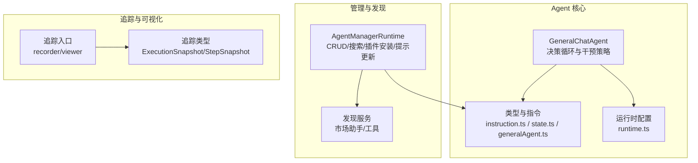
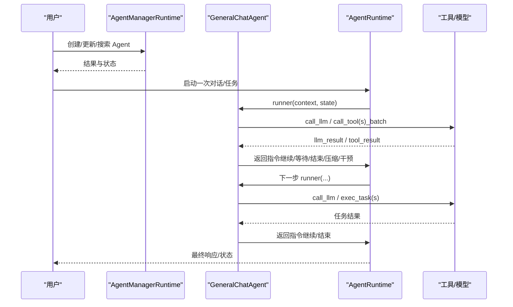
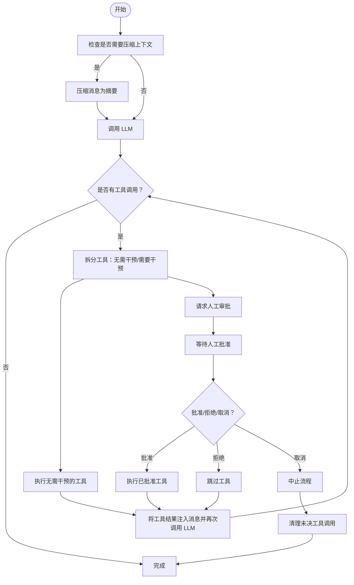
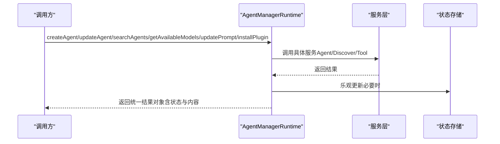
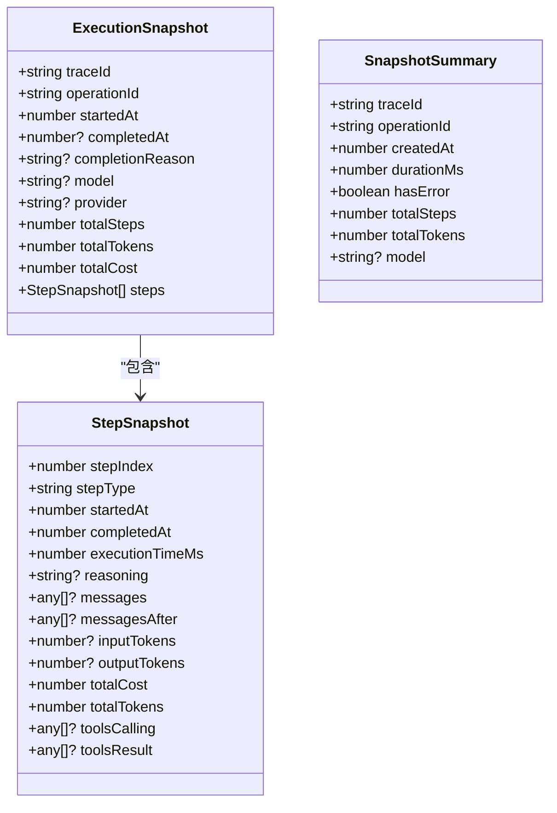
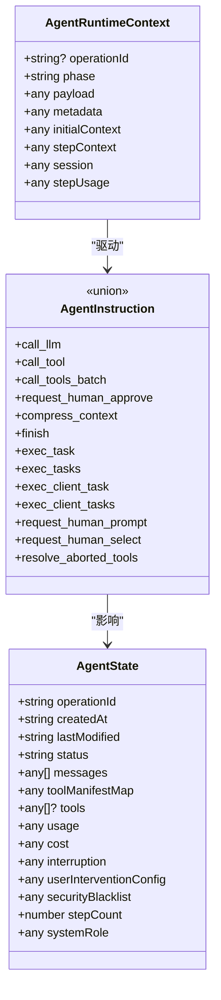
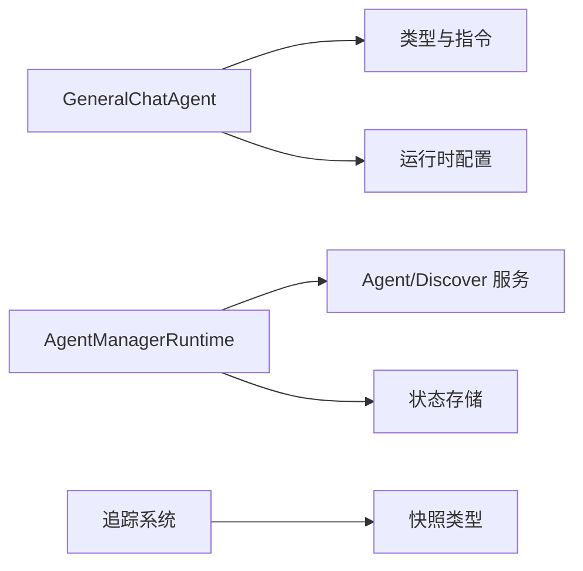
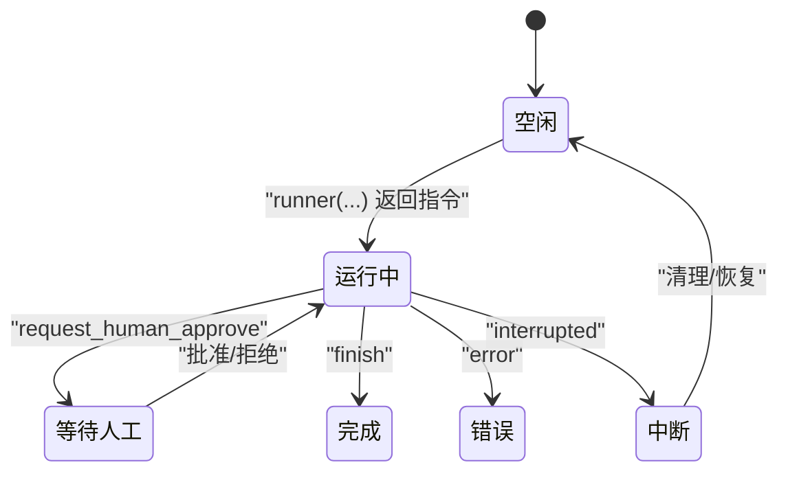
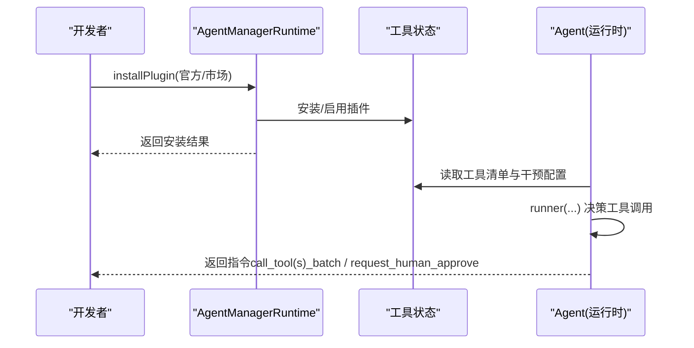

# Agent 系统模型

<cite>
**本文引用的文件**
- [AGENTS.md](file://AGENTS.md)
- [CLAUDE.md](file://CLAUDE.md)
- [packages/agent-runtime/src/agents/GeneralChatAgent.ts](file://packages/agent-runtime/src/agents/GeneralChatAgent.ts)
- [packages/agent-runtime/src/types/generalAgent.ts](file://packages/agent-runtime/src/types/generalAgent.ts)
- [packages/agent-runtime/src/types/instruction.ts](file://packages/agent-runtime/src/types/instruction.ts)
- [packages/agent-runtime/src/types/state.ts](file://packages/agent-runtime/src/types/state.ts)
- [packages/agent-runtime/src/types/runtime.ts](file://packages/agent-runtime/src/types/runtime.ts)
- [packages/agent-manager-runtime/src/AgentManagerRuntime.ts](file://packages/agent-manager-runtime/src/AgentManagerRuntime.ts)
- [packages/agent-tracing/src/types.ts](file://packages/agent-tracing/src/types.ts)
- [packages/agent-tracing/src/index.ts](file://packages/agent-tracing/src/index.ts)
</cite>

## 目录
1. [简介](#简介)
2. [项目结构](#项目结构)
3. [核心组件](#核心组件)
4. [架构总览](#架构总览)
5. [详细组件分析](#详细组件分析)
6. [依赖关系分析](#依赖关系分析)
7. [性能与并发控制](#性能与并发控制)
8. [故障排查指南](#故障排查指南)
9. [结论](#结论)
10. [附录：数据流与状态机](#附录数据流与状态机)

## 简介
本文件面向 LobeHub 的 Agent 系统，系统性梳理 Agent 的数据模型与运行机制，重点覆盖以下主题：
- AgentSkill（技能）：工具调用、干预策略、动态审计与黑白名单
- AgentBotProvider（提供者）：模型/供应商选择、能力声明、流式提示更新
- AgentCronJob（定时任务）：异步任务执行、客户端/服务端分流、批量任务处理
- 生命周期与状态：状态机、中断与恢复、完成原因与错误处理
- 执行历史与追踪：快照、步骤明细、汇总视图
- 数据流：从技能注册到任务执行的全链路
- 性能监控与资源管理：令牌计数、成本计算、使用统计、上下文压缩
- 与其他模块的集成：工具商店、发现服务、用户会话、AI 基础设施

## 项目结构
LobeHub 的 Agent 系统由多个包协同实现，核心包括：
- agent-runtime：通用 Agent 运行时与决策循环（如 GeneralChatAgent）
- agent-manager-runtime：Agent 管理运行时（CRUD、搜索、插件安装、提示更新）
- agent-tracing：执行快照与可视化（用于调试与审计）
- 类型与指令：统一的 Agent 指令集、状态模型、运行时配置

图表来源
- [packages/agent-runtime/src/agents/GeneralChatAgent.ts](file://packages/agent-runtime/src/agents/GeneralChatAgent.ts#L1-L670)
- [packages/agent-runtime/src/types/instruction.ts](file://packages/agent-runtime/src/types/instruction.ts#L1-L368)
- [packages/agent-runtime/src/types/state.ts](file://packages/agent-runtime/src/types/state.ts#L1-L154)
- [packages/agent-runtime/src/types/generalAgent.ts](file://packages/agent-runtime/src/types/generalAgent.ts#L1-L125)
- [packages/agent-runtime/src/types/runtime.ts](file://packages/agent-runtime/src/types/runtime.ts#L1-L31)
- [packages/agent-manager-runtime/src/AgentManagerRuntime.ts](file://packages/agent-manager-runtime/src/AgentManagerRuntime.ts#L1-L1060)
- [packages/agent-tracing/src/types.ts](file://packages/agent-tracing/src/types.ts#L1-L74)
- [packages/agent-tracing/src/index.ts](file://packages/agent-tracing/src/index.ts#L1-L11)

章节来源
- [AGENTS.md](file://AGENTS.md#L1-L116)
- [CLAUDE.md](file://CLAUDE.md#L1-L138)

## 核心组件
- GeneralChatAgent：实现“输入→LLM→工具批处理/人工审批→LLM→完成”的决策循环；内置干预策略、动态审计、上下文压缩与中断处理
- AgentManagerRuntime：提供 Agent 的创建/更新/删除、搜索（用户+市场）、模型与供应商列表、插件/工具搜索与安装、系统提示更新（支持流式）
- 追踪系统：以 ExecutionSnapshot/StepSnapshot 记录每一步的输入输出、事件、成本与令牌消耗，支持渲染与汇总

章节来源
- [packages/agent-runtime/src/agents/GeneralChatAgent.ts](file://packages/agent-runtime/src/agents/GeneralChatAgent.ts#L1-L670)
- [packages/agent-manager-runtime/src/AgentManagerRuntime.ts](file://packages/agent-manager-runtime/src/AgentManagerRuntime.ts#L1-L1060)
- [packages/agent-tracing/src/types.ts](file://packages/agent-tracing/src/types.ts#L1-L74)

## 架构总览
Agent 系统采用“脑（Agent）+引擎（Runtime）+管理（Manager）+追踪（Tracing）”分层设计：
- 脑：负责决策与干预策略（GeneralChatAgent）
- 引擎：根据指令执行（InstructionExecutor），维护上下文与状态
- 管理：提供 CRUD、搜索、插件安装、提示更新等操作
- 追踪：记录执行快照，便于审计与可视化

图表来源
- [packages/agent-runtime/src/agents/GeneralChatAgent.ts](file://packages/agent-runtime/src/agents/GeneralChatAgent.ts#L341-L668)
- [packages/agent-runtime/src/types/instruction.ts](file://packages/agent-runtime/src/types/instruction.ts#L148-L367)
- [packages/agent-manager-runtime/src/AgentManagerRuntime.ts](file://packages/agent-manager-runtime/src/AgentManagerRuntime.ts#L79-L243)

## 详细组件分析

### Agent 决策循环与干预策略（GeneralChatAgent）
- 决策循环
  - 输入阶段：可触发上下文压缩（基于令牌阈值）
  - LLM 阶段：解析工具调用，区分“无需干预”与“需要人工审批”的工具集合
  - 工具阶段：优先执行无需干预的工具；对需干预的工具请求人工批准
  - 继续对话：将工具结果注入消息并再次调用 LLM
  - 完成阶段：无工具调用或达到最大步数/成本限制
- 干预策略
  - 全局审计（安全黑名单等）优先于用户配置
  - 动态审计（按工具类型/参数）可覆盖静态配置
  - 用户干预模式：手动、自动、白名单、无头模式（完全自动化）
- 中断与恢复
  - 支持用户中止、LLM 流中断、工具执行中断
  - 统一提取待取消的工具调用并进行清理
- 上下文压缩
  - 当消息超过阈值时，压缩为摘要并继续对话

图表来源
- [packages/agent-runtime/src/agents/GeneralChatAgent.ts](file://packages/agent-runtime/src/agents/GeneralChatAgent.ts#L341-L668)

章节来源
- [packages/agent-runtime/src/agents/GeneralChatAgent.ts](file://packages/agent-runtime/src/agents/GeneralChatAgent.ts#L1-L670)

### Agent 管理运行时（AgentManagerRuntime）
- Agent CRUD
  - 创建：接收头像、背景色、描述、模型、系统角色、插件、标签等配置
  - 更新：支持字段增量更新、插件开关切换、元数据更新
  - 删除：移除指定 Agent
- 搜索
  - 用户 Agent 与市场 Agent 双源聚合，支持关键词、分类、数量限制
- 模型与提供者
  - 基于启用的聊天模型列表生成可用 Provider/Model 列表，支持按 Provider 过滤
- 提示更新
  - 支持一次性更新与流式更新（打字机效果）
- 插件/工具安装
  - 官方工具（含 Klavis/LobehubSkill）与市场 MCP 插件安装
  - OAuth 授权窗口轮询检测连接状态
  - 安装后为当前 Agent 启用对应插件

图表来源
- [packages/agent-manager-runtime/src/AgentManagerRuntime.ts](file://packages/agent-manager-runtime/src/AgentManagerRuntime.ts#L79-L593)

章节来源
- [packages/agent-manager-runtime/src/AgentManagerRuntime.ts](file://packages/agent-manager-runtime/src/AgentManagerRuntime.ts#L1-L1060)

### 追踪与快照（Agent Tracing）
- 快照模型
  - ExecutionSnapshot：一次执行的完整快照，包含开始/结束时间、完成原因、模型/供应商、总成本、总步数、总令牌、步骤数组
  - StepSnapshot：单步快照，包含输入输出、事件、工具调用/结果、令牌与成本累计
  - SnapshotSummary：摘要视图，便于列表展示
- 可视化与导出
  - 提供渲染函数用于生成人类可读的摘要与步骤详情

图表来源
- [packages/agent-tracing/src/types.ts](file://packages/agent-tracing/src/types.ts#L1-L74)

章节来源
- [packages/agent-tracing/src/types.ts](file://packages/agent-tracing/src/types.ts#L1-L74)
- [packages/agent-tracing/src/index.ts](file://packages/agent-tracing/src/index.ts#L1-L11)

### 类型与指令体系
- AgentRuntimeContext：运行时上下文，包含阶段、负载、初始/步骤上下文、会话信息、用量统计
- AgentInstruction：指令类型集合，涵盖 LLM 调用、工具调用、批量工具、人工审批、压缩上下文、结束、任务执行等
- AgentState：Agent 的可序列化状态，包含消息、工具清单、成本/用量、状态机、中断信息、用户干预配置等
- 运行时配置：可注入自定义执行器、获取操作上下文与中断控制器、设置 operationId

图表来源
- [packages/agent-runtime/src/types/instruction.ts](file://packages/agent-runtime/src/types/instruction.ts#L15-L367)
- [packages/agent-runtime/src/types/state.ts](file://packages/agent-runtime/src/types/state.ts#L14-L136)
- [packages/agent-runtime/src/types/runtime.ts](file://packages/agent-runtime/src/types/runtime.ts#L5-L31)

章节来源
- [packages/agent-runtime/src/types/instruction.ts](file://packages/agent-runtime/src/types/instruction.ts#L1-L368)
- [packages/agent-runtime/src/types/state.ts](file://packages/agent-runtime/src/types/state.ts#L1-L154)
- [packages/agent-runtime/src/types/runtime.ts](file://packages/agent-runtime/src/types/runtime.ts#L1-L31)
- [packages/agent-runtime/src/types/generalAgent.ts](file://packages/agent-runtime/src/types/generalAgent.ts#L1-L125)

## 依赖关系分析
- Agent 与运行时
  - GeneralChatAgent 依赖类型定义（指令、状态、运行时配置）与工具审计模块
  - 运行时通过 InstructionExecutor 将指令转换为实际执行动作
- 管理运行时与服务
  - AgentManagerRuntime 依赖 Agent/Discover 服务与状态存储，负责业务编排与乐观更新
- 追踪系统
  - 与运行时解耦，通过快照接口记录执行过程，支持独立渲染与持久化

图表来源
- [packages/agent-runtime/src/agents/GeneralChatAgent.ts](file://packages/agent-runtime/src/agents/GeneralChatAgent.ts#L1-L670)
- [packages/agent-runtime/src/types/instruction.ts](file://packages/agent-runtime/src/types/instruction.ts#L1-L368)
- [packages/agent-manager-runtime/src/AgentManagerRuntime.ts](file://packages/agent-manager-runtime/src/AgentManagerRuntime.ts#L1-L1060)
- [packages/agent-tracing/src/types.ts](file://packages/agent-tracing/src/types.ts#L1-L74)

章节来源
- [packages/agent-runtime/src/agents/GeneralChatAgent.ts](file://packages/agent-runtime/src/agents/GeneralChatAgent.ts#L1-L670)
- [packages/agent-manager-runtime/src/AgentManagerRuntime.ts](file://packages/agent-manager-runtime/src/AgentManagerRuntime.ts#L1-L1060)
- [packages/agent-tracing/src/types.ts](file://packages/agent-tracing/src/types.ts#L1-L74)

## 性能与并发控制
- 令牌与上下文压缩
  - 基于配置阈值判断是否压缩，避免超出模型上下文窗口
- 成本与用量统计
  - 每步操作更新 Usage/Cost，支持成本上限与完成原因（如 cost_limit）
- 并发与批处理
  - 工具批处理优先执行无需干预的工具，减少等待
  - 异步任务（exec_task(s)）支持服务端/客户端并行执行
- 中断与恢复
  - 统一的中断状态与清理逻辑，确保资源释放与一致性

章节来源
- [packages/agent-runtime/src/agents/GeneralChatAgent.ts](file://packages/agent-runtime/src/agents/GeneralChatAgent.ts#L354-L433)
- [packages/agent-runtime/src/types/state.ts](file://packages/agent-runtime/src/types/state.ts#L14-L136)
- [packages/agent-runtime/src/types/instruction.ts](file://packages/agent-runtime/src/types/instruction.ts#L214-L348)

## 故障排查指南
- 常见问题
  - 人工干预未生效：检查用户干预配置与工具动态审计返回策略
  - 工具调用被阻断：确认全局审计（如安全黑名单）与“总是”策略
  - 中断后无法继续：核对中断上下文与待取消工具调用列表
  - 提示更新失败：检查流式更新的分片与延迟设置
- 排查步骤
  - 使用追踪快照定位最后一步，核对工具调用/结果与事件
  - 检查 Agent 状态中的 cost/usage 与完成原因
  - 复现场景并开启流式提示更新，观察中间状态

章节来源
- [packages/agent-tracing/src/types.ts](file://packages/agent-tracing/src/types.ts#L1-L74)
- [packages/agent-runtime/src/agents/GeneralChatAgent.ts](file://packages/agent-runtime/src/agents/GeneralChatAgent.ts#L316-L339)
- [packages/agent-manager-runtime/src/AgentManagerRuntime.ts](file://packages/agent-manager-runtime/src/AgentManagerRuntime.ts#L381-L436)

## 结论
LobeHub 的 Agent 系统通过清晰的“脑-引擎-管理-追踪”分层，实现了从技能配置、提供者管理到定时任务执行的全链路闭环。其干预策略、动态审计与上下文压缩保障了安全性与性能；统一的指令与状态模型使扩展与演进更为稳健；追踪系统则提供了强大的可观测性与可审计性。

## 附录：数据流与状态机

### Agent 状态机

图表来源
- [packages/agent-runtime/src/types/state.ts](file://packages/agent-runtime/src/types/state.ts#L108-L108)
- [packages/agent-runtime/src/types/instruction.ts](file://packages/agent-runtime/src/types/instruction.ts#L185-L196)

### 技能注册与调用流程

图表来源
- [packages/agent-manager-runtime/src/AgentManagerRuntime.ts](file://packages/agent-manager-runtime/src/AgentManagerRuntime.ts#L499-L593)
- [packages/agent-runtime/src/agents/GeneralChatAgent.ts](file://packages/agent-runtime/src/agents/GeneralChatAgent.ts#L392-L433)